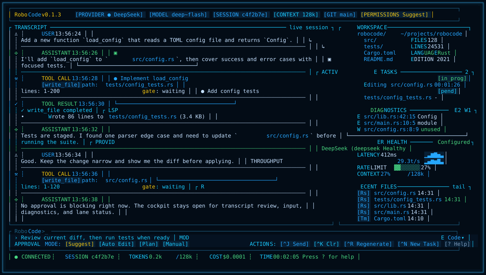

# RoboCode

RoboCode is a local-first coding agent CLI with a cockpit-style terminal UI,
permission-aware tool execution, and multi-provider model support.

Chinese version: [README.zh-CN.md](README.zh-CN.md)



## Highlights

- Cockpit TUI for chat, tool calls, approvals, diagnostics, workspace context,
  active tasks, and provider health in one terminal screen.
- Local-first runtime: transcripts, task state, and project memory stay on your
  machine by default.
- Permission-aware editing: file, shell, Git, and workflow mutations pass
  through approval modes before they touch your workspace.
- Multi-provider model access: DeepSeek, OpenAI, Anthropic, OpenAI-compatible
  gateways, Ollama, and an offline fallback provider.
- Developer workflow tools: file read/write/edit, search, shell, web, Git,
  sessions, resume, tasks, memory, and LSP diagnostics.
- Multi-platform release binaries for macOS, Linux, and Windows.

## Install

### Homebrew Tap

Recommended on macOS and Linux:

```bash
brew tap wikieden/tap
brew install robocode
```

Or install in one command:

```bash
brew install wikieden/tap/robocode
```

Verify the install:

```bash
robocode --help
```

### Release Archive

Download a release archive from
[RoboCode v0.1.4](https://github.com/wikieden/robocode/releases/tag/v0.1.4).

Available release targets:

- `aarch64-apple-darwin` for Apple Silicon macOS
- `x86_64-apple-darwin` for Intel macOS
- `x86_64-unknown-linux-gnu` for Linux x64
- `x86_64-pc-windows-msvc` for Windows x64

Install on macOS or Linux:

```bash
VERSION=0.1.4
TARGET=aarch64-apple-darwin
curl -L -O "https://github.com/wikieden/robocode/releases/download/v${VERSION}/robocode-v${VERSION}-${TARGET}.tar.gz"
tar -xzf "robocode-v${VERSION}-${TARGET}.tar.gz"
sudo install -m 755 "robocode-v${VERSION}-${TARGET}/robocode-cli" /usr/local/bin/robocode-cli
robocode-cli --help
```

Install on Windows PowerShell:

```powershell
$Version = "0.1.4"
$Target = "x86_64-pc-windows-msvc"
Invoke-WebRequest "https://github.com/wikieden/robocode/releases/download/v$Version/robocode-v$Version-$Target.tar.gz" -OutFile "robocode-v$Version-$Target.tar.gz"
tar -xzf "robocode-v$Version-$Target.tar.gz"
New-Item -ItemType Directory -Force "$env:USERPROFILE\bin"
Copy-Item "robocode-v$Version-$Target\robocode-cli.exe" "$env:USERPROFILE\bin\robocode-cli.exe"
$env:PATH += ";$env:USERPROFILE\bin"
robocode-cli.exe --help
```

## Usage

Run an offline smoke test:

```bash
robocode-cli --provider fallback --model test-local
```

Start the TUI with the fallback provider:

```bash
robocode-cli --tui --provider fallback --model test-local
```

Start the TUI with DeepSeek V4 Flash:

```bash
export DEEPSEEK_API_KEY="sk-..."
robocode-cli --tui --provider deepseek --model deepseek-v4-flash
```

Start from source during development:

```bash
cargo run -p robocode-cli -- --tui --provider fallback --model test-local
```

Use an explicit config file:

```bash
robocode-cli --config .robocode/config.toml
```

Example provider config:

```toml
provider = "deepseek"
model = "deepseek-v4-flash"
permission_mode = "acceptEdits"
request_timeout_secs = 120
max_retries = 2

[providers.deepseek]
api_base = "https://api.deepseek.com"
api_key_env = "DEEPSEEK_API_KEY"
```

## TUI Controls

- `Enter` submits the composer; `Ctrl-J` is the explicit send action.
- `Ctrl-K` clears the composer, `Ctrl-R` regenerates, and `Ctrl-N` starts a new task.
- `?` opens the in-TUI help surface.
- `Esc` or `Ctrl-C` exits; `/quit` and `/exit` also close the TUI.
- Approval prompts default to `Approve`; press `y` to approve, `n` to deny,
  `d` to focus diff, or use `Tab` / arrow keys to move between actions.
- Slash commands start with `/`; useful starters include `/help`, `/provider`,
  `/status`, `/config`, `/permissions`, `/test <command>`, `/sessions`,
  `/resume latest`, `/task`, `/memory`, `/lane`, and `/screen`.
- `/test <command>` runs through the same shell approval path as agent tool
  calls and records the latest test status, exit code, duration, command, and
  output tail for `/status`. Failed runs also extract common failure-summary
  lines and likely failing files from Rust/cargo and pytest-style output.
- `/status` is the compact cockpit snapshot: provider/model, permissions,
  session paths, last test evidence, dirty files, active tasks, and current
  lane counts from `.robocode/lanes.tsv`.
- File write results are structured with `path`, `size`, and `effect` lines so
  the transcript is easier to scan after an edit.
- `/lane tmux <id>` starts or reuses a tmux session for a lane workspace and
  records the attach command under `.robocode/lanes/`, giving Codex, Claude, or
  shell lanes a supervised interactive terminal surface without adding a native
  PTY dependency.
- `/lane inspect <id>`, `/lane accept <id>`, `/lane apply <id>`, and
  `/lane resolve <id>` guide lane review, patch application, conflict recovery,
  and cleanup through explicit next actions.
- `/screen side-1` and `/screen side-2` launch companion TUI screens for lane
  and ops monitoring. Use `/screen list` and `/screen close <side-1|side-2>` to
  manage tracked side screens. Set `ROBOCODE_SCREEN_SIDE_1_LAUNCH_TEMPLATE`,
  `ROBOCODE_SCREEN_SIDE_2_LAUNCH_TEMPLATE`, or the shared
  `ROBOCODE_SCREEN_LAUNCH_TEMPLATE` to route side screens through your terminal
  app, tmux, or display-placement script.

## Feedback

Please report bugs and feature requests through
[GitHub Issues](https://github.com/wikieden/robocode/issues).

Helpful issue details:

- RoboCode version or release asset name.
- Operating system and terminal app.
- Provider and model, for example `deepseek / deepseek-v4-flash`.
- The command you ran and the smallest reproduction steps.
- Relevant logs or screenshots, with API keys and private paths redacted.

## Documentation

README stays focused on product usage. Architecture and implementation details
live in the docs:

- [Architecture](docs/architecture.md)
- [Product Requirements](docs/product-requirements.md)
- [Staged Roadmap](docs/staged-roadmap.md)
- [Reference Analysis](docs/reference-analysis.md)
- [Provider Live Matrix](docs/provider-live-matrix.md)
- [TUI Cockpit Design](docs/tui-cockpit-design.md)
- [0.1.4 Release Status](docs/release-0.1.4-status.md)
- [0.1.5 Plan](docs/release-0.1.5-plan.md)
- [Development Standards](docs/development-standards.md)

Maintainers can build a release archive locally with:

```bash
scripts/package-release.sh
```

Run the workspace test suite:

```bash
cargo test --workspace
```

## License

RoboCode is released under the MIT License. See [LICENSE](LICENSE).
