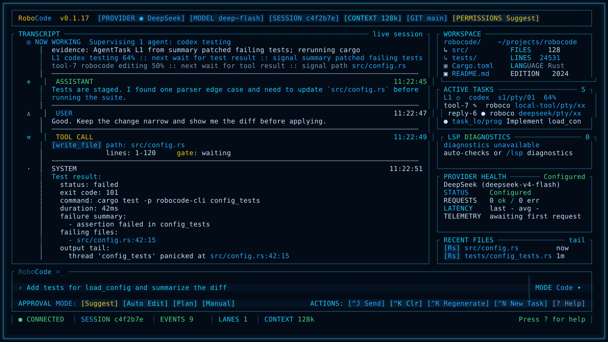
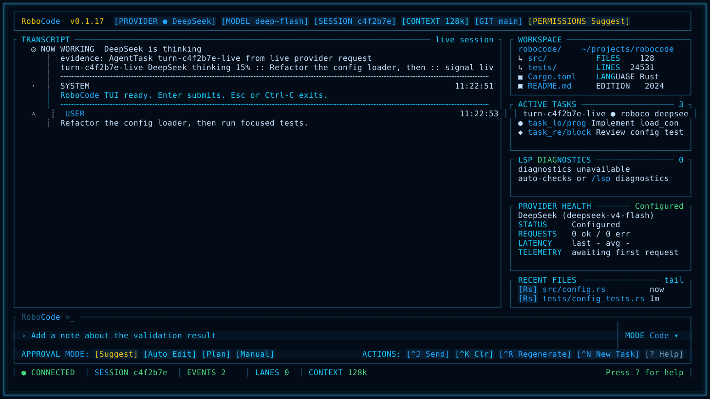
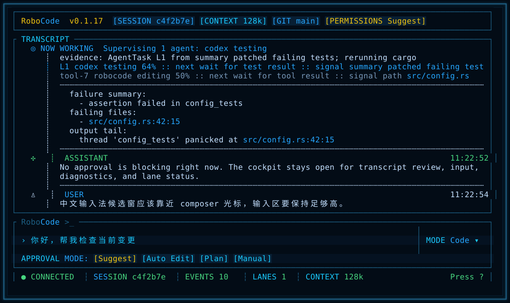
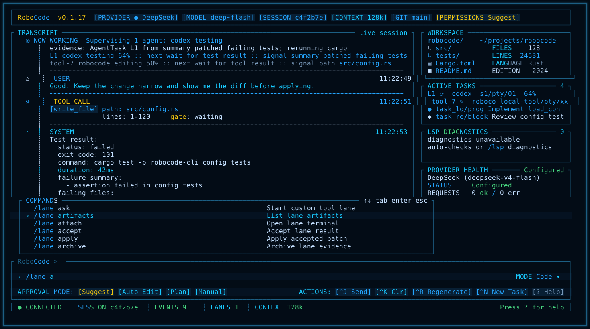
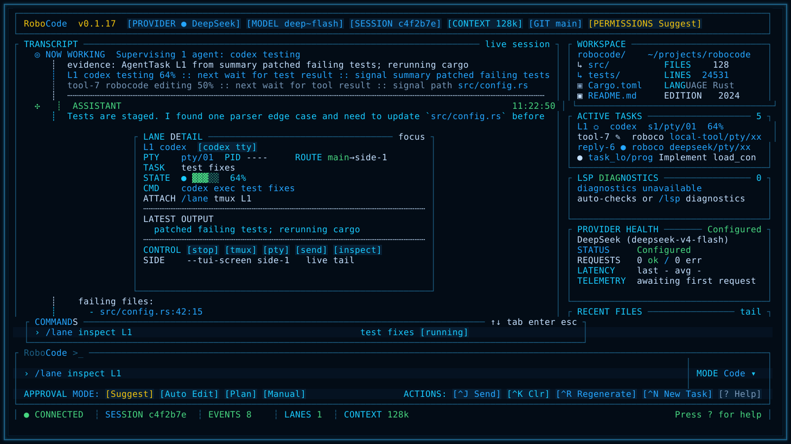
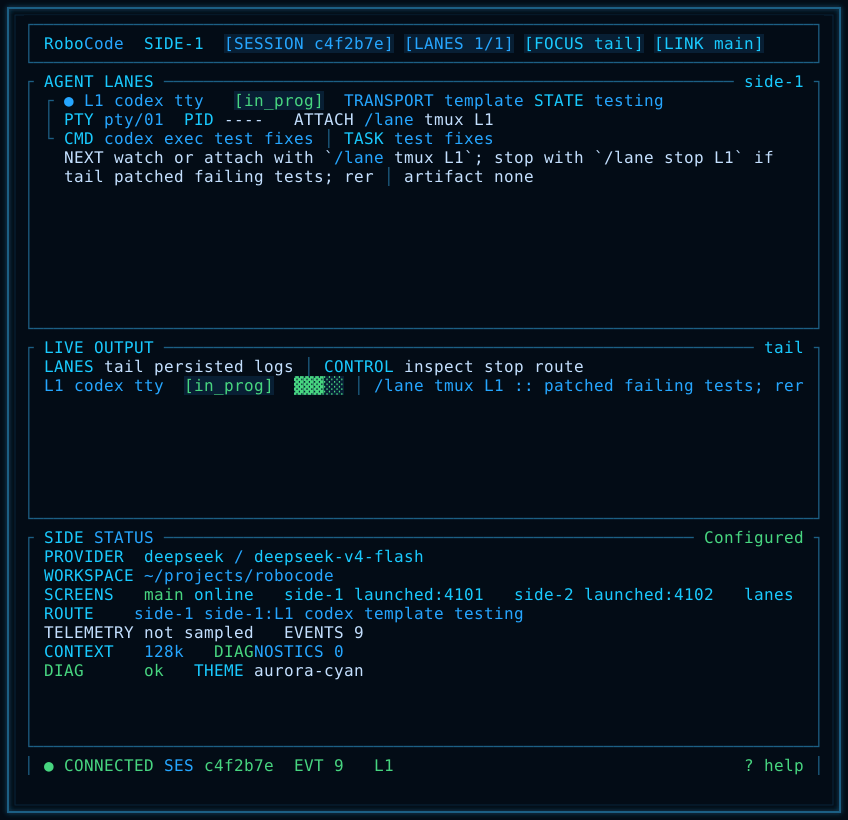
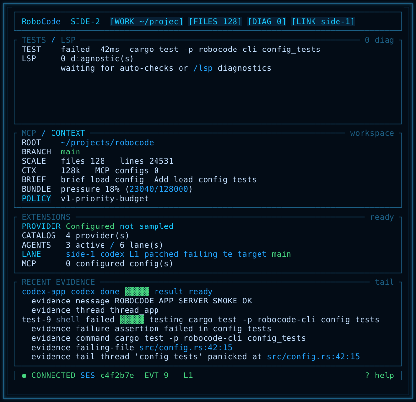

# RoboCode

RoboCode is a local-first coding-agent cockpit for developers who want one
terminal surface to chat with a model, approve real workspace changes, supervise
delegated agents, and keep enough evidence to resume work later.

Chinese version: [README.zh-CN.md](README.zh-CN.md)



## Why It Exists

Most coding agents are good at a single conversation. RoboCode is built around a
slightly different job: coordinating programming work. It keeps the active
conversation, tool effects, approvals, tests, tasks, memory, provider health,
and external agent lanes visible in one operator cockpit.

## Highlights

- Cockpit TUI: transcript, approval state, workspace snapshot, active tasks,
  diagnostics, provider health, and recent evidence stay visible together.
- Real tool execution: file read/write/edit, search, shell, web, Git, LSP, test
  commands, task state, and memory all run through the shared runtime path.
- Permission-aware edits: mutating file, shell, Git, workflow, and delegated
  agent actions are mediated by permission modes before they affect the
  workspace.
- Multi-provider runtime: DeepSeek, OpenAI, Anthropic, OpenAI-compatible
  gateways, Ollama, and offline fallback are available through one provider
  interface, with provider registry diagnostics.
- Agent supervision lanes: Codex, Claude, custom shell/template lanes, tmux,
  embedded PTY, and experimental ACP surfaces are exposed as supervised
  operator lanes.
- Durable local context: transcripts, session index, task events, memory events,
  lane artifacts, and preview evidence are stored locally by default.
- Screenshot-gated TUI iteration: visual changes produce deterministic
  screenshots for review before release.
- Multi-platform install: Homebrew plus release archives for macOS, Linux, and
  Windows.

## Screenshots

These are generated from the current RoboCode TUI renderer and kept as release
evidence. The screenshots below show the `0.1.17` daily-coding-loop RC;
the latest published binary release is listed separately in the install
section.

### Live Provider Turn



### Resize-Safe Redraw


### CJK Input



### Slash-Command Palette



### Agent Lane Detail



### Side Screen: Agent Lanes



### Side Screen: Ops And Evidence



## Install

### Homebrew Tap

Recommended on macOS and Linux:

```bash
brew install wikieden/tap/robocode
```

Verify the install:

```bash
robocode --help
```

### Release Archive

Download a release archive from
[RoboCode v0.1.17](https://github.com/wikieden/robocode/releases/tag/v0.1.17).

Available release targets:

- `aarch64-apple-darwin` for Apple Silicon macOS
- `x86_64-apple-darwin` for Intel macOS
- `x86_64-unknown-linux-gnu` for Linux x64
- `x86_64-pc-windows-msvc` for Windows x64

Install on macOS or Linux:

```bash
VERSION=0.1.17
TARGET=aarch64-apple-darwin
curl -L -O "https://github.com/wikieden/robocode/releases/download/v${VERSION}/robocode-v${VERSION}-${TARGET}.tar.gz"
tar -xzf "robocode-v${VERSION}-${TARGET}.tar.gz"
sudo install -m 755 "robocode-v${VERSION}-${TARGET}/robocode-cli" /usr/local/bin/robocode-cli
robocode-cli --help
```

Install on Windows PowerShell:

```powershell
$Version = "0.1.17"
$Target = "x86_64-pc-windows-msvc"
Invoke-WebRequest "https://github.com/wikieden/robocode/releases/download/v$Version/robocode-v$Version-$Target.tar.gz" -OutFile "robocode-v$Version-$Target.tar.gz"
tar -xzf "robocode-v$Version-$Target.tar.gz"
New-Item -ItemType Directory -Force "$env:USERPROFILE\bin"
Copy-Item "robocode-v$Version-$Target\robocode-cli.exe" "$env:USERPROFILE\bin\robocode-cli.exe"
$env:PATH += ";$env:USERPROFILE\bin"
robocode-cli.exe --help
```

## Quick Start

Run RoboCode. Clean installs use DeepSeek as the default online provider and
open the cockpit TUI by default:

```bash
robocode-cli
```

Use `/setup` inside the TUI for the interactive provider/model setup flow. It
shows API-key status, provider choices, model defaults, and save commands:

```bash
/setup
/setup provider deepseek deepseek-v4-flash
```

Set a DeepSeek key for live turns:

```bash
export DEEPSEEK_API_KEY="sk-..."
robocode-cli
```

If the selected model fails or is unavailable, RoboCode shows a switch-model
prompt with concrete `/settings model ...`, `/settings provider ...`, and
`/provider doctor ...` actions.

Run an explicit offline smoke session when you do not want a live provider:

```bash
robocode-cli --provider fallback --model test-local
```

Use the legacy line REPL only when you explicitly need it:

```bash
robocode-cli --no-tui --provider fallback --model test-local
```

Start from source during development:

```bash
cargo run -p robocode-cli -- --provider fallback --model test-local
```

## Core Workflows

1. Ask RoboCode to change code, then approve or deny each mutating tool call.
2. Run `/test <command>` to execute a test through the same permission path and
   keep failure evidence visible in `/status` and the TUI.
3. Use `/git diff`, `/diff`, and `/git status` to review what changed before
   committing.
4. Create a lightweight active brief with `/brief <goal>` or `/spec <goal>`;
   use `/brief steering init` when project conventions should guide lanes.
5. Track durable work with `/task add`, `/tasks`, `/task resume-context`, and
   `/memory`.
6. Open side screens with `/screen side-1` and `/screen side-2` when you want a
   second terminal to watch agent lanes or ops evidence.
7. Start supervised external work with `/lane codex`, `/lane claude`,
   `/lane run`, `/lane tmux`, or `/agent run codex`.

## Essential TUI Controls

- `Enter` submits the composer; `Ctrl-J` is the explicit send action.
- `Ctrl-K` clears the composer, `Ctrl-R` reloads the latest user prompt, and
  `Ctrl-N` starts `/task add ...`.
- `?` opens the in-TUI help surface when the composer is empty.
- `Esc` or `Ctrl-C` exits; `/quit` and `/exit` also close the TUI.
- While a provider turn is active, the cockpit keeps repainting the working
  state and elapsed time. `Ctrl-C` requests cancellation when the runtime can
  observe it, but an in-flight provider request may still finish.
- Approval prompts default to `Approve`; press `y` to approve, `n` to deny,
  `d` to focus diff, or use `Tab` / arrow keys to move between actions.
- Type `/` to open command suggestions. Common entries include `/help`,
  `/settings`, `/setup`, `/provider`, `/status`, `/config`, `/permissions`,
  `/test`, `/sessions`, `/resume`, `/task`, `/brief`, `/spec`, `/memory`,
  `/lane`, `/agent`, `/screen`, `/lsp`, `/git`, `/web`, `/extensions`,
  `/mcp`, and `/skills`.
  Long suggestion lists keep the selected row visible and support mouse
  completion on visible rows.

## Configuration

RoboCode loads config from the platform config path and then from
`.robocode/config.toml`, with CLI flags taking precedence.

Inside the TUI, `/setup` opens the first-run provider/model flow. `/settings`
shows the active provider/model, API-key status, available providers, and the
user config path. `/setup provider <id> [model]`, `/settings provider <id>
[model]`, `/setup model <model>`, `/settings model <model>`, and
`/settings save` persist the selected provider/model without storing API keys.

```toml
provider = "deepseek"
model = "deepseek-v4-flash"
permission_mode = "acceptEdits"
request_timeout_secs = 120
max_retries = 2

[providers.deepseek]
api_base = "https://api.deepseek.com"
api_key_env = "DEEPSEEK_API_KEY"
```

Useful startup flags:

```bash
robocode-cli --config .robocode/config.toml
robocode-cli --resume latest
robocode-cli --permissions plan
robocode-cli --tui-theme aurora-cyan
robocode-cli --tui-screen side-1
```

## What Is Experimental

- MCP and skills are visible through `/mcp`, `/skills`, and `/extensions`, but
  MCP-backed tools are not yet wired into the mutation permission path.
- ACP appears as an experimental agent adapter surface.
- Codex app-server write-capable delegated turns are guarded because live trials
  showed workspace writes can occur before RoboCode receives an approval event.

## Documentation

README stays focused on product usage. Full usage and implementation detail live
in the docs:

- [User Guide](docs/user-guide.md)
- [Architecture](docs/architecture.md)
- [Product Requirements](docs/product-requirements.md)
- [Long-Term Roadmap](docs/long-term-roadmap.md)
- [Staged Roadmap](docs/staged-roadmap.md)
- [Reference Analysis](docs/reference-analysis.md)
- [Provider Live Matrix](docs/provider-live-matrix.md)
- [TUI Cockpit Design](docs/tui-cockpit-design.md)
- [TUI Interaction Audit](docs/tui-interaction-audit-2026-05-29.md)
- [Testing and Validation Plan](docs/testing-validation-plan.md)
- [0.1.17 Plan](docs/release-0.1.17-plan.md)
- [0.1.17 Status](docs/release-0.1.17-status.md)
- [0.1.16 Plan](docs/release-0.1.16-plan.md)
- [0.1.15 Status](docs/release-0.1.15-status.md)
- [0.1.15 Plan](docs/release-0.1.15-plan.md)
- [0.1.14 Status](docs/release-0.1.14-status.md)
- [0.1.14 Plan](docs/release-0.1.14-plan.md)
- [0.1.13 Status](docs/release-0.1.13-status.md)
- [0.1.13 Plan](docs/release-0.1.13-plan.md)
- [0.1.12 Status](docs/release-0.1.12-status.md)
- [0.1.12 Plan](docs/release-0.1.12-plan.md)
- [ContextBundle And Token Efficiency](docs/context-bundle-token-efficiency.md)
- [Development Standards](docs/development-standards.md)

## Maintainer Checks

Build a local archive:

```bash
scripts/package-release.sh
```

Run the release smoke matrix:

```bash
scripts/release-smoke.sh
```

Generate TUI visual evidence:

```bash
scripts/tui-regression.sh docs/previews/generated
```

After publishing, validate release assets and Homebrew:

```bash
scripts/release-smoke.sh --version <version> --github-release-assets --homebrew --skip-package
```

Every GitHub Release must be paired with a same-version Homebrew tap update.
Do not mark a release complete until the post-publish smoke validates both
GitHub assets and Homebrew.

## Feedback

Please report bugs and feature requests through
[GitHub Issues](https://github.com/wikieden/robocode/issues).

Helpful issue details:

- RoboCode version or release asset name.
- Operating system and terminal app.
- Provider and model, for example `deepseek / deepseek-v4-flash`.
- The command you ran and the smallest reproduction steps.
- Relevant logs or screenshots, with API keys and private paths redacted.

## License

RoboCode is released under the MIT License. See [LICENSE](LICENSE).
