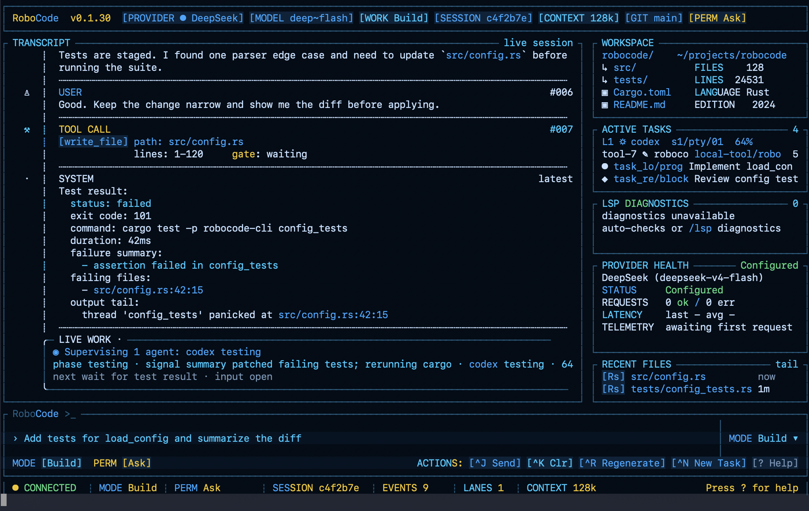
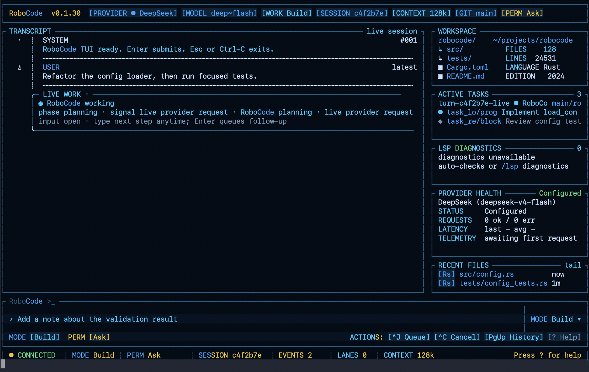
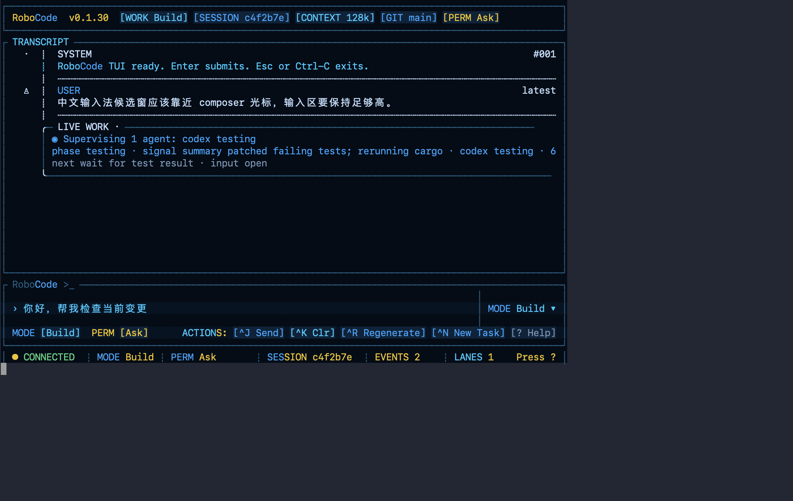
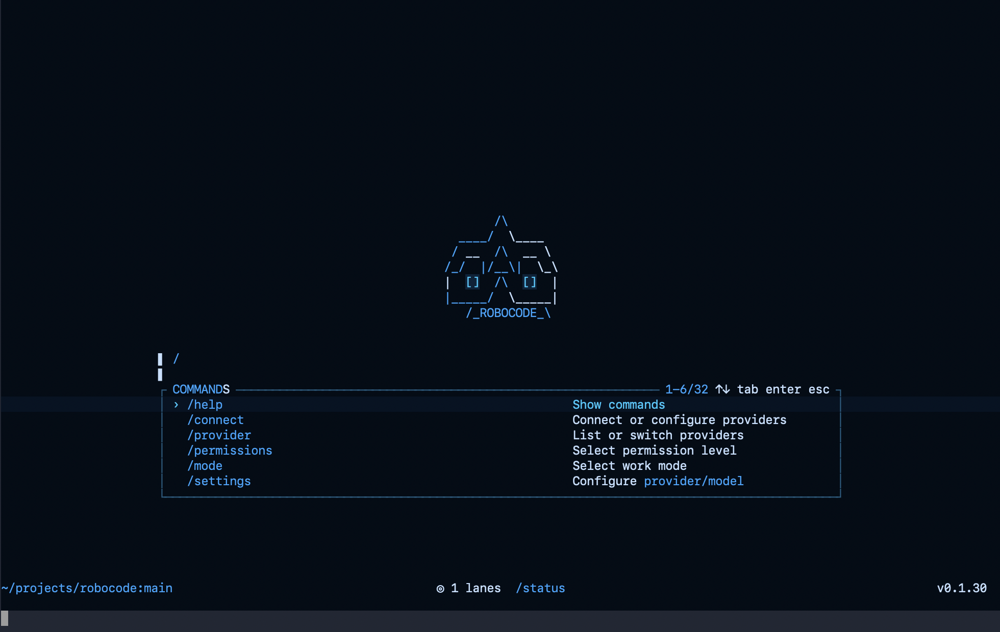
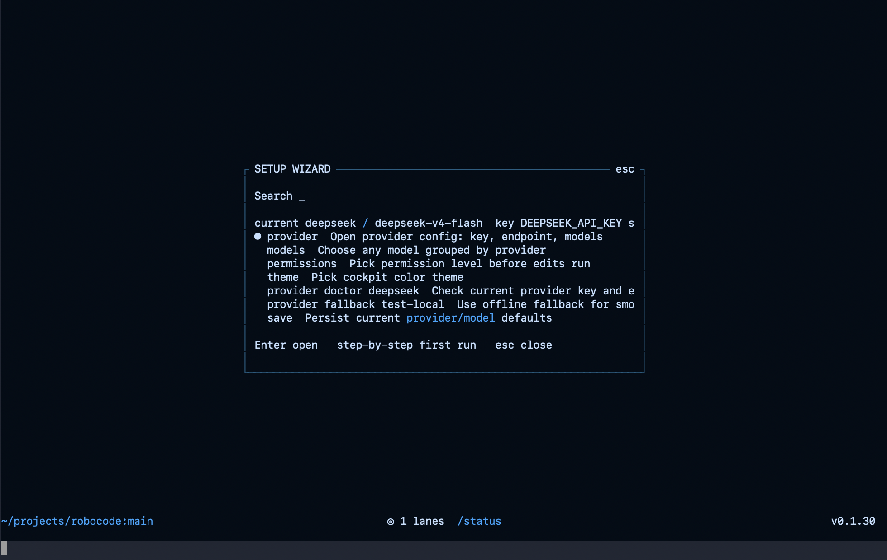
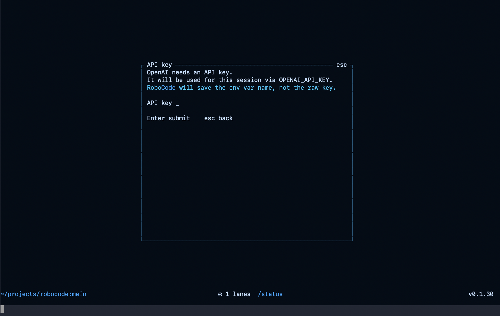
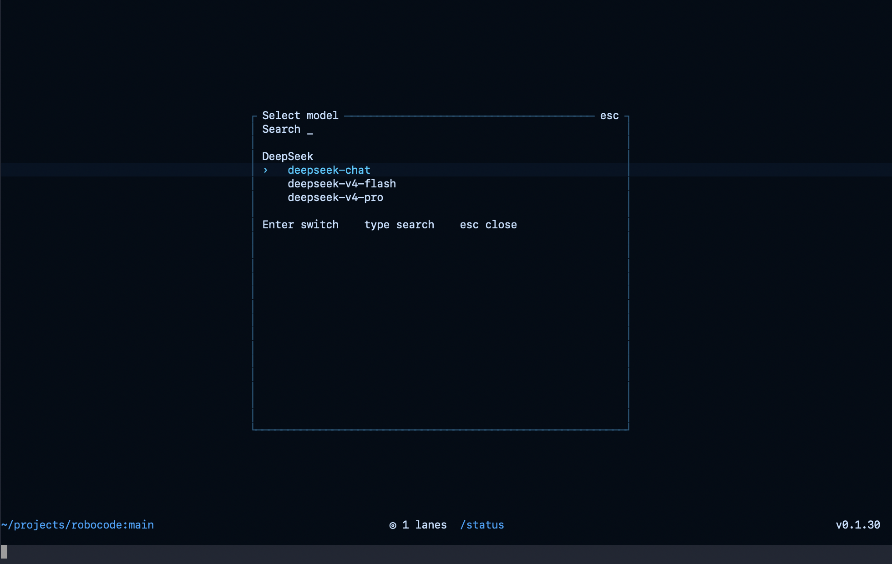
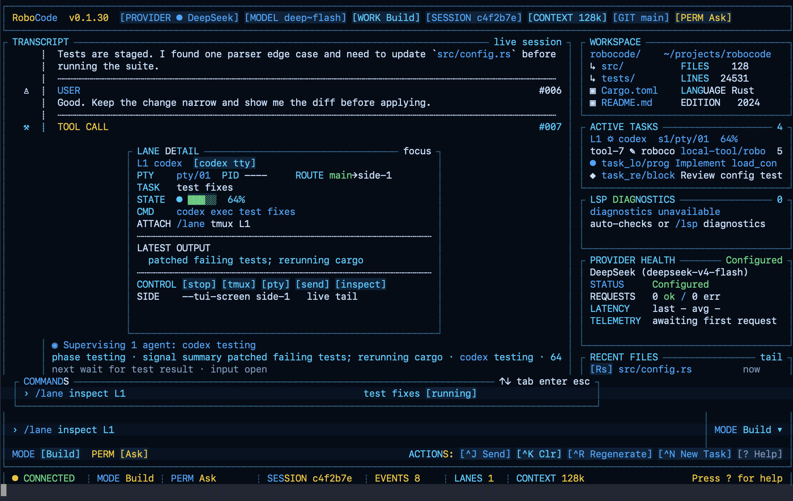
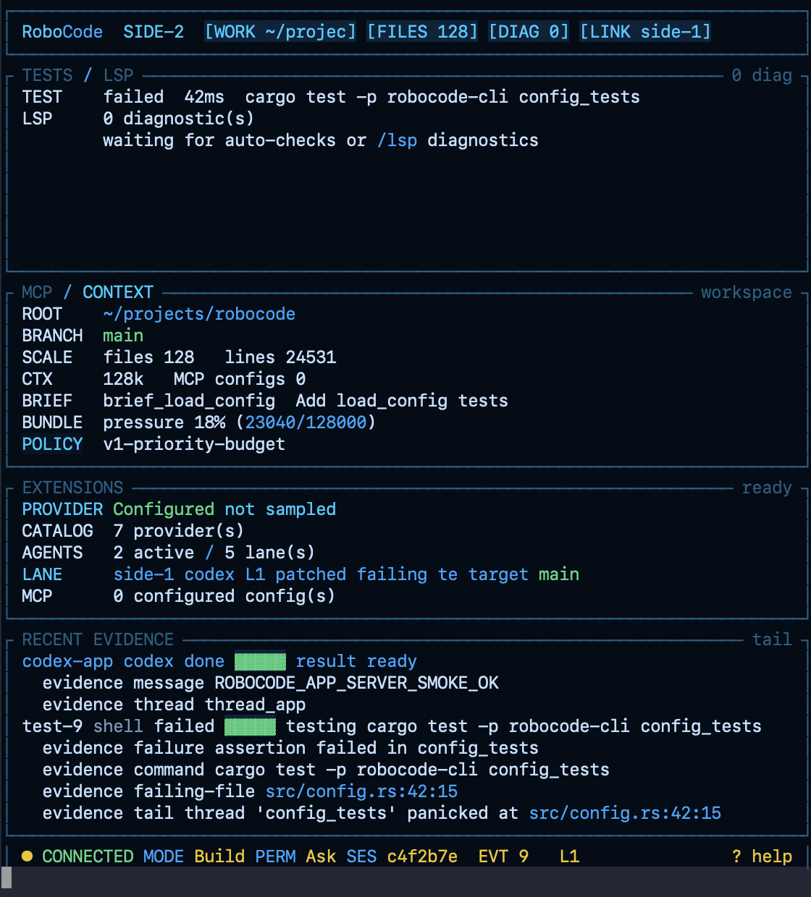

# Viden

Viden is a local-first coding-agent cockpit for developers who want one
terminal surface to chat with a model, approve real workspace changes, supervise
delegated agents, and keep enough evidence to resume work later.

Chinese version: [README.zh-CN.md](README.zh-CN.md)



## Why It Exists

Most coding agents are good at a single conversation. Viden is built around a
slightly different job: coordinating programming work. It keeps the active
conversation, tool effects, approvals, tests, tasks, memory, provider health,
and external agent lanes visible in one operator cockpit.

## Highlights

- Cockpit TUI: transcript, approval state, workspace snapshot, active tasks,
  diagnostics, provider health, and recent evidence stay visible together.
- Real tool execution: file read/write/edit, search, shell, web, Git, LSP, test
  commands, task state, and memory all run through the shared runtime path.
- Permission-aware edits: mutating file, shell, Git, workflow, and delegated
  agent actions are mediated by permission modes before they affect the
  workspace.
- Multi-provider runtime: DeepSeek, OpenAI, Anthropic, OpenAI-compatible
  gateways, Ollama, and offline fallback are available through one provider
  interface, with provider registry diagnostics.
- Agent supervision lanes: Codex, Claude, custom shell/template lanes, tmux,
  embedded PTY, and experimental ACP surfaces are exposed as supervised
  operator lanes.
- Durable local context: transcripts, session index, task events, memory events,
  lane artifacts, and preview evidence are stored locally by default.
- Screenshot-gated TUI iteration: visual changes produce deterministic
  screenshots for review before release.
- Multi-platform install: Homebrew plus release archives for macOS, Linux, and
  Windows.

## Screenshots

These are real macOS Terminal screenshots captured from Viden `0.1.30`
release-preview states with `deepseek / deepseek-v4-flash`. They cover the
welcome composer, live-turn cockpit, resize/CJK redraw behavior,
provider/model setup, delegated-lane operation, and side-screen evidence.
Deterministic SVG previews remain under `docs/previews/generated/` for
regression review.

### First-Launch Welcome


### Live Provider Turn



### Resize-Safe Redraw


### CJK Input



### Slash-Command Palette



### First-Run Setup Wizard



### Provider Configuration Selector


### Provider Detail Form



### Grouped Model Selector



### Lane Action Selector


### Agent Lane Detail



### Side Screen: Agent Lanes


### Side Screen: Ops And Evidence



## Install

### Homebrew Tap

Recommended on macOS and Linux:

```bash
brew install wikieden/tap/viden
```

Verify the install:

```bash
viden --help
```

### Release Archive

Download a release archive from
[Viden v0.1.30](https://github.com/wikieden/viden/releases/tag/v0.1.30).

Available release targets:

- `aarch64-apple-darwin` for Apple Silicon macOS
- `x86_64-apple-darwin` for Intel macOS
- `x86_64-unknown-linux-gnu` for Linux x64
- `x86_64-pc-windows-msvc` for Windows x64

Install on macOS or Linux:

```bash
VERSION=0.1.30
TARGET=aarch64-apple-darwin
curl -L -O "https://github.com/wikieden/viden/releases/download/v${VERSION}/viden-v${VERSION}-${TARGET}.tar.gz"
tar -xzf "viden-v${VERSION}-${TARGET}.tar.gz"
sudo install -m 755 "viden-v${VERSION}-${TARGET}/viden" /usr/local/bin/viden
viden --help
```

Install on Windows PowerShell:

```powershell
$Version = "0.1.30"
$Target = "x86_64-pc-windows-msvc"
Invoke-WebRequest "https://github.com/wikieden/viden/releases/download/v$Version/viden-v$Version-$Target.tar.gz" -OutFile "viden-v$Version-$Target.tar.gz"
tar -xzf "viden-v$Version-$Target.tar.gz"
New-Item -ItemType Directory -Force "$env:USERPROFILE\bin"
Copy-Item "viden-v$Version-$Target\viden.exe" "$env:USERPROFILE\bin\viden.exe"
$env:PATH += ";$env:USERPROFILE\bin"
viden.exe --help
```

## Quick Start

Run Viden. Clean installs use DeepSeek as the default online provider and
open the cockpit TUI by default:

```bash
viden
```

On a clean session the TUI starts on a focused welcome composer instead of
opening setup automatically. It stays on that welcome surface while you run
setup commands; the full cockpit appears after the first normal task prompt.
Use `Ctrl-P` for commands, or submit one of these entries when you want
provider/model setup:

```bash
/setup
/setup provider
/connect
/models
```

Set a DeepSeek key for live turns:

```bash
export DEEPSEEK_API_KEY="sk-..."
viden
```

If the selected model fails or is unavailable, Viden shows a switch-model
prompt with concrete `/model ...`, `/provider ...`, and `/provider doctor ...`
actions.

Run an explicit offline smoke session when you do not want a live provider:

```bash
viden --provider fallback --model test-local
```

Use the legacy line REPL only when you explicitly need it:

```bash
viden --no-tui --provider fallback --model test-local
```

Start from source during development:

```bash
cargo run -p viden-cli -- --provider fallback --model test-local
```

## Core Workflows

1. Ask Viden to change code, then approve or deny each mutating tool call.
2. Run `/test <command>` to execute a test through the same permission path and
   keep failure evidence visible in `/status` and the TUI.
3. Use `/git diff`, `/diff`, and `/git status` to review what changed before
   committing.
4. Create a lightweight active brief with `/brief <goal>` or `/spec <goal>`;
   use `/brief steering init` when project conventions should guide lanes.
5. Track durable work with `/task add`, `/tasks`, `/task resume-context`, and
   `/memory`.
6. Open side screens with `/screen side-1` and `/screen side-2` when you want a
   second terminal to watch agent lanes or ops evidence.
7. Start supervised external work with `/lane codex`, `/lane claude`,
   `/lane run`, `/lane tmux`, or `/agent run codex`.

## Essential TUI Controls

- `Enter` submits the composer; `Ctrl-J` is the explicit send action.
- `Ctrl-K` clears the composer, `Ctrl-R` reloads the latest user prompt, and
  `Ctrl-N` starts `/task add ...`.
- `?` opens the in-TUI help surface when the composer is empty.
- `Esc` or `Ctrl-C` exits; `/quit` and `/exit` also close the TUI.
- While a provider turn is active, the cockpit keeps repainting the working
  state and elapsed time. `Ctrl-C` requests cancellation when the runtime can
  observe it, but an in-flight provider request may still finish.
- Approval prompts default to `Approve`; press `y` to approve, `n` to deny,
  `d` to focus diff, or use `Tab` / arrow keys to move between actions.
- Type `/` to open command suggestions. Provider and model commands stay in
  the compact completion surface while you are typing; they do not open a large
  modal until the command is submitted. Common entries include `/help`,
  `/settings`, `/setup`, `/connect`, `/provider`, `/models`, `/status`, `/config`, `/permissions`,
  `/test`, `/sessions`, `/resume`, `/task`, `/brief`, `/spec`, `/memory`,
  `/lane`, `/agent`, `/screen`, `/lsp`, `/git`, `/web`, `/extensions`,
  `/mcp`, and `/skills`.
  Long suggestion lists keep the selected row visible and support mouse
  completion on visible rows.

## Configuration

Viden loads config from the platform config path and then from
`.viden/config.toml`, with CLI flags taking precedence.

Inside the TUI, `/connect`, `/provider`, `/setup provider`, and
`/settings provider` open an opencode-style provider picker. Select a supplier
inside the panel, enter an API key there when required, and then use the
provider config panel to change the key, clear the current session key, run
doctor, or choose that provider's default model. Choosing that provider-scoped
model saves the provider/model, runs provider doctor, and writes readiness
evidence back into the transcript. `/models`, `/model`, `/setup model`, and
`/settings model` open a provider-grouped model picker that only includes
configured providers. For configured providers, the picker includes active,
favorite, default, and known models; selecting a row applies the provider/model
switch immediately. API keys are masked in the panel and
Viden saves the env var name, not the raw key. Direct commands such as
`/settings provider <provider> ...`, `/models <provider> <model>`, and
`/model <model>` remain available for scripts and advanced users.

Live provider smoke evidence can be collected without opening the TUI:

```bash
scripts/provider-live-smoke.sh --provider deepseek --model deepseek-v4-flash
scripts/provider-live-smoke.sh --provider dashscope-coding-plan --model qwen3.6-plus
scripts/deepseek-dev-scenario-smoke.sh --model deepseek-v4-flash
```

`scripts/deepseek-dev-scenario-smoke.sh` is the billable development smoke:
it asks DeepSeek to create a tiny Python module, generate and run its test, and
then writes `usage.json` plus a Markdown summary with input/output/total tokens
and an estimated CNY cost.

```toml
provider = "deepseek"
model = "deepseek-v4-flash"
permission_mode = "acceptEdits"
request_timeout_secs = 120
max_retries = 2

[providers.deepseek]
api_base = "https://api.deepseek.com"
api_key_env = "DEEPSEEK_API_KEY"
default_model = "deepseek-v4-flash"
models = ["deepseek-v4-flash", "deepseek-v4-pro"]
favorite_models = ["deepseek-v4-pro"]
```

Useful startup flags:

```bash
viden --config .viden/config.toml
viden --resume latest
viden --permissions plan
viden --tui-theme aurora-cyan
viden --tui-screen side-1
```

## What Is Experimental

- MCP and skills are visible through `/mcp`, `/skills`, and `/extensions`, but
  MCP-backed tools are not yet wired into the mutation permission path.
- ACP appears as an experimental agent adapter surface.
- Codex app-server write-capable delegated turns are guarded because live trials
  showed workspace writes can occur before Viden receives an approval event.

## Documentation

README stays focused on product usage. Full usage and implementation detail live
in the docs:

- [User Guide](docs/user-guide.md)
- [Architecture](docs/architecture.md)
- [Product Requirements](docs/product-requirements.md)
- [Long-Term Roadmap](docs/long-term-roadmap.md)
- [Staged Roadmap](docs/staged-roadmap.md)
- [Reference Analysis](docs/reference-analysis.md)
- [Provider Live Matrix](docs/provider-live-matrix.md)
- [TUI Cockpit Design](docs/tui-cockpit-design.md)
- [TUI Interaction Audit](docs/tui-interaction-audit-2026-05-29.md)
- [Testing and Validation Plan](docs/testing-validation-plan.md)
- [0.1.26 Status](docs/release-0.1.26-status.md)
- [0.1.26 Plan](docs/release-0.1.26-plan.md)
- [0.1.25 Status](docs/release-0.1.25-status.md)
- [0.1.25 Plan](docs/release-0.1.25-plan.md)
- [0.1.23 Status](docs/release-0.1.23-status.md)
- [0.1.21 Plan](docs/release-0.1.21-plan.md)
- [0.1.21 Status](docs/release-0.1.21-status.md)
- [0.1.19 Plan](docs/release-0.1.19-plan.md)
- [0.1.19 Status](docs/release-0.1.19-status.md)
- [0.1.18 Status](docs/release-0.1.18-status.md)
- [0.1.17 Plan](docs/release-0.1.17-plan.md)
- [0.1.17 Status](docs/release-0.1.17-status.md)
- [0.1.16 Plan](docs/release-0.1.16-plan.md)
- [0.1.15 Status](docs/release-0.1.15-status.md)
- [0.1.15 Plan](docs/release-0.1.15-plan.md)
- [0.1.14 Status](docs/release-0.1.14-status.md)
- [0.1.14 Plan](docs/release-0.1.14-plan.md)
- [0.1.13 Status](docs/release-0.1.13-status.md)
- [0.1.13 Plan](docs/release-0.1.13-plan.md)
- [0.1.12 Status](docs/release-0.1.12-status.md)
- [0.1.12 Plan](docs/release-0.1.12-plan.md)
- [ContextBundle And Token Efficiency](docs/context-bundle-token-efficiency.md)
- [Development Standards](docs/development-standards.md)

## Maintainer Checks

Build a local archive:

```bash
scripts/package-release.sh
```

Run the release smoke matrix:

```bash
scripts/release-smoke.sh
```

When `DEEPSEEK_API_KEY` is available, add `--deepseek` to include the live
DeepSeek development scenario and token/cost summary.

For an actual release, use the mandatory release gate instead of ad-hoc smoke
commands:

```bash
scripts/release-gate.sh --version <version>
```

Generate TUI visual evidence:

```bash
scripts/tui-regression.sh docs/previews/generated
```

After publishing, validate release assets and Homebrew:

```bash
scripts/release-gate.sh --version <version> --phase postpublish
```

Every GitHub Release must be paired with a same-version Homebrew tap update.
Do not mark a release complete until the post-publish smoke validates both
GitHub assets and Homebrew. The release status must also include the DeepSeek
live smoke token/cost summary from the prepublish gate.

## Feedback

Please report bugs and feature requests through
[GitHub Issues](https://github.com/wikieden/viden/issues).

Helpful issue details:

- Viden version or release asset name.
- Operating system and terminal app.
- Provider and model, for example `deepseek / deepseek-v4-flash`.
- The command you ran and the smallest reproduction steps.
- Relevant logs or screenshots, with API keys and private paths redacted.

## License

Viden is released under the MIT License. See [LICENSE](LICENSE).
