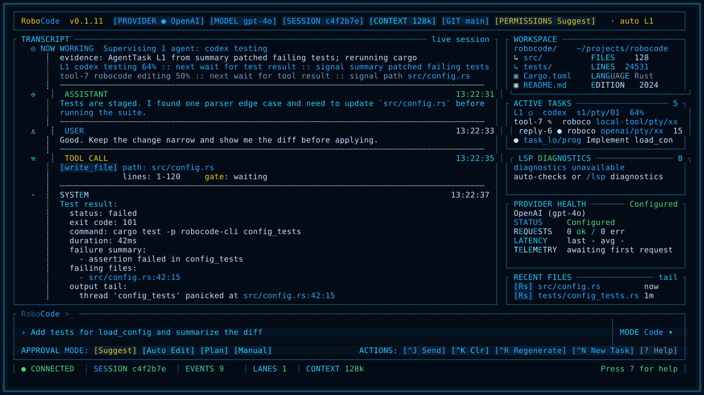
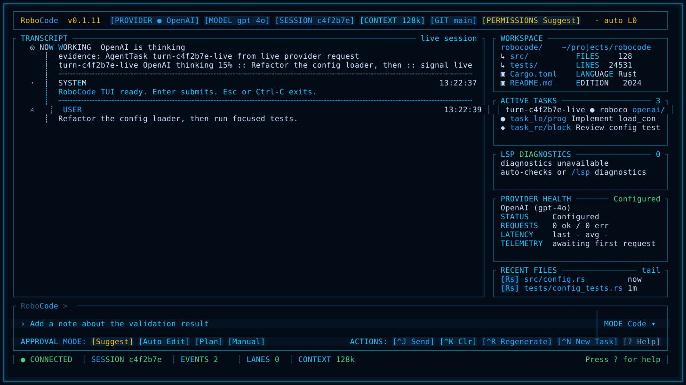
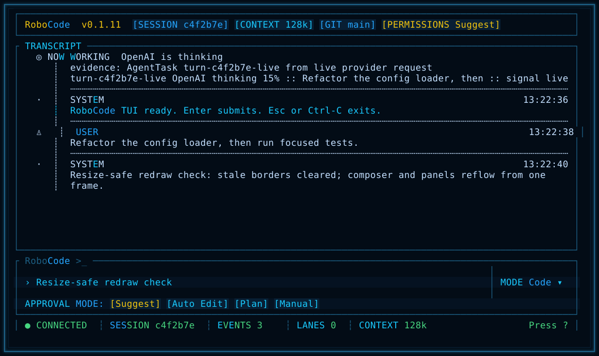
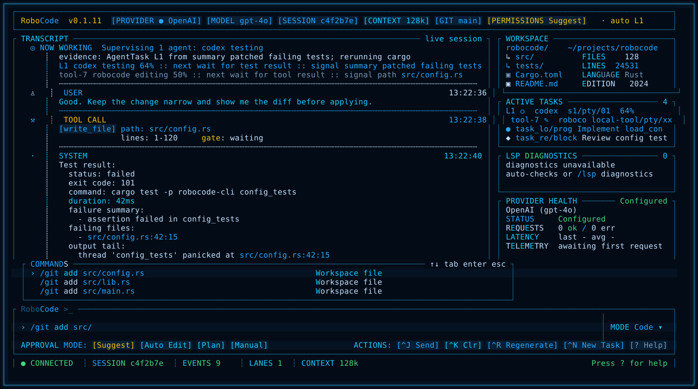
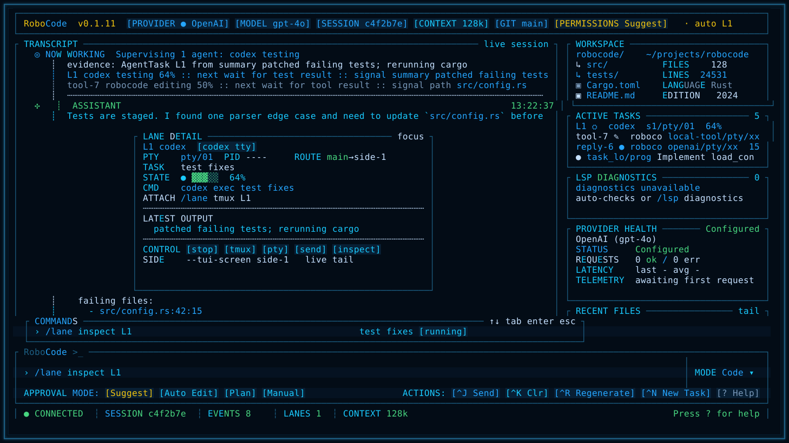
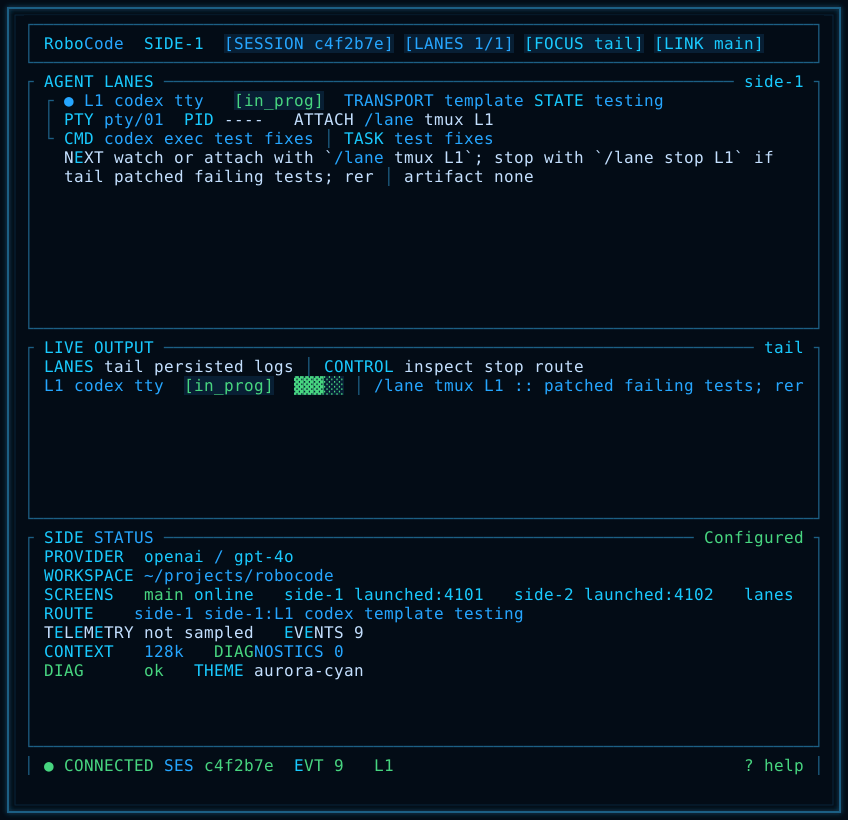
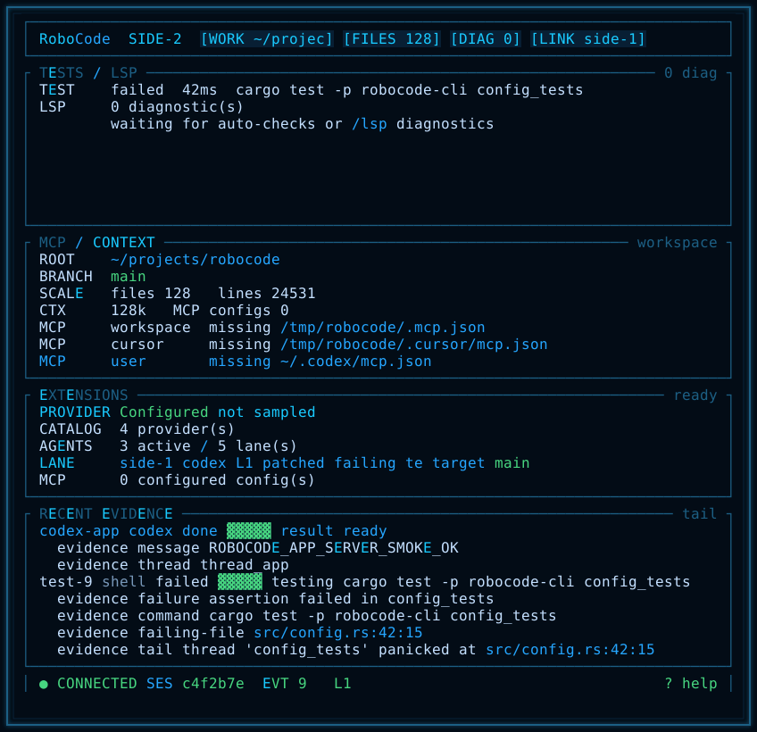

# RoboCode

RoboCode is a local-first coding-agent cockpit for developers who want one
terminal surface to chat with a model, approve real workspace changes, supervise
delegated agents, and keep enough evidence to resume work later.

Chinese version: [README.zh-CN.md](README.zh-CN.md)



## Why It Exists

Most coding agents are good at a single conversation. RoboCode is built around a
slightly different job: coordinating programming work. It keeps the active
conversation, tool effects, approvals, tests, tasks, memory, provider health,
and external agent lanes visible in one operator cockpit.

## Highlights

- Cockpit TUI: transcript, approval state, workspace snapshot, active tasks,
  diagnostics, provider health, and recent evidence stay visible together.
- Real tool execution: file read/write/edit, search, shell, web, Git, LSP, test
  commands, task state, and memory all run through the shared runtime path.
- Permission-aware edits: mutating file, shell, Git, workflow, and delegated
  agent actions are mediated by permission modes before they affect the
  workspace.
- Multi-provider runtime: DeepSeek, OpenAI, Anthropic, OpenAI-compatible
  gateways, Ollama, and offline fallback are available through one provider
  interface, with provider registry diagnostics.
- Agent supervision lanes: Codex, Claude, custom shell/template lanes, tmux,
  embedded PTY, and experimental ACP surfaces are exposed as supervised
  operator lanes.
- Durable local context: transcripts, session index, task events, memory events,
  lane artifacts, and preview evidence are stored locally by default.
- Screenshot-gated TUI iteration: visual changes produce deterministic
  screenshots for review before release.
- Multi-platform install: Homebrew plus release archives for macOS, Linux, and
  Windows.

## Screenshots

These are generated from the current RoboCode TUI renderer and kept as release
evidence.

### Live Provider Turn



### Resize-Safe Redraw



### CJK Input


### Slash-Command Palette



### Agent Lane Detail



### Side Screen: Agent Lanes



### Side Screen: Ops And Evidence



## Install

### Homebrew Tap

Recommended on macOS and Linux:

```bash
brew install wikieden/tap/robocode
```

Verify the install:

```bash
robocode --help
```

### Release Archive

Download a release archive from
[RoboCode v0.1.11](https://github.com/wikieden/robocode/releases/tag/v0.1.11).

Available release targets:

- `aarch64-apple-darwin` for Apple Silicon macOS
- `x86_64-apple-darwin` for Intel macOS
- `x86_64-unknown-linux-gnu` for Linux x64
- `x86_64-pc-windows-msvc` for Windows x64

Install on macOS or Linux:

```bash
VERSION=0.1.11
TARGET=aarch64-apple-darwin
curl -L -O "https://github.com/wikieden/robocode/releases/download/v${VERSION}/robocode-v${VERSION}-${TARGET}.tar.gz"
tar -xzf "robocode-v${VERSION}-${TARGET}.tar.gz"
sudo install -m 755 "robocode-v${VERSION}-${TARGET}/robocode-cli" /usr/local/bin/robocode-cli
robocode-cli --help
```

Install on Windows PowerShell:

```powershell
$Version = "0.1.11"
$Target = "x86_64-pc-windows-msvc"
Invoke-WebRequest "https://github.com/wikieden/robocode/releases/download/v$Version/robocode-v$Version-$Target.tar.gz" -OutFile "robocode-v$Version-$Target.tar.gz"
tar -xzf "robocode-v$Version-$Target.tar.gz"
New-Item -ItemType Directory -Force "$env:USERPROFILE\bin"
Copy-Item "robocode-v$Version-$Target\robocode-cli.exe" "$env:USERPROFILE\bin\robocode-cli.exe"
$env:PATH += ";$env:USERPROFILE\bin"
robocode-cli.exe --help
```

## Quick Start

Run an offline smoke session:

```bash
robocode-cli --provider fallback --model test-local
```

Start the cockpit TUI with the fallback provider:

```bash
robocode-cli --tui --provider fallback --model test-local
```

Start the cockpit TUI with DeepSeek V4 Flash:

```bash
export DEEPSEEK_API_KEY="sk-..."
robocode-cli --tui --provider deepseek --model deepseek-v4-flash
```

Start from source during development:

```bash
cargo run -p robocode-cli -- --tui --provider fallback --model test-local
```

## Core Workflows

1. Ask RoboCode to change code, then approve or deny each mutating tool call.
2. Run `/test <command>` to execute a test through the same permission path and
   keep failure evidence visible in `/status` and the TUI.
3. Use `/git diff`, `/diff`, and `/git status` to review what changed before
   committing.
4. Track durable work with `/task add`, `/tasks`, `/task resume-context`, and
   `/memory`.
5. Open side screens with `/screen side-1` and `/screen side-2` when you want a
   second terminal to watch agent lanes or ops evidence.
6. Start supervised external work with `/lane codex`, `/lane claude`,
   `/lane run`, `/lane tmux`, or `/agent run codex`.

## Essential TUI Controls

- `Enter` submits the composer; `Ctrl-J` is the explicit send action.
- `Ctrl-K` clears the composer, `Ctrl-R` regenerates, and `Ctrl-N` starts a new
  task.
- `?` opens the in-TUI help surface.
- `Esc` or `Ctrl-C` exits; `/quit` and `/exit` also close the TUI.
- Approval prompts default to `Approve`; press `y` to approve, `n` to deny,
  `d` to focus diff, or use `Tab` / arrow keys to move between actions.
- Type `/` to open command suggestions. Common entries include `/help`,
  `/provider`, `/status`, `/config`, `/permissions`, `/test`, `/sessions`,
  `/resume`, `/task`, `/memory`, `/lane`, `/agent`, `/screen`, `/lsp`, `/git`,
  `/web`, `/extensions`, `/mcp`, and `/skills`.

## Configuration

RoboCode loads config from the platform config path and then from
`.robocode/config.toml`, with CLI flags taking precedence.

```toml
provider = "deepseek"
model = "deepseek-v4-flash"
permission_mode = "acceptEdits"
request_timeout_secs = 120
max_retries = 2

[providers.deepseek]
api_base = "https://api.deepseek.com"
api_key_env = "DEEPSEEK_API_KEY"
```

Useful startup flags:

```bash
robocode-cli --config .robocode/config.toml
robocode-cli --resume latest
robocode-cli --permissions plan
robocode-cli --tui-theme aurora-cyan
robocode-cli --tui-screen side-1
```

## What Is Experimental

- MCP and skills are visible through `/mcp`, `/skills`, and `/extensions`, but
  MCP-backed tools are not yet wired into the mutation permission path.
- ACP appears as an experimental agent adapter surface.
- Codex app-server write-capable delegated turns are guarded because live trials
  showed workspace writes can occur before RoboCode receives an approval event.

## Documentation

README stays focused on product usage. Full usage and implementation detail live
in the docs:

- [User Guide](docs/user-guide.md)
- [Architecture](docs/architecture.md)
- [Product Requirements](docs/product-requirements.md)
- [Staged Roadmap](docs/staged-roadmap.md)
- [Reference Analysis](docs/reference-analysis.md)
- [Provider Live Matrix](docs/provider-live-matrix.md)
- [TUI Cockpit Design](docs/tui-cockpit-design.md)
- [Testing and Validation Plan](docs/testing-validation-plan.md)
- [0.1.11 Status](docs/release-0.1.11-status.md)
- [ContextBundle And Token Efficiency](docs/context-bundle-token-efficiency.md)
- [Development Standards](docs/development-standards.md)

## Maintainer Checks

Build a local archive:

```bash
scripts/package-release.sh
```

Run the release smoke matrix:

```bash
scripts/release-smoke.sh
```

Generate TUI visual evidence:

```bash
scripts/tui-regression.sh docs/previews/generated
```

After publishing, validate release assets and Homebrew:

```bash
scripts/release-smoke.sh --version <version> --github-release-assets --homebrew --skip-package
```

## Feedback

Please report bugs and feature requests through
[GitHub Issues](https://github.com/wikieden/robocode/issues).

Helpful issue details:

- RoboCode version or release asset name.
- Operating system and terminal app.
- Provider and model, for example `deepseek / deepseek-v4-flash`.
- The command you ran and the smallest reproduction steps.
- Relevant logs or screenshots, with API keys and private paths redacted.

## License

RoboCode is released under the MIT License. See [LICENSE](LICENSE).
