# RoboCode

RoboCode 是一个本地优先的编程 Agent cockpit。它把模型对话、真实工具执行、审批、测试证据、任务、记忆、多 Agent lane 和副屏监控放进同一个终端操作台。

英文版： [README.md](README.md)

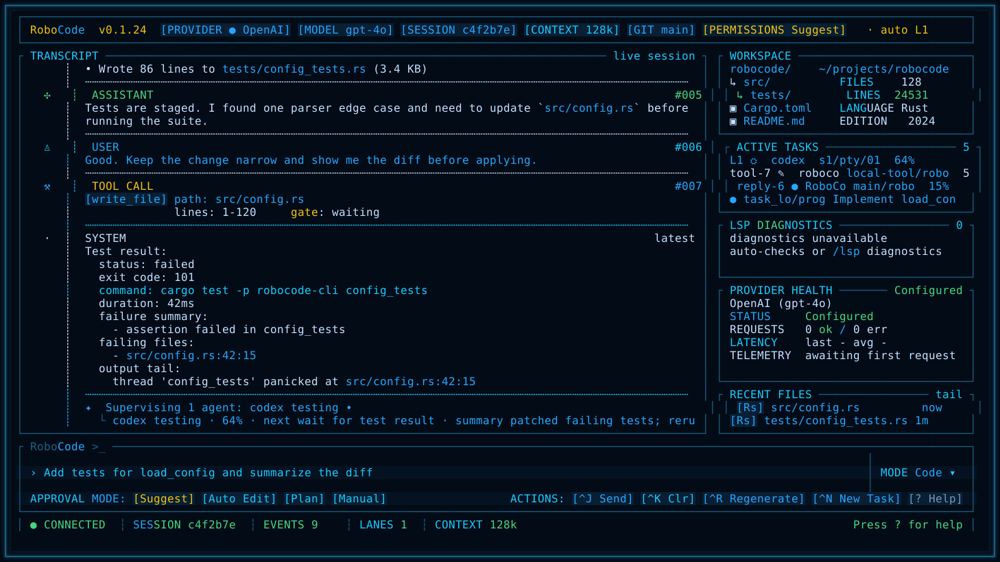

## 为什么做它

很多 coding agent 擅长单次对话，但真实编程工作更像“调度现场”：你需要知道模型现在在想什么、改了什么、测试失败在哪、哪些子 Agent 在跑、哪些操作需要你批准。RoboCode 的目标就是做一个多 Agent 编程编排工具，而不是只做一个聊天窗口。

## 产品亮点

- Cockpit TUI：主对话、审批状态、workspace 快照、active tasks、诊断、provider 健康度和最近证据同屏可见。
- 真实工具执行：文件读写编辑、搜索、shell、Web、Git、LSP、测试命令、任务和记忆都走同一套 runtime。
- 权限感知编辑：文件、shell、Git、workflow 和外部 Agent 写操作都会先经过权限模式或审批，再影响工作区。
- 多 provider runtime：DeepSeek、OpenAI、Anthropic、OpenAI-compatible gateways、Ollama 和离线 fallback 共用一套 provider 接口，并支持 provider registry 诊断。
- Agent 监督 lane：Codex、Claude、自定义 shell/template lane、tmux、嵌入式 PTY 和实验性 ACP 入口都被组织成可监督的 operator lane。
- 本地持久上下文：transcript、session index、task events、memory events、lane artifacts 和 preview evidence 默认保存在本机。
- 截图门禁：TUI 视觉改动必须生成确定性截图，方便每轮迭代确认效果。
- 多平台安装：支持 Homebrew，以及 macOS、Linux、Windows release archives。

## 真机运行图

下面这些图来自当前 RoboCode TUI renderer 的 release evidence，不是产品概念图。
截图展示的是 `0.1.24` 非阻塞 operator-loop 补丁：首次 setup、provider/model 配置、
delegated lane 操作和日常 coding cockpit；最新已发布二进制版本以安装章节为准。

### 首次进入 Welcome

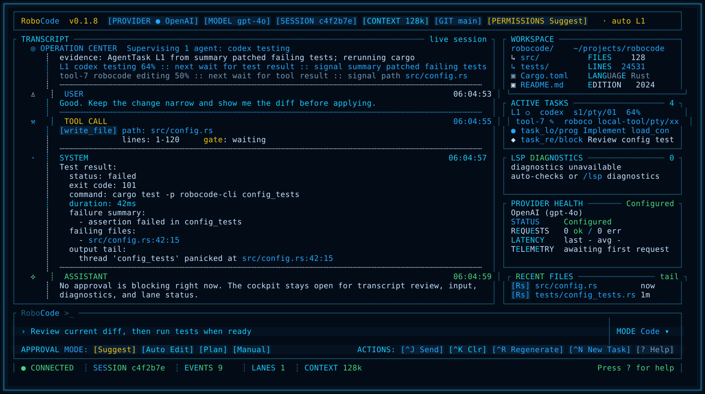

### Live provider turn

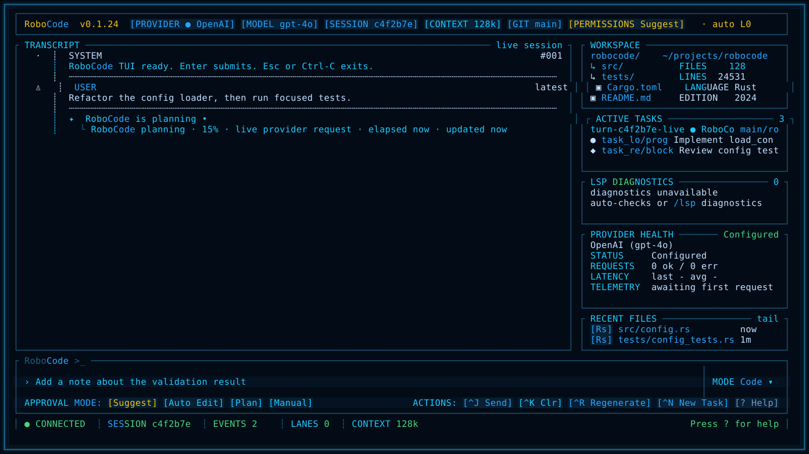

### Resize 后重绘

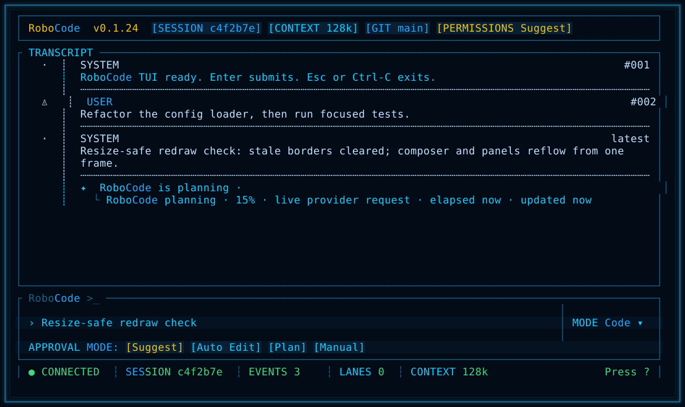

### 中文输入

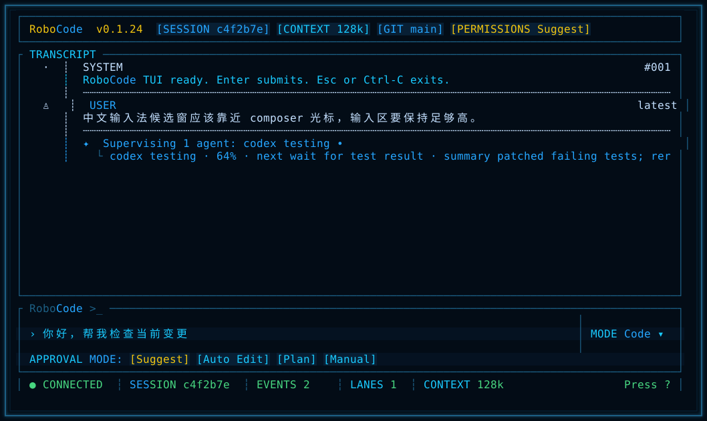

### Slash command 提示

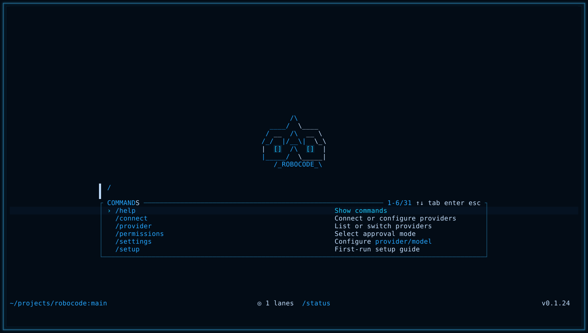

### 首次 Setup 向导

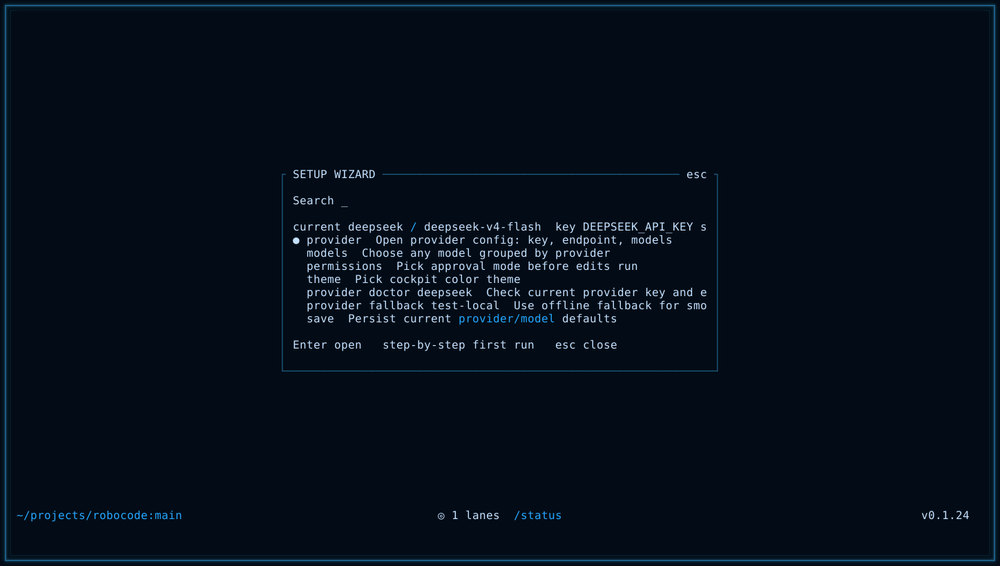

### Provider 配置选择器

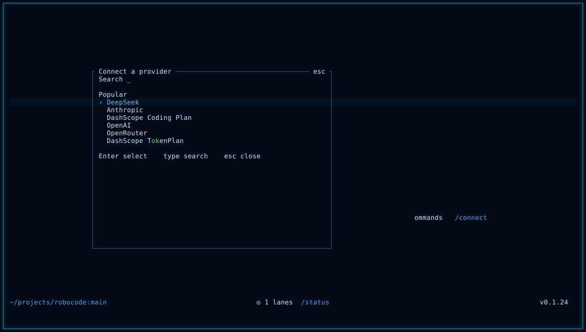

### Provider 详情配置

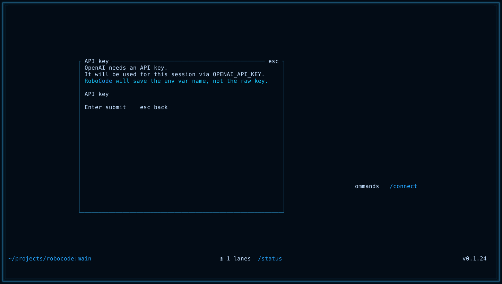

### 按供应商分组的模型选择器

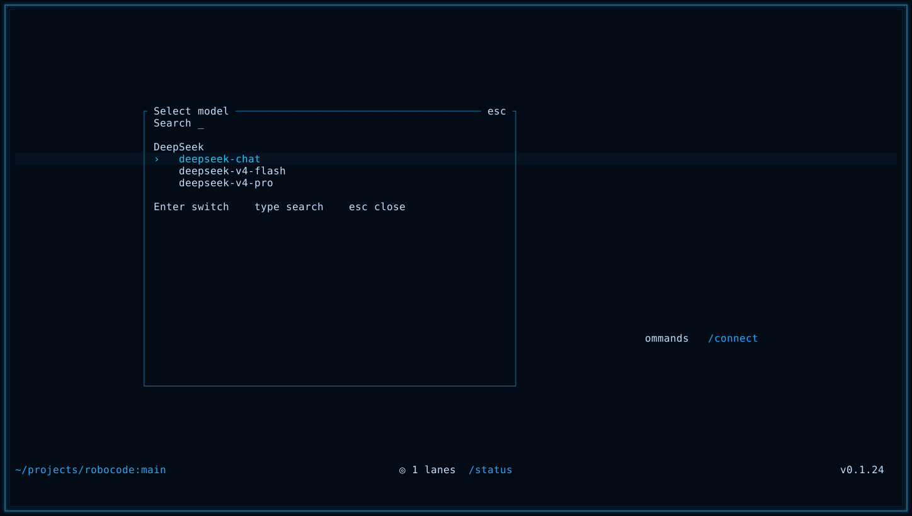

### Lane action selector

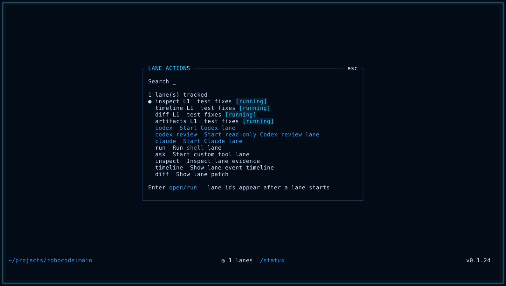

### Agent lane detail

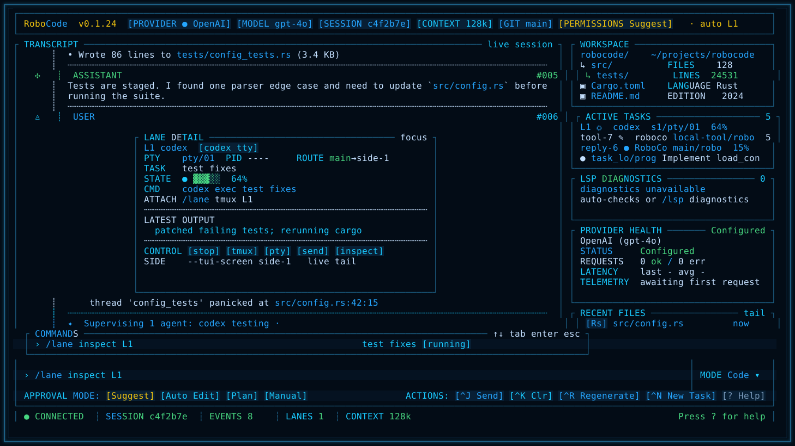

### 副屏 side-1：Agent lanes

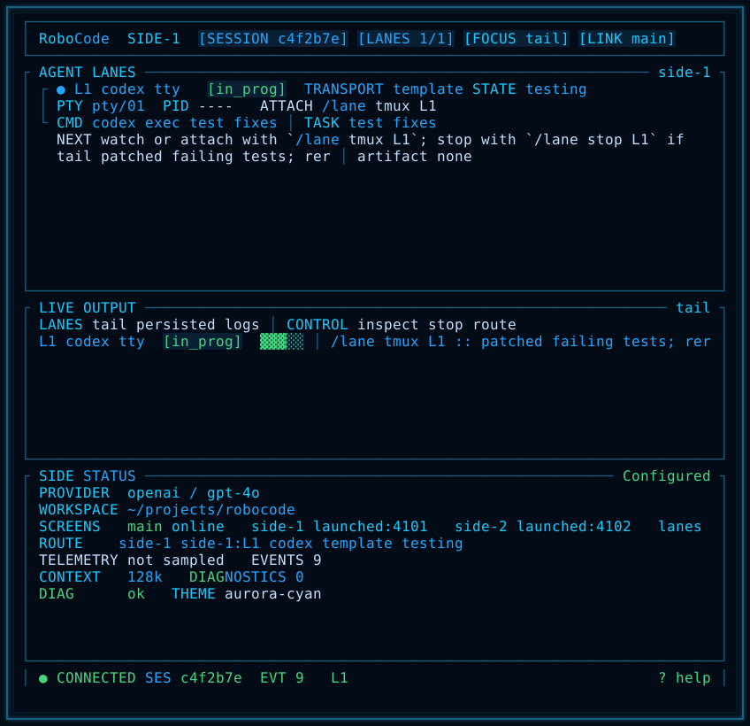

### 副屏 side-2：ops 与 evidence

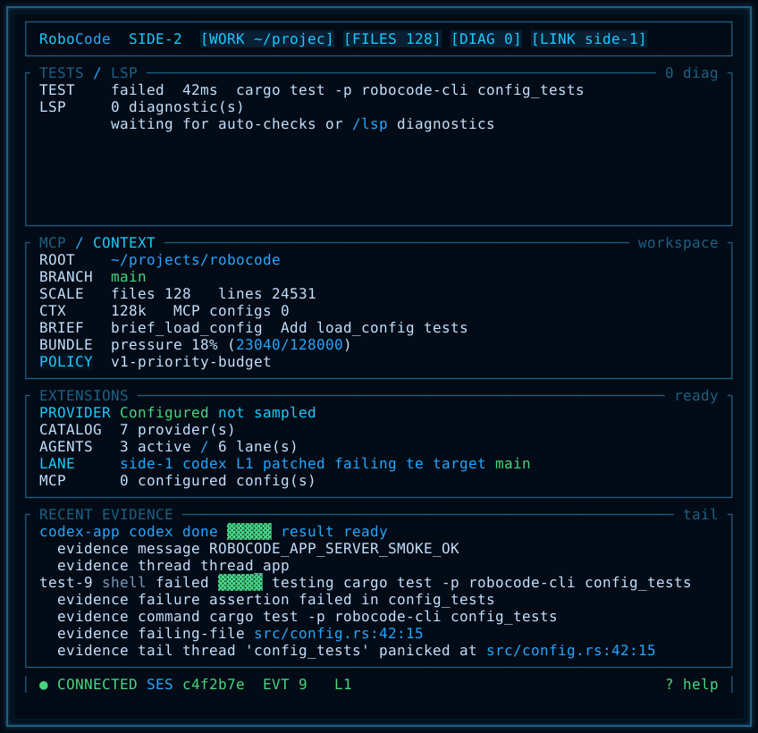

## 安装

### Homebrew Tap

macOS 和 Linux 推荐使用：

```bash
brew install wikieden/tap/robocode
```

验证安装：

```bash
robocode --help
```

### Release 压缩包

从 [RoboCode v0.1.24](https://github.com/wikieden/robocode/releases/tag/v0.1.24)
下载 release 压缩包。

当前 release targets：

- `aarch64-apple-darwin`：Apple Silicon macOS
- `x86_64-apple-darwin`：Intel macOS
- `x86_64-unknown-linux-gnu`：Linux x64
- `x86_64-pc-windows-msvc`：Windows x64

macOS 或 Linux 安装：

```bash
VERSION=0.1.24
TARGET=aarch64-apple-darwin
curl -L -O "https://github.com/wikieden/robocode/releases/download/v${VERSION}/robocode-v${VERSION}-${TARGET}.tar.gz"
tar -xzf "robocode-v${VERSION}-${TARGET}.tar.gz"
sudo install -m 755 "robocode-v${VERSION}-${TARGET}/robocode-cli" /usr/local/bin/robocode-cli
robocode-cli --help
```

Windows PowerShell 安装：

```powershell
$Version = "0.1.24"
$Target = "x86_64-pc-windows-msvc"
Invoke-WebRequest "https://github.com/wikieden/robocode/releases/download/v$Version/robocode-v$Version-$Target.tar.gz" -OutFile "robocode-v$Version-$Target.tar.gz"
tar -xzf "robocode-v$Version-$Target.tar.gz"
New-Item -ItemType Directory -Force "$env:USERPROFILE\bin"
Copy-Item "robocode-v$Version-$Target\robocode-cli.exe" "$env:USERPROFILE\bin\robocode-cli.exe"
$env:PATH += ";$env:USERPROFILE\bin"
robocode-cli.exe --help
```

## 快速开始

直接启动 RoboCode。干净安装默认以 DeepSeek 作为在线 provider，并默认进入 cockpit TUI：

```bash
robocode-cli
```

干净会话会先进入聚焦的 welcome 输入界面，不再自动弹出 setup。执行配置命令
后也会停留在 welcome；只有提交第一个普通任务 prompt 后才进入完整 cockpit。
需要配置 provider/model 时，用 `Ctrl-P` 打开命令，或直接提交下面这些入口：

```bash
/setup
/setup provider
/connect
/models
```

设置 DeepSeek key 后即可进行真实 live turn：

```bash
export DEEPSEEK_API_KEY="sk-..."
robocode-cli
```

如果当前模型不可用或调用失败，RoboCode 会显示换模型提示，给出具体的
`/model ...`、`/provider ...` 和 `/provider doctor ...` 动作。

不想使用 live provider 时，显式启动离线 smoke session：

```bash
robocode-cli --provider fallback --model test-local
```

只有明确需要旧版行式 REPL 时才使用：

```bash
robocode-cli --no-tui --provider fallback --model test-local
```

开发时从源码启动：

```bash
cargo run -p robocode-cli -- --provider fallback --model test-local
```

## 核心工作流

1. 让 RoboCode 修改代码，然后对每个 mutating tool call 通过或拒绝。
2. 用 `/test <command>` 运行测试；它会走同样的 shell 审批路径，并把失败证据写入 `/status` 和 TUI。
3. 用 `/git diff`、`/diff`、`/git status` 在提交前审查实际改动。
4. 用 `/brief <goal>` 或 `/spec <goal>` 创建轻量 active brief；需要项目约定进入 lane context 时，用 `/brief steering init`。
5. 用 `/task add`、`/tasks`、`/task resume-context` 和 `/memory` 管理长期上下文。
6. 需要第二块屏幕时，用 `/screen side-1` 和 `/screen side-2` 打开 lane / ops 监控副屏。
7. 用 `/lane codex`、`/lane claude`、`/lane run`、`/lane tmux` 或 `/agent run codex` 启动受监督的外部 Agent 工作。

## 常用 TUI 操作

- `Enter` 提交输入区；`Ctrl-J` 是显式发送动作。
- `Ctrl-K` 清空输入区，`Ctrl-R` 重新载入最近一次用户输入，`Ctrl-N` 开始 `/task add ...`。
- 输入区为空时，`?` 打开 TUI 内帮助。
- `Esc` 或 `Ctrl-C` 退出；`/quit` 和 `/exit` 也可以关闭 TUI。
- provider turn 正在运行时，cockpit 会持续刷新当前工作状态和 elapsed time。
  `Ctrl-C` 会请求取消，但已经发出的 provider 请求仍可能正常返回。
- 审批弹窗默认停在 `Approve`；按 `y` 通过，`n` 拒绝，`d` 聚焦 diff，也可以用 `Tab` / 方向键在动作间移动。
- 输入 `/` 会打开命令提示。provider/model 相关命令在输入过程中只显示紧凑补全，
  不会在你还没按 Enter 时弹出大窗口。常用入口包括 `/help`、`/settings`、`/setup`、`/connect`、`/provider`、`/models`、`/status`、`/config`、`/permissions`、`/test`、`/sessions`、`/resume`、`/task`、`/brief`、`/spec`、`/memory`、`/lane`、`/agent`、`/screen`、`/lsp`、`/git`、`/web`、`/extensions`、`/mcp` 和 `/skills`。
  长列表会保持选中行可见，并支持点击可见行补全。

## 配置

RoboCode 会读取平台默认配置路径，然后读取 `.robocode/config.toml`，CLI flags 优先级最高。

在 TUI 中，`/connect`、`/provider`、`/setup provider`、`/settings provider` 会打开类似 opencode 的供应商选择面板：在面板里选供应商，缺 key 时进入 API key 输入面板，然后进入 provider config 动作页。这个动作页可以更换 key、清除当前 session 里的 key、运行 doctor，或继续选择该 provider 的默认模型。在 provider-scoped 模型面板里选中模型后，会保存 provider/model、自动运行 provider doctor，并把 readiness 证据写回 transcript。`/models`、`/model`、`/setup model`、`/settings model` 会打开按供应商分组的模型选择面板，只显示已经配置过的 provider；对已配置 provider，会显示 active、favorite、default 和 known models，选中一行后立即切换 provider/model。API key 在界面里脱敏展示，RoboCode 只保存环境变量名，不保存明文 key。`/settings provider <provider> ...`、`/models <provider> <model>`、`/model <model>` 这些直接命令仍保留给脚本和高级用户。

不打开 TUI 也可以收集真实 provider smoke 证据：

```bash
scripts/provider-live-smoke.sh --provider deepseek --model deepseek-v4-flash
scripts/provider-live-smoke.sh --provider dashscope-coding-plan --model qwen3.6-plus
scripts/deepseek-dev-scenario-smoke.sh --model deepseek-v4-flash
```

`scripts/deepseek-dev-scenario-smoke.sh` 是会产生真实费用的开发场景 smoke：
它会让 DeepSeek 创建一个小 Python 模块、生成并运行测试，然后写出 `usage.json`
和 Markdown summary，里面包含 input/output/total tokens 与 CNY 费用估算。

```toml
provider = "deepseek"
model = "deepseek-v4-flash"
permission_mode = "acceptEdits"
request_timeout_secs = 120
max_retries = 2

[providers.deepseek]
api_base = "https://api.deepseek.com"
api_key_env = "DEEPSEEK_API_KEY"
default_model = "deepseek-v4-flash"
models = ["deepseek-v4-flash", "deepseek-v4-pro"]
favorite_models = ["deepseek-v4-pro"]
```

常用启动参数：

```bash
robocode-cli --config .robocode/config.toml
robocode-cli --resume latest
robocode-cli --permissions plan
robocode-cli --tui-theme aurora-cyan
robocode-cli --tui-screen side-1
```

## 当前实验边界

- `/mcp`、`/skills` 和 `/extensions` 已能展示 MCP / skill / extension 可见性，但 MCP-backed tools 还没有接入 mutating permission path。
- ACP 目前是实验性 Agent adapter 入口。
- Codex app-server write-capable delegated turn 仍有 guard，因为真实测试发现它可能在 RoboCode 收到 approval event 之前修改 workspace。

## 文档

README 保持产品介绍和使用入口。完整使用说明和实现细节放在文档目录：

- [用户指南](docs/user-guide.zh-CN.md)
- [架构](docs/architecture.zh-CN.md)
- [产品需求](docs/product-requirements.zh-CN.md)
- [长期路线图](docs/long-term-roadmap.zh-CN.md)
- [阶段路线图](docs/staged-roadmap.zh-CN.md)
- [参考工程分析](docs/reference-analysis.zh-CN.md)
- [Provider 真实调用矩阵](docs/provider-live-matrix.zh-CN.md)
- [TUI Cockpit 设计](docs/tui-cockpit-design.zh-CN.md)
- [TUI 交互审计](docs/tui-interaction-audit-2026-05-29.zh-CN.md)
- [测试与验证计划](docs/testing-validation-plan.zh-CN.md)
- [0.1.24 状态](docs/release-0.1.24-status.zh-CN.md)
- [0.1.24 计划](docs/release-0.1.24-plan.zh-CN.md)
- [0.1.23 状态](docs/release-0.1.23-status.zh-CN.md)
- [0.1.21 计划](docs/release-0.1.21-plan.zh-CN.md)
- [0.1.21 状态](docs/release-0.1.21-status.zh-CN.md)
- [0.1.19 计划](docs/release-0.1.19-plan.zh-CN.md)
- [0.1.19 状态](docs/release-0.1.19-status.zh-CN.md)
- [0.1.18 状态](docs/release-0.1.18-status.zh-CN.md)
- [0.1.17 计划](docs/release-0.1.17-plan.zh-CN.md)
- [0.1.17 状态](docs/release-0.1.17-status.zh-CN.md)
- [0.1.16 计划](docs/release-0.1.16-plan.zh-CN.md)
- [0.1.15 状态](docs/release-0.1.15-status.zh-CN.md)
- [0.1.15 计划](docs/release-0.1.15-plan.zh-CN.md)
- [0.1.14 状态](docs/release-0.1.14-status.zh-CN.md)
- [0.1.14 计划](docs/release-0.1.14-plan.zh-CN.md)
- [0.1.13 状态](docs/release-0.1.13-status.zh-CN.md)
- [0.1.13 计划](docs/release-0.1.13-plan.zh-CN.md)
- [0.1.12 状态](docs/release-0.1.12-status.zh-CN.md)
- [0.1.12 计划](docs/release-0.1.12-plan.zh-CN.md)
- [ContextBundle 与 Token 效能](docs/context-bundle-token-efficiency.zh-CN.md)
- [开发标准](docs/development-standards.zh-CN.md)

## 维护者检查

构建本地 release archive：

```bash
scripts/package-release.sh
```

运行 release smoke matrix：

```bash
scripts/release-smoke.sh
```

如果环境里有 `DEEPSEEK_API_KEY`，加 `--deepseek` 会把真实 DeepSeek 开发场景
和 token/费用汇总纳入 release smoke。

真正发布时不要靠临时 smoke 命令，统一跑强制 release gate：

```bash
scripts/release-gate.sh --version <version>
```

生成 TUI 视觉证据：

```bash
scripts/tui-regression.sh docs/previews/generated
```

发布后验证 release assets 和 Homebrew：

```bash
scripts/release-gate.sh --version <version> --phase postpublish
```

每次 GitHub Release 都必须同步相同版本的 Homebrew tap。只有 post-publish smoke
同时验证 GitHub assets 和 Homebrew 后，发布才算完成。Release status 还必须包含
prepublish gate 里的 DeepSeek live smoke token/费用 summary。

## 问题反馈

请通过 [GitHub Issues](https://github.com/wikieden/robocode/issues)
反馈 bug 和功能建议。

提交 issue 时建议包含：

- RoboCode 版本号或 release asset 名称。
- 操作系统和终端应用。
- provider 和 model，例如 `deepseek / deepseek-v4-flash`。
- 执行的命令和最小复现步骤。
- 相关日志或截图，注意先移除 API key 和私有路径。

## 授权

RoboCode 使用 MIT License 发布。详见 [LICENSE](LICENSE)。
