# Agent 编排架构评审 — Viden 设计对标五个参考项目

状态:产品架构与技术设计评审报告,供 0.2.x / 0.3.x 决策使用。

日期:2026-07-04。

English version: 暂缺(本报告先以中文定稿,英文版待设计结论被采纳后补齐)。

输入:

- 内部文档 10 份:`agent-loop-research-2026-07.zh-CN.md` 与 `agent-orchestration-loop-design-2026-07.zh-CN.md`(位于未合并 worktree `.worktrees/codex-agent-loop-research/`,建议尽快合入主线)、`staged-roadmap.md`、`long-term-roadmap.zh-CN.md`、`gui-version-functional-design.zh-CN.md`、`product-design-operator-loop.zh-CN.md`、`production-coding-loop-architecture.zh-CN.md`、`multi-agent-core-orchestration.zh-CN.md`、`process-plugin-protocol.zh-CN.md`、`runtime-contract-freeze-status.zh-CN.md`。
- 外部调研 5 份(联网,2026-07-04),事实核查状态:ACP **高**、OpenHands **高**、Agency Agents **中**(部门统计数字已按核查修正)、Zed 与 Loop Engineering 全程引用官方文档但未过独立核查轮(报告尾注明)。

---

## 一、Viden 当前设计方向评估

**总判断:方向正确,且在五个参考项目的印证下比多数同类更完整。** 「control plane 而非 chat 产品」「typed contract 而非 prompt 治理」「evidence 先于 trust」「readiness 先于 unattended」这四个核心赌注,分别被 OpenHands(事件流 + 安全策略对象)、Agency Agents(纯 prompt 角色库的能力上限)、Loop Engineering(verifier/run-log 纪律)、Zed(把 agent 分发从插件体系剥离成协议层)独立验证。当前的主要风险不在方向,而在**文档间已经出现的契约分叉**和**几个未闭合的所有权问题**——它们如果带进 0.2.2/0.2.3 的类型设计,返工成本会指数上升。

### 1.1 逐项评估

| 设计元素 | 评估 | 依据与风险 |
| --- | --- | --- |
| **Native Viden agent** | ✅ 合理,已部分落地 | provider-backed `StartAgentTask` 已实现。full runtime + permissions + evidence 的路径是五路 route 里唯一能做到「逐工具调用门控」的,应保持为默认 route 和对照基准。风险:role 清单三套文档不一致(见 1.2)。 |
| **Terminal lane** | ✅ 合理,是当前最实的资产 | 0.1.x 已有 shell/template/tmux/PTY lane + worktree isolation + accept/apply。Zed Terminal Threads(2026-06 后成为承接 Claude Code 订阅 CLI 的唯一官方通道)证明这一路线有独立生存价值,不是 ACP 的降级替代。缺口:evidence 结构化程度未定(设计文档自认的开放问题③)。 |
| **ACP / external agent** | ✅ 方向正确,时机安排(0.3.x)正确 | ACP 已验证的生态(Zed/JetBrains/Neovim host;Gemini CLI/Goose/Cline/Copilot agent)使「自造外部协议」失去理由。关键校正:**ACP 的权限模型是 agent 自觉发起 `session/request_permission`,对不合作的 agent 只是建议性**——Viden 的「所有效果流经共享 runtime」不变量无法靠协议保证,必须以 worktree 隔离 + 退出时 diff 门作兜底。文档已写明「不 auto-approve」,但未写明兜底机制,需补。 |
| **Loop lane** | ✅ 合理,分级模型可直接落地 | `draft/report/assisted/unattended` 四级与 Loop Engineering 的 L0-L3 一一对应,且后者补充了 Viden 文档缺的三个硬件:三档成本建模(noop/report/action 分开计价)、`week_one_mode` 强制新 loop 从低档起步、kill switch「暂停易恢复难」的不对称设计。 |
| **Manual review** | ⚠️ 概念有效,归类存疑 | 把 manual review 列为第五条 route 在语义上混了两层:前四路是「执行方式」,manual review 是「不执行」。建议改为:route 四选一 + 每个 task 的 `mutation_policy`(autonomous / propose-only / read-only)正交字段。propose-only 即现在的 manual review 语义,且能与任何 route 组合(例如 ACP agent 也可跑在 propose-only 下)。 |
| **AgentTask / AgentLane / ContextBundle / Evidence / MergeGate / LoopDefinition** | ✅ 对象族选得准,粒度对 | 与 OpenHands 的 Event/Conversation/Workspace/Security 边界、ACP 的 session/tool_call/permission 原语、Loop Engineering 的 state/budget/run-log 三方都能干净映射——说明抽象选在了行业收敛点上。两个所有权问题必须在类型设计前裁决(见 1.3)。 |
| **TUI first、GUI later、shared runtime contract** | ✅ 已被外部实践双重验证 | OpenHands 的 `LocalConversation`/`RemoteConversation` 同 API 双实现证明「按部署形态选实现、契约不变」可行;Zed 的教训(agent-server 扩展 v1.5.0 废弃、重走 ACP Registry)证明**过早把能力塞进错误的分发层会付出废弃重来的代价**——Viden 坚持先冻结 contract 再并行 TUI/GUI 是对的。`RuntimeViewState::apply_event` replay reducer + phase2 fixture 已落地,是这条路线的实际进度证据。 |

### 1.2 必须先收敛的契约分叉(阻塞 0.2.2/0.2.3 类型设计)

内部文档精读发现七处不一致,按阻塞程度排序:

1. **MergeGate 状态机两套并存**:`multi-agent-core-orchestration`(被 roadmap 引为规范)用 `proposed → collecting_evidence → blocked / needs_changes / accepted → merged / reverted`;`agent-orchestration-loop-design` 用 `ready / unverified / needs_revision / conflict / blocked`。建议:**前者作为持久化状态机**(生命周期完整、含 merged/reverted 终态),**后者降级为 gate 的「当前裁决」枚举**(readiness verdict),即 `collecting_evidence` 状态下的一个派生字段。两套都保留但明确主从,否则 0.2.3 的 reducer 无法开工。
2. **0.3.x 版本语义三处分叉**:staged-roadmap 0.3.x = contract freeze + GUI 并行;long-term-roadmap Horizon 3 = ACP;agent-loop-research 0.3.x = Loop Product。建议:staged-roadmap 是唯一交付地图,其余两份改用 Horizon 措辞并显式声明「Horizon ≠ 版本号」;ACP 与 Loop 都挂在「0.3.x 期间、GUI 并行轨道之外的 runtime 轨道」下排期。
3. **内置角色清单三套**:`coder` vs `builder`、`release-operator` vs `release verifier` vs `Release Captain`。建议以 `planner / coder / reviewer / tester / doc-writer / researcher / release-operator` 七个为准(staged-roadmap + research 的并集),`context builder` 与 `lane supervisor` 不是角色而是 runtime 组件,从角色清单移除。
4. **快照命名三名并存**:`RuntimeViewSnapshot` / `RuntimeSnapshot` / `RuntimeViewState`(实际落地)。以代码为准统一为 `RuntimeViewState` + `runtime_snapshot` API,其余文档批量更名。
5. crate 路径新旧混用、Viden/Viden 品牌混用、loop readiness 是否带 L-编号——低风险,随下一次文档轮清理。

另有一处**资产路径漂移**:gui-functional-design 引用的视觉目标图 `docs/viden-design/Viden/screenshots/d1v2.png` 实际已落库在 `docs/design/canvas-export/screenshots/d1v2.png`,需更新引用。

### 1.3 两个所有权问题的裁决建议

设计文档把这两问列为「待定」,评审给出明确建议:

- **AgentTask 归属**:runtime 拥有 active execution(状态机、调度、事件发射),workflows 拥有 durable history(投影 + 恢复上下文)。理由:OpenHands 的 event-log-as-memory 模式证明「执行事件流」与「持久任务账本」分开后,replay/resume 都更干净;Viden 已有的 session(what happened)/workflows(durable state)切分本来就是这个形状,AgentTask 沿同一刀切即可,不需要发明第三种归属。
- **AgentLane 是 subtype 还是独立资源**:**独立 execution resource,attach 到一个或多个 task**。三个理由:① terminal lane 天然承载多个先后 task(同一个 tmux 会话跑完 build 跑 test);② ACP `sessionId` 与 lane 1:1 映射,而 ACP session 内可以多轮 prompt(多 task);③ loop lane 复用同一 lane 定义反复产生 LoopRun。若做成 subtype,这三个场景都要造假 task。数据模型中 `AgentTask 1→* AgentLane` 应改为 `AgentTask *→* AgentLane`(经 dispatch 关联表)。

### 1.4 设计文档未覆盖的缺口(评审新发现)

1. **ContextBundle 的 per-lane 化**:数据模型写 `AgentTask 1→1 ContextBundle`,但 DAG 中 planner/builder/reviewer 各自需要不同的 bundle(reviewer 需要 diff 而非全源码)。应改为 per-dispatch(task×lane)一份 bundle,task 级只留 bundle 政策。
2. **budget 执行点未成为不变量**:「budget cap 必须在下一次 provider request 前停止」目前只写在调研文档的建议清单里。它应与「permission 先于 mutation」并列为 runtime 不变量写进 CLAUDE.md/AGENTS.md 级别的契约——这是 OpenHands metrics、Loop Engineering budget、ACP `usage_update` 三方共同指向的执行语义。
3. **门控强度是 lane 的一等事实**:三种 lane 的可门控性天差地别(native 逐调用拦截、ACP 半合作、terminal 只能围栏),但 UI 设计里没有任何地方向用户展示「这条 lane 的门有多硬」。应在 lane 契约中加 `gate_strength: full / cooperative / containment`,并在 fleet 视图常显。
4. **verifier 契约缺失**:MergeGate 有状态机,但「谁有资格给出 verdict」未定义。Loop Engineering 的三要素可直接采纳:独立 session(禁止与 implementer 同 lane)、默认拒绝、verdict(`approve/reject/escalate_human`)必须附可复核 evidence(命令 + 输出)。
5. **外部 CLI agent 的成本盲区**:terminal lane 里跑 Claude Code/Codex 时 Viden 看不到 token 消耗,BudgetLedger 对这类 lane 只能计 wall-clock 与运行次数。需要显式声明这个盲区并用代理指标(运行时长、退出码、diff 大小)兜底,否则 budget 面板会给用户虚假的完整感。

---

## 二、五个参考项目对比

### 2.1 Zed(参考置信:官方文档直引,未过独立核查轮)

- **定位**:Rust 高性能编辑器,近一年转向「编辑器即 agent 编排宿主」——Agent Panel + Threads Sidebar + Parallel Agents + ACP external agents + Terminal Threads。与 Viden 的根本差异:Zed 是编辑器长出 cockpit,Viden 是 cockpit 本体。
- **架构亮点**:① 扩展 = `extension.toml`(`id/name/version/schema_version/authors/description/repository`)+ 可选 Rust→WASM(`cdylib`,`register_extension!`);② capability 沙箱:manifest 声明 `process:exec`(支持通配)、`download_file`、`npm:install`,用户侧 `granted_extension_capabilities` 二次收紧;③ registry 即 Git 仓库(submodule + 顶层 `extensions.toml` 索引 + PR 审核 + CI 校验);④ **agent-server 扩展 v1.5.0 已废弃,外部 agent 分发改走独立 ACP Registry**——agent 接入被从插件体系剥离成协议层,这是最重要的架构信号。
- **UI/交互亮点**:Threads Sidebar 按项目分组、状态灯、native/ACP/terminal thread 混排一栏;每次模型编辑打 checkpoint 可回滚;Review Changes 用 multibuffer 聚合 diff、逐 hunk keep/reject;per-thread 决定是否用新 worktree;Terminal Thread 标题跟随前台进程、需注意力时通知;权限三态(allow/deny/ask)与 Agent Profile(工具可见性)正交。
- **最值得借鉴**:route 分离的心智模型(native/external/terminal 同栏不同权);Terminal Thread 的可观测性下限(标题跟随 + 注意力通知);checkpoint-per-edit + 聚合 review 四段式;capability 双层收紧;Git-repo registry 冷启动。
- **不应照搬**:编辑器中心布局(Viden 主视图是 lane 网格 + 决策中心,不是 buffer);把模型/计费/工具全让渡给外部 agent 的宽自治边界(Viden 的价值恰是统一 gate);WASM 全家桶(Viden 插件面窄,进程外 JSONL 协议更划算);thread 历史压缩的隐性可变(Viden JSONL 只追加是硬约束)。
- **对路线影响**:0.2.x——lane 列表以 Threads Sidebar 为验收基准(分组/状态灯/运行者标识/停止归档);lane 创建加 worktree 选项;MergeGate review 采用四段式 + checkpoint。0.3.x——ACP client 优先于自造协议;插件 manifest 引入 capability 声明;吸取 agent-server 扩展废弃教训,**插件轨道与 agent 接入轨道从第一天分开设计**。

### 2.2 Agent Client Protocol(参考置信:核查「高」)

- **定位**:编辑器⇄编码代理互操作协议,agent 作为子进程经 stdio JSON-RPC 2.0 通信,消除 N×M 定制集成;内容表示尽量复用 MCP。
- **架构亮点**:`initialize` 协商 `clientCapabilities`(`fs.readTextFile/writeTextFile`、`terminal`)与 `agentCapabilities`(`loadSession`、`promptCapabilities`、`mcpCapabilities`);`session/new`(`cwd` + `mcpServers`)→ `session/prompt` → `session/update` 流(`plan`/`agent_message_chunk`/`tool_call`/`tool_call_update`/`usage_update`);stop reason 枚举 `end_turn/max_tokens/max_turn_requests/refusal/cancelled`;tool call 带 `kind`(read/edit/delete/move/search/execute/think/fetch/other)、四态 status、`locations`(路径+行号,支持 follow-along)、diff 型 content、`terminalId` 直播终端;权限走 client 实现的 `session/request_permission`;`session/set_mode` 可把 agent 压进只读模式;fs 与 `terminal/create|output|wait_for_exit|kill|release` 全由 client 实现。
- **最值得借鉴**:`sessionId` ≡ AgentLane 的 1:1 映射;`session/request_permission` 直连 Viden 审批闸;`session/update` 流原样规约成 lane 事件追加 JSONL(`rawInput/rawOutput`/diff/`locations` 就是现成 evidence schema);tool call `kind` 枚举作 gate 分级策略键(read/search 放行,edit/delete/execute 进人审);stop reason 作 loop 步进判定;`session/set_mode` 复用 plan-mode 阻断语义。
- **不应照搬**:**把 client 实现 fs/terminal 当安全边界**——多数 CLI agent 自带本地工具直写磁盘,协议门控对不合作 agent 只是建议,worktree 隔离必须兜底;`session/load` 全量重放(优先探测 `session/resume`);ACP 没有编排层——AgentTask/MergeGate/LoopDefinition 留在 Viden runtime,不塞 `_meta`。
- **对路线影响**:0.2.x——lane 契约预留 ACP lane 的能力协商持久化字段,审批闸队列的数据结构按「可承接 `session/request_permission` 选项集」设计。0.3.x——实现 ACP client lane;评估**反向暴露 Viden 为 ACP agent**,使 Viden 可被 Zed/JetBrains/Neovim 内嵌,成为生态双向入口(低成本高杠杆,协议两侧 schema 相同)。

### 2.3 OpenHands / software-agent-sdk(参考置信:核查「高」)

- **定位**:V1 重组为 software-agent-sdk(Python agent 底座)+ Agent Canvas(自托管控制中心:Web GUI + Agent Server + Automation Server)。定位转向与 Viden 高度同构:**不再只跑自家 agent,而是经 ACP 统一编排 OpenHands/Claude Code/Codex/Gemini CLI**。
- **架构亮点**:① 类型化 append-only 事件流(`MessageEvent/ActionEvent/ObservationEvent/UserRejectObservation/AgentErrorEvent/SystemPromptEvent/CondensationSummaryEvent`,`source` 与 LLM `role` 解耦,并行工具调用按 `llm_response_id` 归并);② `LocalConversation`/`RemoteConversation` 同 API 双实现;③ Workspace 三级隔离(Local/Docker/RemoteAPI)统一 `execute_command/file_upload/file_download`;④ 安全三件套:`security_risk()` 契约 + `LLMSecurityAnalyzer`(LOW/MEDIUM/HIGH/UNKNOWN)+ ConfirmRisky 策略(默认 HIGH 与 UNKNOWN 必审),拒绝落为 `UserRejectObservation` 回灌事件史;⑤ 委派 `register_agent` + `TaskObservation`(`task_id/status/text/subagent`)+ `resume=task_id` 断点续跑;⑥ metrics 按 `usage_id` 分账聚合;⑦ benchmark 仓与 SDK 分离、镜像按 `SDK_SHA` 锁版。
- **最值得借鉴**:风险四级枚举 + 可配置确认阈值充实 Viden 工具门控(替代全有全无);gate 拒绝(含理由)作为一等转录事件回灌 agent 上下文;per-lane metrics 分账;`resume=task_id` 可恢复委派语义;评测仓解耦 + 版本钉死。
- **不应照搬**:Python 进程内 SDK 形态;Docker 作为默认隔离(伤 local-first 体验,权限层前置检查是主防线、沙箱是可选纵深);Web GUI 优先;LLM 自报风险作为唯一分析器(对抗场景会漏,规则/路径检查在先);**Automation Server 独立成层**(Viden 的 LoopRunner 必须长在共享 runtime 内,否则出现可绕过 gate 的旁路)。
- **对路线影响**:0.2.x——MergeGate/工具 gate 引入四级风险枚举 + 确认阈值;gate 决策事件化;lane 级成本分账喂决策中心排序。0.3.x——LoopDefinition 参考 cron/事件双触发但执行走共享 runtime;委派结果契约参考 TaskObservation 字段集;建独立评测 crate 按 contract 版本钉死。

### 2.4 Agency Agents(参考置信:核查「中」,统计数字已修正)

- **定位**:纯 Markdown 角色库(232 个 agent、16 个部门,核查修正:engineering 37、marketing 38,部门含 paid-media/spatial-computing/strategy 等),14+ host 一键安装。零 runtime,纯上游内容层。
- **架构亮点**:frontmatter 必填仅 `name/description/color`(CI lint 强制),**刻意不含 `model/tools`**——只留跨 host 公约数;`divisions.json`/`tools.json` 双目录契约 + CI 三方一致性检查(「目录即 schema,CI 防漂移」);convert(纯函数、写 `integrations/`)与 install(碰用户目录)分离;Hermes 集成用 lazy-router——232 个角色只存本地索引按需路由,不全量塞上下文。
- **最值得借鉴**:persona 层与 runtime 层的干净切分(角色卡只管「我是谁」,执行语义归 host);最小 schema + 校验器守门;catalog JSON 单一事实源正好适配 Viden TUI/GUI 共享契约;convert/install 分离天然契合「权限先于 mutation」;lazy-router 思路用于未来角色目录懒加载。
- **不应照搬**:纯 prompt 角色无契约无保证(Success Metrics/Critical Rules 只是自然语言期望)——Viden 的 gate/Evidence 必须 typed runtime 强制;232 个广度角色(Viden 要小而硬的编码角色集);bash+正则解析 YAML;不声明 tools/model 的「最大兼容」策略(Viden lane 必须显式声明才能过闸);roster 型全量合并安装。
- **对路线影响**:0.2.x——AgentTask 加可选 `persona` 引用(最小 frontmatter 角色卡),只影响 system prompt 措辞,不影响 gate;角色卡进 ContextBundle 留痕保证可审计;lane 用 persona color/emoji 做视觉分组。0.3.x——角色包作为插件 capability 之一,manifest 声明 + Viden 版 lint;提供 agency-agents/Claude Code subagent 格式导入器(近零转换成本)。

### 2.5 Loop Engineering(参考置信:官方仓库文件直引,未过独立核查轮)

- **定位**:「循环工程」方法论仓库(patterns + starters + 模板 + npm CLI:`loop-init/loop-audit/loop-cost/loop-sync/loop-context`),用 markdown 文件 + 现有 agent CLI 拼出 loop 治理层,自身仓库 dogfood。核心命题:杠杆点从写 prompt 转移到设计循环。
- **架构亮点**:① loop 生命周期:Schedule → Triage → 读写 STATE → Isolated Worktree → Implementer → Verifier → Human Gate → Commit/PR 或 Escalate;② `patterns/registry.yaml` 每 pattern 带三档成本(`tokens_noop/tokens_report/tokens_action`)+ `suggested_daily_cap` + `early_exit_required`;③ readiness L0 Draft→L1 Report→L2 Assisted→L3 Unattended,`week_one_mode` 强制新 loop 低档起步,`loop-audit` 输出 0-100 就绪评分;④ verifier 契约:五查(Scope/Intent/Tests/Integrity/Risk)、verdict `APPROVE/REJECT/ESCALATE_HUMAN` 必附 evidence、默认拒绝、禁止与 implementer 同 session、必须亲自跑测试;⑤ 强制升级场景:安全/auth、支付/PII、生产 infra、依赖升级、>10 文件变更、同任务第三次失败;denylist glob(`.env*`、`**/secrets/**`、`**/migrations/**` 等);⑥ run log append-only JSON 行(`run_id/pattern/duration_s/items_found/actions_taken/escalations/tokens_estimate/readiness_score/outcome`);⑦ kill switch(`loop-pause-all`)需在 STATE 显式清除才恢复。
- **最值得借鉴**:L0-L3 绑定 LoopDefinition 且强制低档起步;三档成本建模;verifier 三要素直接定义为 MergeGate 验收协议;「第 N 次失败即熔断升级」默认值;denylist + 项目级约束声明文件;run log schema 作 Evidence 子类型;kill switch 恢复不对称。
- **不应照搬**:markdown 当状态存储(无并发控制无 schema,Viden 用 workflows durable store);靠 skill 文本自愿遵守约束(Viden 必须 runtime 强制);无 lane/session 概念;GitHub Actions 云端 cron(与 local-first 冲突,调度进本地 runtime);七个 GitHub 维护 pattern 本身。
- **对路线影响**:0.2.x——verifier verdict 枚举 + evidence 附件要求纳入 MergeGate;决策中心即「waiting on human」收件箱 UI 化(每项带触发的 gate 规则);lane 引入 maker/checker 双角色配置禁止自审。0.3.x——LoopDefinition 吸收其字段集(readiness/cadence/三档 budget/human_gates/denylist/熔断阈值);readiness 升级流程(L1 干净跑 N 次才准升 L2);提供 `loop-audit` 等价的就绪评分诊断命令。

---

## 三、重点问题回答

### 3.1 Viden 要比 Zed 更强调 agent 编排,界面应该怎么设计?

Zed 的天花板是 **thread-centric**:Threads Sidebar 回答「有哪些会话」,但不回答「任务拓扑长什么样、谁 blocked 谁、哪个门在等我」。Viden 的界面应该 **task/topology-centric**,具体设计原则:

1. **主屏是舰队不是对话**。TUI 默认视图应为 Agent Fleet Matrix(每 lane 一行;列:route、gate_strength、当前动作、touched paths、cost、最新 evidence、blocker/next action),chat 是从行下钻进去的二级视图。Zed 里 chat 是主体、监督是配件;Viden 反过来。
2. **四视图共享同一 runtime facts**:Chat/Thread(说了什么)、Board(任务拓扑与所有权)、Loop(什么会再跑、什么限制)、Review(改了什么、什么在等批)——设计文档已定,评审确认这个切法对,且**每个视图必须能从 `RuntimeViewState` replay 重建**,不允许任何视图私藏状态。
3. **注意力经济是第一设计约束**。监督 N 个 agent 的瓶颈是人的注意力:approval 必须是 inbox 不是阻塞弹窗(已定);`waiting_for_approval / blocked / budget_exhausted / needs attention` 必须是一等状态直接反映在 lane 行的状态灯上(借 Zed Terminal Thread 的注意力通知,但升级为结构化状态而非 toast)。
4. **门控强度可视**:每条 lane 常显 `full / cooperative / containment` 门控等级徽标(对应 native/ACP/terminal),让用户对「这条 lane 的输出可以多信」有直觉——这是 Zed 完全没有、而 Viden 定位必须有的差异化。
5. **设计资产已就绪**:`docs/design/canvas-export/` 里的 D1 驾驶舱(lane 侧栏 + 转录 + Environment)、D13 Fleet 编排 DAG、D2 决策中心、TUI 统一原型(⌃L/⌃P/⌃G + 4 档审批闸)已经画出了上述大部分界面。**缺的不是设计,是 runtime facts**——先把事件打通,UI 按已有稿实现。

### 3.2 七个 surface 的优先级

排序依据:对 runtime facts 的依赖是否已落地 × 每单位工作量消除的风险 × 是否阻塞后续能力。

| 优先级 | Surface | 理由 |
| --- | --- | --- |
| **P0** | **Approval Inbox** | 直接扩展已有 gate + `TurnController/PendingApproval`,事实基础全在;它是所有后续并行化的前提(没有非阻塞审批,多 lane 监督无法成立)。 |
| **P0** | **Evidence Cockpit** | 0.2.3 merge gate 的显示面,没有它 merge gate 只是内部状态;「done 可审计」是产品核心承诺。 |
| **P1** | **Agent Fleet Matrix** | 高密度监督主屏;实现成本低于 Board(表格 vs DAG 渲染),应作为 Board 的先行版先上。 |
| **P1** | **Orchestration Board** | 0.2.2 的 `StartAgentDag`/DAG 事件已部分落地;在 Fleet Matrix 验证 facts 管线后叠加拓扑视图。 |
| **P1** | **Context Ledger** | 依赖 0.2.1 ContextBundle facts;防 context drift 是多 agent 正确性的地基,但可以比 Fleet 晚——单 agent 时代 ledger 价值有限。 |
| **P2** | **Conflict Center** | 在「默认开启大规模并行 mutation」之前必须存在,但 0.2.x 并行度低时 path-overlap 检测 + 阻塞提示的 v1 就够,完整 center 随并行度提升。 |
| **P2** | **Loop Cockpit** | 明确排 0.3.x:它依赖 evidence + budget 两条管线都可靠,提早做只能是装饰性 dashboard(设计文档自己的红线:「runtime 还没有对应 events 前,不要先做装饰性 dashboards」)。 |

### 3.3 Terminal lane 如何与 native agent、ACP agent、loop lane 统一?

**统一在 lane 契约层,分化在权限适配层。**

- **统一部分**(所有 route 共享):`AgentLane { id, route_kind, gate_strength, worktree, process_handle, isolation }`;统一生命周期事件(created/started/output/attention/exited);统一 evidence 信封(退出码 + log tail + worktree diff + artifact refs + cost facts);统一出现在同一个 Fleet/Board/Sidebar;统一被 MergeGate 消费——**任何 route 产生的变更走同一个 diff review 与 apply 决策**。
- **分化部分**(按 route 的可门控性):
  - **native**:进程内逐工具调用拦截,`gate_strength=full`。基准 route。
  - **ACP**:`session/request_permission` 映射进审批闸(选项映射 allow-once/allow-scope/deny),`session/update` 规约成 lane 事件,tool_call `kind` 作分级键;但因协议门控对不合作 agent 是建议性,**必须叠加 worktree 围栏 + 退出时 diff 核对**,`gate_strength=cooperative`。
  - **terminal**:无法逐调用拦截,采用 **containment-first**:强制(或强烈默认)worktree 隔离 + denylist 路径监测 + 退出/暂停时 diff 进 merge gate,`gate_strength=containment`。Zed Terminal Thread 的「标题跟随 + 注意力通知」作可观测性下限。
  - **loop**:**不是第四种执行体,而是前三者的包装器**——LoopDefinition 引用一个 route + readiness/trigger/budget/verifier/escalation。loop 的每次 LoopRun 就是在选定 route 上派发一个受额外约束的 task。这样 loop 不引入新的执行路径,天然继承所有 gate 语义。
- **Manual review 从 route 列表移除**,改为正交的 `mutation_policy=propose-only/read-only`(见 1.1),任何 route 可组合。

### 3.4 什么状态必须进 shared runtime,不能只存在 UI?

判定标准四条,满足任一即必须进 runtime:**① 参与 mutation 门控;② 需要跨 UI 重启存活;③ TUI/GUI 双端都要一致呈现;④ 审计/replay 需要。**

必须进 runtime(经 `RuntimeEvent` → JSONL/workflow log → `RuntimeViewState`):

- AgentTask/AgentLane 全生命周期状态机与 route/gate_strength;
- 每一个 permission 请求、决策(含理由)与策略覆盖(approve-once/allow-scope);
- Evidence 记录与 MergeGate 状态迁移;
- BudgetLedger 事实(用量、上限、触顶停止事件)——含「external CLI lane 成本盲区」的显式标记;
- LoopDefinition/LoopRun/readiness 及其晋降级历史、kill switch 状态(含「需显式清除」标志);
- ContextBundle 的 included/omitted/compaction 及 reason codes;
- Approval inbox 队列本身(待批项是 runtime 事实,inbox 只是投影);
- 冲突检测结果(path overlap、branch divergence);
- MemoryCandidate 与确认状态。

可以只留 UI:当前选中项、滚动位置、面板折叠/布局模式(classic/agentic/review)、主题密度、列排序。**判例:布局模式绝不能暗示权限模式**(切到 agentic 布局不给 agent 更多权限)——这条 Zed 教训已写入设计文档,评审确认为红线。

### 3.5 哪些能力必须先做 evidence/permission/budget gate,再考虑 unattended?

一句话:**任何能触发 mutation 的自动化,都必须先在 assisted 档位下用真实工作负载磨出全部七个安全件,才允许讨论 unattended。** 七个安全件:

1. **budget 硬停**:触顶在下一次 provider request 前停止(升格为 runtime 不变量);
2. **kill switch**:一等命令,恢复需显式确认(不对称设计);
3. **maker/checker 分离**:verifier 独立 session、默认拒绝、verdict 附可复核 evidence;
4. **denylist 路径策略**:secrets/auth/payments/prod-infra/migrations/release 默认 deny,glob 声明 + runtime 强制;
5. **evidence 完整性检查**:无 diff/test/permission-snapshot 的「完成」只能标 `unverified`;
6. **熔断升级**:同任务第三次失败或 verifier 分歧强制 human gate;
7. **回滚路径**:worktree 可丢弃 + checkpoint 可恢复,且被实际演练过。

按此标准,能力放行顺序:report-only loop(仅需 1/2/5)→ assisted loop(全部七件)→ unattended(七件 + narrow scope + 多次 assisted 无事故记录)。**auto-merge 在 0.2.x 全程禁止**(设计文档已定,评审确认)。ACP lane 的放行同理:先 propose-only 跑通 permission 桥接与 evidence 采集,再允许 autonomous mutation。

---

## 四、推荐架构图集

五张图分别回答五个问题:系统分几层(4.1)、lane 怎么统一(4.2)、gate 状态怎么走(4.3)、对象怎么关联(4.4)、loop 怎么放行(4.5)。

每节附渲染图(SVG,同名 PNG@2x 供文稿/幻灯引用),存于 `docs/images/agent-orchestration-review/`;mermaid 块为可维护源,改图先改 mermaid 再重渲染。

### 4.1 分层总架构

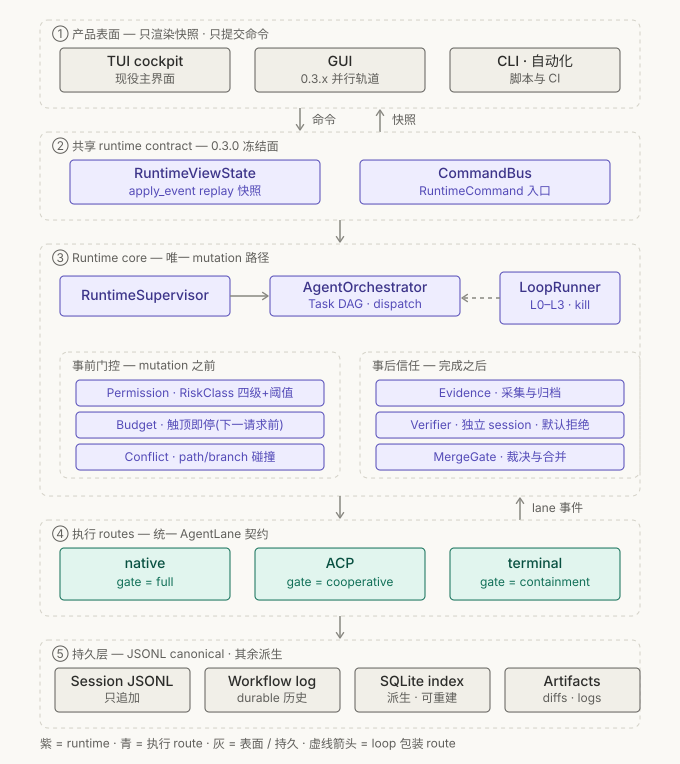

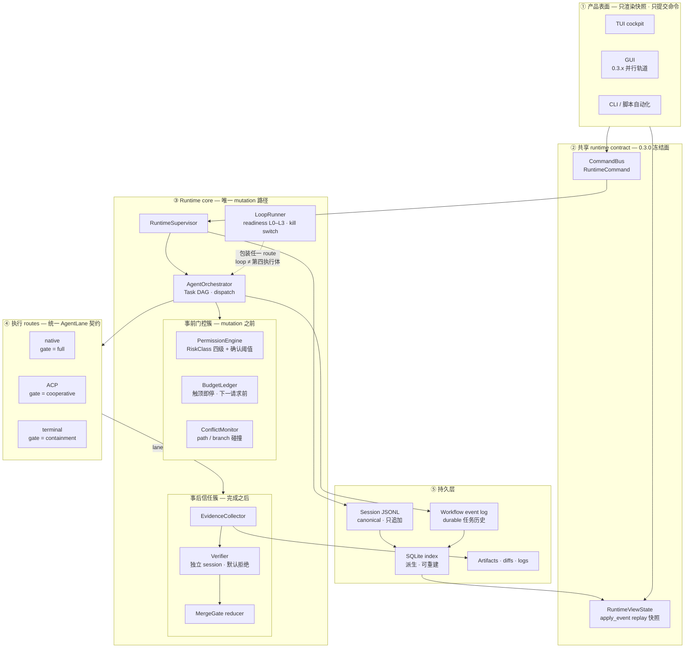

读图要点:

- **门控分事前/事后两簇**:PermissionEngine/BudgetLedger/ConflictMonitor 拦在 mutation 之前,Evidence/Verifier/MergeGate 裁在完成之后——两簇合起来才是完整的信任链,只有前者是"能不能做",只有后者是"做完算不算数"。
- **LoopRunner 在 core 内**、以虚线包装 orchestrator:吸取 OpenHands Automation Server 独立成层的反面教训,loop 不得成为绕过 gate 的旁路。
- UI 与 core 之间只有快照与命令两条通道;`IDX → SNAP` 表示视图状态永远从持久事件重建,UI 不持有真相。

### 4.2 Lane 统一契约与门控分级

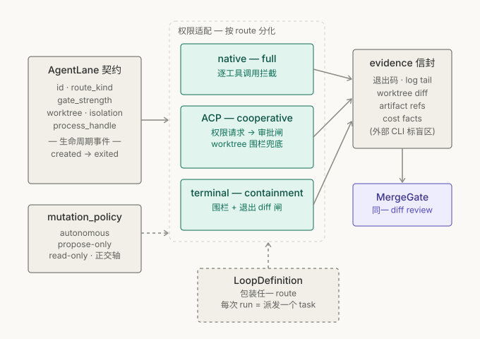

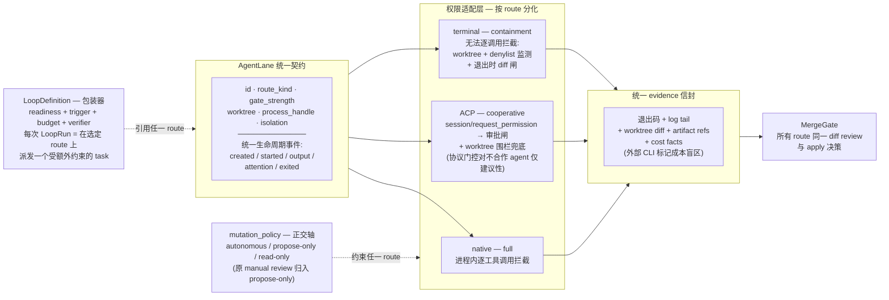

读图要点:统一在**契约层**(字段、生命周期、evidence 信封、merge 决策),分化在**权限适配层**(可门控性天差地别);`gate_strength` 徽标随 lane 常显于 Fleet 视图,让用户对"这条 lane 的输出可以多信"有直觉。

### 4.3 MergeGate 统一状态机(裁决两套并存问题)

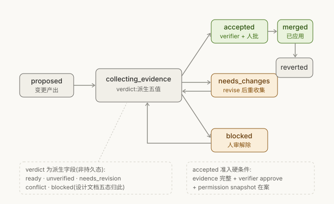

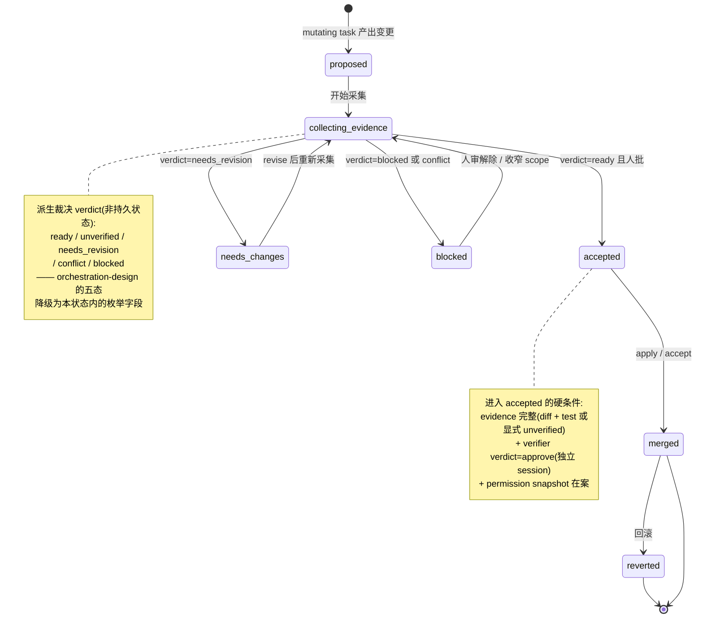

读图要点:**外层七态取自 multi-agent-core-orchestration(roadmap 引用的规范),作为持久状态机**;orchestration-loop-design 的五态不废弃,**降级为 `collecting_evidence` 内的派生 verdict 枚举**——两份文档由此互指、冲突消解。

### 4.4 数据模型(按 1.3 裁决重画)

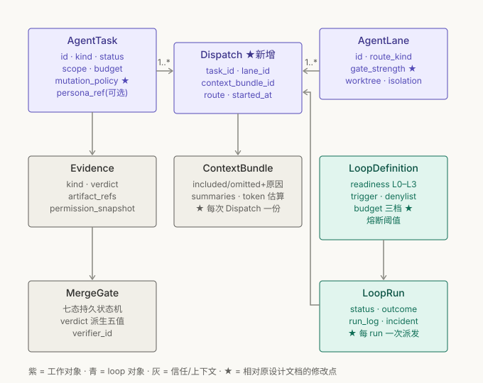

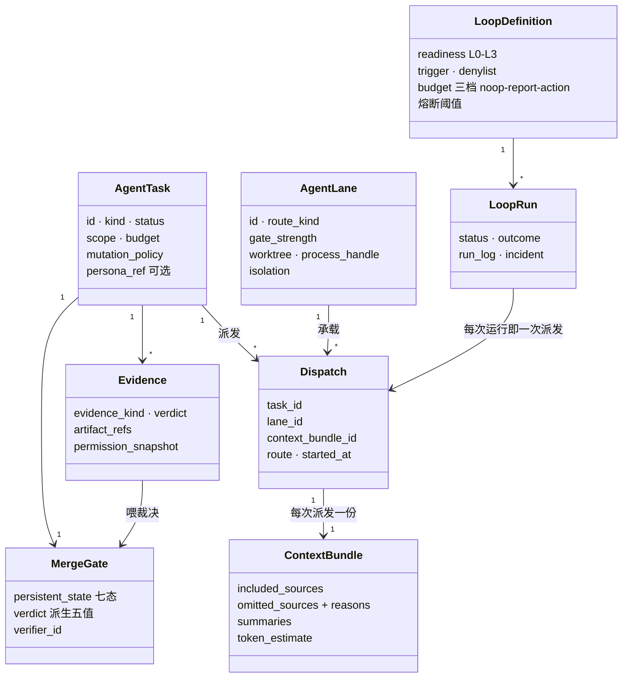

读图要点(相对设计文档原模型的三处修改):

1. **`Dispatch` 关联实体**取代 `AgentTask 1→* AgentLane` 直连——task 与 lane 多对多(terminal lane 承载多个先后 task;ACP session≡lane 内多轮 prompt;loop 复用同一 lane)。
2. **ContextBundle 挂在 Dispatch 上**(per task×lane),不再 task 级 1:1——DAG 中 planner/builder/reviewer 各需不同 bundle。
3. `mutation_policy` 落在 task、`gate_strength` 落在 lane,两个新字段正交。

### 4.5 Loop 就绪阶梯与放行条件

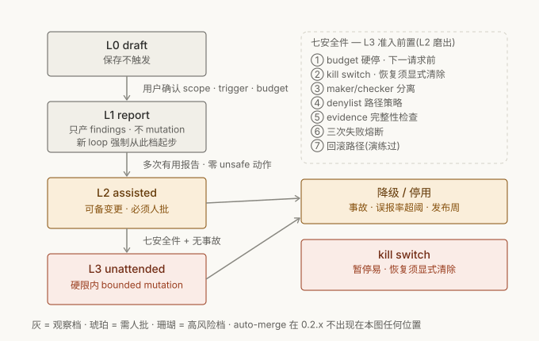

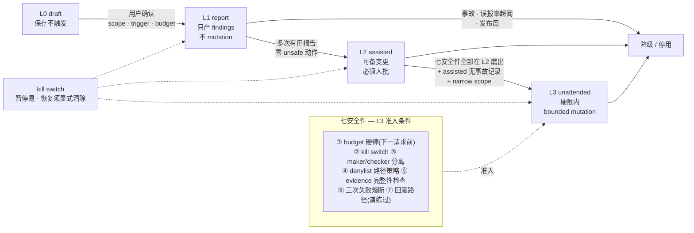

读图要点:新 loop 强制从 L1 起步(Loop Engineering 的 `week_one_mode` 语义);降级路径与晋级路径同为一等公民;kill switch 的"恢复须显式清除"不对称设计防止事故后静默复跑;auto-merge 在 0.2.x 全程不出现在此图任何位置。

## 五、核心交互流程图

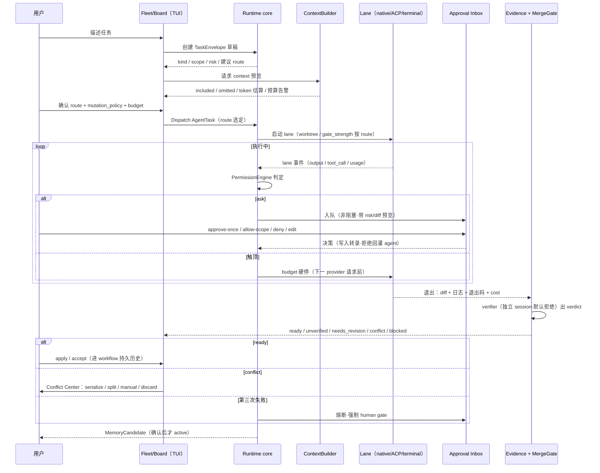

## 六、分阶段路线建议

### P0(0.2.1–0.2.3 期间,阻塞性)

1. **契约收敛包**(纯文档/类型工作,~数天):统一 MergeGate 状态机主从、角色清单七选、快照命名对齐代码、0.3.x 语义裁决、修资产路径;**合并 `codex/agent-loop-research` worktree 的两份设计文档进主线**。
2. 裁决两个所有权问题(按 1.3 建议):AgentTask 执行归 runtime/历史归 workflows;AgentLane 独立资源 + 多对多 dispatch。
3. Evidence record schema + MergeGate reducer 完成(0.2.3 既定),并纳入 verifier 契约(verdict 枚举 + evidence 附件 + 独立 session 约束)。
4. **Approval Inbox**(非阻塞审批队列,扩展 PendingApproval),决策事件写转录、拒绝回灌。
5. 工具门控引入 RiskClass 四级 + 确认阈值;**budget 硬停升格为 runtime 不变量**。
6. Terminal lane evidence 信封 v1:退出码 + log tail + worktree diff + artifact refs(结构化问题按此裁决,不再等完美 schema)。
7. lane 契约加 `gate_strength` 字段。

### P1(0.2.x 后半,体验主干)

1. **Agent Fleet Matrix** TUI 主屏(行=lane,列=route/gate/动作/paths/cost/evidence/blocker)。
2. **Orchestration Board**(消费 0.2.2 已落地的 DAG 事件)。
3. Route picker 四路(native/terminal/ACP 占位/loop 草稿)+ `mutation_policy` 正交字段。
4. **Context Ledger**(消费 0.2.1 ContextBundle facts,含 omitted reasons)。
5. lane 创建流的 per-lane worktree 选项(Zed 模式);ConflictMonitor v1(path overlap 检测 + 阻塞提示)。
6. per-lane 成本分账(OpenHands `usage_id` 模式)喂决策中心排序;external CLI lane 成本盲区显式标记。
7. MergeGate review 四段式 UI(变更摘要条 → 聚合 diff → 逐 hunk → 整体)+ checkpoint 回滚点。
8. 内部 eval pack v1(八个 smoke:探索/小改/评审/救火/文档/权限拒绝/预算触顶/上下文溢出)。

### P2(0.3.x,生态与自动化)

1. **ACP client lane**:initialize 能力协商持久化、session≡lane 映射、`request_permission`→审批闸、`session/update`→evidence 流、worktree 兜底;首个兼容目标建议选 **Gemini CLI**(官方 adapter 最成熟、免订阅制计费纠纷)验证,再接 Claude Code adapter。
2. **Loop Cockpit + LoopDefinition**:L0-L3 readiness、三档成本 budget、`week_one_mode` 强制低档起步、熔断阈值、kill switch 显式清除、run log 作 Evidence 子类型、`loop-audit` 等价诊断命令;先 report-only 四件套(依赖监控/triage/stale docs/release readiness)。
3. **插件轨道**:`viden-plugin.toml` manifest + capability 声明 + 用户侧 granted 收紧(Zed 双层模型)+ Git-repo registry 冷启动 + CI 校验;persona 角色包作为第一种低风险插件形态 + agency-agents 格式导入器。
4. Conflict Center 完整版;Timeline replay(JSONL 审计回放)。
5. 评估**反向 ACP**:Viden 暴露为 ACP agent,可被 Zed/JetBrains/Neovim 内嵌。

### 全程红线(不随阶段放宽)

auto-merge 0.2.x 禁止;ACP 不 auto-approve;plugin 不直改文件/shell/Git/memory;unattended 需七安全件 + assisted 无事故记录;布局模式不暗示权限模式;所有可见状态源自 runtime events,禁止装饰性 dashboard。

## 七、需要补充调研的问题清单

1. **ACP 不合作检测**:对绕过 `fs/*` 直写磁盘的 agent,worktree diff 核对的触发时机(轮内快照 vs 仅退出时)与文件系统监听(fsevents/inotify)的成本收益?
2. **Terminal lane 注意力检测**:Zed Terminal Thread 的「进程需要注意力」如何实现(OSC 序列?bell?输出停顿启发式?)——决定 Viden PTY lane 状态灯的可靠度。
3. **外部 CLI 成本代理指标**:Claude Code/Codex 无 token 可见性,wall-clock/diff 大小/调用次数哪种代理与真实成本相关性最好?是否可解析各家 CLI 的本地 usage 日志?
4. **ACP 兼容目标实测**:Gemini CLI / Goose / Claude Code adapter 三者的 `session/request_permission` 实际发起频率与粒度差异(决定 cooperative 档的真实门控覆盖率)。
5. **SQLite 编排查询 schema**:Fleet/Board/Inbox 三视图的查询模式(按 lane 聚合、按 gate 状态过滤、按注意力排序)对派生索引的 schema 要求。
6. **GUI 栈裁决输入**(gui-functional-design 开放问题):Tauri 对多 webview 密集刷新(fleet 矩阵高频更新)的性能边界。
7. **workspace-level loop 的权限模型**:跨 project loop 是否引入新的 scope 语义,还是强制拆为 per-project loop + 汇总报告?
8. **MCP 三源归属细化**:Viden 自身 MCP config、ACP agent 自带 MCP(`session/new` 的 `mcpServers` 参数)、插件声明的 MCP descriptor 三者的优先级与冲突规则。
9. **评测基线选型**:内部 eval pack 之外,是否接 SWE-bench 类外部基准作为 0.3.x loop 回归(参考 OpenHands benchmarks 仓的 SDK_SHA 钉版模式)?
10. **反向 ACP 的市场验证**:Zed/JetBrains 用户把「编排型 agent」当 ACP agent 接入的真实需求量(决定该项优先级)。

---

## 附:调研可信度说明

| 报告 | 核查方式 | 结论 |
| --- | --- | --- |
| ACP | 独立核查员抽查 4 项(方法名/能力字段/枚举/仓库结构) | 全部属实,可信度**高** |
| OpenHands | 独立核查员抽查 4 项(事件分类/安全三件套/委派签名/ACP 集成) | 全部属实,可信度**高** |
| Agency Agents | 独立核查员抽查 5 项 | 3 项属实、2 项有误(部门统计数字、个别函数名),**本报告已按核查修正**,可信度**中** |
| Zed | 报告全程直引官方文档 URL,但独立核查轮因工作流传参故障未执行 | 与仓库既有调研文档(agent-loop-research)交叉一致,建议关键 manifest 字段在实现前二次确认 |
| Loop Engineering | 同上(未过独立核查轮),全程直引 raw 仓库文件 | 字段级断言(registry.yaml/run-log schema)建议实现前二次确认 |
