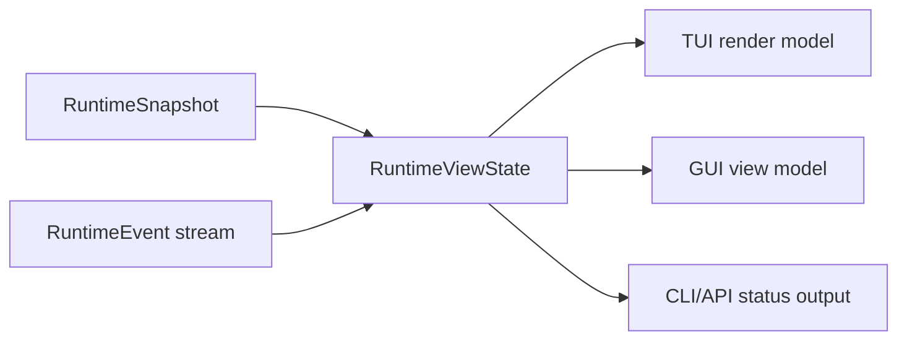

# Frontend Integration Contract

Chinese version: [frontend-integration-contract.zh-CN.md](frontend-integration-contract.zh-CN.md)

This document defines how completed core runtime modules are exposed to TUI,
GUI, CLI automation, and future clients. It is a contract document, not a UI
layout spec. TUI and GUI implementations must consume these facts instead of
owning provider loops, tool execution, permission decisions, or workflow state.

## Frozen Contract Identity

Core `0.3.0` freezes `frontend-contract-v1` as frontend schema `1`. The complete
compatibility manifest, migration gate, fixture corpus, and post-commit evidence
field are recorded in [Core 0.3 Compatibility](core-0.3-compatibility.md).

| Field | Frozen value |
| --- | --- |
| Component | `viden-core` |
| Component version | `0.3.0` |
| Active schema | `1` |
| Supported schemas | `[1]` |
| Client boundary | `CoreClient` and protocol/view contracts re-exported by `viden-core` |
| Contract payload | `contract_payload_sha: 5bd2b80b0953f4194d082940a7b9164c7231ca2d` |

The Core handshake advertises this exact lexically sorted capability set:

```text
runtime.agent_dag
runtime.approvals
runtime.commands
runtime.context
runtime.cost
runtime.events
runtime.evidence
runtime.merge_gate
runtime.queued_input
runtime.replay
runtime.snapshot
runtime.transcript_page
runtime.typed_lanes
runtime.typed_tasks
ui.preferences
```

The recorded SHA is the reviewed payload commit. This document is stored in a
separate evidence commit, which is the exact common TUI/GUI branch base; its
parent must equal the recorded payload SHA. No SHA is guessed or made
self-referential inside the payload commit.

## Integration Principles

- Core modules publish facts through `RuntimeSnapshot`, ordered
  `RuntimeEvent` values, and `RuntimeViewState`.
- Frontend code imports the transport-neutral `CoreClient` boundary and public
  protocol/view contracts from `viden-core`. It must not import runtime,
  provider, tool, permission, session, or workflow internals.
- Pre-release frontend branches open a project through `viden_core::LocalCoreHost`, which
  canonicalizes an existing workspace directory, runs the shared runtime
  bootstrap, starts a `RuntimeSupervisor`, and returns a bound `CoreClient`.
  Rebinding to another workspace creates an independent binding and stream; it
  must not mutate an existing client's cursor or snapshot. This is an internal
  Core `0.3.2` candidate service; it is not advertised as a handshake
  capability and does not change the `0.3.1` manifest before the final Task 6
  compatibility gate.
- Frontends send intent through `RuntimeCommand`; they do not call tools,
  providers, or permission engines directly.
- `RuntimeViewState::apply_event` is the canonical reducer for client-visible
  state. TUI, GUI, API, and tests should share equivalent replay fixtures.
- Durable workflow facts remain in `viden-workflows`; session transcript facts
  remain in `viden-session`. Frontends render them but do not mutate them
  directly.
- UI-only state is limited to layout, selection, focus, filters, sort order,
  local panel expansion, and scrollback position.
- `viden_core::legacy` is a deprecated, temporary bootstrap bridge for the
  pre-v3 TUI. New TUI, GUI, CLI, and API clients must not use it.

## Core Module Map

| Core module | Frontend surface | Primary facts | Commands / actions | Status |
| --- | --- | --- | --- | --- |
| Workspace host | first-run project open, workspace rebind | `WorkspaceBinding.canonical_root`, `session_id`, `stream_id` | `LocalCoreHost::open_workspace` | internal pre-release service; not a handshake capability until Task 6 |
| Trusted credential staging | provider credential entry, platform-secret bridge | `CredentialRequestId`, `CredentialHandle`, `ProviderHealthView.credential` | `BoundCoreClient::stage_credential`, then `StoreCredentialHandle` | internal Core `0.3.2` candidate; not a handshake capability until Task 6 |
| Compatibility and transport | client bootstrap, reconnect, compatibility error | `CoreHandshake`, schema version, capability set, `EventCursor`, snapshot/replay envelopes | `CoreClient::discover`, `snapshot`, `replay`, `recv`, `transcript_page` | frozen in Core `0.3.0` |
| Runtime supervisor | activity rail, live work indicator, cancellation affordance | `RuntimeEvent`, `RuntimeViewState`, `RuntimeErrorView` | `SubmitUserInput`, `QueueFollowUp`, `CancelActiveTurn` | landed |
| Mode and permissions | top bar, approval panel, permission picker | `RuntimeSnapshot.work_mode`, `RuntimeSnapshot.permission_level`, `ApprovalRequestView` | `SetWorkMode`, `SetPermissionLevel`, `RespondToApproval` | landed |
| Provider/model setup | provider panel, model picker, health strip | `RuntimeSnapshot.provider_id`, `ProviderHealthView`, active model config | `ConfigureProvider`, `SelectModel`, `ActivateModel`, `DeactivateModel` | landed |
| Tool execution | transcript tool cards, active tool strip, evidence list | `ToolCallStarted`, `ToolCallFinished`, structured `success` / `exit_code` | approval response only; tools run through core | landed |
| Agent DAG and tasks | agent board, lane list, task detail, next-action dock | `AgentDagRecord`, `AgentTaskRecord`, `AgentNextAction` | `StartAgentDag`, `StartAgentTask`, `CancelAgentTask` | landed in `0.2.2` |
| Agent workflow visibility | Mission Control board, workflow strip, plan/now/done/acceptance/blocked columns | `AgentDagRecord`, `AgentTaskRecord`, `EvidenceView`, `MergeGateRecord`, `RuntimeErrorView` | existing workflow/task/evidence/merge commands | proposed |
| ContextBundle | context panel, token pressure meter, omitted-source list | `ContextBundleRecord`, `ContextSourceRecord`, token budgets | no direct mutation; future context-policy commands | partial |
| Evidence and merge gate | evidence center, diff/test/review checklist, merge gate card | `EvidenceView`, `MergeGateRecord` | `RecordAgentEvidence`, `AcceptMergeGate`, `RejectMergeGate`, `AcceptAgentArtifact`, `RejectAgentArtifact`, `MergeAgentPatch` | reducer first slice landed in `0.2.3` |
| Cross-lane trust loop | handoff/review/contract/dependency cards, conflict and revert recovery | `HandoffRecord`, `ReviewRequestRecord`, `ContractRecord`, `DependencyRecord`, typed `MergeGateRecord`, `ConflictBounce`, `RevertRecord` | `CreateHandoff`, `RequestReview`, `ConfirmContract`, `SetDependency`, `BounceMergeConflict`, `RevalidateMergeConflict`, `RevertAppliedChange` | additive `runtime.trust_loop` candidate |
| Token/cost | cost bar, provider card, task budget panel | `TokenCostView`, provider telemetry | future budget commands | partial |
| Lanes and external agents | lane monitor, external-job cards | `AgentLaneRecord`, lane lifecycle events | negotiated lane lifecycle commands | additive Core `0.3.1` candidate |
| Reviewed starter Lane | first-run starter choice, reviewed branch/worktree confirmation | owner-scoped `StarterLanePreview`, `StarterLaneReceipt`, typed invalidation reason | `PreviewStarterLane`, then `CreateStarterLane` with the exact preview id/hash | internal pre-release service; not a handshake capability until Task 6 |
| Errors and recovery | inline warning, recovery dock, retry action | `RuntimeErrorView`, `AgentNextAction` | task-specific retry command or existing runtime command | landed |
| UI preferences | locale, skin/mode, density, motion | synchronized `RuntimeViewState.ui_preferences` and `RuntimeSnapshot.ui_preferences`, `UiPreferencesUpdated` | `SetUiPreferences`, `ResetUiPreferences` | internal Core `0.3.2` candidate on schema `1`; not a handshake capability until Task 6 |
| Recent work | cross-project history and resume entry points | `RuntimeViewState.recent_projects`, `recent_sessions`, `recent_work_diagnostics`, `RecentWorkLoaded` | `QueryRecentWork` | internal Core `0.3.2` candidate on schema `1`; not a handshake capability until Task 6 |

## Event Consumption Rules

Frontends should process events in strict sequence order.



- `SnapshotUpdated` replaces the baseline snapshot.
- `AssistantDelta` appends to `assistant_stream`; clients may also render
  deltas in transcript order.
- `ToolCallStarted` inserts an active tool call; `ToolCallFinished` removes it
  and may append evidence.
- `TaskUpdated`, `AgentDagUpdated`, `LaneUpdated`, `EvidenceRecorded`,
  `ContextUpdated`, `MergeGateUpdated`, `HandoffUpdated`,
  `ReviewRequestUpdated`, `ContractUpdated`, `DependencyUpdated`,
  `MergeConflictBounced`, and `RevertRecorded` upsert their records by id.
- `ApprovalRequested` and `ApprovalResolved` maintain pending approvals.
- `InputQueued` and `InputDequeued` maintain follow-up input state.
- `ProviderHealthUpdated`, `TokenCostUpdated`, and `Error` update side panels
  without blocking composer input.
- `ProjectProbed`, `ProjectConfigPreviewed`, `ProjectConfigConfirmed`, and
  `CredentialHandleStored` update onboarding state; clients must not infer a
  successful write from command acceptance alone.
- `RecentWorkLoaded` atomically replaces the three recent-work view slices;
  snapshot and replay recover the most recently loaded safe result.
- `StarterLanePreviewed` upserts one owner-scoped preview;
  `StarterLanePreviewInvalidated` removes only its exact owner/id pair; and
  `StarterLaneCreated` replaces that preview with the authoritative receipt and
  durable Lane fact. The payload owner must equal the envelope owner. These
  events participate in normal in-process snapshot and replay recovery.
- Every command, snapshot, and event envelope uses schema `1`. A known event's
  sequence must equal its cursor sequence.
- Clients call `discover` before sending commands or consuming state. Missing
  required capabilities and unsupported schemas are compatibility errors.
- Duplicate or older cursors do not change confirmed state. A contiguous next
  event is reduced normally; a gap triggers replay; a stream mismatch or replay
  boundary that requires a snapshot replaces state only after validation.
- Unknown optional event payloads remain inspectable but do not create local
  business state. Unknown mandatory fixture capabilities and malformed legacy
  input are rejected.

## Command Ownership

| User intent | Frontend sends | Core owns |
| --- | --- | --- |
| Start a normal turn | `SubmitUserInput` | provider loop, context bundle, tools, transcript |
| Add input while work runs | `QueueFollowUp` | queue ordering and later dequeue |
| Cancel current work | `CancelActiveTurn` or `CancelAgentTask` | request cancellation and task state |
| Start supervised workflow | `StartAgentDag` then `StartAgentTask` | DAG validation, dependencies, workflow events |
| Change mode/permissions | `SetWorkMode`, `SetPermissionLevel` | permission mode mapping and policy enforcement |
| Approve or deny a tool | `RespondToApproval` | decision recording and gated execution |
| Record evidence for a gate | `RecordAgentEvidence` | evidence validation, `EvidenceRecorded`, gate reducer, workflow event |
| Review a merge gate | merge/artifact commands | gate state, workflow events, patch application |
| Coordinate cross-lane trust | handoff/review/contract/dependency commands | typed owner/audit facts, dependency state, validator policy, replay |
| Recover an apply | `BounceMergeConflict`, revalidated evidence, `RevertAppliedChange` | originating-lane bounce, write-ahead workflow fact, byte rollback, typed recovery |
| Configure provider/model | provider/model commands | config persistence, registry validation, health |
| Probe and onboard a project | `ProbeProject`, `PreviewProjectConfig`, `ConfirmProjectConfig` | Git/config probe, exact reviewed bytes/hash, permission-gated write and replay |
| Store a credential reference | `StoreCredentialHandle` with opaque ingress id | injected backend access, safe handle fact, provider health and secret exclusion |
| Load recent work | `QueryRecentWork { query }` | shared-home discovery, canonical metadata validation, stable ordering, bounds, diagnostics, and safe view projection |
| Create a starter Lane | `PreviewStarterLane`, review the result, then `CreateStarterLane` with the unchanged request/id/hash | preset resolution, repository/base/path checks, permission gate, execution-time recheck, compensation, typed receipt |

`PreviewProjectConfig` is read-only. A valid preview includes the exact UTF-8
contents that its SHA-256 describes; invalid or secret-bearing candidates omit
those contents and cannot be confirmed. Root `viden.toml` accepts only the D11
`project`, `gates`, `runner`, `budget`, and `targets` schema; unknown root or
nested fields are rejected. Provider, backend, and ingress identifiers must be
bounded opaque ASCII identifiers, not paths or secret-like labels. Serialized credential commands,
events, transcript rows, and workflow audit never contain credential secret
bytes.

For local frontends, credential bytes cross only the trusted host API:
`BoundCoreClient::stage_credential(provider_id, backend_id, SecretBytes)` returns
a serializable `CredentialRequestId`. `SecretBytes` is not cloneable,
debug-printable, or serializable and is zeroized on drop. The staged request is
workspace-, provider-, and backend-bound, expires after five minutes, is capped
by host capacity, and is removed exactly once before the platform credential
sink is called. A wrong workspace/provider/backend cannot consume another
workspace's request id; a sink failure does consume the request so replay cannot
retry secret bytes. Until a platform sink is injected, production
`LocalCoreHost` returns a typed unavailable error rather than storing secrets.

Frontends must not synthesize successful state after sending a command. They
should wait for `CommandAccepted` plus subsequent state events. If the command
is rejected, render `CommandRejected.reason`.

### Reviewed Starter Lane

The read-only preview resolves the `coder`, `reviewer`, or `tester` preset into
an exact owner, Lane record, branch, canonical worktree path, current Git base,
diagnostics, preview id, and SHA-256. The hash binds the owner and every resolved
creation field. A create request is one-shot and must match the original request,
owner, id, hash, current base, branch availability, and worktree availability.
Core performs the permission check before any Git or workflow effect and repeats
the base/path/branch checks immediately before execution after a pending approval.
While that approval is pending, the reviewed preview remains visible, and any
second reviewed create or other Lane mutation for the same Lane is rejected
without replacing its receipt association.
`CancelActiveTurn` is the exception: after the approval is visible it resolves
that approval as denied, invalidates the preview with `permission_denied`, and
emits no Lane, recovery, error, Git, or workflow effect.

Matched invalid requests and denied or failed execution emit
`StarterLanePreviewInvalidated` with a closed reason code. An unknown id or a
wrong owner does not consume another owner's preview. Only
`StarterLaneCreated.receipt` authorizes immediate navigation to the created Lane;
`LaneUpdated` remains the durable Lane fact and is not a substitute for this
review receipt. If persistence fails after Git worktree creation, Core removes
both the worktree and the newly created branch before reporting recovery.

Previews are normal owner-scoped state within the current runtime stream and are
available through snapshot and replay after reconnect. A process restart creates
a new stream and preview cache, so an old preview must be generated again. The
legacy `CreateLane` command remains supported for existing callers; first-run D4
flows use the reviewed command pair. Capability/version/fixture advertisement is
deferred to Task 6.

## Agent DAG And Task UI Contract

`AgentDagRecord` is the workflow container. `AgentTaskRecord` is the
frontend-facing unit of work.

The first workflow surface should answer the Mission Control questions defined
in [Agent Workflow Visibility](agent-workflow-visibility.md): assignment
rationale, planned next work, current work, completed output, acceptance state,
blockers, and cost impact.

Required rendering fields:

- `id`, `parent_id`, `agent`, `kind`, `transport`, and `title` identify the
  task.
- `status`, `activity`, and `progress` drive visible state and progress.
- assignment reason and cost profile explain why this agent/tool/skill owns the
  task.
- `summary`, `result`, and `next_action` describe the outcome and next step.
- `workspace`, `evidence`, and `permissions` link to supporting facts.
- `started_at` and `updated_at` are display timestamps; they are not ordering
  substitutes for runtime event sequence numbers.

Status handling:

| Status group | Values | UI behavior |
| --- | --- | --- |
| Pending/running | `queued`, `thinking`, `streaming`, `editing`, `running_tool`, `testing`, `reviewing`, `running`, `attached` | show active animation, allow cancel, keep composer editable |
| Waiting | `waiting_approval`, `needs_input`, `blocked` | show required user action or dependency |
| Completed | `done`, `applied`, `discarded`, `archived` | show outcome, evidence, next action if present |
| Failed/cancelled | `failed`, `cancelled` | show recovery hint and retry/cancel history |

## Evidence And Merge Gate UI Contract

Evidence is append-only from the frontend point of view.

- `EvidenceView.id` is the stable lookup key.
- `kind` controls icon, filter, and checklist grouping.
- `summary` is human-readable and may be truncated for compact surfaces.
- `path` links to files or artifacts when present.
- `source` identifies the role, tool, or runtime source.
- `timestamp` is display-only.

`MergeGateRecord` connects evidence to a task:

- `required_evidence` declares the checklist.
- `evidence_ids` records collected evidence.
- `status` controls the action surface.
- `gate_type`, `owner`, `validator`, and `policy_snapshot` preserve the
  authority and policy used for a decision.
- `decision` is a typed outcome with reason, actual actor, exact reviewed
  evidence id/hash bindings, review-request id, audit id, and timestamp. Legacy
  schema-1 string decisions are read-only migration facts; new writes never
  serialize strings.
- `conflict`, `applied_change_id`, `recovery_snapshot`, and `audit_ids` connect
  bounce, apply, restart-safe revert recovery, and audit without frontend
  inference. `recovery_snapshot` exposes only a safe snapshot id and manifest
  hash; recovery bytes remain in the workflow-owned private store.

Current `0.2.3` reducer behavior:

- Frontends record external evidence with `RecordAgentEvidence`.
- Core emits `EvidenceRecorded`, then `MergeGateUpdated`, and persists a matching
  `agent_evidence_recorded` workflow event.
- `MergeGateRecord.status` is reduced from recorded evidence kinds, not from
  frontend-local checklist state or evidence id suffixes.
- Missing required evidence or summary-only evidence keeps the gate in
  `collecting_evidence`; only verified canonical references satisfy required
  evidence.
- Provider/assistant task output is always display-only `task_summary`
  evidence, even when it contains a diff or claims hashes, verification, test,
  or permission status. Canonical evidence requires real ContextStore bytes and
  a Core-issued permission receipt.
- Complete canonical evidence may move a basic gate to `accepted`. A gate with
  an independent review policy, or a gate revalidated after conflict, requires
  an explicit typed acceptance by the assigned validator over the exact current
  evidence id/hash set before merge.
- `RequestReview.owner` must exactly match the requesting gate owner scope
  (`workspace_id`, `project_id`, `lane_id`, and `task_id`), not just the lane
  string, and is not the validator. Core derives the validator lane from
  `reviewer_lane_id`, so a reviewer cannot create a self-authorizing review
  request. `dependency_id` is bound to one `(task_id, depends_on_task_id)` edge
  and cannot be rebound to another edge, including by an `Unblocked` update.
- Rejected evidence moves the gate to `needs_changes` and removes that evidence
  id from the gate/task evidence lists. `RejectMergeGate` and
  `RejectAgentArtifact` carry an explicit `actor`; Core rejects missing or
  unauthorized actors before approval and records the accepted actor on the
  typed decision.
- `AcceptAgentArtifact` only accepts an already recorded evidence id. Unknown
  evidence ids are rejected and must not be used by frontends as implicit
  evidence creation. `RejectAgentArtifact` only rejects evidence already bound
  to the selected gate.
- Trust-loop mutations use the normal supervisor approval flow. Pure owner,
  dependency, decision, receipt, and canonical-byte preflight completes before
  `ApprovalRequested`. Merge publishes a private, content-addressed recovery
  snapshot and durable precommit before file effects; conflict bounce requires
  the gate owner origin lane plus a verified canonical baseline. Revert verifies
  the snapshot and current postimage before approval, including after restart.
  Recovery snapshot load is read-only: a missing recovery store returns a
  validation error without creating private directories, locks, or chmod side
  effects, and symlinks inside the private recovery tree are rejected before
  bytes are read or restored.

The first supported required evidence kinds are `patch`, `test_result`,
`review`, `doc_update`, and `release_artifact`. Clients may display other
runtime-provided kinds, but should treat the known set as first-class checklist
groups.

## Context And Token UI Contract

`ContextBundleRecord` is read-only for current frontends:

- `sources` explain what entered the provider request.
- `omitted_sources` explain what was intentionally excluded.
- `estimated_tokens`, `soft_token_budget`, `hard_token_limit`, and
  `pressure_percent()` drive token pressure UI.
- `largest_sources` and `compaction_notes` drive context diagnostics.

TUI should use compact summaries and drill-down panels. GUI should expose a
source table with filters for included, omitted, large, diagnostic, and
evidence sources.

The native Context Engine extends this projection with bundle-built, item/view
derived, retrieval, budget, quality, cache, and cost events. Frontends may send
`RetrieveContext` with a user-visible reason, but only runtime resolves handles
and returns bounded content. Frontends must never import `crates/context`, read
canonical blobs, trust compact views as merge evidence, or calculate
authoritative cost. See
[Context, Evidence, And Cost Engine Design](superpowers/specs/2026-07-18-context-evidence-cost-engine-design.md).

## Approval And Permission UI Contract

Approvals use `ApprovalRequestView` and `RespondToApproval`.

Frontends must show:

- `title`, `tool_name`, and `message`;
- `input_preview`;
- `is_mutating`;
- `reason`, when present;
- the active permission level and work mode from `RuntimeSnapshot`.

Frontends must not call the underlying tool after approval. They send
`RespondToApproval`; the runtime resumes or denies execution.

## UI Preference And Design Entry Contract

Schema `1` exposes configuration values needed by both frontends without
prescribing their layout:

- the effective frontend fact is the synchronized
  `RuntimeViewState.ui_preferences` and
  `RuntimeSnapshot.ui_preferences: ResolvedUiPreferences`; frontends render it
  and do not re-resolve preference precedence locally;
- clients send a typed `UiPreferencePatch` through `SetUiPreferences`, or send
  `ResetUiPreferences` to delete the complete user `[ui]` table. A local visual
  preview is not persistence confirmation;
- only a successful `UiPreferencesUpdated { resolved, persisted, diagnostics }`
  confirms the write. `persisted` is `None` after reset, while `resolved` still
  reflects a safe CLI override or the system/built-in fallback;

- built-in effective locales: `en` and `zh-CN`; `system` is a resolver input,
  not a third built-in translation catalog;
- skins: `aurora`, `ice`, `mono`, `amber`, and `phosphor`;
- eight valid effective skin/mode pairs: `aurora/dark`, `aurora/light`,
  `ice/dark`, `ice/light`, `mono/dark`, `mono/light`, `amber/dark`, and
  `phosphor/dark`;
- densities: `compact`, `regular`, and `comfy`;
- motion policies: `system`, `reduced`, and `full`.

`amber` and `phosphor` are dark-only. Persisted preference mutations validate
the complete resulting profile before any approval prompt or filesystem
effect; an invalid pair such as `amber/light` is rejected. Startup fallback for
legacy invalid input remains the safe `aurora/dark`, regular-density profile
with a stable `ui.invalid_skin_mode_pair` diagnostic.

Personal preference precedence is safe CLI UI override, stored user `[ui]`,
system resolution, then built-in English. Project `.viden/config.toml` never
selects personal locale, appearance, density, or motion and is never the
personal preference write target. Core writes only the five known `[ui]` keys,
preserves unrelated top-level and future `[ui]` keys, and uses a same-directory
`0600` temporary file, file sync, atomic replacement, and directory sync.
Corrupt TOML, invalid profiles, and Plan/Review/Explore denial leave bytes,
mtime, and temporary-file state unchanged.

The user config is the recovery authority. `UiPreferencesUpdated` is a current
runtime/frontend journal projection and is intentionally not duplicated into
the project workflow JSONL log.

The design entry hierarchy is normative and must not be replaced by old or
generated screenshots:

1. global design index: `docs/viden-design/Viden/index.html`;
2. client index: `TUI/Viden - 设计稿索引 (TUI).html` or
   `GUI/Viden - 设计稿索引 (GUI).html`;
3. component library: `TUI/Viden - 组件库 (TUI).html` or
   `GUI/Viden - 组件库 (GUI).html`;
4. canonical product entry: `TUI/Viden - 统一原型 (TUI).html` or
   `GUI/Viden - 桌面驾驶舱 (GUI).html` (D1).

GUI `pages/Viden - D11 首启与项目接入 (GUI).html` is subordinate first-run
onboarding. It is not the GUI cockpit and must not replace D1 as the desktop
visual target. All relative paths in this list start at
`docs/viden-design/Viden/`.

## Recent Work Contract

`QueryRecentWork` is read-only, available in Plan mode, and never requests
approval. Core emits exactly `CommandAccepted` followed by `RecentWorkLoaded`
on success. The loaded fact is retained in the supervisor snapshot/replay view,
but is not copied into session or workflow durable JSONL.

Production `LocalCoreHost::new()` resolves one user-scoped shared session home;
project-local `.viden` directories are not a cross-project inventory. Core
alone scans `<session-home>/projects`. Frontends must not inspect session files,
SQLite, or project directories.

Each new transcript begins with one committed metadata batch containing its
canonical root and stable creation timestamp. Inventory rebuild streams JSONL
line by line, recognizes only entry kinds, safe counts, those two metadata
facts, and stable timestamps, and never loads transcript bodies as summaries.
It validates the root-derived project key against the containing project
directory. Legacy records without a root and tampered identities are skipped
with stable diagnostics; the current cwd is never substituted. A non-empty
SQLite index is reconciled with this canonical inventory rather than trusted as
complete.

`RecentSessionSummary` is a whitelist DTO containing only canonical root,
session id, stable timestamps, and message/tool-call/command counts.
`RecentProjectSummary` contains canonical root, derived display name, latest
stable timestamp, and latest session id. Neither DTO contains transcript path,
title, preview text, arbitrary metadata, credential/backend values, or any
message, tool, or command body. Identity is `(canonical_root, session_id)`.

Core clamps `limit` to `1..=100`, globally orders sessions by
`(last_updated_at DESC, canonical_root ASC, session_id ASC)`, truncates that
session list first, and only then aggregates projects from the bounded result.
Both returned collections are therefore bounded.

## TUI Requirements

- Render only from `RuntimeViewState` plus local terminal layout state.
- Keep composer input editable while provider turns, agent tasks, approvals, or
  tool calls are active.
- Keep scrollback independent from active task state.
- Prefer compact panels: active task, approval, evidence, context pressure, and
  provider health.
- Never infer task/tool success from rendered transcript text.

## GUI Requirements

- Use the same reducer semantics as TUI.
- Build GUI view models from `RuntimeViewState`, not from separate stores.
- Keep GUI-only data scoped to filters, selected ids, pane layout, and local
  notifications.
- Every GUI screen that shows runtime facts must declare which fields it reads.
- GUI shutdown must not mutate session, workflow, provider, or permission
  state.

## Frozen Parity Corpus

Core `0.3.0` freezes exactly nine schema-1 fixtures under
`crates/types/tests/fixtures/frontend-contract-v1/`:

1. `stream-tool.json`
2. `approval-allow-deny.json`
3. `queued-follow-up.json`
4. `dag-blocker.json`
5. `multi-lane.json`
6. `merge-gate.json`
7. `context-pressure-cost-blind.json`
8. `plan-denial.json`
9. `d1-vertical-slice.json`

Each fixture contains its id, schema version, sorted required capabilities,
initial snapshot, contiguous event envelopes, expected final cursor, and final
view digest. Replay starts only after the v0 migration gate succeeds. Each
fixture is replayed twice from the same initial snapshot and must produce the
same `RuntimeViewState`, cursor, canonical bytes, and SHA-256 digest.

Canonical digest input is compact JSON for the final `RuntimeViewState` after
recursively sorting object keys. Array order remains semantic. The digest table
is synchronized with the tested fixture values in
[Core 0.3 Compatibility](core-0.3-compatibility.md).

TUI and GUI branches must start from the same resolved contract payload commit
and replay this corpus without frontend-owned effects or inferred success.
