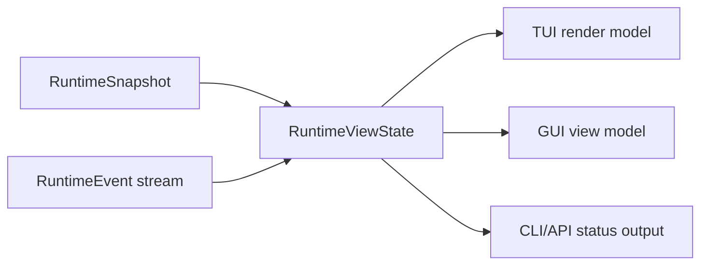

# Frontend Integration Contract

Chinese version: [frontend-integration-contract.zh-CN.md](frontend-integration-contract.zh-CN.md)

This document defines how completed core runtime modules are exposed to TUI,
GUI, CLI automation, and future clients. It is a contract document, not a UI
layout spec. TUI and GUI implementations must consume these facts instead of
owning provider loops, tool execution, permission decisions, or workflow state.

## Integration Principles

- Core modules publish facts through `RuntimeSnapshot`, ordered
  `RuntimeEvent` values, and `RuntimeViewState`.
- Frontends send intent through `RuntimeCommand`; they do not call tools,
  providers, or permission engines directly.
- `RuntimeViewState::apply_event` is the canonical reducer for client-visible
  state. TUI, GUI, API, and tests should share equivalent replay fixtures.
- Durable workflow facts remain in `viden-workflows`; session transcript facts
  remain in `viden-session`. Frontends render them but do not mutate them
  directly.
- UI-only state is limited to layout, selection, focus, filters, sort order,
  local panel expansion, and scrollback position.

## Core Module Map

| Core module | Frontend surface | Primary facts | Commands / actions | Status |
| --- | --- | --- | --- | --- |
| Runtime supervisor | activity rail, live work indicator, cancellation affordance | `RuntimeEvent`, `RuntimeViewState`, `RuntimeErrorView` | `SubmitUserInput`, `QueueFollowUp`, `CancelActiveTurn` | landed |
| Mode and permissions | top bar, approval panel, permission picker | `RuntimeSnapshot.work_mode`, `RuntimeSnapshot.permission_level`, `ApprovalRequestView` | `SetWorkMode`, `SetPermissionLevel`, `RespondToApproval` | landed |
| Provider/model setup | provider panel, model picker, health strip | `RuntimeSnapshot.provider_id`, `ProviderHealthView`, active model config | `ConfigureProvider`, `SelectModel`, `ActivateModel`, `DeactivateModel` | landed |
| Tool execution | transcript tool cards, active tool strip, evidence list | `ToolCallStarted`, `ToolCallFinished`, structured `success` / `exit_code` | approval response only; tools run through core | landed |
| Agent DAG and tasks | agent board, lane list, task detail, next-action dock | `AgentDagRecord`, `AgentTaskRecord`, `AgentNextAction` | `StartAgentDag`, `StartAgentTask`, `CancelAgentTask` | landed in `0.2.2` |
| ContextBundle | context panel, token pressure meter, omitted-source list | `ContextBundleRecord`, `ContextSourceRecord`, token budgets | no direct mutation; future context-policy commands | partial |
| Evidence and merge gate | evidence center, diff/test/review checklist, merge gate card | `EvidenceView`, `MergeGateRecord` | `AcceptMergeGate`, `RejectMergeGate`, `AcceptAgentArtifact`, `RejectAgentArtifact`, `MergeAgentPatch` | basic landed; reducers expand in `0.2.3` |
| Token/cost | cost bar, provider card, task budget panel | `TokenCostView`, provider telemetry | future budget commands | partial |
| Lanes and external agents | lane monitor, external-job cards | `AgentLaneRecord`, task/evidence events | future lane commands | partial |
| Errors and recovery | inline warning, recovery dock, retry action | `RuntimeErrorView`, `AgentNextAction` | task-specific retry command or existing runtime command | landed |

## Event Consumption Rules

Frontends should process events in strict sequence order.

- `SnapshotUpdated` replaces the baseline snapshot.
- `AssistantDelta` appends to `assistant_stream`; clients may also render
  deltas in transcript order.
- `ToolCallStarted` inserts an active tool call; `ToolCallFinished` removes it
  and may append evidence.
- `TaskUpdated`, `AgentDagUpdated`, `LaneUpdated`, `EvidenceRecorded`,
  `ContextUpdated`, and `MergeGateUpdated` upsert their records by id.
- `ApprovalRequested` and `ApprovalResolved` maintain pending approvals.
- `InputQueued` and `InputDequeued` maintain follow-up input state.
- `ProviderHealthUpdated`, `TokenCostUpdated`, and `Error` update side panels
  without blocking composer input.

## Command Ownership

| User intent | Frontend sends | Core owns |
| --- | --- | --- |
| Start a normal turn | `SubmitUserInput` | provider loop, context bundle, tools, transcript |
| Add input while work runs | `QueueFollowUp` | queue ordering and later dequeue |
| Cancel current work | `CancelActiveTurn` or `CancelAgentTask` | request cancellation and task state |
| Start supervised workflow | `StartAgentDag` then `StartAgentTask` | DAG validation, dependencies, workflow events |
| Change mode/permissions | `SetWorkMode`, `SetPermissionLevel` | permission mode mapping and policy enforcement |
| Approve or deny a tool | `RespondToApproval` | decision recording and gated execution |
| Review a merge gate | merge/artifact commands | gate state, workflow events, patch application |
| Configure provider/model | provider/model commands | config persistence, registry validation, health |

Frontends must not synthesize successful state after sending a command. They
should wait for `CommandAccepted` plus subsequent state events. If the command
is rejected, render `CommandRejected.reason`.

## Agent DAG And Task UI Contract

`AgentDagRecord` is the workflow container. `AgentTaskRecord` is the
frontend-facing unit of work.

Required rendering fields:

- `id`, `parent_id`, `agent`, `kind`, `transport`, and `title` identify the
  task.
- `status`, `activity`, and `progress` drive visible state and progress.
- `summary`, `result`, and `next_action` describe the outcome and next step.
- `workspace`, `evidence`, and `permissions` link to supporting facts.
- `started_at` and `updated_at` are display timestamps; they are not ordering
  substitutes for runtime event sequence numbers.

Status handling:

| Status group | Values | UI behavior |
| --- | --- | --- |
| Pending/running | `queued`, `thinking`, `streaming`, `editing`, `running_tool`, `testing`, `reviewing`, `running`, `attached` | show active animation, allow cancel, keep composer editable |
| Waiting | `waiting_approval`, `needs_input`, `blocked` | show required user action or dependency |
| Completed | `done`, `applied`, `discarded`, `archived` | show outcome, evidence, next action if present |
| Failed/cancelled | `failed`, `cancelled` | show recovery hint and retry/cancel history |

## Evidence And Merge Gate UI Contract

Evidence is append-only from the frontend point of view.

- `EvidenceView.id` is the stable lookup key.
- `kind` controls icon, filter, and checklist grouping.
- `summary` is human-readable and may be truncated for compact surfaces.
- `path` links to files or artifacts when present.
- `source` identifies the role, tool, or runtime source.
- `timestamp` is display-only.

`MergeGateRecord` connects evidence to a task:

- `required_evidence` declares the checklist.
- `evidence_ids` records collected evidence.
- `status` controls the action surface.
- `decision` stores the latest operator or runtime decision.

Current implementation supports basic gate transitions and unified-diff patch
application. `0.2.3` should expand evidence collection reducers, richer patch
formats, and test/review/release evidence gates.

## Context And Token UI Contract

`ContextBundleRecord` is read-only for current frontends:

- `sources` explain what entered the provider request.
- `omitted_sources` explain what was intentionally excluded.
- `estimated_tokens`, `soft_token_budget`, `hard_token_limit`, and
  `pressure_percent()` drive token pressure UI.
- `largest_sources` and `compaction_notes` drive context diagnostics.

TUI should use compact summaries and drill-down panels. GUI should expose a
source table with filters for included, omitted, large, diagnostic, and
evidence sources.

## Approval And Permission UI Contract

Approvals use `ApprovalRequestView` and `RespondToApproval`.

Frontends must show:

- `title`, `tool_name`, and `message`;
- `input_preview`;
- `is_mutating`;
- `reason`, when present;
- the active permission level and work mode from `RuntimeSnapshot`.

Frontends must not call the underlying tool after approval. They send
`RespondToApproval`; the runtime resumes or denies execution.

## TUI Requirements

- Render only from `RuntimeViewState` plus local terminal layout state.
- Keep composer input editable while provider turns, agent tasks, approvals, or
  tool calls are active.
- Keep scrollback independent from active task state.
- Prefer compact panels: active task, approval, evidence, context pressure, and
  provider health.
- Never infer task/tool success from rendered transcript text.

## GUI Requirements

- Use the same reducer semantics as TUI.
- Build GUI view models from `RuntimeViewState`, not from separate stores.
- Keep GUI-only data scoped to filters, selected ids, pane layout, and local
  notifications.
- Every GUI screen that shows runtime facts must declare which fields it reads.
- GUI shutdown must not mutate session, workflow, provider, or permission
  state.

## Parity Fixtures

Before parallel TUI/GUI implementation, add shared fixtures that replay the same
event stream into both frontends:

- provider turn with streaming text and tool call;
- approval request and approval denial;
- queued follow-up while a turn is active;
- Agent DAG with dependency blocker and retry next action;
- Evidence/MergeGate accept, reject, conflict, and merge;
- provider failure with recovery hint;
- context pressure with omitted sources;
- scoped Git denial and release-gate denial.

These fixtures are the acceptance contract for `0.3.x` TUI/GUI parity.
