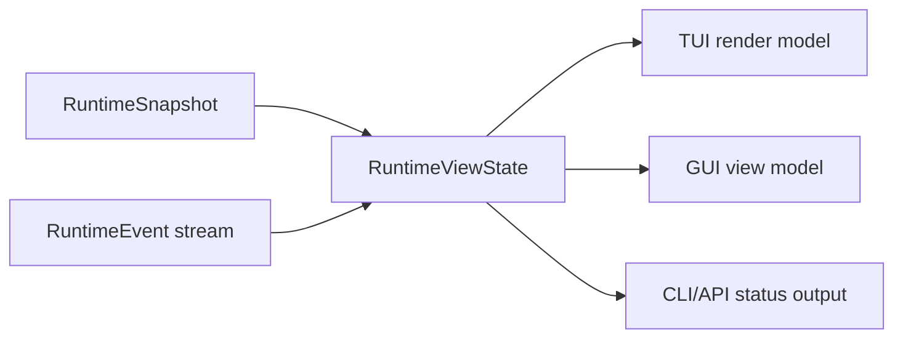

# 前端对接契约

English version: [frontend-integration-contract.md](frontend-integration-contract.md)

本文定义已经完成的核心 runtime 模块如何暴露给 TUI、GUI、CLI automation 和未来
clients。这是契约文档，不是 UI 布局规范。TUI 和 GUI 实现必须消费这些事实，不能自己
拥有 provider loop、tool execution、permission decisions 或 workflow state。

## 冻结契约标识

Core `0.3.0` 将 `frontend-contract-v1` 冻结为前端 schema `1`。完整的兼容清单、
migration gate、fixture corpus 和 post-commit 证据字段记录在
[Core 0.3 兼容性](core-0.3-compatibility.zh-CN.md)。

| 字段 | 冻结值 |
| --- | --- |
| Component | `viden-core` |
| Component version | `0.3.0` |
| Active schema | `1` |
| Supported schemas | `[1]` |
| Client boundary | `CoreClient` 和 `viden-core` 重导出的 protocol/view contracts |
| Contract payload | `contract_payload_sha: 5bd2b80b0953f4194d082940a7b9164c7231ca2d` |

Core handshake 公布以下精确且按字典序排列的 capability 集合：

```text
runtime.agent_dag
runtime.approvals
runtime.commands
runtime.context
runtime.cost
runtime.events
runtime.evidence
runtime.merge_gate
runtime.queued_input
runtime.replay
runtime.snapshot
runtime.transcript_page
runtime.typed_lanes
runtime.typed_tasks
ui.preferences
```

这里记录的是评审通过的 payload commit SHA。本文位于单独的 evidence commit 中；该
evidence commit 是 TUI/GUI 的共同精确分支基线，并且它的 parent 必须等于这里记录的
payload SHA。Payload commit 内没有猜测或写入自引用 SHA。

## 对接原则

- 核心模块通过 `RuntimeSnapshot`、有序 `RuntimeEvent` 和 `RuntimeViewState`
  发布事实。
- 前端代码只从 `viden-core` 导入 transport-neutral `CoreClient` 边界和公共
  protocol/view contracts。不能导入 runtime、provider、tool、permission、session
  或 workflow 内部模块。
- pre-release 前端分支通过 `viden_core::LocalCoreHost` 打开项目。它会
  canonicalize 已存在的 workspace 目录，运行共享 runtime bootstrap，启动
  `RuntimeSupervisor`，并返回已绑定的 `CoreClient`。重新绑定到另一 workspace
  会创建独立 binding 和 stream，不能改变已有 client 的 cursor 或 snapshot。
  这是 Core `0.3.2` 的内部候选服务；在最终 Task 6 compatibility gate 之前，
  它不会作为 handshake capability 对外公布，也不改变 `0.3.1` manifest。
- 前端通过 `RuntimeCommand` 发送意图；不能直接调用 tools、providers 或
  permission engines。
- `RuntimeViewState::apply_event` 是 client-visible state 的标准 reducer。TUI、
  GUI、API 和测试应该共享等价 replay fixtures。
- Durable workflow facts 保存在 `viden-workflows`；session transcript facts
  保存在 `viden-session`。前端只渲染，不能直接修改。
- UI-only state 只包括布局、选择、焦点、过滤、排序、本地面板展开和 scrollback
  位置。
- `viden_core::legacy` 只是 pre-v3 TUI 的临时兼容 bootstrap，且已 deprecated。
  新的 TUI、GUI、CLI 和 API client 禁止使用它。

## 核心模块映射

| 核心模块 | 前端区域 | 主要事实 | Commands / actions | 状态 |
| --- | --- | --- | --- | --- |
| Workspace host | first-run project open、workspace rebind | `WorkspaceBinding.canonical_root`、`session_id`、`stream_id` | `LocalCoreHost::open_workspace` | 内部 pre-release service；Task 6 前不是 handshake capability |
| Trusted credential staging | provider credential 输入、platform-secret bridge | `CredentialRequestId`、`CredentialHandle`、`ProviderHealthView.credential` | `BoundCoreClient::stage_credential`，然后发送 `StoreCredentialHandle` | 内部 Core `0.3.2` 候选；Task 6 前不是 handshake capability |
| Compatibility and transport | client bootstrap、reconnect、compatibility error | `CoreHandshake`、schema version、capability set、`EventCursor`、snapshot/replay envelopes | `CoreClient::discover`、`snapshot`、`replay`、`recv`、`transcript_page` | Core `0.3.0` 已冻结 |
| Runtime supervisor | activity rail、live work indicator、cancel 操作 | `RuntimeEvent`、`RuntimeViewState`、`RuntimeErrorView` | `SubmitUserInput`、`QueueFollowUp`、`CancelActiveTurn` | 已落地 |
| Mode and permissions | top bar、approval panel、permission picker | `RuntimeSnapshot.work_mode`、`RuntimeSnapshot.permission_level`、`ApprovalRequestView` | `SetWorkMode`、`SetPermissionLevel`、`RespondToApproval` | 已落地 |
| Provider/model setup | provider panel、model picker、health strip | `RuntimeSnapshot.provider_id`、`ProviderHealthView`、active model config | `ConfigureProvider`、`SelectModel`、`ActivateModel`、`DeactivateModel` | 已落地 |
| Tool execution | transcript tool cards、active tool strip、evidence list | `ToolCallStarted`、`ToolCallFinished`、structured `success` / `exit_code` | 只发送 approval response；tools 由 core 执行 | 已落地 |
| Agent DAG and tasks | agent board、lane list、task detail、next-action dock | `AgentDagRecord`、`AgentTaskRecord`、`AgentNextAction` | `StartAgentDag`、`StartAgentTask`、`CancelAgentTask` | `0.2.2` 已落地 |
| Agent workflow visibility | Mission Control board、workflow strip、plan/now/done/acceptance/blocked columns | `AgentDagRecord`、`AgentTaskRecord`、`EvidenceView`、`MergeGateRecord`、`RuntimeErrorView` | 现有 workflow/task/evidence/merge commands | 提案 |
| ContextBundle | context panel、token pressure meter、omitted-source list | `ContextBundleRecord`、`ContextSourceRecord`、token budgets | 当前无直接 mutation；后续增加 context-policy commands | 部分落地 |
| Evidence and merge gate | evidence center、diff/test/review checklist、merge gate card | `EvidenceView`、`MergeGateRecord` | `RecordAgentEvidence`、`AcceptMergeGate`、`RejectMergeGate`、`AcceptAgentArtifact`、`RejectAgentArtifact`、`MergeAgentPatch` | `0.2.3` reducer 第一刀已落地 |
| 跨 Lane trust loop | handoff/review/contract/dependency cards、conflict 与 revert recovery | `HandoffRecord`、`ReviewRequestRecord`、`ContractRecord`、`DependencyRecord`、typed `MergeGateRecord`、`ConflictBounce`、`RevertRecord` | `CreateHandoff`、`RequestReview`、`ConfirmContract`、`SetDependency`、`BounceMergeConflict`、`RevalidateMergeConflict`、`RevertAppliedChange` | 增量 `runtime.trust_loop` 候选 |
| Token/cost | cost bar、provider card、task budget panel | `TokenCostView`、provider telemetry | 后续 budget commands | 部分落地 |
| Lanes and external agents | lane monitor、external-job cards | `AgentLaneRecord`、Lane 生命周期 events | 协商后启用 Lane 生命周期 commands | Core `0.3.1` 增量候选 |
| Errors and recovery | inline warning、recovery dock、retry action | `RuntimeErrorView`、`AgentNextAction` | task-specific retry command 或已有 runtime command | 已落地 |
| UI preferences | locale、skin/mode、density、motion | `RuntimeSnapshot.ui_preferences: ResolvedUiPreferences`、preference diagnostics | 通过 Core-owned config path 配置 | schema `1` 已冻结 |

## Event 消费规则

前端必须按 sequence 顺序处理 events。



- `SnapshotUpdated` 替换 baseline snapshot。
- `AssistantDelta` 追加到 `assistant_stream`；客户端也可以按 transcript 顺序渲染
  deltas。
- `ToolCallStarted` 插入 active tool call；`ToolCallFinished` 移除 active tool
  call，并可能追加 evidence。
- `TaskUpdated`、`AgentDagUpdated`、`LaneUpdated`、`EvidenceRecorded`、
  `ContextUpdated`、`MergeGateUpdated`、`HandoffUpdated`、
  `ReviewRequestUpdated`、`ContractUpdated`、`DependencyUpdated`、
  `MergeConflictBounced` 和 `RevertRecorded` 按 id upsert records。
- `ApprovalRequested` 和 `ApprovalResolved` 维护 pending approvals。
- `InputQueued` 和 `InputDequeued` 维护 follow-up input state。
- `ProviderHealthUpdated`、`TokenCostUpdated` 和 `Error` 更新侧栏或状态区，不能阻塞
  composer input。
- `ProjectProbed`、`ProjectConfigPreviewed`、`ProjectConfigConfirmed` 与
  `CredentialHandleStored` 更新项目接入状态；client 不能只凭 command acceptance
  推断文件已经写入成功。
- 每个 command、snapshot 和 event envelope 都使用 schema `1`。已知 event 的
  sequence 必须等于 cursor sequence。
- client 必须先调用 `discover`，才能发送 command 或消费状态。缺少 required
  capability 或使用不支持的 schema 都属于 compatibility error。
- duplicate/older cursor 不修改已确认状态；连续 next event 正常归约；gap 触发
  replay；stream mismatch 或 replay 要求 snapshot 时，只能在验证通过后替换状态。
- 未知 optional event payload 可以保留供检查，但不能生成本地业务状态。未知 mandatory
  fixture capability 和 malformed legacy input 必须拒绝。

## Command 归属

| 用户意图 | 前端发送 | Core 负责 |
| --- | --- | --- |
| 启动普通 turn | `SubmitUserInput` | provider loop、context bundle、tools、transcript |
| 工作运行时追加输入 | `QueueFollowUp` | queue ordering 和后续 dequeue |
| 取消当前工作 | `CancelActiveTurn` 或 `CancelAgentTask` | request cancellation 和 task state |
| 启动受监督 workflow | `StartAgentDag` 然后 `StartAgentTask` | DAG validation、dependencies、workflow events |
| 修改 mode/permissions | `SetWorkMode`、`SetPermissionLevel` | permission mode mapping 和 policy enforcement |
| 批准或拒绝 tool | `RespondToApproval` | decision recording 和 gated execution |
| 记录 gate evidence | `RecordAgentEvidence` | evidence validation、`EvidenceRecorded`、gate reducer、workflow event |
| 审核 merge gate | merge/artifact commands | gate state、workflow events、patch application |
| 协调跨 Lane trust | handoff/review/contract/dependency commands | typed owner/audit facts、dependency state、validator policy 与 replay |
| 恢复 apply | `BounceMergeConflict`、revalidated evidence、`RevertAppliedChange` | 回到原 Lane、workflow write-ahead fact、byte rollback 与 typed recovery |
| 配置 provider/model | provider/model commands | config persistence、registry validation、health |
| 探测并接入项目 | `ProbeProject`、`PreviewProjectConfig`、`ConfirmProjectConfig` | Git/config probe、精确审阅字节/hash、权限控制写入与 replay |
| 保存 credential 引用 | 带 opaque ingress id 的 `StoreCredentialHandle` | 注入 backend、安全 handle fact、provider health 与 secret 隔离 |

`PreviewProjectConfig` 是只读命令。有效 preview 包含其 SHA-256 所描述的精确 UTF-8
内容；无效或携带 secret 字段的候选不返回这些内容，也不能 confirm。此类
仓库根 `viden.toml` 只接受 D11 的 `project`、`gates`、`runner`、`budget`、`targets`
schema，未知 root/nested field 一律拒绝。Provider、backend 与 ingress 标识必须是有长度
上限的 opaque ASCII id，不能是 path 或 secret-like label。序列化的 credential
commands、events、transcript rows 与 workflow audit 都不得包含 credential
secret bytes。

对于本地前端，credential bytes 只能穿过可信 host API：
`BoundCoreClient::stage_credential(provider_id, backend_id, SecretBytes)` 返回可序列化的
`CredentialRequestId`。`SecretBytes` 不能 clone、不能 debug 打印、不能序列化，并在
drop 时清零。staged request 绑定 workspace、provider 和 backend，五分钟后过期，受 host
capacity 限制，并且只在调用 platform credential sink 前精确移除一次。错误的
workspace/provider/backend 不能消费其他 workspace 的 request id；sink 失败会消费该
request，避免重放 secret bytes。在注入 platform sink 之前，production `LocalCoreHost`
返回 typed unavailable error，而不是保存 secret。

前端发送 command 后不能自行合成成功状态。必须等待 `CommandAccepted` 和后续状态事件。
如果 command 被拒绝，渲染 `CommandRejected.reason`。

## Agent DAG 和 Task UI 契约

`AgentDagRecord` 是 workflow container。`AgentTaskRecord` 是前端可见的工作单元。

首个 workflow surface 应回答 [Agent Workflow Visibility](agent-workflow-visibility.zh-CN.md)
定义的 Mission Control 问题：assignment rationale、后续计划、正在工作、已完成输出、
验收状态、blockers 和 cost impact。

必须渲染的字段：

- `id`、`parent_id`、`agent`、`kind`、`transport` 和 `title` 标识 task。
- `status`、`activity` 和 `progress` 驱动可见状态和进度。
- assignment reason 和 cost profile 解释为什么这个 agent/tool/skill 负责该任务。
- `summary`、`result` 和 `next_action` 描述结果和下一步。
- `workspace`、`evidence` 和 `permissions` 链接支撑事实。
- `started_at` 和 `updated_at` 只用于显示时间；排序不能替代 runtime event sequence。

状态处理：

| 状态组 | 值 | UI 行为 |
| --- | --- | --- |
| Pending/running | `queued`、`thinking`、`streaming`、`editing`、`running_tool`、`testing`、`reviewing`、`running`、`attached` | 显示 active animation，允许 cancel，composer 保持可编辑 |
| Waiting | `waiting_approval`、`needs_input`、`blocked` | 显示需要用户处理的动作或 dependency |
| Completed | `done`、`applied`、`discarded`、`archived` | 显示 outcome、evidence 和 next action |
| Failed/cancelled | `failed`、`cancelled` | 显示 recovery hint 和 retry/cancel history |

## Evidence 和 Merge Gate UI 契约

从前端视角看，Evidence 是 append-only。

- `EvidenceView.id` 是稳定 lookup key。
- `kind` 控制 icon、filter 和 checklist grouping。
- `summary` 是 human-readable，可在紧凑界面中截断。
- `path` 存在时链接文件或 artifact。
- `source` 表示 role、tool 或 runtime source。
- `timestamp` 只用于显示。

`MergeGateRecord` 将 evidence 连接到 task：

- `required_evidence` 声明 checklist。
- `evidence_ids` 记录已收集 evidence。
- `status` 控制 action surface。
- `gate_type`、`owner`、`validator` 与 `policy_snapshot` 保存 decision 使用的
  authority 和 policy。
- `decision` 是包含 reason、实际 actor、精确 reviewed evidence id/hash 绑定、review
  request id、audit id 和 timestamp 的 typed outcome。Schema-1 的旧 string decision
  只作为 migration fact 读取；新写入不再序列化 string。
- `conflict`、`applied_change_id`、`recovery_snapshot` 与 `audit_ids` 连接 bounce、
  apply、跨重启 revert recovery 与 audit，前端不能自行推断。`recovery_snapshot`
  只暴露安全 snapshot id 与 manifest hash；恢复 bytes 保留在 workflow 私有存储中。

当前 `0.2.3` reducer 行为：

- 前端用 `RecordAgentEvidence` 记录外部 evidence。
- Core 发出 `EvidenceRecorded`，随后发出 `MergeGateUpdated`，并持久化对应的
  `agent_evidence_recorded` workflow event。
- `MergeGateRecord.status` 由已记录 evidence 的 kind 归约，不由前端本地 checklist
  状态或 evidence id 后缀推断。
- 缺少 required evidence 或只有 summary 时 gate 保持 `collecting_evidence`；只有已验证的
  canonical reference 能满足 required evidence。
- Provider/assistant task output 始终只是展示用 `task_summary` evidence，即使内容包含
  diff，或声称 hash、verification、test、permission 状态也不例外。Canonical evidence
  必须绑定真实 ContextStore bytes 与 Core 签发的 permission receipt。
- canonical evidence 全部满足后，基础 gate 可以进入 `accepted`。要求 independent review
  的 gate 或 conflict 后重新验证的 gate，必须由指定 validator 对当前精确 evidence
  id/hash 集再次显式 typed accept，之后才能 merge。
- evidence 被 reject 后 gate 进入 `needs_changes`，并从 gate/task evidence 列表移除该
  evidence id。
- `AcceptAgentArtifact` 只接受已记录的 evidence id。未知 evidence id 会被拒绝，前端不能
  把该命令当成隐式创建 evidence 的入口。
- Trust-loop mutation 使用正常 supervisor approval flow。Owner、dependency、decision、
  receipt 与 canonical bytes 的纯 preflight 必须在 `ApprovalRequested` 前完成。Merge 在
  文件 effect 前发布私有 content-addressed recovery snapshot 和 durable precommit；
  revert 在 approval 前验证 snapshot 与当前 postimage，重启后同样适用。

第一批一等 required evidence kind 是 `patch`、`test_result`、`review`、`doc_update`
和 `release_artifact`。客户端可以显示其他 runtime kind，但 checklist 分组应优先覆盖这组
核心类型。

## Context 和 Token UI 契约

当前前端只读 `ContextBundleRecord`：

- `sources` 解释哪些内容进入 provider request。
- `omitted_sources` 解释哪些内容被排除。
- `estimated_tokens`、`soft_token_budget`、`hard_token_limit` 和
  `pressure_percent()` 驱动 token pressure UI。
- `largest_sources` 和 `compaction_notes` 驱动 context diagnostics。

TUI 应使用紧凑摘要和 drill-down panels。GUI 应提供 source table，并支持 included、
omitted、large、diagnostic、evidence sources 过滤。

原生 Context Engine 会继续投影 bundle-built、item/view derived、retrieval、budget、
quality、cache 和 cost events。前端可以发送带用户可见 reason 的 `RetrieveContext`，
但只有 runtime 能解析 handle 并返回 bounded content。前端禁止 import
`crates/context`、读取 canonical blobs、把 compact view 当作 Merge Gate evidence，
或计算 authoritative cost。详见
[Context、Evidence 与 Cost Engine 设计](superpowers/specs/2026-07-18-context-evidence-cost-engine-design.zh-CN.md)。

## Approval 和 Permission UI 契约

Approval 使用 `ApprovalRequestView` 和 `RespondToApproval`。

前端必须展示：

- `title`、`tool_name` 和 `message`；
- `input_preview`；
- `is_mutating`；
- `reason`；
- `RuntimeSnapshot` 中的 active permission level 和 work mode。

前端不能在用户 approval 后直接调用底层 tool。只能发送 `RespondToApproval`；runtime
负责继续或拒绝执行。

## UI 偏好与设计入口契约

Schema `1` 暴露两端都需要的配置值，但不规定布局：

- 前端消费的 effective fact 是
  `RuntimeSnapshot.ui_preferences: ResolvedUiPreferences`；前端只渲染该值，不能在
  本地重新解析偏好优先级；

- 内置 effective locale：`en`、`zh-CN`；`system` 是解析输入，不是第三套内置翻译；
- skin：`aurora`、`ice`、`mono`、`amber`、`phosphor`；
- 八组有效 effective skin/mode：`aurora/dark`、`aurora/light`、`ice/dark`、
  `ice/light`、`mono/dark`、`mono/light`、`amber/dark`、`phosphor/dark`；
- density：`compact`、`regular`、`comfy`；
- motion policy：`system`、`reduced`、`full`。

`amber` 与 `phosphor` 仅支持 dark。无效 effective pair 回退到安全的
`aurora/dark` + regular density，并发出 `ui.invalid_skin_mode_pair` diagnostic。
偏好优先级是 CLI、user、project、client default。

设计入口层级是规范，不得被旧截图或生成式截图替代：

1. 全局设计索引：`docs/viden-design/Viden/index.html`；
2. client 索引：`TUI/Viden - 设计稿索引 (TUI).html` 或
   `GUI/Viden - 设计稿索引 (GUI).html`；
3. 组件库：`TUI/Viden - 组件库 (TUI).html` 或
   `GUI/Viden - 组件库 (GUI).html`；
4. canonical 产品入口：`TUI/Viden - 统一原型 (TUI).html` 或
   `GUI/Viden - 桌面驾驶舱 (GUI).html`（D1）。

GUI `pages/Viden - D11 首启与项目接入 (GUI).html` 是下级的首次接入流程，不是 GUI
驾驶舱，也不能替代 D1 作为桌面视觉目标。本列表中所有相对路径均从
`docs/viden-design/Viden/` 起算。

## TUI 要求

- 只从 `RuntimeViewState` 和本地 terminal layout state 渲染。
- provider turn、agent task、approval 或 tool call 运行时，composer input 必须保持可编辑。
- scrollback 必须独立于 active task state。
- 优先使用紧凑 panels：active task、approval、evidence、context pressure 和 provider health。
- 不能从 transcript 文本推断 task/tool 成功。

## GUI 要求

- 使用和 TUI 相同的 reducer 语义。
- GUI view models 必须从 `RuntimeViewState` 构造，不能来自第二套业务 store。
- GUI-only data 仅限 filters、selected ids、pane layout 和 local notifications。
- 每个展示 runtime facts 的 GUI screen 必须声明自己读取哪些字段。
- GUI 关闭或崩溃不能修改 session、workflow、provider 或 permission state。

## 冻结 Parity Corpus

Core `0.3.0` 在 `crates/types/tests/fixtures/frontend-contract-v1/` 下冻结恰好九个
schema-1 fixture：

1. `stream-tool.json`
2. `approval-allow-deny.json`
3. `queued-follow-up.json`
4. `dag-blocker.json`
5. `multi-lane.json`
6. `merge-gate.json`
7. `context-pressure-cost-blind.json`
8. `plan-denial.json`
9. `d1-vertical-slice.json`

每个 fixture 包含 id、schema version、排序后的 required capabilities、initial snapshot、
连续的 event envelopes、expected final cursor 和 final view digest。只有 v0 migration
gate 通过后才能开始 replay。每个 fixture 从同一 initial snapshot replay 两次，必须得到
相同的 `RuntimeViewState`、cursor、canonical bytes 和 SHA-256 digest。

Canonical digest 输入是 final `RuntimeViewState` 递归排序 object key 后的 compact JSON；
array 顺序保留语义。[Core 0.3 兼容性](core-0.3-compatibility.zh-CN.md) 中的 digest
表与经过测试的 fixture 值保持同步。

TUI 和 GUI 分支必须从同一个已解析的 contract payload commit 创建，并在不拥有 effect、
不推断成功状态的前提下 replay 这套 corpus。
