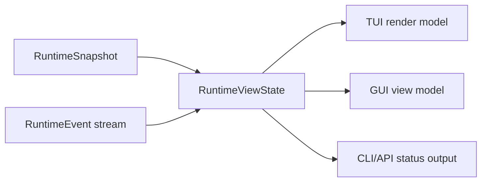

# 前端对接契约

English version: [frontend-integration-contract.md](frontend-integration-contract.md)

本文定义已经完成的核心 runtime 模块如何暴露给 TUI、GUI、CLI automation 和未来
clients。这是契约文档，不是 UI 布局规范。TUI 和 GUI 实现必须消费这些事实，不能自己
拥有 provider loop、tool execution、permission decisions 或 workflow state。

## 对接原则

- 核心模块通过 `RuntimeSnapshot`、有序 `RuntimeEvent` 和 `RuntimeViewState`
  发布事实。
- 前端通过 `RuntimeCommand` 发送意图；不能直接调用 tools、providers 或
  permission engines。
- `RuntimeViewState::apply_event` 是 client-visible state 的标准 reducer。TUI、
  GUI、API 和测试应该共享等价 replay fixtures。
- Durable workflow facts 保存在 `viden-workflows`；session transcript facts
  保存在 `viden-session`。前端只渲染，不能直接修改。
- UI-only state 只包括布局、选择、焦点、过滤、排序、本地面板展开和 scrollback
  位置。

## 核心模块映射

| 核心模块 | 前端区域 | 主要事实 | Commands / actions | 状态 |
| --- | --- | --- | --- | --- |
| Runtime supervisor | activity rail、live work indicator、cancel 操作 | `RuntimeEvent`、`RuntimeViewState`、`RuntimeErrorView` | `SubmitUserInput`、`QueueFollowUp`、`CancelActiveTurn` | 已落地 |
| Mode and permissions | top bar、approval panel、permission picker | `RuntimeSnapshot.work_mode`、`RuntimeSnapshot.permission_level`、`ApprovalRequestView` | `SetWorkMode`、`SetPermissionLevel`、`RespondToApproval` | 已落地 |
| Provider/model setup | provider panel、model picker、health strip | `RuntimeSnapshot.provider_id`、`ProviderHealthView`、active model config | `ConfigureProvider`、`SelectModel`、`ActivateModel`、`DeactivateModel` | 已落地 |
| Tool execution | transcript tool cards、active tool strip、evidence list | `ToolCallStarted`、`ToolCallFinished`、structured `success` / `exit_code` | 只发送 approval response；tools 由 core 执行 | 已落地 |
| Agent DAG and tasks | agent board、lane list、task detail、next-action dock | `AgentDagRecord`、`AgentTaskRecord`、`AgentNextAction` | `StartAgentDag`、`StartAgentTask`、`CancelAgentTask` | `0.2.2` 已落地 |
| Agent workflow visibility | Mission Control board、workflow strip、plan/now/done/acceptance/blocked columns | `AgentDagRecord`、`AgentTaskRecord`、`EvidenceView`、`MergeGateRecord`、`RuntimeErrorView` | 现有 workflow/task/evidence/merge commands | 提案 |
| ContextBundle | context panel、token pressure meter、omitted-source list | `ContextBundleRecord`、`ContextSourceRecord`、token budgets | 当前无直接 mutation；后续增加 context-policy commands | 部分落地 |
| Evidence and merge gate | evidence center、diff/test/review checklist、merge gate card | `EvidenceView`、`MergeGateRecord` | `RecordAgentEvidence`、`AcceptMergeGate`、`RejectMergeGate`、`AcceptAgentArtifact`、`RejectAgentArtifact`、`MergeAgentPatch` | `0.2.3` reducer 第一刀已落地 |
| Token/cost | cost bar、provider card、task budget panel | `TokenCostView`、provider telemetry | 后续 budget commands | 部分落地 |
| Lanes and external agents | lane monitor、external-job cards | `AgentLaneRecord`、task/evidence events | 后续 lane commands | 部分落地 |
| Errors and recovery | inline warning、recovery dock、retry action | `RuntimeErrorView`、`AgentNextAction` | task-specific retry command 或已有 runtime command | 已落地 |

## Event 消费规则

前端必须按 sequence 顺序处理 events。

- `SnapshotUpdated` 替换 baseline snapshot。
- `AssistantDelta` 追加到 `assistant_stream`；客户端也可以按 transcript 顺序渲染
  deltas。
- `ToolCallStarted` 插入 active tool call；`ToolCallFinished` 移除 active tool
  call，并可能追加 evidence。
- `TaskUpdated`、`AgentDagUpdated`、`LaneUpdated`、`EvidenceRecorded`、
  `ContextUpdated` 和 `MergeGateUpdated` 按 id upsert records。
- `ApprovalRequested` 和 `ApprovalResolved` 维护 pending approvals。
- `InputQueued` 和 `InputDequeued` 维护 follow-up input state。
- `ProviderHealthUpdated`、`TokenCostUpdated` 和 `Error` 更新侧栏或状态区，不能阻塞
  composer input。

## Command 归属

| 用户意图 | 前端发送 | Core 负责 |
| --- | --- | --- |
| 启动普通 turn | `SubmitUserInput` | provider loop、context bundle、tools、transcript |
| 工作运行时追加输入 | `QueueFollowUp` | queue ordering 和后续 dequeue |
| 取消当前工作 | `CancelActiveTurn` 或 `CancelAgentTask` | request cancellation 和 task state |
| 启动受监督 workflow | `StartAgentDag` 然后 `StartAgentTask` | DAG validation、dependencies、workflow events |
| 修改 mode/permissions | `SetWorkMode`、`SetPermissionLevel` | permission mode mapping 和 policy enforcement |
| 批准或拒绝 tool | `RespondToApproval` | decision recording 和 gated execution |
| 记录 gate evidence | `RecordAgentEvidence` | evidence validation、`EvidenceRecorded`、gate reducer、workflow event |
| 审核 merge gate | merge/artifact commands | gate state、workflow events、patch application |
| 配置 provider/model | provider/model commands | config persistence、registry validation、health |

前端发送 command 后不能自行合成成功状态。必须等待 `CommandAccepted` 和后续状态事件。
如果 command 被拒绝，渲染 `CommandRejected.reason`。

## Agent DAG 和 Task UI 契约

`AgentDagRecord` 是 workflow container。`AgentTaskRecord` 是前端可见的工作单元。

首个 workflow surface 应回答 [Agent Workflow Visibility](agent-workflow-visibility.zh-CN.md)
定义的 Mission Control 问题：assignment rationale、后续计划、正在工作、已完成输出、
验收状态、blockers 和 cost impact。

必须渲染的字段：

- `id`、`parent_id`、`agent`、`kind`、`transport` 和 `title` 标识 task。
- `status`、`activity` 和 `progress` 驱动可见状态和进度。
- assignment reason 和 cost profile 解释为什么这个 agent/tool/skill 负责该任务。
- `summary`、`result` 和 `next_action` 描述结果和下一步。
- `workspace`、`evidence` 和 `permissions` 链接支撑事实。
- `started_at` 和 `updated_at` 只用于显示时间；排序不能替代 runtime event sequence。

状态处理：

| 状态组 | 值 | UI 行为 |
| --- | --- | --- |
| Pending/running | `queued`、`thinking`、`streaming`、`editing`、`running_tool`、`testing`、`reviewing`、`running`、`attached` | 显示 active animation，允许 cancel，composer 保持可编辑 |
| Waiting | `waiting_approval`、`needs_input`、`blocked` | 显示需要用户处理的动作或 dependency |
| Completed | `done`、`applied`、`discarded`、`archived` | 显示 outcome、evidence 和 next action |
| Failed/cancelled | `failed`、`cancelled` | 显示 recovery hint 和 retry/cancel history |

## Evidence 和 Merge Gate UI 契约

从前端视角看，Evidence 是 append-only。

- `EvidenceView.id` 是稳定 lookup key。
- `kind` 控制 icon、filter 和 checklist grouping。
- `summary` 是 human-readable，可在紧凑界面中截断。
- `path` 存在时链接文件或 artifact。
- `source` 表示 role、tool 或 runtime source。
- `timestamp` 只用于显示。

`MergeGateRecord` 将 evidence 连接到 task：

- `required_evidence` 声明 checklist。
- `evidence_ids` 记录已收集 evidence。
- `status` 控制 action surface。
- `decision` 存储最新 operator 或 runtime decision。

当前 `0.2.3` reducer 行为：

- 前端用 `RecordAgentEvidence` 记录外部 evidence。
- Core 发出 `EvidenceRecorded`，随后发出 `MergeGateUpdated`，并持久化对应的
  `agent_evidence_recorded` workflow event。
- `MergeGateRecord.status` 由已记录 evidence 的 kind 归约，不由前端本地 checklist
  状态或 evidence id 后缀推断。
- 缺少 required evidence 时 gate 保持 `collecting_evidence`。
- required evidence 全部满足后 gate 自动进入 `accepted`。
- evidence 被 reject 后 gate 进入 `needs_changes`，并从 gate/task evidence 列表移除该
  evidence id。
- `AcceptAgentArtifact` 只接受已记录的 evidence id。未知 evidence id 会被拒绝，前端不能
  把该命令当成隐式创建 evidence 的入口。

第一批一等 required evidence kind 是 `patch`、`test_result`、`review`、`doc_update`
和 `release_artifact`。客户端可以显示其他 runtime kind，但 checklist 分组应优先覆盖这组
核心类型。

## Context 和 Token UI 契约

当前前端只读 `ContextBundleRecord`：

- `sources` 解释哪些内容进入 provider request。
- `omitted_sources` 解释哪些内容被排除。
- `estimated_tokens`、`soft_token_budget`、`hard_token_limit` 和
  `pressure_percent()` 驱动 token pressure UI。
- `largest_sources` 和 `compaction_notes` 驱动 context diagnostics。

TUI 应使用紧凑摘要和 drill-down panels。GUI 应提供 source table，并支持 included、
omitted、large、diagnostic、evidence sources 过滤。

## Approval 和 Permission UI 契约

Approval 使用 `ApprovalRequestView` 和 `RespondToApproval`。

前端必须展示：

- `title`、`tool_name` 和 `message`；
- `input_preview`；
- `is_mutating`；
- `reason`；
- `RuntimeSnapshot` 中的 active permission level 和 work mode。

前端不能在用户 approval 后直接调用底层 tool。只能发送 `RespondToApproval`；runtime
负责继续或拒绝执行。

## TUI 要求

- 只从 `RuntimeViewState` 和本地 terminal layout state 渲染。
- provider turn、agent task、approval 或 tool call 运行时，composer input 必须保持可编辑。
- scrollback 必须独立于 active task state。
- 优先使用紧凑 panels：active task、approval、evidence、context pressure 和 provider health。
- 不能从 transcript 文本推断 task/tool 成功。

## GUI 要求

- 使用和 TUI 相同的 reducer 语义。
- GUI view models 必须从 `RuntimeViewState` 构造，不能来自第二套业务 store。
- GUI-only data 仅限 filters、selected ids、pane layout 和 local notifications。
- 每个展示 runtime facts 的 GUI screen 必须声明自己读取哪些字段。
- GUI 关闭或崩溃不能修改 session、workflow、provider 或 permission state。

## Parity Fixtures

开始 TUI/GUI 并行实现前，应增加共享 fixtures，让两端 replay 同一条 event stream：

- provider turn with streaming text and tool call；
- approval request and approval denial；
- queued follow-up while a turn is active；
- Agent DAG with dependency blocker and retry next action；
- Evidence/MergeGate accept、reject、conflict、merge；
- provider failure with recovery hint；
- context pressure with omitted sources；
- scoped Git denial and release-gate denial。

这些 fixtures 是 `0.3.x` TUI/GUI parity 的验收契约。
