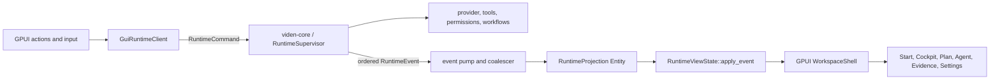
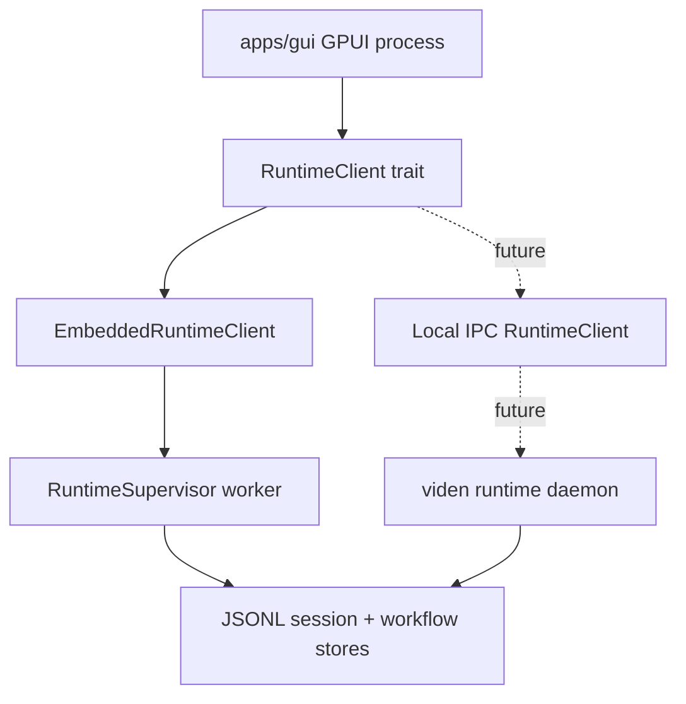
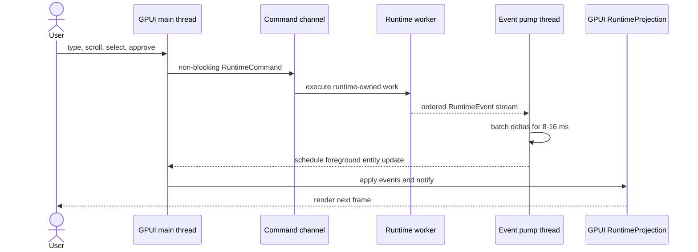
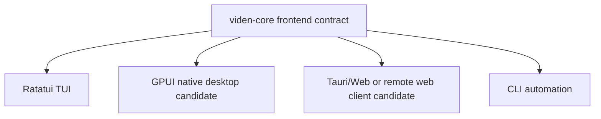

# GPUI GUI Feasibility Research

Chinese version: [gpui-gui-feasibility-research.zh-CN.md](gpui-gui-feasibility-research.zh-CN.md)

Last updated: 2026-07-19

## Decision Summary

GPUI is a technically credible candidate for Viden's native desktop GUI, but it
should not replace the current Tauri/Web direction without a measured vertical
slice.

The fit is strong where Viden is already strongest:

- the product and runtime are Rust-first;
- `viden-core` already exposes frontend-neutral snapshot, event, command, and
  reducer contracts;
- the cockpit needs low-latency streaming, large virtualized timelines, dense
  keyboard interaction, and custom rendering;
- an in-process native client can avoid a serialization and WebView boundary.

The adoption cost is also material:

- GPUI is pre-1.0 and its upstream README explicitly warns about breaking API
  changes;
- GPUI provides rendering and application primitives, not a complete product
  component system;
- the accepted Viden designs currently use HTML/CSS/JS and assume Tauri can
  reuse their DOM, CSS tokens, and component classes directly;
- native implementation requires separate solutions for rich text, terminal,
  embedded browser, accessibility, packaging, updates, and visual regression;
- GPUI has no supported web target, so a future remote web operator remains a
  separate frontend.

**Recommendation:** keep the runtime and product design framework-neutral,
build a bounded GPUI proof of concept against the same `RuntimeEvent` replay
fixtures as a Tauri reference slice, and select the production GUI framework
only after the acceptance gate in this document. GPUI should be the preferred
native candidate if the slice meets visual fidelity, input latency,
cross-platform, accessibility, and delivery-cost thresholds.

## Evidence And Version Context

Research date: 2026-07-19.

| Evidence | What it establishes |
| --- | --- |
| [GPUI upstream README](https://github.com/zed-industries/zed/blob/main/crates/gpui/README.md) | GPUI is hybrid retained/immediate mode, GPU accelerated, entity/view/element based, includes an event-loop-integrated executor and test context, and remains pre-1.0. |
| [GPUI 0.2.2 on docs.rs](https://docs.rs/crate/gpui/0.2.2) | Current published crate version and public API documentation. |
| [Ownership and data flow in GPUI](https://zed.dev/blog/gpui-ownership) | `App` owns entities; views read and update entity state through contexts and subscriptions. |
| [Async Rust in Zed](https://zed.dev/blog/zed-decoded-async-rust) | Foreground work runs on the platform main thread, background work uses a separate executor, and blocking the UI thread is forbidden. |
| [GPUI rendering architecture](https://zed.dev/blog/videogame) | The renderer is designed for GPU-driven, frame-budgeted native UI and custom text/graphics primitives. |
| [Zed platform requirements](https://zed.dev/docs/installation) | The GPUI-based Zed application currently ships on macOS, Linux, and Windows; web is not supported. |
| [Zed open-source licensing](https://zed.dev/blog/zed-is-now-open-source) | GPUI is Apache-2.0 even though Zed application code has different licenses. |
| [GPUI Component](https://github.com/longbridge/gpui-component) | A third-party Apache-2.0 component library exists with dock, input, virtual list/table, markdown/editor, and optional WebView support. |

Local verification on 2026-07-19 found:

- `origin/main` at `5411a47e` still uses `RuntimeSnapshot`, ordered
  `RuntimeEvent`, `RuntimeCommand`, and `RuntimeViewState` as the frontend
  contract; its newer context/cost engine remains behind the same boundary;
- the current remote `RuntimeSupervisor` still owns a dedicated worker and
  blocking standard-library MPSC channels, so a GPUI event pump is required;
- crates.io `gpui = 0.2.2`, Apache-2.0, Rust edition 2024;
- crates.io `gpui-component = 0.5.1`, Apache-2.0, pinned to GPUI `0.2.2`;
- GPUI `0.2.2` contains macOS, Linux/FreeBSD, and Windows platform modules;
- the published GPUI package is about 8 MB of source and has roughly 100
  dependency/target dependency sections;
- Viden currently builds with Rust `1.95.0`, which is newer than the toolchain
  used to publish the current GPUI docs;
- Xcode and its command-line developer path are available on the current
  development machine.

There is an upstream documentation mismatch: the GPUI README still says macOS
or Linux, while the current crate source contains Windows support and the
GPUI-based Zed application officially ships on Windows. Viden must therefore
validate the standalone GPUI crate on all target platforms instead of treating
Zed's application support as automatic proof for an independent GPUI app.

## Viden Fit Analysis

| Dimension | GPUI impact for Viden | Assessment |
| --- | --- | --- |
| Rust runtime integration | Links directly to `viden-core`; no JS bridge or command serialization is required for the embedded client. | Strong advantage |
| Streaming transcript | GPU text rendering, custom elements, and virtual lists fit high-frequency event streams. | Strong advantage if batching is correct |
| Dense cockpit layout | Native split panes, keyboard actions, overlays, lists, and custom status rendering are a natural fit. | Strong advantage |
| Existing HTML design assets | CSS/DOM cannot be reused directly; tokens and components must be translated into Rust. | Significant disadvantage |
| Component maturity | GPUI core is low-level; Zed's own UI crate is not a reusable public design system for this MIT workspace. | Significant risk |
| Third-party components | `gpui-component` covers many needs and matches GPUI 0.2.2, but introduces another pre-1.0 compatibility boundary. | Useful behind a Viden wrapper |
| Cross-platform desktop | macOS, Linux, and Windows implementations exist, but independent packaging and platform QA remain Viden's responsibility. | Feasible with explicit gates |
| Web/remote frontend | GPUI is native-only. A web operator would be another client of the same runtime protocol. | Neutral architecturally, extra product cost |
| Embedded browser | Not provided by GPUI core. `gpui-component` has an optional `wry` WebView bridge. | Prototype before commitment |
| Terminal | Requires a terminal model/PTY integration and custom grid rendering, or a WebView-based terminal. | Meaningful implementation cost |
| Accessibility | Must be verified for the exact published version and every custom component; the locally inspected GPUI 0.2.2 package did not expose an AccessKit module. | Release blocker until proven |
| Packaging/updater | More custom work than Tauri's mature bundler/updater/plugin path. | Significant delivery cost |
| Licensing | GPUI and GPUI Component are Apache-2.0 and compatible with Viden's MIT direction. Zed application UI code must not be copied casually. | Acceptable with boundary discipline |

## GPUI Versus Current Tauri Direction

| Product concern | GPUI native client | Tauri/Web client |
| --- | --- | --- |
| Runtime calls | Direct Rust facade or local transport | Tauri commands/events and serialized payloads |
| Design fidelity to current prototypes | Manual token/component translation | Can directly reuse CSS, SVG, and DOM structure |
| High-frequency rendering | Excellent potential; explicit frame control | Good when React/store updates are batched carefully |
| Component ecosystem | Small; Viden must own more primitives | Broad web ecosystem and mature testing tools |
| Embedded browser/terminal | Additional native or Wry integration | Natural fit through WebView/xterm.js |
| Memory/startup | Native, no frontend JS runtime | WebView overhead, still substantially lighter than Electron |
| Cross-platform delivery | Custom signing, packaging, updater work | Tauri provides established packaging and updater paths |
| Web reuse | Little direct reuse | Large reuse for future local/remote web UI |
| Rust-only contributor path | Strong | Split Rust and TypeScript/HTML/CSS skills |
| Framework churn | GPUI pre-1.0 API churn | Tauri stable, web dependency churn remains |

This is not a generic framework contest. The decision hinges on whether Viden
values native runtime/rendering unity more than direct reuse of the accepted
HTML/CSS product designs and web ecosystem.

## Proposed Architecture

### Boundary Rule

GPUI must be a frontend adapter. It must not become the owner of runtime,
provider, tool, permission, transcript, workflow, or evidence state.



Runtime facts remain in `RuntimeViewState`. GPUI entities own only:

- a read projection of runtime facts;
- selected lane/session/task/evidence ids;
- pane sizes, visibility, focus, filters, and scroll anchors;
- theme, keymap, transient notifications, and draft composer text.

### Process Topology

Use a transport-neutral client from the first prototype.



The first GUI should use `EmbeddedRuntimeClient` for minimal latency and scope.
The trait must keep command submission and event subscription independent of
the transport so a later daemon, remote operator, or crash-isolated runtime
does not require rewriting GPUI screens.

Do not let GPUI code instantiate or mutate `SessionEngine` directly. It should
receive a client handle from bootstrap.

### Threading And Async Model

The current `RuntimeSupervisor` owns a blocking standard-library MPSC receiver
and a dedicated worker thread. GPUI has separate foreground and background
executors. Combining them safely requires an explicit bridge:



Rules:

- never call blocking `recv`, provider I/O, filesystem scans, Git, LSP, or
  transcript replay on the GPUI foreground executor;
- keep the current runtime worker independent from GPUI's executor;
- use a dedicated event-pump thread while the runtime uses blocking MPSC;
- coalesce consecutive `AssistantDelta` values by message/task within one
  frame window, but never reorder tool, approval, command, or evidence events;
- cap per-frame event application and reschedule remaining work so input and
  scrolling remain responsive under burst load;
- preserve strict runtime sequence numbers and detect gaps before rendering a
  fabricated state;
- cancellation and approval commands must bypass any long-running turn queue,
  as the current supervisor already does;
- task lifetime belongs to the owning GPUI entity or application service; do
  not silently detach foreground tasks that can outlive their screen.

### State And Entity Model

Recommended entities:

| Entity | Responsibility |
| --- | --- |
| `RuntimeProjection` | Owns `RuntimeViewState`, last sequence, connection health, and replay state. |
| `WorkspaceModel` | Owns current project, selected lane/session, and GUI-only layout state. |
| `ComposerModel` | Owns draft text, history cursor, completion state, and queued-input feedback. |
| `TranscriptModel` | Builds virtualized transcript rows and maintains follow/scroll anchors. |
| `PanelRegistry` | Owns registered panel descriptors and persisted layout, not runtime facts. |
| `ThemeModel` | Maps Viden design tokens to typed GPUI colors, spacing, type, and motion values. |
| `WindowRoot` | Composes navigation, workspace, inspector, dock, overlays, and focus routing. |

Avoid placing all application state in GPUI globals. Globals should be limited
to application-wide services such as theme, keymap, asset source, and runtime
client. Domain state should have explicit entity ownership and subscriptions.

### Source Layout

```text
apps/gui/
  Cargo.toml
  src/
    main.rs                 # Application and platform bootstrap
    app.rs                  # Window construction and global services
    runtime/
      client.rs             # RuntimeClient trait and embedded adapter
      event_pump.rs         # ordering, batching, reconnect/replay
      projection.rs         # RuntimeViewState entity
    models/
      workspace.rs
      composer.rs
      transcript.rs
      panel_registry.rs
    ui/
      tokens.rs             # generated/checked mapping from tokens.css
      theme.rs
      actions.rs
      primitives/           # button, input, list row, badge, tooltip
      composites/           # modal picker, approval, task card, evidence row
    screens/
      start_center.rs
      workspace_cockpit.rs
      plan_studio.rs
      agent_board.rs
      evidence_center.rs
      settings.rs
    panels/
      transcript.rs
      environment.rs
      inspector.rs
      terminal.rs
      browser.rs
    platform/
      credentials.rs
      notifications.rs
      updater.rs
      window_state.rs
```

`apps/gui` should depend on `viden-core`, `viden-types`, GPUI, and Viden-owned
UI crates only. Dependency guards should reject direct imports from runtime,
provider, tools, permissions, session, or workflows.

## Component And Design-System Strategy

The accepted design package defines `tokens.css`, `gui-kit.css`, JSX helpers,
and HTML structures. GPUI cannot import those directly. Preserve them as the
visual source and generate/check a native mapping:

```text
tokens.css -> token extraction/check -> generated Rust constants -> VidenTheme
HTML target -> semantic component map -> GPUI component -> screenshot baseline
```

Recommended policy:

1. Build a small Viden component facade (`VButton`, `VInput`, `VList`,
   `VModal`, `VDock`, `VTooltip`, `VApproval`) rather than spreading raw GPUI
   elements across screens.
2. Permit `gpui-component` only behind that facade. Do not expose its types in
   screen contracts.
3. Pin GPUI and GPUI Component to compatible exact versions. Do not use
   `gpui = "*"` in production.
4. Do not import Zed's internal `ui` crate as the Viden design system. It is
   coupled to Zed application conventions and licensing.
5. Give every interactive component stable element ids, keyboard actions,
   focus behavior, reduced-motion behavior, and accessibility semantics.
6. Maintain a native component gallery equivalent to the HTML component
   index; every component needs default, hover, focus, disabled, error,
   loading, narrow, and CJK states.

Start with Viden-owned wrappers over GPUI core. Evaluate these isolated
`gpui-component` modules during the spike rather than adopting the entire
library at once:

- input and focus handling;
- virtual list/table;
- resizable dock;
- dialog/popover/menu/tooltip;
- markdown/text view;
- optional Wry WebView.

## High-Risk Technical Points

### Streaming Transcript And Scrollback

- Store transcript entries as stable rows, not one ever-growing string.
- Append stream deltas to the active assistant row.
- Batch repaint notifications to the display frame budget.
- Virtualize historical rows and cache measured heights.
- Keep `follow_latest` separate from the scroll position.
- When the user scrolls upward, preserve the anchor and show a new-output
  counter instead of forcing the viewport to the bottom.
- Replay the same event fixture after resize, sleep/wake, and long idle.

### Input, IME, And Keyboard

- Treat the composer as a first-class stateful component, not a styled `div`.
- Test Chinese/Japanese/Korean IME composition, candidate windows, selection,
  paste, undo, multiline input, and command completion.
- Route keybindings through GPUI actions; do not branch on raw key strings in
  each screen.
- Keep input enabled while provider, tool, plan, or agent work is active.

### Terminal And Browser

- Terminal P0 may launch or attach an external terminal and show structured
  tool output; a fully embedded PTY terminal is not required to prove GPUI.
- If embedded terminal is required, separate the terminal grid/model from its
  GPUI renderer and PTY transport.
- Browser preview should be an optional panel. Prototype `wry` through the
  Viden component facade and verify clipping, focus, IME, GPU composition, and
  platform behavior.
- Never let an embedded WebView become the hidden implementation path for the
  rest of the GPUI application.

### Platform Services

Viden must own interfaces for credentials, OAuth callback, notifications,
file dialogs, deep links, single-instance behavior, crash recovery, updater,
signing, and persisted window state. GPUI platform calls can implement those
interfaces, but screens should not depend on platform APIs directly.

### Accessibility

Accessibility is a release gate, not a later polish item. The spike must prove:

- keyboard-only operation and visible focus;
- screen-reader names, roles, values, and actions for core controls;
- logical reading/focus order for docked and overlaid panels;
- sufficient contrast and high-contrast theme behavior;
- reduced motion and scalable UI/text;
- CJK input and text selection.

If the selected GPUI version cannot meet these requirements without carrying
a framework fork, that is a no-go for the production GUI.

## Testing And Observability

### Test Layers

| Layer | Gate |
| --- | --- |
| Reducer | Existing runtime replay fixtures produce identical `RuntimeViewState` without GPUI. |
| Bridge | Event ordering, batching, reconnect, gap detection, queueing, cancellation, and shutdown tests. |
| GPUI interaction | `gpui::test` or equivalent tests for focus, typing, shortcuts, modal selection, approval, and scrolling. |
| Visual | Deterministic native screenshots compared with accepted HTML targets at desktop, narrow, and scaled-font sizes. |
| Platform | Build and launch smoke on macOS, Linux X11/Wayland, and Windows. |
| Real runtime | DeepSeek development smoke with streaming, tool approval, cancel, queued follow-up, token/cost, and evidence. |

### Performance Budgets For The Spike

- composer input acknowledgement: p95 under 50 ms while streaming;
- event-to-visible update: p95 under 100 ms;
- foreground frame work: p95 under 16 ms on the reference machine;
- no event loss or reordering under a 10,000-event burst;
- 50,000 transcript rows remain scrollable through virtualization;
- no forced scroll-to-bottom while the user reads history;
- resize and sleep/wake do not blank or corrupt the window;
- idle CPU approaches zero when no animation or work is active;
- memory growth is bounded during a 60-minute streaming/replay soak.

Instrument event queue depth, coalesced delta count, reducer time, render time,
dropped-frame estimate, input latency, transcript row count, and memory. These
metrics belong to developer diagnostics and must not include prompt or secret
contents.

## Proof-Of-Concept Plan

The spike is intentionally narrower than the full GUI.

### Slice 1: Shell And Design Fidelity

- native window, title bar, Start Center, theme tokens, composer, model/mode
  status;
- component gallery for input, button, list, modal, badge, tooltip, and dock;
- screenshot comparison against one accepted desktop target and one narrow
  target.

### Slice 2: Runtime Stream

- `RuntimeClient` embedded adapter;
- ordered replay into `RuntimeProjection`;
- virtualized transcript with streamed assistant deltas, tool rows, errors,
  token/cost, and provider health;
- editable composer, queued follow-up, cancel, and history scroll during work.

### Slice 3: Direct-Manipulation Workflow

- provider connect/configure panel;
- configured-provider grouped model picker;
- approval prompt and evidence detail;
- Plan mode switch and explicit Plan-to-Build handoff.

### Slice 4: Platform And Delivery

- macOS signed development app;
- Linux and Windows build/launch CI;
- credential-store adapter and browser OAuth callback;
- optional WebView feasibility sample;
- crash/close behavior proving runtime and transcript integrity.

## Go/No-Go Gate

Choose GPUI for the production desktop GUI only if all P0 conditions pass:

| Gate | Pass condition |
| --- | --- |
| Architecture | GUI imports only the frontend facade/contracts and all mutation goes through `RuntimeCommand`. |
| Responsiveness | Performance budgets pass while streaming and scrolling. |
| Fidelity | Accepted screenshot differences are small, explained, and repeatable without per-screen raw styling. |
| Interaction | IME, focus, command palette, modal selection, approval, queueing, and scrollback are reliable. |
| Accessibility | Core flows work by keyboard and supported screen-reader semantics are demonstrated. |
| Platforms | macOS, Linux, and Windows build and launch; known gaps have owners and release dates. |
| Components | Viden facade covers P0 controls without copying Zed application UI code. |
| Delivery | Signing, packaging, update, crash recovery, and credential storage have credible implementations. |
| Maintenance | GPUI/GPUI Component versions are pinned and an upgrade compatibility test is automated. |

No-go conditions include needing a long-lived GPUI fork for basic accessibility
or input, failing CJK IME, unbounded transcript rendering, inability to package
all supported platforms, or visual translation cost that exceeds the Tauri
reference by more than the product can justify.

## Architecture Recommendation

The recommended target remains one runtime with multiple replaceable clients:



The GPUI research changes the GUI decision from "Tauri by default" to
"framework selected by evidence." It does not change the runtime boundary.
That is the key architectural protection: if GPUI wins, Viden gets a native
Rust cockpit; if it loses, the same commands, events, reducer fixtures, and
product flows carry directly into Tauri or another frontend.
