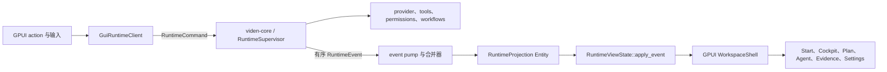
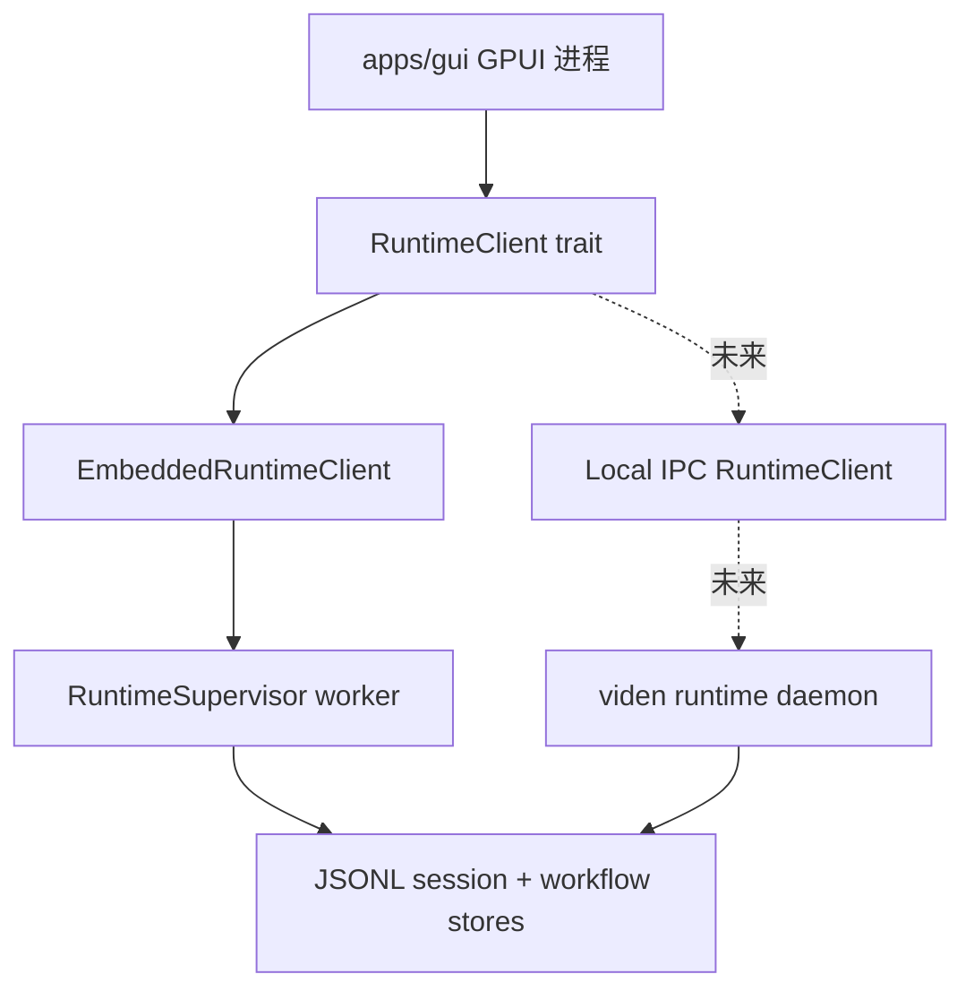
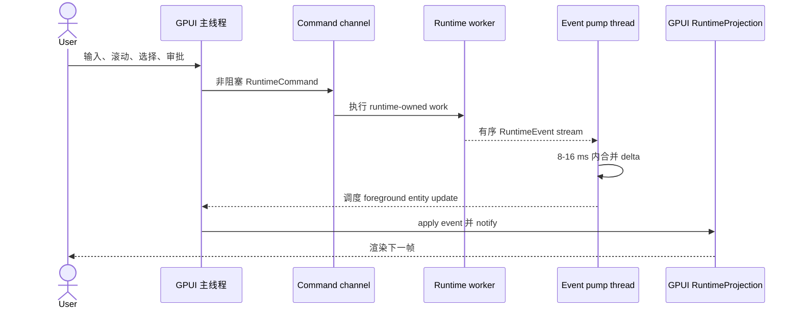
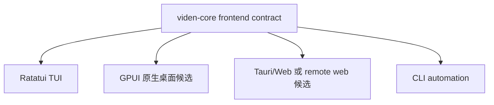

# GPUI GUI 可行性调研

英文版：[gpui-gui-feasibility-research.md](gpui-gui-feasibility-research.md)

最后更新：2026-07-19

## 决策摘要

GPUI 是 Viden 原生桌面 GUI 的可信候选，但在完成可量化的垂直切片之前，不应直接替换当前 Tauri/Web 方向。

它与 Viden 的优势高度匹配：

- 产品和 runtime 都是 Rust-first；
- `viden-core` 已经提供与前端无关的 snapshot、event、command 和 reducer 契约；
- cockpit 需要低延迟流式显示、大型虚拟化时间线、密集键盘操作和自定义渲染；
- 进程内原生客户端可以避免序列化与 WebView 边界。

采用成本同样真实存在：

- GPUI 仍是 pre-1.0，上游 README 明确提示版本间经常有破坏性变化；
- GPUI 提供渲染和应用基础设施，不是完整的产品组件系统；
- 已接受的 Viden 设计稿采用 HTML/CSS/JS，并假设 Tauri 可以直接复用 DOM、CSS token 和组件 class；
- 原生实现需要另行解决富文本、终端、内嵌浏览器、可访问性、打包、更新和视觉回归；
- GPUI 没有受支持的 Web target，未来 remote web operator 仍然是另一套前端。

**建议：**runtime 和产品设计继续保持框架无关；用相同的 `RuntimeEvent` replay fixture 同时做一个受限的 GPUI POC 和一个 Tauri 参考切片；只有通过本文门禁后才选择生产 GUI 框架。如果 GPUI 能满足视觉一致性、输入延迟、跨平台、可访问性和交付成本要求，它应成为原生客户端的优先候选。

## 证据与版本上下文

调研日期：2026-07-19。

| 证据 | 结论 |
| --- | --- |
| [GPUI 上游 README](https://github.com/zed-industries/zed/blob/main/crates/gpui/README.md) | GPUI 是 hybrid retained/immediate、GPU 加速、基于 entity/view/element 的框架，带事件循环集成 executor 和测试上下文，但仍是 pre-1.0。 |
| [docs.rs 上的 GPUI 0.2.2](https://docs.rs/crate/gpui/0.2.2) | 当前发布 crate 的版本和公开 API 文档。 |
| [GPUI ownership 与数据流](https://zed.dev/blog/gpui-ownership) | `App` 持有 entity，view 通过 context 和 subscription 读取、更新 entity。 |
| [Zed 的 Async Rust](https://zed.dev/blog/zed-decoded-async-rust) | 前台任务在平台主线程执行，后台任务使用独立 executor，UI 主线程禁止阻塞。 |
| [GPUI 渲染架构](https://zed.dev/blog/videogame) | 渲染器面向 GPU、帧预算和原生自定义文字/图形。 |
| [Zed 平台要求](https://zed.dev/docs/installation) | 基于 GPUI 的 Zed 当前发布 macOS、Linux、Windows，Web 不受支持。 |
| [Zed 开源许可证说明](https://zed.dev/blog/zed-is-now-open-source) | GPUI 使用 Apache-2.0；Zed 应用代码使用不同许可证。 |
| [GPUI Component](https://github.com/longbridge/gpui-component) | 第三方 Apache-2.0 组件库提供 dock、input、virtual list/table、Markdown/editor 和可选 WebView。 |

2026-07-19 本地核验结果：

- `origin/main` 的 `5411a47e` 仍以 `RuntimeSnapshot`、有序 `RuntimeEvent`、
  `RuntimeCommand`、`RuntimeViewState` 作为前端契约；新增 context/cost engine
  仍位于同一边界之后；
- 远端最新 `RuntimeSupervisor` 仍持有独立 worker 和阻塞式标准库 MPSC channel，
  因此 GPUI 需要显式 event pump；
- crates.io 当前 `gpui = 0.2.2`，Apache-2.0，Rust edition 2024；
- `gpui-component = 0.5.1`，Apache-2.0，精确依赖 GPUI `0.2.2`；
- GPUI `0.2.2` 源码包含 macOS、Linux/FreeBSD、Windows 平台模块；
- 发布包源码约 8 MB，dependency/target dependency 段约 100 个；
- Viden 当前 Rust 为 `1.95.0`，高于生成当前 GPUI 文档所用工具链；
- 当前开发机已有 Xcode 与命令行开发路径。

上游文档存在漂移：GPUI README 仍写 macOS/Linux，但当前 crate 源码已有 Windows 模块，基于 GPUI 的 Zed 也已正式发布 Windows 版。因此 Viden 必须独立验证 GPUI crate 在三平台的表现，不能把 Zed 的应用级平台支持直接等同于独立 GPUI 应用可用。

## 与 Viden 的匹配度

| 维度 | GPUI 对 Viden 的影响 | 判断 |
| --- | --- | --- |
| Rust runtime 集成 | 可直接连接 `viden-core`，embedded client 不需要 JS bridge 或 command 序列化。 | 强优势 |
| 流式 transcript | GPU 文本、自定义 element、虚拟列表适合高频事件流。 | 正确批处理后是强优势 |
| 密集 cockpit | 原生 split pane、action、overlay、list 和状态渲染很合适。 | 强优势 |
| 现有 HTML 设计资产 | CSS/DOM 不能直接复用，必须翻译 token 和组件。 | 明显劣势 |
| 组件成熟度 | GPUI core 偏底层；Zed 自己的 UI crate 不是适合本 MIT workspace 的公共设计系统。 | 显著风险 |
| 第三方组件 | `gpui-component` 覆盖面大且匹配 GPUI 0.2.2，但增加另一个 pre-1.0 兼容边界。 | 适合放在 Viden wrapper 后面 |
| 跨平台桌面 | 三平台实现存在，但独立打包和平台 QA 由 Viden 自己承担。 | 有门禁即可行 |
| Web/remote frontend | GPUI 只做 native，Web operator 是相同 runtime protocol 的另一客户端。 | 架构中性、产品成本增加 |
| 内嵌浏览器 | GPUI core 不提供；`gpui-component` 有可选 `wry` WebView bridge。 | 必须先 POC |
| 终端 | 需要 terminal model/PTY + 自定义 grid，或 WebView terminal。 | 实现成本不低 |
| 可访问性 | 必须针对精确版本和所有自定义组件验证；本地检查的 GPUI 0.2.2 发布包未暴露 AccessKit 模块。 | 证明前属于发布阻塞项 |
| 打包/更新 | 比 Tauri 成熟 bundler/updater/plugin 路线需要更多自研。 | 显著交付成本 |
| 许可证 | GPUI 和 GPUI Component 为 Apache-2.0，可与 Viden MIT 方向兼容；不能随意复制 Zed 应用 UI 代码。 | 边界清楚即可接受 |

## GPUI 与当前 Tauri 方向对比

| 产品问题 | GPUI 原生客户端 | Tauri/Web 客户端 |
| --- | --- | --- |
| Runtime 调用 | Rust facade 或本地 transport 直接调用 | Tauri command/event + 序列化 payload |
| 对现有设计稿的还原 | 手工翻译 token/组件 | 可直接复用 CSS、SVG、DOM 结构 |
| 高频渲染 | 潜力很好，可明确控制每帧工作 | React/store 正确批处理后也可以很好 |
| 组件生态 | 较小，Viden 要自己持有更多 primitive | Web 生态和测试工具成熟 |
| 浏览器/终端 | 需要额外 native/Wry 集成 | WebView/xterm.js 天然适配 |
| 内存/启动 | 原生，无前端 JS runtime | 有 WebView 开销，但仍比 Electron 轻 |
| 跨平台交付 | signing、packaging、updater 更多自研 | Tauri 有成熟打包和更新路线 |
| Web 复用 | 很少 | 未来 local/remote web UI 可大量复用 |
| Rust-only 贡献路径 | 强 | 需要 Rust + TypeScript/HTML/CSS |
| 框架变动 | GPUI pre-1.0 API 变动 | Tauri 稳定，但仍有 Web 依赖变动 |

这不是通用框架竞赛。真正的决策是：Viden 是否愿意用 HTML/CSS 设计稿直接复用和 Web 生态，换取较少的 native runtime/rendering 一体化；还是愿意承担原生组件建设成本，获得纯 Rust cockpit。

## 建议架构

### 边界原则

GPUI 必须只是 frontend adapter，不能成为 runtime、provider、tool、permission、transcript、workflow 或 evidence 的事实源。



Runtime facts 继续放在 `RuntimeViewState`。GPUI entity 只持有：

- runtime facts 的只读投影；
- 当前 lane/session/task/evidence id；
- pane 尺寸、可见性、focus、filter 和 scroll anchor；
- theme、keymap、临时通知和 composer draft。

### 进程拓扑

从第一个 POC 开始就使用 transport-neutral client。



首版 GUI 使用 `EmbeddedRuntimeClient`，控制延迟和范围。trait 必须让 command submission 与 event subscription 不依赖具体 transport，这样未来改 daemon、remote operator 或 crash-isolated runtime 时不需要重写 GPUI screen。

GPUI 代码不能直接创建或修改 `SessionEngine`，bootstrap 只向它提供 client handle。

### 线程与异步模型

当前 `RuntimeSupervisor` 持有阻塞式标准库 MPSC receiver 和独立 worker thread；GPUI 有独立的 foreground/background executor。安全连接方式如下：



规则：

- 禁止在 GPUI foreground executor 上执行阻塞 `recv`、provider I/O、文件扫描、Git、LSP 或 transcript replay；
- runtime worker 独立于 GPUI executor；
- runtime 仍使用 blocking MPSC 时，用单独 event-pump thread；
- 一帧内可以按 message/task 合并连续 `AssistantDelta`，但 tool、approval、command、evidence 事件不能重排；
- 限制单帧 apply 数量，剩余事件重新调度，避免 burst 时卡输入和滚动；
- 保留严格 sequence，发现 gap 后先恢复/replay，不能渲染伪造状态；
- cancel 和 approval command 必须绕过长 turn 队列，保持当前 supervisor 的优先路径；
- task 生命周期归所属 entity 或 app service，不能无声 detach 一个可能比 screen 活得更久的 foreground task。

### 状态与 Entity 模型

| Entity | 职责 |
| --- | --- |
| `RuntimeProjection` | `RuntimeViewState`、last sequence、连接健康、replay 状态。 |
| `WorkspaceModel` | 当前 project、lane/session 选择和 GUI-only layout。 |
| `ComposerModel` | draft、history cursor、completion、queued-input feedback。 |
| `TranscriptModel` | 虚拟化 transcript row 与 follow/scroll anchor。 |
| `PanelRegistry` | panel descriptor 与持久化布局，不持有 runtime facts。 |
| `ThemeModel` | 把 Viden token 映射成 typed GPUI color、spacing、type、motion。 |
| `WindowRoot` | 组合 navigation、workspace、inspector、dock、overlay 和 focus routing。 |

不要把所有状态塞进 GPUI global。Global 仅用于 theme、keymap、asset source、runtime client 等全应用 service；领域状态要有清晰 entity ownership 和 subscription。

### 源码布局

```text
apps/gui/
  Cargo.toml
  src/
    main.rs                 # Application 与平台 bootstrap
    app.rs                  # window 与 global service
    runtime/
      client.rs             # RuntimeClient trait 和 embedded adapter
      event_pump.rs         # ordering、batching、reconnect/replay
      projection.rs         # RuntimeViewState entity
    models/
      workspace.rs
      composer.rs
      transcript.rs
      panel_registry.rs
    ui/
      tokens.rs             # 从 tokens.css 生成/检查的映射
      theme.rs
      actions.rs
      primitives/           # button、input、list row、badge、tooltip
      composites/           # modal picker、approval、task card、evidence row
    screens/
      start_center.rs
      workspace_cockpit.rs
      plan_studio.rs
      agent_board.rs
      evidence_center.rs
      settings.rs
    panels/
      transcript.rs
      environment.rs
      inspector.rs
      terminal.rs
      browser.rs
    platform/
      credentials.rs
      notifications.rs
      updater.rs
      window_state.rs
```

`apps/gui` 只应依赖 `viden-core`、`viden-types`、GPUI 和 Viden-owned UI crate。依赖门禁要禁止它直接 import runtime、provider、tools、permissions、session、workflows。

## 组件与设计系统策略

当前设计包定义了 `tokens.css`、`gui-kit.css`、JSX helper 和 HTML 结构。GPUI 无法直接 import，应该保留它们作为视觉真源，并生成/检查 native 映射：

```text
tokens.css -> token 提取/检查 -> 生成 Rust 常量 -> VidenTheme
HTML target -> 语义组件映射 -> GPUI component -> screenshot baseline
```

建议策略：

1. 建立小型 Viden component facade（`VButton`、`VInput`、`VList`、`VModal`、`VDock`、`VTooltip`、`VApproval`），避免 screen 到处写 raw GPUI element。
2. `gpui-component` 只能放在 facade 后面，screen contract 不暴露其类型。
3. 精确锁定相互兼容的 GPUI 与 GPUI Component 版本，生产环境禁止 `gpui = "*"`。
4. 不把 Zed 内部 `ui` crate 当成 Viden 设计系统；它与 Zed 应用约定和许可证耦合。
5. 每个交互组件都必须有稳定 element id、keyboard action、focus、reduced-motion 和 accessibility semantics。
6. 建立 native component gallery，对应 HTML 组件索引；每个组件覆盖 default、hover、focus、disabled、error、loading、narrow、CJK 状态。

POC 中先隔离评估这些 `gpui-component` 模块，不一次性采用整套库：

- input/focus；
- virtual list/table；
- resizable dock；
- dialog/popover/menu/tooltip；
- markdown/text view；
- 可选 Wry WebView。

## 高风险技术点

### 流式 Transcript 与历史滚动

- transcript 存稳定 row，不能只用一个无限增长的 String；
- stream delta 追加到当前 assistant row；
- repaint notification 按显示帧批处理；
- 历史 row 虚拟化并缓存测量高度；
- `follow_latest` 与 scroll position 分开；
- 用户上滚时固定 anchor，显示新内容计数，禁止强制回到底部；
- resize、sleep/wake、长 idle 后 replay 相同 fixture。

### 输入、IME 与键盘

- composer 是一等 stateful component，不是带样式的 `div`；
- 覆盖中日韩 IME composition、候选窗、selection、paste、undo、multiline、command completion；
- keybinding 走 GPUI action，不在各 screen 分散判断 raw key string；
- provider、tool、plan、agent 运行时输入保持可用。

### Terminal 与 Browser

- P0 terminal 可以先启动/附着外部终端，并显示结构化 tool output；证明 GPUI 不要求先完成完整 embedded PTY terminal；
- 如必须内嵌，把 terminal grid/model 与 GPUI renderer、PTY transport 分层；
- browser preview 是可选 panel，通过 Viden component facade POC `wry`，验证 clipping、focus、IME、GPU composition 和平台行为；
- 禁止让 WebView 变成其余 GPUI 应用的隐藏实现路径。

### 平台服务

Viden 要自己定义 credential、OAuth callback、notification、file dialog、deep link、single instance、crash recovery、updater、signing、window state 接口。GPUI platform call 可以实现这些接口，但 screen 不能直接依赖平台 API。

### 可访问性

可访问性是 release gate，不是后期润色。POC 必须证明：

- 全流程 keyboard-only 和可见 focus；
- 核心控件具备 screen-reader name、role、value、action；
- dock/overlay 的 reading/focus order 正确；
- 对比度、高对比主题；
- reduced motion 和 UI/text 缩放；
- CJK 输入和文字选择。

如果选定 GPUI 版本必须长期维护 framework fork 才能做到这些，生产 GUI 应判定 no-go。

## 测试与可观测性

### 测试分层

| 层 | 门禁 |
| --- | --- |
| Reducer | 现有 runtime replay fixture 在无 GPUI 时生成相同 `RuntimeViewState`。 |
| Bridge | event ordering、batching、reconnect、gap detection、queue、cancel、shutdown。 |
| GPUI interaction | 使用 `gpui::test` 或等价方式测 focus、typing、shortcut、modal selection、approval、scroll。 |
| Visual | 固定环境原生截图，对比已接受 HTML target 的 desktop、narrow、scaled-font。 |
| Platform | macOS、Linux X11/Wayland、Windows build + launch smoke。 |
| Real runtime | DeepSeek 真实开发 smoke，覆盖 streaming、tool approval、cancel、queued follow-up、token/cost、evidence。 |

### POC 性能预算

- streaming 期间 composer 输入确认 p95 < 50 ms；
- event 到可见更新 p95 < 100 ms；
- reference machine 前台单帧工作 p95 < 16 ms；
- 10,000-event burst 不丢失、不重排；
- 50,000 transcript row 通过虚拟化仍可滚动；
- 用户查看历史时不强制回到底部；
- resize、sleep/wake 不白屏、不破坏布局；
- 无动画/无任务时 idle CPU 接近零；
- 60 分钟 streaming/replay soak 内存增长有界。

开发诊断记录 event queue depth、coalesced delta 数、reducer 时间、render 时间、掉帧估计、input latency、transcript row 和内存，但不得记录 prompt 或 secret 内容。

## POC 计划

### Slice 1：Shell 与视觉一致性

- native window、title bar、Start Center、theme token、composer、model/mode status；
- input、button、list、modal、badge、tooltip、dock 组件 gallery；
- 对一个 desktop target 和一个 narrow target 做截图对比。

### Slice 2：Runtime Stream

- `RuntimeClient` embedded adapter；
- 有序 replay 到 `RuntimeProjection`；
- 虚拟化 transcript，展示 streamed assistant delta、tool row、error、token/cost、provider health；
- 工作中保持 composer、queued follow-up、cancel、history scroll 可用。

### Slice 3：直接操作工作流

- provider connect/configure panel；
- 只按已配置 provider 分组的 model picker；
- approval prompt 与 evidence detail；
- Plan mode 和显式 Plan-to-Build handoff。

### Slice 4：平台与交付

- macOS signed development app；
- Linux/Windows build + launch CI；
- credential-store adapter 与 browser OAuth callback；
- 可选 WebView feasibility sample；
- crash/close 不破坏 runtime 与 transcript 完整性。

## Go/No-Go 门禁

所有 P0 通过后才能选择 GPUI：

| 门禁 | 通过条件 |
| --- | --- |
| 架构 | GUI 只 import frontend facade/contract，所有 mutation 走 `RuntimeCommand`。 |
| 响应性 | streaming + scrolling 下性能预算通过。 |
| 视觉 | 与 target 的差异小、可解释、可重复，不依赖每屏 raw styling。 |
| 交互 | IME、focus、command palette、modal、approval、queue、scrollback 可靠。 |
| 可访问性 | 核心流程 keyboard 可用，并证明受支持的 screen-reader semantics。 |
| 平台 | macOS、Linux、Windows build + launch，已知缺口有 owner 和 release date。 |
| 组件 | Viden facade 覆盖 P0 控件，不复制 Zed 应用 UI 代码。 |
| 交付 | signing、packaging、update、crash recovery、credential storage 有可信实现。 |
| 维护 | 精确锁定 GPUI/GPUI Component，自动化 upgrade compatibility test。 |

以下任一情况为 no-go：基本 accessibility/input 需要长期 fork GPUI、CJK IME 失败、transcript 渲染无界、无法打包三平台，或 native 视觉翻译成本高于 Tauri reference 且没有足够产品收益。

## 架构建议

目标始终是一套 runtime、多个可替换 client：



这次调研把 GUI 决策从“默认 Tauri”调整为“用证据选框架”，但不改变 runtime 边界。这是最重要的架构保护：GPUI 胜出时得到原生 Rust cockpit；GPUI 未通过时，相同 command、event、reducer fixture 和产品流程可以直接落到 Tauri 或其他前端。
