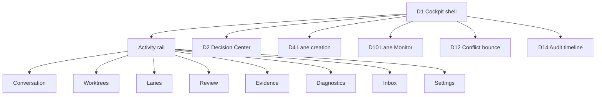
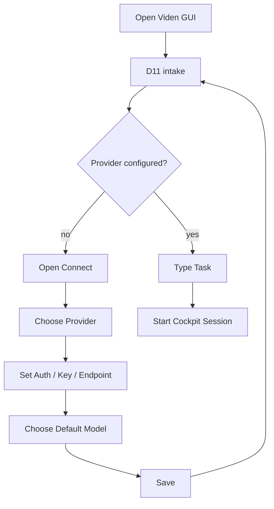
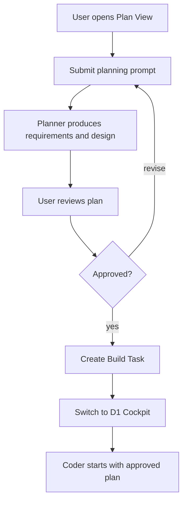
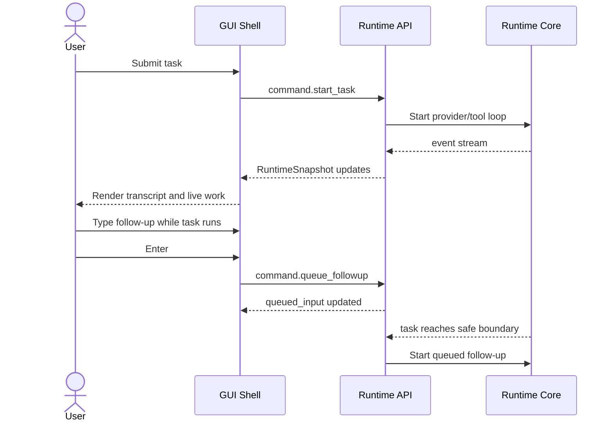
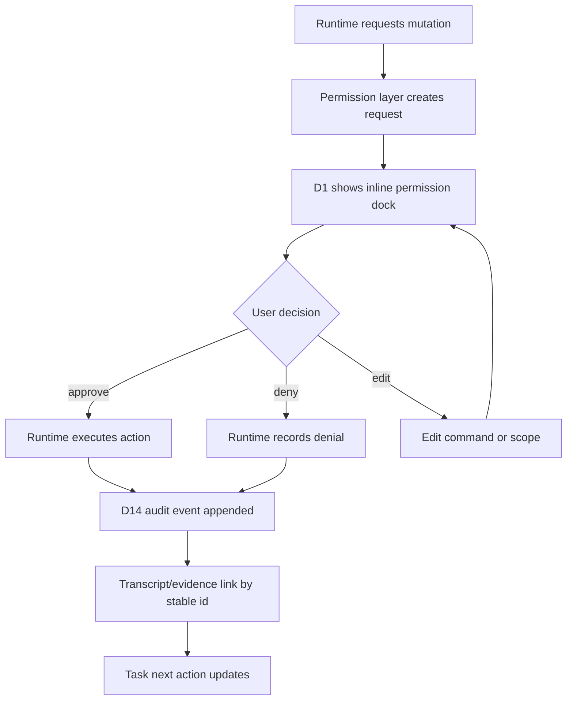
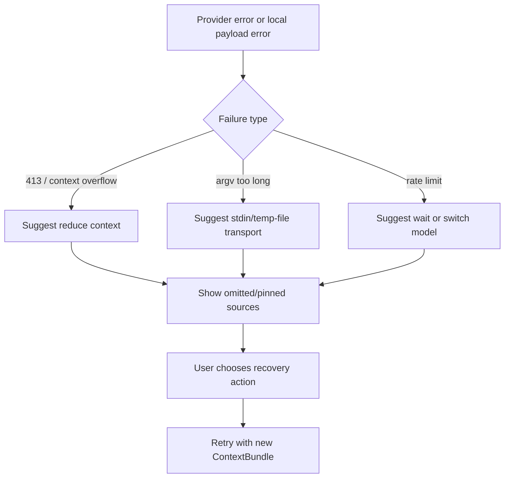

# Viden GUI Version Functional Design

Chinese version: [gui-version-functional-design.zh-CN.md](gui-version-functional-design.zh-CN.md)

Last updated: 2026-07-19
Framework selection is evaluated separately in
[GPUI GUI Feasibility Research](gpui-gui-feasibility-research.md). The product
and runtime contracts in this document remain framework-neutral until the
GPUI/Tauri vertical-slice gate is complete.

## Purpose

This document defines the functional boundary for the Viden GUI version. The
GUI is not a new agent runtime and not a second business-logic path replacing
the TUI. It is a visual operator cockpit built on the same `RuntimeSnapshot` /
event stream after the `0.2.x` runtime layering, context/cost engine, agent
execution loop, and real development gate are stable.

The GUI should help users supervise and operate AI coding work:

- what is running right now;
- which agent, lane, or tool owns it;
- which context is included or omitted;
- what files, tests, diagnostics, and failures changed;
- which actions need approval;
- how token usage, cost, and provider health look;
- whether the next action should be apply, retry, discard, ask user, switch
  model, or reduce context.

## Product Positioning

Viden GUI is a visual coding operator cockpit, not a traditional IDE.

It does not need to own the entire code editing experience. Users can continue
using their editor, terminal, and Git workflow. The GUI's job is to make Viden
runtime facts clear: tasks, context, permissions, evidence, cost, and
recovery.

Visual and interaction behavior follows the accepted source map in
[Viden Design Adoption](viden-design-adoption.md). D1 and the GUI component kit
define the shell and component vocabulary; D2, D4, D10, D11, D12, D13, and D14
define their named workflows. Review snapshots live under
`docs/viden-design/reference-shots/`. Old files under
`docs/viden-design/Viden/screenshots/` are not targets.

## Prerequisites

GUI implementation starts only after the runtime/UI contract freeze. Once that
gate passes, GUI and TUI development run in parallel on separate branches as
defined in [Viden Parallel Development Plan](parallel-development-plan.md).

| Version | Prerequisite | GUI dependency |
| --- | --- | --- |
| `0.2.0` | Architecture cut and core structure refactor | GUI waits for `viden-core`, event stream, and command bus boundaries |
| `0.2.1` | Context, token/cost, evidence, and runtime fact model | GUI can display context bundle, budgets, compaction, omissions, cost, and evidence |
| `0.2.2` | Supervised agent execution loop | GUI can show planner, coder, reviewer, tester, doc-writer, researcher, and release-operator task states |
| `0.2.3` | Plugin runtime and real development gate | GUI can show plugin health, release gate, smoke, token/cost, and failure-classification evidence |
| `0.3.0` | Runtime/UI contract freeze and Viden migration plan | GUI receives stable API/event/command schemas and migration constraints |
| `0.3.1` | Parallel TUI and GUI implementation | A framework-neutral GUI client is developed on `codex/v3-gui-client` |
| `0.3.2` | Integration release candidate | GUI and TUI pass parity fixtures against the same runtime facts |
| `0.3.3` | Operable GUI beta and compatibility hardening | Composer, approval, provider/model, context recovery, and Viden/Viden migration |
| `0.3.4` | Visual fidelity gate | Component gallery, screenshot harness, TUI regression evidence, and accepted target deviations |

## Non-goals

- Reimplementing the provider loop, tool execution, permission checks, or
  context compaction in the GUI.
- Turning Viden into a full IDE or code editor.
- Bypassing the safety rules already established by the TUI, CLI, and release
  gate.
- Letting the GUI store raw API keys, provider secrets, raw prompt payloads, or
  lane secrets.
- Giving the GUI its own task, agent, or approval state model.

## Target Users

| User | Main need |
| --- | --- |
| Daily developer | Start tasks, watch progress, approve changes, inspect diff/test evidence |
| Advanced operator | Supervise lanes, control context, debug provider and cost problems |
| Maintainer | Review release gates, smokes, failure categories, session history, and evidence |
| New user | Configure provider/model/setup through direct manipulation instead of guessing commands |

## Information Architecture

D1 is the application shell. Its activity rail owns the stable top-level
navigation; dedicated D-numbered screens provide focused workflows rather than
creating a second navigation system.



The GUI standardizes long-term hierarchy as:

```text
Workspace -> Project -> Lane / Session -> Subagent
```

The user supervises lanes. A lane can belong to a project or exist as a
workspace-level global lane.

## Core Screens

### 1. D11 First Run And Project Intake

The start screen is the quiet task entry point. Until a real task starts, the
GUI should stay here.

Functional requirements:

- Show Viden logo, current workspace, provider/model, mode, and permission.
- Main composer supports natural-language tasks, slash commands, and quick
  actions.
- `/connect`, `/models`, `/settings`, and `/permissions` open panels, then
  return to the D11 intake surface after save or cancel.
- Show recent projects, recent sessions, and recent failed-task recovery
  actions.
- If provider key, endpoint, or model availability is broken, show a lightweight
  banner without blocking input.

Acceptance criteria:

- Provider/model configuration does not jump into the cockpit.
- Cursor starts in the composer input position.
- Before a real task starts, transcript, side rail, and active task UI stay
  hidden.

### 2. D1 Workspace Cockpit

The cockpit is the main surface after real work starts. Its first visual
contract must come from an accepted design source and screenshot baseline.

Functional requirements:

- A fixed 52 px activity rail provides stable navigation. The lane rail floats
  on hover by default, can be pinned, and is hidden in focus mode; its width is
  controlled by shared tokens rather than copied into feature code.
- Center area contains the current lane streaming transcript, tool events,
  diff/test/evidence.
- Composer always stays editable. During an active turn, Enter queues a
  follow-up.
- Live Work shows the current phase: planning, building context, editing,
  running tool, waiting approval, testing, reviewing, blocked, or done.
- Right-side Environment panel is collapsible: context/cost, MCP, LSP, Todo,
  sources, subagents, provider health, recent files, diagnostics, pending
  approvals.
- File, diff, subagent, or evidence rows can open an Inspector pane; Inspector
  must not squeeze the main transcript out of usefulness.
- Bottom/overlay panels host terminal, files, review, browser, side chat, and
  temporary work without changing the core lane.
- History remains scrollable. When the user scrolls away from the bottom, new
  output updates a live badge instead of forcing auto-follow.
- Errors appear as inline recovery cards, not abrupt centered popups.

Acceptance criteria:

- Provider work, tools, lanes, and approvals cannot lock the composer.
- Live Work describes Viden or internal roles, not provider mind-reading such
  as `DeepSeek is thinking`.
- Long-running tasks, resize, and idle state do not corrupt layout, black out
  the screen, or lose scrollback.
- Cockpit tokens, window chrome, lane rows, Environment, Inspector, composer,
  float/pinned/focus states, and on-demand docks have component-gallery and
  screenshot baselines once a visual target is accepted.

### 3. Plan View

Plan View is a read-only activity-rail view for requirements, architecture,
implementation approach, and task breakdown. It is not a separate top-level
application shell.

Functional requirements:

- Clearly mark `Plan` mode.
- Plan mode blocks file writes, shell mutations, Git mutations, and
  memory/task mutations.
- Show requirements, assumptions, constraints, architecture decisions, risks,
  test strategy, tasks, and acceptance criteria.
- Let the user keep typing follow-ups while the planner is running; those
  follow-ups enter the queue.
- Convert an approved plan to a build task only after explicit user
  confirmation.

Acceptance criteria:

- Plan mode does not write code or modify files.
- The composer remains editable after planning completes.
- Plan-to-build is an explicit action, never automatic execution.

### 4. Agent Board View

Agent Board shows the supervised agent execution loop.

Functional requirements:

- Show planner, coder, reviewer, tester, doc-writer, researcher, and
  release-operator roles. Context building and lane supervision are runtime
  capabilities, not user-selectable agent roles.
- Each agent shows task, input, output, evidence, status, failure category, and
  next action.
- Support agent event timelines.
- Support pause, cancel, retry, downgrade to manual, switch model, or ask user.
- Delegated lanes and external agents show isolation status, working directory,
  commands, artifacts, and diff.
- Agent Board follows the lane/session hierarchy; subagents are never shown
  detached from their owning lane.

Acceptance criteria:

- Do not show fake agents without runtime facts.
- Agent state comes from `AgentTask` / `RuntimeSnapshot`, not GUI guesses.

### 5. Context And Cost

The context and cost panel is one of the GUI's core differentiators.

Functional requirements:

- Show the current `ContextBundle`: included files, omitted files, diff,
  diagnostics, tests, memories, task summaries, and lane summaries.
- Show token budget, context pressure, provider limit, compaction strategy, and
  omission reasons.
- Show input/output/cache tokens, estimated cost, provider, and model.
- For DeepSeek 413, argument list too long, or context overflow, provide
  recovery actions: reduce context, summarize logs, pin/omit sources, switch
  model, retry.
- Let users pin, omit, restore, and split context sources.

Acceptance criteria:

- Every real provider turn has an inspectable token/cost summary.
- Recovery is an executable action, not only explanatory text.

### 6. Evidence View

Evidence View is the activity-rail trust surface for completion.

Functional requirements:

- Aggregate diff, changed files, tool results, test commands, exit codes,
  diagnostics, screenshots, release gate, provider usage, and lane artifacts.
- Archive evidence by task and turn, with links from transcript, agent,
  approval, and history views.
- Support a completion checklist: diff present, tests run, diagnostics clean,
  approvals resolved, lanes successful.
- Export release evidence summaries.

Acceptance criteria:

- A task is not trusted complete only because assistant text says so.
- Completion must link to evidence or be clearly marked `unverified`.

### 7. Connect And Model Settings

Provider/model setup must be direct manipulation.

Functional requirements:

- Provider list shows providers only: DeepSeek, OpenAI, Anthropic, OpenRouter,
  DashScope, Ollama, Groq, Mistral, Qwen, and similar entries.
- Clicking a provider opens a setup form: auth mode, API key, login, endpoint,
  default model, active models, doctor.
- Keys display only a few leading/trailing characters with `*` masking in the
  middle; support update, delete, and test.
- OpenAI, Anthropic, and some providers may support browser login or API key.
  Auth mode differences must be explicit in the UI.
- `/models` shows only configured providers and active models, grouped by
  provider.
- Favorites appear at the top without duplicates. The model's provider name
  uses weaker visual hierarchy.

Acceptance criteria:

- Unconfigured providers do not appear in the model picker.
- After setup, the user can immediately choose default and active models.
- Deleting a key immediately updates provider health and model availability.

### 8. Permission, Decision, Conflict, And Audit

The GUI keeps four contracts distinct: D1 pre-execution permission, D2
post-output decisions, D12 merge conflict recovery, and D14 append-only audit.

Functional requirements:

- Global GUI labels are Ask, Auto Edit, Read Only, and Full Access, mapped to
  the shared Core permission modes without changing their CLI compatibility
  identifiers.
- D1 renders a blocking inline permission dock above the composer. Each request
  shows command/path, scope, risk, reason, preview, expiry/default action, and
  supports Once, Session, Always, Edit, and Deny when allowed by policy.
- D2 queues gate decisions, lane asks, review decisions, and contract
  confirmations after output exists. It links command, diff, evidence, risk,
  scope, history, and policy facts.
- D12 sends merge conflicts back to the owning lane for correction and
  re-verification before the gate can be submitted again.
- D14 records permission, gate, policy, and lane-lifecycle decisions in an
  append-only audit timeline. Evidence stores lane artifacts and is linked by
  stable IDs; it is not the audit log.
- In Plan mode, mutating actions are not approvable unless the user exits Plan
  mode.
- All decisions are written to the audit timeline and linked from transcript
  or evidence where appropriate.

Acceptance criteria:

- GUI approval and TUI approval use the same permission layer.
- The GUI cannot bypass permissions to execute tools directly.

### 9. Release And Test Center

Release/Test Center serves maintainers and release gates.

Functional requirements:

- Show test suites, smoke suites, DeepSeek live development smoke, daily-loop,
  provider/model smoke, plan-mode smoke, lane operator smoke, and release gate.
- Each gate shows command, duration, exit code, token usage, cost, failure
  category, and evidence path.
- GitHub Release and Homebrew tap sync are one release unit.
- Support prepublish and postpublish evidence checks.

Acceptance criteria:

- Release cannot be shown as complete while the Homebrew tap is stale or
  unverified.
- Every release has a real development smoke and token/cost summary.

### 10. History And Replay

History supports recovery, audit, and replay.

Functional requirements:

- Search by project, session, task, agent, provider, model, date, and failure
  type.
- Replay transcript, tool calls, approvals, diff/test evidence.
- Resume task context from historical sessions.
- Generate recovery plans for failed sessions.

Acceptance criteria:

- JSONL remains the canonical audit source; SQLite/indexes are derived views.
- GUI does not rewrite historical facts. It can only append recovery or
  annotation events.

## Key User Flows

### Launch And Configure



### Plan To Build



### Active Task And Input Queueing



### Inline Permission And Audit



### Context Failure Recovery



## Runtime Integration Contract

The GUI can only integrate through stable runtime interfaces.

Detailed module-to-frontend wiring is defined in
[Frontend Integration Contract](frontend-integration-contract.md). When a core
module is completed, that document must be updated before GUI implementation
starts relying on the module.

| Interface | Direction | Purpose |
| --- | --- | --- |
| `RuntimeSnapshot` | core -> GUI | Complete current read-only state |
| `RuntimeEvent` stream | core -> GUI | Incremental token, tool, approval, agent, lane, and error events |
| `RuntimeCommand` | GUI -> core | Start task, queue input, approve, cancel, switch mode, configure provider |
| `EvidenceQuery` | GUI -> core/session | Query diff, test, approval, history, and release evidence |
| `ProviderSetupCommand` | GUI -> core/config | Update key handle, endpoint, model, active models, doctor |

The GUI must not:

- call shell/file/git tools directly;
- write transcript JSONL directly;
- make permission decisions itself;
- store raw keys;
- infer runtime state from rendered text.

## Functional Phasing

### GUI-0: Design And Protocol Freeze

- Complete functional design, information architecture, and main flow diagrams.
- Define the snapshot/event/command schema the GUI depends on.
- Separate core-derived state from GUI-only view state.

### GUI-1: Parallel Operable Client

- D11 first-run/project intake and D4 lane creation.
- D1 cockpit shell: activity rail, floating/pinned lane rail, transcript, live
  work, Environment, context/cost, provider health, and on-demand docks.
- Composer submit, queue follow-up, cancel.
- Connect/model settings.
- Inline permission dock and D2 Decision Center.
- Evidence view and D14 audit links.
- Plan view with explicit plan/build handoff.
- Every mutating action goes through `viden-core` command actions and permission
  gates.

### GUI-2: Integration Candidate

- TUI/GUI parity fixtures.
- Runtime replay and evidence consistency.
- Viden migration and Viden compatibility smoke.
- Plugin UI contribution smoke.

### GUI-3: Production Operator

- Plan-to-build handoff.
- Agent Board view controls: pause/retry/cancel/switch model.
- Context pin/omit/retry.
- Release/Test Center.
- D10 lane supervision, D12 conflict bounce, and external agent evidence.

### GUI-4: Design Fidelity Gate

- Every core GUI screen has a design source, framework-neutral component
  gallery, screenshot harness, and accepted baseline. A Tauri candidate may use
  Storybook/Playwright; a GPUI candidate uses its native gallery and capture
  harness.
- Token mapping is checkable; components do not write raw colors, scattered type
  sizes, or temporary spacing.
- Differences are recorded as accepted deviations; unexplained drift blocks
  release.

### GUI-5: Multi-frontend Ecosystem

- IDE/ACP adapters share the same runtime.
- Web remote operator view.
- Desktop notifications.
- Team handoff/export.

## MVP Priority

| Priority | Features |
| --- | --- |
| P0 | D11 intake, D4 lane creation, D1 cockpit, usable composer, streaming transcript, live work, provider/model setup, inline permission, evidence |
| P1 | D2 Decision Center, Plan View, Agent Board view, D10/D12/D14, context/cost, history/replay, release/test center |
| P2 | Lane supervision, GUI notifications, team handoff, IDE/web surfaces |

## Success Criteria

The GUI version succeeds when:

- users understand what Viden is doing;
- users can keep typing while a task is active;
- users can approve or reject mutations clearly;
- users can see context, token, cost, and provider errors;
- users can judge completion from evidence;
- GUI and TUI show the same runtime facts;
- closing or crashing the GUI does not compromise session, transcript, workflow,
  or tool-execution audit integrity.

## Open Questions

- Should the first GUI be Tauri desktop, local web app, or runtime API plus web
  prototype?
- Does the GUI need a built-in lightweight diff viewer, or should it call out to
  the user's editor?
- Should multiple projects be open at once?
- Does the GUI need team sharing, or should it stay local-first single-user for
  the first version?
- Should provider login auth be launched by the GUI through browser OAuth, or
  should CLI/core own all auth flows?
