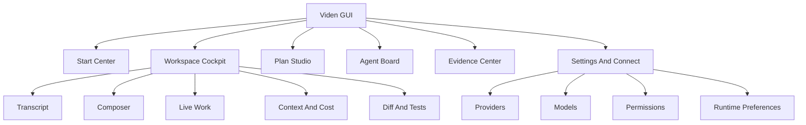
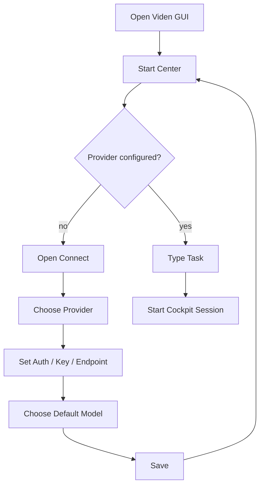
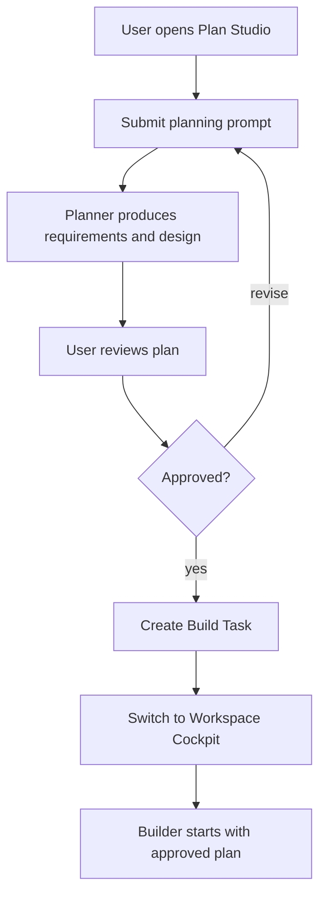
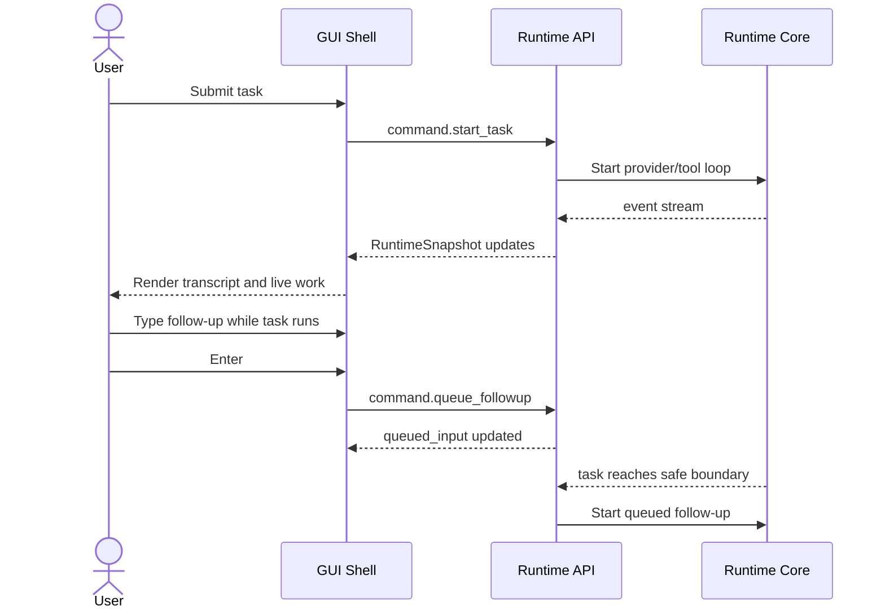
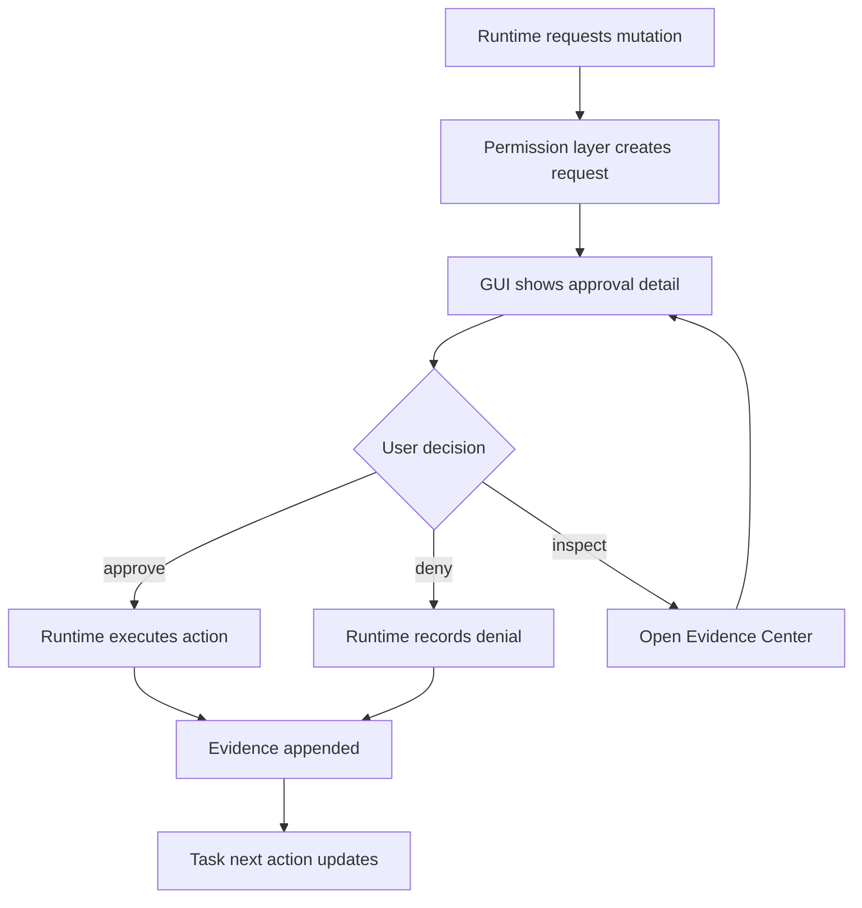
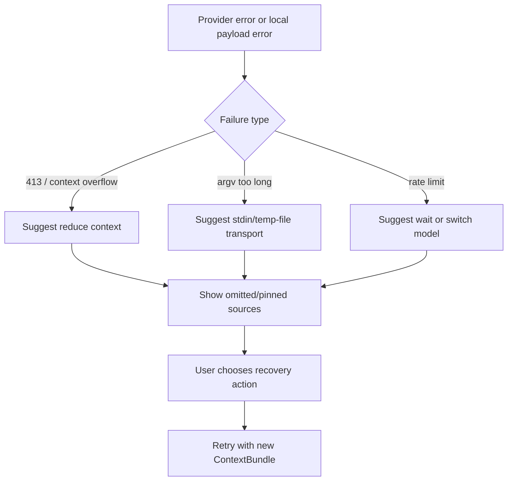

# Viden GUI 版本功能设计

English version: [gui-version-functional-design.md](gui-version-functional-design.md)

最后更新：2026-06-26

## 目的

这份文档定义 Viden GUI 版本的功能边界。GUI 不是新的 agent runtime，也不是替代
TUI 的第二套业务逻辑。它是 `0.2.x` runtime 分层、context/cost 引擎、agent 执行闭环和
真实开发场景 gate 稳定之后，基于同一套 `RuntimeSnapshot` / event stream 构建的可视化
operator cockpit。

GUI 的目标是让用户更清楚地监督和操作 AI coding 工作：

- 当前正在执行什么任务；
- 哪个 agent、lane 或 tool 负责；
- 当前用了哪些上下文，省略了哪些上下文；
- 发生了什么文件变更、测试、诊断和失败；
- 哪些操作需要用户批准；
- token、费用和 provider 健康情况如何；
- 下一步应该 apply、retry、discard、ask user、switch model 还是 reduce context。

## 产品定位

Viden GUI 是“可视化编码操作台”，不是传统 IDE。

它不负责编辑器内的全部编码体验，而负责把 AI 编码任务变成可监督、可审查、可恢复的工作流。
用户仍然可以继续使用自己的编辑器、终端和 Git 工具。GUI 的价值在于把 Viden runtime 中
的任务、上下文、权限、证据和成本变成清晰的操作界面。

视觉和交互源现在以 `docs/viden-design/Viden/` 下接受的 Viden 设计源为准。主要 GUI 目标图是
`docs/viden-design/Viden/screenshots/d1v2.png` 和
`docs/viden-design/Viden/screenshots/s13.png`。

## 前置条件

GUI 只有在 runtime/UI contract freeze 后才能进入实现阶段。一旦通过这个 gate，GUI 和
TUI 按 [Viden 并发开发计划](parallel-development-plan.zh-CN.md) 拆到独立分支并行开发。

| 版本 | 前置能力 | GUI 依赖 |
| --- | --- | --- |
| `0.2.0` | 架构切分与核心结构重构 | GUI 等待 `viden-core`、event stream 和 command bus 边界 |
| `0.2.1` | Context、token/cost、evidence 和 runtime fact model | GUI 显示 context bundle、预算、压缩、省略、费用和证据 |
| `0.2.2` | 受监督 Agent 执行闭环 | GUI 展示 planner、builder、tester、reviewer、doc-writer 的任务状态 |
| `0.2.3` | Plugin runtime 和真实开发 gate | GUI 显示 plugin health、release gate、smoke、token/cost 和失败分类证据 |
| `0.3.0` | Runtime/UI contract freeze 与 Viden migration plan | GUI 获得稳定 API/event/command schema 和迁移约束 |
| `0.3.1` | TUI 与 GUI 并行实现 | GUI 作为完整可操作 Tauri/Web client 在独立分支开发 |
| `0.3.2` | 集成候选版 | GUI 和 TUI 基于同一 runtime facts 通过 parity fixtures |
| `0.3.3` | 可操作 GUI beta 与 compatibility hardening | composer、approval、provider/model、context recovery、Viden/RoboCode migration |
| `0.3.4` | Visual fidelity gate | Storybook、Playwright、TUI previews 和 accepted target deviations |

## 非目标

- 不在 GUI 中重新实现 provider loop、tool execution、permission check 或 context
  compaction。
- 不把 GUI 做成完整 IDE 或代码编辑器。
- 不绕过 TUI、CLI 和 release gate 已经建立的安全规则。
- 不让 GUI 保存明文 API key、provider secret、raw prompt payload 或 lane secret。
- 不为 GUI 单独设计一套任务状态、agent 状态或 approval 状态。

## 目标用户

| 用户 | 主要需求 |
| --- | --- |
| 日常开发者 | 发起任务、监督进度、审批变更、查看 diff/test 证据 |
| 高级 operator | 同时监督多个 lanes、控制 context、排查 provider 和成本问题 |
| 项目维护者 | 查看 release gate、smoke、失败分类、历史会话和证据 |
| 新用户 | 通过直接操作界面完成 provider/model/setup，而不是猜命令 |

## 信息架构

GUI 顶层由六个主要区域组成。



GUI 把长期层级统一为：

```text
Workspace -> Project -> Lane / Session -> Subagent
```

这意味着 GUI 不再把 session、lane、subagent 分散成多套导航。用户监督的是 lane；lane 可以
属于某个 project，也可以作为 workspace 级全局 lane。

## 核心页面

### 1. Start Center

启动页是安静的任务入口。用户没有开始真实任务前，GUI 应一直停留在这里。

功能要求：

- 显示 RoboCode logo、当前 workspace、provider/model、mode、permission。
- 主 composer 支持自然语言任务、slash commands 和快速入口。
- `/connect`、`/models`、`/settings`、`/permissions` 打开面板后，保存或取消都回到
  Start Center，不自动进入工作会话。
- 显示最近项目、最近会话、最近失败的恢复动作。
- 如果 provider 缺 key、endpoint 不可用或 model 不可用，用轻量 banner 提示，不阻塞输入。

验收标准：

- 配置 provider/model 后不会跳进 cockpit。
- 光标默认在 composer 输入位置。
- 没有真实任务前，不显示 transcript、side rail 或 active task。

### 2. Workspace Cockpit

Cockpit 是真实任务开始后的主工作区。首版视觉合同必须来自被接受的设计源和截图 baseline。

功能要求：

- 左侧为 workspace/project/lane 导航，支持 Lanes / Workspace 切换、lane 展开和 subagent 列表。
- 中间为当前 lane streaming transcript、tool events、diff/test/evidence。
- Composer 始终可输入。active turn 运行时，Enter 将 follow-up 放入 queue。
- Live Work 区显示当前阶段：planning、building context、editing、running tool、
  waiting approval、testing、reviewing、blocked、done。
- 右侧为可折叠 Environment 面板：context/cost、MCP、LSP、Todo、sources、subagents、
  provider health、recent files、diagnostics、pending approvals。
- 从文件、diff、subagent 或 evidence 行可打开 Inspector 分栏；Inspector 不得挤没主 transcript。
- 下边栏/浮层用于 terminal、files、review、browser、side chat 等临时工作，不改变核心 lane。
- 支持滚动历史；用户滚离底部后，新输出只显示 live badge，不强行拉回底部。
- 错误提示以内联 recovery card 显示，不使用突兀居中弹窗。

验收标准：

- provider、tool、lane 和 approval 都不能锁住 composer。
- Live Work 文案描述 RoboCode 或内部角色，不显示 `DeepSeek is thinking` 这类 provider
  心智泄漏。
- long-running task、resize、idle 后 UI 不错位、不黑屏、不丢 scrollback。
- Cockpit token、窗口 chrome、lane row、Environment、Inspector 和 composer 在视觉目标被接受后
  必须有 Storybook/Playwright baseline。

### 3. Plan Studio

Plan Studio 是只读规划界面，服务于产品需求、架构、实现方案和任务拆解。

功能要求：

- 明确标记 `Plan` mode。
- Plan mode 禁止文件写入、shell mutation、Git mutation、memory/task mutation。
- 显示需求、假设、约束、架构决策、风险、测试策略、任务列表和验收标准。
- 支持用户在 planner 运行时继续输入 follow-up，进入 queue。
- 支持一键把 approved plan 转换为 build task，但必须经过用户确认。

验收标准：

- Plan mode 不写代码、不修改文件。
- Plan 结束后 composer 仍可输入。
- 从 Plan 到 Build 的切换是显式动作，不自动执行。

### 4. Agent Board

Agent Board 展示可监督的 agent 执行闭环。

功能要求：

- 展示 Planner、Context Builder、Builder、Tester、Reviewer、Doc Writer、Lane
  Supervisor 等角色。
- 每个 agent 显示 task、input、output、evidence、状态、失败分类和 next action。
- 支持查看 agent 的事件 timeline。
- 支持暂停、取消、重试、降级为 manual、切换 model 或请求用户补充信息。
- delegated lanes 和外部 agents 必须显示隔离状态、工作目录、命令、产物和 diff。
- Agent Board 与 lane/session 层级一致：subagent 不能脱离所属 lane 展示。

验收标准：

- 不显示没有 runtime facts 支撑的“假 agent”。
- agent 状态来自 `AgentTask` / `RuntimeSnapshot`，不是 GUI 自己猜测。

### 5. Context And Cost

Context 与费用面板是 GUI 的核心差异化能力之一。

功能要求：

- 展示本轮 `ContextBundle`：included files、omitted files、diff、diagnostics、tests、
  memories、task summaries、lane summaries。
- 展示 token budget、context pressure、provider limit、压缩策略和省略原因。
- 展示 input/output/cache tokens、估算费用、provider 和 model。
- 对 DeepSeek 413、argument list too long、context overflow 提供恢复动作：
  reduce context、summarize logs、pin/omit sources、switch model、retry。
- 支持用户 pin、omit、restore、split context sources。

验收标准：

- 每次真实 provider turn 后可查看 token/cost 摘要。
- 失败恢复动作不只是一段说明，而是可点击或可执行的 action。

### 6. Evidence Center

Evidence Center 是完成态信任的核心。

功能要求：

- 汇总 diff、changed files、tool results、test commands、exit codes、diagnostics、
  screenshots、release gate、provider usage、lane artifacts。
- 证据按 task 和 turn 归档，可从 transcript、agent、approval、history 跳转。
- 支持“完成检查”：是否有 diff、是否跑过测试、是否仍有 diagnostics、是否有 unresolved
  approval、是否有 failed lanes。
- 支持导出 release evidence summary。

验收标准：

- 一个任务不能只因为 assistant 文本说完成就显示为可信完成。
- 完成状态必须能关联到至少一种 evidence 或明确标记 `unverified`。

### 7. Connect And Model Settings

Provider/model 设置必须是直接操作界面。

功能要求：

- Provider 列表只显示供应商：DeepSeek、OpenAI、Anthropic、OpenRouter、DashScope、
  Ollama、Groq、Mistral、Qwen 等。
- 点击 provider 进入配置表单：auth mode、API key、login、endpoint、default model、
  active models、doctor。
- key 显示为开头和结尾少量字符，中间用 `*` 遮挡；支持 update、delete、test。
- OpenAI、Anthropic、部分 provider 可以支持网页登录或 API key；不同 auth mode 要在 UI 中
  明确显示。
- `/models` 只显示已经配置好的 provider 和已激活的模型，按 provider 分组。
- 支持 favorite models；favorite 出现在列表顶部且不重复，model 后的 provider 使用弱视觉层级。

验收标准：

- 未配置 provider 不出现在 model picker。
- 配置后可以立即选择默认模型和 active models。
- 删除 key 后 provider health 和 model availability 立即更新。

### 8. Permissions And Approval

权限界面必须解释“为什么需要批准”，而不是只弹一个命令。GUI approval 使用由 runtime facts
支撑的 decision surface。

功能要求：

- 全局 permission mode：read-only、suggest、auto-edit、manual、dangerous 等。
- 对每个 mutating action 展示 scope、risk、preview、diff、command、path、default action。
- 支持 deny、read-only、approve once、allow scope、open evidence、edit command、cancel task。
- decision surface 必须能从 command、diff、risk、scope、history、evidence 和 timeout policy 做判断。
- Plan mode 下 mutating action 默认不可批准，除非用户退出 Plan mode。
- 所有 approval decisions 写入 transcript/evidence。

验收标准：

- GUI approval 与 TUI approval 使用同一套 permission layer。
- 无法从 GUI 绕过权限直接执行 tool。

### 9. Release And Test Center

Release/Test Center 面向项目维护者和发布 gate。

功能要求：

- 展示 test suites、smoke suites、DeepSeek live development smoke、daily-loop、
  provider/model smoke、plan-mode smoke、lane operator smoke、release gate。
- 每次 gate 显示 command、duration、exit code、token、cost、失败分类和 evidence path。
- GitHub Release 和 Homebrew tap 同步作为同一个 release unit。
- 支持 prepublish 和 postpublish evidence 检查。

验收标准：

- 不能在 Homebrew tap stale 或未验证时显示 release complete。
- 每次发布前必须有真实开发场景 smoke 和 token/cost 摘要。

### 10. History And Replay

History 负责恢复、审计和复盘。

功能要求：

- 按 project、session、task、agent、provider、model、日期、失败类型检索。
- 支持 replay transcript、tool calls、approvals、diff/test evidence。
- 支持从历史会话恢复 task context。
- 支持对失败会话生成 recovery plan。

验收标准：

- JSONL 仍是 canonical audit source；SQLite/index 只是派生视图。
- GUI 不直接修改历史事实，只能追加 recovery 或 annotation 事件。

## 关键用户流程

### 启动和配置



### Plan 到 Build



### 活跃任务和输入排队



### Approval 与证据



### Context 失败恢复



## Runtime 接入合同

GUI 只能通过稳定接口接入 runtime。

模块到前端的详细接线方式见
[前端对接契约](frontend-integration-contract.zh-CN.md)。每个核心模块完成后，
必须先更新该文档，GUI 实现才能依赖该模块。

| 接口 | 方向 | 用途 |
| --- | --- | --- |
| `RuntimeSnapshot` | core -> GUI | 当前完整只读状态 |
| `RuntimeEvent` stream | core -> GUI | 增量事件：token、tool、approval、agent、lane、error |
| `RuntimeCommand` | GUI -> core | 启动任务、排队输入、批准、取消、切换 mode、配置 provider |
| `EvidenceQuery` | GUI -> core/session | 查询 diff、test、approval、history、release evidence |
| `ProviderSetupCommand` | GUI -> core/config | 更新 key handle、endpoint、model、active models、doctor |

GUI 不允许：

- 直接调用 shell/file/git tools；
- 直接写 transcript JSONL；
- 自己判定 permission；
- 自己保存明文 key；
- 从渲染文本反推 runtime 状态。

## 功能分期

### GUI-0：设计和协议冻结

- 完成功能设计、信息架构、主要流程图。
- 定义 GUI 依赖的 snapshot/event/command schema。
- 明确哪些状态来自 core，哪些只属于 GUI view state。

### GUI-1：并行可操作客户端

- Start Center。
- Workspace Cockpit：D1 lane/session navigation、transcript、live work、agent board、
  Environment、context/cost、provider health。
- Composer submit、queue follow-up、cancel。
- Connect/model settings。
- Approval panel。
- Evidence Center。
- Plan Studio 与 plan/build handoff。
- 所有 mutating action 都必须通过 `viden-core` command actions 和 permission gates。

### GUI-2：集成候选版

- TUI/GUI parity fixtures。
- Runtime replay 与 evidence consistency。
- Viden migration 与 RoboCode compatibility smoke。
- Plugin UI contribution smoke。

### GUI-3：生产级 Operator

- Plan -> Build handoff。
- Agent Board 控制：pause/retry/cancel/switch model。
- Context pin/omit/retry。
- Release/Test Center。
- Lane supervision 和外部 agent evidence。

### GUI-4：设计保真 Gate

- 每个 GUI 核心屏幕有设计源、Storybook story、Playwright screenshot 和 accepted baseline。
- token mapping 可检查，组件不写裸色值、散落字号或临时间距。
- 差异记录为 accepted deviation；未解释差异不能进入 release。

### GUI-5：多前端生态

- IDE/ACP adapter 共享同一 runtime。
- Web remote operator view。
- Desktop notifications。
- Team handoff/export。

## MVP 优先级

| 优先级 | 功能 |
| --- | --- |
| P0 | Start Center、Cockpit、composer 可用、streaming transcript、live work、provider/model setup、approval、evidence |
| P1 | Plan Studio、Agent Board、context/cost、history/replay、release/test center |
| P2 | lane supervision、GUI notifications、team handoff、IDE/web surfaces |

## 成功标准

GUI 版本成功不是“有一个漂亮窗口”，而是：

- 用户能看懂 RoboCode 正在做什么；
- 用户能在 task active 时继续输入；
- 用户能明确批准或拒绝 mutation；
- 用户能看到 context、token、cost 和 provider error；
- 用户能用证据判断任务是否完成；
- GUI 和 TUI 显示的是同一套 runtime facts；
- GUI 崩溃或关闭不会破坏 session、transcript、workflow 或 tool execution 的审计完整性。

## 开放问题

- GUI 首版是 Tauri desktop、local web app，还是先做 runtime API + web prototype？
- 是否需要内置轻量 diff viewer，还是调用外部编辑器？
- 是否支持多 project 同时打开？
- GUI 是否需要 team sharing，还是先保持 local-first 单用户？
- Provider 登录类 auth 是否由 GUI 发起浏览器 OAuth，还是由 CLI/core 统一处理？
