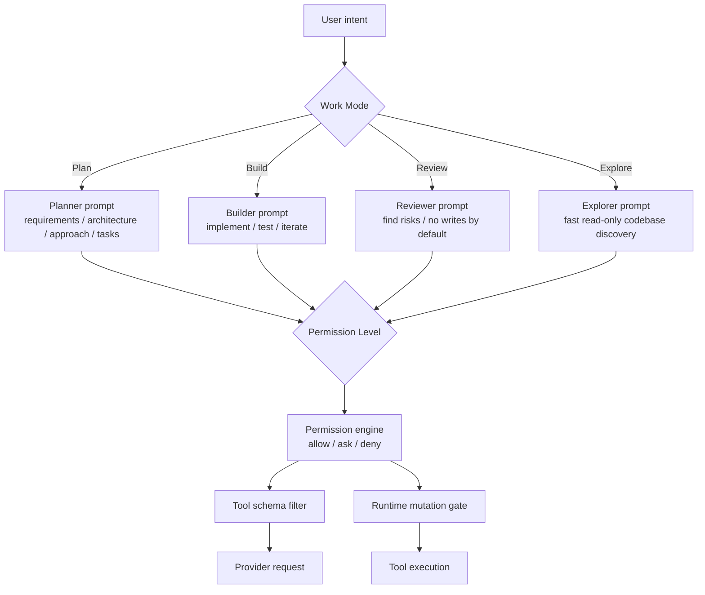
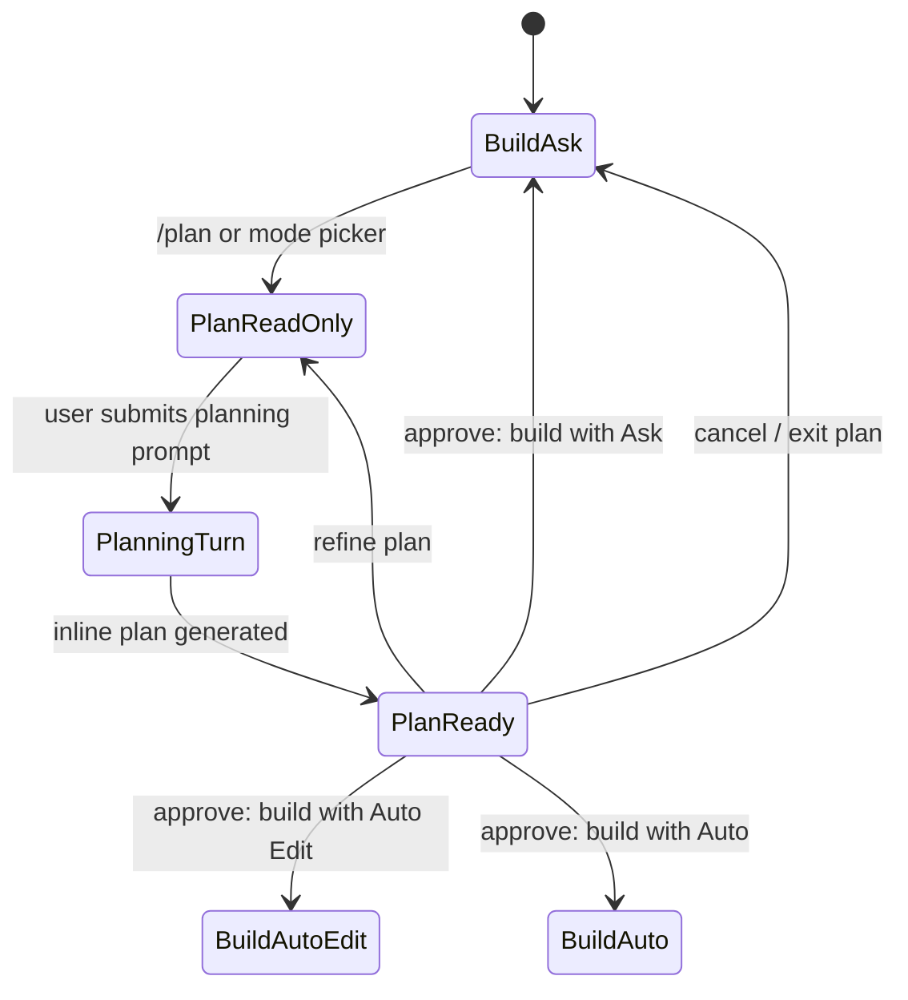

# Mode System Design

Chinese version: [mode-system-design.zh-CN.md](mode-system-design.zh-CN.md)

Last updated: 2026-06-09

## Purpose

RoboCode's "mode" should not be a single permission enum. After reviewing
Claude Code, Codex CLI, and opencode, the target design has two layers:

- **Work Mode**: what the user wants RoboCode to do now.
- **Permission Level**: how much RoboCode may do automatically.

This prevents Plan from being misunderstood as a low-permission coding mode.
Plan is a work mode for product requirements, architecture, implementation
approach, test strategy, and development plans. It does not write code.
Permissions are only one part of Plan's safety boundary.

## External References

| Product | Useful pattern | RoboCode decision |
| --- | --- | --- |
| Claude Code | Mode indicator, `Shift+Tab` cycling, Ask/Edit/Plan/Auto/Bypass; Plan researches and proposes a plan before execution. | Borrow "plan before approval", but model Plan as Work Mode instead of mixing it into permission levels. |
| Codex CLI | `/permissions` switches Auto, Read-only, and Full Access; Auto allows in-workspace actions and asks for out-of-scope or network access; transcript stays auditable. | Borrow simple trust levels and transcript auditability; keep RoboCode's finer Auto Edit level. |
| opencode | Build/Plan are primary agents; Tab switches agents; agents can configure prompts, models, and permissions; provider/model uses direct `/connect` and `/models` panels. | Borrow "Work Mode = primary agent" and direct manipulation panels; provider/model is not a mode. |

Reference links:

- Claude Code permission modes: https://code.claude.com/docs/en/permission-modes
- Codex CLI approval modes: https://developers.openai.com/codex/cli/features#approval-modes
- opencode agents: https://dev.opencode.ai/docs/agents/
- opencode providers/models: https://dev.opencode.ai/docs/providers, https://thdxr.dev.opencode.ai/docs/models/

## Two-Layer Model



## Work Modes

| Work Mode | Default use | Default permission level | Provider instruction | Writes code? |
| --- | --- | --- | --- | --- |
| `plan` | Requirements, architecture, implementation approach, test strategy, development plan | `read_only` | Produce plans and review notes only | No |
| `build` | Daily coding, fixes, tests, refactors | `ask` | Implement and verify | Only if permissions allow |
| `review` | Code review, risk scan, regression check | `read_only` | Lead with findings | No by default |
| `explore` | Understand code, find files, answer flow questions | `read_only` | Read-only exploration | No |

Short term, expose only `plan` and `build`; `review` and `explore` can become
future primary agents.

## Permission Levels

| Permission Level | UI label | Meaning | Reference |
| --- | --- | --- | --- |
| `ask` | Ask | Ask before mutations | Claude Ask before edits |
| `auto_edit` | Auto Edit | Allow file edits automatically; ask before shell/Git/external side effects | Claude Edit automatically |
| `auto` | Auto | Allow routine in-workspace edits and commands; ask or block out-of-scope, network, or dangerous actions | Codex Auto, Claude Auto |
| `read_only` | Read Only | Read-only; deny mutation or enter plan approval flow | Codex Read-only, opencode Plan/Explore |
| `full_access` | Full Access | High-trust local automation; hard safety boundaries still apply | Codex Full Access, Claude Bypass |

`locked` should not be a primary user-facing mode. Keep it only as an internal
safety state for incident recovery, policy locks, or managed configuration.

In the current `0.1` UI, expose `ask`, `auto_edit`, `read_only`, and
`full_access`. Keep `auto` as a target level until routine command
classification is enforced by the runtime permission engine.

## Hard Definition Of Plan

Plan mode = `work_mode=plan` + `permission_level=read_only` + planner provider
prompt.

Plan must:

- read project files, search code, inspect diffs, and inspect config;
- output PRDs, architecture, implementation approach, test strategy, task
  breakdown, risks, and open questions;
- not write code, modify files, run mutating shell/Git/workflow operations;
- not persist the plan to disk unless the user explicitly switches to
  build/auto_edit and confirms;
- end with approve choices: keep planning, build with Ask, build with Auto
  Edit, or cancel.

## UI Design

Top bar:

```text
[WORK Plan] [PERM Read Only]
```

Composer footer:

```text
MODE: [Plan] [Build]    PERM: [Ask] [Auto Edit] [Read Only] [Full Access]
```

Compact width:

```text
Plan · Read Only
```

Shortcuts:

- `Tab`: like opencode, switch primary work mode when welcome/composer has focus.
- `/mode`: open the Work Mode picker.
- `/permissions`: open the Permission Level picker.
- `/plan`: shortcut to `work_mode=plan`, saving the previous work mode and
  permission level.
- After plan approval: switch to Build only through the user's selected action.

## Plan Approval Flow



## Implementation Migration

Current code lets `PermissionMode::Plan` carry part of the Work Mode behavior.
Target migration:

1. Add `WorkMode`: `Plan`, `Build`, later `Review`, `Explore`.
2. Migrate existing `PermissionMode::Plan` into a compatibility alias for
   `work_mode=plan` + `permission_level=read_only`.
3. Pass both `work_mode` and `permission_level` in provider requests.
4. Let tool schema filtering depend on both work mode and permission level.
5. Show both layers in the TUI top bar, footer, picker, and transcript system
   events.
6. Make `/plan off` restore the previous work mode and permission level.
7. Render an action panel after Plan completes; do not auto-start implementation.

## Acceptance Criteria

- Users can tell whether RoboCode is in Plan or Build and what the permission
  boundary is.
- Plan is no longer shown as a normal permission option; it is a Work Mode.
- `/permissions` does not mix provider/model/work intent.
- `/connect` and `/models` remain opencode-style direct configuration/selection
  panels, not modes.
- Plan provider prompt, tool schema, and runtime permission gate all block code
  writing.
- Plan completion has explicit approve/refine/cancel flow and never silently
  begins implementation.
