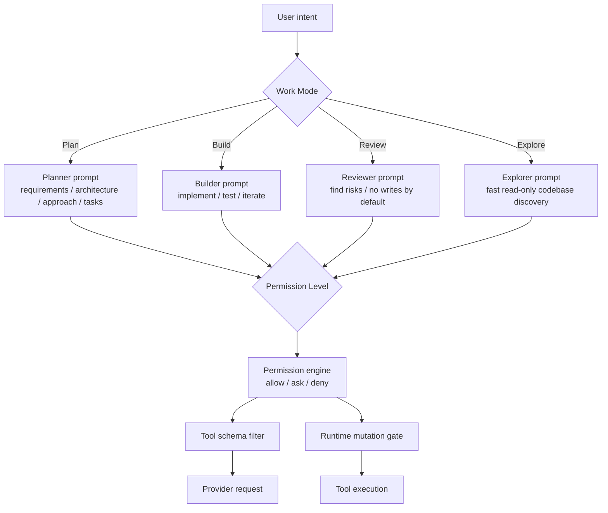
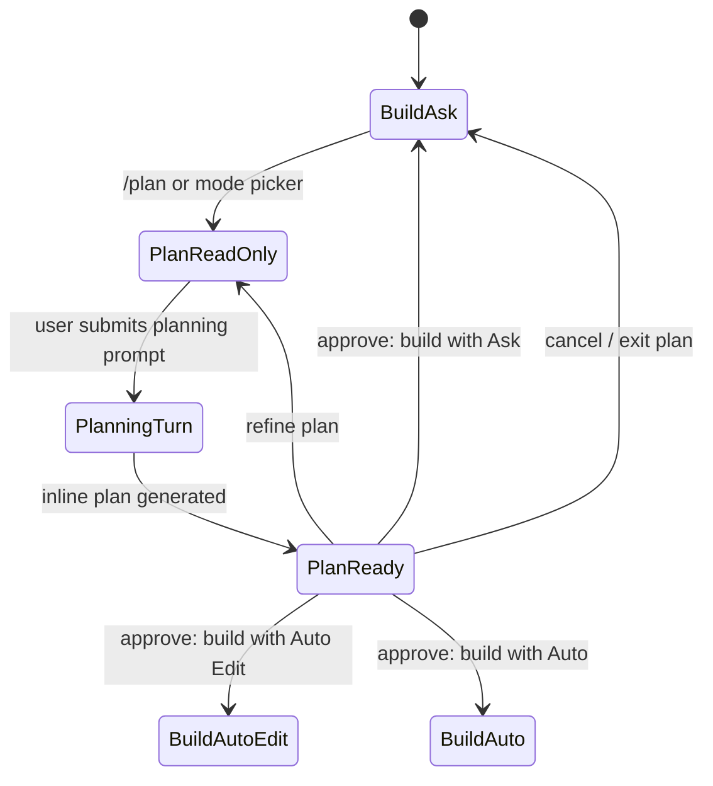

# Mode System 设计

English version: [mode-system-design.md](mode-system-design.md)

最后更新：2026-06-09

## 目的

RoboCode 的 “mode” 不应该只是一组权限枚举。参考 Claude Code、Codex CLI 和 opencode 后，
目标设计拆成两层：

- **Work Mode**：用户现在要 RoboCode 做什么。
- **Permission Level**：RoboCode 可以自动做多少事。

这样 Plan 就不会再被误解成“只是低权限 coding mode”。Plan 是规划产品需求、架构、实现方案、
测试策略和开发计划的工作模式，不写代码。权限只是 Plan 的安全边界之一。

## 外部产品参考

| 产品 | 值得参考的点 | RoboCode 取舍 |
| --- | --- | --- |
| Claude Code | mode indicator、`Shift+Tab` 循环、Ask/Edit/Plan/Auto/Bypass；Plan 会先研究并提出方案，审批后再进入执行。 | 借鉴“Plan 先审批再执行”，但把 Plan 明确建模为 Work Mode，不和一般权限枚举混在一起。 |
| Codex CLI | `/permissions` 切换 Auto、Read-only、Full Access；Auto 默认允许工作区内读写和命令，越界/网络再问；TUI 持续展示 transcript。 | 借鉴简洁的信任等级和 transcript 可审计性，但 RoboCode 保留更细的 Auto Edit。 |
| opencode | Build/Plan 是 primary agents，可用 Tab 切换；agent 可以配置 prompt、model、permission；provider/model 用 `/connect`、`/models` 直接面板操作。 | 借鉴 “Work Mode = primary agent” 和直接操作面板；provider/model 不归入 mode。 |

参考链接：

- Claude Code permission modes: https://code.claude.com/docs/en/permission-modes
- Codex CLI approval modes: https://developers.openai.com/codex/cli/features#approval-modes
- opencode agents: https://dev.opencode.ai/docs/agents/
- opencode providers/models: https://dev.opencode.ai/docs/providers, https://thdxr.dev.opencode.ai/docs/models/

## 两层模型



## Work Modes

| Work Mode | 默认用途 | 默认 permission level | Provider 指令 | 是否写代码 |
| --- | --- | --- | --- | --- |
| `plan` | 规划需求、架构、实现方案、测试策略、开发计划 | `read_only` | 只产出计划和评审意见 | 不写 |
| `build` | 日常编码、修复、测试、重构 | `ask` | 可以实现并验证 | 需要权限允许 |
| `review` | code review、风险扫描、回归检查 | `read_only` | 优先输出 findings | 默认不写 |
| `explore` | 快速理解代码、查找文件、回答“在哪里/怎么流转” | `read_only` | 只读探索 | 不写 |

短期实现可以先只暴露 `plan` 和 `build`；`review`、`explore` 可以作为后续 primary agents。

## Permission Levels

| Permission Level | UI 标签 | 语义 | 参考来源 |
| --- | --- | --- | --- |
| `ask` | Ask | mutation 前询问 | Claude Ask before edits |
| `auto_edit` | Auto Edit | 文件编辑自动允许，shell/Git/外部副作用询问 | Claude Edit automatically |
| `auto` | Auto | 工作区内常规编辑和命令允许，越界/网络/危险操作询问或拦截 | Codex Auto、Claude Auto |
| `read_only` | Read Only | 只读；mutation 拒绝或进入 plan approval flow | Codex Read-only、opencode Plan/Explore |
| `full_access` | Full Access | 高信任本地自动化；仍保留硬安全边界 | Codex Full Access、Claude Bypass |

`locked` 不作为用户主模式展示。它可以保留为内部安全状态，用于事故恢复、策略锁定或管理配置。

当前 `0.1` UI 只暴露 `ask`、`auto_edit`、`read_only` 和 `full_access`。`auto` 等 runtime
permission engine 具备 routine command classification 后再开放。

## Plan 的硬定义

Plan mode = `work_mode=plan` + `permission_level=read_only` + planner provider prompt。

Plan 必须满足：

- 可以读取项目、搜索代码、查看 diff、检查配置；
- 输出 PRD、架构、实现方案、测试策略、任务拆分、风险和开放问题；
- 不写代码、不修改文件、不执行 mutating shell/Git/workflow 操作；
- 不把计划落盘为文件，除非用户明确切到 build/auto_edit 并确认；
- 计划结束后显示 approve choices：继续规划、进入 Ask build、进入 Auto Edit build、取消。

## UI 设计

顶栏：

```text
[WORK Plan] [PERM Read Only]
```

Composer footer：

```text
MODE: [Plan] [Build]    PERM: [Ask] [Auto Edit] [Read Only] [Full Access]
```

窄屏：

```text
Plan · Read Only
```

快捷键：

- `Tab`：参考 opencode，在 welcome/composer 聚焦时切换 primary work mode。
- `/mode`：打开 Work Mode picker。
- `/permissions`：打开 Permission Level picker。
- `/plan`：快捷进入 `work_mode=plan`，并保存进入前的 work mode / permission level。
- Plan approval 后：用户选“开始实现”才切回 build。

## Plan Approval 流程



## 实现迁移

当前代码里 `PermissionMode::Plan` 已经承担一部分 Work Mode 职责。目标迁移：

1. 新增 `WorkMode`：`Plan`、`Build`，后续加 `Review`、`Explore`。
2. 把现有 `PermissionMode::Plan` 迁移为 `work_mode=plan` + `permission_level=read_only` 的兼容 alias。
3. Provider request 同时携带 `work_mode` 和 `permission_level`。
4. Tool schema 过滤由 work mode 和 permission level 共同决定。
5. TUI 顶栏、footer、picker、transcript system event 都显示两层状态。
6. `/plan off` 恢复进入 Plan 前的 work mode / permission level。
7. Plan 完成后渲染 action panel，不自动进入实现。

## 验收标准

- 用户能一眼看出“当前是在 Plan 还是 Build”，以及“当前权限边界是什么”。
- Plan 不再显示成普通 permission option；它是 Work Mode。
- `/permissions` 不再混入 provider/model/work intent。
- `/connect` 和 `/models` 仍按 opencode 方式是直接配置/选择面板，不是 mode。
- Plan provider prompt、tool schema、runtime permission gate 三层都阻止写代码。
- Plan 完成后有明确的 approve/refine/cancel flow，不能悄悄开始实现。
