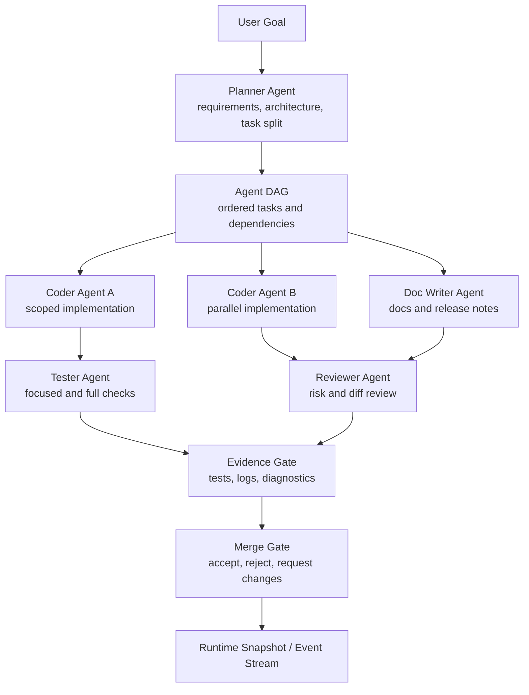

# Multi-Agent Core Orchestration

Chinese version: [multi-agent-core-orchestration.zh-CN.md](multi-agent-core-orchestration.zh-CN.md)

Status: future core architecture plan.

Implementation checkpoint:

- Landed: shared Agent DAG, role, evidence, and merge-gate contract types in
  `crates/types`; replay support in `RuntimeViewState`; dedicated
  `agents.jsonl` workflow event storage; `RuntimeCommand::StartAgentDag`; and
  `RuntimeSupervisor` events that create queued role tasks plus initial merge
  gates without blocking provider turns. `RuntimeCommand::StartAgentTask` now
  runs a supervised role task through the shared provider/runtime input path,
  gates execution on completed dependencies, emits an AgentTask-bound
  ContextBundle, records role evidence, marks the task complete, persists
  start/blocker/completion agent events, and updates the task merge gate when
  required evidence is satisfied. RuntimeSupervisor also routes active
  `StartAgentTask` provider turns through the shared cancellation path so a
  cancelled role task updates its task status and durable agent event before
  the worker accepts later commands. Explicit `CancelAgentTask` commands also
  persist `agent_task_cancelled` workflow events for queued or inactive tasks.
  `RuntimeCommand::AcceptMergeGate` and `RuntimeCommand::RejectMergeGate` now
  persist merge decisions, update the runtime merge-gate view, and attach the
  decision to the related AgentTask. Role `permission_policy` is now applied
  during `StartAgentTask`; read-only roles run under a temporary plan-mode
  scope, and the role-policy matrix covers tester verification, docs-only,
  reviewer read-only, scoped coder mutation, release-gate, and least-privilege
  external-agent behavior before approval/execution. The previous session
  permission state is restored afterwards. Tool-result runtime events now carry
  structured `success` and `exit_code` values so clients do not infer tool
  status from output text.
  Provider-backed role
  failures now persist `agent_task_failed` with `failure_class` and
  `recovery_suggestion`, surface the recovery hint in the runtime error, and
  attach a retry next action to the failed AgentTask. Completed AgentTasks now
  store the provider output summary in `task.result` and link the same output to
  role evidence. AgentTask ContextBundles now include initial role-specific
  guidance, file-scope, evidence-contract sources, deterministic scoped file
  candidates, and lightweight symbol candidates plus live LSP diagnostics
  selected per role.
  `RuntimeCommand::AcceptAgentArtifact`,
  `RuntimeCommand::RejectAgentArtifact`, and `RuntimeCommand::MergeAgentPatch`
  now update merge-gate/task state and persist durable artifact decision events.
  `MergeAgentPatch` also applies accepted patch evidence to workspace files via
  a basic unified-diff reducer; context mismatches produce durable patch
  conflict events and leave files unchanged. Scoped role Git staging now allows
  in-scope `git_add` while denying unscoped staging and high-risk Git
  mutations.
- Remaining: live LSP references enrichment for role-specific ContextBundle
  selection, release/publish Git rules, evidence collection reducers, richer
  patch formats such as rename/delete/binary and three-way conflict handling,
  and Zed-inspired ACP external-agent plugin adapters for Claude, Codex, and
  Kiro CLI.

Scope: shared runtime, workflow, provider, tool, permission, context, and
evidence contracts for supervised multi-agent coding. This document does not
define TUI or GUI layout. TUI and GUI clients must consume the same runtime
facts, commands, events, and view state.

## Goals

- Make multi-agent coding a core runtime capability, not a UI-specific feature.
- Support planner, coder, reviewer, tester, documenter, and release operator
  roles with explicit inputs, outputs, evidence, and permission scopes.
- Let multiple agents work in parallel without bypassing transcript,
  permission, context, provider, or merge-gate rules.
- Keep user control visible through approvals, cancellation, queued input,
  evidence review, and merge decisions.
- Prepare for future external agents, GUI supervision, and team workflows while
  preserving local-first execution.

## Non-Goals

- Fully autonomous mutation without user-controlled permission policy.
- A separate GUI-only orchestration engine.
- Cloud team collaboration before the local runtime contract is stable.
- Treating generated files as trusted unless they pass evidence and merge gates.

## Core Module Boundaries

| Module | Owns | Must not own |
| --- | --- | --- |
| `crates/types` | Stable contracts for `RuntimeCommand`, `RuntimeEvent`, `RuntimeViewState`, `AgentTask`, `AgentDag`, `ContextBundle`, `Evidence`, and merge-gate views. | Provider HTTP logic, tool execution, UI rendering. |
| `crates/runtime` | Runtime supervisor, command routing, agent lifecycle, event ordering, cancellation, approval callbacks, provider/tool loop orchestration. | Durable project workflow business state, UI layout, provider-specific protocol quirks. |
| `crates/workflows` | Durable project tasks, project memory, agent DAG persistence, workflow event logs, resume context derivation. | Live provider calls, terminal rendering, direct shell/file mutation. |
| `crates/provider` | Provider registry, model descriptors, instance-scoped provider binding, protocol adapters, model token metadata. | Permission policy, tool execution, UI command panels. |
| `crates/tools` | Local tool registry and execution adapters for file, shell, Git, search, web, and LSP capabilities. | Deciding whether a tool is allowed, agent task scheduling, merge acceptance. |
| `crates/permissions` | Permission modes, path scopes, tool mutability policy, agent-role policy matrix, approval decisions. | Running tools after approval, rendering approval UI. |
| `crates/session` | Append-only transcript JSONL and rebuildable session index. | Project task state or active memory state. |
| `crates/plugin-api` / `crates/plugin-host` | Extension contracts, plugin descriptors, capability declarations, trust boundaries. | Core runtime state ownership or UI-specific implementation. |
| `apps/tui` / `apps/gui` | Rendering, input orchestration, previews, selection panels, and client-side view state. | Provider loops, permission decisions, tool execution, workflow mutation logic. |

The invariant is that every agent action enters the same shared runtime path:
runtime command, permission gate, tool/provider execution, transcript event,
workflow event, evidence record, and merge-gate decision.

## Agent DAG

The multi-agent runtime represents delegated work as an auditable DAG. Each node
is an `AgentTask` with a role, scope, dependency set, context bundle, permission
policy, model/provider binding, output contract, and evidence requirements.

Minimum `AgentTask` fields:

- `id`, `role`, `title`, `objective`, and `status`;
- parent task, dependency ids, and blocked-by ids;
- workspace scope, file scope, and optional worktree scope;
- `ContextBundle` id and context budget;
- provider/model binding and tool capability set;
- permission profile and approval policy;
- expected outputs and evidence requirements;
- produced artifacts, patch metadata, diagnostics, and token/cost usage;
- merge-gate state and final decision.

Agent roles start as first-party roles:

- `planner`: converts user intent into requirements, architecture, and tasks;
- `coder`: edits scoped code or config files;
- `reviewer`: reviews diffs, risks, missing tests, and contract violations;
- `tester`: runs verification, classifies failures, and records evidence;
- `doc-writer`: updates user-facing and architecture documentation;
- `release-operator`: runs release gates, validates artifacts, and prepares
  publish evidence.

## Hybrid Orchestration Model

Viden should treat agent orchestration as a workflow compiler and supervisor.
A user goal can be decomposed into a DAG where each node chooses the best
execution capability for that step. The choice must consider both specialty and
cost: the most capable agent is not always the right agent when a local tool,
MCP call, cheaper model, or reusable skill can produce the same evidence with
lower risk and cost.

- first-party runtime roles for planning, scoped coding, review, testing,
  documentation, and release evidence;
- external ACP agents such as Claude, Codex, Kiro CLI, or future installed
  agents when their native strengths are useful;
- MCP tools for third-party systems, hosted services, knowledge bases, issue
  trackers, design systems, or remote automation;
- local tools for file, shell, Git, LSP, web/search, and diagnostics;
- skills for packaged procedures, repeatable playbooks, and domain-specific
  workflow steps.

The scheduler must support both sequential and parallel composition:

- sequential chains when later work depends on accepted evidence from earlier
  work;
- parallel fan-out when independent scoped tasks can run concurrently;
- fan-in gates where reviewer/tester/release roles reconcile outputs before
  patches, docs, or release artifacts are accepted;
- mixed execution where one workflow may combine provider-backed role agents,
  ACP agents, MCP calls, local tools, and skills under the same permission and
  evidence model.

Scheduling decisions should record an assignment profile for every task:

- `owner`: role, agent id, MCP server/tool, local tool, or skill;
- `assignment_reason`: specialty match, context locality, file ownership,
  previous evidence, cost, latency, risk, or explicit user preference;
- `capability_fit`: why this owner can satisfy the expected output contract;
- `cost_profile`: estimated tokens/cost, expected local tool time, provider
  class, budget cap, and cost strategy;
- `collaboration_pattern`: sequential handoff, parallel fan-out, fan-in review,
  or manual approval gate.

The scheduler should prefer the cheapest safe path that can produce required
evidence, but cost must not bypass permission, context, or capability
requirements.

Every orchestration step must remain visible as an `AgentTask`, tool call,
skill step, MCP invocation, evidence record, or merge-gate decision. UI clients
must not infer workflow progress from subprocess logs alone.

External agents are entering through the ACP/plugin foundation, but they become
production multi-agent participants only when they produce the same task, event,
evidence, and merge-gate records as first-party agents. The ACP implementation
direction is documented in
[Zed ACP Integration Research](zed-acp-integration-research.md): Viden should
use plugin/extension descriptors for installed agents, but RuntimeSupervisor
must own the subprocess lifecycle, prompt/cancel flow, permission bridge,
evidence conversion, and merge-gate updates.

## Event Protocol

The runtime event stream is the only synchronization path between core runtime,
TUI, GUI, CLI automation, and future external supervisors. Events must be
ordered, replayable, compact enough for UI updates, and backed by durable logs
when they affect session or workflow state.

Proposed `RuntimeCommand` additions:

| Command | Purpose |
| --- | --- |
| `StartAgentDag` | Create a supervised DAG from a user goal or saved plan. |
| `QueueAgentTask` | Add a task to an active DAG without blocking current input. |
| `StartAgentTask` | Start a specific task once dependencies and permissions allow it. |
| `CancelAgentTask` | Cancel a queued, inactive, or running task and record cancellation evidence. |
| `PauseAgentDag` | Stop scheduling new tasks while preserving running-state facts. |
| `ResumeAgentDag` | Resume scheduling from durable DAG state. |
| `RespondToAgentApproval` | Apply a user approval decision to a pending task/tool action. |
| `AcceptMergeGate` | Mark a merge gate accepted and persist the operator decision. |
| `RejectMergeGate` | Mark a merge gate as needing changes and persist the reason. |
| `AcceptAgentArtifact` | Accept an artifact/evidence id into the merge-gate candidate set. |
| `RejectAgentArtifact` | Reject an artifact/evidence id with reason and requested follow-up. |
| `MergeAgentPatch` | Apply accepted unified-diff patch evidence, mark it merged on success, or return the gate to needs-changes on conflict. |

Proposed `RuntimeEvent` additions:

| Event | Durable? | Purpose |
| --- | --- | --- |
| `AgentDagCreated` | yes | Records task graph creation and source user goal. |
| `AgentTaskQueued` | yes | Records task creation and dependencies. |
| `AgentTaskStarted` | yes | Marks scheduling, provider binding, and context bundle. |
| `AgentProgressUpdated` | no or sampled | Feeds live UI status without bloating logs. |
| `AgentArtifactProduced` | yes | Records patch, doc, plan, diagnostic, or report output. |
| `AgentApprovalRequested` | yes | Records pending permission decision. |
| `AgentTaskBlocked` | yes | Records dependency, permission, provider, context, or test blocker. |
| `AgentTaskCompleted` | yes | Records final output, evidence ids, token/cost, and status. |
| `AgentTaskFailed` | yes | Records failure class and recovery suggestion. |
| `EvidenceGateUpdated` | yes | Records verification state changes. |
| `MergeGateUpdated` | yes | Records accept/reject/request-change/merge decisions. |

Live progress events should be coalesced by the runtime supervisor. UI clients
must not infer business state from animation-only events.

## Permission Matrix

Plan mode remains non-mutating. Role permissions are layered on top of the
session permission mode and workspace/path scopes.

| Role | Read files | Web/search | Shell tests | File edits | Git mutation | Workflow/memory mutation | Release actions |
| --- | --- | --- | --- | --- | --- | --- | --- |
| `planner` | allow in scope | allow | deny by default | deny | deny | create draft plan/tasks only | deny |
| `coder` | allow in scope | ask if network | current runtime allows configured verification commands | current runtime allows scoped write/edit and denies common unscoped roots | current runtime allows in-scope `git_add` and denies unscoped staging/high-risk Git mutation | update own task status | deny |
| `reviewer` | allow in scope | allow | ask for verification | deny by default; initial runtime denies write/edit | deny | record review evidence | deny |
| `tester` | allow in scope | deny by default | initial runtime allows configured cargo/npm/pytest test commands | deny; initial runtime denies write/edit | deny | record test evidence | deny |
| `doc-writer` | allow in scope | allow | deny by default | initial runtime allows docs-scope write/edit and denies code-scope write/edit | deny | update doc task evidence | deny |
| `release-operator` | allow in scope | allow | current runtime allows configured release verification commands | current runtime allows docs-scope write/edit and denies code-scope write/edit | current runtime allows scoped `git_add`, denies `git_push`, and denies high-risk Git mutation; publish rules remain future work | record release evidence | explicit approval only |
| external agent | least privilege | least privilege | current runtime denies shell | current runtime denies write/edit | current runtime denies mutating Git tools | ask | explicit approval only |

Additional rules:

- Tool mutability is checked before execution for every agent.
- File scopes are evaluated per task, not only per session.
- Worktrees are separate scopes and must be declared in task metadata.
- Project memory suggested by any agent remains inactive until user
  confirmation.
- A role cannot escalate its own permissions. Permission changes are user
  commands.

## ContextBundle

`ContextBundle` is the normalized input package for each agent task. It is the
main control point for context size, cost, relevance, reproducibility, and
provider compatibility.

Required sections:

- `objective`: user goal, task goal, and explicit non-goals;
- `workspace`: repository root, worktree, dirty-state summary, and scoped paths;
- `selected_files`: file excerpts, symbol references, and reasons for inclusion;
- `conversation`: relevant user/assistant turns and omitted-turn summary;
- `workflow_state`: active tasks, blockers, memory, and resume facts;
- `diff_state`: current patch summary and touched files;
- `diagnostics`: LSP, test, lint, and build findings;
- `tool_evidence`: recent tool results with deduplication and truncation;
- `provider_policy`: model, token budget, cost budget, and unsupported features;
- `permission_policy`: allowed, ask, and denied capabilities;
- `exclusions`: files, secrets, logs, and outputs intentionally omitted.

Per-role context policy:

- Planner receives requirements, architecture docs, roadmap, high-level project
  facts, and constraints. It should not receive full file dumps by default.
- Coder receives focused file context, relevant tests, local conventions, and
  the exact task contract.
- Reviewer receives diff, task contract, relevant surrounding code, tests, and
  evidence.
- Tester receives commands, expected behavior, changed files, and failure
  history.
- Doc writer receives changed behavior, affected docs, terminology, and release
  notes.
- Release operator receives version plan, release checklist, artifacts, smoke
  evidence, and Homebrew/GitHub sync requirements.

Current implementation adds a `role-selected-files` source by scanning only the
task's declared `file_scope`, applying role-specific priority rules, and
recording file candidates rather than raw file contents. Later slices should
replace or enrich this with LSP symbols, references, diagnostics, and diff-aware
selection.

The runtime must record bundle metadata: token estimate, truncation policy,
deduplication decisions, source ids, and cost estimate.

## Evidence and Merge Gate

Every agent output that can affect source, config, docs, workflow state, or
release state must pass an evidence gate before merge.

Evidence types:

- `patch`: file changes, affected paths, and diff summary;
- `tool_log`: command, exit code, output tail, duration, and environment scope;
- `test_result`: command, passed/failed/skipped counts, failure class, and token
  cost if provider-backed;
- `diagnostic`: LSP/lint/build findings and source;
- `review`: reviewer findings, severity, and disposition;
- `doc_update`: changed docs and bilingual counterpart status;
- `screenshot`: UI state capture and viewport metadata;
- `release_artifact`: binary, checksum, GitHub asset, Homebrew tap, and smoke
  result.

Merge-gate states:

- `proposed`: agent has produced an artifact;
- `collecting_evidence`: required checks are running or pending;
- `blocked`: evidence failed or approval is missing;
- `needs_changes`: reviewer or user requested changes;
- `accepted`: evidence is sufficient but not yet merged;
- `merged`: patch or artifact was applied;
- `reverted`: merged output was rolled back with reason.

Merge rules:

- No patch can merge without a task id, context bundle id, and evidence ids.
- Mutating patches require permission state captured at the time of mutation.
- Failed checks must be visible as evidence, not hidden behind a generic error.
- Docs and tests are first-class evidence, not optional release polish.
- If multiple agents edit overlapping files, the merge gate must serialize,
  rebase, or reject the conflicting artifact explicitly.

## Version Plan

### 0.2.0 Runtime Contract Hardening

- Freeze `RuntimeCommand`, `RuntimeEvent`, and `RuntimeViewState` ownership.
- Make TUI consume runtime events instead of owning provider/tool loops.
- Add dependency guards so UI apps cannot import runtime/provider/tool/workflow
  internals directly.

### 0.2.1 Context and Cost Engine

- Introduce `ContextBundle` builder and metadata.
- Add token/cost estimates, truncation records, tool-result deduplication, and
  provider compatibility warnings.
- Make DeepSeek 413 and context overflow failures classifiable and recoverable.

### 0.2.2 Agent DAG and Role Runtime

- Add `AgentTask`, `AgentDag`, role definitions, and scheduler state.
- Support planner, coder, reviewer, tester, and doc-writer roles.
- Keep composer/input responsive while agent tasks run.
- Status: complete in the current working tree. Completion evidence is recorded
  in [0.2.2 Status](release-0.2.2-status.md).
- Implementation: initial shared types, runtime command, workflow event
  persistence, replayable events, queued role task records, and initial
  merge-gate creation are landed. Provider-backed role execution now records
  dependency-gated AgentTask-bound ContextBundle events, start/blocker/completion
  workflow events, role evidence, merge-gate updates, and cancellable active
  role turns. Explicit queued/inactive task cancellation now persists
  `agent_task_cancelled` workflow events. Basic merge gate accept/reject
  commands now persist operator decisions and update related task state. The
  role policy matrix now constrains tester, doc-writer, reviewer, scoped coder,
  release-operator, and external-agent provider-requested tools before
  approval/execution, and structured tool-result events carry success/exit-code
  facts through the runtime contract. Provider-backed role failures now persist failure classification
  and recovery suggestions, and completed AgentTasks store the provider output
  summary in `task.result` while linking the same output to role evidence.
  AgentTask ContextBundles now include initial role-specific guidance,
  file-scope, evidence-contract sources, deterministic scoped file candidates,
  lightweight symbol candidates, and live LSP diagnostics selected per role. Artifact accept/reject and accepted-patch merge state
  transitions are now implemented as runtime commands, and accepted unified-diff
  patch evidence can be applied to the workspace with durable conflict
  reporting. Scoped role Git staging now allows in-scope `git_add` while
  denying unscoped staging and high-risk Git mutations. Live LSP references
  enrichment, release/publish Git rules, richer patch formats, and three-way
  conflict handling remain the next slice.

### 0.2.3 Evidence and Merge Gate

- Add evidence records and merge-gate state machine.
- Require task, context, permission, test, and review evidence for agent patches.
- Add release-gate evidence as a reusable gate type.

### 0.2.4 External Agent and Plugin Boundary

- Allow provider/tool/workflow plugins to declare agent capabilities.
- Add least-privilege external agent scopes.
- Require external agents to emit the same runtime/workflow/evidence events.
- Land tracked ACP session job projection into RuntimeViewState.
- Bridge ACP `fs/read_text_file` and `fs/write_text_file` through Viden
  permission checks; reject unsupported filesystem methods and terminal client
  requests until terminal runtime bridges are implemented.
- Land ACP session restore/configuration through `/agent run acp` options:
  `session/load`, `session/set_mode`, and `session/set_config_option` model
  config with a legacy `session/set_model` fallback.
- Land custom/local ACP command support through the runnable `custom-acp`
  descriptor backed by `VIDEN_AGENT_ACP_COMMAND`.
- Land ACP update projection into reusable runtime events for assistant deltas,
  tool call start/finish, and turn-end evidence.
- Land async/background ACP job runtime-event append plus `RuntimeViewState`
  replay through `runtime-events.jsonl`.
- Land async/background ACP job live event push through `RuntimeSupervisor`.
- Next: add permission-gated ACP terminal bridge and complete merge-gate
  conversion.

### 0.2.5 Real Development Gate

- Codify DeepSeek-backed real development smoke tests.
- Record token usage, cost estimate, duration, failure category, and artifacts.
- Make release readiness depend on evidence completeness.

### 0.3.x Multi-Frontend Supervision

- Keep TUI as the primary local terminal cockpit.
- Add GUI supervision on top of the same event stream and runtime snapshots.
- Add IDE/ACP adapters only after the runtime contract is stable.

## Core TODO

- Define shared `AgentTask`, `AgentDag`, `ContextBundle`, `Evidence`, and
  `MergeGate` types in `crates/types`.
- Add workflow persistence for DAG/task/evidence events in `crates/workflows`.
- Extend `RuntimeSupervisor` to schedule agent tasks asynchronously.
- Keep agent task dependency blockers tied to the originating DAG in durable
  workflow events.
- Expand the role-aware permission policy with release/publish Git rules beyond
  scoped staging, high-risk Git denial, and the initial scoped coder,
  release-operator, and external-agent matrix.
- Add ContextBundle token/cost accounting and live LSP references enrichment
  before provider calls.
- Expand merge-gate reducers, views, and contract tests for evidence collection.
- Expand the current unified-diff patch application with rename/delete/binary
  handling and three-way conflict resolution.
- Add real development smoke gates to the release checklist.
- Keep TUI and GUI work behind the shared command/event/view-state boundary.
