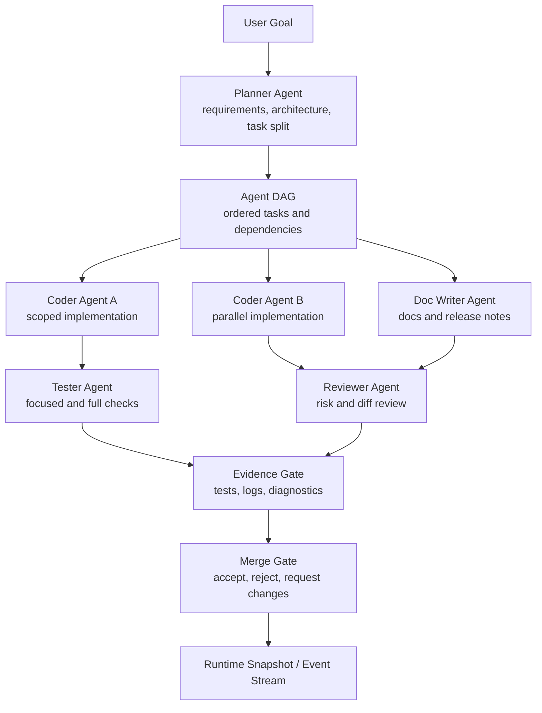

# 多 Agent 核心编排

英文版： [multi-agent-core-orchestration.md](multi-agent-core-orchestration.md)

状态：未来核心架构规划。

实现检查点：

- 已落地：`crates/types` 中的共享 Agent DAG、role、evidence、merge-gate
  contract types；`RuntimeViewState` replay 支持；独立 `agents.jsonl`
  workflow event storage；`RuntimeCommand::StartAgentDag`；以及
  `RuntimeSupervisor` 事件流，能够在不阻塞 provider turn 的情况下创建 queued role
  tasks 和初始 merge gates。`RuntimeCommand::StartAgentTask` 现在会通过共享
  provider/runtime input path 运行 supervised role task，在依赖完成后才执行，发出绑定到
  AgentTask 的 ContextBundle，记录 role evidence，将任务标记 complete，持久化
  start/blocker/completion agent events，并在 required evidence 满足时更新对应 merge gate。
  RuntimeSupervisor 也会把 active `StartAgentTask` provider turn 接到共享 cancellation
  path；role task 被取消时会先更新 task status 和 durable agent event，再让 worker
  继续处理后续命令。显式 `CancelAgentTask` 命令也会为 queued 或 inactive task 持久化
  `agent_task_cancelled` workflow events。`RuntimeCommand::AcceptMergeGate` 和
  `RuntimeCommand::RejectMergeGate` 现在会持久化 merge decision，更新 runtime
  merge-gate view，并把 decision 绑定到相关 AgentTask。role 的 `permission_policy`
  现在会在 `StartAgentTask` 执行期间生效；read-only role 会进入临时 plan-mode scope，
  role-policy matrix 覆盖 tester verification、docs-only、reviewer read-only、
  scoped coder mutation、release-gate 和 least-privilege external-agent 行为，
  并在 approval/execution 之前生效，任务结束后恢复原 session permission state。
  tool-result runtime events 现在会携带结构化 `success` 和 `exit_code`，客户端不再从输出文本推断工具状态。provider-backed role failure 现在会持久化带 `failure_class` 和
  `recovery_suggestion` 的 `agent_task_failed`，在 runtime error 中显示 recovery hint，
  并给失败 AgentTask 绑定 retry next action。完成的 AgentTask 现在会把 provider
  output summary 写入 `task.result`，并把同一输出链接到 role evidence。AgentTask
  ContextBundle 现在会包含初始 role-specific guidance、file-scope、evidence-contract
  sources，以及按 role 从声明 file_scope 中确定性选择的文件候选、轻量 symbol 候选和 live LSP diagnostics。
  `RuntimeCommand::AcceptAgentArtifact`、`RuntimeCommand::RejectAgentArtifact` 和
  `RuntimeCommand::MergeAgentPatch` 现在会更新 merge-gate/task state，并持久化
  artifact decision events。`MergeAgentPatch` 还会通过基础 unified-diff reducer
  将 accepted patch evidence 应用到 workspace；context mismatch 会产生 durable
  patch conflict events，并保持文件不变。scoped role Git staging 现在允许
  scope 内 `git_add`，并拒绝越界 staging 和高风险 Git mutation。
- 未完成：基于 live LSP references 的 role-specific ContextBundle enrichment、
  release/publish Git rules、evidence collection reducers、rename/delete/binary
  等更完整 patch 格式、三方冲突处理，以及面向 Claude、Codex、Kiro CLI 的
  Zed-inspired ACP external-agent plugin adapters。

范围：用于监督式多 Agent 编程的共享 runtime、workflow、provider、tool、
permission、context 和 evidence 契约。本文不定义 TUI 或 GUI 布局。TUI 和 GUI
客户端必须消费同一套 runtime facts、commands、events 和 view state。

## 目标

- 把多 Agent 编程做成 core runtime 能力，而不是某个 UI 的特性。
- 支持 planner、coder、reviewer、tester、documenter、release operator 等角色，
  并明确输入、输出、证据和权限作用域。
- 允许多个 agent 并行工作，但不能绕过 transcript、permission、context、
  provider 或 merge gate。
- 通过 approval、cancel、queued input、evidence review 和 merge decision，让用户控制权可见。
- 为后续 external agents、GUI supervision 和团队工作流做准备，同时保持 local-first。

## 非目标

- 没有用户权限策略约束的完全自治变更。
- GUI 专用的第二套 orchestration engine。
- 在 local runtime contract 稳定前做 cloud team collaboration。
- 未通过 evidence 和 merge gate 的生成文件不能被视为可信输出。

## 核心模块边界

| 模块 | 负责 | 不应负责 |
| --- | --- | --- |
| `crates/types` | `RuntimeCommand`、`RuntimeEvent`、`RuntimeViewState`、`AgentTask`、`AgentDag`、`ContextBundle`、`Evidence`、merge-gate views 等稳定契约。 | Provider HTTP 逻辑、tool execution、UI rendering。 |
| `crates/runtime` | Runtime supervisor、command routing、agent lifecycle、event ordering、cancellation、approval callbacks、provider/tool loop orchestration。 | 持久 project workflow 业务状态、UI layout、provider-specific protocol quirks。 |
| `crates/workflows` | durable project tasks、project memory、agent DAG persistence、workflow event logs、resume context derivation。 | live provider calls、terminal rendering、直接 shell/file mutation。 |
| `crates/provider` | provider registry、model descriptors、instance-scoped provider binding、protocol adapters、model token metadata。 | permission policy、tool execution、UI command panels。 |
| `crates/tools` | file、shell、Git、search、web、LSP 等本地工具 registry 与 execution adapters。 | 判断工具是否允许执行、agent task scheduling、merge acceptance。 |
| `crates/permissions` | permission modes、path scopes、tool mutability policy、agent-role policy matrix、approval decisions。 | approval 后运行工具、渲染审批 UI。 |
| `crates/session` | append-only transcript JSONL 和 rebuildable session index。 | project task state 或 active memory state。 |
| `crates/plugin-api` / `crates/plugin-host` | extension contracts、plugin descriptors、capability declarations、trust boundaries。 | core runtime state ownership 或 UI-specific implementation。 |
| `apps/tui` / `apps/gui` | rendering、input orchestration、previews、selection panels、client-side view state。 | provider loops、permission decisions、tool execution、workflow mutation logic。 |

不变量：所有 agent action 都必须进入同一条 shared runtime path：
runtime command、permission gate、tool/provider execution、transcript event、
workflow event、evidence record 和 merge-gate decision。

## Agent DAG

多 Agent runtime 把委派工作表示成可审计 DAG。每个节点都是一个 `AgentTask`，
包含 role、scope、dependency set、context bundle、permission policy、model/provider
binding、output contract 和 evidence requirements。

最小 `AgentTask` 字段：

- `id`、`role`、`title`、`objective`、`status`；
- parent task、dependency ids、blocked-by ids；
- workspace scope、file scope、可选 worktree scope；
- `ContextBundle` id 和 context budget；
- provider/model binding 和 tool capability set；
- permission profile 和 approval policy；
- expected outputs 和 evidence requirements；
- produced artifacts、patch metadata、diagnostics、token/cost usage；
- merge-gate state 和 final decision。

首批一方 role：

- `planner`：把用户意图转成需求、架构和任务；
- `coder`：在限定范围内修改代码或配置；
- `reviewer`：审查 diff、风险、缺失测试和契约违规；
- `tester`：运行验证、分类失败并记录证据；
- `doc-writer`：更新用户文档和架构文档；
- `release-operator`：运行 release gates、验证 artifacts、准备发布证据。

## 混合编排模型

Viden 应把 agent orchestration 做成 workflow compiler 和 supervisor。用户目标可以被
拆成 DAG，每个节点根据任务性质选择最合适的执行能力。选择时必须同时考虑专长和成本：
最强 agent 不总是最合适的 agent；如果 local tool、MCP call、更便宜模型或 reusable
skill 能以更低风险和成本产出同等 evidence，就应优先考虑。

- 一方 runtime roles：规划、限定范围编码、review、测试、文档和 release evidence；
- 外部 ACP agents：Claude、Codex、Kiro CLI 或未来安装的 agents，用于发挥各自原生能力；
- MCP tools：第三方系统、托管服务、知识库、issue trackers、design systems 或远程自动化；
- 本地 tools：file、shell、Git、LSP、web/search 和 diagnostics；
- skills：封装后的 procedure、可复用 playbook 和领域特定 workflow step。

scheduler 必须同时支持串行和并行组合：

- 前序 evidence 被接受后才能继续的 sequential chains；
- 互不依赖、scope 独立任务的 parallel fan-out；
- reviewer/tester/release roles 在接受 patch、docs 或 release artifact 前做汇总的 fan-in gates；
- 同一个 workflow 中混合 provider-backed role agents、ACP agents、MCP calls、local tools
  和 skills，但全部走同一套 permission 与 evidence 模型。

scheduler 应为每个 task 记录 assignment profile：

- `owner`：role、agent id、MCP server/tool、local tool 或 skill；
- `assignment_reason`：专长匹配、上下文局部性、文件归属、已有 evidence、成本、延迟、
  风险或显式用户偏好；
- `capability_fit`：为什么这个 owner 能满足 expected output contract；
- `cost_profile`：预计 tokens/cost、预计 local tool time、provider class、budget cap
  和 cost strategy；
- `collaboration_pattern`：sequential handoff、parallel fan-out、fan-in review 或
  manual approval gate。

scheduler 应优先选择能产出 required evidence 的最低成本安全路径，但成本不能绕过权限、
上下文或能力要求。

每个编排步骤都必须能显示为 `AgentTask`、tool call、skill step、MCP invocation、
evidence record 或 merge-gate decision。UI 客户端不能只靠 subprocess logs 推断
workflow progress。

External agents 正通过 ACP/plugin foundation 进入，但只有在输出同样的 task、event、
evidence 和 merge-gate records 时，才能成为 production multi-agent participants。
ACP 方向见 [Zed ACP 接入研究](zed-acp-integration-research.zh-CN.md)：
Viden 应使用 plugin/extension descriptor 表达已安装 agent，但 subprocess lifecycle、
prompt/cancel flow、permission bridge、evidence conversion 和 merge-gate updates
必须由 RuntimeSupervisor 拥有。

## 事件协议

runtime event stream 是 core runtime、TUI、GUI、CLI automation 和未来 external
supervisors 之间唯一的同步路径。事件必须有序、可 replay、足够紧凑，并且在影响
session 或 workflow state 时有 durable log 支撑。

建议新增的 `RuntimeCommand`：

| Command | 用途 |
| --- | --- |
| `StartAgentDag` | 从用户目标或已保存计划创建 supervised DAG。 |
| `QueueAgentTask` | 向 active DAG 增加任务，不阻塞当前输入。 |
| `StartAgentTask` | 依赖和权限满足后启动指定任务。 |
| `CancelAgentTask` | 取消 queued、inactive 或 running task，并记录 cancellation evidence。 |
| `PauseAgentDag` | 停止调度新任务，同时保留 running-state facts。 |
| `ResumeAgentDag` | 从 durable DAG state 恢复调度。 |
| `RespondToAgentApproval` | 把用户审批决策应用到 pending task/tool action。 |
| `AcceptMergeGate` | 标记 merge gate accepted，并持久化 operator decision。 |
| `RejectMergeGate` | 标记 merge gate needs changes，并持久化原因。 |
| `AcceptAgentArtifact` | 将 artifact/evidence id 接受到 merge-gate candidate set。 |
| `RejectAgentArtifact` | 带原因拒绝 artifact/evidence id，并请求后续动作。 |
| `MergeAgentPatch` | 应用 accepted unified-diff patch evidence；成功时标记 merged，冲突时退回 needs-changes。 |

建议新增的 `RuntimeEvent`：

| Event | 持久化 | 用途 |
| --- | --- | --- |
| `AgentDagCreated` | 是 | 记录 task graph creation 和来源 user goal。 |
| `AgentTaskQueued` | 是 | 记录 task creation 和 dependencies。 |
| `AgentTaskStarted` | 是 | 标记 scheduling、provider binding 和 context bundle。 |
| `AgentProgressUpdated` | 否或采样 | 为 UI 提供 live status，避免日志膨胀。 |
| `AgentArtifactProduced` | 是 | 记录 patch、doc、plan、diagnostic 或 report output。 |
| `AgentApprovalRequested` | 是 | 记录 pending permission decision。 |
| `AgentTaskBlocked` | 是 | 记录 dependency、permission、provider、context 或 test blocker。 |
| `AgentTaskCompleted` | 是 | 记录 final output、evidence ids、token/cost 和 status。 |
| `AgentTaskFailed` | 是 | 记录 failure class 和 recovery suggestion。 |
| `EvidenceGateUpdated` | 是 | 记录 verification state changes。 |
| `MergeGateUpdated` | 是 | 记录 accept/reject/request-change/merge decisions。 |

live progress events 应由 runtime supervisor 合并节流。UI 客户端不能从纯动画事件推断业务状态。

## 权限矩阵

Plan mode 保持非变更模式。角色权限叠加在 session permission mode 和 workspace/path
scopes 之上。

| Role | 读文件 | Web/search | Shell tests | 文件编辑 | Git 变更 | Workflow/memory 变更 | Release actions |
| --- | --- | --- | --- | --- | --- | --- | --- |
| `planner` | scope 内允许 | 允许 | 默认拒绝 | 拒绝 | 拒绝 | 只能创建 draft plan/tasks | 拒绝 |
| `coder` | scope 内允许 | 网络默认 ask | 当前 runtime 允许配置的 verification commands | 当前 runtime 允许 scoped write/edit，并拒绝常见非 scope 根目录 | 当前 runtime 允许 scope 内 `git_add`，并拒绝越界 staging/高风险 Git mutation | 更新自己的 task status | 拒绝 |
| `reviewer` | scope 内允许 | 允许 | verification 默认 ask | 默认拒绝；当前 runtime 拒绝 write/edit | 拒绝 | 记录 review evidence | 拒绝 |
| `tester` | scope 内允许 | 默认拒绝 | 当前 runtime 允许配置的 cargo/npm/pytest test commands | 拒绝；当前 runtime 拒绝 write/edit | 拒绝 | 记录 test evidence | 拒绝 |
| `doc-writer` | scope 内允许 | 允许 | 默认拒绝 | 当前 runtime 允许 docs-scope write/edit，并拒绝 code-scope write/edit | 拒绝 | 更新 doc task evidence | 拒绝 |
| `release-operator` | scope 内允许 | 允许 | 当前 runtime 允许配置的 release verification commands | 当前 runtime 允许 docs-scope write/edit，并拒绝 code-scope write/edit | 当前 runtime 允许 scoped `git_add`，拒绝 `git_push` 和高风险 Git mutation；publish rules 仍是后续工作 | 记录 release evidence | 仅显式 approval |
| external agent | 最小权限 | 最小权限 | 当前 runtime 拒绝 shell | 当前 runtime 拒绝 write/edit | 当前 runtime 拒绝 mutating Git tools | ask | 仅显式 approval |

附加规则：

- 每个 agent 执行工具前都必须检查 tool mutability。
- File scope 按 task 评估，而不是只按 session 评估。
- Worktree 是单独作用域，必须写入 task metadata。
- 任何 agent 建议的 project memory 在用户确认前都不能成为 active。
- role 不能自行升级权限。权限变化只能来自用户命令。

## ContextBundle

`ContextBundle` 是每个 agent task 的标准化输入包，也是控制上下文大小、成本、相关性、
可复现性和 provider 兼容性的主要位置。

必备 section：

- `objective`：user goal、task goal、明确 non-goals；
- `workspace`：repo root、worktree、dirty-state summary、scoped paths；
- `selected_files`：文件摘录、symbol references、纳入原因；
- `conversation`：相关 user/assistant turns 和 omitted-turn summary；
- `workflow_state`：active tasks、blockers、memory、resume facts；
- `diff_state`：当前 patch summary 和 touched files；
- `diagnostics`：LSP、test、lint、build findings；
- `tool_evidence`：去重和截断后的 recent tool results；
- `provider_policy`：model、token budget、cost budget、不支持能力；
- `permission_policy`：allowed、ask、denied capabilities；
- `exclusions`：有意排除的 files、secrets、logs、outputs。

按 role 的 context policy：

- Planner 获取 requirements、architecture docs、roadmap、高层 project facts 和约束；
  默认不拿全量文件 dump。
- Coder 获取聚焦文件上下文、相关测试、本地约定和精确 task contract。
- Reviewer 获取 diff、task contract、相关上下文代码、tests 和 evidence。
- Tester 获取 commands、expected behavior、changed files 和 failure history。
- Doc writer 获取 changed behavior、affected docs、terminology 和 release notes。
- Release operator 获取 version plan、release checklist、artifacts、smoke evidence
  以及 Homebrew/GitHub 同步要求。

当前实现会增加 `role-selected-files` source：只扫描 task 声明的 `file_scope`，
按 role-specific priority rules 选择文件候选，并记录文件列表而不是原始文件内容。
后续切片应使用 LSP symbols、references、diagnostics 和 diff-aware selection 增强这一层。

runtime 必须记录 bundle metadata：token estimate、truncation policy、
deduplication decisions、source ids 和 cost estimate。

## Evidence 与 Merge Gate

任何会影响 source、config、docs、workflow state 或 release state 的 agent output，
都必须先通过 evidence gate 再合并。

Evidence 类型：

- `patch`：文件变更、affected paths 和 diff summary；
- `tool_log`：command、exit code、output tail、duration、environment scope；
- `test_result`：command、passed/failed/skipped counts、failure class，以及
  provider-backed 时的 token cost；
- `diagnostic`：LSP/lint/build findings 和来源；
- `review`：reviewer findings、severity 和 disposition；
- `doc_update`：变更文档和双语 counterpart 状态；
- `screenshot`：UI state capture 和 viewport metadata；
- `release_artifact`：binary、checksum、GitHub asset、Homebrew tap 和 smoke result。

Merge-gate 状态：

- `proposed`：agent 已产出 artifact；
- `collecting_evidence`：required checks 正在运行或等待；
- `blocked`：evidence failed 或缺少 approval；
- `needs_changes`：reviewer 或用户要求修改；
- `accepted`：evidence 足够，但尚未 merge；
- `merged`：patch 或 artifact 已应用；
- `reverted`：merged output 已回滚并记录原因。

Merge 规则：

- patch 没有 task id、context bundle id 和 evidence ids 时不能 merge。
- mutating patch 必须记录变更发生时的 permission state。
- failed checks 必须作为 evidence 可见，不能被 generic error 隐藏。
- docs 和 tests 是一等 evidence，不是发布前的可选修饰。
- 多个 agent 修改重叠文件时，merge gate 必须显式 serialize、rebase 或 reject 冲突 artifact。

## 版本计划

### 0.2.0 Runtime Contract 收口

- 冻结 `RuntimeCommand`、`RuntimeEvent` 和 `RuntimeViewState` 的 ownership。
- 让 TUI 消费 runtime events，而不是直接持有 provider/tool loops。
- 加 dependency guards，禁止 UI apps 直接 import runtime/provider/tool/workflow internals。

### 0.2.1 Context 与 Cost Engine

- 实现
  [Context、Evidence 与 Cost Engine 设计](superpowers/specs/2026-07-18-context-evidence-cost-engine-design.zh-CN.md)
  定义的原生 canonical store、derived context views、scoped handles、audited retrieval、
  确定性 type-aware reducers、quality records 和 append-only cost ledger。
- 每个 provider-backed AgentTask 都从这些 handles 构造 bundle，在 transport 前执行
  hard limit，并保持 DeepSeek 413/context failure 可分类。

### 0.2.2 Agent DAG 与 Role Runtime

- 增加 `AgentTask`、`AgentDag`、role definitions 和 scheduler state。
- 支持 planner、coder、reviewer、tester、doc-writer roles。
- agent tasks 运行时 composer/input 保持响应。
- 状态：当前 working tree 已完成。完成证据记录在
  [0.2.2 状态](release-0.2.2-status.zh-CN.md)。
- 实现内容：初始 shared types、runtime command、workflow event persistence、
  replayable events、queued role task records 和初始 merge-gate creation 已落地。
  provider-backed role execution 现在会记录带依赖 gating 的 AgentTask-bound
  ContextBundle events、start/blocker/completion workflow events、role evidence，并更新
  merge gates，同时 active role turn 可被取消。显式 queued/inactive task cancellation
  现在会持久化 `agent_task_cancelled` workflow events。基础 merge gate accept/reject
  commands 现在会持久化 operator decisions，并更新相关 task state。role policy
  matrix 现在会在 approval/execution 前约束 tester、doc-writer、reviewer、
  scoped coder、release-operator 和 external-agent 的 provider-requested tools；
  structured tool-result events 会通过 runtime contract 携带 success/exit-code facts。provider-backed role
  failures 现在会持久化 failure classification 和 recovery suggestions。完成的
  AgentTask 会把 provider output summary 写入 `task.result`，并把同一输出链接到
  role evidence。AgentTask ContextBundle 现在包含初始 role-specific guidance、file-scope、evidence-contract
  sources，以及按 role 确定性选择的 scoped file candidates、轻量 symbol candidates
  和 live LSP diagnostics；artifact accept/reject 和 accepted-patch merge 状态流转已经作为 runtime commands 落地，accepted unified-diff patch evidence 可以应用到 workspace，并具备
  durable conflict reporting。scoped role Git staging 现在允许 scope 内
  `git_add`，并拒绝越界 staging 和高风险 Git mutation。live LSP references
  enrichment、release/publish Git rules、更完整 patch 格式和三方冲突处理是下一步。

### 0.2.3 Evidence 与 Merge Gate

- 增加 evidence records 和 merge-gate state machine。
- agent patches 必须具备 canonical task、context、permission、test、review evidence；
  summary-only evidence 不能满足 gate。
- 将 release-gate evidence 做成可复用 gate type。

### 0.2.4 External Agent 与 Plugin Boundary

- 允许 provider/tool/workflow plugins 声明 agent capabilities。
- 增加 least-privilege external agent scopes。
- 要求 external agents 输出同样的 runtime/workflow/evidence events。
- 已落地 tracked ACP session job 到 RuntimeViewState 的投影。
- 已把 ACP `fs/read_text_file` 和 `fs/write_text_file` 通过 Viden permission
  checks 桥接；未支持的 filesystem methods 和 terminal client requests 在
  terminal runtime bridge 落地前仍会被拒绝。
- 已落地 baseline ACP `session/cancel`：后台 ACP job 取消会先请求协议层
  cancel，再 fallback 到有界 process termination。
- 已落地 ACP session restore/configuration：`session/load`、`session/set_mode`
  和 `session/set_config_option` model config 已通过 `/agent run acp`
  options 进入 runtime，并保留 legacy `session/set_model` fallback。
- 已落地 custom/local ACP command support：`VIDEN_AGENT_ACP_COMMAND`
  会作为可运行的 `custom-acp` descriptor 进入同一 runtime path。
- 已落地 ACP update projection：assistant delta、tool call start/finish 和
  turn-end evidence 会转换为可复用 runtime events。
- 已落地 async/background ACP job 的 runtime-event 追加写入与
  `RuntimeViewState` 回放，artifact 为 `runtime-events.jsonl`。
- 已落地 async/background ACP job 通过 `RuntimeSupervisor` 的 live event push。
- 下一步：补 permission-gated ACP terminal bridge，并完成 merge-gate conversion。

### 0.2.5 Real Development Gate

- 固化 DeepSeek-backed real development smoke tests。
- 记录 token usage、cost estimate、duration、failure category 和 artifacts。
- release readiness 必须依赖 evidence completeness。

### 0.3.x Multi-Frontend Supervision

- TUI 继续作为主要 local terminal cockpit。
- GUI supervision 基于同一 event stream 和 runtime snapshots。
- IDE/ACP adapters 只在 runtime contract 稳定后接入。

## 核心 TODO

- 在 `crates/types` 定义共享 `AgentTask`、`AgentDag`、`ContextBundle`、`Evidence`
  和 `MergeGate` 类型。
- 在 `crates/workflows` 增加 DAG/task/evidence events 持久化。
- 扩展 `RuntimeSupervisor`，异步调度 agent tasks。
- 确保 agent task dependency blockers 在 durable workflow events 中归属原始 DAG。
- 在已落地的 scoped staging、高风险 Git denial，以及 scoped coder、
  release-operator 和 external-agent matrix 之上，继续扩展 release/publish Git
  rules。
- 在 provider calls 前增加 ContextBundle token/cost accounting 和 live LSP
  references enrichment。
- 扩展 evidence collection 所需的 merge-gate reducers、views 和 contract tests。
- 在当前 unified-diff patch application 基础上扩展 rename/delete/binary 处理和三方冲突解决。
- 将 real development smoke gates 加入 release checklist。
- TUI 和 GUI 开发必须保持在 shared command/event/view-state boundary 之后。
