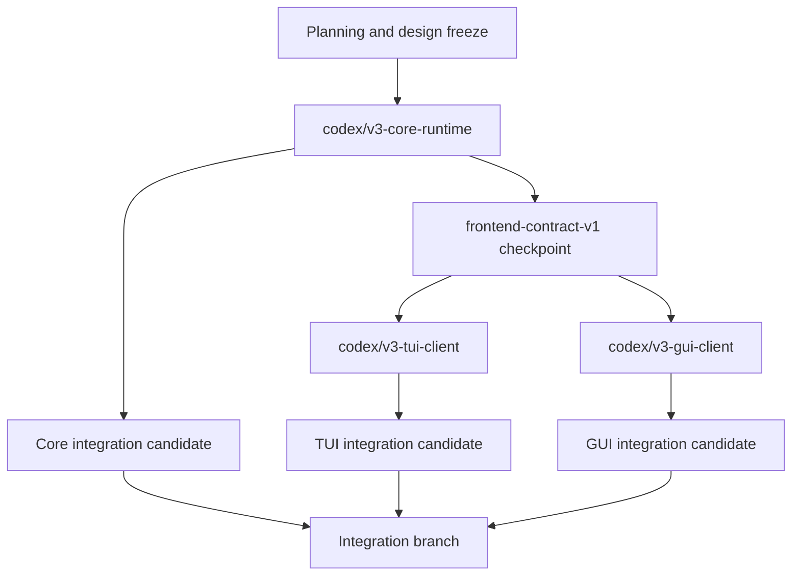

# Viden Core / TUI / GUI Three-Branch Development Plan

Chinese version: [parallel-development-plan.zh-CN.md](parallel-development-plan.zh-CN.md)

Last updated: 2026-07-19

## Purpose

This plan translates the new design under `docs/viden-design/Viden/` into three requirement classes and defines the boundaries, dependencies, phases, and acceptance gates for three long-lived development branches.

| Branch | Requirement class | Sole responsibility |
| --- | --- | --- |
| `codex/v3-core-runtime` | Core | Authoritative runtime, cross-frontend contracts, persistence, safety, and execution |
| `codex/v3-tui-client` | TUI | Terminal interaction, rendering, and TUI-local view state |
| `codex/v3-gui-client` | GUI | Desktop interaction, rendering, platform adapters, and GUI-local view state |

The governing rule is:

> Core delivers a versioned contract-freeze checkpoint first. TUI and GUI branch from that checkpoint and operate only through the same command, event, snapshot, and replay contracts.

This plan replaces the previous assumption that the GUI should immediately proceed as a Tauri implementation. The GUI branch remains framework-neutral. Tauri and GPUI must implement the same vertical slice against the same contracts and pass the same evidence gate before the production framework is selected.

## Design Sources And Naming Boundary

The current sources of truth are:

- `docs/viden-design/Viden/docs/SPEC.md`
- `docs/viden-design/Viden/docs/DESIGN-REF.md`
- `docs/viden-design/Viden/docs/screens-status.js`
- `docs/viden-design/Viden/tokens.css`
- `docs/viden-design/Viden/Core/`
- `docs/viden-design/Viden/TUI/`
- `docs/viden-design/Viden/GUI/`
- `docs/frontend-integration-contract.md`
- `docs/gui-version-functional-design.md`

Two uses of Core must remain distinct:

- The design package `Core/` directory is the reference for product mechanics, branding, tokens, and visual rules. It is not an operator-facing product screen.
- The Core development branch owns the Rust engine/runtime, cross-frontend contracts, and authoritative product state.

They align through design decisions and contracts, not through a mechanical directory mapping.

## Shared Product Model

The contract freeze first resolves the hierarchy as:

```text
Workspace -> Project -> Lane -> Session -> Task/Subagent
```

- Workspace is the current operator scope.
- Project maps to a repository and project policy.
- Lane is the isolated work container for routing, permissions, targets, and gates.
- Session is resumable interaction history inside a lane.
- Task/Subagent is a schedulable, cancellable, verifiable unit of work.

Lane becomes a first-class typed record with at least:

- `role`
- `route = built_in | acp | terminal | tmux`
- `gate_strength = full | cooperative | containment`
- `mutation_policy = autonomous | propose_only | read_only`
- worktree, branch, target, and data-egress policy
- status, budget, and active session ids

Legacy JSONL and fixtures remain readable through compatible deserialization or explicit schema migration.

## Three Requirement Classes

### A. Core Requirements

Core owns authoritative facts and every side effect. States shown in the TUI and GUI designs must not become a second frontend-owned business model.

#### Core P0: Contract Freeze Before Parallel Work

1. **Versioned multi-frontend protocol**
   - Freeze `RuntimeCommand -> RuntimeEvent -> RuntimeViewState`.
   - Add `schema_version`, capability discovery, event cursor, replay, and sequence-gap recovery.
   - Export a transport-neutral client contract from `viden-core`; clients do not create or mutate `SessionEngine`.

2. **Typed domain records**
   - Replace string inference for lane/task status, route, gate strength, and mutation policy with enums and records.
   - Align built-in roles with the design: planner, coder, reviewer, tester, doc-writer, researcher, and release-operator.
   - External is a transport/source/capability, not a built-in role.

3. **Promote lane runtime into Core**
   - Move authoritative worktree, terminal/tmux/PTY spawn, accept/apply, and conflict recovery out of `apps/tui/src/tui/lane.rs` into `crates/runtime` and `crates/tools`.
   - TUI and GUI send lane commands and consume lane events only.

4. **Real multi-lane supervisor**
   - Replace the single global active job with a registry keyed by lane/session/task identity.
   - Cancellation, approvals, queued input, and errors must identify their owner. One lane waiting for permission must not block another lane.

5. **Shared parity fixtures**
   - Cover streaming + tool calls, approval allow/deny, queued follow-up, DAG blocker, multiple lanes, MergeGate, context pressure, cost blind spots, and Plan mode denial.
   - Replaying one fixture in Core, TUI, and GUI must produce the same business facts.

6. **Approval and transcript contracts that can express the design**
   - Approval publishes risk, target, scope, policy reason, expiry/default action, and a stable audit id.
   - Transcript facts are paged or streamed as message/tool rows rather than only one accumulated string, enabling stable scroll anchors, history loading, and bounded virtualization.

#### Core P1: Single-Operator Supervision Loop

- Add `handoff`, `review_request`, `contract`, and `dependency` as cross-lane primitives.
- Complete MergeGate with gate type, owner, validator, policy snapshot, structured decisions, conflict bounce, and audited revert.
- Add an append-only audit timeline and stable query/pagination contracts.
- Add repository-level `viden.toml` schema for gates, ownership, domain packs, tool/MCP allowlists, budgets, and data egress.
- Freeze an `ExecutionTarget` interface and implement local first. The SSH adapter is P1 and does not block local P0.
- Mark terminal/tmux cost as blind or unmetered and expose only wall time, run count, diff size, and exit code.

#### Core P2: Team And Platform

- Domain Pack, validator, and evidence-renderer descriptors.
- Team ownership, claim, handoff, and multi-party approval.
- Cross-device daemon, Fleet, observe/takeover, and remote targets.
- Webhook, email, IM notifications, and team timeline.
- Vertical Domain Packs such as ML/robotics, device leases, and field gates.

### B. TUI Requirements

The TUI is a high-density terminal client. It no longer owns runtime lifecycle or lane side effects.

#### TUI P0: Thin Client With Existing Stability Preserved

- Render only from `RuntimeViewState` plus TUI-local layout state and send `RuntimeCommand` only through the Core client.
- Remove or reduce authoritative runtime behavior in `apps/tui/src/tui/lane.rs`.
- Replace direct `SessionEngine`/`EngineEvent` coupling with a client adapter and ordered event projection.
- Preserve the 0.1.30 zero-bug gate for input, CJK, focus, resize, scrollback, approvals, and non-blocking active turns.
- Implement Normal / Insert / Overlay input modes. `Ctrl-C` interrupts active work only; `Esc` unwinds overlay -> selection -> insert state.
- Support multiline composition, internal scrolling, and bracketed paste. Paste preserves newlines and never auto-submits, and CJK double-width cursor placement remains correct.
- Align T1/T1c/T1d/T3/T4 behavior: the composer stays editable, active turns support queue/cancel, actionable permission state stays pinned, and the ambient ticker contains no actions.
- Replay every shared fixture and assert the critical terminal render model.

#### TUI P1: Multi-Lane Supervision And Evidence

- T1/T1b multi-lane cockpit, lane detail, and inspector.
- T2 global navigation and selector-first provider/model/mode/permission/lane actions.
- Global fuzzy jump covers lane/session/gate/command/file with scoped prefixes.
- Compact task/DAG, MergeGate, evidence, context pressure, cost blind spot, and recovery panels.
- Terminal workflows for Decision Center, history/replay, and conflict bounce.
- The reference sidebar is off by default. Primary tabs are Changes, Evidence, and Context; Inbox/Fleet provide summary entry points only in P1.
- Wait for Core events before showing success; never infer success from transcript text or command output wording.

#### TUI P2: Advanced Terminal Capabilities

- Declarative plugin/domain UI contributions.
- Degraded terminal views for remote targets, Fleet, and large DAGs.
- Derive theme data from shared design tokens and cover valid skin/mode combinations plus truecolor -> 256 -> 16 color fallback.
- Use one glyph registry, prohibit emoji, keep mouse input disabled by default, and support bilingual and narrow-screen layout.
- Add terminal capability detection and broader accessibility support.

### C. GUI Requirements

The GUI is a desktop client of the same runtime. It may not directly depend on provider, tools, permissions, session, workflow, or runtime internals.

#### GUI P0: Operable Local Loop

- D11 first-run/project intake: repository scan, mode selection, `viden.toml` preview/confirm, and starter lane.
- D4 lane creation: role, route/agent/model, worktree, mutation policy, gate, target, budget, and audit.
- D1 cockpit: workspace/project/lane navigation, virtualized transcript, composer, queue/cancel, live work, provider health, context/cost, diff/test/evidence.
- Provider/model configuration and credential handles, with every mutation mediated by Core approval.
- D6 empty, disconnected, provider error, context overflow, and reconnect recovery states.
- Bilingual UI, theme, density, CJK IME, keyboard-only operation, visible focus, and baseline accessibility semantics.

#### GUI P1: Decisions, Supervision, And Trusted Delivery

- D2 Decision Center for permission, gate, lane asks, and contract confirmation.
- D10 Lane Monitor, D12 MergeGate conflict bounce, and D14 append-only audit timeline.
- Plan Studio with an explicit Plan -> Build handoff.
- Agent Board, Context/Cost, history/replay, gallery review, and Release/Test Center.
- Approval, Evidence, MergeGate, and Audit must cross-link through stable IDs.

#### GUI P2: Scale And Collaboration

- D13 Fleet/workflow supervision.
- D7 team inbox, D8 team permissions, and D9 remote targets.
- Desktop notifications, team handoff/export, and remote/Web operator.
- D2h/D3 summon docks and Pip remain concepts or decoration and do not enter the first release gate.

## GUI Framework Selection Gate

`codex/v3-gui-client` does not bind Tauri or GPUI in its branch name. G0 implements the same D1/D11 vertical slice against the same Core fixture: theme, composer, streaming, tool row, approval, queue, cancel, and history scroll.

Tauri is the baseline because it can reuse the accepted design assets directly. GPUI becomes the production framework only if it passes all of these gates:

- composer input p95 below 50 ms;
- event-to-visible p95 below 100 ms;
- frame work p95 below 16 ms;
- 10,000 events with no loss, duplication, or reordering;
- bounded virtualization for 50,000 transcript rows;
- CJK IME, keyboard-only operation, and screen-reader semantics;
- macOS, Linux, and Windows build + launch;
- credible signing, updater, credential storage, and crash recovery paths;
- repeatable and explained visual differences from the D1 reference.

Any failure in IME, accessibility, three-platform packaging, bounded transcript rendering, or a requirement for a long-lived framework fork makes GPUI a no-go and selects Tauri. After selection, update the bilingual GUI design, roadmap, and framework statements in the design package before creating the production `apps/gui`.

## Branch Topology And Creation Order

The current dirty local `main` is not an implementation-branch base. The design freeze and this plan first land in a synchronized integration commit.



Execution order:

1. Merge the design freeze and this plan.
2. Create `.worktrees/v3-core-runtime` from synchronized main.
3. Core completes the C0 contract freeze and records an immutable checkpoint commit.
4. Create `.worktrees/v3-tui-client` and `.worktrees/v3-gui-client` from that checkpoint.
5. Later Core changes are backward-compatible or include a schema version, migration, and fixtures.
6. TUI and GUI regularly integrate Core checkpoints and never invent private runtime state to bypass a missing contract.
7. Integration order is fixed: Core -> TUI -> GUI.

## File Ownership

| Owner | Exclusive scope | Shared, but Core contract first |
| --- | --- | --- |
| Core | `crates/types`, `crates/core`, `crates/runtime`, `crates/session`, `crates/workflows`, `crates/config`, `crates/permissions`, `crates/tools`, `crates/plugin-*` | `Cargo.toml`, frontend contract, shared fixtures |
| TUI | `apps/tui/**`, TUI previews/screenshots, TUI user docs | New command/event fields land in Core first |
| GUI | `apps/gui/**`, GUI adapters/components/screens/platform tests, GUI screenshots, GUI user docs | New command/event fields land in Core first |

For design assets, shared `tokens.css`, SPEC, and DESIGN-REF changes are reviewed by the Core/design owner first. The TUI owner controls TUI kit/screens; the GUI owner controls GUI kit/screens. Shared token or decision changes must update the matching design guards and changelog.

## Phases And Deliverables

### 0.3.0: Design And Contract Freeze

- Resolve the shared product model.
- Deliver typed lane/task/gate schemas, schema version, and migration fixtures.
- Deliver the transport-neutral Core client and snapshot/replay/cursor/gap-recovery contract.
- Deliver multi-frontend parity fixtures.

### 0.3.1: Core Promotion And TUI/GUI Start

- Core promotes lane runtime and supports a multi-lane supervisor.
- TUI completes thin-client migration without regressing the zero-bug gate.
- GUI completes framework selection and starts the production shell.

### 0.3.2: Local Operator Loop Integration Candidate

- Core completes handoff/review/contract and MergeGate/audit/conflict/revert.
- TUI completes its P0/P1 supervision surfaces.
- GUI completes the local D11, D4, D1, D2 permission, and D6 loop.

### 0.3.3: Trusted Delivery And Operable GUI Beta

- TUI/GUI parity, reconnect, history, context/cost, and evidence pass.
- GUI completes D2/D10/D12/D14, Plan Studio, and Agent Board.
- A real local-first development task completes with auditable evidence.

### 0.3.4: Visual, Performance, And Production Release Gate

- TUI deterministic previews plus real Terminal/iTerm2 evidence.
- GUI screenshot/component parity, CJK, accessibility, performance, and three-platform packaging.
- Full workspace, real DeepSeek, migration, GitHub Release, and matching Homebrew validation.

## Branch Acceptance Gates

### Core

```bash
cargo test -p viden-types
cargo test -p viden-session
cargo test -p viden-workflows
cargo test -p viden-runtime
cargo test -p viden-core
scripts/check-dependency-boundaries.sh
cargo test --workspace --quiet
```

Also prove that multiple lanes do not block each other; Plan mode denies file/shell/Git/workflow/memory/task mutations before execution; JSONL replay reconstructs the same `RuntimeViewState`; legacy fixtures migrate; and Core has no dependency on a UI crate.

### TUI

```bash
cargo test -p viden-tui
scripts/tui-turn-controller-smoke.sh
scripts/rc-tui-stability-smoke.sh
scripts/tui-regression.sh
cargo test --workspace --quiet
```

Also prove that all shared fixtures replay; the composer remains editable during streaming/tool/approval; scrollback, resize, CJK, and selector-first behavior do not regress; and the TUI no longer owns authoritative lane side effects.

### GUI

Record exact build, test, and screenshot commands in the GUI branch after framework selection. Regardless of framework, prove that:

- dependency boundaries permit only `viden-core` and frontend-neutral contracts;
- every mutation sends `RuntimeCommand` and waits for event confirmation;
- sequence gaps trigger snapshot/replay instead of inferred state;
- GUI close or crash preserves session, workflow, permission, and audit integrity;
- replaying the TUI fixtures produces the same business facts;
- CJK IME, keyboard-only, accessibility, visual, and performance gates pass.

### Documentation And Integration

```bash
scripts/check-doc-pairs.sh
scripts/check-doc-links.sh
git diff --check
cargo fmt --check
```

Every behavior change updates the matching English and Chinese documentation and necessary code comments in the same branch. A release is complete only when the GitHub Release and Homebrew tap are validated at the same version as one release unit.

## Explicit Non-Goals

- Do not create implementation branches from the current dirty, stale local `main`.
- Do not rewrite the TUI and start the production GUI before the contract freeze.
- Do not treat HTML prototype Babel, mock data, or window scaffolding as production runtime.
- Do not let TUI/GUI call providers, tools, permission engines, or write JSONL/SQLite directly.
- Do not put D7/D8/D9, Fleet, summon docks, or Pip into GUI P0.
- Do not invent frontend-private business state, gate reducers, or cost estimates to keep a branch moving.
