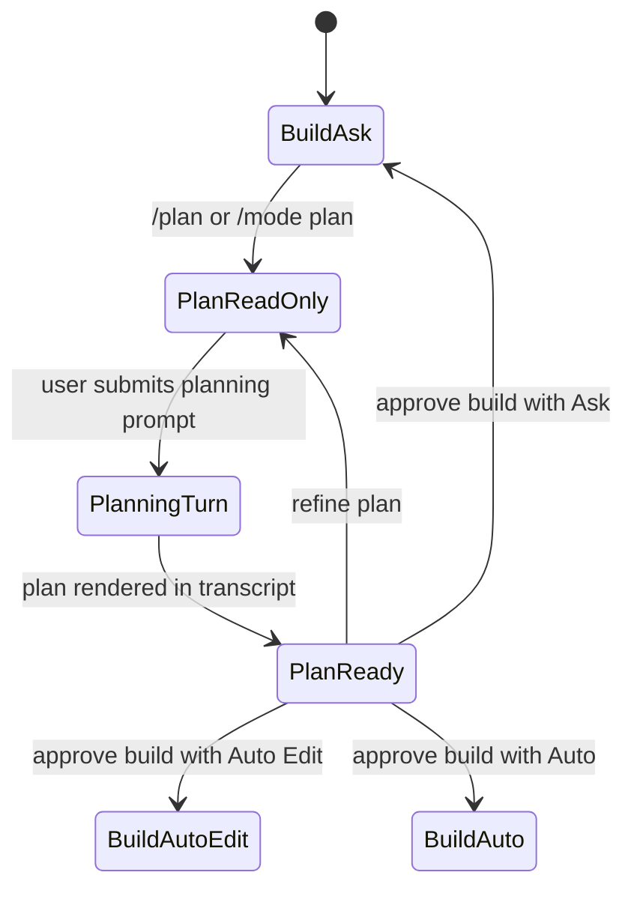
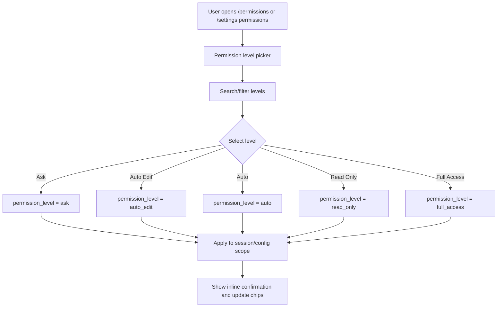

# Permission Level Design

Chinese version: [permission-mode-design.zh-CN.md](permission-mode-design.zh-CN.md)

Last updated: 2026-06-09

> This file keeps the historical name `permission-mode-design.md` for links.
> The product concept is now **Permission Level**. The upper-level mode model is
> defined in [Mode System Design](mode-system-design.md).

## Purpose

RoboCode previously mixed work intent, approval behavior, and safety boundaries
under one "permission mode" concept. The target model separates them:

- **Work Mode** says what RoboCode is doing: `build`, `plan`, later `review`
  and `explore`.
- **Permission Level** says what RoboCode may do automatically.

Plan is no longer a normal permission option. Plan means
`work_mode=plan` + `permission_level=read_only` + planner provider prompts.

## Canonical Permission Levels

| Permission Level | UI label | Intended use | Reads | File edits | Shell/Git mutation | Approval behavior |
| --- | --- | --- | --- | --- | --- | --- |
| `ask` | Ask | Default daily coding safety | Allow | Ask | Ask | Ask before mutations |
| `auto_edit` | Auto Edit | Let RoboCode patch files while commands stay gated | Allow | Allow | Ask | Ask before shell/Git/other side effects |
| `auto` | Auto | Let routine in-workspace edits and commands proceed | Allow | Allow | Allow when classified safe/in scope | Ask or deny out-of-scope, network, destructive, or unknown actions |
| `read_only` | Read Only | Audit, planning, review, and exploration | Allow | Deny | Deny | Deny mutations without asking |
| `full_access` | Full Access | High-trust local automation | Allow | Allow | Allow in safety scope | No prompt for normal in-scope mutations |

`locked` is not a primary user-facing level. If needed, keep it as an internal
incident-recovery or managed-policy state.

Current `0.1` UI exposure is intentionally smaller: `/permissions` and
`/settings permissions` show `ask`, `auto_edit`, `read_only`, and
`full_access`. `auto` remains a target level until the runtime permission engine
has safe routine-command classification.

## Legacy Mapping

The Rust enum `PermissionMode` remains as a migration compatibility layer.

| Legacy value / alias | Canonical permission level | Notes |
| --- | --- | --- |
| `default`, `suggest` | `ask` | Main safe default. |
| `acceptEdits`, `accept_edits` | `auto_edit` | File-edit automation. |
| `bypassPermissions`, `bypass_permissions` | `full_access` | Trusted local automation. |
| `dontAsk`, `dont_ask` | `full_access` | Legacy behavior was "do not ask"; avoid this label in new UI. |
| `plan` | `read_only` plus `work_mode=plan` | Compatibility only; new UI should route through `/mode plan` or `/plan`. |

New docs, help, command palette copy, and TUI chrome should use the canonical
permission-level names. Legacy names remain accepted by parsers so existing
configs and scripts do not break.

## Behavior Matrix

| Operation | Ask | Auto Edit | Auto | Read Only | Full Access |
| --- | --- | --- | --- | --- | --- |
| Read file/search/list | Allow | Allow | Allow | Allow | Allow |
| Write/edit file | Ask | Allow | Allow in workspace | Deny | Allow in scope |
| Delete file | Ask | Ask | Ask or deny when risky | Deny | Allow in scope unless destructive |
| Shell read-only command | Ask or allow when classified safe | Ask or allow when classified safe | Allow when classified safe | Allow only when known read-only | Allow in scope |
| Shell mutating command | Ask | Ask | Allow in workspace when safe; otherwise ask/deny | Deny | Allow in scope |
| Git status/diff/log | Allow | Allow | Allow | Allow | Allow |
| Git add/commit/branch/stash | Ask | Ask | Allow when in scope and safe; otherwise ask | Deny | Allow in scope |
| Network/web read | Allow | Allow | Ask when external/network policy requires it | Allow for read-only fetch/search | Allow in scope |
| Provider/model config edit | Ask | Ask | Ask | Ask only inside explicit settings flow | Allow |
| Task/memory mutation | Ask | Ask | Ask or allow only when policy marks safe | Deny | Allow |

When shell command classification is uncertain, treat it as mutating or
unknown and choose ask/deny according to the current level.

## Plan Relationship

Plan is a work mode, not a permission level:



Plan output should cover requirements, architecture, implementation approach,
test strategy, tasks, risks, and open questions. It must not write code, modify
files, run mutating tools, mutate Git, mutate project memory/tasks, or claim
implementation is complete.

## TUI Labels

Top bar:

```text
[WORK Build] [PERM Ask]
```

Composer footer:

```text
MODE [Build] [Plan]    PERM [Ask] [AutoEdit] [Auto] [ReadOnly] [Full]
```

Compact width:

```text
Build · Ask
```

Do not use `APPROVAL MODE`. Approval is one possible outcome of permission
evaluation, not the whole model.

## Permission Picker Flow



The picker should be a direct manipulation panel, not merely command
completion. Enter applies the highlighted level immediately. Esc closes without
changing anything.

## Command Surface

Canonical commands:

```text
/permissions
/permissions ask
/permissions auto_edit
/permissions read_only
/permissions full_access
/settings permissions ask
```

Target command after Auto is wired:

```text
/permissions auto
```

Work mode commands stay separate:

```text
/mode
/mode build
/mode plan
/plan
/plan on
/plan off
```

## Copy Guidelines

- Ask: "Ask before mutations."
- Auto Edit: "Edit files automatically; ask before commands."
- Auto: "Run routine in-workspace edits and commands; ask for risky actions."
- Read Only: "Read only; mutations are blocked."
- Full Access: "Run in-scope local changes without prompts."

Confirmation examples:

```text
Permission level set to Ask - RoboCode will ask before mutations.
Permission level set to Auto Edit - file edits can apply without approval.
Permission level set to Auto - routine in-workspace actions can run when safe.
Permission level set to Read Only - mutations are blocked.
Permission level set to Full Access - in-scope local changes can run without prompts.
```

## Implementation Notes

1. Keep `PermissionMode` as a compatibility enum until config migration is done.
2. Pass both `work_mode` and `permission_level` in provider requests.
3. Filter provider-visible tools using both fields.
4. Enforce mutation gates at runtime even if a provider emits a disallowed tool.
5. Show both `Work Mode` and `Permission Level` in `/status`, top bar, composer,
   picker, and transcript system events.
6. Keep legacy CLI aliases accepted, but do not show them as primary UI choices.

## Acceptance Criteria

- `/permissions` shows permission levels only; it does not contain Plan as a
  normal permission option.
- `/mode` shows work modes only; provider/model selection is not a mode.
- `/plan` is a shortcut to Plan work mode plus Read Only permission level.
- User-facing TUI copy uses `MODE` and `PERM`, not `APPROVAL MODE`.
- Plan provider prompts, tool schema filtering, and runtime mutation gates all
  prevent code-writing and other mutating actions.
