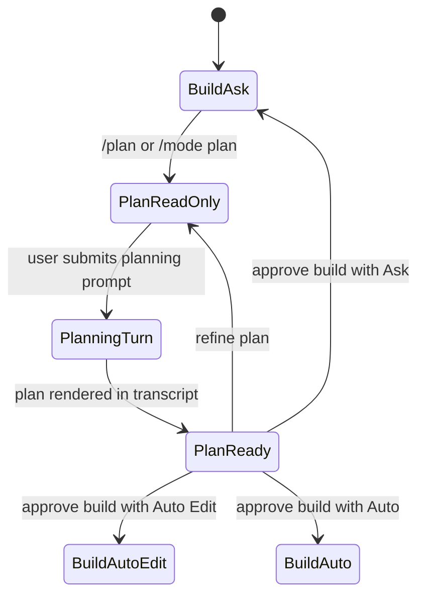
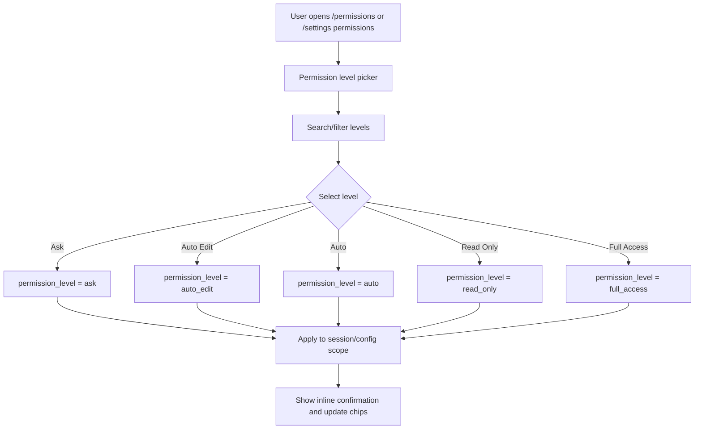

# Permission Level 设计

English version: [permission-mode-design.md](permission-mode-design.md)

最后更新：2026-06-09

> 本文件保留历史文件名 `permission-mode-design.zh-CN.md`，用于兼容已有链接。
> 当前产品概念已经改成 **Permission Level**。上层模式系统见
> [Mode System 设计](mode-system-design.zh-CN.md)。

## 目的

RoboCode 之前把 work intent、approval 行为和安全边界都混在一个 “permission mode”
概念里。目标模型拆成两层：

- **Work Mode** 表示 RoboCode 正在做什么：`build`、`plan`，后续可以扩展
  `review`、`explore`。
- **Permission Level** 表示 RoboCode 可以自动做多少事。

Plan 不再是普通 permission option。Plan 表示
`work_mode=plan` + `permission_level=read_only` + planner provider prompt。

## Canonical Permission Levels

| Permission Level | UI 标签 | 使用意图 | 读取 | 文件编辑 | Shell/Git mutation | Approval 行为 |
| --- | --- | --- | --- | --- | --- | --- |
| `ask` | Ask | 默认日常编码安全档 | Allow | Ask | Ask | mutation 前询问 |
| `auto_edit` | Auto Edit | 允许 RoboCode 自动 patch 文件，但命令仍受控 | Allow | Allow | Ask | shell/Git/其他副作用前询问 |
| `auto` | Auto | 允许常规工作区内编辑和命令自动执行 | Allow | Allow | 安全/范围内 Allow | 越界、网络、危险或未知 action 询问或拒绝 |
| `read_only` | Read Only | 审计、规划、评审、探索 | Allow | Deny | Deny | mutation 直接拒绝，不询问 |
| `full_access` | Full Access | 高信任本地自动化 | Allow | Allow | 安全范围内 Allow | 常规范围内 mutation 不提示 |

`locked` 不作为用户主 permission level 展示。如有需要，仅作为事故恢复或 managed policy
的内部状态。

当前 `0.1` UI 暴露范围刻意更小：`/permissions` 和 `/settings permissions` 只展示
`ask`、`auto_edit`、`read_only`、`full_access`。`auto` 等 runtime permission engine
具备安全的 routine-command classification 后再开放。

## 旧名称映射

Rust enum `PermissionMode` 暂时保留为迁移兼容层。

| Legacy value / alias | Canonical permission level | 说明 |
| --- | --- | --- |
| `default`、`suggest` | `ask` | 主安全默认值。 |
| `acceptEdits`、`accept_edits` | `auto_edit` | 文件编辑自动化。 |
| `bypassPermissions`、`bypass_permissions` | `full_access` | 可信本地自动化。 |
| `dontAsk`、`dont_ask` | `full_access` | 旧行为是“不询问”；新 UI 不再展示这个 label。 |
| `plan` | `read_only` 加 `work_mode=plan` | 仅兼容；新 UI 应通过 `/mode plan` 或 `/plan` 进入。 |

新文档、help、command palette 文案和 TUI chrome 都应使用 canonical permission-level
名称。旧名称继续被 parser 接受，避免破坏已有配置和脚本。

## 行为矩阵

| Operation | Ask | Auto Edit | Auto | Read Only | Full Access |
| --- | --- | --- | --- | --- | --- |
| 读文件/搜索/list | Allow | Allow | Allow | Allow | Allow |
| 写/编辑文件 | Ask | Allow | 工作区内 Allow | Deny | 范围内 Allow |
| 删除文件 | Ask | Ask | 风险场景 Ask 或 Deny | Deny | 范围内 Allow，破坏性操作例外 |
| Shell 只读命令 | 安全分类后 Ask 或 Allow | 安全分类后 Ask 或 Allow | 安全分类后 Allow | 仅明确只读时 Allow | 范围内 Allow |
| Shell mutation 命令 | Ask | Ask | 工作区内安全时 Allow，否则 Ask/Deny | Deny | 范围内 Allow |
| Git status/diff/log | Allow | Allow | Allow | Allow | Allow |
| Git add/commit/branch/stash | Ask | Ask | 安全且范围内 Allow，否则 Ask | Deny | 范围内 Allow |
| Network/web read | Allow | Allow | 外部/网络策略要求时 Ask | 只读 fetch/search Allow | 范围内 Allow |
| Provider/model config edit | Ask | Ask | Ask | 仅显式 settings flow 内 Ask | Allow |
| Task/memory mutation | Ask | Ask | 策略标记安全时 Allow，否则 Ask | Deny | Allow |

Shell command 无法可靠分类时，按 mutating 或 unknown 处理，并根据当前 level 选择
Ask/Deny。

## Plan 关系

Plan 是 Work Mode，不是 Permission Level：



Plan 输出应覆盖需求、架构、实现方案、测试策略、任务、风险和开放问题。它不能写代码、
修改文件、运行 mutating tool、修改 Git、修改项目 memory/task，也不能宣称实现已完成。

## TUI 标签

顶栏：

```text
[WORK Build] [PERM Ask]
```

Composer footer：

```text
MODE [Build] [Plan]    PERM [Ask] [AutoEdit] [Auto] [ReadOnly] [Full]
```

窄屏：

```text
Build · Ask
```

不要使用 `APPROVAL MODE`。Approval 只是 permission evaluation 的一种结果，不是完整模型。

## Permission Picker 流程



Picker 应该是直接操作 panel，而不是只做 command completion。Enter 立即应用高亮 level，
Esc 关闭且不修改。

## Command Surface

Canonical commands：

```text
/permissions
/permissions ask
/permissions auto_edit
/permissions read_only
/permissions full_access
/settings permissions ask
```

Auto 接入后的目标命令：

```text
/permissions auto
```

Work mode commands 保持独立：

```text
/mode
/mode build
/mode plan
/plan
/plan on
/plan off
```

## Copy Guidelines

- Ask：mutation 前询问。
- Auto Edit：自动编辑文件；命令前询问。
- Auto：运行常规工作区内编辑和命令；风险 action 前询问。
- Read Only：只读；mutation 被阻止。
- Full Access：范围内本地变更无需提示即可执行。

确认文案示例：

```text
Permission level set to Ask - RoboCode will ask before mutations.
Permission level set to Auto Edit - file edits can apply without approval.
Permission level set to Auto - routine in-workspace actions can run when safe.
Permission level set to Read Only - mutations are blocked.
Permission level set to Full Access - in-scope local changes can run without prompts.
```

## 实现说明

1. `PermissionMode` 保持为兼容 enum，直到 config migration 完成。
2. Provider request 同时携带 `work_mode` 和 `permission_level`。
3. Provider-visible tools 由这两个字段共同过滤。
4. 即使 provider emit 了不允许的 tool，runtime mutation gate 仍必须拦截。
5. `/status`、顶栏、composer、picker、transcript system event 都展示 `Work Mode` 和
   `Permission Level`。
6. 旧 CLI alias 继续接受，但不作为主 UI 选项展示。

## 验收标准

- `/permissions` 只展示 permission levels；Plan 不再作为普通 permission option 出现。
- `/mode` 只展示 work modes；provider/model 选择不属于 mode。
- `/plan` 是进入 Plan work mode 加 Read Only permission level 的快捷入口。
- 用户可见 TUI 文案使用 `MODE` 和 `PERM`，不使用 `APPROVAL MODE`。
- Plan provider prompt、tool schema filter、runtime mutation gate 三层都阻止写代码和其他
  mutating action。
