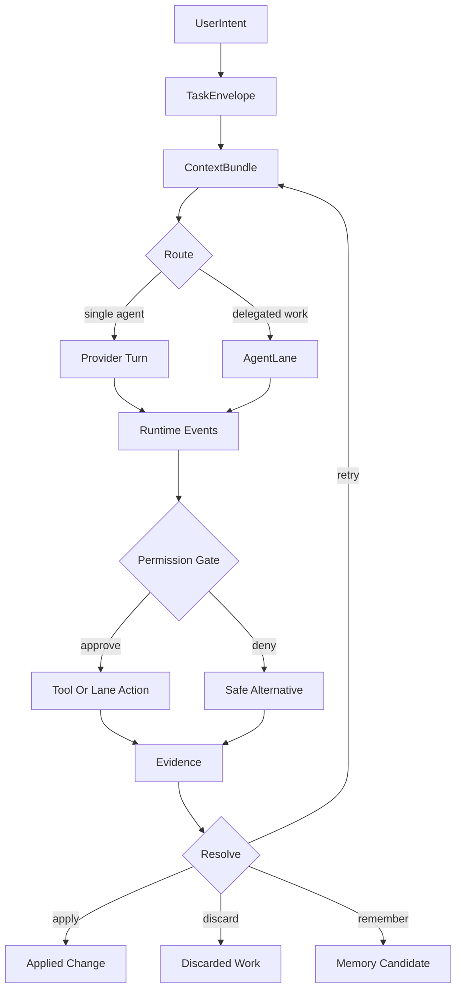
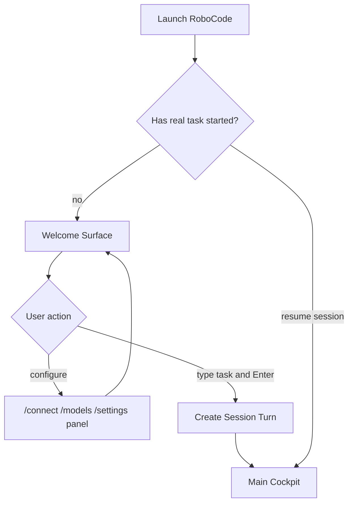
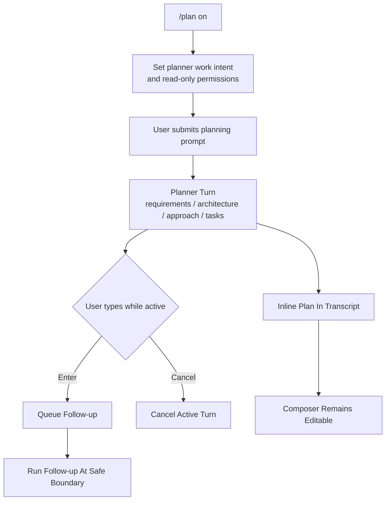
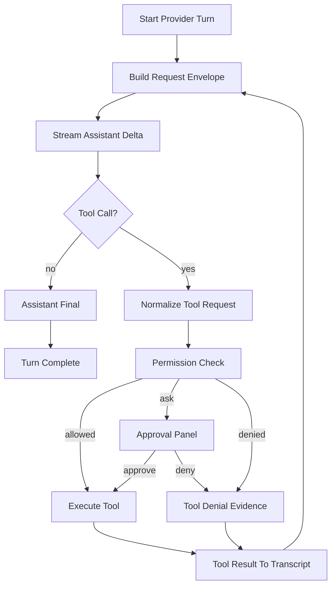
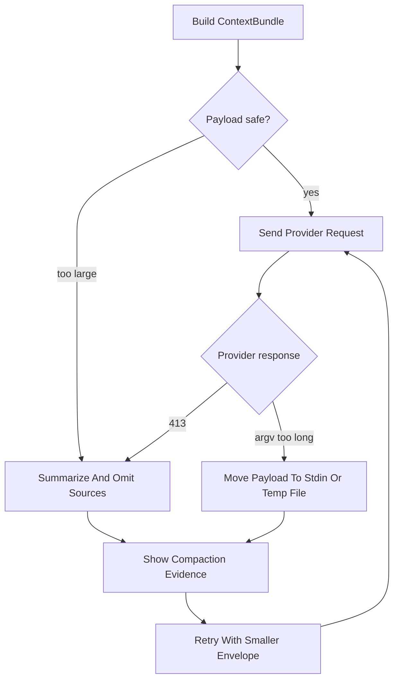
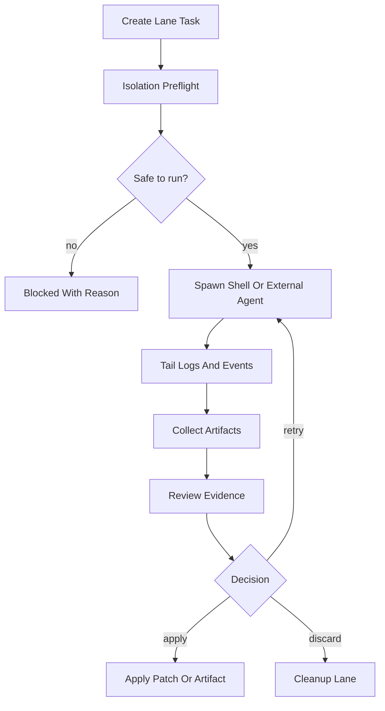
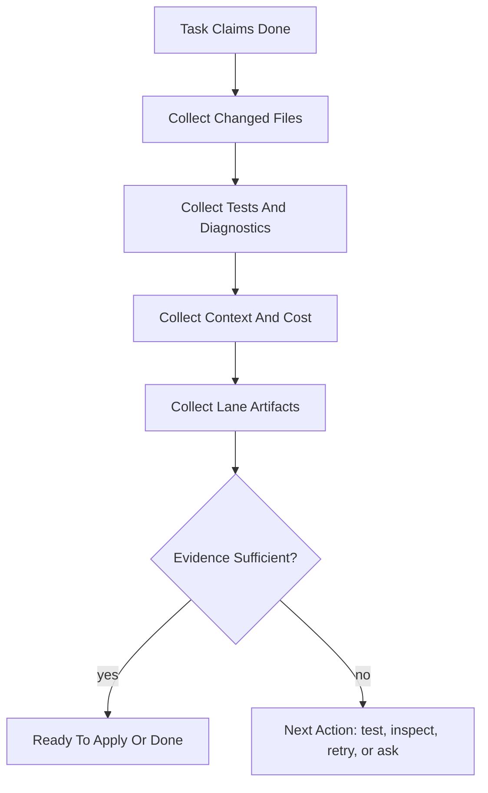
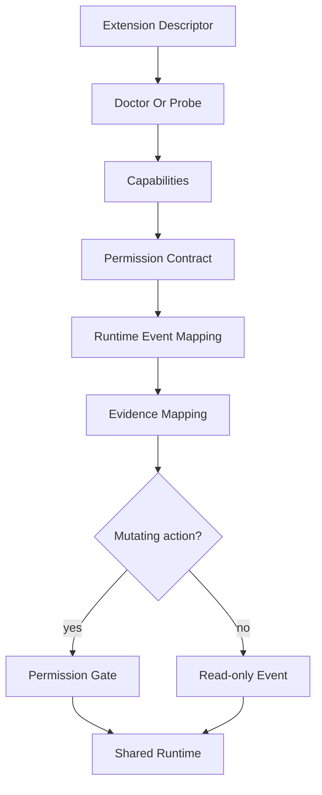

# Viden Product Design: Agent Coding Operator Loop

Chinese version: [product-design-operator-loop.zh-CN.md](product-design-operator-loop.zh-CN.md)

Last updated: 2026-06-26

## Purpose

This document resets Viden's product design around one durable idea:

> Viden is a local-first coding operator cockpit. It helps a developer run,
> supervise, review, and reuse AI coding work across providers, terminal tools,
> external agents, plugins, skills, MCP servers, future ACP adapters, and
> TUI / GUI operator surfaces.

The TUI is the first product surface, not the final product boundary. Future GUI
surfaces must consume the same runtime. The core product is the operator loop:
a structured way to turn a coding intent into bounded agent work, evidence,
decisions, and reusable context.

This document is not a single release plan. It is the product contract that
future versions should implement in slices.

Implementation companion: [production-coding-loop-architecture.md](production-coding-loop-architecture.md).

Design source: `docs/viden-design/Viden/` is the accepted Viden source for
TUI/GUI visual direction, tokens, and target screenshots. RoboCode remains a
legacy implementation name until migration is planned.

## Source Basis

This design consolidates the current repository and prior design notes:

- `README.md`
- `docs/long-term-roadmap.md`
- `docs/staged-roadmap.md`
- `docs/tui-cockpit-design.md`
- `docs/gui-version-functional-design.md`
- `docs/mode-system-design.md`
- `docs/tui-interaction-flow-design.md`
- `docs/permission-mode-design.md`
- `docs/code-agent-hn-demand-radar-2026-05-28.md`
- `docs/code-agent-experience-benchmark-2026-05-25.md`
- `docs/context-bundle-token-efficiency.md`
- `docs/provider-adapter-design.md`
- `docs/ref-gap-matrix.md`
- `docs/tui-interaction-audit-2026-05-29.md`
- `docs/viden-design-adoption.md`
- `docs/viden-design/Viden/docs/DESIGN-REF.md`
- `docs/viden-design/Viden/tokens.css`
- `viden-runtime/src/runtime_loop.rs`
- `viden-cli/src/tui/app.rs`
- `viden-cli/src/tui/transcript.rs`
- `viden-cli/src/tui/lane.rs`

## Product Diagnosis

RoboCode has a strong architectural spine: local tools, permission-aware
mutation, transcripts, provider abstraction, LSP, tasks, memory, TUI cockpit
work, provider/model setup, and delegated lane primitives.

The main product gap is not one missing command. The gap is operator confidence:

- The UI still sometimes feels like a provider chat client instead of a
  RoboCode-controlled coding mission.
- Live status can leak provider names and repeat weak text such as
  "is thinking" instead of explaining the current work phase.
- Config flows have improved, but any provider/model/settings page that behaves
  like command completion or static status is still the wrong interaction
  model.
- The active turn should not block the user from typing. Follow-up input should
  be queued or staged visibly.
- Transcript streaming, scrollback, resize, and active-turn redraw must feel
  boringly reliable before more automation is useful.
- Side screens must become evidence and control surfaces, not dashboards.
- Context pressure, 413 errors, and "argument list too long" failures show that
  token efficiency must be a first-class user experience.

The product should therefore move from "ask a model" to "operate a coding
mission." The TUI / GUI direction further sharpens that into:

- lane is the primary user-facing unit of supervision and is semantically equal
  to session;
- workspace / project / lane / subagent is the shared navigation hierarchy
  across TUI and GUI;
- reviewed design tokens and selector-first interaction are the basis for UI
  consistency once a visual source is accepted;
- approval gates, context/cost, evidence, and environment facts must be visible
  in the main surfaces instead of buried in logs.

## Current Implementation Map

| Area | Current state | Product gap |
| --- | --- | --- |
| Core loop | `SessionEngine` already routes provider turns, tool calls, permissions, transcript writes, and runtime task snapshots through shared paths. | Streaming, cancellation, context compaction, error recovery, and active-turn queueing need to feel unified to the user. |
| TUI | Welcome screen, cockpit layout, transcript, right rail, provider/model panels, command suggestions, approvals, and lanes exist. | Input focus, status language, scrollback, resize, direct-edit panels, and side-screen action depth still need hardening. |
| Provider/model runtime | Provider descriptors, DeepSeek default, many OpenAI-compatible descriptors, provider health, and `/connect`/`/models` work are present. | Setup needs true focused forms: key edit/delete, auth mode differences, endpoint edit, doctor, active model selection, and save/cancel. |
| Agent lanes | Shell/template lanes, tmux, Codex/Claude commands, lane inspect/apply/discard/retry primitives exist. | Lanes need richer timelines, isolation preflight, changed-file evidence, budget limits, and side-1/side-2 control surfaces. |
| Context | ContextBundle design exists and has been wired into lane envelope work. | Users need pin/omit/split controls, visible source ranking, provider prompt compaction, and automatic recovery from 413/argv-too-long failures. |
| Evidence | Permissions, transcripts, diagnostics, file tools, tests, screenshots, and release smoke checks already exist in pieces. | Completion needs a unified evidence drawer and release rule: every visible feature gets real-use proof, not only static previews. |
| Extensions | Provider plugin direction exists. MCP, skills, hooks, and ACP are planned. | All extensions need one descriptor/capability/doctor/evidence/permission contract before mutating runtime access expands. |
| Visual design inputs | Future TUI/GUI design imports are useful only after review. | Product specs and release gates must not depend on discarded design imports; accepted design sources need screenshot baselines and explicit deviation records. |

## Competitive Interaction References

Borrow the product lessons, not the whole implementation:

- **Claude Code**: clear terminal loop, varied activity language, permissions,
  hooks, MCP, and subagents. Viden should copy the clarity and automation
  boundaries, not hide work in invisible agents.
- **Codex**: strong diff/review expectations and delegated task completion.
  Viden should make Codex a first-class supervised lane.
- **OpenCode / Kilo**: provider and model selection feel like direct
  manipulation panels. Viden should match that interaction quality while
  keeping provider connection and model switching separate.
- **Zed**: parallel agents, external agents, and editor context show where ACP
  and lane isolation should go. Viden should provide the terminal operator
  version rather than trying to become an editor.
- **Kiro**: specs, steering files, and hooks show why plan/spec/context must
  become product objects, not just text in a transcript.
- **DeepSeek-TUI**: dense terminal-native provider visibility is valuable, but
  Viden should only keep panels backed by real runtime facts.

## North Star

Viden should let the user answer these questions at any moment:

- What is RoboCode doing right now?
- Which agent or lane is responsible?
- What context did it use?
- What changed?
- What command or test ran?
- What evidence supports the result?
- What is blocked or risky?
- What is the next safe action?
- How much context, token budget, and cost were used?

Every visible feature should help answer at least one of those questions.

## Product Principles

- **Viden is the actor.** Providers are infrastructure. The UI should say
  "Viden working", "Builder is editing", or "Tester is running tests", not
  default to "DeepSeek is thinking."
- **Configuration is direct manipulation.** Provider, model, permission, and
  theme surfaces should be searchable panels where selection or editing applies
  directly. They should not make users guess which command to type next.
- **Streaming is the default.** Model output should appear as it arrives. The
  transcript must preserve history and auto-follow only when the user is at the
  bottom.
- **Input stays alive.** While work is active, the composer should remain usable
  for queued follow-ups, cancellation, notes, or steering.
- **No decorative panels.** Right rail and side screens must read from real
  runtime facts or say unavailable.
- **Evidence before trust.** A task is not complete just because an agent says
  so. Diff, test, diagnostic, lane, and approval evidence must be inspectable.
- **Context is product UX.** Sources, omissions, compaction, pressure, and token
  budgets are visible operator decisions.
- **Secrets are handles, not content.** API keys and credentials should never
  enter transcripts, screenshots, model context, or lane envelopes as raw values.
- **TUI first, runtime reusable.** The runtime should later support CLI
  automation, IDE/ACP, desktop, and web surfaces without replacing the core
  operator loop.
- **Visual design is not a second product runtime.** GUI/TUI can share accepted
  tokens, component language, and visual hierarchy, but task, approval,
  context, cost, lane, and evidence state must come from runtime.
- **Lane equals session.** The primary user-facing work unit is lane. A
  workspace can contain projects, a project or workspace can own lanes, and a
  lane can own subagents.
- **Visual fidelity is a release condition only for accepted targets.** TUI
  previews and GUI screenshot baselines must turn accepted visual targets into
  testable contracts; differences need accepted-deviation records.

## Core Operator Loop

| Phase | User question | System object | Primary UI | Output |
| --- | --- | --- | --- | --- |
| 1. Intake | What do I want RoboCode to do? | `UserIntent` | Welcome composer or cockpit composer | Captured task |
| 2. Shape | Is this chat, planning, edit, test, review, or delegation? | `TaskEnvelope` | Inline plan/status row | Mode and route |
| 3. Context | What will the agent see and what was omitted? | `ContextBundle` | Context pressure row and side-2 detail | Bundle, budget, compaction notes |
| 4. Dispatch | Who should do the work? | `AgentTask`, `AgentLane`, `LaneSession` | LIVE WORK, lane list, Agent Board | Active work item |
| 5. Execute | What is happening live? | Runtime events | Streaming transcript and lane tail | Partial response, tool calls, logs |
| 6. Gate | Is this action safe? | `PermissionRequest`, `Decision` | Decision center or four-level approval gate | Approve, deny, inspect, retry |
| 7. Verify | What changed and did it pass? | `Evidence`, `Artifact` | Diff/test/evidence panels | Reviewable proof |
| 8. Resolve | Should this be applied, discarded, retried, or remembered? | `NextAction`, `MemoryCandidate` | Action panel | Applied change, discarded lane, retry, memory/task update |

### Key Flow Diagrams

Every key flow must be explainable as a diagram. If a flow has no diagram, the
system objects, async boundary, or operator decision point is probably still
unclear.

#### Operator Loop Overview



#### Welcome To Real Session



Configuration panels should not start the cockpit. A real task, resume, or
explicit history action starts the work session.

#### Plan Mode Workflow



`/plan` changes both planner work intent and permission policy: RoboCode plans
product requirements, architecture, implementation approach, test strategy, and
development steps, without writing code, modifying files, or persisting the
plan. It must not change the input concurrency model. After a plan finishes, the
composer must stay editable.

#### Provider Turn And Tool Loop



#### Context Recovery Flow



#### Delegated Lane Flow



#### Evidence Review And Completion



#### Extension Onboarding Flow



## Shared Runtime Objects

The product needs one shared fact layer. No provider, lane, MCP tool, plugin,
or future ACP adapter should invent its own parallel state model.

Core objects:

- `AgentTask`: one unit of user-visible work.
- `AgentLane`: a delegated execution surface such as shell, Codex, Claude, tmux,
  template runner, or future ACP agent.
- `ContextBundle`: task-specific context with sources, token estimate, budget,
  compaction notes, and omitted-source reasons.
- `Evidence`: diff, command output, diagnostics, artifacts, screenshots, logs,
  and review notes.
- `Artifact`: files, reports, patches, test logs, screenshots, summaries, and
  release assets.
- `Decision`: user or system action such as approve, deny, apply, discard,
  retry, stop, or archive.
- `Budget`: turn, lane, provider, cost, token, and time limits.
- `CredentialHandle`: a safe reference to a secret or auth method.

Recommended `AgentTask` state family:

- `queued`
- `scoping`
- `building_context`
- `running`
- `streaming`
- `waiting_for_approval`
- `running_tool`
- `running_tests`
- `reviewing`
- `ready_to_apply`
- `done`
- `blocked`
- `failed`
- `cancelled`

## Coding Workflow Design

### Small Change Flow

For narrow edits, Viden should use a single-agent loop:

1. Capture the user request.
2. Build a compact ContextBundle from current files, diagnostics, and recent
   transcript.
3. Stream the assistant response.
4. Request permission for mutation.
5. Execute file/shell/Git tools through the shared runtime.
6. Show changed files, test evidence, and final next action.

### Medium Change Flow

For multi-file work, Viden should introduce a lightweight checkpoint:

1. Summarize intent and acceptance criteria.
2. Show a short plan or ask one clarifying question when needed.
3. Execute in small tool batches.
4. Run focused tests.
5. Show diff and risk summary before completion.

### Large Change Flow

For broader implementation, Viden should use a spec-driven operator loop:

1. Create a task envelope with requirements, constraints, design decisions,
   test expectations, and known risks.
2. Build a ContextBundle with source priorities.
3. Dispatch one or more lanes: planner, builder, reviewer, tester, or external
   coding agents.
4. Keep lane evidence visible in side-1 and side-2.
5. Merge only after review/apply decisions.

`/plan` should produce an inline plan in the transcript and keep the composer
usable. It should not write files or lock the UI after the plan completes.

## Welcome And First-Run Experience

Viden should default into TUI mode and show a calm welcome surface until a
real coding conversation starts.

Welcome requirements:

- Show RoboCode identity, current working directory, Git branch, configured
  provider/model, and concise action hints.
- Keep the central composer focused.
- `/connect`, `/provider`, `/models`, `/setup`, `/permissions`, and `/theme`
  overlays should not start a session by themselves.
- After changing configuration, return to the welcome surface when no real task
  has started.
- Do not auto-open setup just because a key is missing. Offer `/connect` and
  let the user choose.
- Command suggestions should attach to the composer, above or below it, never
  far away at the screen bottom.

The welcome screen should feel like an operator console waiting for intent, not
a splash screen.

## Main Cockpit

After a real task begins, the cockpit should be organized around work:

- Top bar: product, session, Git branch, permission mode, active lanes, context
  pressure, provider/model summary.
- Transcript: dominant left area with streamed conversation, tool events, and
  durable history.
- Inline activity: a prominent `LIVE WORK` strip directly after the latest
  visible conversation content, not as a detached center card.
- Right rail: workspace, active tasks, diagnostics, provider health, recent
  files, and budgets only when real data exists.
- Composer: taller, visible cursor, stable IME placement, queued follow-up
  support.
- Bottom bar: connection/session/events/lanes/context/help.
- Side-1: lane console and delegated agent timeline.
- Side-2: evidence, context, diagnostics, provider ops, hooks, and extension
  probes.

## Live Status And Animation

The old one-line "is thinking" pattern is too weak. Viden should render
activity as a compact `LIVE WORK` strip with varied phase language, evidence
signals, and next-action guidance.

Guidelines:

- Use RoboCode role names: `Operator`, `Planner`, `Context Builder`,
  `Builder`, `Reviewer`, `Tester`, `Lane Supervisor`, `Release Captain`.
- Avoid provider names unless the user is looking at provider health or a
  provider-specific error.
- Do not show fake progress percentages for provider thinking; show real phase,
  signal, elapsed, and next-action details instead.
- Do not show fake progress percentages. Use percent only when backed by real
  progress.
- Use the `LIVE WORK` strip with a pulse/spinner glyph plus changing text, not a
  large blocking card.
- Show elapsed time, latest event, queue count, and next action when available.

Example phrases:

- `Viden is mapping the request`
- `Planner is shaping the task`
- `Context Builder is trimming logs`
- `Builder is editing src/render.rs`
- `Tester is running cargo test`
- `Reviewer is checking diff evidence`
- `Operator is waiting for approval`
- `Lane Supervisor is watching codex lane`
- `Viden is reducing context after a 413 response`

For long-running work, the transcript should show a live row under the latest
conversation entry:

```text
✦ Planner is shaping the task · elapsed 18s · context 42k / 128k · queued 1
```

## Input, Streaming, And History

The composer is part of the operator loop, not just a prompt box.

Requirements:

- The cursor must be visible and blinking in supported terminals.
- During an active provider turn, normal input should stage a follow-up instead
  of freezing the UI.
- `Enter` can queue the follow-up, while explicit shortcuts can cancel,
  regenerate, or interrupt.
- Stream assistant content as chunks arrive.
- Preserve transcript scrollback.
- Mouse wheel, PageUp/PageDown, Home/End, and keyboard navigation should inspect
  history without being yanked back to the bottom.
- Auto-follow resumes only when the user scrolls to the latest content or sends
  a new message.
- Resize must redraw from current layout state, not leave stale borders or
  right-rail drift.

## Provider And Model Configuration

Viden should borrow the interaction quality of OpenCode-style panels while
keeping RoboCode's own provider semantics.

### `/connect`

`/connect` is the provider connection flow. It should show providers only:

- DeepSeek
- OpenAI
- Anthropic
- OpenRouter
- DashScope
- Groq
- Mistral
- Kimi
- Qwen
- Ollama
- other supported suppliers

Selecting a provider enters a focused setup flow:

1. Auth method: API key, web login, local endpoint, or no key.
2. Credential entry or login guidance.
3. Endpoint/base URL, when configurable.
4. Connection doctor.
5. Default model selection.
6. Active models selection.
7. Save, use now, or cancel.

Secrets are displayed as short prefix + masked middle + suffix. RoboCode stores
or references credential handles, not raw secret text in transcript or model
context.

### `/models`

`/models` is a provider-grouped model picker. It should:

- show only configured providers and activated model rows;
- group rows by provider with indentation;
- show favorites at the top without duplicates;
- show recent models below favorites;
- render the provider name after the model in dim text;
- switch provider/model immediately on `Enter`;
- support favorite/unfavorite without duplicating rows;
- keep unconfigured provider descriptor defaults out of the picker.

### `/provider`

`/provider` is diagnostics and status:

- current provider/model;
- auth status;
- endpoint;
- request counts;
- latency;
- latest error;
- model availability;
- suggested recovery.

It is not the primary model selection UI.

## Error Recovery

Provider errors should be classified into actionable recovery states:

- Missing key: open `/connect` for that provider.
- Model unavailable: open `/models` with compatible configured choices.
- Context too large or HTTP 413: compact ContextBundle, show omitted sources,
  and offer retry with a smaller bundle.
- `Argument list too long`: stop passing large context through argv, move large
  payloads into temp files or stdin, and retry safely.
- Path is a directory: show the path and expected file action.
- Rate limited: show wait time and model/provider alternatives.
- Tool replay mismatch: repair provider/tool-call history before retry.

Errors should appear inline in the transcript and side-2 evidence, not as a
surprising center modal unless user action is required.

## Evidence And Review

Completion requires evidence.

Evidence surfaces should include:

- changed files;
- diff summary and risky hunks;
- command and test results;
- diagnostics;
- provider request/response metadata;
- permission decisions;
- lane timelines;
- artifacts;
- screenshots for visual UI work;
- token and cost summary when available.

Every lane should end with one of:

- apply;
- discard;
- retry;
- revise;
- inspect more;
- blocked with a concrete reason.

## Multi-Agent And Delegated Lanes

RoboCode's differentiation is not spawning agents. It is supervising them.

Lane requirements:

- A lane has an owner, command/template/adapter, workspace, status, tail, changed
  files, artifacts, evidence, decision, and cleanup state.
- Shell/template lanes remain the deterministic baseline.
- Codex and Claude lanes should map their status, tool use, diffs, and results
  into the same `AgentTask` and evidence model.
- Future ACP agents should behave like external LSP-style agent servers: probe,
  capabilities, session, event stream, apply/reject.
- Lanes should declare isolation needs: worktree, env, ports, caches, databases,
  services, and teardown.
- Side-1 controls lane execution. Side-2 explains whether the lane result can be
  trusted.

## Plugin, Skill, MCP, And ACP Design

RoboCode needs one extension model, not separate side channels.

Extension descriptors should define:

- identity and version;
- capabilities;
- auth needs;
- trust level;
- read/mutate boundaries;
- supported events;
- doctor/probe commands;
- permission requirements;
- evidence emitted.

MCP servers, skills, hooks, provider plugins, and ACP adapters should all emit
events into the shared runtime. Mutating operations must pass through permission
gates. Credentials should be brokered through handles.

Do not build a marketplace before local trust, evidence, and permission
contracts are stable.

## Context And Token Efficiency

Token efficiency is a core product feature.

ContextBundle should become visible and controllable:

- included sources;
- omitted sources with reason codes;
- pinned sources;
- source priority;
- diff and diagnostic slices;
- recent lane summaries;
- long-output summary plus tail;
- estimated tokens;
- soft and hard budgets;
- provider limits;
- cost estimate;
- compaction notes.

The user should be able to pin, omit, split, or retry with a smaller bundle.

## Quality And Release Bar

Every release that changes visible UX should include:

- deterministic TUI preview artifacts;
- real terminal screenshots for user-facing feature points;
- focused tests for changed runtime behavior;
- full workspace test or documented gap;
- DeepSeek-backed real coding smoke when provider behavior changes;
- token and cost summary for real provider smoke tests;
- post-publish GitHub Release and Homebrew validation for public versions.

No feature should be called complete if the visible control is not executable.

## Roadmap Shape

### Near-Term: Interaction Reliability

- Replace provider-leaking status copy with RoboCode role-based activity text.
- Keep composer input available during active turns.
- Make transcript streaming, scrollback, resize, and history stable.
- Finish provider setup forms: key edit/delete, endpoint edit, doctor, save,
  cancel, active model selection.
- Fix context-too-large and argv-too-long paths with ContextBundle compaction.
- Ensure `/plan` returns to an editable state.

### Next: Operator Loop Foundation

- Promote task envelope/spec artifacts into the product flow.
- Make ContextBundle inspectable and user-curatable.
- Make diff/test/evidence the default completion surface.
- Make side-1 lane control and side-2 evidence real action surfaces.
- Add per-lane budgets and stop conditions.

### Then: External Agent Interoperability

- Harden Codex and Claude lanes.
- Add ACP probe and event mapping.
- Add MCP/skills/hooks through descriptor, doctor, permission, and evidence
  contracts.
- Add lane isolation preflight and teardown.

### Later: New Product Surfaces

- CLI automation on top of the same runtime.
- IDE/ACP bridge.
- Desktop or web cockpit.
- Team workflow and remote execution only after local trust is mature.

## Product Bet

The winning product is not the one that makes the most autonomous promise. It
is the one that makes AI coding work observable, bounded, reviewable, reusable,
and economically predictable.

Viden should win by becoming the operator layer for that work.
