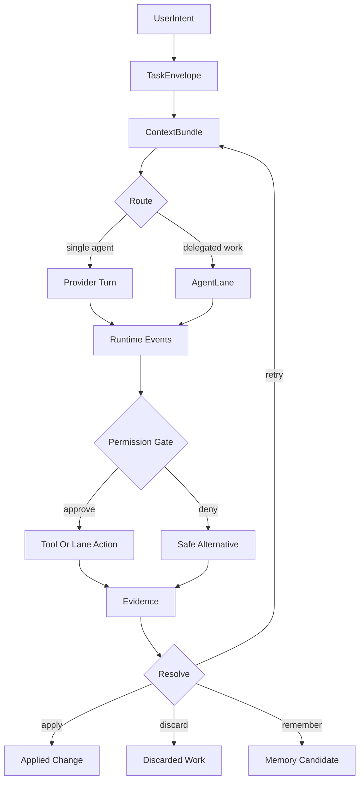
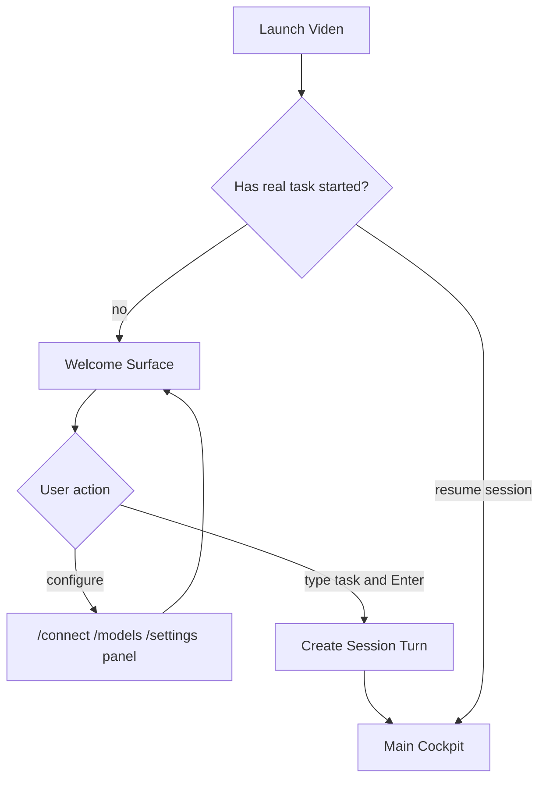
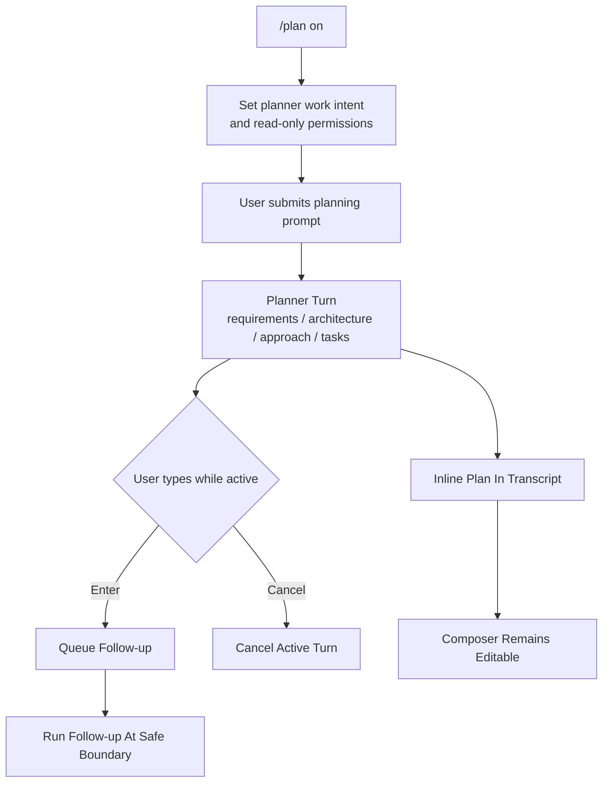
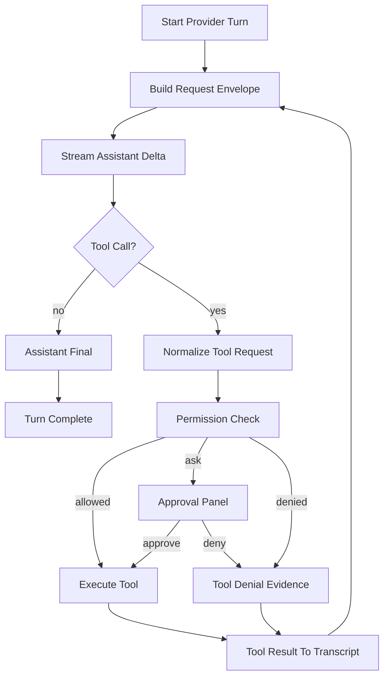
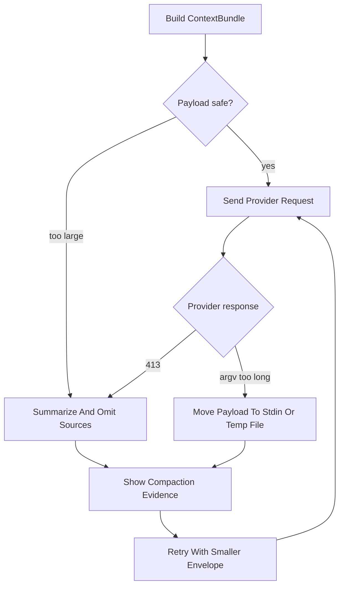
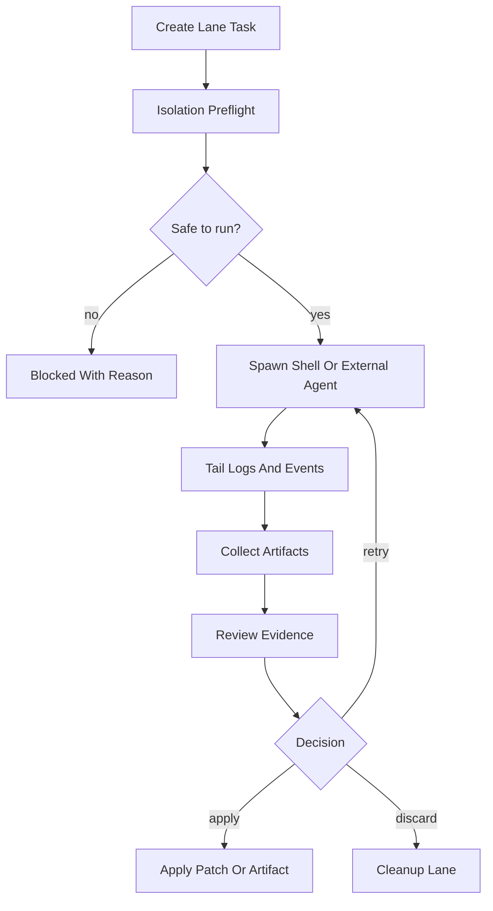
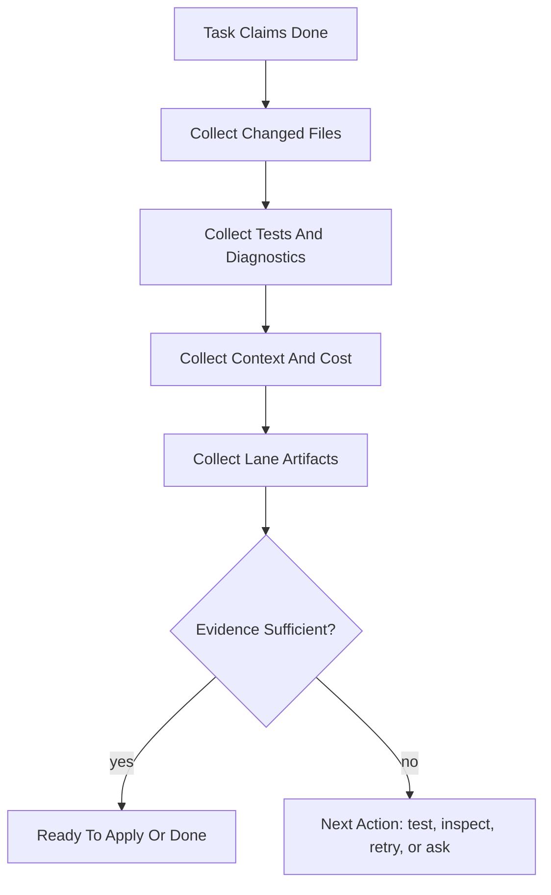
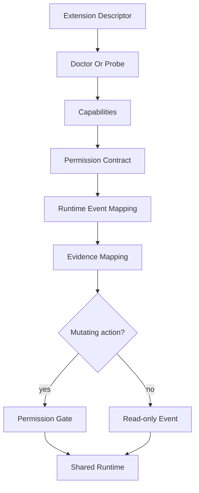

# Viden 产品设计：Agent 编码操作闭环

English version: [product-design-operator-loop.md](product-design-operator-loop.md)

最后更新：2026-06-26

## 目的

这份文档把 Viden 的产品设计重新收束到一个长期稳定的方向：

> Viden 是本地优先的 AI 编码操作 cockpit。它帮助开发者运行、监督、审查和复用
> AI 编码工作，并统一管理 providers、终端工具、外部 coding agents、plugins、skills、
> MCP servers、未来 ACP adapters，以及 TUI / GUI 操作界面。

TUI 是第一个产品形态，不是最终边界。未来 GUI surface 必须消费同一套 runtime。真正的核心
产品是 operator loop：把一个编码意图变成有边界的 agent 执行、证据、决策和可复用上下文。

这不是单个版本计划，而是后续版本分阶段实现的产品契约。

实现配套文档：[production-coding-loop-architecture.zh-CN.md](production-coding-loop-architecture.zh-CN.md)。

设计源：`docs/viden-design/Viden/` 是 TUI/GUI 视觉方向、tokens 和目标截图的接受源。
Viden 只作为 legacy implementation 名称保留，直到迁移计划明确。

## 依据

这份设计综合了当前工程和已有设计文档：

- `README.md`
- `docs/long-term-roadmap.md`
- `docs/staged-roadmap.md`
- `docs/tui-cockpit-design.md`
- `docs/gui-version-functional-design.zh-CN.md`
- `docs/mode-system-design.zh-CN.md`
- `docs/tui-interaction-flow-design.zh-CN.md`
- `docs/permission-mode-design.zh-CN.md`
- `docs/code-agent-hn-demand-radar-2026-05-28.md`
- `docs/code-agent-experience-benchmark-2026-05-25.md`
- `docs/context-bundle-token-efficiency.md`
- `docs/provider-adapter-design.md`
- `docs/ref-gap-matrix.md`
- `docs/tui-interaction-audit-2026-05-29.md`
- `docs/viden-design-adoption.zh-CN.md`
- `docs/viden-design/Viden/docs/DESIGN-REF.md`
- `docs/viden-design/Viden/tokens.css`
- `viden-runtime/src/runtime_loop.rs`
- `viden-cli/src/tui/app.rs`
- `viden-cli/src/tui/transcript.rs`
- `viden-cli/src/tui/lane.rs`

## 产品诊断

Viden 已经有不错的架构骨架：本地工具、权限前置的 mutation、transcript、provider
抽象、LSP、tasks、memory、TUI cockpit、provider/model setup 和 delegated lane
基础能力。

现在最大问题不是缺一个命令，而是用户的 operator confidence 还不够：

- UI 有时还像 provider chat client，而不是 Viden 控制的编码任务。
- live status 会泄漏 provider 心智，并反复显示弱提示，比如 `is thinking`，没有说明当前
  具体阶段。
- 配置流程已有改进，但 provider/model/settings 只要还像命令补全或静态状态页，交互心智就
  是错的。
- active turn 不应该让用户不能输入。后续输入应该能排队或暂存，并且可见。
- transcript streaming、历史滚动、resize、active-turn redraw 必须先稳定，再加更强自动化。
- side screens 必须变成 evidence 和 control surfaces，而不是仪表盘。
- context pressure、HTTP 413、`Argument list too long` 都说明 token 效能必须是可见的
  产品能力。

所以产品应从“问模型”转向“操作一个编码任务”。TUI / GUI 方向把这个方向进一步收束为：

- lane 是用户监督工作的主单位，语义上等同 session；
- workspace / project / lane / subagent 是跨 TUI 和 GUI 的统一导航层级；
- 经过审核的 design tokens 和 selector-first 交互是 UI 一致性的基础；
- approval gate、context/cost、evidence、environment facts 必须在主界面可见，而不是藏在日志里。

## 当前实现地图

| 领域 | 当前状态 | 产品缺口 |
| --- | --- | --- |
| 核心循环 | `SessionEngine` 已经把 provider turns、tool calls、permissions、transcript writes 和 runtime task snapshots 走共享路径。 | Streaming、cancellation、context compaction、error recovery 和 active-turn queueing 需要在用户体验上统一。 |
| TUI | Welcome screen、cockpit layout、transcript、right rail、provider/model panels、command suggestions、approvals 和 lanes 已存在。 | Input focus、status language、scrollback、resize、direct-edit panels 和 side-screen action 深度仍需加固。 |
| Provider/model runtime | 已有 provider descriptors、DeepSeek default、多种 OpenAI-compatible descriptors、provider health，以及 `/connect`/`/models` 工作。 | Setup 需要真正聚焦的 form：key edit/delete、auth mode 差异、endpoint edit、doctor、active model selection、save/cancel。 |
| Agent lanes | 已有 shell/template lanes、tmux、Codex/Claude commands、lane inspect/apply/discard/retry primitives。 | Lanes 需要更丰富的 timeline、isolation preflight、changed-file evidence、budget limits 和 side-1/side-2 control surfaces。 |
| Context | ContextBundle 设计已存在，并已经接入 lane envelope。 | 用户需要 pin/omit/split controls、可见 source ranking、provider prompt compaction，以及从 413/argv-too-long 自动恢复。 |
| Evidence | Permissions、transcripts、diagnostics、file tools、tests、screenshots 和 release smoke checks 已分散存在。 | 完成态需要统一 evidence drawer 和发布规则：每个可见功能点都要真实使用证据，而不只是静态 preview。 |
| Extensions | Provider plugin 方向已存在。MCP、skills、hooks、ACP 在规划中。 | 所有 extensions 在扩大 mutating runtime access 前，需要统一 descriptor/capability/doctor/evidence/permission contract。 |
| 视觉设计输入 | 未来 TUI/GUI 设计导入只有通过 review 后才有约束力。 | 产品规格和 release gate 不能依赖已废弃的设计导入；被接受的设计源需要截图 baseline 和明确 deviation 记录。 |

## 竞品交互参考

借鉴产品经验，不照搬实现：

- **Claude Code**：清晰的 terminal loop、丰富 activity 文案、permissions、hooks、MCP、
  subagents。Viden 应学习清晰度和自动化边界，不要把工作藏进不可见 agent。
- **Codex**：强 diff/review 预期和 delegated task completion。Viden 应把 Codex 作为
  first-class supervised lane。
- **OpenCode / Kilo**：provider 和 model selection 像直接操作面板。Viden 应达到这种
  交互质量，同时保持 provider connection 与 model switching 语义分离。
- **Zed**：parallel agents、external agents、editor context 指向 ACP 和 lane isolation
  的方向。Viden 应做 terminal operator 版本，而不是变成编辑器。
- **Kiro**：specs、steering files、hooks 说明 plan/spec/context 应该成为产品对象，而不只是
  transcript 里的文本。
- **DeepSeek-TUI**：高密度 terminal-native provider visibility 有价值，但 Viden 只保留
  有真实 runtime facts 支撑的面板。

## 北极星

Viden 应该让用户随时能回答：

- Viden 现在在做什么？
- 哪个 agent 或 lane 负责？
- 它用了哪些上下文？
- 它改了什么？
- 它运行了什么命令或测试？
- 有什么证据支持结果？
- 现在哪里阻塞或有风险？
- 下一个安全动作是什么？
- 本轮用了多少 context、token budget 和费用？

每个可见功能都应该至少帮助回答其中一个问题。

## 产品原则

- **Viden 是行动主体。** Provider 是基础设施。UI 应该说 `Viden working`、
  `Coder is editing`、`Tester is running tests`，而不是默认说 `DeepSeek is thinking`。
- **配置是直接操作。** Provider、model、permission、theme 都应该是可搜索、可编辑、
  选择即生效的面板，不应该让用户猜下一条命令怎么写。
- **默认流式输出。** 模型内容应该边返回边显示。Transcript 必须保留历史，只在用户位于底部时
  自动跟随。
- **输入一直可用。** 工作进行中，composer 仍然可用于后续指令、取消、备注或修正方向。
- **没有装饰性面板。** 右栏和副屏只能读取真实 runtime facts；没有数据就显示
  unavailable。
- **先证据，后信任。** Agent 说完成不等于完成。Diff、test、diagnostics、lane、approval
  evidence 都必须可检查。
- **Context 是产品 UX。** Sources、omissions、compaction、pressure、token budget 都是
  operator 可见决策。
- **Secrets 是 handles，不是内容。** API keys 和凭证不能以明文进入 transcript、截图、
  model context 或 lane envelope。
- **TUI 优先，runtime 可复用。** Runtime 后续应该能支撑 CLI automation、IDE/ACP、
  desktop 和 web surface，而不是被 TUI 绑死。
- **视觉设计不是第二套产品逻辑。** GUI/TUI 可以共享被接受的 tokens、组件语言和视觉层级，
  但所有任务、审批、context、cost、lane 和 evidence 状态必须来自 runtime。
- **Lane 等于 session。** 用户面对的主要工作单元是 lane；一个 workspace 可有多个 project，
  一个 project 或 workspace 可拥有多个 lane，每个 lane 下可以有 subagents。
- **视觉保真只针对被接受的目标成为发布条件。** TUI preview 和 GUI screenshot baseline 必须把
  被接受的效果图变成可测试合同，差异需要记录为 accepted deviation。

## 核心 Operator Loop

| 阶段 | 用户问题 | 系统对象 | 主要 UI | 输出 |
| --- | --- | --- | --- | --- |
| 1. Intake | 我想让 Viden 做什么？ | `UserIntent` | welcome composer 或 cockpit composer | 捕获任务 |
| 2. Shape | 这是聊天、规划、编辑、测试、审查还是 delegation？ | `TaskEnvelope` | inline plan/status row | 模式和路由 |
| 3. Context | Agent 会看到什么？省略了什么？ | `ContextBundle` | context pressure row 和 Environment/Context view | bundle、budget、compaction notes |
| 4. Dispatch | 谁来做？ | `AgentTask`、`AgentLane`、`LaneSession` | LIVE WORK、lane list、Agent Board | active work item |
| 5. Execute | 现在具体发生什么？ | runtime events | streaming transcript 和 lane tail | partial response、tool calls、logs |
| 6. Permit | 这个动作能否执行？ | `PermissionRequest` | inline permission dock 或 TUI 四档闸 | once、session、scope/always、edit、deny |
| 7. Decide | 已完成产出能否前进？ | `Decision`、`MergeGate` | D2 Decision Center 或紧凑 TUI decision queue | accept、revise、reject、retry |
| 8. Verify | 改了什么？是否通过？ | `Evidence`、`Artifact` | diff/test/evidence panels | 可审查证据 |
| 9. Resolve | 应该 apply、discard、retry 还是记忆？ | `NextAction`、`MemoryCandidate` | action panel | applied change、discarded lane、retry、memory/task update |

### 关键流程图

所有关键流程都必须能用流程图说明。没有流程图的流程，通常说明系统对象、异步边界或用户决策点还没有想清楚。

#### Operator Loop 总流程



#### Welcome 到真实会话



配置面板不应自动进入 cockpit。只有真实任务、resume 或显式打开历史会话才开始工作会话。

#### Plan 模式工作流



`/plan` 同时改变 planner work intent 和权限策略：Viden 只规划产品需求、架构、实现方案、
测试策略和开发计划，不写代码、不修改文件、不落盘计划。它不应该改变输入并发模型。Plan
模式结束后，composer 必须继续可输入。

#### Provider Turn 与 Tool Loop



#### Context Recovery 流程



#### Delegated Lane 流程



#### Evidence Review 与完成态



#### Extension 接入流程



## 共享 Runtime 对象

产品需要一层统一事实模型。Provider、lane、MCP tool、plugin、未来 ACP adapter 都不能各自
维护一套旁路状态。

核心对象：

- `AgentTask`：一个用户可见的工作单元。
- `AgentLane`：delegated execution surface，例如 shell、Codex、Claude、tmux、
  template runner 或未来 ACP agent。
- `ContextBundle`：针对当前任务的上下文，包含 sources、token estimate、budget、
  compaction notes 和 omitted-source reasons。
- `Evidence`：diff、command output、diagnostics、artifacts、screenshots、logs、
  review notes。
- `Artifact`：文件、报告、patch、测试日志、截图、summary、release assets。
- `Decision`：approve、deny、apply、discard、retry、stop、archive 等动作。
- `Budget`：turn、lane、provider、cost、token、time 限制。
- `CredentialHandle`：secret 或 auth method 的安全引用。

建议 `AgentTask` 状态族：

- `queued`
- `scoping`
- `building_context`
- `running`
- `streaming`
- `waiting_for_approval`
- `running_tool`
- `running_tests`
- `reviewing`
- `ready_to_apply`
- `done`
- `blocked`
- `failed`
- `cancelled`

## 编码流程设计

### 小改动流程

窄范围编辑使用单 agent loop：

1. 捕获用户请求。
2. 从当前文件、diagnostics、近期 transcript 构建紧凑 ContextBundle。
3. 流式显示 assistant response。
4. mutation 前请求权限。
5. 通过共享 runtime 执行 file/shell/Git tools。
6. 展示 changed files、test evidence 和 final next action。

### 中等改动流程

多文件工作需要轻量 checkpoint：

1. 总结 intent 和 acceptance criteria。
2. 必要时展示短计划或问一个澄清问题。
3. 小批量执行 tool calls。
4. 运行 focused tests。
5. 完成前展示 diff 和风险摘要。

### 大改动流程

更大的实现使用 spec-driven operator loop：

1. 创建 task envelope：requirements、constraints、design decisions、test expectations、
   known risks。
2. 构建带 source priority 的 ContextBundle。
3. 派发到一个或多个 lane：planner、coder、reviewer、tester 或 external coding
   agents。
4. 在 Lane 和 Evidence view 中保持 lane evidence 可见。
5. 只在 review/apply 决策后合并。

`/plan` 应该在 transcript 中产出 inline plan，并保持 composer 可输入。它不应写文件，也不能在
计划结束后锁住 UI。

## Welcome 与 First-Run Experience

Viden 应默认进入 TUI，并在真正编码会话开始前保持一个安静的 welcome surface。

Welcome 要求：

- 展示 Viden identity、当前目录、Git 分支、已配置 provider/model 和简洁 action hints。
- 中央 composer 保持聚焦。
- `/connect`、`/provider`、`/models`、`/setup`、`/permissions`、`/theme` overlay
  不应自动算作 session start。
- 如果尚未开始真实任务，配置修改后返回 welcome surface。
- 不要因为缺 key 就自动打开 setup。应该给出 `/connect` 提示，让用户主动选择。
- 命令提示列表贴着 composer，在上方或下方，不能跑到屏幕底部很远处。

Welcome 应该像一个等待任务的 operator console，而不是 splash screen。

## 主 Cockpit

真正任务开始后，两个客户端都围绕工作组织，但各自遵循接受的外壳。

TUI 跟随统一原型：

- 顶栏：product、session、Git branch、permission mode、active lanes、context pressure、
  provider/model summary。
- Transcript：左侧主区域，展示流式对话、tool events 和 durable history。
- Inline activity：醒目的 `LIVE WORK` strip 直接追加在最近可见对话内容之后，不使用突兀的
  中间大卡片。
- 右栏：Env / Lane / More，只显示真实 runtime facts。
- Composer：更高、光标清晰、IME 位置稳定、支持 follow-up queue。
- 底栏：connection/session/events/lanes/context/help。

GUI 跟随 D1：固定 activity rail、浮动或 pinned lane rail、中央工作面、Environment/context
rail、inline permission dock，以及按需 dock 或 Inspector。D2、D10、D12、D14 分别承载
decision、monitoring、conflict、audit 流程，不能替代 D1 外壳。

## Live Status 与动画

旧的单行 `is thinking` 模式太弱。Viden 应把 activity 渲染成紧凑的 `LIVE WORK`
strip，并使用更多阶段化表达、证据信号和下一步 guidance。

规范：

- 使用已登记角色名：`planner`、`coder`、`reviewer`、`tester`、`doc-writer`、
  `researcher`、`release-operator`。Context building 和 lane supervision 是 runtime
  operation，不是 agent role。
- 除 provider health 或 provider-specific error，不默认展示 provider 名。
- 不显示假进度百分比。只有真实进度才展示 percent。
- 使用小 pulse/spinner glyph 加变化文案，不用大面积 blocking card。
- 有数据时展示 elapsed time、latest event、queue count、next action。

示例表达：

- `Viden is mapping the request`
- `Planner is shaping the task`
- `Context engine is trimming logs`
- `Coder is editing src/render.rs`
- `Tester is running cargo test`
- `Reviewer is checking diff evidence`
- `Operator is waiting for approval`
- `Lane monitor is watching codex lane`
- `Viden is reducing context after a 413 response`

长任务在最新对话内容下显示 live row：

```text
✦ Planner is shaping the task · elapsed 18s · context 42k / 128k · queued 1
```

## 输入、流式输出与历史

Composer 是 operator loop 的一部分，不只是 prompt box。

要求：

- 支持终端里可见且闪烁的光标。
- active provider turn 期间，普通输入应该暂存后续指令，而不是冻结 UI。
- `Enter` 可以队列化 follow-up；明确快捷键用于 cancel、regenerate、interrupt。
- Assistant 内容按 chunk 流式显示。
- Transcript scrollback 必须保留。
- 鼠标滚轮、PageUp/PageDown、Home/End、键盘导航可以查看历史，不应被自动拉回底部。
- 只有用户回到底部或发送新消息时，auto-follow 才恢复。
- Resize 必须基于当前 layout state 重绘，不能留下旧边框或右栏漂移。

## Provider 与 Model 配置

Viden 应借鉴 OpenCode 风格面板的交互质量，但保留自己的 provider 语义。

### `/connect`

`/connect` 是 provider connection flow。一级列表只展示供应商：

- DeepSeek
- OpenAI
- Anthropic
- OpenRouter
- DashScope
- Groq
- Mistral
- Kimi
- Qwen
- Ollama
- 其他支持供应商

选中 provider 后进入聚焦设置流程：

1. Auth method：API key、网页登录、本地 endpoint 或不需要 key。
2. Credential 输入或登录指引。
3. 可配置 endpoint/base URL。
4. Connection doctor。
5. 默认模型选择。
6. active models 选择。
7. save、use now 或 cancel。

Secrets 显示为前几位 + 中间星号 + 后几位。Viden 保存或引用 credential handles，不把
明文 secret 写进 transcript 或 model context。

### `/models`

`/models` 是按 provider 分组的 model picker。它应该：

- 只显示已配置 provider 和已激活 model rows；
- 按 provider 分组，并通过缩进表示层级；
- favorites 放在最前面且不重复；
- recent models 放在 favorites 后；
- model 后面的 provider 名用 dim text；
- `Enter` 直接切换 provider/model；
- 支持 favorite/unfavorite，且不产生重复行；
- 不展示未配置 provider 的 descriptor 默认模型。

### `/provider`

`/provider` 是 diagnostics 和 status：

- 当前 provider/model；
- auth status；
- endpoint；
- request counts；
- latency；
- latest error；
- model availability；
- suggested recovery。

它不是主要的模型选择 UI。

## 错误恢复

Provider 错误应分类成可执行恢复状态：

- Missing key：打开对应 provider 的 `/connect`。
- Model unavailable：打开 `/models`，只展示可兼容的已配置选项。
- Context too large 或 HTTP 413：压缩 ContextBundle，展示 omitted sources，并提供
  smaller bundle retry。
- `Argument list too long`：大 context 不再走 argv，改用 temp file 或 stdin，并安全重试。
- Path is a directory：展示 path 和预期 file action。
- Rate limited：展示等待时间和可替代 model/provider。
- Tool replay mismatch：先修复 provider/tool-call history，再 retry。

错误应该 inline 出现在 transcript 和 Evidence view 中；除非需要用户决策，不使用突兀的
中间 modal。

## Evidence 与 Review

完成必须有证据。

Evidence surface 应包含：

- changed files；
- diff summary 和 risky hunks；
- command/test results；
- diagnostics；
- provider request/response metadata；
- permission decisions；
- lane timelines；
- artifacts；
- 视觉 UI 工作的 screenshots；
- 可用时的 token/cost summary。

每个 lane 最终都应该进入以下状态之一：

- apply；
- discard；
- retry；
- revise；
- inspect more；
- blocked with a concrete reason。

## Multi-Agent 与 Delegated Lanes

Viden 的差异化不是“启动更多 agent”，而是监督它们。

Lane 要求：

- lane 有 owner、command/template/adapter、workspace、status、tail、changed files、
  artifacts、evidence、decision 和 cleanup state。
- Shell/template lanes 是 deterministic baseline。
- Codex 和 Claude lanes 要把 status、tool use、diffs、results 映射到同一个
  `AgentTask` 和 evidence model。
- 未来 ACP agents 应像外部 LSP 风格 agent server：probe、capabilities、session、
  event stream、apply/reject。
- Lanes 需要声明 isolation needs：worktree、env、ports、caches、databases、services、
  teardown。
- Lane Monitor 控制 lane 执行，Evidence 解释 lane 结果为什么可信。

## Plugin、Skill、MCP 与 ACP 设计

Viden 需要一套 extension model，而不是多个旁路系统。

Extension descriptor 应定义：

- identity 和 version；
- capabilities；
- auth needs；
- trust level；
- read/mutate boundaries；
- supported events；
- doctor/probe commands；
- permission requirements；
- emitted evidence。

MCP servers、skills、hooks、provider plugins、ACP adapters 都应把 events 写入共享
runtime。Mutating operations 必须经过 permission gates。Credentials 通过 handles broker。

本地 trust、evidence、permission contracts 稳定前，不要急着做 marketplace。

## Context 与 Token 效能

Token 效能是核心产品能力。

ContextBundle 应变得可见、可控制：

- included sources；
- omitted sources 和 reason codes；
- pinned sources；
- source priority；
- diff/diagnostic slices；
- recent lane summaries；
- long-output summary + tail；
- estimated tokens；
- soft/hard budgets；
- provider limits；
- cost estimate；
- compaction notes。

用户应能 pin、omit、split，或用 smaller bundle retry。

## 质量和发布门槛

每个改变可见 UX 的版本都应包含：

- deterministic TUI preview artifacts；
- 每个用户可见功能点的真实终端截图；
- 被改 runtime 行为的 focused tests；
- full workspace test，或明确说明 gap；
- provider 行为变化时，使用 DeepSeek 的真实 coding smoke；
- 真实 provider smoke 的 token/cost summary；
- public version 发布时，GitHub Release 和 Homebrew post-publish validation。

可见控件不可执行时，该功能不能叫完成。

## Roadmap 形态

### 近期：交互可靠性

- 用 Viden role-based activity text 替代 provider-leaking status copy。
- active turn 期间 composer 保持可输入。
- 稳定 transcript streaming、scrollback、resize 和 history。
- 完成 provider setup forms：key edit/delete、endpoint edit、doctor、save、cancel、
  active model selection。
- 用 ContextBundle compaction 修复 context-too-large 和 argv-too-long 路径。
- 确保 `/plan` 结束后回到可输入状态。

### 下一步：Operator Loop 基础

- 把 task envelope/spec artifacts 提升为产品流程。
- 让 ContextBundle 可检查、可人工裁剪。
- 把 diff/test/evidence 作为默认完成面。
- 让 Lane Monitor 和 Evidence 成为真实 action surfaces。
- 加入 per-lane budgets 和 stop conditions。

### 再下一步：External Agent Interoperability

- 加固 Codex 和 Claude lanes。
- 增加 ACP probe 和 event mapping。
- 通过 descriptor、doctor、permission、evidence contracts 接入 MCP/skills/hooks。
- 增加 lane isolation preflight 和 teardown。

### 后续：新产品形态

- 基于同一 runtime 的 CLI automation。
- IDE/ACP bridge。
- Desktop 或 web cockpit。
- 本地 trust 成熟后再做 team workflow 和 remote execution。

## 产品赌注

最有价值的产品不是承诺最多自治的那个，而是让 AI 编码工作可见、可控、可审查、可复用、
费用可预测的那个。

Viden 应该成为这类工作的 operator layer。
