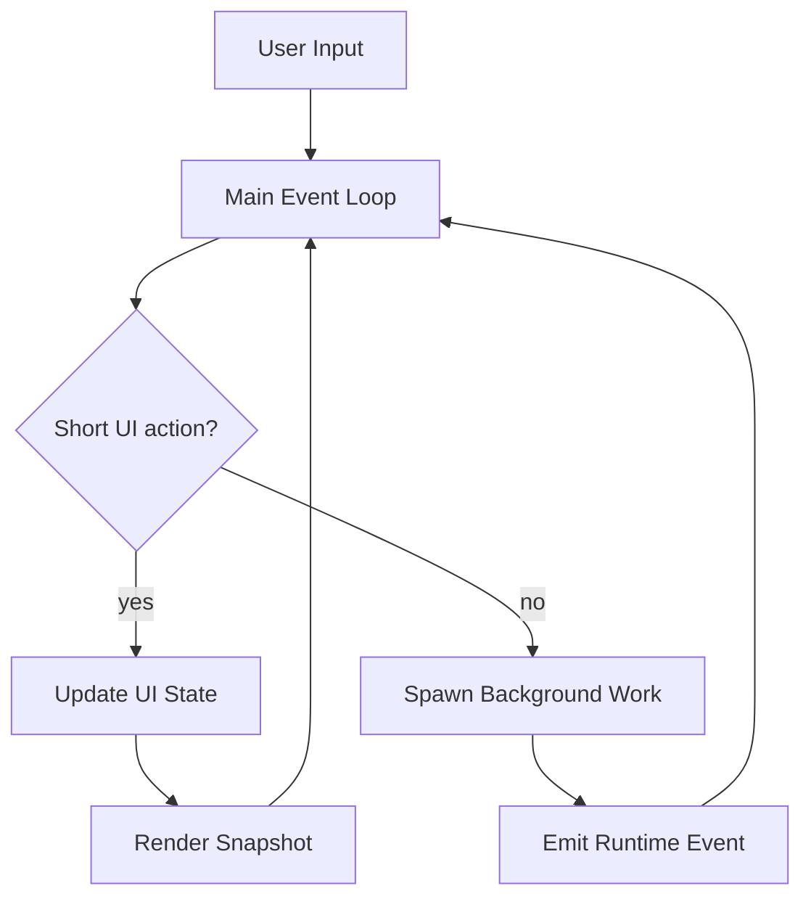

# Viden Product Requirements

## Purpose

This document defines the complete product target for Viden as a Rust-based,
local-first AI coding operator cockpit. It starts with the TUI, but the long-term
product boundary is a shared runtime powering TUI, GUI, CLI automation,
IDE/ACP adapters, and external agent supervision.

Viden supersedes the older Viden product framing. Viden remains a legacy
implementation/release name until a separate migration plan renames binaries,
crates, config paths, and artifacts safely.

Viden is not a file-by-file port of `.ref/claude-code-main`. The reference
project provides behavioral and interaction baselines. The TUI / GUI product
direction is a high-density, supervised, approval-aware, evidence-driven coding
cockpit backed by the shared runtime, not by a parallel UI-specific logic path.

Current implementation note:

- main has landed the V1 baseline plus V2-A session work, V2-C workflow continuity, V2-B semantic code intelligence, V2-D structured terminal-view slices for LSP/session/workflow/diff/permission outputs, and the provider-plugin runtime with DeepSeek v4
- the next architecture work is `0.2.x` runtime layering: `RuntimeSnapshot` /
  event stream, ContextBundle with token/cost, AgentTask execution loop, and
  release-gate evidence. TUI/GUI can only consume these facts; they cannot own a
  second business-logic path.

## Product Definition

### Positioning

Viden is a local-first Agent Orchestration workspace for software development.
Its core product promise is not only "one AI agent edits code", but supervised
composition of multiple agents, MCP capabilities, tools, roles, tasks, skills,
and workflows into auditable automation loops. Viden understands the current
workspace, executes tools through a permission gate, persists sessions and
workflow state, and expands into integrations, remote operation, mixed-agent
coordination, and GUI supervision.

Product naming boundary:

- **Viden**: product, TUI/GUI design target, visual identity, and planning name.
- **Viden**: legacy implementation and compatibility name until the rename
  migration is explicitly planned.
- **Accepted visual system**: `docs/viden-design/Viden/` is the accepted design
  source for tokens, components, target screenshots, and UI direction.

### Primary Users

- Individual developers using AI assistance inside a local repository
- Repository maintainers who need auditable tool execution and resumable work
- Teams that want a path from local CLI usage to richer integrations over time

### Core User Jobs

- Read, search, edit, and generate code inside a repository
- Run shell and Git workflows with approval-aware execution
- Search the web and fetch supporting context into the session
- Resume prior sessions without losing tool or approval context
- Work in analysis-only or approval-heavy modes when risk is higher
- Grow into MCP, LSP, remote, and multi-agent usage without changing products
- Supervise multiple parallel agents across workspace/project/lane/session/subagent hierarchy
- Compose internal agents, ACP agents, MCP tools, local tools, and reusable
  skills into role/task/workflow plans that can run sequentially or in parallel
- See the same runtime facts, context, cost, approval, and evidence in TUI and future GUI

### Product Goals

- Evolve from terminal chat-style AI assistant to Agent Orchestration cockpit
  for coding workflows
- Make multi-agent orchestration, mixed-agent workflow composition, and
  tool/MCP/skill assignment core product capabilities rather than add-ons
- Absorb mature reference-project patterns in core runtime behavior and
  subsystem shape
- Preserve strong auditability around tools, approvals, and session history
- Use reviewed design tokens and selector-first interaction to unify TUI / GUI
  visual and operational models once a design source is accepted
- Make lane/session/subagent, context, cost, approval, and evidence first-class
  product objects
- Support cross-platform local development from the first stable release
- Keep the engine extensible enough to host integrations and advanced workflows
- Let users turn repeatable engineering work into supervised workflows with
  explicit roles, task dependencies, evidence requirements, and merge gates
- Orchestrate context, canonical evidence, and cost together with agents so
  multi-agent work reuses facts instead of multiplying full prompts

The approved native context/evidence/cost requirements and acceptance criteria
are defined in [Context, Evidence, And Cost Engine Design](superpowers/specs/2026-07-18-context-evidence-cost-engine-design.md).
Headroom may be used as an optional benchmark or adapter, but Viden owns the
core contracts and always retains a native execution path.

### Product Non-Goals

- Reproducing Bun, React, or Ink implementation details
- Copying every reference command verbatim
- Shipping the entire platform in the first release
- Reproducing product analytics and growth tooling before core workflows mature
- Building independent GUI business logic before the `0.2.x` runtime is stable
- Treating generated visual prototypes as production implementation or
  bypassing the runtime contract

## Core Runtime Model

### Startup and Configuration

Viden must start from a deterministic configuration merge model:

1. CLI flags
2. Environment variables
3. Project-local config
4. Global config
5. Built-in defaults

Configuration must cover at minimum:

- provider family and model
- API base and credentials
- permission mode
- session storage location
- request timeout and retry behavior
- additional working directories
- future integration toggles where required

### Session Model

A session is the durable unit of interaction. It owns:

- message history
- tool-call history
- permission events
- command events
- session metadata and summary fields
- working directory and scope metadata

The transcript is the durable source of truth. Any derived index must be
rebuildable from transcript files.

### Message and Tool Loop

Viden must preserve the reference system's central behavior:

- user input enters a shared engine
- slash commands are resolved through the same runtime domain, not a detached UI
- provider responses can emit assistant text, tool calls, and turn completion
- tool calls are normalized before execution
- every tool call flows through one shared runtime path
- tool results are reintroduced into the conversation and transcript
- the loop continues until the provider completes the turn

Required invariants:

- tool execution is never a side channel
- permissions are checked before execution, not after
- assistant tool-call intent is represented in session state
- transcript order is sufficient to reconstruct a session

### Non-Blocking Interaction Runtime

Viden must treat "UI and input never freeze because agent work is active" as
a core product requirement, not as a TUI polish item.

Any flow that may wait on a provider, tool, shell, Git, LSP, MCP, plugin,
external agent, context compaction, doctor, release smoke, or user approval must
return to the UI through a background task, event, callback, or cancellable job.
The TUI main event loop must not synchronously wait for those flows to finish.

Required invariants:

- `/plan`, provider turns, approvals, streaming, tool execution, lanes, doctor,
  probes, and ContextBundle builds must never take over the main input loop;
- while a turn is active, the composer remains editable and `Enter` explicitly
  queues follow-up input or applies a visible interrupt/replace policy;
- approval is state plus callback, not a blocking `event::read` sub-loop;
- streaming appends deltas while render cadence is owned by the main loop;
- scrollback, resize, mouse, IME, and command panels remain usable during
  background work;
- every background work item maps to visible activity, AgentTask, Evidence, or
  error recovery.

### Permission Model

Permissions are a domain concept, not a purely interactive UI concept.

Viden must support named permission modes equivalent in intent to the
reference project:

- `default`
- `acceptEdits`
- `bypassPermissions`
- `dontAsk`
- `plan`

The permission subsystem must support:

- allow, deny, and ask outcomes
- per-session rules
- persisted rules
- tool-scoped rules
- path-scoped rules where relevant
- additional working directories
- special handling for workflows that legitimately cross repo boundaries, such
  as worktrees and remote resources

### Session Persistence and Resume

The session layer must provide:

- append-only transcript storage
- rebuildable secondary indexing
- project-scoped session discovery
- session selectors such as latest, numeric list index, and id prefix
- enough metadata for summaries, sorting, and quick resume decisions

### Slash Commands

Slash commands are a first-class interface layer. Viden does not need to
copy every reference command name, but it must define complete command families
that cover the same behavioral categories over time.

Required command families:

- runtime control: help, model/provider selection, permissions, plan mode
- session control: sessions, resume, diff, share/export in later phases
- repository workflows: Git status, branch, diff, add, commit, restore, stash,
  worktree, and related flows
- environment and diagnostics: config, doctor, context, usage/cost, status
- integration management: MCP, plugins, skills, remote, auth
- collaboration and workflow: tasks, agents, teams, memory

### External Agent / ACP Integration

Viden must support external coding agents through a core-owned plugin/extension
path. This is not a TUI-only command feature. The implementation direction
follows the Zed/ACP research in
[Zed ACP Integration Research](zed-acp-integration-research.md).

Required product behavior:

- users can install or configure external agents from registry, custom, or local
  command sources;
- the first usable targets are Claude, Codex, and Kiro CLI;
- external agents keep their own native auth, billing, provider, model, and
  subscription boundaries unless their adapter explicitly declares otherwise;
- Viden owns the runtime lifecycle, permissions, transcript, evidence,
  cancellation, logs, and merge gates;
- TUI and GUI clients render external-agent state through `RuntimeViewState`
  only.

ACP v1 support comes first. ACP v2 and proxy/conductor support must be isolated
behind versioned adapter boundaries so future protocol changes do not force a
TUI or GUI rewrite.

Current implementation status:

- agent plugin descriptors exist in `plugin-api`;
- built-in ACP descriptors exist for `claude-acp`, `codex-acp`, and `kiro-cli`;
- `VIDEN_AGENT_ACP_COMMAND` is exposed as a runnable `custom-acp` local
  descriptor, so custom/plugin ACP agents can use the same list/doctor/probe/run
  path as built-in agents;
- `/agent list`, `/agent doctor <id>`, and `/agent probe acp <agent-id>` expose
  descriptor-backed discovery and initialize probes;
- `/agent run acp <agent-id> <task>` can run a minimal synchronous ACP session
  through `session/new`, `session/prompt`, streamed `session/update`, and
  TurnEnd collection;
- `/agent run acp --load-session <session-id> --mode <mode-id> --model <model-id>
  <agent-id> <task>` can resume an existing agent-owned session and apply
  session-level mode/model configuration through ACP `session/load`,
  `session/set_mode`, and `session/set_config_option` with a legacy
  `session/set_model` fallback where required;
- `/agent run acp --async <agent-id> <task>` starts a tracked background ACP
  session job with JSONL/result/runtime-event artifacts, and `/agent cancel
  <id>` can stop the tracked process;
- ACP background cancellation requests protocol-level `session/cancel` when the
  live ACP session is available, records that request in the wire log, and uses
  bounded process termination as a fallback if the external agent does not stop
  promptly;
- ACP `session/request_permission` is converted into Viden approval prompts and
  answered with selected allow/reject ACP options;
- tracked ACP session jobs are projected into `RuntimeViewState` as `AgentTask`
  records;
- ACP `session/update` and `session/notification` payloads are projected into
  reusable `RuntimeEvent` records for assistant deltas, tool call start/finish,
  and turn-end evidence;
- background ACP jobs append projected events to `runtime-events.jsonl` as
  updates arrive, and `RuntimeViewState` replays those events for TUI/GUI
  assistant output and evidence views;
- ACP `fs/read_text_file` and `fs/write_text_file` client requests are bridged
  through Viden permission checks;
- ACP `terminal/create`, `terminal/input`, `terminal/write`,
  `terminal/output`, `terminal/wait_for_exit`, `terminal/release`, and
  `terminal/kill` are bridged through Viden permission checks.
  `terminal/create` starts a tracked process without waiting for exit,
  `terminal/input` / `terminal/write` write to process stdin,
  `terminal/output` polls buffered stdout/stderr, and `terminal/wait_for_exit`
  / `terminal/kill` update process status for long-running commands;
  unsupported filesystem or terminal methods still receive explicit JSON-RPC
  errors and wire-log evidence;
- registry-backed ACP agents use longer handshake timeouts to account for
  `npx` cold-start installation, and Kiro CLI doctor output now distinguishes
  installed binaries from unknown agent-native auth state;
- registry-backed ACP agents use a project-scoped npm cache, Claude/Codex
  initialize probes pass locally, and Kiro probe failures preserve stderr auth
  diagnostics instead of collapsing to a generic closed-stdout error;
- Claude/Codex ACP session-level smoke passes locally, including real Codex
  compatibility for `mcpServers: []`, `prompt: []`, snake-case `sessionUpdate`,
  final `id:2` responses, and usage reporting;
- Kiro-specific baseline compatibility is covered by fake server tests:
  `session/prompt` uses `prompt`, `session/notification` updates are accepted,
  `ToolCall` and `ToolCallUpdate` are captured, and `VIDEN_KIRO_AGENT` maps to
  `kiro-cli acp --agent <name>`;
- Kiro official ACP launch options are descriptor-backed and tested:
  `VIDEN_KIRO_MODEL`, `VIDEN_KIRO_EFFORT`, `VIDEN_KIRO_TRUST_TOOLS`,
  `VIDEN_KIRO_TRUST_ALL_TOOLS`, and `VIDEN_KIRO_AGENT_ENGINE` map to
  `kiro-cli acp` flags;
- `/agent auth acp kiro-cli` returns native-login instructions instead of
  attempting ACP `authenticate`, because Kiro owns credentials outside Viden;
- `/agent smoke acp [--live]` is available as a repeatable gate; unauthenticated
  Kiro returns a non-zero blocked-auth result instead of a false pass;
- authenticated Kiro live smoke passes in the current operator environment.
  The installed Kiro CLI uses a `prompt` array for `session/prompt`; the
  documentation-shaped `content` parameter is treated as incompatible until an
  agent descriptor proves otherwise;
- projected ACP runtime events are pushed through the live `RuntimeSupervisor`
  event stream during async/background jobs;
- ACP session output is mapped into merge-gate records: sessions propose a
  merge gate, completed tool updates become `tool_log` evidence, `TurnEnd`
  becomes `acp_turn_end` evidence, and the session gate becomes `Accepted` once
  turn-end evidence is present;
- ACP patch/diff updates carrying unified diffs are normalized into `patch`
  evidence, and patch-producing session gates require both `patch` and
  `acp_turn_end`. Patch evidence carries `acp.patch.v1` metadata with file
  stats, changed paths, hunk count, source tool-call id, and the source unified
  diff;
- full production external-agent execution still needs PTY-level interactive
  terminal sessions where required and provider-native doctor diagnostics in
  the release gate.

### Provider Abstraction

The provider layer must stay vendor-agnostic.

Required capabilities:

- provider family selection
- model selection
- request timeout and retry policy
- text generation
- native tool-calling when supported
- structured error reporting
- future streaming and cancellation support across providers

The product target includes support for:

- Anthropic
- OpenAI
- OpenAI-compatible APIs
- DeepSeek as an independent provider family
- Ollama or equivalent local model backends
- fallback or offline development mode

The provider target also includes a plugin-extensible provider runtime:

- built-in providers are only one registry source
- dynamic provider loading is a first-class requirement
- dynamic provider API base resolution follows explicit config, descriptor
  environment mapping, then descriptor default
- provider identity and protocol family remain separate concerns
- provider bindings are session/agent scoped rather than process-global
- runtime registry refresh must allow newly loaded providers to be used by new
  provider instances without forcing existing sessions to hot-swap

### Unified Tool Runtime

Tool execution must remain the single most stable interface boundary in the
system.

Every tool definition must include:

- public name and description
- mutating versus non-mutating classification
- input contract
- permission expectations
- execution handler
- serializable result shape

Minimum tool families for the complete product target:

- shell execution
- file read, write, and edit
- codebase search and globbing
- Git workflows
- web search and fetch
- MCP-backed tools
- LSP-backed actions
- agent, team, task, and remote-trigger tools in later phases

## Subsystem Requirements

### CLI / REPL / Slash Commands

Goal:
Provide the default local interaction surface for users working inside a repo.

Requirements:

- lightweight interactive REPL from the start
- progressively richer terminal UI over time
- discoverable command surface with help output
- command parsing that stays stable across providers and tools
- safe fallback behavior when advanced subsystems are unavailable

Phase priority:
- V1 core
- richer TUI in V2

### Configuration System

Goal:
Provide one predictable way to configure runtime behavior locally and globally.

Requirements:

- deterministic precedence
- explicit config schema
- compatibility-safe defaults
- environment and CLI overrides
- future migration path for config evolution

Phase priority:
- V1 core

### Provider System

Goal:
Support multiple model backends without coupling core logic to any one vendor.

Requirements:

- consistent internal provider contract
- vendor-specific protocol adapters
- native tool-calling where supported
- request retry and timeout policy
- compatibility behavior for providers with weaker protocol support

Phase priority:
- V1 core, deepened in V2

### Tool System

Goal:
Expose all actionable capabilities through a shared permission-aware runtime.

Requirements:

- single registry model
- consistent tool contract
- serializable results
- transcript visibility
- future pluggability for MCP, plugins, and agent-generated tools

Phase priority:
- V1 core, expanded continuously

### Permission System

Goal:
Make tool execution safe, auditable, and policy-aware.

Requirements:

- named modes
- explicit decisions
- rule persistence
- path scoping
- additional directories
- special-case handling for cross-root workflows
- later support for remote and integration-aware policies

Phase priority:
- V1 core, expanded in V2 and V3

### Session / Transcript / Resume

Goal:
Make the session durable, resumable, and inspectable.

Requirements:

- append-only transcript
- rebuildable index
- project-scoped session discovery
- fast resume
- better summaries and browsing in later phases

Phase priority:
- V1 core, enriched in V2

### Git Workflows

Goal:
Support local repository workflows directly inside the agent.

Requirements:

- inspect repository state
- stage and commit changes
- restore and stash workflows
- worktree support
- richer diff and branch workflows
- future PR-comment and review-oriented support where applicable

Phase priority:
- V1 core, expanded in V2

### Web Tools

Goal:
Allow the agent to retrieve external context without leaving the session loop.

Requirements:

- search and fetch
- transcript-visible results
- size and scope controls
- source-aware handling in future richer versions

Phase priority:
- V1 core, improved in V2

### MCP System

Goal:
Make remote tool ecosystems and external structured resources available through
the same runtime model as local tools.

Requirements:

- MCP server registration and lifecycle management
- MCP tool discovery and invocation
- permission-aware execution
- session-visible results
- command surface for MCP administration

Phase priority:
- V3

### LSP System

Goal:
Add semantic, language-aware code intelligence beyond shell and grep.

Requirements:

- language server management
- symbol- and reference-aware operations
- opt-in workflow integration with local tools
- graceful fallback when LSP is unavailable

Phase priority:
- V2

### Skills / Plugins

Goal:
Allow reusable workflows and third-party extensions without bloating core code.

Requirements:

- skill discovery and execution model
- plugin loading model
- clear trust boundary for local versus remote extensions
- command surface for listing and managing extensions

Phase priority:
- V3

### Multi-Agent / Team / Coordinator

Goal:
Make Agent Orchestration the product-level coordination layer for delegated,
parallel, and mixed-agent software work. Viden must be able to assign work to
different internal roles, external ACP agents, MCP tools, local tools, and
skills, then combine their outputs into a supervised workflow with explicit
evidence and merge decisions.

Design source:
- [Multi-Agent Core Orchestration](multi-agent-core-orchestration.md)
- [Agent Workflow Visibility](agent-workflow-visibility.md)

Requirements:

- agent spawning and lifecycle supervision
- inter-agent messaging, handoff, and dependency tracking
- team-level orchestration across sequential, parallel, and hybrid workflows
- mixed orchestration that can route subtasks to first-party roles, external
  ACP agents, MCP tools, local tools, shell/Git actions, and reusable skills
- cost-aware assignment that considers agent specialty, context locality,
  latency, model/provider price, local-tool alternatives, and workflow budget
- workflow templates that map user goals into role/task/tool/skill assignments
- transcript-aware coordination
- permission and scope isolation between agents
- Agent DAG with planner, coder, reviewer, tester, doc-writer, and release
  operator roles
- ContextBundle per agent task with token/cost budget, selected files,
  diagnostics, tool evidence, and exclusions
- evidence and merge gates before accepting agent-generated patches or release
  artifacts
- role-aware permission policy that keeps plan mode non-mutating and prevents
  self-escalation
- replayable runtime events so TUI, GUI, CLI automation, and external
  supervisors observe the same state
- [Frontend Integration Contract](frontend-integration-contract.md) coverage
  for completed core modules, so TUI and GUI consume the same runtime facts
  instead of inventing duplicate state models
- workflow-level observability: each agent/tool/skill step must expose status,
  input context, output artifact, evidence, cost, blockers, and next action
- workflow visibility must distinguish planned, running, done, accepted,
  blocked, failed, and cancelled work without requiring users to read raw logs
- workflow visibility must explain assignment rationale and cost impact for
  each agent/tool/skill decision

Phase priority:
- V2 for core DAG/event/evidence contracts
- V3 for hybrid external-agent/MCP/skill workflow orchestration and team
  collaboration

### Bridge / Remote / Server Mode

Goal:
Allow IDE-connected, remote, and service-oriented Viden usage beyond a local
terminal session.

Requirements:

- bridge protocol
- remote session transport
- permission callbacks across process boundaries
- server or daemon mode where required
- continuity with local session semantics

Phase priority:
- V3

### Memory / Tasks / Automation / Cron

Goal:
Support longer-lived workflows that outlast a single active prompt loop.

Requirements:

- project-level task lifecycle management through a dedicated workflow state
  layer
- project memory and session memory with separate scope semantics
- assistant-suggested project memory that remains inactive until explicit
  confirmation
- task and memory event logs that are append-only, auditable, and rebuildable
- workflow resume context that summarizes active tasks, blockers, relevant
  memory, and suggested next steps
- checked append behavior so invalid task or memory events do not corrupt the
  workflow log
- no silent business-state mutation from resume-context generation
- scheduled execution, reminders, and durable automation variants in later
  phases

Phase priority:
- V2 for memory and tasks
- V3 for automation and cron

### Voice

Goal:
Allow spoken interaction and voice-assisted workflows where they add value.

Requirements:

- voice capture and transcription
- voice session state
- fallback to text interaction

Phase priority:
- long-term

### UI / TUI / Visual Assist

Goal:
Move beyond a plain REPL when richer interaction improves comprehension.

Requirements:

- structured diff presentation with file/addition/deletion summaries
- session browsers with grouped entries and summaries
- contextual permission prompts and structured permission-denial output
- richer views for MCP, tasks, memory, and remote state

Phase priority:
- V2

### Operational Platform Features

Goal:
Support the long-term needs of a mature multi-environment product.

Requirements:

- analytics and usage tracking where appropriate
- feature flags
- managed settings
- policy limits and remote governance

Phase priority:
- long-term

## External Interfaces and Public Surface

### Command Surface Requirements

Viden must define stable command families rather than an ad hoc command pile.
The complete product target must cover:

- runtime control
- session control
- repository workflows
- diagnostics and config
- integrations
- collaboration
- platform administration

### Tool Contract Requirements

Public tool definitions must expose:

- stable name
- clear capability description
- declared mutability
- input contract
- permission expectation
- result format suitable for transcript storage

### Provider Configuration Interface

The public provider interface must allow users and integrators to choose:

- provider family
- model
- endpoint
- credentials
- timeout
- retry settings

### Permission Modes

The public permission surface must expose at least:

- `default`
- `acceptEdits`
- `bypassPermissions`
- `dontAsk`
- `plan`

### Session Selectors

The public session interface must support:

- latest session selection
- list-based selection
- id-prefix selection
- project scoping

### Working Directory and Scope Controls

The public workspace model must support:

- primary working directory
- additional working directories
- Git worktree flows
- future remote or bridge-provided workspace scopes

### Future Integration Interfaces

MCP, remote, skill, plugin, and multi-agent subsystems must be designed so they
plug into the same command, permission, tool, workflow, evidence, and transcript
model instead of creating parallel runtimes. The product target is a workflow
orchestrator where agents can call tools, tools can produce evidence, MCP can
extend capability, skills can package repeatable procedures, and the runtime
can schedule the right combination under user-visible supervision.

### Core Future TODO: Multi-Agent Orchestration

The next core roadmap must carry the multi-agent orchestration work as a shared
runtime requirement, not as a TUI or GUI feature. The canonical design is
[Multi-Agent Core Orchestration](multi-agent-core-orchestration.md).

Required future iteration items:

- expand the shared `AgentTask`, `AgentDag`, `ContextBundle`, `Evidence`, and
  `MergeGate` contracts without coupling them to TUI or GUI implementation;
- add workflow-level orchestration templates that translate a user goal into
  role, agent, MCP, tool, and skill assignments;
- support mixed sequential/parallel execution, including dependency-aware
  fan-out/fan-in across multiple agents and tools;
- continue persisting DAG, task, artifact, and evidence events in
  `crates/workflows`;
- keep extending `RuntimeSupervisor` so agent tasks run asynchronously and
  never block composer input;
- expand the landed role-aware permissions with release/publish Git rules
  beyond scoped staging, high-risk Git denial, and the initial scoped coder,
  release-operator, and external-agent matrix;
- add ContextBundle token/cost accounting before provider requests;
- require evidence, artifact decisions, and merge-gate state before generated
  changes are accepted or merged;
- make real development smoke, token/cost summary, and failure classification
  part of release readiness.

## Non-Functional Requirements

- Cross-platform support for macOS, Linux, and Windows
- Recoverability through durable transcripts and rebuildable indexes
- Auditability for tools, permissions, and command-level actions
- Extensibility for providers, tools, plugins, and MCP integrations
- Performance suitable for interactive CLI use and long-running sessions
- Security through explicit approval and scope-aware execution
- Compatibility strategy that favors behavioral similarity over implementation
  similarity

## Product Acceptance Criteria

The complete Viden product target is acceptable only if:

- all user prompts, slash commands, model events, tool calls, and workflow
  commands enter the shared runtime path
- mutating file, shell, Git, workflow, memory, and future integration actions
  are permission-gated before execution
- session transcripts are append-only, auditable, and sufficient to rebuild
  session history and derived session indexes
- workflow task and memory state stays separate from transcripts, uses JSONL as
  canonical storage, and keeps SQLite indexes rebuildable
- providers can be swapped without changing core engine logic, and native tool
  calls normalize into the shared model event shape
- built-in local tools expose stable contracts, declared mutability, and
  transcript-visible results
- project memory suggestions require explicit confirm/reject decisions before
  becoming active or retired
- future MCP, LSP, skill, plugin, multi-agent, bridge, and remote capabilities
  plug into the same command, permission, tool, workflow, evidence, and
  transcript model rather than creating parallel runtimes

## Requirements Document Acceptance Criteria

The complete Viden requirements set is acceptable only if it answers:

- what the finished product is
- which subsystems are in scope
- which phase each subsystem belongs to
- what "good enough" behavior means for each major subsystem
- how Viden should stay similar to `.ref` without becoming a literal port
