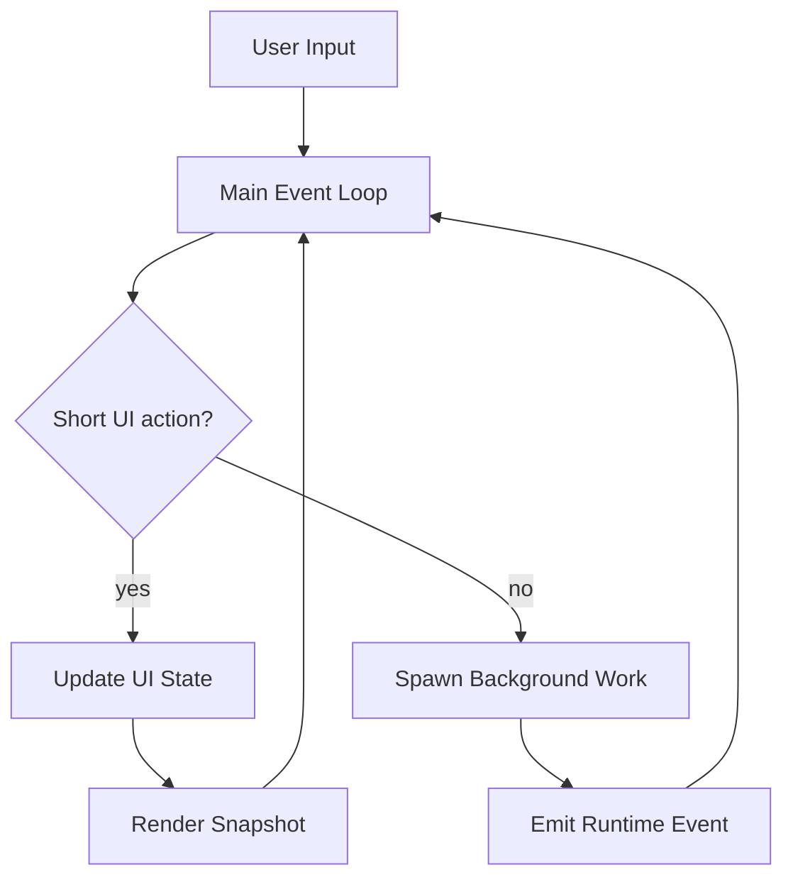

# Viden 产品需求规格

英文版： [product-requirements.md](product-requirements.md)

## 目的

这份文档定义 Viden 的完整产品目标：一个基于 Rust、本地优先的 AI coding operator
cockpit。它从 TUI 起步，但长期产品边界是共享 runtime 之上的 TUI、GUI、CLI automation、
IDE/ACP adapter 和外部 agent supervision。

Viden 取代旧的 Viden 产品框架。Viden 仅作为 legacy implementation / release 名称保留，
直到单独的迁移计划安全地覆盖 binary、crate、config path 和 artifact 重命名。

Viden 不是逐文件移植 `.ref/claude-code-main`。参考工程只提供行为和交互基线。TUI / GUI
产品方向是高密度、可监督、可审批、可审查证据的编码操作台，必须由共享 runtime 支撑，而不是
形成第二套 UI 专用业务逻辑。

当前实现说明：

- `main` 已落地 V1 基线、V2-A session work、V2-C workflow continuity、V2-B semantic code intelligence、覆盖 LSP/session/workflow/diff/permission outputs 的 V2-D structured terminal-view 切片，以及 provider-plugin runtime 与 DeepSeek v4
- 下一条架构工作是 `0.2.x` runtime 分层：`RuntimeSnapshot` / event stream、ContextBundle
  与 token/cost、AgentTask 执行闭环、release gate evidence。TUI/GUI 只能消费这些事实，
  不能拥有第二套业务逻辑。

## 产品定义

### 定位

Viden 是一个面向软件开发的本地优先 Agent Orchestration workspace。它的核心产品承诺
不是“一个 AI agent 帮用户改代码”，而是把多个 agent、MCP 能力、工具、角色、任务、skill
和 workflow 组合成可监督、可审计的自动化闭环。Viden 理解当前 workspace，通过权限门控
执行工具，持久化 session 与 workflow state，并逐步扩展到集成、远程操作、混合 Agent
编排和 GUI 监督界面。

产品命名边界：

- **Viden**：产品、TUI/GUI 设计目标、视觉身份和规划名称。
- **Viden**：legacy implementation 和 compatibility 名称，直到 rename migration 被明确规划。
- **接受的视觉系统**：`docs/viden-design/Viden/` 是 tokens、components、target screenshots
  和 UI 方向的接受设计源。

### 主要用户

- 在本地仓库里使用 AI 辅助开发的个人开发者
- 需要工具执行可审计、工作可恢复的仓库维护者
- 希望从本地 CLI 逐步成长到更丰富集成能力的团队

### 核心用户任务

- 在仓库里读代码、搜代码、改代码、生成代码
- 在审批约束下运行 shell 与 Git 工作流
- 把 Web 上下文检索并注入到会话中
- 在不丢失工具与审批上下文的前提下恢复历史会话
- 在高风险场景下使用只分析或高审批模式
- 后续扩展到 MCP、LSP、remote、多 Agent，而不需要切换产品
- 在 workspace/project/lane/session/subagent 层级中监督多个并行 agent
- 把内部 agent、ACP agent、MCP tools、本地工具和可复用 skills 组合成
  role/task/workflow 计划，支持串行或并行执行
- 在 TUI 和未来 GUI 中查看相同 runtime facts、context、cost、approval 和 evidence

### 产品目标

- 从“终端聊天式 AI 助手”升级为“面向编码工作流的 Agent Orchestration cockpit”
- 把多 Agent 编排、混合 Agent workflow composition、tool/MCP/skill assignment
  作为核心产品能力，而不是附加功能
- 在核心运行时行为和子系统形态上吸收参考工程的成熟模式
- 保持工具、审批和会话历史的强审计能力
- 在设计源被接受后，用经过审核的 design tokens 和 selector-first 交互统一 TUI / GUI
  视觉与操作模型
- 让 lane/session/subagent、context、cost、approval、evidence 成为一等产品对象
- 从首个稳定版本起支持跨平台本地开发
- 保持内核足够可扩展，以承载后续集成和高级工作流
- 让用户可以把重复工程工作转成可监督 workflow，并明确角色、任务依赖、证据要求和 merge gate
- 在编排 Agent 的同时编排 context、canonical evidence 和 cost，让多 Agent 复用事实，
  而不是成倍复制完整 prompt

已批准的原生 context/evidence/cost 需求与验收标准见
[Context、Evidence 与 Cost Engine 设计](superpowers/specs/2026-07-18-context-evidence-cost-engine-design.zh-CN.md)。
Headroom 可以作为可选 benchmark 或 adapter，但核心 contracts 由 Viden 持有，并始终
保留原生执行路径。

### 非目标

- 复刻 Bun、React、Ink 等具体技术实现
- 逐字逐条复制参考工程的所有命令
- 在第一版里交付整个平台
- 在核心工作流成熟前优先构建 analytics 和 growth tooling
- 在 `0.2.x` runtime 稳定前实现独立 GUI 业务逻辑
- 把生成式视觉原型直接当作生产实现或绕过 runtime contract

## 核心运行模型

### 启动与配置

Viden 必须具备确定性的配置优先级模型：

1. CLI flags
2. 环境变量
3. 项目级配置
4. 全局配置
5. 内置默认值

至少要覆盖：

- provider family 和 model
- API base 与 credentials
- permission mode
- session 存储位置
- request timeout 与 retry
- additional working directories
- 未来集成所需的开关项

### 会话模型

session 是交互的持久化单位，负责持有：

- message history
- tool-call history
- permission events
- command events
- session metadata 与 summary 字段
- working directory 与 scope metadata

transcript 是持久化事实源；任何派生索引都必须可以从 transcript 文件重建。

### 消息与工具循环

Viden 必须保留参考工程最核心的行为：

- 用户输入进入共享 engine
- slash commands 通过同一运行时域解析，而不是 UI 旁路
- provider 返回 assistant 文本、tool calls 和 turn 完成事件
- tool call 在执行前完成标准化
- 所有工具调用都走统一运行时路径
- tool result 重新注入会话和 transcript
- 循环持续到 provider 完成本轮

必须保持的约束：

- 工具执行不能是 side channel
- 权限必须先判定再执行
- assistant 的 tool-call 意图必须进入 session state
- transcript 顺序必须足以重建会话

### 非阻塞交互运行时

Viden 必须把“UI 和输入不被 agent 工作卡住”作为核心产品需求，而不是 TUI 层的体验补丁。

任何可能等待 provider、tool、shell、Git、LSP、MCP、plugin、external agent、context
compaction、doctor、release smoke 或用户审批的流程，都必须通过后台任务、事件、callback
或可取消 job 回到 UI。TUI 主事件循环不能同步等待这些流程完成。

硬性要求：

- `/plan`、provider turn、approval、streaming、tool execution、lane、doctor、probe 和
  ContextBundle build 都不能接管主输入循环；
- active turn 期间 composer 保持可编辑，`Enter` 将后续输入显式入队或执行可见的
  interrupt/replace 策略；
- approval 是状态和 callback，不是阻塞式 `event::read` 子循环；
- streaming 只追加 delta，渲染节奏由主循环控制；
- scrollback、resize、鼠标、IME 和命令面板在后台任务运行时仍可用；
- 所有后台 work 都必须映射为可见的 activity、AgentTask、Evidence 或 error recovery。

### 权限模型

权限是领域概念，而不是单纯的交互 UI 状态。

Viden 必须支持与参考工程语义等价的命名模式：

- `default`
- `acceptEdits`
- `bypassPermissions`
- `dontAsk`
- `plan`

权限子系统必须支持：

- allow / deny / ask
- per-session rules
- persisted rules
- tool-scoped rules
- path-scoped rules
- additional working directories
- 对 worktree、remote resource 等跨仓库边界流程的特殊处理

### 会话持久化与恢复

session 层必须提供：

- append-only transcript 存储
- 可重建的二级索引
- 按项目发现会话
- 快速 resume
- 后续更好的 summaries 和浏览能力

### Slash Commands

slash commands 是一等接口层。Viden 不需要逐字复制所有参考命令，但必须覆盖相同的行为家族。

必须覆盖的命令族：

- runtime control：help、model/provider、permissions、plan mode
- session control：sessions、resume、diff，后续扩展 share/export
- repository workflows：Git status、branch、diff、add、commit、restore、stash、worktree 等
- environment 和 diagnostics：config、doctor、context、usage/cost、status
- integration management：MCP、plugins、skills、remote、auth
- collaboration 和 workflow：tasks、agents、teams、memory

### External Agent / ACP 集成

Viden 必须通过 core-owned plugin/extension 路径支持外部 coding agents。这不是一个
TUI-only command feature。实现方向见
[Zed ACP 接入研究](zed-acp-integration-research.zh-CN.md)。

必要产品行为：

- 用户可以从 registry、custom 或 local command sources 安装或配置 external agents；
- 第一批可用目标是 Claude、Codex 和 Kiro CLI；
- external agents 默认保留自己的 native auth、billing、provider、model 和 subscription
  边界，除非 adapter 明确声明其他行为；
- Viden 拥有 runtime lifecycle、permissions、transcript、evidence、cancellation、
  logs 和 merge gates；
- TUI 与 GUI 只能通过 `RuntimeViewState` 渲染 external-agent state。

ACP v1 先落地。ACP v2 与 proxy/conductor 能力必须隔离在版本化 adapter 边界后面，避免未来协议变化迫使 TUI 或 GUI 重写。

当前实现状态：

- `plugin-api` 已有 agent plugin descriptor；
- `plugin-host` 已内置 `claude-acp`、`codex-acp` 和 `kiro-cli` 三个 ACP descriptor；
- `VIDEN_AGENT_ACP_COMMAND` 已作为可运行的 `custom-acp` local descriptor
  暴露，所以 custom/plugin ACP agents 可以复用内置 agent 相同的
  list/doctor/probe/run 路径；
- `/agent list`、`/agent doctor <id>` 和 `/agent probe acp <agent-id>` 已提供基于
  descriptor 的发现与 initialize probe；
- `/agent run acp <agent-id> <task>` 可以运行最小同步 ACP session，覆盖
  `session/new`、`session/prompt`、streamed `session/update` 和 TurnEnd collection；
- `/agent run acp --load-session <session-id> --mode <mode-id> --model <model-id>
  <agent-id> <task>` 可以恢复 agent 自己管理的既有 session，并通过 ACP
  `session/load`、`session/set_mode` 和 `session/set_config_option` 应用
  session-level mode/model 配置；必要时保留 legacy `session/set_model` fallback；
- `/agent run acp --async <agent-id> <task>` 可以启动 tracked 后台 ACP session job，
  写出 JSONL/result/runtime-event artifacts，并可通过 `/agent cancel <id>` 停止对应进程；
- ACP 后台取消会在 live ACP session 可用时请求协议层 `session/cancel`，把请求写入
  wire log；如果外部 agent 没有及时停止，再用有界 process termination 作为 fallback；
- ACP `session/request_permission` 已转换为 Viden approval prompt，并按 allow/reject
  结果回写选中的 ACP option；
- tracked ACP session jobs 已作为 `AgentTask` records 投影到 `RuntimeViewState`；
- ACP `session/update` 和 `session/notification` payloads 已投影成可复用
  `RuntimeEvent` records，覆盖 assistant delta、tool call start/finish 和
  turn-end evidence；
- 后台 ACP jobs 会在 updates 到达时持续把投影事件追加到
  `runtime-events.jsonl`，`RuntimeViewState` 会重放这些事件，供 TUI/GUI 的
  assistant output 和 evidence views 消费；
- ACP `fs/read_text_file` 和 `fs/write_text_file` client requests 已通过 Viden
  permission checks 桥接；
- ACP `terminal/create`、`terminal/input`、`terminal/write`、
  `terminal/output`、`terminal/wait_for_exit`、`terminal/release` 和
  `terminal/kill` 已通过 Viden permission checks 桥接。`terminal/create`
  会启动 tracked process 而不是等待退出，`terminal/input` / `terminal/write`
  会写入 process stdin，`terminal/output` 会轮询 buffered stdout/stderr，
  `terminal/wait_for_exit` / `terminal/kill` 会更新 long-running command 的
  process status；未支持的 filesystem 或 terminal methods 仍会收到明确
  JSON-RPC error，并留下 wire-log evidence；
- registry-backed ACP agents 使用更长 handshake timeout 来覆盖 `npx` cold-start
  installation；Kiro CLI doctor 输出会区分 binary installed 与 agent-native auth unknown；
- registry-backed ACP agents 使用项目级 npm cache；Claude/Codex initialize probes
  已在本机跑通；Kiro probe failure 会保留 stderr auth diagnostics，而不是退化成
  generic closed-stdout error；
- Claude/Codex ACP session-level smoke 已在本机跑通，包括真实 Codex 对
  `mcpServers: []`、`prompt: []`、snake-case `sessionUpdate`、最终 `id:2`
  response 和 usage reporting 的兼容；
- Kiro-specific baseline compatibility 已用 fake server tests 覆盖：
  `session/prompt` 使用 `prompt`，接受 `session/notification` updates，
  收集 `ToolCall` 和 `ToolCallUpdate`，并支持 `VIDEN_KIRO_AGENT` 映射到
  `kiro-cli acp --agent <name>`；
- Kiro 官方 ACP launch options 已进入 descriptor 并有测试覆盖：
  `VIDEN_KIRO_MODEL`、`VIDEN_KIRO_EFFORT`、`VIDEN_KIRO_TRUST_TOOLS`、
  `VIDEN_KIRO_TRUST_ALL_TOOLS` 和 `VIDEN_KIRO_AGENT_ENGINE` 会映射到
  `kiro-cli acp` flags；
- `/agent auth acp kiro-cli` 返回 native-login instructions，而不是尝试 ACP
  `authenticate`，因为 Kiro credentials 由 Viden 外部的 Kiro 自己管理；
- `/agent smoke acp [--live]` 已作为可重复 gate 可用；Kiro 未认证时返回非零
  blocked-auth，而不是误判通过；
- 当前 operator 环境中的 authenticated Kiro live smoke 已通过。当前安装的 Kiro
  CLI 在 `session/prompt` 中使用 `prompt` array；文档形态的 `content` 参数在
  agent descriptor 明确声明前视为不兼容；
- projected ACP runtime events 已会在 async/background jobs 运行中直接推送进
  live `RuntimeSupervisor` event stream；
- ACP session output 已映射到 merge-gate records：session 会提出 merge gate，
  completed tool updates 会成为 `tool_log` evidence，`TurnEnd` 会成为
  `acp_turn_end` evidence，并在 turn-end evidence 存在后把 session gate 推到
  `Accepted`；
- 携带 unified diff 的 ACP patch/diff updates 已归一化为 `patch` evidence；产生
  patch 的 session gate 会要求同时具备 `patch` 和 `acp_turn_end`。Patch
  evidence 会携带 `acp.patch.v1` metadata，包含文件统计、变更路径、hunk 数、
  来源 tool-call id 和原始 unified diff；
- 完整 production external-agent execution 还需要在必要时支持 PTY 级
  interactive terminal sessions，并把 provider-native doctor diagnostics 保持在
  release gate 中。

### Provider 抽象

provider 层必须保持厂商无关。

至少要支持：

- provider family 选择
- model 选择
- timeout 与 retry 策略
- 文本生成
- 原生 tool-calling
- 结构化错误
- 未来跨 provider 的 streaming 和 cancellation

目标支持：

- Anthropic
- OpenAI
- OpenAI-compatible APIs
- DeepSeek，作为独立 provider family
- Ollama 或等价本地模型后端
- fallback / offline development mode

provider 目标还包括 plugin-extensible provider runtime：

- built-in providers 只是 registry 的一种来源
- dynamic provider loading 是正式需求
- dynamic provider API base 按 explicit config、descriptor environment mapping、descriptor default 的顺序解析
- provider identity 与 protocol family 必须保持分离
- provider bindings 以 session/agent 为作用域，而不是 process-global
- runtime registry refresh 必须允许新加载 provider 被新的 provider instances 使用，而不强制已有 session 热切换

### 统一工具运行时

工具执行必须成为系统中最稳定的接口边界。

每个工具定义都应包含：

- public name 和 description
- mutating / non-mutating 分类
- input contract
- permission expectation
- execution handler
- 可序列化 result shape

完整产品目标中的最小工具家族：

- shell execution
- file read / write / edit
- codebase search / globbing
- Git workflows
- web search / fetch
- MCP-backed tools
- LSP-backed actions
- 后续的 agent、team、task、remote-trigger tools

## 子系统需求

### CLI / REPL / Slash Commands

目标：
提供默认的本地交互入口。

要求：

- 从一开始就有轻量交互式 REPL
- 后续逐步增强终端 UI
- 可发现的命令面与帮助输出
- 在 provider 和工具变化下仍保持稳定的命令解析
- 高级子系统不可用时的安全降级

阶段优先级：
- V1 核心
- V2 增强 TUI

### 配置系统

目标：
为本地和全局运行行为提供一个稳定、一致的配置入口。

要求：

- 确定性优先级
- 明确的配置 schema
- 兼容优先的默认值
- 环境变量和 CLI override
- 后续配置迁移能力

阶段优先级：
- V1 核心

### Provider 系统

目标：
支持多模型后端，同时不让 core logic 绑定单一厂商。

要求：

- 一致的内部 provider contract
- 厂商协议适配层
- 原生 tool-calling
- retry 和 timeout 策略
- 对弱协议 provider 的兼容路径

阶段优先级：
- V1 核心
- V2 持续增强

### 工具系统

目标：
把所有可行动能力都暴露在统一的权限化运行时之下。

要求：

- 单一 registry 模型
- 一致工具契约
- 可序列化结果
- transcript 可见性
- 后续支持 MCP、plugins、agent-generated tools

阶段优先级：
- V1 核心，持续扩展

### 权限系统

目标：
让工具执行安全、可审计、可策略化。

要求：

- 命名模式
- 明确决策
- 规则持久化
- 路径作用域
- additional directories
- 跨根目录流程的特殊处理
- 后续扩展到 remote 和集成策略

阶段优先级：
- V1 核心
- V2 / V3 继续增强

### Session / Transcript / Resume

目标：
让 session 持久化、可恢复、可检查。

要求：

- append-only transcript
- 可重建索引
- 按项目发现会话
- 快速 resume
- 后续更好的 summaries 和浏览

阶段优先级：
- V1 核心
- V2 增强

### Git Workflows

目标：
在 Agent 内直接支持本地仓库工作流。

要求：

- 查看仓库状态
- stage 与 commit
- restore 与 stash
- worktree 支持
- 更丰富的 diff 和 branch 流程
- 后续扩展 review / PR comment 相关能力

阶段优先级：
- V1 核心
- V2 增强

### Web 工具

目标：
让 Agent 不离开会话即可获取外部上下文。

要求：

- search 和 fetch
- transcript 可见结果
- 大小与作用域控制
- 后续更强的来源处理

阶段优先级：
- V1 核心
- V2 增强

### MCP 系统

目标：
把外部工具生态和结构化远程资源接进同一运行时模型。

要求：

- MCP server 注册与生命周期管理
- MCP tool discovery 和 invocation
- 权限化执行
- session 可见结果
- MCP 管理命令面

阶段优先级：
- V3

### LSP 系统

目标：
在 shell 和 grep 之外增加语义级代码理解。

要求：

- 语言服务器管理
- symbol / reference 级操作
- 和本地工具的协作流程
- 不可用时的平稳降级

阶段优先级：
- V2

### Skills / Plugins

目标：
让可复用工作流和第三方扩展进入系统，而不让 core code 膨胀。

要求：

- skill discovery 与执行模型
- plugin loading 模型
- 本地与远程扩展的信任边界
- 列出和管理扩展的命令面

阶段优先级：
- V3

### 多 Agent / Team / Coordinator

目标：
把 Agent Orchestration 做成产品级协调层，支持委派、并行和混合 Agent 软件开发工作。
Viden 必须能把工作分配给不同的一方角色、外部 ACP agents、MCP tools、本地工具和 skills，
并把它们的输出组合成带明确 evidence 与 merge decision 的可监督 workflow。

设计来源：
- [多 Agent 核心编排](multi-agent-core-orchestration.zh-CN.md)
- [Agent Workflow Visibility](agent-workflow-visibility.zh-CN.md)

要求：

- agent spawning 和生命周期监督
- inter-agent messaging、handoff 和 dependency tracking
- 支持串行、并行和混合 workflow 的 team-level orchestration
- mixed orchestration：能把子任务路由给一方 role、外部 ACP agents、MCP tools、
  local tools、shell/Git actions 和 reusable skills
- cost-aware assignment：分工时同时考虑 agent 专长、上下文局部性、延迟、
  model/provider 价格、本地工具替代方案和 workflow budget
- workflow templates：把用户目标映射为 role/task/tool/skill assignment
- transcript-aware coordination
- 权限和作用域隔离
- 包含 planner、coder、reviewer、tester、doc-writer、release operator 的 Agent DAG
- 每个 agent task 都有 ContextBundle，包含 token/cost budget、selected files、
  diagnostics、tool evidence 和 exclusions
- agent 生成 patch 或 release artifact 前必须经过 evidence gate 和 merge gate
- role-aware permission policy 必须保持 plan mode 非变更，并阻止自我提权
- replayable runtime events，保证 TUI、GUI、CLI automation 和 external supervisors
  观察同一份状态
- 已完成核心模块必须覆盖
  [前端对接契约](frontend-integration-contract.zh-CN.md)，保证 TUI 和 GUI 消费同一套
  runtime facts，而不是发明第二套状态模型
- workflow-level observability：每个 agent/tool/skill step 都必须暴露 status、
  input context、output artifact、evidence、cost、blocker 和 next action
- workflow visibility 必须区分 planned、running、done、accepted、blocked、
  failed 和 cancelled，不要求用户阅读原始日志
- workflow visibility 必须解释每个 agent/tool/skill 决策的 assignment rationale
  和 cost impact

阶段优先级：
- V2：核心 DAG/event/evidence contracts
- V3：hybrid external-agent/MCP/skill workflow orchestration 和 team collaboration

### Bridge / Remote / Server Mode

目标：
支持 IDE 连接、远程会话和服务化运行模式。

要求：

- bridge protocol
- remote session transport
- 跨进程 permission callbacks
- server / daemon mode
- 与本地 session 语义保持一致

阶段优先级：
- V3

### Memory / Tasks / Automation / Cron

目标：
支持超过单轮 prompt 生命周期的长期工作流。

要求：

- 通过独立 workflow state 层管理项目级 task lifecycle
- 明确区分 project memory 与 session memory
- assistant 建议的 project memory 在显式 confirm 前不能成为 active
- task 与 memory event logs 必须 append-only、可审计、可重建
- workflow resume context 必须汇总 active tasks、blockers、relevant memory
  和 suggested next steps
- checked append 必须防止无效 task / memory events 污染 workflow log
- resume-context 生成不能静默修改 task 业务状态
- scheduled execution、reminders、durable automation 留到后续阶段

阶段优先级：
- V2：memory 和 tasks
- V3：automation 和 cron

### Voice

目标：
在确有价值的场景下支持语音交互。

要求：

- voice capture 与 transcription
- voice session state
- 向文本交互平稳回退

阶段优先级：
- 远期

### UI / TUI / Visual Assist

目标：
当更丰富交互能显著改善理解时，逐步超越纯 REPL。

要求：

- 带 files/additions/deletions 摘要的 structured diff 展示
- 带分组 entries 和 summaries 的 session 浏览界面
- 上下文化 permission prompt 和结构化 permission-denial output
- MCP、tasks、memory、remote 等状态的 richer views

阶段优先级：
- V2

### 运营型平台能力

目标：
在产品成熟后支持多环境、多团队、多策略的产品化运行。

要求：

- analytics 和 usage tracking
- feature flags
- managed settings
- policy limits 和 remote governance

阶段优先级：
- 远期

## 外部接口与公开能力面

### 命令面

Viden 必须定义稳定的命令家族，而不是临时堆出来的命令集合。完整目标至少覆盖：

- runtime control
- session control
- repository workflows
- diagnostics 和 config
- integrations
- collaboration
- platform administration

### 工具契约

公开工具定义必须暴露：

- 稳定名称
- 清晰能力描述
- declared mutability
- input contract
- permission expectation
- transcript 可存储的 result format

### Provider 配置接口

公开 provider 接口必须允许选择：

- provider family
- model
- endpoint
- credentials
- timeout
- retry settings

### Permission Modes

公开权限面至少暴露：

- `default`
- `acceptEdits`
- `bypassPermissions`
- `dontAsk`
- `plan`

### Session Selectors

公开 session 接口必须支持：

- latest
- list index
- id-prefix
- project scoping

### Working Directory 与 Scope Controls

公开工作区模型必须支持：

- primary working directory
- additional working directories
- Git worktree 流程
- 未来 remote / bridge 提供的 workspace scopes

### 未来集成接口

MCP、remote、skill、plugin 和多 Agent 子系统必须插入同一套 command、permission、
tool、workflow、evidence 和 transcript 模型，而不是建立新的平行运行时。产品目标是一个
workflow orchestrator：agent 可以调用工具，工具可以产出 evidence，MCP 可以扩展能力，
skill 可以封装可复用流程，runtime 负责在用户可见监督下调度正确组合。

### 核心未来 TODO：多 Agent 编排

后续核心路线图必须把多 Agent 编排作为 shared runtime requirement，而不是 TUI
或 GUI 特性。canonical 设计文档是
[多 Agent 核心编排](multi-agent-core-orchestration.zh-CN.md)。

必须进入未来迭代的内容：

- 扩展共享 `AgentTask`、`AgentDag`、`ContextBundle`、`Evidence` 和 `MergeGate`
  contracts，同时避免它们和 TUI/GUI 实现耦合；
- 增加 workflow-level orchestration templates，把用户目标转换为 role、agent、
  MCP、tool 和 skill assignments；
- 支持混合串行/并行执行，包括多 agent 与多工具之间依赖感知的 fan-out/fan-in；
- 继续在 `crates/workflows` 持久化 DAG、task、artifact 和 evidence events；
- 继续扩展 `RuntimeSupervisor`，让 agent tasks 异步运行，不能阻塞 composer input；
- 在已落地的 role-aware permissions、scoped staging 和高风险 Git denial 之上，
  继续扩展 release/publish Git rules；
- provider requests 前增加 ContextBundle token/cost accounting；
- generated changes 被接受或 merged 前必须有 evidence、artifact decisions 和
  merge-gate state；
- real development smoke、token/cost summary 和 failure classification 必须成为
  release readiness 的一部分。

## 非功能需求

- 支持 macOS / Linux / Windows
- 通过 durable transcript 和 rebuildable index 保证 recoverability
- 对工具、权限和命令行为具备审计能力
- provider、tool、plugin、MCP 可扩展
- 具备交互式 CLI 使用所需的性能
- 通过显式审批和 scope-aware execution 保证安全
- 兼容策略上以行为相似度优先，而不是实现相似度

## 产品验收标准

完整 Viden 产品目标必须满足：

- 所有 user prompts、slash commands、model events、tool calls、workflow
  commands 都进入共享 runtime path
- 文件、shell、Git、workflow、memory 以及未来 integration 的 mutating actions
  都必须先经过 permission gate
- session transcripts 必须 append-only、可审计，并足以重建 session history 与派生索引
- workflow task / memory state 必须和 transcripts 分离，以 JSONL 为 canonical
  storage，并保持 SQLite indexes 可重建
- provider 可替换且不要求修改 core engine，原生 tool calls 归一化为共享 model event
  形状
- 内置本地工具必须有稳定契约、declared mutability，以及 transcript-visible results
- project memory suggestions 必须经过显式 confirm/reject 才能成为 active 或被 retired
- 未来 MCP、LSP、skill、plugin、多 Agent、bridge、remote 能力必须插入同一套
  command、permission、tool、workflow、evidence 和 transcript 模型，而不是建立平行运行时

## 需求文档验收标准

完整需求集必须能回答：

- Viden 最终是什么
- 哪些子系统在正式范围内
- 每个子系统属于哪个阶段
- 每个核心子系统“做到什么算够用”
- 如何在不逐文件移植的前提下保持与 `.ref` 的高相似度
