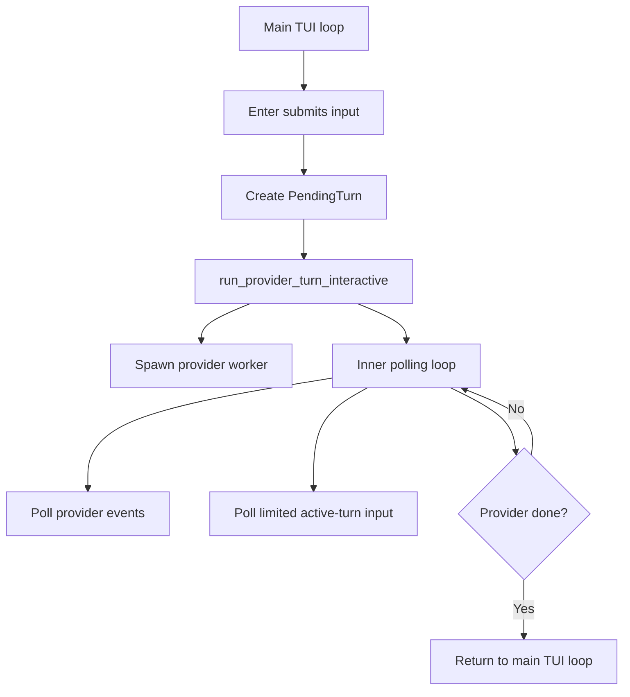
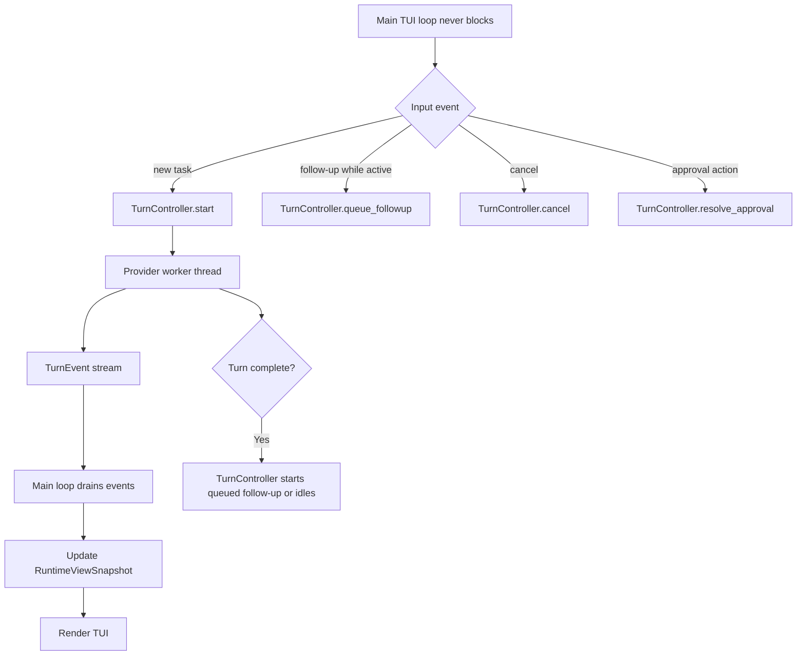
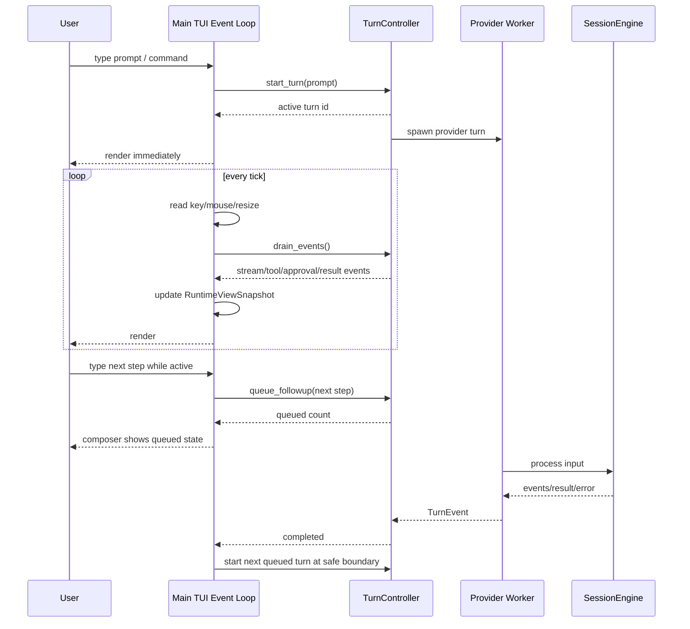
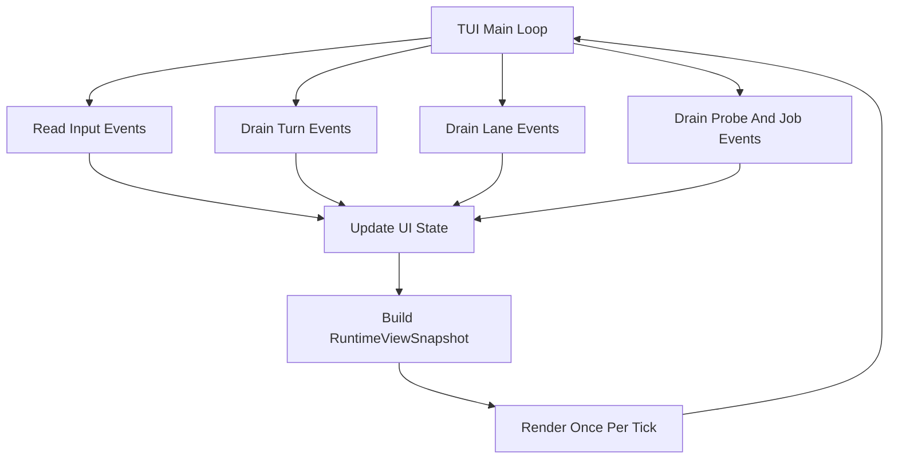
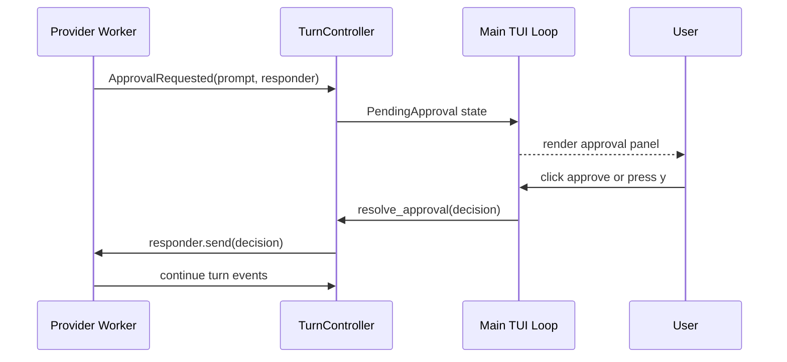
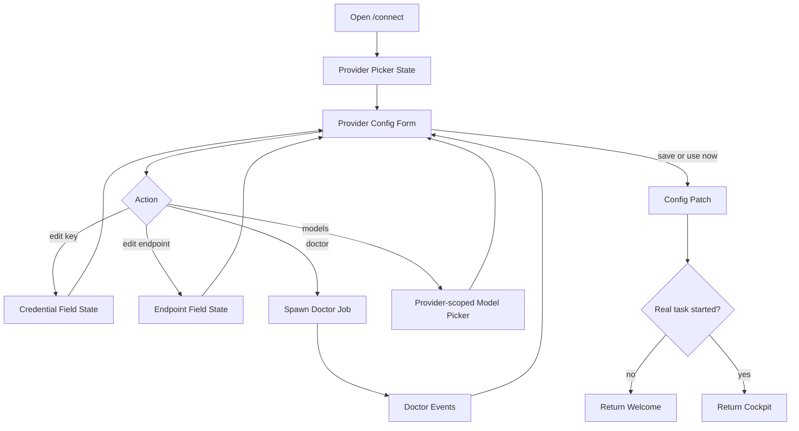
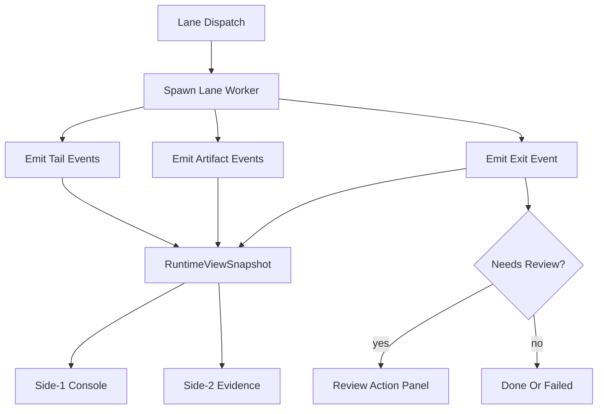

# Production Coding Loop Architecture

Chinese version: [production-coding-loop-architecture.zh-CN.md](production-coding-loop-architecture.zh-CN.md)

Last updated: 2026-06-07

## Goal

RoboCode should become a production-usable coding tool, not only a terminal chat
surface. The product must solve the common pain points of current AI coding
tools:

- users cannot tell what the agent is doing;
- active turns block the next thought;
- context grows until quality drops or providers return 413 errors;
- model/provider setup is confusing;
- diff, tests, failures, and next actions are scattered;
- multi-agent work is easy to spawn but hard to supervise;
- TUI logic and runtime logic can drift together, making future UI replacement
  expensive.

This document defines the implementation architecture for the production coding
loop and the required layering between core runtime and UI systems.

## Product Outcome

A normal user should be able to:

1. Open RoboCode and stay on a calm welcome composer until they start real work.
2. Configure a provider/model through direct panels, then return to the welcome
   composer if no coding task has started.
3. Ask for a coding task.
4. See what RoboCode is doing in plain, varied activity language.
5. Keep typing follow-ups while the current turn is running.
6. Watch streamed output, tool requests, edits, test commands, and failures.
7. Approve or deny risky operations with clear evidence.
8. Inspect diff/test/context evidence before trusting completion.
9. Recover from provider/model/context errors with a suggested next action.
10. Hand work to Codex, Claude, shell, tmux, or future ACP lanes without losing
    a unified task/evidence view.

## Layering Contract

RoboCode should be split into four conceptual layers.

### 1. Runtime Core

Owners:

- `viden-runtime`
- `viden-types`
- `viden-provider`
- `viden-tools`
- `viden-permissions`
- `viden-session`
- `viden-workflows`

Responsibilities:

- session and provider turn orchestration;
- tool calls and permission checks;
- transcript writes and durable audit;
- workflow task and memory state;
- provider telemetry and error classification;
- ContextBundle construction and compaction;
- AgentTask, AgentLane, Evidence, Decision, Budget, and CredentialHandle facts;
- lane lifecycle state when non-TUI callers need the same behavior.

Runtime core must not:

- depend on terminal dimensions;
- render ANSI, borders, or layout;
- derive business state from UI text;
- expose secrets as raw strings;
- invent UI-only fake health, cost, token, task, or diagnostic values.

### 2. Product View Model

This layer is a stable UI-independent contract. It can live in `viden-types`
or a future small crate such as `robocode-ui-model` once multiple UI surfaces
need it.

Responsibilities:

- `RuntimeViewSnapshot`: a complete read-only snapshot for any UI;
- `ActivityLine`: current work status in user-facing language;
- `ComposerState`: whether input starts a task, queues a follow-up, or edits a
  focused panel;
- `TaskListView`: active tasks sorted by operator urgency;
- `EvidenceView`: latest diff/test/diagnostic/context/lane evidence;
- `ProviderSetupView`: provider/model setup fields and actions;
- `ContextView`: included sources, omitted sources, budgets, pressure, and
  compaction notes;
- `CommandAction`: executable actions with labels, shortcuts, enabled state,
  and side-effect class.

Product view model must be deterministic and serializable. A future desktop,
web, IDE, or API surface should be able to use the same snapshot without
importing `viden-cli/src/tui`.

### 3. UI Shell

Current owner:

- `viden-cli/src/tui`

Responsibilities:

- keyboard, mouse, resize, terminal IO, and focus routing;
- rendering the view model into terminal frames;
- composing overlays, panels, side screens, and preview fixtures;
- local input buffering before it is submitted to core commands;
- deterministic visual previews and screenshots.

TUI must not:

- call tools directly;
- bypass `SessionEngine`;
- infer active work by scraping transcript text when a runtime snapshot exists;
- own provider/model semantics;
- own permission decisions;
- own context compaction logic;
- create long-lived product state that cannot be represented outside the TUI.

### 4. Adapter And Extension Boundary

Owners:

- provider descriptors and future provider plugins;
- MCP, skills, hooks, Codex/Claude lanes, shell/tmux/PTY lanes, and future ACP
  adapters.

Responsibilities:

- declare capabilities, auth needs, trust level, and mutation boundaries;
- emit events into the shared runtime fact layer;
- use permission gates for mutating work;
- emit evidence and doctor/probe results;
- keep credentials behind handles.

Adapters must not create hidden work paths outside AgentTask, Evidence,
Permission, and Transcript contracts.

## Production Coding Loop

The production loop is the minimum bar for "usable as a real programming tool."

### Intake

- The composer is always visible.
- On the welcome surface, provider/model/config panels do not count as a
  session start.
- On the cockpit surface, active provider work does not freeze the composer.
  Follow-up input is queued or staged visibly.

### Route

The core classifies each input into one of:

- chat/explain;
- plan/spec;
- edit;
- test;
- review;
- lane delegation;
- configuration;
- diagnostics/recovery.

This classification should become visible as a `TaskEnvelope` instead of being
buried in transcript prose.

### Context

Before expensive or broad work, RoboCode builds a ContextBundle:

- current user task;
- selected or inferred files;
- latest diff;
- diagnostics;
- recent tests;
- task and memory summaries;
- recent lane summaries;
- provider/model limits;
- budget and context pressure.

Long logs and large transcripts are summarized plus tailed. Raw audit data is
preserved outside the prompt path.

### Execute

Provider turns, tool calls, tests, and lane work all update the same AgentTask
store. The UI consumes a snapshot, not separate transcript guesses.

### Gate

Mutating actions pass through permission gates. Approval UI should show:

- action;
- path/scope;
- risk;
- preview/diff/evidence;
- default action;
- keyboard and mouse controls.

### Verify

Completion requires evidence:

- changed files;
- diff summary;
- test command, exit code, duration, and tail;
- diagnostics;
- provider usage and error metadata;
- lane artifacts;
- screenshots for visual work.

### Resolve

Every task ends with an explicit next action:

- done;
- apply;
- discard;
- retry;
- inspect;
- switch model;
- reduce context;
- ask user;
- blocked.

## Interaction Requirements

### Activity Language

Activity copy should describe RoboCode roles, not provider internals.

Preferred role names:

- Operator
- Planner
- Context Builder
- Builder
- Tester
- Reviewer
- Lane Supervisor
- Release Captain

Examples:

- `Planner is shaping the task`
- `Context Builder is trimming logs`
- `Builder is editing src/config.rs`
- `Tester is running cargo test`
- `Reviewer is checking diff evidence`
- `Operator is waiting for approval`
- `Lane Supervisor is watching codex lane`

Do not show fake percentages. Use progress only when it is tied to real phases
or known completion counts.

### Input Queueing

When a provider turn is active:

- normal text entry remains possible;
- `Enter` queues a follow-up;
- queued follow-ups are visible in the activity line or composer hint;
- explicit interrupt/cancel remains available;
- queued work should run only after the current turn reaches a safe boundary.

### Streaming And Scrollback

- Assistant content streams as chunks arrive.
- The transcript auto-follows only when the user is at the bottom.
- Scrolling up freezes auto-follow until the user jumps back to latest content
  or sends new input.
- The latest activity row appears after the newest conversation content, not as
  a blocking center card.

### Provider And Model Setup

`/connect` configures providers. `/models` switches activated models.

`/connect` flow:

1. provider list;
2. auth method: API key, web login, local endpoint, or no-key;
3. key/login/endpoint field;
4. doctor;
5. default model;
6. active models;
7. save/use now/cancel.

`/models` flow:

- configured providers only;
- activated models only;
- grouped by provider;
- favorites first, without duplicates;
- recent models next;
- provider name dimmed after model name;
- Enter switches immediately.

## Error Recovery Contract

Errors should be converted into product actions:

| Error | User-facing action |
| --- | --- |
| missing key | open `/connect` for the provider |
| model unavailable | open `/models` with compatible configured models |
| HTTP 413/context too large | compact ContextBundle, show omitted sources, retry smaller |
| `Argument list too long` | move oversized payload out of argv, retry via stdin/temp file |
| directory used as file | show path and expected action |
| rate limit | show retry-after or alternate provider/model |
| tool-call replay mismatch | repair provider message history before retry |
| permission denied | show denied action, reason, and safe alternative |

Errors should be inline transcript/evidence events unless immediate operator
choice is required.

## Core Refactor Targets

### Root Cause Of Plan-Mode Input Freezes

The TUI already has a provider worker/channel, but the async boundary is not
complete. The problem is not "no threads at all." The problem is that after a
normal input is submitted, the main UI path enters `run_provider_turn_interactive`
and stays inside that function until the provider turn completes.

Current shape:



This creates several UX problems:

- active-turn input runs through a special inner loop, not the full main UI
  event loop;
- command panels, scrollback, resize, side screens, approval, and queued input
  have to be reimplemented inside the active-turn loop;
- `/plan` itself is immediate, but the next normal prompt in plan mode still
  enters a provider turn; if the provider is slow, streaming stalls, approval is
  pending, or error recovery waits, the user experiences plan mode as "input is
  stuck";
- queued input lives in `PendingTurn.queued_inputs`, but it is not yet a
  core-visible turn queue or a first-class UI event.

Conclusion: the async boundary is in the wrong place. Adding one more thread is
not enough.

### One-Step Solution: TurnController

Move provider turns from a blocking submission function into a long-lived task
controller that sits beside the main event loop.

Target shape:



Required changes:

1. `run_provider_turn_interactive` must stop owning a UI event loop.
2. Each TUI tick should read user events, drain turn events, and render the
   snapshot.
3. Provider workers should only emit events:
   - stream delta;
   - approval request;
   - tool status;
   - task snapshot patch;
   - final result;
   - error/recovery action.
4. User input always enters the main loop first:
   - no active turn: start a new turn;
   - active turn: queue a follow-up;
   - `/plan on/off`, `/models`, `/connect`, scroll, resize, help: handle
     immediately without waiting for the provider.
5. Approval should no longer use a blocking `prompt_for_tui_approval` sub-loop.
   It should become `InteractionPanel::Approval` or `PendingApproval` state
   handled by the normal keyboard/mouse path.
6. Queued follow-ups should become core-visible state, at least through
   `RuntimeViewSnapshot`, and later move into a core turn queue.
7. Plan mode is planner intent plus read-only enforcement:
   - provider instructions produce requirements, architecture, implementation
     approach, tests, and task plans, not code;
   - mutating tools are blocked by the permission layer and not exposed through
     native tool schemas;
   - users can still type the next step;
   - the next step queues or explicitly interrupts/replaces the active plan turn.

The rule is: **the UI loop never waits for the model; the model is only a
background event source.**

### One-Pass Implementation Plan For Plan-Mode Input Freezes

Do not keep patching the current design by:

- only lowering `ACTIVE_TURN_REPAINT_INTERVAL`;
- adding another thread while `handle_submitted_input` still waits for the
  result;
- copying more shortcuts into `poll_active_turn_input`;
- keeping a second keyboard/mouse loop inside `prompt_for_tui_approval`.

Those fixes make the interaction model split further. The correct fix is to
move the TUI to one main loop plus a background turn runtime:



Code-level landing points:

1. Add `viden-cli/src/tui/turn_controller.rs`.
   - Own `start_turn`, `queue_followup`, `cancel`, `resolve_approval`, and
     `drain_events`.
   - Hold the active turn id, worker channels, queued follow-ups, pending
     approval sender, and last error.
   - Expose state to the TUI without drawing the terminal directly.
2. Remove the blocking shape of `run_provider_turn_interactive`.
   - Move the worker part into `TurnController::start_turn`.
   - Move event draining into the main-loop tick.
   - Stop returning `Vec<EngineEvent>` through a synchronous call stack; emit
     `TurnEvent::Completed(events)` instead.
3. Make `handle_enter` never wait for the provider.
   - Idle: submit input, create active turn, return to the main loop
     immediately.
   - Active turn: queue the input, clear the composer, return immediately.
   - `/plan on/off`, `/connect`, `/models`, scroll, resize, and help remain
     normal UI events, not provider-gated actions.
4. Replace `prompt_for_tui_approval` with non-blocking state.
   - Remove its internal `loop { event::read() }`.
   - The provider worker emits `TurnEvent::ApprovalRequested { prompt,
     response }`.
   - The TUI sets `InteractionPanel::Approval`.
   - Normal keyboard/mouse handling eventually calls
     `TurnController::resolve_approval`.
5. Promote `PendingTurn.queued_inputs` into controller/runtime state.
   - The TUI can still display queued count through the snapshot.
   - Later migration into a `viden-runtime` turn queue should not change UI
     semantics.
6. Treat streaming as append-only deltas.
   - The main loop owns render cadence.
   - Transcript auto-follow only runs while the user is at the bottom.
   - Scrolling history is never stolen by streaming.

Required tests:

- `/plan`, `/plan on`, and `/plan off` do not create an active provider turn;
- a slow fake provider still allows typing and queued follow-ups;
- pressing Enter during an active turn clears the composer and shows queued
  count immediately;
- completed turns start queued follow-ups in order;
- provider errors do not swallow queued input; the first queued input returns to
  the composer or remains in queue;
- approval requests do not block ordinary keyboard/mouse/resize/scroll events;
- plan mode blocks mutating tools through permissions but never locks the
  composer;
- `Ctrl-C` cancellation clears the active turn and applies an explicit queue
  policy;
- streaming does not force scrollback back to the bottom after the user scrolls
  up.

Manual acceptance script:

1. Open the TUI and run `/plan on`.
2. Submit a long planning task.
3. While the model is thinking/streaming, type "next, list the file structure"
   and press Enter.
4. Expected: composer clears immediately, the UI shows queued 1, and transcript
   scrolling still works.
5. After the current turn finishes, the queued prompt either starts
   automatically or waits for confirmation if manual queue policy is enabled.
6. When approval is requested, it appears as a panel; mouse, shortcuts, resize,
   and scroll still work.

This is the root-fix standard: **one main event loop handles all input; provider,
lane, approval, and streaming are only event sources.**

### Non-Blocking UI Async Boundary Matrix

The following table is an implementation contract. Any flow that may wait on
network, files, shell, agents, providers, LSP, MCP, plugins, or user approval
must never block the TUI main event loop.

| Blocking point | Risk | Target design | UI behavior |
| --- | --- | --- | --- |
| provider request | slow network, long stream gap, timeout | worker thread + `TurnEvent` channel + cancel token | composer stays editable, follow-ups queue |
| streaming render | high-frequency deltas causing visual tearing | append delta + render cadence throttle | scrollback is not stolen |
| approval | current `event::read` sub-loop owns input | `PendingApproval` state + response callback | mouse, resize, scroll, and typing stay on the main loop |
| `/plan` turn | long planning blocks next input | planner intent + read-only permission; turn still uses `TurnController` | next step queues or interrupts |
| `/connect`/`/models` | form, doctor, or model query freezes welcome | panel state + async doctor/probe event | config returns to welcome without starting a session |
| ContextBundle build | large repo, long logs, compaction cost | background context job + progress events | context building is visible and cancellable |
| shell/tool execution | command hangs or emits huge output | job worker + bounded tail + artifact file | tail streams while input stays live |
| delegated lane | tmux/external agent long task | lane worker + event adapter + heartbeat | side-1/side-2 update while composer stays usable |
| LSP/MCP/plugin probe | external process or IO stalls | timeout-bound probe worker | panel shows probing or unavailable |
| release/test smoke | long command, high output volume | job id + tail + evidence artifact | user can keep typing and inspect history |

#### Main Loop Event Model



The main loop only does short work: read events, drain channels, update state,
and render. Long-running work returns through events or callbacks.

#### Non-Blocking Approval Callback



The approval panel is state, not a new input loop.

#### Provider Setup And Doctor



Doctor, probe, and live smoke actions are jobs. They must not freeze the
provider setup panel.

#### Lane Worker And Evidence Callback



Lanes must not mutate TUI state directly. They only emit events, which are
normalized into `AgentTask`, `Evidence`, and `NextAction`.

### P0: Runtime Snapshot Boundary

Introduce or formalize a UI-independent snapshot:

```text
RuntimeViewSnapshot
  session
  provider_status
  composer_state
  activity
  active_tasks
  lanes
  context
  evidence
  commands
  panels
```

The TUI should eventually render this snapshot instead of mixing runtime
queries, transcript heuristics, provider details, lane projections, and
local-only state in one structure.

### P0: Activity Engine

Move operator activity language to a reusable function that maps AgentTask,
ContextBundle, provider status, and lane facts into `ActivityLine`.

The TUI can animate it, but should not decide the product language alone.

### P0: Active-Turn Input Queue

Keep the TUI input editable during provider work. Store queued follow-ups in a
core-visible queue or in a clearly mapped pending-turn command structure so the
behavior is testable outside terminal rendering.

### P0: Context Failure Recovery

Provider request building must protect against overlarge context:

- hard cap prompt payload;
- summarize and omit sources with reasons;
- avoid sending large payloads through argv in shell/lane paths;
- map 413 and argv-too-long into retryable actions.

### P0: Evidence Completion View

Add a unified completion evidence model:

- latest changed files;
- latest test result;
- latest diff summary;
- latest diagnostics;
- latest context bundle pressure;
- latest lane artifacts;
- next action.

### P1: Provider Setup Forms

Turn provider config overlays into real field editors:

- key add/update/delete;
- endpoint edit/reset;
- auth method selection;
- default model;
- active model list;
- doctor;
- save/cancel/use now.

### P1: Lane Isolation And Budgets

Each lane should declare:

- worktree/workspace;
- writable scope;
- env vars;
- service ports;
- cache dirs;
- database scope;
- setup/verify/cleanup commands;
- token/cost/time limits.

## Proposed Next Release Slice

Name: **Production Coding Loop Foundation**

P0 deliverables:

1. Runtime snapshot boundary document and initial DTOs.
2. Role-based activity language replacing provider-leaking thinking copy.
3. Active-turn follow-up queue visible in composer/activity.
4. Streaming + scrollback behavior documented and covered by tests/previews.
5. Context-too-large and argv-too-long recovery plan implemented for the common
   paths.
6. Evidence summary after edit/test/provider failure.
7. Provider/model setup panels keep welcome mode stable until a real task
   starts.

P1 deliverables:

1. Provider focused edit form.
2. ContextBundle inspect panel.
3. Side-2 evidence detail.
4. Lane budget and isolation preflight.

## Testing Strategy

Every production-loop release should include:

- unit tests for AgentTask priority, ActivityLine mapping, ContextBundle
  compaction, provider error classification, and queued input state;
- TUI preview tests for welcome, active turn, queued follow-up, model picker,
  provider setup, evidence summary, and side screens;
- deterministic coding smoke: request -> edit -> approve -> test -> evidence;
- real DeepSeek smoke when provider behavior changes, including token and cost
  summary when available;
- failure smoke for 413/context pressure and argv-too-long recovery;
- resize and scrollback manual checks in macOS Terminal and iTerm2;
- scoped `git diff --check` on touched files plus normal cargo checks.

## Definition Of Done

A feature in this area is done only when:

- the core behavior is represented outside the TUI;
- the TUI renders from a stable snapshot or explicit event;
- the user can see what is happening, what changed, what evidence exists, and
  what to do next;
- no visible control is fake or non-executable;
- config changes do not accidentally start a real session;
- screenshots or deterministic previews exist for visible UX;
- tests cover both success and failure states.
