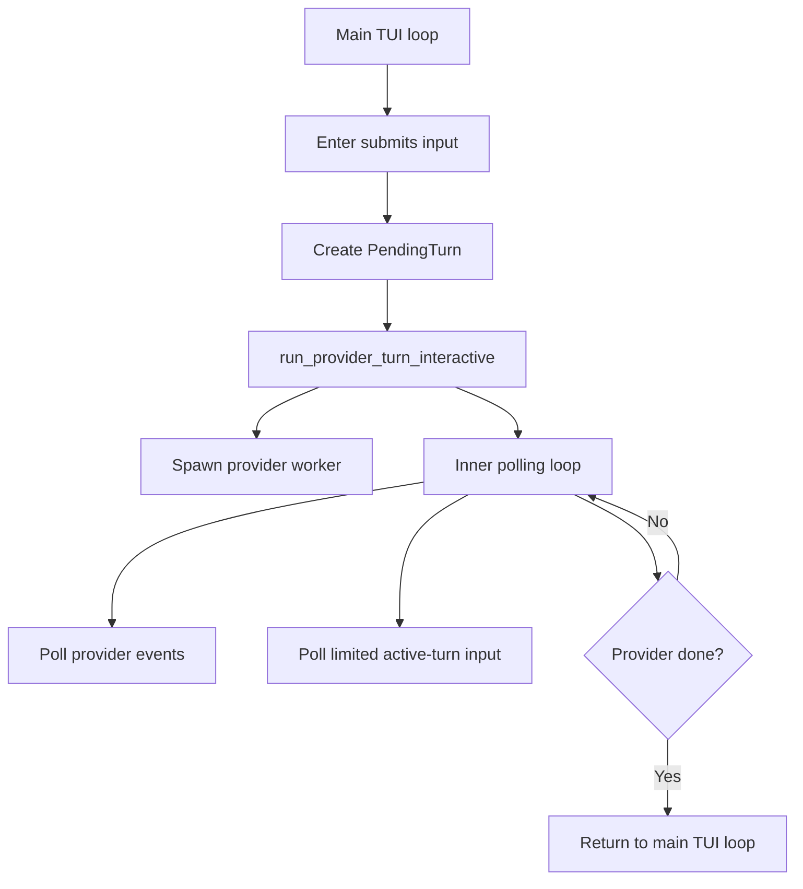
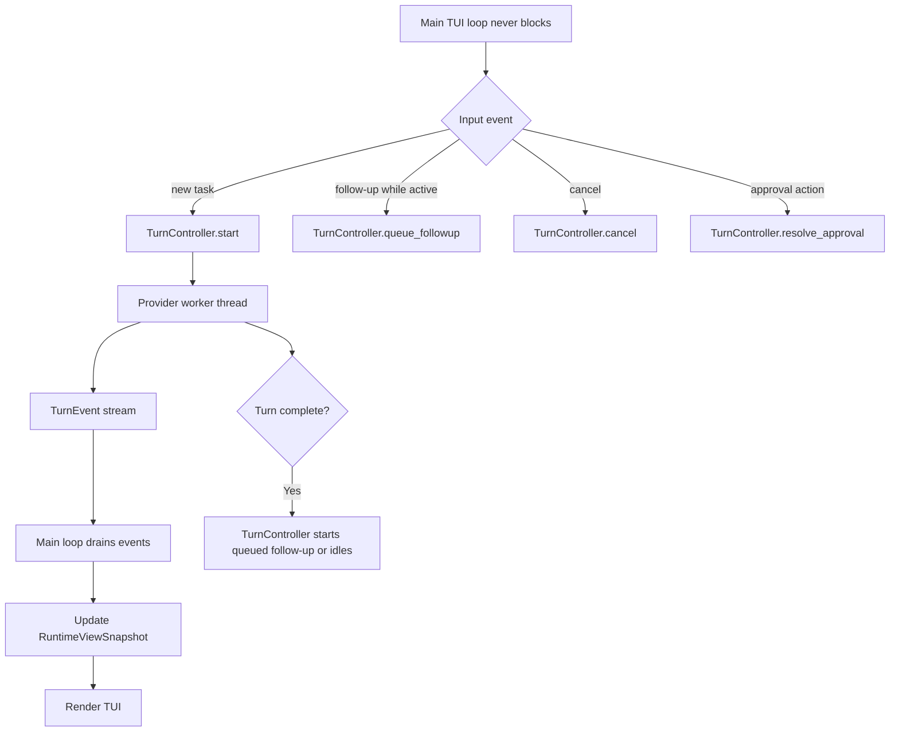
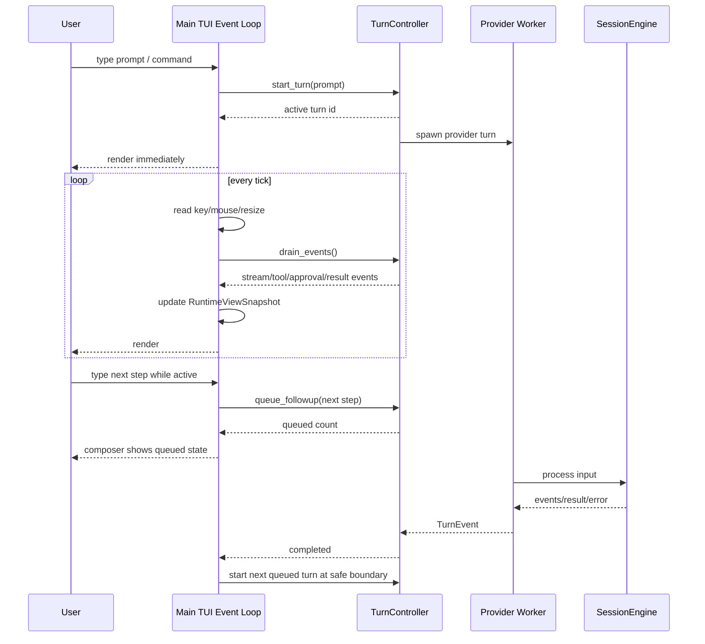
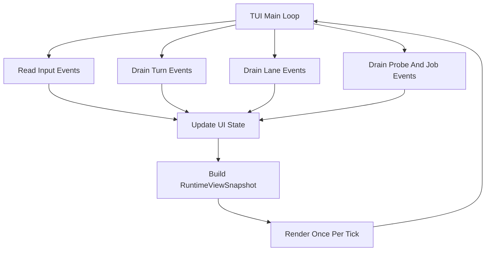
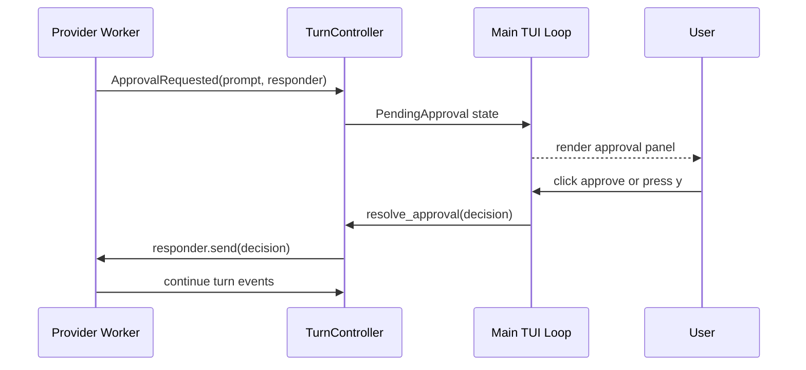
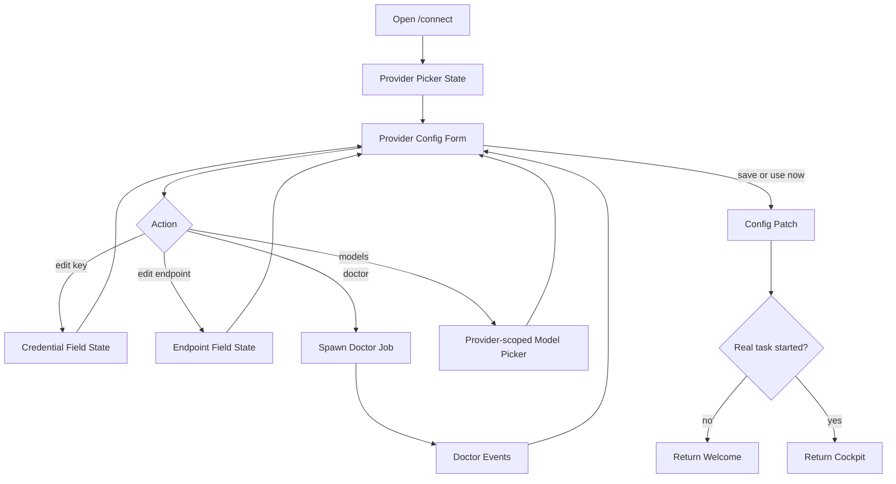
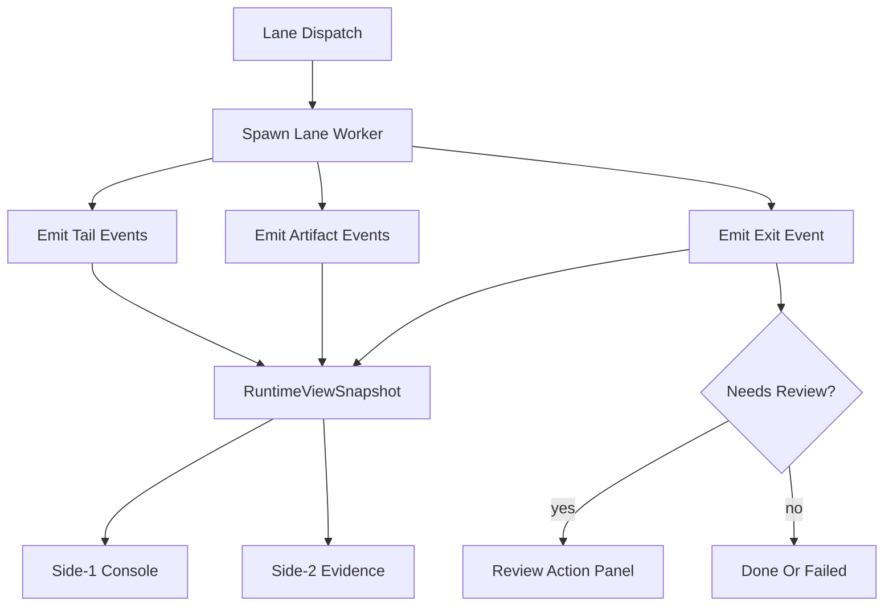

# 生产级编码闭环架构

English version: [production-coding-loop-architecture.md](production-coding-loop-architecture.md)

最后更新：2026-06-07

## 目标

RoboCode 要成为生产可用的编程工具，而不只是终端聊天界面。产品必须解决当前 AI coding
工具的共性痛点：

- 用户不知道 agent 现在在做什么；
- active turn 会阻塞用户继续输入；
- context 越来越大，导致质量下降或 provider 返回 413；
- model/provider 设置很难理解；
- diff、test、失败原因和 next action 分散；
- multi-agent 容易启动，但很难监督；
- TUI 逻辑和 runtime 逻辑混在一起，未来换 UI 或重构成本高。

这份文档定义生产级 coding loop 的实现架构，以及核心 runtime 与 UI 系统之间的分层契约。

## 产品结果

普通用户应该可以：

1. 打开 RoboCode 后停留在安静的 welcome composer，直到真正开始工作。
2. 通过直接操作面板配置 provider/model；如果还没开始编码任务，配置后回到 welcome
   composer。
3. 发起一个编码任务。
4. 用明确、丰富的活动文案看到 RoboCode 正在做什么。
5. 当前 turn 运行时，仍能继续输入 follow-up。
6. 看到流式输出、tool request、编辑、测试命令和失败。
7. 基于清楚证据批准或拒绝高风险操作。
8. 在信任完成前检查 diff/test/context evidence。
9. 遇到 provider/model/context 错误时，看到可执行恢复动作。
10. 把工作交给 Codex、Claude、shell、tmux 或未来 ACP lanes，同时保持统一 task/evidence
    视图。

## 分层契约

RoboCode 应拆成四个概念层。

### 1. Runtime Core

归属：

- `robocode-core`
- `robocode-types`
- `robocode-model`
- `robocode-tools`
- `robocode-permissions`
- `robocode-session`
- `robocode-workflows`

职责：

- session 和 provider turn 编排；
- tool calls 和 permission checks；
- transcript 写入和 durable audit；
- workflow task 和 memory state；
- provider telemetry 和错误分类；
- ContextBundle 构造与压缩；
- AgentTask、AgentLane、Evidence、Decision、Budget、CredentialHandle facts；
- 当非 TUI caller 也需要相同行为时，承载 lane lifecycle state。

Runtime core 不能：

- 依赖终端宽高；
- 渲染 ANSI、边框或 layout；
- 从 UI 文本反推业务状态；
- 暴露明文 secret；
- 编造 UI-only 的 health、cost、token、task 或 diagnostic 值。

### 2. Product View Model

这一层是 UI 无关的稳定契约。当前可以放在 `robocode-types`，等多个 UI surface 都需要后，
也可以拆成 `robocode-ui-model` 这类小 crate。

职责：

- `RuntimeViewSnapshot`：任意 UI 可读取的完整只读快照；
- `ActivityLine`：用户可读的当前工作状态；
- `ComposerState`：输入是启动任务、排队 follow-up，还是编辑 focused panel；
- `TaskListView`：按 operator urgency 排序的 active tasks；
- `EvidenceView`：最新 diff/test/diagnostic/context/lane evidence；
- `ProviderSetupView`：provider/model setup fields 和 actions；
- `ContextView`：included sources、omitted sources、budgets、pressure、compaction
  notes；
- `CommandAction`：可执行动作，包含 label、shortcut、enabled state 和 side-effect
  class。

Product view model 必须 deterministic 且可序列化。未来 desktop、web、IDE 或 API surface
应该能使用同一 snapshot，而不 import `robocode-cli/src/tui`。

### 3. UI Shell

当前归属：

- `robocode-cli/src/tui`

职责：

- keyboard、mouse、resize、terminal IO 和 focus routing；
- 把 view model 渲染成 terminal frames；
- 组合 overlays、panels、side screens 和 preview fixtures；
- 提交给 core commands 前的本地 input buffering；
- deterministic visual previews 和 screenshots。

TUI 不能：

- 直接调用 tools；
- 绕过 `SessionEngine`；
- 当 runtime snapshot 已存在时，靠 scraping transcript text 推断 active work；
- 拥有 provider/model 语义；
- 拥有 permission decisions；
- 拥有 context compaction 逻辑；
- 创建无法在 TUI 外表示的长期产品状态。

### 4. Adapter And Extension Boundary

归属：

- provider descriptors 和未来 provider plugins；
- MCP、skills、hooks、Codex/Claude lanes、shell/tmux/PTY lanes、未来 ACP adapters。

职责：

- 声明 capabilities、auth needs、trust level、mutation boundaries；
- 把事件写入共享 runtime fact layer；
- mutating work 使用 permission gates；
- 产出 evidence 和 doctor/probe 结果；
- credential 保持在 handle 后面。

Adapters 不能在 AgentTask、Evidence、Permission 和 Transcript 契约之外创建隐藏工作路径。

## 生产级 Coding Loop

生产级 loop 是“可以作为真实编程工具使用”的最低门槛。

### Intake

- Composer 始终可见。
- Welcome surface 上，provider/model/config panels 不算 session start。
- Cockpit surface 上，active provider work 不能冻结 composer。Follow-up input 要可见地
  queued 或 staged。

### Route

Core 把每次输入分类为：

- chat/explain；
- plan/spec；
- edit；
- test；
- review；
- lane delegation；
- configuration；
- diagnostics/recovery。

这个分类应该成为可见的 `TaskEnvelope`，而不是藏在 transcript prose 里。

### Context

昂贵或大范围工作前，RoboCode 构造 ContextBundle：

- 当前用户任务；
- 显式选择或推断的文件；
- 最新 diff；
- diagnostics；
- 最近测试；
- task 和 memory summaries；
- recent lane summaries；
- provider/model limits；
- budget 和 context pressure。

长日志和大 transcript 进入 summary + tail。原始 audit 数据保留在 prompt path 之外。

### Execute

Provider turns、tool calls、tests 和 lane work 都更新同一个 AgentTask store。UI 消费
snapshot，不再从不同 transcript 片段各自猜状态。

### Gate

Mutating actions 经过 permission gates。Approval UI 应展示：

- action；
- path/scope；
- risk；
- preview/diff/evidence；
- default action；
- keyboard 和 mouse controls。

### Verify

完成必须有证据：

- changed files；
- diff summary；
- test command、exit code、duration、tail；
- diagnostics；
- provider usage 和 error metadata；
- lane artifacts；
- 视觉工作的 screenshots。

### Resolve

每个 task 以明确 next action 结束：

- done；
- apply；
- discard；
- retry；
- inspect；
- switch model；
- reduce context；
- ask user；
- blocked。

## 交互要求

### Activity Language

活动文案描述 RoboCode 角色，不描述 provider 内部状态。

推荐角色名：

- Operator
- Planner
- Context Builder
- Builder
- Tester
- Reviewer
- Lane Supervisor
- Release Captain

示例：

- `Planner is shaping the task`
- `Context Builder is trimming logs`
- `Builder is editing src/config.rs`
- `Tester is running cargo test`
- `Reviewer is checking diff evidence`
- `Operator is waiting for approval`
- `Lane Supervisor is watching codex lane`

不要展示假百分比。只有和真实阶段或已知完成数量绑定时才显示 progress。

### Input Queueing

Provider turn active 时：

- 普通文本输入仍可用；
- `Enter` 将 follow-up 入队；
- queued follow-up 在 activity line 或 composer hint 中可见；
- 显式 interrupt/cancel 仍可用；
- queued work 只在当前 turn 到达安全边界后执行。

### Streaming And Scrollback

- Assistant 内容按 chunk 流式显示。
- 用户位于底部时 transcript 才 auto-follow。
- 用户向上滚动后冻结 auto-follow，直到跳回最新内容或发送新输入。
- 最新 activity row 出现在最新对话内容下方，不使用 blocking center card。

### Provider And Model Setup

`/connect` 配置 provider，`/models` 切换已激活模型。

`/connect` 流程：

1. provider list；
2. auth method：API key、网页登录、本地 endpoint、无需 key；
3. key/login/endpoint field；
4. doctor；
5. default model；
6. active models；
7. save/use now/cancel。

`/models` 流程：

- 只显示已配置 providers；
- 只显示已激活 models；
- 按 provider 分组；
- favorites 置顶且不重复；
- recent models 其次；
- model 后面的 provider 名用 dim text；
- Enter 立即切换。

## 错误恢复契约

错误应转换为产品动作：

| Error | User-facing action |
| --- | --- |
| missing key | 打开对应 provider 的 `/connect` |
| model unavailable | 打开 `/models`，展示兼容的已配置模型 |
| HTTP 413/context too large | 压缩 ContextBundle，展示 omitted sources，用 smaller bundle retry |
| `Argument list too long` | oversized payload 不走 argv，改用 stdin/temp file 后 retry |
| directory used as file | 展示 path 和预期 action |
| rate limit | 展示 retry-after 或替代 provider/model |
| tool-call replay mismatch | retry 前修复 provider message history |
| permission denied | 展示被拒 action、reason 和安全替代方案 |

除非需要立即 operator 决策，错误应作为 inline transcript/evidence events 出现。

## Core Refactor Targets

### Plan 模式卡输入的根因

当前 TUI 已经有 provider worker/channel，但异步边界还不够彻底。问题不是“完全没有多线程”，而是
主 UI 事件循环在提交普通输入后进入 `run_provider_turn_interactive`，直到 provider turn 结束前都在
这个函数内部自循环。

现状可以理解为：



这会带来几个体验问题：

- active turn 期间不是完整主事件循环，只是一个专用 inner loop；
- 输入、命令面板、配置面板、scrollback、side screen、resize、approval 都需要在 inner loop
  里重复实现一遍；
- `/plan` 本身是 immediate command，但 plan mode 下的下一条普通请求仍会进入 provider turn；
  如果 provider 长时间返回、streaming 不连续、等待工具/权限或错误恢复卡住，用户就感觉“plan 模式卡输入”；
- queued input 目前主要依赖 `PendingTurn.queued_inputs`，但它不是 core-visible turn queue，
  也不是主 UI loop 的一等事件。

结论：这是**异步架构边界放错位置**，不是简单加一个线程就能根治。

### 一步到位解决方案：TurnController

把 provider turn 从“提交输入后阻塞等待的函数”改成“主事件循环旁边的长期任务控制器”。

目标结构：



必须做到：

1. `run_provider_turn_interactive` 不再拥有 UI event loop。
2. TUI 主循环每次 tick 做三件事：读取用户事件、drain turn events、render snapshot。
3. Provider worker 只能通过事件通道发回：
   - stream delta；
   - approval request；
   - tool status；
   - task snapshot patch；
   - final result；
   - error/recovery action。
4. 用户输入永远先进入主循环：
   - 没 active turn：启动新 turn；
   - 有 active turn：进入 queued follow-up；
   - 是 `/plan on/off`、`/models`、`/connect`、scroll、resize、help：立即处理，不等待 provider。
5. Approval 不再调用阻塞式 `prompt_for_tui_approval` 子循环，而是变成 `InteractionPanel::Approval`
   或 `PendingApproval` 状态，由主循环继续处理键盘/鼠标。
6. queued follow-up 要进入 core-visible state，至少在 `RuntimeViewSnapshot` 里可见，后续可迁到
   `robocode-core` 的 turn queue。
7. Plan mode 只是 permission policy，不应该改变输入并发模型：
   - plan mode 下 mutating tools 被 permission layer 阻止；
   - 用户仍然可以继续输入下一步；
   - 如果当前 turn 在计划，下一条输入进入 queue 或显式 interrupt/replace。

这套方案的本质是：**UI loop 永不等模型，模型只是后台事件源**。

### Plan 输入卡死的一步到位实施方案

不要继续做下面这些局部修补：

- 只把 `ACTIVE_TURN_REPAINT_INTERVAL` 调小；
- 再包一层 thread，但仍在 `handle_submitted_input` 里等待结果；
- 在 `poll_active_turn_input` 里补更多快捷键；
- 在 `prompt_for_tui_approval` 里继续维护第二套键鼠循环。

这些都会让交互分叉越来越多。正确做法是一次性把 TUI 改成“单主循环 + 后台 turn runtime”：



代码层面的落点：

1. 新增 `robocode-cli/src/tui/turn_controller.rs`。
   - 负责 `start_turn`、`queue_followup`、`cancel`、`resolve_approval`、`drain_events`。
   - 持有 active turn id、worker channel、queued follow-ups、pending approval sender、last error。
   - 对 TUI 暴露纯状态，不直接 draw terminal。
2. 把 `run_provider_turn_interactive` 拆掉。
   - worker 部分迁到 `TurnController::start_turn`。
   - event drain 部分迁到主循环 tick。
   - 结果处理不再返回 `Vec<EngineEvent>` 给同步调用栈，而是变成 `TurnEvent::Completed(events)`。
3. `handle_enter` 不再等待 provider。
   - 空闲时：提交当前 input，创建 active turn，然后立刻返回主循环；
   - active turn 时：提交当前 input 到 queue，然后立刻返回主循环；
   - `/plan on/off`、`/connect`、`/models` 仍然是普通 UI 事件，不受 active turn 阻塞。
4. `prompt_for_tui_approval` 改成非阻塞状态。
   - 删除内部 `loop { event::read() }`；
   - provider worker 发 `TurnEvent::ApprovalRequested { prompt, response }`；
   - TUI 设置 `InteractionPanel::Approval`；
   - 用户键盘/鼠标事件由主循环处理，最后调用 `TurnController::resolve_approval`。
5. `PendingTurn.queued_inputs` 升级为 controller/runtime state。
   - TUI 可以继续通过 snapshot 显示 queued count；
   - 后续迁到 `robocode-core` turn queue 时不用再改 UI 语义。
6. streaming 只做 append delta，不触发布局子循环。
   - 主循环统一控制 render cadence；
   - transcript auto-follow 只在 scroll 位于底部时开启；
   - 用户滚动历史时 streaming 不抢 scroll。

必须补的测试：

- `/plan` / `/plan on` / `/plan off` 不创建 active provider turn；
- slow fake provider 运行时仍可输入并 queue follow-up；
- active turn 中 Enter 入队后 composer 立即清空并显示 queued count；
- provider completed 后按顺序启动 queued follow-up；
- provider error 后不会吞掉 queued input，第一条 queued input 回到 composer 或保留在 queue；
- approval request 不阻塞普通键鼠事件，resize/scroll/输入仍能处理；
- plan mode 下 mutating tool 被权限层拒绝，但 composer 不锁死；
- `Ctrl-C` cancel 后 active turn 清理、queue 策略明确；
- streaming 时用户 scroll up 后不会被强制跳到底部。

人工验收脚本：

1. 进入 TUI，执行 `/plan on`。
2. 输入一个长规划任务。
3. 模型思考/streaming 期间继续输入“下一步先列文件结构”，按 Enter。
4. 预期：输入框立即清空，界面显示 queued 1，仍可滚动 transcript。
5. 当前 turn 完成后，queued prompt 自动开始，或在设置为 manual queue policy 时等待确认。
6. 触发 approval 时，approval 作为面板显示；鼠标、快捷键、resize、scroll 不丢事件。

这才是根治标准：**同一套主事件循环处理所有输入；provider、lane、approval、streaming 都只是事件源。**

### 不卡 UI 的异步边界总表

下表是后续实现必须遵守的架构契约。任何新增流程只要可能等待网络、文件、shell、agent、
provider、LSP、MCP 或用户审批，都不能在 TUI 主事件循环里同步等待。

| 可能卡住的位置 | 风险 | 目标设计 | UI 行为 |
| --- | --- | --- | --- |
| provider request | 网络慢、stream 间隔长、超时 | worker thread + `TurnEvent` channel + cancel token | composer 可输入，follow-up 可入队 |
| streaming render | 高频 delta 导致重绘撕裂 | append delta + render cadence throttle | scrollback 不被抢到底部 |
| approval | 当前 `event::read` 子循环接管输入 | `PendingApproval` state + response callback | 鼠标、resize、scroll、输入都继续走主循环 |
| `/plan` turn | 规划很久导致不能输入下一步 | plan 是 permission policy，turn 仍走 `TurnController` | 下一步进入 queue 或 interrupt |
| `/connect`/`/models` | 表单/doctor/model 查询卡住 welcome | panel state + async doctor/probe event | 配置后回 welcome，不启动会话 |
| ContextBundle build | 大 repo、长日志、压缩耗时 | background context job + progress events | 显示 context building，可取消 |
| shell/tool execution | 命令卡住或输出很大 | job worker + bounded tail + artifact file | tail 流式显示，输入不阻塞 |
| delegated lane | tmux/external agent 长任务 | lane worker + event adapter + heartbeat | side-1/side-2 更新，主 composer 可用 |
| LSP/MCP/plugin probe | 外部进程/IO 卡住 | timeout-bound probe worker | panel 显示 probing/unavailable |
| release/test smoke | 长命令、高输出量 | job id + tail + evidence artifact | 可继续输入、可查看历史 |

#### 主循环事件模型



主循环只做短任务：读事件、drain channel、更新状态、渲染。所有长任务都通过 event/callback
回主循环。

#### 非阻塞 Approval 回调



Approval panel 是状态，不是新的 input loop。

#### Provider Setup 与 Doctor



Doctor、probe、live smoke 都是 job，不允许让 provider 设置面板卡死。

#### Lane Worker 与 Evidence 回调



Lane 不能直接改 TUI state；它只能发事件，事件被归一成 `AgentTask`、`Evidence` 和
`NextAction`。

### P0: Runtime Snapshot Boundary

引入或正式化 UI-independent snapshot：

```text
RuntimeViewSnapshot
  session
  provider_status
  composer_state
  activity
  active_tasks
  lanes
  context
  evidence
  commands
  panels
```

TUI 最终应渲染这个 snapshot，而不是在一个结构里混合 runtime queries、transcript
heuristics、provider details、lane projections 和 local-only state。

### P0: Activity Engine

把 operator activity language 移到可复用函数：由 AgentTask、ContextBundle、
provider status 和 lane facts 映射到 `ActivityLine`。

TUI 可以做动画，但不应该独自决定产品文案。

### P0: Active-Turn Input Queue

Provider work 期间保持 TUI input 可编辑。Queued follow-ups 存入 core-visible queue，
或映射到明确 pending-turn command structure，让行为能在 terminal rendering 外测试。

### P0: Context Failure Recovery

Provider request building 必须保护过大 context：

- hard cap prompt payload；
- 带 reason summary/omit sources；
- shell/lane 路径不通过 argv 传大 payload；
- 413 和 argv-too-long 映射为可 retry action。

### P0: Evidence Completion View

增加统一 completion evidence model：

- latest changed files；
- latest test result；
- latest diff summary；
- latest diagnostics；
- latest context bundle pressure；
- latest lane artifacts；
- next action。

### P1: Provider Setup Forms

Provider config overlays 要变成真实字段编辑器：

- key add/update/delete；
- endpoint edit/reset；
- auth method selection；
- default model；
- active model list；
- doctor；
- save/cancel/use now。

### P1: Lane Isolation And Budgets

每个 lane 声明：

- worktree/workspace；
- writable scope；
- env vars；
- service ports；
- cache dirs；
- database scope；
- setup/verify/cleanup commands；
- token/cost/time limits。

## 建议下个版本切片

名称：**Production Coding Loop Foundation**

P0 交付：

1. Runtime snapshot boundary 文档与初始 DTO。
2. 用 role-based activity language 替换 provider-leaking thinking copy。
3. Active-turn follow-up queue 在 composer/activity 中可见。
4. Streaming + scrollback 行为有文档、测试和 previews 覆盖。
5. Context-too-large 和 argv-too-long 的常见路径恢复。
6. edit/test/provider failure 后展示 evidence summary。
7. Provider/model setup panels 保持 welcome mode，直到真实任务开始。

P1 交付：

1. Provider focused edit form。
2. ContextBundle inspect panel。
3. Side-2 evidence detail。
4. Lane budget 和 isolation preflight。

## 测试策略

每个 production-loop release 应包含：

- AgentTask priority、ActivityLine mapping、ContextBundle compaction、provider error
  classification、queued input state 的 unit tests；
- welcome、active turn、queued follow-up、model picker、provider setup、evidence summary、
  side screens 的 TUI preview tests；
- deterministic coding smoke：request -> edit -> approve -> test -> evidence；
- provider 行为变化时，真实 DeepSeek smoke，并总结 token 和可用 cost；
- 413/context pressure 和 argv-too-long recovery 的 failure smoke；
- macOS Terminal 与 iTerm2 的 resize/scrollback manual checks；
- touched files 的 scoped `git diff --check`，以及正常 cargo checks。

## Definition Of Done

这个领域的功能只有满足以下条件才算完成：

- core behavior 能在 TUI 之外表示；
- TUI 从稳定 snapshot 或明确 event 渲染；
- 用户能看到正在做什么、改了什么、有什么证据、下一步做什么；
- 没有 fake 或不可执行的可见控件；
- config changes 不会意外启动真实 session；
- 可见 UX 有截图或 deterministic previews；
- tests 覆盖 success 和 failure states。
