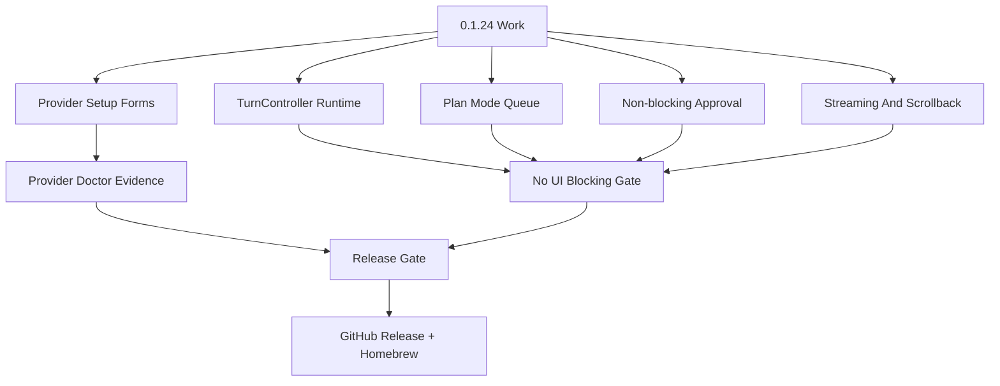

# RoboCode 0.1.24 Plan - Provider Setup And Daily Coding Reliability

Chinese version: [release-0.1.24-plan.zh-CN.md](release-0.1.24-plan.zh-CN.md)

0.1.24 is an interaction-quality release. The goal is to make RoboCode usable
as a daily coding tool before expanding more agent surfaces: provider setup must
be understandable, model switching must be trustworthy, provider failures must
show a concrete recovery path, and provider/plan/tool/lane background work must
not freeze TUI input.

This plan is upgraded to the **Provider Setup + Non-blocking Operator Loop
Gate**. If plan mode, approval, streaming, doctor, lanes, context building, or
provider turns can still take over the main input loop, 0.1.24 is not complete.

This version uses `docs/spec-review-0.1.24.md` as the spec review gate. All P0
gaps in that document must be closed before release. If a P0 item is explicitly
deferred, the release status must record the reason, risk, and mitigation; it
must not be described as shipped behavior.

## Goals

- `/connect` is a real setup flow, not a command-help page:
  provider picker -> API key entry when needed -> provider-scoped model picker
  -> save provider/model -> provider doctor output in transcript.
- `/models` only shows configured providers and active/favorite models. Provider
  descriptor defaults remain available inside the provider-scoped setup picker,
  but unconfigured providers do not appear as runnable choices in global
  `/models`.
- Provider doctor shows readiness: key env status, endpoint, default model,
  known model candidates, setup command, model command, and live smoke command.
- Provider/model failures give specific next actions: open `/models`, reconnect
  provider, run doctor, run live smoke, or switch to fallback.
- DashScope Coding Plan and Token Plan stay first-class provider families with
  the official endpoint/model snapshots captured in provider docs.
- Daily-loop, Plan mode, package, TUI regression, and live DeepSeek development
  scenario evidence stay in the mandatory release gate. Additional provider
  smoke can validate DashScope Coding Plan, DashScope Token Plan, and other
  registered providers when their credentials are available.
- Introduce `TurnController` or an equivalent runtime controller so provider
  turns, approval, streaming, queued follow-ups, cancellation, and result/error
  handling become events consumed by the main event loop.
- In plan mode, normal input must remain available: pressing `Enter` during an
  active turn queues the follow-up, queued count is visible, and the queued work
  runs at a safe boundary or waits behind an explicit policy.
- Approval must be non-blocking panel state. It must not keep using a blocking
  keyboard/mouse read loop.
- ContextBundle builds, doctor/probe, shell/tool execution, lanes, and release
  smoke should expose tail, status, evidence, and cancel/timeout through
  job/events.

## Key Release Flow



## Non-Goals

- Do not introduce a new provider UI framework.
- Do not store raw API keys in config.
- Do not turn every descriptor model into a global runnable option before the
  provider has been configured.
- Do not hide main-loop blocking by only lowering poll intervals or adding more
  active-turn shortcuts.
- Do not let approval, provider setup, doctor, context building, or lane
  execution use nested input loops.
- Do not mark a release complete when the mandatory release gate or postpublish
  Homebrew/GitHub asset gate has not run.

## Verification

```bash
cargo fmt --check
scripts/tdd-testing-contract-smoke.sh
cargo clippy --workspace --all-targets -- -D warnings
cargo test --workspace --quiet
scripts/tui-turn-controller-smoke.sh
scripts/tui-regression.sh docs/previews/generated
scripts/plan-mode-smoke.sh /tmp/robocode-0124-plan-mode-smoke
scripts/daily-loop-smoke.sh /tmp/robocode-0124-daily-loop-smoke
scripts/provider-live-smoke.sh --provider deepseek --model deepseek-v4-flash
scripts/provider-live-smoke.sh --provider dashscope-coding-plan --model qwen3.6-plus
scripts/release-smoke.sh --quick --provider-smoke dashscope-coding-plan --provider-smoke-model qwen3.6-plus
scripts/release-gate.sh --version 0.1.24
scripts/release-gate.sh --version 0.1.24 --phase postpublish
```

The DeepSeek development smoke is mandatory for release completion and requires
`DEEPSEEK_API_KEY`. Extra provider smoke commands are optional diagnostics for
provider-specific changes and require the corresponding key env var.

## Manual Acceptance

- Run `/plan on`, submit a long planning task, keep typing the next step while
  the model runs, and confirm the composer does not lock, queued count is
  visible, and the queue advances according to policy.
- Scroll history during provider-turn streaming and confirm auto-follow does not
  steal the viewport until the user returns to the bottom.
- When approval appears, verify keyboard, mouse, resize, and scroll are still
  handled by the same main loop.
- Run doctor/probe inside `/connect`; the panel must not freeze, and save/cancel
  should return to welcome if no real task has started.
- Capture a real screenshot or deterministic preview for every visible
  interaction point.
