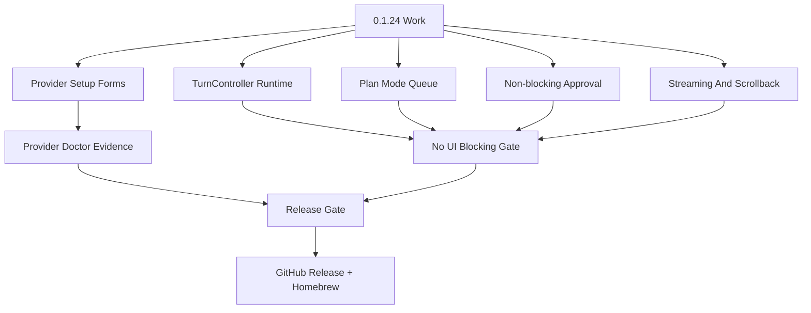

# Viden 0.1.24 计划 - Provider 设置与日常编程可靠性

English version: [release-0.1.24-plan.md](release-0.1.24-plan.md)

0.1.24 是一个交互质量版本。目标是在继续扩展更多 agent surface 之前，先让
Viden 更适合日常编程：provider 设置必须能看懂，model 切换必须可信，provider
失败必须给出具体恢复路径，并且任何 provider/plan/tool/lane 后台工作都不能卡住 TUI
输入。

本版本计划升级为 **Provider Setup + Non-blocking Operator Loop Gate**。如果 Plan 模式、
approval、streaming、doctor、lane、context build 或 provider turn 仍能接管主输入循环，
0.1.24 不能视为完成。

本版本以 `docs/spec-review-0.1.24.zh-CN.md` 作为 spec review gate。发布前必须关闭
其中的 P0 差异；如果某项 P0 被明确推迟，release status 必须记录原因、风险和替代防护，
不能把它当作已完成能力。

## 目标

- `/connect` 是真实设置流程，而不是命令帮助页：
  provider picker -> 需要时进入 API key 输入 -> provider-scoped model picker
  -> 保存 provider/model -> 把 provider doctor 输出写回 transcript。
- `/models` 只显示已经配置过的 provider 和 active/favorite models。Provider
  descriptor defaults 仍可在 provider-scoped 设置 picker 里选择，但未配置 provider
  不会出现在全局 `/models` runnable choices 里。
- Provider doctor 展示 readiness：key env 状态、endpoint、默认 model、known model
  candidates、setup command、model command 和 live smoke command。
- Provider/model 失败给出具体 next action：打开 `/models`、重新连接 provider、运行
  doctor、运行 live smoke，或切到 fallback。
- DashScope Coding Plan 和 Token Plan 继续作为一等 provider family，官方 endpoint/model
  snapshot 保存在 provider 文档中。
- Daily-loop、Plan 模式、package、TUI regression 和真实 DeepSeek 开发场景 evidence
  都保留在强制 release gate 里。DashScope Coding Plan、DashScope Token Plan 和其他
  provider 可在有凭据时追加 provider smoke。
- 引入 `TurnController` 或等价 runtime 控制器，把 provider turn、approval、streaming、
  queued follow-up、cancel 和 result/error 处理全部变成主事件循环消费的事件。
- Plan 模式下普通输入必须继续可用：active turn 期间 `Enter` 入队，queued count 可见，
  当前 turn 完成后在安全边界继续执行或等待明确策略。
- Approval 必须是非阻塞面板状态，不允许继续使用阻塞式键鼠读取循环。
- ContextBundle build、doctor/probe、shell/tool、lane 和 release smoke 都必须以 job/event
  方式暴露 tail、status、evidence 和 cancel/timeout。

## 版本关键流程



## 非目标

- 不引入新的 provider UI framework。
- 不把明文 API key 写入配置。
- 不在 provider 配置前把 descriptor 里的所有 model 都当作全局 runnable option。
- 不通过调小 poll interval 或补更多 active-turn 快捷键来掩盖主循环阻塞问题。
- 不让 approval、provider setup、doctor、context build 或 lane 执行使用嵌套 input loop。
- 如果强制 release gate 或发布后的 Homebrew/GitHub assets gate 没跑，不把版本标记为完成。

## 验证

```bash
cargo fmt --check
scripts/tdd-testing-contract-smoke.sh
cargo clippy --workspace --all-targets -- -D warnings
cargo test --workspace --quiet
scripts/tui-turn-controller-smoke.sh
scripts/tui-regression.sh docs/previews/generated
scripts/plan-mode-smoke.sh /tmp/viden-0124-plan-mode-smoke
scripts/daily-loop-smoke.sh /tmp/viden-0124-daily-loop-smoke
scripts/provider-live-smoke.sh --provider deepseek --model deepseek-v4-flash
scripts/provider-live-smoke.sh --provider dashscope-coding-plan --model qwen3.6-plus
scripts/release-smoke.sh --quick --provider-smoke dashscope-coding-plan --provider-smoke-model qwen3.6-plus
scripts/release-gate.sh --version 0.1.24
scripts/release-gate.sh --version 0.1.24 --phase postpublish
```

DeepSeek 开发场景 smoke 是发布完成必跑项，需要 `DEEPSEEK_API_KEY`。其他 provider
smoke 是 provider-specific 改动的可选诊断，需要对应 key env var。

## 手工验收

- `/plan on` 后提交长规划任务，模型运行期间继续输入下一步，确认 composer 不锁死、
  queued count 可见、当前 turn 完成后 queue 按策略推进。
- provider turn streaming 期间滚动历史，确认 auto-follow 不抢回底部；回到底部后才恢复。
- approval 出现时，用键盘、鼠标、resize、scroll 验证仍然走同一个主循环。
- `/connect` 内运行 doctor/probe，不应让面板冻结；保存或取消后，如果没有真实任务，仍回到
  welcome。
- 每个可见交互点输出一张真实截图或 deterministic preview。
