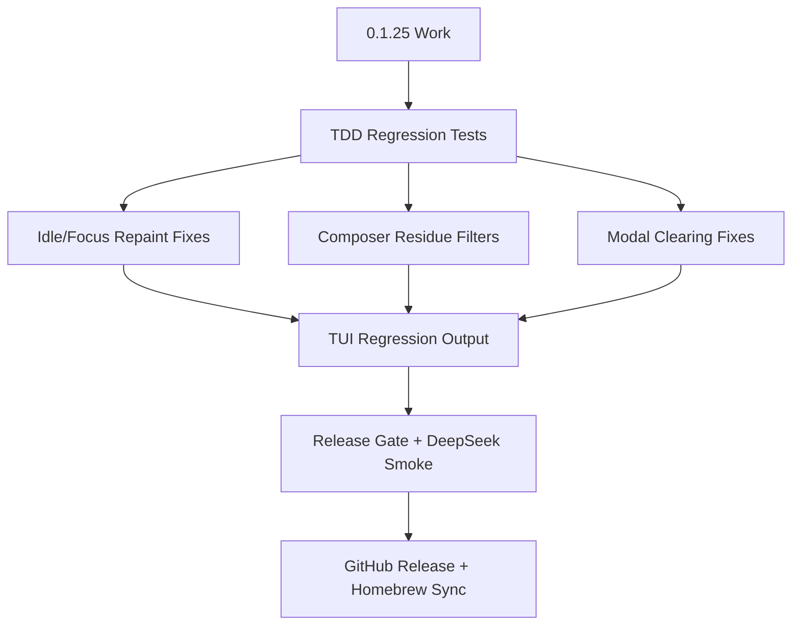

# RoboCode 0.1.25 Plan - TUI Display Cleanup And Idle Stability

Chinese version: [release-0.1.25-plan.zh-CN.md](release-0.1.25-plan.zh-CN.md)

`0.1.25` is a stabilization release for the TUI display layer. It keeps the
`0.1.24` non-blocking operator loop intact, then closes the next visible class
of P0/P1 issues: idle repaint drift, focus/paste repaint gaps, composer
protocol residue, welcome modal clearing, popup placement, borders, scrollback,
caret placement, and release screenshot evidence.

This release is gated by [spec-review-0.1.25.md](spec-review-0.1.25.md), the
TUI zero-bug gate, deterministic preview output, the daily coding loop smoke,
and the mandatory DeepSeek development scenario. The TDD contract check for
this release is `scripts/tdd-testing-contract-smoke.sh`.

## Goals

- Keep the TUI alive and readable after long idle periods, terminal focus
  changes, sleep/wake, paste events, and mouse protocol reports.
- Prevent terminal protocol tails such as SGR mouse/color sequences from being
  rendered as composer text.
- Keep `/connect`, provider setup, `/models`, command palette, approval, and
  lane modals from leaking underlying welcome/cockpit text.
- Preserve scrollback behavior: streaming output must not pull the user away
  from history, and the transcript badge must show when newer output exists.
- Regenerate release screenshot evidence under `0.1.25` names.
- Keep the release gate strict: format, TDD contract, clippy, workspace tests,
  TUI regression, plan-mode smoke, daily-loop smoke, package smoke, live
  DeepSeek development smoke, GitHub assets, and Homebrew validation.

## Non-Goals

- Do not add new provider families in this release.
- Do not redesign the TUI architecture or replace the renderer.
- Do not move the active-turn queue from TUI state into core in this patch.
- Do not mark visual issues as polish when they affect input, scrollback,
  approval, provider/model selection, or status understanding.

## Key Release Flow



## Verification

```bash
cargo fmt --check
scripts/tdd-testing-contract-smoke.sh
cargo clippy --workspace --all-targets -- -D warnings
cargo test --workspace --quiet
scripts/tui-turn-controller-smoke.sh
scripts/tui-regression.sh docs/previews/generated
scripts/plan-mode-smoke.sh /tmp/robocode-0125-plan-mode-smoke
scripts/daily-loop-smoke.sh /tmp/robocode-0125-daily-loop-smoke
scripts/deepseek-dev-scenario-smoke.sh --model deepseek-v4-flash
scripts/release-gate.sh --version 0.1.25
scripts/release-gate.sh --version 0.1.25 --phase postpublish
```

The DeepSeek development scenario is mandatory for release completion and must
record input, output, total tokens, and estimated CNY cost in the release
status.

## Manual Acceptance

- Leave a live planning/coding session idle, then return focus; the screen must
  repaint fully instead of leaving only partial rows.
- Use mouse/focus/paste interactions during a live turn; terminal protocol
  residue must not appear in the composer.
- Open `/connect` from the welcome screen; the modal must clear the full frame
  and must not leak `commands /connect` hint text behind it.
- Open `/models`, provider setup, command palette, and approval at common
  terminal sizes; selection rows, borders, and bottom hints must stay aligned.
