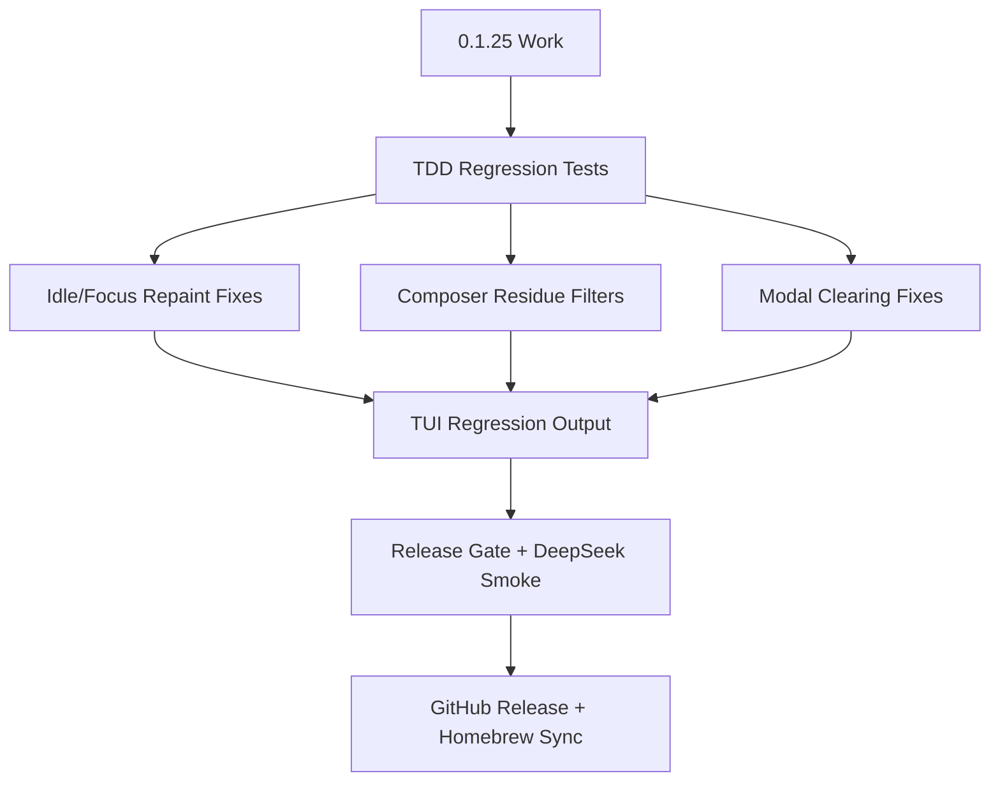

# Viden 0.1.25 计划 - TUI 显示清理与 Idle 稳定性

英文版： [release-0.1.25-plan.md](release-0.1.25-plan.md)

`0.1.25` 是 TUI 显示层稳定性版本。它保留 `0.1.24` 已经落地的非阻塞
operator loop，然后集中关闭下一批 P0/P1 可见问题：长时间 idle 后重绘漂移、
focus/paste 后不重绘、composer 混入终端协议尾巴、welcome modal 清屏不完整、
popup 位置、边框、scrollback、光标位置和 release 截图证据。

本版本由 [spec-review-0.1.25.zh-CN.md](spec-review-0.1.25.zh-CN.md)、TUI
zero-bug gate、确定性 preview output、daily coding loop smoke 和强制 DeepSeek
development scenario 共同把关。本版本的 TDD 合同检查是
`scripts/tdd-testing-contract-smoke.sh`。

## 目标

- 长时间 idle、terminal focus 切换、sleep/wake、paste event、mouse protocol report
  后，TUI 仍能保持可读并完整重绘。
- 类似 SGR mouse/color sequence 的 terminal protocol 尾巴不能渲染成 composer 文本。
- `/connect`、provider setup、`/models`、command palette、approval 和 lane modal
  不能漏出底层 welcome/cockpit 文本。
- 保持 scrollback 行为：streaming output 不能把查看历史的用户拉回底部，transcript
  badge 必须标记有新输出。
- 重新生成 `0.1.25` 命名的 release screenshot evidence。
- 保持严格 release gate：format、TDD contract、clippy、workspace tests、TUI
  regression、plan-mode smoke、daily-loop smoke、package smoke、真实 DeepSeek
  development smoke、GitHub assets 和 Homebrew validation。

## 非目标

- 本版本不新增 provider family。
- 本版本不重做 TUI 架构，也不替换 renderer。
- 本版本不把 active-turn queue 从 TUI state 下沉到 core。
- 只要影响输入、scrollback、approval、provider/model selection 或状态理解，就不能把显示问题标成 polish。

## 发布流程



## 验证

```bash
cargo fmt --check
scripts/tdd-testing-contract-smoke.sh
cargo clippy --workspace --all-targets -- -D warnings
cargo test --workspace --quiet
scripts/tui-turn-controller-smoke.sh
scripts/tui-regression.sh docs/previews/generated
scripts/plan-mode-smoke.sh /tmp/viden-0125-plan-mode-smoke
scripts/daily-loop-smoke.sh /tmp/viden-0125-daily-loop-smoke
scripts/deepseek-dev-scenario-smoke.sh --model deepseek-v4-flash
scripts/release-gate.sh --version 0.1.25
scripts/release-gate.sh --version 0.1.25 --phase postpublish
```

DeepSeek development scenario 是 release completion 的强制项，release status 必须记录
input、output、total tokens 和估算人民币费用。

## 人工验收

- 让 live planning/coding session 长时间 idle 后回到终端；屏幕必须完整重绘，不能只剩局部行。
- live turn 中使用鼠标、focus、paste；terminal protocol residue 不能出现在 composer。
- 在 welcome screen 输入 `/connect`；modal 必须按全屏清理，不能漏出 `commands /connect`
  hint 文本。
- 在常见 terminal 尺寸下打开 `/models`、provider setup、command palette 和 approval；
  选中行、边框和底部提示必须保持对齐。
