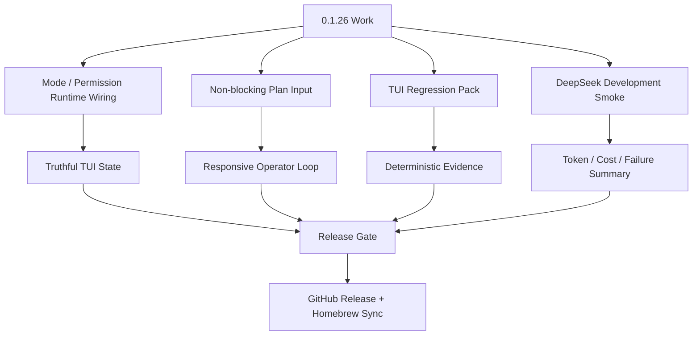

# RoboCode 0.1.26 Plan - TUI Regression Pack And Mode Stability

Chinese version: [release-0.1.26-plan.zh-CN.md](release-0.1.26-plan.zh-CN.md)

`0.1.26` is the first 0.1.x exit-stability release. It keeps the `0.1.25`
display cleanup intact, then turns the most fragile interaction states into a
deterministic regression pack while finishing the Mode / Permission split in the
visible TUI.

This release is not a feature-expansion sprint. It is complete only when the
main coding surface stays responsive while work is running, visible mode chips
are truthful, Plan mode cannot lock input, and the release gate includes a real
DeepSeek development scenario with token/cost evidence.

## Goals

- Turn the core TUI states into deterministic preview and smoke evidence:
  welcome, main idle, thinking, streaming, approval, provider setup, model
  picker, command palette, side-1, side-2, error recovery, and resize.
- Finish the Mode / Permission UI wiring:
  - top bar, composer, `/status`, selector copy, and transcript system rows must
    read from the real runtime snapshot;
  - `/mode plan`, `/mode build`, `/permissions ask`, `/permissions auto_edit`,
    `/permissions read_only`, and `/permissions full_access` must update the UI
    immediately;
  - static top-bar/composer chips are not allowed when runtime state exists.
- Fix Plan-mode input lockups. Provider turns, Plan turns, tool jobs, approval
  requests, doctor/probe jobs, and lane jobs must not block composer input,
  command panels, cancel, resize, or scrollback.
- Preserve queued input behavior: while work is active, the operator can type
  the next step, queue it, cancel the current turn, open command panels, or
  inspect history without losing the draft.
- Add mandatory real development smoke using the local DeepSeek configuration.
  The smoke must record prompt, model, elapsed time, token usage, estimated CNY
  cost, failure class, and final outcome.
- Continue the TUI zero-bug stabilization pass:
  - long-idle black/partial screen;
  - stale thinking rows after completion;
  - lost or frozen scrollback;
  - abrupt center-screen error notices;
  - modal/popup overlap with the composer;
  - misleading side-panel state.

## Non-Goals

- Do not add new provider families.
- Do not broaden multi-agent orchestration or ACP/MCP mutation behavior.
- Do not redesign the full TUI renderer unless required to remove a P0 input or
  display blocker.
- Do not expose unimplemented permission levels in the UI. `auto` remains a
  target level until routine-command classification is enforced by runtime
  policy.
- Do not publish if GitHub Release assets, Homebrew sync, or post-publish smoke
  are stale.

## Key Release Flow



## Mode / Permission Acceptance

- `RuntimeSnapshot` is the source of truth for work mode and permission level in
  the visible TUI.
- `/status` shows `Work mode` and `Permission level`; it does not present Plan
  as a normal permission option.
- Top bar and composer reflect mode changes in the same turn where the command
  succeeds.
- `/permissions` only presents permission levels. `/mode` only presents work
  modes. `/connect` and `/models` remain provider/model panels, not modes.
- Regression tests cover switching `build -> plan -> build` and permission
  changes while the TUI is visible.

## Non-blocking Plan Acceptance

- Plan mode can run a provider request without locking the composer.
- Tool execution, approvals, provider doctor, context build, and lane updates
  emit events/callbacks into the main TUI loop instead of owning the input loop.
- The operator can scroll history while streaming is active; new output is
  indicated without snapping the viewport away from history.
- Cancel and retry remain reachable during active work.
- At the end of a Plan response, RoboCode returns to a usable composer state and
  does not silently start implementation.

## Implementation Checkpoints

- TUI runtime snapshots now carry work mode and permission level into visible
  state.
- The top bar and composer render the current runtime mode/permission instead
  of static `Build` / `Ask` placeholders.
- `/plan on` updates visible TUI state to `Plan` / `Read Only` in the same
  command turn.
- During an active provider turn, normal text is queued as the next prompt,
  active-turn slash commands are kept out of the prompt queue, and `/cancel`,
  `/stop`, `/interrupt`, or `/abort` request cancellation.
- The active-turn composer footer switches from send/regenerate actions to
  queue/cancel/history actions.

## DeepSeek Development Smoke

The release must include a live development smoke using the user's configured
DeepSeek environment. It should be a small but real coding task, not a fake
fallback-provider unit test.

Required evidence:

- provider and model;
- prompt summary;
- elapsed time;
- request/response token counts when available;
- estimated CNY cost;
- whether tools were used;
- tests run and result;
- failure class if any: auth, rate limit, timeout, context overflow,
  compatibility, model unavailable, tool/runtime error, or unknown.

## Verification

```bash
cargo fmt --all --check
scripts/tdd-testing-contract-smoke.sh
cargo clippy --workspace --all-targets -- -D warnings
cargo test --workspace --quiet
scripts/tui-turn-controller-smoke.sh
scripts/tui-regression.sh docs/previews/generated
scripts/plan-mode-smoke.sh /tmp/robocode-0126-plan-mode-smoke
scripts/daily-loop-smoke.sh /tmp/robocode-0126-daily-loop-smoke
scripts/deepseek-dev-scenario-smoke.sh --model deepseek-v4-flash
scripts/release-gate.sh --version 0.1.26
scripts/release-gate.sh --version 0.1.26 --phase postpublish
```

The release status must summarize token usage and estimated cost for the
DeepSeek smoke. If token usage is unavailable from a provider response, the
status must say that explicitly and include the fallback estimate method.

## Manual Acceptance

- Start on the welcome screen, run `/connect`, `/models`, `/mode plan`,
  `/mode build`, and `/permissions ask`; the UI must stay on the correct
  surface and chips must update immediately.
- Run a Plan prompt, type the next instruction while RoboCode is planning, then
  verify the draft/queue survives until the turn completes.
- While streaming, scroll up through transcript history; new output must not
  force the viewport back to the bottom.
- Leave a live session idle, return focus, and resize the terminal; the screen
  must not collapse into partial rows or black gaps.
- Trigger a provider or tool error; it should render inline in the transcript or
  side evidence, not as an abrupt center-screen blocker.
