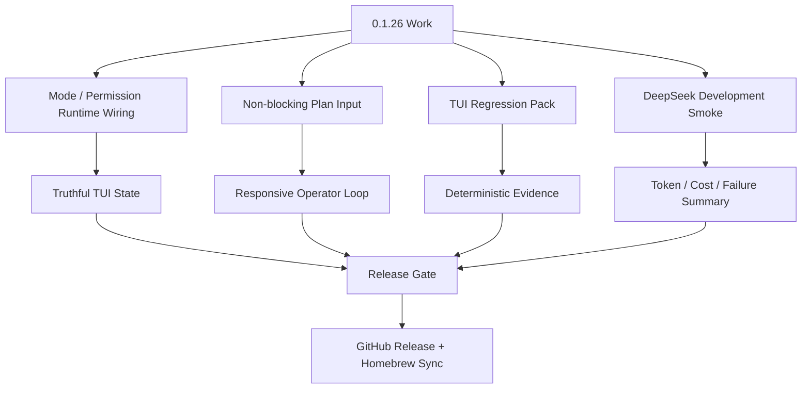

# Viden 0.1.26 计划 - TUI 回归包与模式稳定性

英文版： [release-0.1.26-plan.md](release-0.1.26-plan.md)

`0.1.26` 是 0.1.x 收口稳定性的第一个版本。它保留 `0.1.25` 已经完成的显示清理，
然后把最脆弱的交互状态做成确定性回归包，同时完成 Mode / Permission 拆分在可见 TUI
里的剩余实现。

本版本不是扩功能 sprint。只有当主 coding surface 在后台工作运行时仍然可输入、可取消、
可滚动，mode chips 真实可信，Plan 模式不会卡输入，并且 release gate 包含真实 DeepSeek
开发场景 token/费用证据时，才能算完成。

## 目标

- 把核心 TUI 状态变成确定性 preview 和 smoke evidence：welcome、main idle、
  thinking、streaming、approval、provider setup、model picker、command palette、
  side-1、side-2、error recovery 和 resize。
- 收口 Mode / Permission UI 联动：
  - 顶栏、composer、`/status`、selector 文案和 transcript system rows 必须读取真实
    runtime snapshot；
  - `/mode plan`、`/mode build`、`/permissions ask`、`/permissions auto_edit`、
    `/permissions read_only`、`/permissions full_access` 成功后 UI 必须立即同步；
  - runtime state 已存在时，不允许顶栏或 composer 继续显示静态假 chip。
- 修复 Plan 模式卡输入问题。provider turn、Plan turn、tool job、approval request、
  doctor/probe job 和 lane job 都不能阻塞 composer 输入、command panel、cancel、resize
  或 scrollback。
- 保留 queued input 行为：后台工作运行时，操作者仍能输入下一步、排队、取消当前 turn、
  打开命令面板或查看历史，草稿不能丢。
- 增加使用本地 DeepSeek 配置的强制真实开发 smoke。该 smoke 必须记录 prompt、model、
  耗时、token、估算人民币费用、失败分类和最终结果。
- 继续 TUI zero-bug 稳定性收口：
  - 长时间 idle 后黑屏或只剩局部行；
  - thinking 结束后状态不清；
  - scrollback 丢失或冻结；
  - 错误提示过于突兀地挡在中间；
  - modal/popup 遮挡 composer；
  - side panel 状态误导。

## 非目标

- 本版本不新增 provider family。
- 本版本不扩展多 Agent 编排，也不打开 ACP/MCP mutation 行为。
- 除非为了消除 P0 输入或显示 blocker，否则不重做整个 TUI renderer。
- 不在 UI 暴露尚未实现的 permission level。`auto` 等 runtime policy 具备安全的
  routine-command classification 后再开放。
- GitHub Release assets、Homebrew sync 或 post-publish smoke 过期时，不能发布。

## 发布流程



## Mode / Permission 验收

- `RuntimeSnapshot` 是可见 TUI 中 work mode 和 permission level 的唯一事实源。
- `/status` 显示 `Work mode` 和 `Permission level`；不能把 Plan 当成普通 permission option。
- 命令成功的同一轮里，顶栏和 composer 必须同步 mode/permission 变化。
- `/permissions` 只展示 permission levels；`/mode` 只展示 work modes。`/connect` 和
  `/models` 继续是 provider/model 面板，不是 mode。
- 回归测试覆盖 `build -> plan -> build`，以及 TUI 可见时的 permission 切换。

## Plan 非阻塞验收

- Plan 模式可以运行 provider request，但 composer 不能锁死。
- Tool execution、approval、provider doctor、context build 和 lane update 必须通过
  events/callbacks 回到主 TUI loop，不能独占 input loop。
- streaming 过程中操作者可以滚动历史；有新输出时给提示，但不能强行把 viewport 拉到底部。
- active work 期间 cancel 和 retry 仍可触达。
- Plan response 结束后，Viden 必须回到可输入状态，且不能悄悄开始实现。

## 实现检查点

- TUI runtime snapshot 已经把 work mode 和 permission level 带入可见状态。
- 顶栏和 composer 渲染当前 runtime mode/permission，不再显示静态 `Build` / `Ask`
  占位。
- `/plan on` 在同一轮命令里把可见 TUI 状态同步为 `Plan` / `Read Only`。
- active provider turn 期间，普通文本会作为下一条 prompt 排队；active-turn
  slash command 不会混入 prompt 队列；`/cancel`、`/stop`、`/interrupt` 或 `/abort`
  会请求取消当前 turn。
- active-turn composer footer 会从 send/regenerate 操作切换成 queue/cancel/history
  操作。

## DeepSeek 真实开发 Smoke

本版本必须包含一次使用用户已配置 DeepSeek 环境的真实开发 smoke。它应该是一个小但真实的
coding task，不能是 fallback-provider 假测试。

必须记录：

- provider 和 model；
- prompt 摘要；
- elapsed time；
- request/response token counts（可用时）；
- 估算人民币费用；
- 是否使用工具；
- 测试命令和结果；
- 失败分类：auth、rate limit、timeout、context overflow、compatibility、
  model unavailable、tool/runtime error 或 unknown。

## 验证

```bash
cargo fmt --all --check
scripts/tdd-testing-contract-smoke.sh
cargo clippy --workspace --all-targets -- -D warnings
cargo test --workspace --quiet
scripts/tui-turn-controller-smoke.sh
scripts/tui-regression.sh docs/previews/generated
scripts/plan-mode-smoke.sh /tmp/viden-0126-plan-mode-smoke
scripts/daily-loop-smoke.sh /tmp/viden-0126-daily-loop-smoke
scripts/deepseek-dev-scenario-smoke.sh --model deepseek-v4-flash
scripts/release-gate.sh --version 0.1.26
scripts/release-gate.sh --version 0.1.26 --phase postpublish
```

Release status 必须汇总 DeepSeek smoke 的 token 使用和估算费用。如果 provider response
没有返回 token usage，status 必须明确说明，并写出 fallback 估算方法。

## 人工验收

- 从 welcome screen 开始，执行 `/connect`、`/models`、`/mode plan`、`/mode build`、
  `/permissions ask`；UI 必须停留在正确 surface，chips 必须立即同步。
- 运行一个 Plan prompt，在 Viden planning 时输入下一步，确认 draft/queue 在 turn
  完成前不会丢。
- streaming 时向上滚动 transcript 历史；新输出不能强行把 viewport 拉到底部。
- 让 live session idle 一段时间后回到终端并 resize；屏幕不能坍缩成局部行或黑块。
- 触发 provider 或 tool error；错误应该内联展示在 transcript 或 side evidence 中，
  不能突兀地作为中心 blocker 挡住操作。
