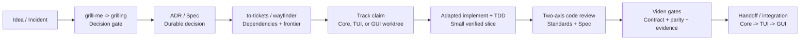

# Matt Pocock Skills 在多人大型工程中的推行方案

> 状态：研究与治理建议（proposal），不是已实施能力。
> 调研快照：2026-07-20。Matt Pocock 上游 `main` 固定核对到
> [`9603c1cc8118d08bc1b3bf34cf714f62178dea3b`](https://github.com/mattpocock/skills/commit/9603c1cc8118d08bc1b3bf34cf714f62178dea3b)，
> `skills` CLI 固定核对到
> [`777599e1159e401b11ce4c8a57c20f09a8f1596e`](https://github.com/vercel-labs/skills/commit/777599e1159e401b11ce4c8a57c20f09a8f1596e)。
> 本文只使用官方仓库、官方源码和 Agent Skills 规范作为外部事实来源。

## English abstract

Matt Pocock's skills should be adopted as a curated, versioned workflow library,
not as an organizational policy engine. For Viden, repository and nested
`AGENTS.md` files remain authoritative; selected skills are project-scoped,
pinned, adapted to Viden's Core/TUI/GUI ownership and permission rules, validated
in CI, piloted on low-risk work, and upgraded only through reviewed pull requests
with a tested rollback path. `grill-me` is the human-invoked entry point, while
`grilling` is the reusable interview discipline; together they form a decision
gate, not an authorization to implement.

## 结论

建议采用“**策略归 Viden、流程借 Matt、证据进 CI**”的模式：

1. **不做全员全局最新版安装。** 团队基线使用 project-scoped 安装，技能和
   `skills-lock.json` 随仓库评审、合并与回滚。官方 CLI 也把项目作用域定义为
   “committed with your project, shared with team”；全局作用域只适合个人跨项目使用
   [来源](https://github.com/vercel-labs/skills/blob/777599e1159e401b11ce4c8a57c20f09a8f1596e/README.md#L90-L104)。
2. **只引入经过准入的技能。** 第一批以 `grill-me`/`grilling`、`research`、
   `diagnosing-bugs`、`tdd`、`code-review` 为主；会改 issue、文件、Git 或分支的
   `setup-matt-pocock-skills`、`implement`、`triage`、`wayfinder` 必须先做 Viden
   适配和权限审查。
3. **`AGENTS.md` 永远高于技能。** Viden 的权限、只读/实现边界、独立 worktree、
   Core/TUI/GUI 独占写作用域、Core contract freeze 与固定集成顺序继续由
   [仓库级 `AGENTS.md`](../../AGENTS.md) 和
   [三分支计划](../parallel-development-plan.md) 负责；skill 只能实现这些规则，
   不能重定义或绕过它们。
4. **以版本化 PR 升级，而不是在开发机上执行浮动更新。** 官方 CLI 的
   `skills update` 语义是更新到 latest
   [来源](https://github.com/vercel-labs/skills/blob/777599e1159e401b11ce4c8a57c20f09a8f1596e/README.md#L106-L172)；
   因此 Viden 应固定 CLI 版本和上游 tag/受控镜像，只允许升级机器人或技能维护者
   提交可审查 PR。

## 一、上游事实：Matt Pocock Skills 是什么

以下是“上游事实”，不是 Viden 的推行承诺。

### 1. 小、可改、可组合，而不是完整工程治理平台

Matt Pocock 将这些 skills 定位为日常工程用的小型、可适配、可组合、模型无关的
流程单元，并明确鼓励使用者自行修改；它们不是接管整个研发过程的框架
[来源](https://github.com/mattpocock/skills/blob/9603c1cc8118d08bc1b3bf34cf714f62178dea3b/README.md#L15-L19)。
这意味着大型团队仍需自己提供权限模型、所有权、版本、审计和发布门禁。

上游把技能分为 `engineering`、`productivity`、`misc`、`personal`、
`in-progress`、`deprecated` 六个桶；只有 `engineering` 和 `productivity` 属于
promoted 集合，其他桶不应作为正式分发内容
[来源](https://github.com/mattpocock/skills/blob/9603c1cc8118d08bc1b3bf34cf714f62178dea3b/AGENTS.md#L1-L18)。
因此，团队不能把“安装仓库里所有目录”当成安全的默认策略。

### 2. User-invoked 与 model-invoked 是两个不同层次

上游把技能按调用权分为：

- **User-invoked**：只有人显式输入名字才能启动，主要承担编排；
- **Model-invoked**：人或模型都可启动，主要承载可复用的执行纪律。

上游要求 user-invoked skill 可以调用 model-invoked skill，但不能再调用另一个
user-invoked skill
[来源](https://github.com/mattpocock/skills/blob/9603c1cc8118d08bc1b3bf34cf714f62178dea3b/.agents/invocation.md#L1-L23)。
这是团队授权模型的重要边界：自动触发的“纪律”不应悄悄升级成会创建 issue、
提交代码或改变发布状态的“命令”。

### 3. `grill-me` 与 `grilling` 的角色

`grill-me` 不是完整访谈实现，而是人显式触发的薄 wrapper；它只要求运行
`/grilling`
[来源](https://github.com/mattpocock/skills/blob/9603c1cc8118d08bc1b3bf34cf714f62178dea3b/skills/productivity/grill-me/SKILL.md#L1-L7)。
`grilling` 才是可复用的模型调用纪律，其核心约束是：

- 沿决策树逐分支消除歧义；
- 每次只问一个问题，并给出推荐答案；
- 环境中可查的事实先查，不把事实问题甩给人；
- 决策权属于用户；
- 用户确认达成共同理解前，不执行方案。

这些行为直接来自
[`grilling/SKILL.md`](https://github.com/mattpocock/skills/blob/9603c1cc8118d08bc1b3bf34cf714f62178dea3b/skills/productivity/grilling/SKILL.md#L1-L12)。
所以在团队语义中，它应被定义成 **decision-readiness gate**，而不是“问完就自动开工”。

### 4. 上游已经提供大型任务的部分协作原语

- `setup-matt-pocock-skills` 会为每个仓库配置 issue tracker、triage labels 与
  domain docs，并先探查现有 `AGENTS.md`、`CLAUDE.md`、ADR 和 monorepo 信号
  [来源](https://github.com/mattpocock/skills/blob/9603c1cc8118d08bc1b3bf34cf714f62178dea3b/skills/engineering/setup-matt-pocock-skills/SKILL.md#L9-L30)。
- `to-tickets` 要求按可独立验证的 tracer-bullet vertical slices 切票、显式记录
  blocking edges；宽重构使用 expand-contract，并以单个新 context window 可完成
  作为粒度约束
  [来源](https://github.com/mattpocock/skills/blob/9603c1cc8118d08bc1b3bf34cf714f62178dea3b/skills/engineering/to-tickets/SKILL.md#L25-L67)。
- `wayfinder` 把超出单会话容量的大任务表达为共享、可领取、有 blocking 和 frontier
  的决策地图，并明确默认是 planning、不是 implementation
  [来源](https://github.com/mattpocock/skills/blob/9603c1cc8118d08bc1b3bf34cf714f62178dea3b/skills/engineering/wayfinder/SKILL.md#L1-L71)。
- `code-review` 把 review 拆成 **Standards** 与 **Spec** 两条互不遮蔽的轴，并要求
  先固定 comparison point
  [来源](https://github.com/mattpocock/skills/blob/9603c1cc8118d08bc1b3bf34cf714f62178dea3b/skills/engineering/code-review/SKILL.md#L6-L23)。

这些是有价值的流程原语，但不包含 Viden 特有的 Core contract、三轨文件所有权、
permission mode、发布单元和证据矩阵。

### 5. 官方安装与更新能力

上游 README 的通用安装入口是 `npx skills@latest add mattpocock/skills`，随后选择技能
和目标 agent，并建议每仓库运行一次 setup
[来源](https://github.com/mattpocock/skills/blob/9603c1cc8118d08bc1b3bf34cf714f62178dea3b/README.md#L24-L56)。
`skills` CLI 支持：

- project/global 两种作用域；
- 指定 skill 与 agent；
- symlink 或 copy；
- 非交互 `-y`；
- `list`、`update`、`remove`；
- GitHub 仓库、具体 tree/path、Git URL 和本地路径。

命令和参数见官方
[`skills` CLI README](https://github.com/vercel-labs/skills/blob/777599e1159e401b11ce4c8a57c20f09a8f1596e/README.md#L11-L115)。
当前项目级 `skills-lock.json` 会记录 source、ref、skill path 和内容 hash；源码注明
该文件应提交进版本控制，并按名称排序以减少合并冲突
[来源](https://github.com/vercel-labs/skills/blob/777599e1159e401b11ce4c8a57c20f09a8f1596e/src/local-lock.ts#L5-L59)。
但 lockfile 是来源与内容跟踪证据，不应被当成 npm 式的绝对冻结：团队仍应固定 ref，
并提交实际 project skill 文件或使用受控镜像。CLI 本身也明确警告 skills 以 agent 的
完整权限运行，安装后应先审查再使用
[来源](https://github.com/vercel-labs/skills/blob/777599e1159e401b11ce4c8a57c20f09a8f1596e/src/add.ts#L1013-L1016)。

## 二、与 Viden 当前规则的适配差距

以下是“针对 Viden 的判断”。

| 上游默认行为 | 对 Viden 的风险 | Viden 适配要求 |
| --- | --- | --- |
| setup 在 `CLAUDE.md` 存在时优先编辑它 [来源](https://github.com/mattpocock/skills/blob/9603c1cc8118d08bc1b3bf34cf714f62178dea3b/skills/engineering/setup-matt-pocock-skills/SKILL.md#L63-L82) | Viden 明确规定根 `AGENTS.md` 是 canonical policy，`CLAUDE.md` 只能指向它 | 不直接运行原版 setup；预置 `docs/agents/*`，或维护只更新 `AGENTS.md` 的 Viden adapter |
| `implement` 要求自行使用 TDD、跑测试、review 并 commit [来源](https://github.com/mattpocock/skills/blob/9603c1cc8118d08bc1b3bf34cf714f62178dea3b/skills/engineering/implement/SKILL.md#L7-L15) | 未检查 worktree、track owner、dirty changes、Viden 验证矩阵，也未区分 committed/pushed/merged/released | wrapper 在任何写入前检查 branch/worktree/scope；按 [Viden handoff 标准](../../AGENTS.md) 报告每种状态；禁止隐式 push/merge/release |
| `to-tickets` 偏好 vertical slice | Core contract 和客户端实现可能被错误地放进同一并行写票 | ticket 必须额外声明 `track`、`exclusive scope`、`Core checkpoint` 和 contract request；跨轨需求按 Core -> TUI -> GUI 拆阻塞边 |
| `wayfinder` 会认领和修改 tracker | 安装 skill 本身不等于授权外部写操作 | 创建/关闭/分配 issue 前仍经过当前任务授权和 Viden permission gate；只读规划不得悄悄发布 issue |
| `handoff` 默认写 OS 临时目录 [来源](https://github.com/mattpocock/skills/blob/9603c1cc8118d08bc1b3bf34cf714f62178dea3b/skills/productivity/handoff/SKILL.md#L1-L16) | Viden 要求 durable artifacts、branch/worktree/HEAD、精确检查和 skipped gates | Viden handoff adapter 写入约定的持久位置或 tracker，并追加 Viden 必填字段；临时摘要只作传输缓存 |
| 自动/显式调用元数据具有 harness 差异 | 某个 agent 能加载不代表 Codex、Claude、Cursor 都会以同样方式触发 | 每个目标 harness 单独做 discovery、explicit invocation 与 implicit invocation 合约测试；不能只验证 YAML 语法 |

特别注意：Viden 的 [三分支开发计划](../parallel-development-plan.md) 要求先发布不可变的
`frontend-contract-v1` checkpoint，TUI/GUI 从该 checkpoint 起步，并固定按
Core -> TUI -> GUI 集成。任何通用 skill 的“并行化”建议都必须服从这一有向依赖，
不能把“可并行”误读成“可绕过合同冻结”。

## 三、建议的分层治理模型

### L0：Repository policy（最高权威）

由根与嵌套 `AGENTS.md`、架构文档、frontend contract、roadmap、开发标准组成。
这里定义权限、安全、不变量、ownership、worktree 和发布纪律。技能冲突时，L0 无条件胜出。

### L1：Curated skill baseline（团队基线）

只保存准入 allowlist、固定上游 ref、固定 CLI 版本、来源、hash 和内部 owner。
建议基线是 project-scoped，不把个人 `~/.agents` 或 `~/.codex` 当成团队依赖。

基线安装命令可以采用如下形态；这是未来实施示例，本研究任务没有执行安装：

```bash
npx skills@1.5.19 add \
  https://github.com/mattpocock/skills/tree/v1.1.0 \
  --skill grill-me \
  --skill grilling \
  --skill research \
  --skill diagnosing-bugs \
  --skill tdd \
  --skill code-review \
  --agent codex \
  --copy \
  --yes
```

`v1.1.0` 是当前核对到的 Matt Pocock 正式 release
[来源](https://github.com/mattpocock/skills/releases/tag/v1.1.0)，`1.5.19` 是当前核对到的
CLI release
[来源](https://github.com/vercel-labs/skills/releases/tag/v1.5.19)。正式落地时应重新核对版本，
且 CLI 版本、上游 tag、allowlist、lockfile 必须同一个 PR 更新。

### L2：Viden adapters（项目适配）

不建议直接在每位开发者机器上修改上游副本。应由 skills maintainer 维护少量适配层，
主要做四件事：

1. 在任何 mutation 前执行 permission、dirty tree、branch、worktree 与 scope preflight；
2. 把 ticket/spec/review/handoff 输出映射到 Viden 的持久文档和证据字段；
3. 把 Core/TUI/GUI ownership、contract request 和集成次序编入 completion criteria；
4. 屏蔽或改写与 Viden 冲突的默认动作，如自动选择 `CLAUDE.md`、临时 handoff、
   泛化的“full test suite”或未授权的 tracker/Git 操作。

适配后的技能应使用唯一名称或唯一 canonical path，避免同名 upstream、global 和 project
副本同时被发现。一个名称只能有一个团队权威实现。

### L3：Run evidence（运行证据）

每次关键 skill run 不必保存完整对话，但必须在 issue/PR/handoff 留下最小审计信息：

```text
Skill / version:
Source spec or issue:
Fixed point / Core checkpoint:
Track / owner / worktree:
Human decisions confirmed:
Files or external state changed:
Verification run:
Verification skipped and reason:
Next safe step:
```

这让流程可审计，同时避免把可能含敏感信息的完整 grilling transcript 永久化。

## 四、建议的端到端团队流程



在 Viden 中，各阶段的附加约束是：

1. **Idea/incident intake**：先判断是事实缺口还是决策缺口。事实交给 `research` 或
   `diagnosing-bugs`；只有决策才进入 `grilling`。
2. **Decision gate**：高风险架构、跨轨合同、权限/持久化/发布变化强制 grilling；
   小型机械改动可以豁免。必须记录“已共同理解”的明确确认。
3. **Durable decision**：涉及不变量或长期 trade-off 的内容落 ADR；普通行为落 spec。
   聊天不是 source of truth。
4. **Work graph**：每张票必须单窗口可完成、有验收标准、有 blocking edge，并标记
   Core/TUI/GUI 轨道。共享合同变化先产生 Core ticket 和 checkpoint。
5. **Claim and execute**：一张票只有一个 implementation owner；同一写作用域不得并发；
   每个 owner 使用独立 worktree。
6. **Review**：保留 Matt 的 Standards/Spec 双轴，但再增加 Viden contract、permission、
   docs/comments、evidence 四项检查；固定点使用 merge-base 或明确 checkpoint SHA。
7. **Integration**：只有验证证据完整、状态报告准确后才进入固定的 Core -> TUI -> GUI
   顺序；skill 完成不等于 branch 已 push、merge 或 release。

## 五、准入分级与试点

### A 级：可先试点的低风险纪律

| Skill | 初始用途 | 额外门禁 |
| --- | --- | --- |
| `grill-me` + `grilling` | 需求、设计、合同决策澄清 | 只问决策；确认前不执行；保留 decision summary |
| `research` | 一手来源调研并落盘 | 外部事实必须附 primary-source link；写作用域单文件 |
| `diagnosing-bugs` | 复现、缩小、假设、验证 | 默认只诊断；用户明确要求修复后才切 implementation |
| `tdd` | 行为改变的 red-green-refactor | 必须证明 initial red 与预期原因相符；使用 Viden focused gate |
| `code-review` | Standards/Spec 双轴评审 | 固定 comparison point；保持 read-only；添加 Viden contract 轴检查 |

### B 级：适配后试点的协作流程

`domain-modeling`、`to-spec`、`to-tickets`、`wayfinder`、`handoff`。这些能力会写文档或
tracker，必须先确定 source of truth、写入位置、授权方式和 Viden 必填字段。

### C 级：最后开放的高变更流程

`setup-matt-pocock-skills`、`implement`、`triage`、`improve-codebase-architecture`、
`resolving-merge-conflicts`。它们可能改变仓库政策入口、提交 Git、修改外部 tracker、
影响大量文件或处理冲突，应先完成 adapter、golden test、canary 和 rollback 演练。

### 90 天推行节奏

| 阶段 | 周期 | 范围 | 退出条件 |
| --- | --- | --- | --- |
| 0. Baseline | 第 1-2 周 | 盘点规则、选 5-6 个 A 级 skill、固定版本、建立 owner | allowlist、威胁模型、样例任务和回滚方案通过评审 |
| 1. Canary | 第 3-4 周 | 一个 Core 低风险任务 + 一个 TUI/GUI docs-only 任务 | 无越权 mutation；证据完整；团队能复现同一行为 |
| 2. Workflow | 第 5-8 周 | 接入 spec -> ticket -> TDD -> review -> handoff | 三轨 ticket 字段、CI、审计和 adapter 全部通过 |
| 3. Scale | 第 9-12 周 | 扩到更多 owner，并加入受控更新 PR | 指标优于基线且无严重策略冲突；完成一次升级与回滚演练 |

## 六、准入模板

每个候选 skill 提交一张 **Skill Adoption Card**：

```markdown
## Identity
- Name / internal alias:
- Upstream repository, tag, path, hash:
- Maintainer / CODEOWNER:

## Invocation and authority
- User-invoked or model-invoked:
- Trigger branches:
- Read-only or mutating:
- Required human approval:
- Allowed files, tools, network and external systems:

## Contract
- Inputs / prerequisites:
- Durable outputs:
- Completion criteria:
- Viden AGENTS.md rules implemented:
- Known conflicts with upstream defaults:

## Verification
- Schema validation:
- Golden scenarios:
- Negative / permission scenarios:
- Target harnesses:
- Rollback procedure:
```

卡片必须先回答“这个 skill 是否会改变行为”，再回答“是否好用”。

## 七、CI 与审计门禁

1. **格式门禁**：对每个 vendored skill 运行 Agent Skills 官方参考验证器
   `skills-ref validate <skill-dir>`；规范要求目录名与 `name` 一致，并说明可用该工具校验
   frontmatter
   [来源](https://agentskills.io/specification#validation)。
2. **来源门禁**：校验 allowlist、上游 tag/ref、`skills-lock.json` 和内容 hash；禁止未知
   skill、未审查本地改动和同名多来源碰撞。
3. **调用门禁**：分别测试显式调用、隐式调用和“不应调用”。重点验证 user-invoked
   wrapper 不被模型自行触发，model-invoked discipline 能被 wrapper 调用。
4. **权限门禁**：为 plan/read-only、dirty worktree、错误 track、重叠 scope、缺少批准、
   外部 tracker 写入、Git push/merge/release 建立 negative tests。
5. **Golden scenarios**：至少覆盖 grilling 单题顺序、事实先查、用户保留决策权、确认前
   不实施；TDD initial red；review 固定点；handoff 必填证据。
6. **跨 harness 门禁**：Codex、Claude Code 以及团队实际使用的其他 agent 各跑一遍
   discovery 与行为 smoke。Agent Skills 是共享格式，但可选字段的实现支持可能不同；
   官方规范也明确 `allowed-tools` 仍是 experimental、支持度可能变化
   [来源](https://agentskills.io/specification#allowed-tools-field)。
7. **变更审计**：skill、lockfile、adapter 和 golden transcript fixture 的 PR 必须由
   skills owner 与受影响 track owner 双重评审。机器检查不能代替语义评审。

## 八、升级与回滚

### 升级

1. 通过 GitHub release/API 监控上游，不在开发者启动脚本中自动更新。当前 CLI 的
   `check`、`update`、`upgrade` 进入同一更新路径，不能把 `check` 当只读审计命令
   [来源](https://github.com/vercel-labs/skills/blob/777599e1159e401b11ce4c8a57c20f09a8f1596e/src/cli.ts#L374-L381)。
2. 升级 PR 同时固定新的 CLI 版本、上游 tag/ref、allowlist 和 lockfile。
3. 展示上游 SKILL.md diff，逐条标出 Viden adapter 是否仍成立。
4. 运行格式、调用、权限、golden、跨 harness、Viden docs/check gates。
5. 先在一个低风险 worktree canary，再扩大团队默认基线。

### 回滚

1. 回滚到上一个已批准的 skill 目录与 `skills-lock.json`；
2. 恢复上一版 adapter 与 golden fixtures；
3. 重新运行 discovery 和关键负面权限场景；
4. 在 incident/upgrade PR 记录触发原因、影响任务和后续修复条件。

项目级、版本控制内的 skill 能用普通 Git revert 恢复；个人全局 latest 不能提供同等的
团队可复现性。这也是不把 global install 作为组织基线的核心原因。

## 九、度量：看交付结果，不看调用次数

建议先记录四周基线，再做同类任务对照；不要把“调用了多少次 skill”当成功指标。

| 维度 | 建议指标 |
| --- | --- |
| 对齐质量 | implementation 开始后的需求反转率、spec 补写次数、grilling 后未决分支数 |
| 工程质量 | escaped defects、reopen rate、回归测试缺失、review P0/P1 findings |
| 并发质量 | scope collision、错误 base/checkpoint、merge conflict、重复工作率 |
| 流程效率 | 从 ready 到 merge 的 lead time、review 等待、handoff 恢复时间、单票上下文重启次数 |
| 合规性 | 未授权 mutation、缺失 fixed point、缺失验证证据、错误状态声明、升级回滚成功率 |
| 人因 | false invocation、无效问题率、开发者满意度、skill 造成的额外认知负担 |

目标是提高正确率、可恢复性和并行吞吐，同时观察 token/time 开销；若只降低 cycle time
却提高返工或越权率，应判为失败。

## 十、反模式

- **全员执行 `npx skills@latest ... -g --all`**：个人环境漂移，无法在 PR 中审查或回滚。
- **把 skill 当成高于 `AGENTS.md` 的政策**：上游通用建议会覆盖 Viden 的安全和架构边界。
- **同名多份安装**：global、project、plugin 和本地 fork 同时存在，调用来源不确定。
- **原样运行 setup**：可能编辑错误的政策入口，并生成不符合 Viden 文档布局的配置。
- **把 grilling 变成形式主义**：对可查事实反复问人、一次问多题、用户确认前实施。
- **所有任务都强制 grilling**：低风险机械改动被人为拉长；门禁应按风险分级。
- **把 `implement` 当成无限授权**：skill 的流程描述不扩大用户授权，不得隐式 push、merge、
  release 或写外部系统。
- **只校验 YAML，不校验行为**：语法通过不等于调用正确、权限正确或完成标准正确。
- **用完整聊天记录替代 durable artifact**：对话难以审查，也可能泄露敏感信息；应保存决策、
  来源和证据指针。
- **自动追 `main`**：上游重构可能改变调用模型或副作用；大型团队必须通过升级 PR 消化。

## 十一、建议的 Viden 决策

建议批准一个受限试点，而不是立即全量推行：

1. 先建立 project-scoped 的 A 级 allowlist；
2. 指定一名 skills maintainer，并由 Core/TUI/GUI track owner 共同审核 adapter；
3. 将 `grill-me`/`grilling` 定义为高风险决策的前置 gate；
4. 将 `research`、`diagnosing-bugs`、`code-review` 保持 read-only-by-default；
5. `implement`、`setup`、`wayfinder` 在 Viden adapter 完成前不进入团队默认基线；
6. 以两个 canary 任务验证行为、权限、审计和回滚，再决定是否扩到 B/C 级。

这条路线保留了 Matt skills 最有价值的部分——短小、可组合、清晰 completion criteria、
共享语言与显式决策——同时把大型多人工程真正需要的所有权、版本、权限、证据和发布纪律
留在 Viden 自己的控制面。

## 主要一手来源

- [Matt Pocock skills README（固定 commit）](https://github.com/mattpocock/skills/blob/9603c1cc8118d08bc1b3bf34cf714f62178dea3b/README.md)
- [Matt Pocock skills repository rules（固定 commit）](https://github.com/mattpocock/skills/blob/9603c1cc8118d08bc1b3bf34cf714f62178dea3b/AGENTS.md)
- [`grill-me`（固定 commit）](https://github.com/mattpocock/skills/blob/9603c1cc8118d08bc1b3bf34cf714f62178dea3b/skills/productivity/grill-me/SKILL.md)
- [`grilling`（固定 commit）](https://github.com/mattpocock/skills/blob/9603c1cc8118d08bc1b3bf34cf714f62178dea3b/skills/productivity/grilling/SKILL.md)
- [Vercel `skills` CLI README（固定 commit）](https://github.com/vercel-labs/skills/blob/777599e1159e401b11ce4c8a57c20f09a8f1596e/README.md)
- [Agent Skills official specification](https://agentskills.io/specification)
- [Viden repository policy](../../AGENTS.md)
- [Viden Core/TUI/GUI parallel development plan](../parallel-development-plan.md)
- [Viden development standards](../development-standards.md)
