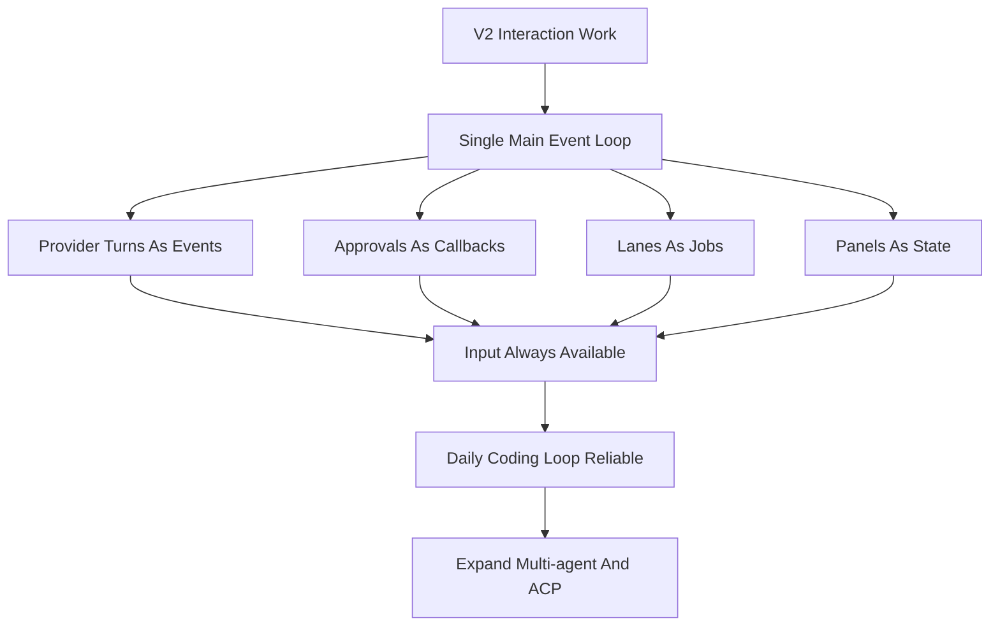

# RoboCode Staged Roadmap

## Purpose

This roadmap translates the full RoboCode product requirements into delivery
stages. It is intentionally derived from the target product, not from the
history of the current repository.

For the longer product strategy behind these delivery stages, see
[RoboCode Long-Term Roadmap](long-term-roadmap.md). This staged roadmap is the
delivery map; the long-term roadmap is the product and market map.

## Long-Term Positioning

RoboCode is not only a TUI and not only another coding-agent CLI. The long-term
positioning is:

> An out-of-the-box multi-agent orchestration runtime plus a token-efficiency
> optimization layer.

The TUI is the first primary product surface because it is the best fit for
dense state, approvals, sub-agent lanes, tests, diagnostics, and multi-screen
supervision. CLI automation, an API server, desktop, web, IDE adapters, and ACP
adapters should come only after the TUI cockpit and the shared runtime are
stable enough to reuse.

Long-term product pillars:

- Multi-agent orchestration: built-in planner, coder, reviewer, tester,
  researcher, and doc-writer roles, with support for Codex, Claude Code,
  DeepSeek, shell, MCP tools, and future ACP agents.
- Token-efficiency engine: task-specific context bundles, transcript
  compression, long-log compaction, tool-result deduplication, per-agent token
  budgets, and cost ceilings.
- Shared fact layer: agents read and write structured facts, events, artifacts,
  diffs, diagnostics, test results, and user constraints instead of passing full
  chat transcripts to each other.
- Multiple frontends: TUI first; CLI, API, IDE, web, and desktop surfaces reuse
  the same orchestration runtime instead of reimplementing agent logic.

## Stage Definitions

### V1: Local Core CLI

Goal:
Ship a reliable, local-first developer agent CLI with durable sessions,
permissions, and high-value local tools.

Required capabilities:

- interactive REPL
- startup configuration model
- provider abstraction
- file, search, shell, web, and Git tool families
- permission modes and approvals
- append-only transcript plus resume
- foundational slash commands

Exit criteria:

- users can run code-reading and code-editing workflows locally end to end
- tool calls, approvals, and transcript history remain auditable
- provider switching does not require core-engine changes
- sessions can be resumed reliably by project

### V2: Developer Enhancement Layer

Goal:
Turn the local CLI core into a more capable day-to-day TUI cockpit and
development assistant.

Required capabilities:

- broader command surface
- better session browsing and summaries
- stronger Git and diff workflows
- plugin-extensible provider runtime with dynamic provider loading
- LSP integration
- memory and task management
- richer TUI and interaction patterns
- live working-state feedback and a shared `AgentTask` view
- non-blocking TUI main event loop: provider turns, plan mode, approval,
  streaming, doctor, lanes, tools, and context builds must not freeze input,
  scrollback, resize, or command panels

Exit criteria:

- users can complete more of the development workflow without dropping to ad
  hoc shell usage
- provider growth does not require repeated core-engine changes
- semantic code assistance exists beyond grep and file editing
- session and task continuity feel deliberate instead of incidental
- users can always tell what the agent is doing, what evidence backs that
  state, and what the next available action is
- users can keep typing, queue next steps, scroll history, handle approvals, or
  cancel active work while any background task is running

### V3: Agent Orchestration And Token Efficiency Layer

Goal:
Upgrade RoboCode from a single-agent development assistant into a multi-agent
orchestration system, with token efficiency treated as a first-class product
capability.

Required capabilities:

- shared `AgentTask`, `AgentLane`, `Artifact`, `Evidence`, and `ContextBundle`
  models
- default planner -> worker -> reviewer -> tester workflow templates
- supervised lane runtime for external terminal coding tools such as Codex,
  Claude Code, DeepSeek-TUI, and shell jobs
- context bundle builder, semantic file selection, diff-aware context, and tool
  output compaction
- token budgets, model routing, cost dashboard, and visible context pressure
- TUI side screens backed by real agent lanes, tests, diagnostics, and next
  actions instead of decorative panels

Exit criteria:

- users can run multi-agent orchestration workflows out of the box
- agents share structured facts and artifacts instead of copying full
  conversations
- every agent exposes token usage, context sources, output evidence, and next
  actions
- the TUI can reliably supervise orchestration before other product surfaces
  expand

### V4: Ecosystem And Platform Expansion Layer

Goal:
Expand the stable multi-agent runtime into an extensible developer platform
while keeping the TUI as the primary operating surface.

Required capabilities:

- MCP integration
- skills and plugins
- multi-agent coordination
- ACP / external-agent adapters
- bridge and remote session support
- automation and cron-style workflows

Exit criteria:

- external tool ecosystems can plug into RoboCode through stable interfaces
- remote and integrated clients can reuse the same execution and permission
  model as local sessions
- multi-agent workflows do not bypass transcript and permission guarantees
- plugins, skills, MCP, and ACP all pass through the shared permissions, fact,
  token-budget, and evidence model

### Long-Term Platform Features

Goal:
Add product-scale capabilities that are useful only after core workflows are
stable.

Target capabilities:

- voice interaction
- multi-device handoff
- analytics and managed settings
- feature-flag infrastructure
- reference-project-specific operational tooling where still justified

Exit criteria:

- advanced productization does not destabilize the core local developer
  workflows

## Priority Rules

- V1 behavior is the baseline contract for all later work
- V2 should stabilize the real-state TUI cockpit, input experience, and coding
  loop before broad platform sprawl
- V3 should deliver out-of-the-box multi-agent orchestration and token
  efficiency instead of simply adding more panels
- V4 should reuse V1, V2, and V3 execution invariants instead of introducing
  new side-channel runtimes
- the TUI remains the long-term primary interface; other surfaces must reuse the
  same runtime and follow after the TUI-led product line is stable
- long-term platform features should follow, not lead, core workflow maturity

### Interaction Reliability Gate

V2 releases must pass the interaction reliability gate before expanding the
agent surface further.

### 0.1.x TUI Zero-Bug Gate

The final 0.1.x line must be treated as a TUI stability exit, not a feature
expansion sprint. RoboCode should not enter the 0.2.x line while known P0/P1
TUI display or interaction bugs remain.

For the full gate, see
[TUI Stability Zero-Bug Gate](tui-stability-zero-bug-gate.md).

Required exit criteria:

- known P0/P1 TUI bugs are zero: input lock, Plan mode lock, approval lock,
  resize corruption, scrollback loss, incorrect active-work state, provider
  setup/model picker confusion, and modal/palette focus traps are release
  blockers
- welcome, main idle, thinking/streaming, approval, provider setup, model
  picker, command palette, side-1, side-2, error recovery, and resize states
  all have deterministic preview or real terminal screenshot evidence
- `tui-regression`, plan-mode smoke, daily-loop smoke, slow-provider
  non-blocking smoke, approval non-blocking smoke, streaming scrollback smoke,
  and provider/model setup smoke pass before final release
- no new agent, ACP, MCP, plugin, or multi-surface feature may trade away TUI
  input stability, scrollback stability, approval operability, or truthful
  working-state display

## Current Repository Mapping

Mainline landed:

- V1 local CLI core: REPL, config resolution, provider abstraction, permissions, transcripts/resume, Git tools, and web tools
- V2-A session commands: `/status`, `/config`, `/doctor`, richer `/sessions`, and grouped `/help`
- V2-C workflow continuity: project tasks, project/session memory, workflow JSONL logs, and resume context
- V2-B LSP foundation: real semantic queries, session reuse, document synchronization, `lsp_*` tools, and `/lsp ...` commands
- V2-D structured terminal views: grouped diagnostics, grouped symbols, compact references, sessions, tasks, memory, diff, permission denials, and shared presentation helpers
- Provider-platform slice: provider host/runtime registry, provider-scoped config, and DeepSeek v4 as the first independent provider target
- Provider hardening checkpoints: descriptor validation, registry refresh coverage, blank-key handling, provider-scoped diagnostics, and offline/live smoke harnesses
- DeepSeek V4 compatibility flags: reasoning-content replay, non-null assistant tool-call content, explicit `tool_choice` capability, and `high`/`max` reasoning-effort metadata

Current published release:

- `docs/release-0.1.22-status.md` records the provider-detail usability patch:
  masked API-key display, concise provider-detail action rows, deterministic
  screenshot evidence, GitHub Release, Homebrew tap, and post-publish smoke.
- `0.1.22` keeps the 0.1.21 interaction system intact and narrows the provider
  detail page toward a settings-form style surface.
- `docs/release-0.1.21-status.md` records the tagged, published,
  Homebrew-updated, and post-publish-verified Usability Beta Gate release.
- `0.1.21` adds an actionable setup wizard, missing-key first-run entry,
  provider failure recovery classes, a centered lane action selector, and
  refreshed 0.1.21 screenshot evidence.
- `docs/release-0.1.23-status.md` records the provider/model setup patch:
  opencode-style supplier connection, Favorites-first model selection,
  provider auth-mode metadata, deterministic screenshots, GitHub Release,
  Homebrew tap, and post-publish smoke.
- `0.1.23` moves supplier/model selection toward the opencode pattern:
  `/connect` is the provider connection picker, `/provider` remains the
  command-style provider surface, and `/models` shows Favorites, Recent, and
  provider-grouped active model rows. Favorites are provider/model pairs, are
  not repeated in provider groups, and can be pinned from the selector with
  `Ctrl-F`. `/connect <provider>` now leads to provider-scoped config actions
  for key env, endpoint, default model, and the active/favorite model lists used
  by `/models`.
- `0.1.18` remains the Interaction Hardening checkpoint: settings decisions are
  selector-first and interactive decision surfaces must be actionable pickers
  rather than passive information pages.

Next planned:

- `0.1.24` is upgraded to the **Provider Setup + Non-blocking Operator Loop
  Gate**: continue the provider configuration flow while treating plan-mode
  input freezes, blocking approval, streaming/scrollback conflicts,
  doctor/probe panel freezes, and lane/tool/context-build main-loop blocking as
  release blockers. The next implementation step is `TurnController` or an
  equivalent runtime controller so long-running work returns to the same TUI
  main loop through events, callbacks, job tails, and evidence.
- require a real-use screenshot or deterministic visual artifact for every
  user-visible feature before it is marked complete

The recommended final 0.1.x checkpoint is `0.1.30`: enter `0.2.x` only after
the known P0/P1 TUI backlog is zero, screenshot evidence is complete, quick and
full stability gates pass, and GitHub Release plus Homebrew validation are
green.

That does not change the roadmap ordering. It means RoboCode has moved beyond an
early V1-only repository state, but later phases should still be pulled
forward only in sequence.
