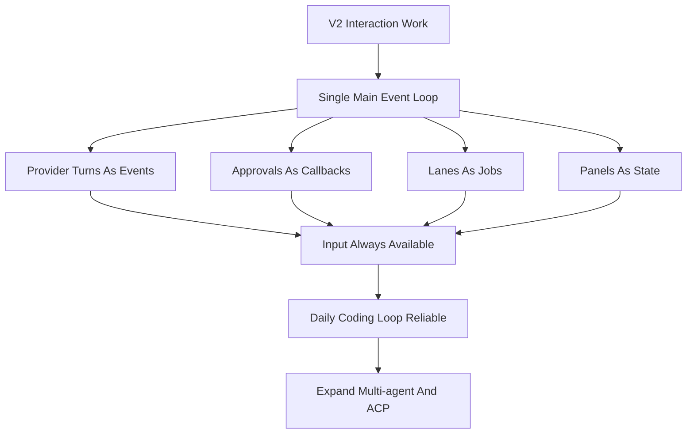

# Viden Staged Roadmap

## Purpose

This roadmap translates the full Viden product requirements into delivery
stages. It is intentionally derived from the target product, not from the
history of the current repository.

For the longer product strategy behind these delivery stages, see
[Viden Long-Term Roadmap](long-term-roadmap.md). This staged roadmap is the
delivery map; the long-term roadmap is the product and market map.

## Long-Term Positioning

Viden is not only a TUI and not only another coding-agent CLI. The long-term
positioning is:

> An out-of-the-box multi-agent orchestration runtime plus a token-efficiency
> optimization layer.

The TUI is the first primary product surface because it is the best fit for
dense state, approvals, sub-agent lanes, tests, diagnostics, and multi-screen
supervision. CLI automation, an API server, desktop, web, IDE adapters, and ACP
adapters should come only after the TUI cockpit and the shared runtime are
stable enough to reuse.

Long-term product pillars:

- Multi-agent orchestration: built-in planner, coder, reviewer, tester,
  researcher, and doc-writer roles, with support for Codex, Claude Code,
  DeepSeek, shell, MCP tools, and future ACP agents.
- The core orchestration contract is specified in
  [Multi-Agent Core Orchestration](multi-agent-core-orchestration.md). V2 owns
  the Agent DAG, event, ContextBundle, evidence, permission, and merge-gate
  contracts; V3/V4 can add external/team agents on top of that contract.
- Token-efficiency engine: task-specific context bundles, transcript
  compression, long-log compaction, tool-result deduplication, per-agent token
  budgets, and cost ceilings.
- Shared fact layer: agents read and write structured facts, events, artifacts,
  diffs, diagnostics, test results, and user constraints instead of passing full
  chat transcripts to each other.
- Multiple frontends: TUI first; CLI, API, IDE, web, and desktop surfaces reuse
  the same orchestration runtime instead of reimplementing agent logic.

## Stage Definitions

### V1: Local Core CLI

Goal:
Ship a reliable, local-first developer agent CLI with durable sessions,
permissions, and high-value local tools.

Required capabilities:

- interactive REPL
- startup configuration model
- provider abstraction
- file, search, shell, web, and Git tool families
- permission modes and approvals
- append-only transcript plus resume
- foundational slash commands

Exit criteria:

- users can run code-reading and code-editing workflows locally end to end
- tool calls, approvals, and transcript history remain auditable
- provider switching does not require core-engine changes
- sessions can be resumed reliably by project

### V2: Developer Enhancement Layer

Goal:
Turn the local CLI core into a more capable day-to-day TUI cockpit and
development assistant.

Required capabilities:

- broader command surface
- better session browsing and summaries
- stronger Git and diff workflows
- plugin-extensible provider runtime with dynamic provider loading
- LSP integration
- memory and task management
- richer TUI and interaction patterns
- live working-state feedback and a shared `AgentTask` view
- non-blocking TUI main event loop: provider turns, plan mode, approval,
  streaming, doctor, lanes, tools, and context builds must not freeze input,
  scrollback, resize, or command panels

Exit criteria:

- users can complete more of the development workflow without dropping to ad
  hoc shell usage
- provider growth does not require repeated core-engine changes
- semantic code assistance exists beyond grep and file editing
- session and task continuity feel deliberate instead of incidental
- users can always tell what the agent is doing, what evidence backs that
  state, and what the next available action is
- users can keep typing, queue next steps, scroll history, handle approvals, or
  cancel active work while any background task is running

### V3: Agent Orchestration And Token Efficiency Layer

Goal:
Upgrade Viden from a single-agent development assistant into a multi-agent
orchestration system, with token efficiency treated as a first-class product
capability.

Required capabilities:

- shared `AgentTask`, `AgentLane`, `Artifact`, `Evidence`, and `ContextBundle`
  models
- shared Agent DAG, runtime event, permission matrix, ContextBundle, evidence,
  and merge-gate contracts as defined by
  [Multi-Agent Core Orchestration](multi-agent-core-orchestration.md)
- default planner -> worker -> reviewer -> tester workflow templates
- supervised lane runtime for external terminal coding tools such as Codex,
  Claude Code, DeepSeek-TUI, and shell jobs
- context bundle builder, semantic file selection, diff-aware context, and tool
  output compaction
- token budgets, model routing, cost dashboard, and visible context pressure
- TUI side screens backed by real agent lanes, tests, diagnostics, and next
  actions instead of decorative panels

Exit criteria:

- users can run multi-agent orchestration workflows out of the box
- agents share structured facts and artifacts instead of copying full
  conversations
- every agent exposes token usage, context sources, output evidence, and next
  actions
- the TUI can reliably supervise orchestration before other product surfaces
  expand

### V4: Ecosystem And Platform Expansion Layer

Goal:
Expand the stable multi-agent runtime into an extensible developer platform
while keeping the TUI as the primary operating surface.

Required capabilities:

- MCP integration
- skills and plugins
- multi-agent coordination
- ACP / external-agent adapters, following the Zed-inspired registry/custom
  agent-server model captured in
  [Zed ACP Integration Research](zed-acp-integration-research.md)
- bridge and remote session support
- automation and cron-style workflows

Exit criteria:

- external tool ecosystems can plug into Viden through stable interfaces
- remote and integrated clients can reuse the same execution and permission
  model as local sessions
- multi-agent workflows do not bypass transcript and permission guarantees
- plugins, skills, MCP, and ACP all pass through the shared permissions, fact,
  token-budget, and evidence model

### ACP / External-Agent Delivery Rule

ACP support must be implemented as a core plugin/extension path, not as TUI
command glue. The first usable targets are Claude, Codex, and Kiro CLI:

- Claude and Codex should prefer ACP Registry metadata when available.
- Kiro CLI should start as an official local-command ACP adapter using
  `kiro-cli acp`; registry metadata can become an additional source later.
- Every external-agent subprocess must connect through RuntimeSupervisor,
  emit `RuntimeEvent`, update `RuntimeViewState`, and produce evidence/merge
  facts through the same gates as built-in agents.
- TUI and GUI clients may render external-agent state, logs, auth/config
  prompts, and model/session config options, but they must not spawn or parse
  ACP subprocesses directly.

Current ACP foundation status:

- Done: shared agent descriptor contract, built-in Claude/Codex/Kiro ACP
  descriptors, runtime list/doctor discovery, and descriptor-backed
  `initialize` probes with JSONL evidence.
- Done: `VIDEN_AGENT_ACP_COMMAND` is promoted into a runnable `custom-acp`
  local descriptor for custom/plugin ACP agents.
- Done: minimal synchronous ACP session run through `session/new`,
  `session/prompt`, streamed `session/update`, and TurnEnd collection.
- Done: descriptor-backed ACP session restore/configuration through
  `/agent run acp --load-session <session-id> --mode <mode-id> --model
  <model-id> <agent-id> <task>`, mapping to `session/load`,
  `session/set_mode`, and ACP `session/set_config_option` model config with a
  legacy `session/set_model` fallback.
- Done: tracked background ACP session jobs through
  `/agent run acp --async <agent-id> <task>`, JSONL/result/runtime-event
  artifacts, and process cancellation through `/agent cancel <id>`.
- Done: ACP process cancellation is protocol-aware and auditable: cancelled ACP
  jobs request `session/cancel` when the live ACP session is available, preserve
  the request in the wire log, and use bounded process termination as fallback.
- Done: ACP `session/request_permission` conversion into Viden approvals with
  allow/reject option responses.
- Done: tracked ACP session jobs project into `RuntimeViewState` as
  `AgentTask` records. ACP `fs/read_text_file` and `fs/write_text_file` are
  bridged through Viden permission checks.
- Done: ACP `terminal/create`, `terminal/input`, `terminal/write`,
  `terminal/output`, `terminal/wait_for_exit`, `terminal/release`, and
  `terminal/kill` are bridged through Viden permission checks.
  `terminal/create` now starts a tracked process without waiting for exit,
  `terminal/input` / `terminal/write` write to process stdin,
  `terminal/output` polls buffered stdout/stderr, and `terminal/wait_for_exit`
  / `terminal/kill` update process status for long-running commands.
  Unsupported filesystem or terminal methods still receive explicit JSON-RPC
  errors.
- Done: ACP `session/update` / `session/notification` payloads are projected
  into reusable runtime events for assistant deltas, tool call start/finish, and
  turn-end evidence.
- Done: async/background ACP jobs append projected events to
  `runtime-events.jsonl` as updates arrive, and `RuntimeViewState` replays
  those events for assistant output and evidence views.
- Done: async/background ACP jobs also push projected events through the live
  `RuntimeSupervisor` event stream as updates arrive, so UI clients can render
  assistant deltas before job completion.
- Done: ACP session output is mapped into merge-gate records. Each ACP session
  proposes a session merge gate, projects completed tool updates as `tool_log`
  evidence, records `acp_turn_end` evidence, and moves the session gate to
  `Accepted` once the turn-end evidence is present.
- Done: ACP patch/diff updates are normalized into `patch` evidence when an
  ACP update carries a unified diff through `diff`, `patch`, `unifiedDiff`, or
  nested file-change payload fields. Session merge gates that collect patch
  evidence require both `patch` and `acp_turn_end` before acceptance. Patch
  evidence carries `acp.patch.v1` metadata with file stats, changed paths, hunk
  count, source tool-call id, and the source unified diff.
- Done: ACP registry agents use cold-start-aware handshake timeouts, and Kiro
  doctor output distinguishes installed binaries from unknown native auth.
- Done: registry-backed ACP agents use a project-scoped npm cache, Claude/Codex
  initialize probes pass locally, and Kiro probe failures now preserve stderr
  auth diagnostics.
- Done: Claude/Codex ACP session-level smoke passes locally, including real
  Codex compatibility for `mcpServers: []`, `prompt: []`, snake-case
  `sessionUpdate`, final `id:2` responses, and usage reporting.
- Done: Kiro-specific baseline compatibility is covered by fake server tests:
  `session/prompt` uses `prompt`, `session/notification` updates are accepted,
  `ToolCall` and `ToolCallUpdate` are captured, and `VIDEN_KIRO_AGENT` maps to
  `kiro-cli acp --agent <name>`.
- Done: Kiro official ACP launch options are descriptor-backed and covered by
  tests: `VIDEN_KIRO_MODEL`, `VIDEN_KIRO_EFFORT`, `VIDEN_KIRO_TRUST_TOOLS`,
  `VIDEN_KIRO_TRUST_ALL_TOOLS`, and `VIDEN_KIRO_AGENT_ENGINE` map to
  `kiro-cli acp` flags.
- Done: `/agent auth acp kiro-cli` is a deterministic native-login guide
  (`kiro-cli login --use-device-flow`, `kiro-cli doctor`, then
  `/agent smoke acp --live`) instead of an ACP authenticate attempt.
- Done: `/agent smoke acp [--live]` is available as a repeatable gate; blocked
  Kiro native auth produces a non-zero blocked-auth result instead of a false
  pass.
- Done: authenticated Kiro live smoke passes in the current operator
  environment. The installed Kiro CLI uses a `prompt` array for
  `session/prompt`; the documentation-shaped `content` parameter is treated as
  incompatible until an agent descriptor says otherwise.
- Next: expand terminal bridging toward PTY-level interactive sessions and keep
  provider-native doctor diagnostics in the release gate.

### Long-Term Platform Features

Goal:
Add product-scale capabilities that are useful only after core workflows are
stable.

Target capabilities:

- voice interaction
- multi-device handoff
- analytics and managed settings
- feature-flag infrastructure
- reference-project-specific operational tooling where still justified

Exit criteria:

- advanced productization does not destabilize the core local developer
  workflows

## Priority Rules

- V1 behavior is the baseline contract for all later work
- V2 should stabilize the real-state TUI cockpit, input experience, and coding
  loop before broad platform sprawl
- V3 should deliver out-of-the-box multi-agent orchestration and token
  efficiency instead of simply adding more panels
- V4 should reuse V1, V2, and V3 execution invariants instead of introducing
  new side-channel runtimes
- the TUI is the first primary interface; other surfaces must reuse the same
  runtime. After the shared runtime/UI contract is frozen, TUI and GUI can be
  developed in parallel under the
  [Viden Parallel Development Plan](parallel-development-plan.md)
- long-term platform features should follow, not lead, core workflow maturity

### Interaction Reliability Gate

V2 releases must pass the interaction reliability gate before expanding the
agent surface further.

### 0.1.x TUI Zero-Bug Gate

The final 0.1.x line must be treated as a TUI stability exit, not a feature
expansion sprint. Viden should not enter the 0.2.x line while known P0/P1
TUI display or interaction bugs remain.

For the full gate, see
[TUI Stability Zero-Bug Gate](tui-stability-zero-bug-gate.md).

Required exit criteria:

- known P0/P1 TUI bugs are zero: input lock, Plan mode lock, approval lock,
  resize corruption, scrollback loss, incorrect active-work state, provider
  setup/model picker confusion, and modal/palette focus traps are release
  blockers
- welcome, main idle, thinking/streaming, approval, provider setup, model
  picker, command palette, side-1, side-2, error recovery, and resize states
  all have deterministic preview or real terminal screenshot evidence
- `tui-regression`, plan-mode smoke, daily-loop smoke, slow-provider
  non-blocking smoke, approval non-blocking smoke, streaming scrollback smoke,
  and provider/model setup smoke pass before final release
- no new agent, ACP, MCP, plugin, or multi-surface feature may trade away TUI
  input stability, scrollback stability, approval operability, or truthful
  working-state display

## Current Repository Mapping

Mainline landed:

- V1 local CLI core: REPL, config resolution, provider abstraction, permissions, transcripts/resume, Git tools, and web tools
- V2-A session commands: `/status`, `/config`, `/doctor`, richer `/sessions`, and grouped `/help`
- V2-C workflow continuity: project tasks, project/session memory, workflow JSONL logs, and resume context
- V2-B LSP foundation: real semantic queries, session reuse, document synchronization, `lsp_*` tools, and `/lsp ...` commands
- V2-D structured terminal views: grouped diagnostics, grouped symbols, compact references, sessions, tasks, memory, diff, permission denials, and shared presentation helpers
- Provider-platform slice: provider host/runtime registry, provider-scoped config, and DeepSeek v4 as the first independent provider target
- Provider hardening checkpoints: descriptor validation, registry refresh coverage, blank-key handling, provider-scoped diagnostics, and offline/live smoke harnesses
- DeepSeek V4 compatibility flags: reasoning-content replay, non-null assistant tool-call content, explicit `tool_choice` capability, and `high`/`max` reasoning-effort metadata

Current published release:

- `docs/release-0.1.30-status.md` records the final 0.1.x zero-bug TUI gate:
  release-visible P0/P1 backlog at `0`, final zero-bug smoke, RC TUI stability
  smoke, refreshed 0.1.30 deterministic screenshots, real macOS Terminal/iTerm2
  evidence, live DeepSeek development smoke, GitHub Release, Homebrew tap, and
  post-publish smoke.
- `0.1.30` completes the final 0.1.x checkpoint and keeps plan mode,
  daily-loop, lane operator, provider/model setup, scrollback, repaint,
  synthetic-planning cleanup, and Mode/Permission visibility in the release
  gate.

Next planned:

- Start 0.2.x structure/context/evidence runtime work while preserving the
  0.1.30 zero-bug TUI gates as release regressions.
- `0.2.0`: Architecture cut and core structure refactor. Establish the
  `viden-core` facade, dependency direction, runtime supervisor, event stream,
  command bus, and compatibility exports before starting GUI implementation.
- `0.2.1`: Context, token/cost, evidence, and runtime fact model for
  `ContextBundle`, semantic file selection, log compaction,
  tool-result deduplication, budgets, provider health, and cost visibility.
- `0.2.2`: Agent DAG and role runtime - complete in the current working tree.
  Completion evidence is recorded in
  [0.2.2 Status](release-0.2.2-status.md). It covers planner, coder, reviewer,
  tester, and doc-writer roles with ContextBundle references, evidence, failure
  classification, and next actions. The completed contract work includes:
  `StartAgentDag`, replayable Agent DAG and MergeGate events, queued role tasks,
  dedicated workflow agent events, and provider-backed `StartAgentTask`
  execution that gates on dependencies, emits AgentTask-bound ContextBundle
  events, records durable start/blocker/completion workflow events and role evidence,
  updates merge gates, keeps active role turns cancellable, and applies the
  role-policy matrix for tester verification, docs-only, reviewer read-only,
  scoped coder mutation, release-gate, and least-privilege external-agent
  behavior to provider-requested tools before approval/execution.
  Structured tool-result events now carry success and exit code through the
  runtime contract instead of relying on output-text heuristics. Explicit
  `CancelAgentTask` commands also persist `agent_task_cancelled` workflow
  events for queued or inactive tasks. Completed AgentTasks now store provider
  output summaries in `task.result` while linking the same output to role
  evidence. Accepted patch evidence now applies to workspace files through a
  basic unified-diff reducer; context mismatches move the merge gate back to
  needs-changes without modifying files. Scoped role Git
  staging now allows in-scope `git_add` while denying unscoped staging and
  high-risk Git mutations. Live LSP references enrichment, release/publish Git
  rules, evidence reducers, and richer patch formats remain the next
  implementation slice.
  Provider-backed
  role failures now persist `failure_class`, `recovery_suggestion`, and a retry
  next action. AgentTask ContextBundles now include initial role-specific
  guidance, file-scope, evidence-contract sources, deterministic scoped file
  candidates, lightweight symbol candidates, and live LSP diagnostics selected
  per role; basic merge gate accept/reject decision
  commands and artifact accept/reject/merge state transitions are already in
  the runtime contract.
- `0.2.3`: Evidence and merge gate for richer agent patch formats, test
  results, reviews, docs, release artifacts, and conflict handling. First slice
  adds explicit `RecordAgentEvidence`, kind-based merge-gate reduction, and
  runtime/workflow event consistency for recorded evidence.
- `0.2.4`: Plugin runtime boundary for process plugins, manifest/capability
  registration, extension boundaries, and least-privilege external agent scopes.
- `0.2.5`: Real development gate for DeepSeek live development smoke,
  daily-loop, plan-mode, provider/model, lane operator, release gate, and
  token/cost summaries.
- `0.3.0`: Multi-frontend contract freeze and Viden migration plan. Freeze the
  UI/runtime contract and define `viden` binary/config migration plus the
  `viden` compatibility shim. The freeze includes
  [Frontend Integration Contract](frontend-integration-contract.md), which maps
  completed core modules to TUI/GUI consumption rules.
- `0.3.1`: Parallel TUI and GUI implementation. Split core/runtime, TUI client,
  and Tauri/Web GUI client into independent branches/worktrees, with at most
  three active owners.
- `0.3.2`: Integration release candidate. Merge core first, then TUI, then GUI,
  and run TUI/GUI parity, migration, plugin, and real development gates.
- `0.3.3`: Operable GUI beta and compatibility hardening.
- `0.3.4`: Visual fidelity and production release gate.
- GUI functional design is documented in
  [GUI Version Functional Design](gui-version-functional-design.md). Treat it
  as a product contract that can be implemented after the runtime/UI contract
  freeze, not before.
- TUI/GUI visual sources must be reviewed before they become product contracts.
  Discarded design imports and generated visual output are not roadmap
  dependencies.
- Keep every GitHub Release coupled to Homebrew sync and postpublish validation.

The final 0.1.x checkpoint is `0.1.30`: P0/P1 TUI backlog is zero, screenshot
evidence is complete, quick and full stability gates pass, and GitHub Release
plus Homebrew validation are green.

That does not change the roadmap ordering. It means Viden has moved beyond an
early V1-only repository state, but later phases should still be pulled
forward only in sequence.
