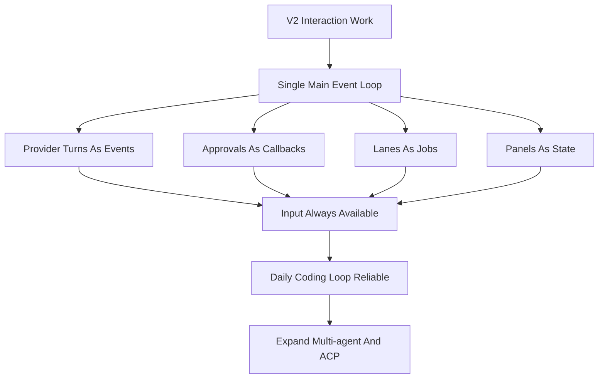

# Viden 分阶段路线图

英文版： [staged-roadmap.md](staged-roadmap.md)

## 目的

这份路线图把完整的 Viden 产品需求翻译成可交付的阶段，而不是按当前仓库历史来倒推。

更长期的产品战略见 [Viden 长期路线图](long-term-roadmap.zh-CN.md)。这份阶段路线图是
交付地图；长期路线图是产品和市场地图。

## 长期定位

Viden 的长期定位不是单一 TUI，也不是又一个 coding agent CLI，而是：

> 开箱即用的多 Agent 编排运行时 + 极致 token 效能优化层。

TUI 是第一阶段的主产品形态，因为它最适合承载高密度状态、审批、子 agent lane、
测试、诊断和多屏监督。只有当 TUI cockpit 和核心 runtime 足够稳定后，才逐步扩展到
CLI automation、API server、desktop、Web、IDE/ACP adapter 等其他入口。

长期产品支柱：

- 多 Agent 编排：内置 planner、coder、reviewer、tester、researcher、doc writer
  等角色，并支持 Codex、Claude Code、DeepSeek、shell、MCP tools 和未来 ACP agents。
- 核心编排契约见 [多 Agent 核心编排](multi-agent-core-orchestration.zh-CN.md)。
  V2 负责 Agent DAG、event、ContextBundle、evidence、permission 和 merge-gate
  contracts；V3/V4 在这个 contract 之上增加 external/team agents。
- Token 效能引擎：按任务动态构造 context bundle，自动压缩 transcript、裁剪长日志、
  去重 tool results、控制每个 agent 的 token budget 和成本上限。
- 共享事实层：所有 agent 读写统一的 facts、events、artifacts、diff、diagnostics、
  test results 和 user constraints，而不是互相转发整段聊天记录。
- 多前端形态：TUI 优先；CLI、API、IDE、Web 和 desktop 复用同一套 orchestration
  runtime，而不是各自实现一套 agent 逻辑。

## 阶段定义

### V1：本地核心 CLI

目标：
交付一个可靠的、本地优先的开发者 Agent CLI，具备 durable session、权限系统和高价值本地工具。

必须具备：

- 交互式 REPL
- 启动配置模型
- provider 抽象
- 文件、搜索、shell、web、Git 工具族
- permission modes 与 approvals
- append-only transcript 与 resume
- 基础 slash commands

退出标准：

- 用户可以端到端完成本地读代码和改代码流程
- 工具调用、审批和 transcript 历史都可审计
- 切换 provider 不需要改 core engine
- 会话可以按项目稳定恢复

### V2：开发者增强层

目标：
把本地 CLI 核心提升为真正可日常使用的 TUI cockpit 和开发助手。

必须具备：

- 更广的命令面
- 更好的 session 浏览和 summary
- 更强的 Git 与 diff 流程
- 支持 dynamic provider loading 的 plugin-extensible provider runtime
- LSP 集成
- memory 与 task 管理
- 更丰富的 TUI 和交互
- 主屏实时工作状态与统一 `AgentTask` 视图
- 非阻塞 TUI 主事件循环：provider turn、Plan 模式、approval、streaming、doctor、
  lane、tool 和 context build 都不能卡住输入、scrollback、resize 或命令面板

退出标准：

- 用户可以在不频繁回退到 ad hoc shell 的情况下完成更多开发流程
- provider 的增长不再需要反复修改 core-engine
- 具备超越 grep / file editing 的语义级代码辅助
- session 和 task 的连续性从“能用”提升到“有意设计”
- 用户始终能从 TUI 中判断当前 agent 正在做什么、证据来自哪里、下一步可以如何操作
- 用户在任何后台任务运行期间都能继续输入、排队下一步、滚动历史、处理审批或取消当前任务

### V3：Agent 编排与 Token 效能层

目标：
把 Viden 从单 agent 开发助手升级为多 Agent 编排系统，并把 token 使用效率作为一等产品能力。

必须具备：

- 统一 `AgentTask`、`AgentLane`、`Artifact`、`Evidence` 和 `ContextBundle` 模型
- [多 Agent 核心编排](multi-agent-core-orchestration.zh-CN.md) 定义的共享
  Agent DAG、runtime event、permission matrix、ContextBundle、evidence 和
  merge-gate contracts
- planner -> worker -> reviewer -> tester 的默认工作流模板
- 外部 terminal coding tools 的受监督 lane runtime，例如 Codex、Claude Code、DeepSeek-TUI 和 shell job
- context bundle builder、semantic file selection、diff-aware context、tool output compaction
- token budget、model routing、cost dashboard 和 context pressure 可视化
- TUI 副屏用于真实 agent lanes、tests、diagnostics 和 next actions，而不是装饰性面板

退出标准：

- 用户可以开箱即用地运行多 Agent 编排流程
- 多个 agent 共享结构化事实和 artifacts，而不是复制完整对话
- 每个 agent 的 token 消耗、上下文来源、输出证据和下一步动作都可见
- TUI 已能稳定承载编排过程，其他入口仍可暂缓

### V4：生态与平台扩展层

目标：
把稳定的多 Agent runtime 扩展为可插拔开发平台，同时保持 TUI 作为主操作面。

必须具备：

- MCP 集成
- skills 与 plugins
- 多 Agent 协调
- ACP / external agent adapter，按
  [Zed ACP 接入研究](zed-acp-integration-research.zh-CN.md) 中的
  registry/custom agent-server 模型推进
- bridge 与 remote session 支持
- automation 和 cron 风格工作流

退出标准：

- 外部工具生态可以通过稳定接口接入 Viden
- remote 与集成客户端能复用与本地 session 相同的执行和权限模型
- 多 Agent 工作流不会绕开 transcript 和权限保证
- plugin、skill、MCP 和 ACP 都通过统一权限、事实层、token budget 和 evidence 约束

### ACP / External-Agent 交付规则

ACP 支持必须作为 core plugin/extension 路径实现，而不是 TUI 命令胶水。第一批可用目标是
Claude、Codex 和 Kiro CLI：

- Claude 和 Codex 优先使用 ACP Registry metadata。
- Kiro CLI 先作为 official local-command ACP adapter，使用 `kiro-cli acp`；
  registry metadata 后续可以作为额外 source 接入。
- 每个 external-agent 子进程都必须通过 RuntimeSupervisor 连接，发出 `RuntimeEvent`，
  更新 `RuntimeViewState`，并通过与内置 agent 相同的 evidence/merge gates 产生事实。
- TUI 和 GUI 可以渲染 external-agent state、logs、auth/config prompts 和
  model/session config options，但不能直接 spawn 或解析 ACP 子进程。

当前 ACP foundation 状态：

- 已完成：共享 agent descriptor contract，内置 Claude/Codex/Kiro ACP descriptor，
  runtime list/doctor discovery，以及基于 descriptor 的 `initialize` probe 和 JSONL evidence。
- 已完成：`VIDEN_AGENT_ACP_COMMAND` 已提升为可运行的 `custom-acp` local
  descriptor，用于 custom/plugin ACP agents。
- 已完成：最小同步 ACP session run，覆盖 `session/new`、`session/prompt`、
  streamed `session/update` 和 TurnEnd collection。
- 已完成：基于 descriptor 的 ACP session restore/configuration，命令为
  `/agent run acp --load-session <session-id> --mode <mode-id> --model
  <model-id> <agent-id> <task>`，会映射到 `session/load`、`session/set_mode`
  和 ACP `session/set_config_option` model config，并保留 legacy
  `session/set_model` fallback。
- 已完成：通过 `/agent run acp --async <agent-id> <task>` 启动 tracked 后台
  ACP session job，写出 JSONL/result/runtime-event artifacts，并通过
  `/agent cancel <id>` 执行进程取消。
- 已完成：ACP process cancellation 已具备协议级请求与审计；被取消的 ACP job
  会在 live ACP session 可用时请求 `session/cancel`，把请求保留在 wire log 中，
  并用有界 process termination 作为 fallback。
- 已完成：ACP `session/request_permission` 转换为 Viden approval，并回写
  allow/reject option response。
- 已完成：tracked ACP session jobs 作为 `AgentTask` records 投影到
  `RuntimeViewState`。ACP `fs/read_text_file` 和 `fs/write_text_file` 已通过
  Viden permission checks 桥接。
- 已完成：ACP `terminal/create`、`terminal/input`、`terminal/write`、
  `terminal/output`、`terminal/wait_for_exit`、`terminal/release` 和
  `terminal/kill` 已通过 Viden permission checks 桥接。`terminal/create`
  现在会启动 tracked process 而不是等待退出，`terminal/input` /
  `terminal/write` 会写入 process stdin，`terminal/output` 会轮询 buffered
  stdout/stderr，`terminal/wait_for_exit` / `terminal/kill` 会更新
  long-running command 的 process status；未支持的 filesystem 或 terminal
  methods 仍会被明确 JSON-RPC error 拒绝。
- 已完成：ACP `session/update` / `session/notification` payloads 已投影成可复用
  runtime events，覆盖 assistant delta、tool call start/finish 和 turn-end evidence。
- 已完成：async/background ACP jobs 会在 updates 到达时持续把投影事件追加到
  `runtime-events.jsonl`，`RuntimeViewState` 会重放这些事件供 assistant output
  和 evidence views 消费。
- 已完成：async/background ACP jobs 也会在 updates 到达时把投影事件直接推送进
  live `RuntimeSupervisor` event stream，因此 UI client 可以在 job 完成前渲染
  assistant delta。
- 已完成：ACP session output 已映射到 merge-gate records。每个 ACP session
  会提出 session merge gate，completed tool updates 会成为 `tool_log` evidence，
  `TurnEnd` 会成为 `acp_turn_end` evidence，并在 turn-end evidence 存在后把
  session gate 推到 `Accepted`。
- 已完成：ACP patch/diff updates 已归一化为 `patch` evidence；当 ACP update
  通过 `diff`、`patch`、`unifiedDiff` 或嵌套 file-change payload 字段携带
  unified diff 时，session merge gate 会要求同时具备 `patch` 和
  `acp_turn_end` 后才进入 accepted。Patch evidence 会携带 `acp.patch.v1`
  metadata，包含文件统计、变更路径、hunk 数、来源 tool-call id 和原始
  unified diff。
- 已完成：ACP registry agents 使用 cold-start-aware handshake timeout；Kiro doctor
  输出会区分 binary installed 和 agent-native auth unknown。
- 已完成：registry-backed ACP agents 使用项目级 npm cache；Claude/Codex initialize
  probes 已在本机跑通；Kiro probe failure 会保留 stderr auth diagnostics。
- 已完成：Claude/Codex ACP session-level smoke 已在本机跑通，包括真实 Codex 对
  `mcpServers: []`、`prompt: []`、snake-case `sessionUpdate`、最终 `id:2`
  response 和 usage reporting 的兼容。
- 已完成：Kiro-specific baseline compatibility 已用 fake server tests 覆盖：
  `session/prompt` 使用 `prompt`，接受 `session/notification` updates，
  收集 `ToolCall` 和 `ToolCallUpdate`，并支持 `VIDEN_KIRO_AGENT` 映射到
  `kiro-cli acp --agent <name>`。
- 已完成：Kiro 官方 ACP launch options 已进入 descriptor 并有测试覆盖：
  `VIDEN_KIRO_MODEL`、`VIDEN_KIRO_EFFORT`、`VIDEN_KIRO_TRUST_TOOLS`、
  `VIDEN_KIRO_TRUST_ALL_TOOLS` 和 `VIDEN_KIRO_AGENT_ENGINE` 会映射到
  `kiro-cli acp` flags。
- 已完成：`/agent auth acp kiro-cli` 是确定性的 native-login guide
  （`kiro-cli login --use-device-flow`、`kiro-cli doctor`，然后
  `/agent smoke acp --live`），而不是尝试 ACP authenticate。
- 已完成：`/agent smoke acp [--live]` 已作为可重复 gate 可用；Kiro native auth
  blocked 会返回非零 blocked-auth，而不是误判通过。
- 已完成：当前 operator 环境中的 authenticated Kiro live smoke 已通过。当前安装的
  Kiro CLI 在 `session/prompt` 中使用 `prompt` array；文档形态的 `content`
  参数在 agent descriptor 明确声明前视为不兼容。
- 下一步：按需要把 terminal bridge 扩展到 PTY 级 interactive sessions，并把
  provider-native doctor diagnostics 保持在 release gate 中。

### 远期平台能力

目标：
在核心工作流稳定后，加入更偏产品规模化的高级能力。

目标能力：

- voice interaction
- multi-device handoff
- analytics 与 managed settings
- feature-flag infrastructure
- 仍然有价值时再引入参考工程中特定运营能力

退出标准：

- 更重的产品化能力不能破坏核心本地开发工作流

## 优先级规则

- V1 行为是后续所有阶段的基线契约
- V2 应优先把 TUI cockpit 的真实状态、输入体验和编程闭环打稳，而不是过早平台扩张
- V3 应优先交付开箱即用的多 Agent 编排和 token 效能，而不是只增加更多面板
- V4 必须复用 V1 / V2 / V3 的执行不变量，而不是引入新的 side-channel runtime
- TUI 是第一阶段主界面；其他形态必须复用同一 runtime。共享 runtime/UI contract
  冻结后，TUI 与 GUI 可以按 [Viden 并发开发计划](parallel-development-plan.zh-CN.md)
  并行开发。
- 远期平台能力必须服从核心工作流成熟度

### 交互可靠性闸门

V2 后续版本必须先通过交互可靠性闸门，再继续拉大 agent surface。

### 0.1.x TUI Zero-Bug 闸门

0.1.x 的最后版本必须作为 TUI 稳定性出口，而不是继续扩新功能。进入 0.2.x 前必须满足
[TUI Stability Zero-Bug Gate](tui-stability-zero-bug-gate.zh-CN.md)：

- P0/P1 TUI 显示、输入、弹窗、scrollback、resize 和状态错乱 bug 清零。
- 常见终端尺寸、macOS Terminal 和 iTerm2 有真实截图或 deterministic preview 证据。
- welcome、main idle、thinking/streaming、approval、provider setup、model picker、
  command palette、side-1、side-2、error recovery 和 resize 后布局都有证据。
- 0.1.x 后半段禁止为了新增 agent surface 牺牲 TUI 稳定性。

## 当前仓库映射

Mainline landed：

- V1 本地 CLI 核心：REPL、config resolution、provider abstraction、permissions、transcripts/resume、Git tools、web tools
- V2-A session commands：`/status`、`/config`、`/doctor`、更丰富的 `/sessions`、分组 `/help`
- V2-C workflow continuity：project tasks、project/session memory、workflow JSONL logs、resume context
- V2-B LSP foundation：real semantic queries、session reuse、document synchronization、`lsp_*` tools、`/lsp ...` commands
- V2-D structured terminal views：分组 diagnostics、分组 symbols、紧凑 references、sessions、tasks、memory、diff、permission denials，以及共享 presentation helpers
- Provider 平台切片：provider host/runtime registry、provider-scoped config，以及 DeepSeek v4 作为首个独立 provider 目标
- Provider hardening 检查点：descriptor validation、registry refresh coverage、blank-key handling、provider-scoped diagnostics，以及 offline/live smoke harnesses
- DeepSeek V4 兼容标记：reasoning-content replay、非空 assistant tool-call content、显式 `tool_choice` capability，以及 `high`/`max` reasoning-effort metadata

当前已发布版本：

- `docs/release-0.1.30-status.zh-CN.md` 记录最终 0.1.x zero-bug TUI gate：
  release-visible P0/P1 backlog 为 `0`、final zero-bug smoke、RC TUI stability
  smoke、刷新后的 0.1.30 确定性截图、真实 macOS Terminal/iTerm2 证据、live DeepSeek
  development smoke、GitHub Release、Homebrew tap 和 post-publish smoke。
- `0.1.30` 已完成最终 0.1.x checkpoint，并把 Plan 模式、daily-loop、lane operator、
  provider/model setup、scrollback、repaint、synthetic-planning cleanup，以及
  Mode/Permission 可见性继续留在 release gate。

下一个计划版本：

- 启动 0.2.x 结构/context/evidence runtime 工作，同时把 0.1.30 zero-bug TUI gates
  保留为后续 release regression。
- 每次 GitHub Release 继续必须绑定 Homebrew 同步和 postpublish validation。

0.1.x final checkpoint 是 `0.1.30`：P0/P1 TUI backlog 已清零、截图证据齐全、
quick/full release gates 已通过，GitHub Release 与 Homebrew validation 全绿。

接下来的版本顺序必须先完成结构和 contract，再进入 GUI/TUI 并行实现：

- `0.2.0`：架构切分与核心结构重构。建立 `viden-core` facade、依赖方向、runtime
  supervisor、event stream、command bus 和 compatibility exports，然后再启动 GUI 实现。
- `0.2.1`：Context、token/cost、evidence 和 runtime fact model。实现
  `ContextBundle`、语义文件选择、日志压缩、tool result 去重、token budget、
  provider health 和费用可见性。
- `0.2.2`：Agent DAG 与 role runtime，当前 working tree 已完成。完成证据记录在
  [0.2.2 状态](release-0.2.2-status.zh-CN.md)。它把 planner、coder、reviewer、
  tester、doc-writer 做成可监督角色，每个角色都有 ContextBundle 引用、证据、失败分类和下一步动作。
  已完成的 contract work 包括：`StartAgentDag`、可 replay 的 Agent DAG / MergeGate
  events、queued role tasks、独立 workflow agent events，以及 provider-backed
  `StartAgentTask` execution。`StartAgentTask` 会先做 dependency gating，发出
  AgentTask-bound ContextBundle events，记录 durable blocker/completion workflow
  events 以及 durable start workflow event 和 role evidence，更新 merge gates，保持 active role turn 可取消，并把第一版
  role-policy matrix 应用到 provider 请求的 tools：覆盖 tester verification、
  docs-only、reviewer read-only、scoped coder mutation、release-gate 和
  least-privilege external-agent，并且在 approval/execution 前生效。structured
  tool-result events 现在会通过 runtime contract 携带 success 和 exit code，不再依赖输出文本启发式判断。显式 `CancelAgentTask`
  命令也会为 queued 或 inactive task 持久化 `agent_task_cancelled` workflow event。
  provider-backed role failure 现在会持久化 `failure_class`、`recovery_suggestion`
  和 retry next action。完成的 AgentTask 现在会把 provider output summary 写入
  `task.result`，并把同一输出链接到 role evidence。AgentTask ContextBundle 现在会包含初始 role-specific guidance、
  file-scope、evidence-contract sources，以及按 role 从声明 file_scope 中确定性选择的文件候选、轻量 symbol 候选和 live LSP diagnostics。
  基础 merge gate accept/reject decision commands 以及 artifact accept/reject/merge
  状态流转已进入 runtime contract；accepted patch evidence 现在会通过基础 unified-diff
  reducer 应用到 workspace，context mismatch 会把 merge gate 退回 needs-changes 且不修改文件。
  scoped role Git staging 现在允许 scope 内 `git_add`，并拒绝越界 staging 和高风险
  Git mutation。live LSP references enrichment、release/publish Git rules、
  evidence reducers 和更完整 patch 格式仍是下一步实现切片。
- `0.2.3`：Evidence 与 merge gate。覆盖更完整 agent patch 格式、test results、
  reviews、docs、release artifacts 和 conflict handling。第一刀加入显式
  `RecordAgentEvidence`、按 evidence kind 归约 merge gate，以及 recorded evidence 的
  runtime/workflow event 一致性。
- `0.2.4`：Plugin runtime boundary。增加 process-plugin protocol、
  manifest/capability registration、extension boundaries 和 least-privilege
  external agent scopes。
- `0.2.5`：真实开发 gate。继续把 DeepSeek 真实开发 smoke、daily-loop、plan-mode、
  provider/model、lane operator、release gate、token/cost summary 固化为每次发版前必跑。
- `0.3.0`：多前端 contract freeze 与 Viden migration plan。冻结 UI/runtime
  contract，定义 `viden` binary/config migration 和 `viden` compatibility shim。
  freeze 范围包含 [前端对接契约](frontend-integration-contract.zh-CN.md)，用于把已完成
  core modules 映射到 TUI/GUI 消费规则。
- `0.3.1`：TUI 与 GUI 并行实现。Core/runtime、TUI client、Tauri/Web GUI client
  拆到独立 branch/worktree，最多三个 active owner 同时开发。
- `0.3.2`：集成候选版。先合 core，再合 TUI，最后合 GUI，并跑 TUI/GUI parity、
  migration、plugin 和真实开发 gates。
- `0.3.3`：可操作 GUI beta 与 compatibility hardening。
- `0.3.4`：视觉保真和生产发版 gate。
- GUI 功能设计已记录在
  [GUI 版本功能设计](gui-version-functional-design.zh-CN.md)。它是 UI/runtime contract
  freeze 后可进入实现的产品契约，不是提前复制业务逻辑的许可。
- TUI/GUI 视觉源必须 review 后才可以成为产品契约。已废弃的设计导入和生成式视觉输出
  不再是路线图依赖。

这并不改变路线图顺序。它说明 Viden 已不再只是早期 V1 状态，但后续阶段仍应按顺序推进，而不是因为分支存在就提前拉动。
