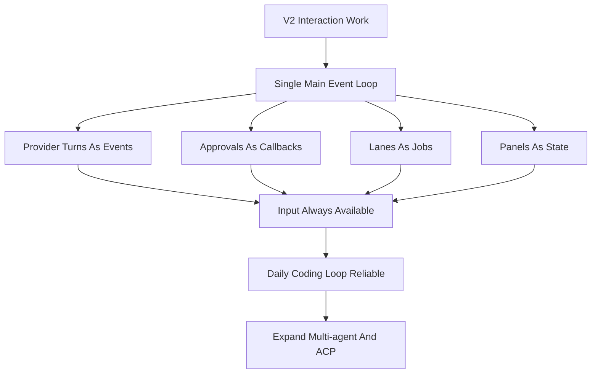

# Viden 分阶段路线图

英文版： [staged-roadmap.md](staged-roadmap.md)

## 目的

这份路线图把完整的 Viden 产品需求翻译成可交付的阶段，而不是按当前仓库历史来倒推。

更长期的产品战略见 [Viden 长期路线图](long-term-roadmap.zh-CN.md)。这份阶段路线图是
交付地图；长期路线图是产品和市场地图。

## 长期定位

Viden 的长期定位不是单一 TUI，也不是又一个 coding agent CLI，而是：

> 开箱即用的多 Agent 编排运行时 + 极致 token 效能优化层。

TUI 是第一阶段的主产品形态，因为它最适合承载高密度状态、审批、子 agent lane、
测试、诊断和多屏监督。只有当 TUI cockpit 和核心 runtime 足够稳定后，才逐步扩展到
CLI automation、API server、desktop、Web、IDE/ACP adapter 等其他入口。

长期产品支柱：

- 多 Agent 编排：内置 planner、coder、reviewer、tester、researcher、doc writer
  等角色，并支持 Codex、Claude Code、DeepSeek、shell、MCP tools 和未来 ACP agents。
- Token 效能引擎：按任务动态构造 context bundle，自动压缩 transcript、裁剪长日志、
  去重 tool results、控制每个 agent 的 token budget 和成本上限。
- 共享事实层：所有 agent 读写统一的 facts、events、artifacts、diff、diagnostics、
  test results 和 user constraints，而不是互相转发整段聊天记录。
- 多前端形态：TUI 优先；CLI、API、IDE、Web 和 desktop 复用同一套 orchestration
  runtime，而不是各自实现一套 agent 逻辑。

## 阶段定义

### V1：本地核心 CLI

目标：
交付一个可靠的、本地优先的开发者 Agent CLI，具备 durable session、权限系统和高价值本地工具。

必须具备：

- 交互式 REPL
- 启动配置模型
- provider 抽象
- 文件、搜索、shell、web、Git 工具族
- permission modes 与 approvals
- append-only transcript 与 resume
- 基础 slash commands

退出标准：

- 用户可以端到端完成本地读代码和改代码流程
- 工具调用、审批和 transcript 历史都可审计
- 切换 provider 不需要改 core engine
- 会话可以按项目稳定恢复

### V2：开发者增强层

目标：
把本地 CLI 核心提升为真正可日常使用的 TUI cockpit 和开发助手。

必须具备：

- 更广的命令面
- 更好的 session 浏览和 summary
- 更强的 Git 与 diff 流程
- 支持 dynamic provider loading 的 plugin-extensible provider runtime
- LSP 集成
- memory 与 task 管理
- 更丰富的 TUI 和交互
- 主屏实时工作状态与统一 `AgentTask` 视图
- 非阻塞 TUI 主事件循环：provider turn、Plan 模式、approval、streaming、doctor、
  lane、tool 和 context build 都不能卡住输入、scrollback、resize 或命令面板

退出标准：

- 用户可以在不频繁回退到 ad hoc shell 的情况下完成更多开发流程
- provider 的增长不再需要反复修改 core-engine
- 具备超越 grep / file editing 的语义级代码辅助
- session 和 task 的连续性从“能用”提升到“有意设计”
- 用户始终能从 TUI 中判断当前 agent 正在做什么、证据来自哪里、下一步可以如何操作
- 用户在任何后台任务运行期间都能继续输入、排队下一步、滚动历史、处理审批或取消当前任务

### V3：Agent 编排与 Token 效能层

目标：
把 RoboCode 从单 agent 开发助手升级为多 Agent 编排系统，并把 token 使用效率作为一等产品能力。

必须具备：

- 统一 `AgentTask`、`AgentLane`、`Artifact`、`Evidence` 和 `ContextBundle` 模型
- planner -> worker -> reviewer -> tester 的默认工作流模板
- 外部 terminal coding tools 的受监督 lane runtime，例如 Codex、Claude Code、DeepSeek-TUI 和 shell job
- context bundle builder、semantic file selection、diff-aware context、tool output compaction
- token budget、model routing、cost dashboard 和 context pressure 可视化
- TUI 副屏用于真实 agent lanes、tests、diagnostics 和 next actions，而不是装饰性面板

退出标准：

- 用户可以开箱即用地运行多 Agent 编排流程
- 多个 agent 共享结构化事实和 artifacts，而不是复制完整对话
- 每个 agent 的 token 消耗、上下文来源、输出证据和下一步动作都可见
- TUI 已能稳定承载编排过程，其他入口仍可暂缓

### V4：生态与平台扩展层

目标：
把稳定的多 Agent runtime 扩展为可插拔开发平台，同时保持 TUI 作为主操作面。

必须具备：

- MCP 集成
- skills 与 plugins
- 多 Agent 协调
- ACP / external agent adapter
- bridge 与 remote session 支持
- automation 和 cron 风格工作流

退出标准：

- 外部工具生态可以通过稳定接口接入 RoboCode
- remote 与集成客户端能复用与本地 session 相同的执行和权限模型
- 多 Agent 工作流不会绕开 transcript 和权限保证
- plugin、skill、MCP 和 ACP 都通过统一权限、事实层、token budget 和 evidence 约束

### 远期平台能力

目标：
在核心工作流稳定后，加入更偏产品规模化的高级能力。

目标能力：

- voice interaction
- multi-device handoff
- analytics 与 managed settings
- feature-flag infrastructure
- 仍然有价值时再引入参考工程中特定运营能力

退出标准：

- 更重的产品化能力不能破坏核心本地开发工作流

## 优先级规则

- V1 行为是后续所有阶段的基线契约
- V2 应优先把 TUI cockpit 的真实状态、输入体验和编程闭环打稳，而不是过早平台扩张
- V3 应优先交付开箱即用的多 Agent 编排和 token 效能，而不是只增加更多面板
- V4 必须复用 V1 / V2 / V3 的执行不变量，而不是引入新的 side-channel runtime
- TUI 是第一阶段主界面；其他形态必须复用同一 runtime。共享 runtime/UI contract
  冻结后，TUI 与 GUI 可以按 [Viden 并发开发计划](parallel-development-plan.zh-CN.md)
  并行开发。
- 远期平台能力必须服从核心工作流成熟度

### 交互可靠性闸门

V2 后续版本必须先通过交互可靠性闸门，再继续拉大 agent surface。

### 0.1.x TUI Zero-Bug 闸门

0.1.x 的最后版本必须作为 TUI 稳定性出口，而不是继续扩新功能。进入 0.2.x 前必须满足
[TUI Stability Zero-Bug Gate](tui-stability-zero-bug-gate.zh-CN.md)：

- P0/P1 TUI 显示、输入、弹窗、scrollback、resize 和状态错乱 bug 清零。
- 常见终端尺寸、macOS Terminal 和 iTerm2 有真实截图或 deterministic preview 证据。
- welcome、main idle、thinking/streaming、approval、provider setup、model picker、
  command palette、side-1、side-2、error recovery 和 resize 后布局都有证据。
- 0.1.x 后半段禁止为了新增 agent surface 牺牲 TUI 稳定性。

## 当前仓库映射

Mainline landed：

- V1 本地 CLI 核心：REPL、config resolution、provider abstraction、permissions、transcripts/resume、Git tools、web tools
- V2-A session commands：`/status`、`/config`、`/doctor`、更丰富的 `/sessions`、分组 `/help`
- V2-C workflow continuity：project tasks、project/session memory、workflow JSONL logs、resume context
- V2-B LSP foundation：real semantic queries、session reuse、document synchronization、`lsp_*` tools、`/lsp ...` commands
- V2-D structured terminal views：分组 diagnostics、分组 symbols、紧凑 references、sessions、tasks、memory、diff、permission denials，以及共享 presentation helpers
- Provider 平台切片：provider host/runtime registry、provider-scoped config，以及 DeepSeek v4 作为首个独立 provider 目标
- Provider hardening 检查点：descriptor validation、registry refresh coverage、blank-key handling、provider-scoped diagnostics，以及 offline/live smoke harnesses
- DeepSeek V4 兼容标记：reasoning-content replay、非空 assistant tool-call content、显式 `tool_choice` capability，以及 `high`/`max` reasoning-effort metadata

当前已发布版本：

- `docs/release-0.1.30-status.zh-CN.md` 记录最终 0.1.x zero-bug TUI gate：
  release-visible P0/P1 backlog 为 `0`、final zero-bug smoke、RC TUI stability
  smoke、刷新后的 0.1.30 确定性截图、真实 macOS Terminal/iTerm2 证据、live DeepSeek
  development smoke、GitHub Release、Homebrew tap 和 post-publish smoke。
- `0.1.30` 已完成最终 0.1.x checkpoint，并把 Plan 模式、daily-loop、lane operator、
  provider/model setup、scrollback、repaint、synthetic-planning cleanup，以及
  Mode/Permission 可见性继续留在 release gate。

下一个计划版本：

- 启动 0.2.x 结构/context/evidence runtime 工作，同时把 0.1.30 zero-bug TUI gates
  保留为后续 release regression。
- 每次 GitHub Release 继续必须绑定 Homebrew 同步和 postpublish validation。

0.1.x final checkpoint 是 `0.1.30`：P0/P1 TUI backlog 已清零、截图证据齐全、
quick/full release gates 已通过，GitHub Release 与 Homebrew validation 全绿。

接下来的版本顺序必须先完成结构和 contract，再进入 GUI/TUI 并行实现：

- `0.2.0`：架构切分与核心结构重构。建立 `viden-core` facade、依赖方向、runtime
  supervisor、event stream、command bus 和 compatibility exports，然后再启动 GUI 实现。
- `0.2.1`：Context、token/cost、evidence 和 runtime fact model。实现
  `ContextBundle`、语义文件选择、日志压缩、tool result 去重、token budget、
  provider health 和费用可见性。
- `0.2.2`：受监督多 Agent 执行闭环。把 planner、coder、reviewer、tester、
  doc-writer 做成可监督角色，每个角色都有任务、输入、输出、证据、失败分类和下一步动作。
- `0.2.3`：Plugin runtime 和真实开发 gate。增加 process-plugin protocol、
  manifest/capability registration、extension boundaries，并继续把 DeepSeek 真实开发
  smoke、daily-loop、plan-mode、provider/model、lane operator、release gate、
  token/cost summary 固化为每次发版前必跑。
- `0.3.0`：多前端 contract freeze 与 Viden migration plan。冻结 UI/runtime
  contract，定义 `viden` binary/config migration 和 `robocode` compatibility shim。
- `0.3.1`：TUI 与 GUI 并行实现。Core/runtime、TUI client、Tauri/Web GUI client
  拆到独立 branch/worktree，最多三个 active owner 同时开发。
- `0.3.2`：集成候选版。先合 core，再合 TUI，最后合 GUI，并跑 TUI/GUI parity、
  migration、plugin 和真实开发 gates。
- `0.3.3`：可操作 GUI beta 与 compatibility hardening。
- `0.3.4`：视觉保真和生产发版 gate。
- GUI 功能设计已记录在
  [GUI 版本功能设计](gui-version-functional-design.zh-CN.md)。它是 UI/runtime contract
  freeze 后可进入实现的产品契约，不是提前复制业务逻辑的许可。
- TUI/GUI 视觉源必须 review 后才可以成为产品契约。已废弃的设计导入和生成式视觉输出
  不再是路线图依赖。

这并不改变路线图顺序。它说明 RoboCode 已不再只是早期 V1 状态，但后续阶段仍应按顺序推进，而不是因为分支存在就提前拉动。
