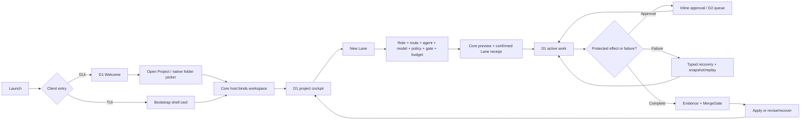

# Viden Interaction Closed-Loop Implementation Plan

Chinese version: [2026-07-21-interaction-closed-loop.zh-CN.md](2026-07-21-interaction-closed-loop.zh-CN.md)

> **For agentic workers:** REQUIRED SUB-SKILL: Use `superpowers:subagent-driven-development` (recommended) or `superpowers:executing-plans` to implement this plan task-by-task. Steps use checkbox (`- [ ]`) syntax for tracking.

**Goal:** Deliver one auditable interaction loop from launch through project binding, Lane creation, built-in or ACP-backed work, approval, evidence/gate, recovery, and resume, while keeping Core, TUI, and GUI independently versioned.

**Architecture:** Core remains the sole authority for project, Lane, agent session, permission, evidence, recovery, persistence, and ordered runtime facts. GUI and TUI differ only in entry and presentation: GUI opens a native folder picker from D1 Welcome, while TUI bootstraps from the shell working directory. Both clients create a Lane through the same typed contract and select the role, route, agent, model, policy, gate, and budget inside Lane creation—not on Welcome.

**Tech Stack:** Rust workspace, `viden-core`/`viden-runtime`/`viden-types`, ACP v1 adapters, JSONL plus rebuildable SQLite, Ratatui/Crossterm, Tauri/TypeScript, Vitest/Playwright, Serde fixtures, bilingual Markdown.

## Global Constraints

- This plan starts from the verified component baseline: Core `0.3.2` at `a927e2f31d2cb9bb6015c30bc0ed0976e958c77e`, TUI `0.3.1`, and GUI `0.1.0-beta.1`.
- The target workspace candidate is `interaction-loop-rc.1`, composed of Core `0.3.3`, TUI `0.3.2`, and GUI `0.1.0-rc.1`. These component versions remain independently releasable.
- TUI and GUI must pin the same immutable Core `0.3.3` checkpoint, schema version, capability set, fixture digest, locale revision, and token revision in their release manifests.
- The product state hierarchy is `Workspace -> Project -> Lane -> Session -> Task/Subagent`.
- `Open Project` binds a folder only. It never selects an agent/model, creates a Lane, or automatically opens D11.
- D11 is explicit project configuration for an already bound project. D4 owns Lane role/route/agent/model/worktree/policy/gate/budget configuration. D1 owns normal operation, D2 owns deferred decisions, and D6 owns recovery.
- Core publishes `RuntimeCommand -> ordered RuntimeEvent -> RuntimeViewState`; clients never infer success from button state, transcript text, process exit alone, or display strings.
- `AgentRole` describes work intent. `AgentRoute` plus adapter identity describes execution. External ACP is not a role.
- Codex, Claude, and Kiro use ACP behind the same typed Core abstraction. Codex app-server may remain an optional enhanced route, but it cannot change product state semantics.
- Background ACP sessions must not auto-deny permission prompts. Permission requests enter the same stable-ID approval queue used by built-in work.
- Locale, skin, mode, density, font scale, motion, accessibility, and TUI color depth are Core-owned presentation preferences. Clients own rendering only.
- Design review order is `docs/viden-design/Viden/index.html` -> client design index -> component library -> TUI unified prototype or GUI desktop cockpit.
- Implementation ownership remains Core `crates/**`, TUI `apps/tui/**`, GUI `apps/gui/**`; integrate strictly Core -> TUI -> GUI.
- Use isolated worktrees. Preserve the dirty root checkout and the current uncommitted GUI worktree changes.
- Update English and Chinese docs together. Do not merge, push, tag, publish, or update Homebrew without a separate explicit authorization.

## Version and Gate Summary

| Gate | Core | TUI | GUI | Exit condition |
| --- | --- | --- | --- | --- |
| `C0 · Contract` | `0.3.3-alpha.1` | fixture consumer | fixture consumer | Typed workspace/Lane/agent-session lifecycle and approval events replay identically. |
| `C1 · Operable` | `0.3.3-rc.1` | `0.3.2-rc.1` | `0.1.0-rc.1` | Both clients complete Welcome/project -> New Lane -> run -> approval/recovery against the same Core checkpoint. |
| `C2 · Closed Loop` | `0.3.3` | `0.3.2` | `0.1.0-rc.1` | A real local task produces test/review evidence, gate decision, apply or recovery, replay, and append-only audit parity. |

The GUI remains an RC because signing, updater, and three-platform publication evidence are outside this interaction-loop plan. Completing C2 does not silently promote GUI to `0.1.0` stable.

## Canonical User Loop



---

### Task 1: Freeze the Corrected Interaction Source of Truth

**Ownership:** Coordination/docs; serialize this task before product branches edit the same documents.

**Files:** Add `docs/user-interaction-flows.md` and `docs/user-interaction-flows.zh-CN.md`; modify `docs/gui-version-functional-design.md`, `docs/gui-version-functional-design.zh-CN.md`, `docs/tui-interaction-flow-design.md`, `docs/tui-interaction-flow-design.zh-CN.md`, `docs/frontend-integration-contract.md`, `docs/frontend-integration-contract.zh-CN.md`, `docs/superpowers/specs/2026-07-19-independent-core-tui-gui-release-train-design.md`, and its `.zh-CN.md` counterpart.

**Contract:** The six canonical flows are entry/binding, Lane creation, active turn/queue, approval, recovery/replay, and preferences. Replace the obsolete “no project -> D11 -> starter Lane” launch rule with “no workspace -> D1 Welcome -> folder binding -> D1 project cockpit.”

- [ ] Start from the interaction-flow files currently present in `.worktrees/v3-gui-client/docs/`; review their complete diff and preserve only the confirmed product semantics.
- [ ] Add a docs test or checker assertion that active docs cannot state that `Open Project` creates a Lane, selects a model, or routes to D11.
- [ ] Run the checker first and confirm it fails on the old release-train wording.
- [ ] Update both languages and mark D11 as explicit project settings only.
- [ ] Run the changed-path bilingual pair/link checks, active visual-source checks, design package checks, and `git diff --check`.
- [ ] Commit: `docs(interaction): freeze the cross-client user loop`.

### Task 2: Add a Typed Agent Adapter and Session Contract to Core

**Ownership:** Core branch only.

**Files:** Modify `crates/types/src/agent.rs`, `crates/types/src/runtime.rs`, `crates/types/src/frontend_services.rs`, `crates/types/src/lib.rs`, `crates/plugin-api/src/lib.rs`, `crates/plugin-host/src/lib.rs`, `crates/runtime/src/runtime_contract.rs`, `crates/runtime/src/runtime_supervisor.rs`, `crates/core/src/lib.rs`, and focused tests under `crates/types/src/tests.rs` and `crates/runtime/src/tests/`.

**Interfaces:**

```rust
pub enum AgentAdapterSource { BuiltIn, Registry, LocalCommand }
pub enum AgentAvailability { Available, NeedsInstall, NeedsAuth, Unavailable }
pub enum AgentAuthState { Unknown, Ready, LoggedOut, Error }

pub struct AgentAdapterView {
    pub agent_id: String,
    pub display_name: String,
    pub route: AgentRoute,
    pub source: AgentAdapterSource,
    pub availability: AgentAvailability,
    pub auth_state: AgentAuthState,
    pub capabilities: Vec<CapabilityId>,
    pub models: Vec<String>,
    pub diagnostics: Vec<String>,
}

pub struct AgentSessionRequest {
    pub lane_id: AgentLaneId,
    pub agent_id: String,
    pub model: Option<String>,
    pub load_session_id: Option<String>,
    pub task: String,
}

RuntimeCommand::{QueryAgentAdapters, ProbeAgentAdapter { agent_id },
    StartAgentSession { request }, CancelAgentSession { session_id }}

RuntimeEventKind::{AgentAdaptersLoaded, AgentAdapterProbed,
    AgentSessionStarted, AgentSessionUpdated, AgentSessionCompleted,
    AgentSessionFailed}
```

`RuntimeViewState` must project adapters and active/recent agent sessions with stable Lane/session ownership. `AgentRole` remains Planner/Coder/Reviewer/Tester/DocWriter/Researcher/ReleaseOperator; route and adapter identity remain separate.

- [ ] Write failing serialization, unknown-adapter, unavailable-auth, capability-negotiation, stable-owner, cancel-idempotency, snapshot, replay, and legacy-migration tests.
- [ ] Run `cargo test -p viden-types -p viden-plugin-api -p viden-plugin-host -p viden-runtime`; confirm the new tests fail for missing typed lifecycle variants.
- [ ] Implement the smallest typed contract and reducer changes without exposing raw ACP JSON to clients.
- [ ] Update built-in descriptors for `claude-acp`, `codex-acp`, and `kiro-cli`; resolve Registry versions at implementation time, pin exact versions, and record the source/revision rather than using floating `latest`.
- [ ] Add capability IDs for adapter discovery, agent session lifecycle, and permission bridging; keep them as negotiated extensions under schema v1 unless the serialized envelope must break.
- [ ] Re-run focused tests and `scripts/check-dependency-boundaries.sh`.
- [ ] Commit: `feat(core): type external agent session lifecycle`.

### Task 3: Route Foreground and Background ACP Permissions Through the Supervisor

**Ownership:** Core branch only.

**Files:** Modify `crates/runtime/src/agent_commands.rs`, `crates/runtime/src/runtime_supervisor.rs`, `crates/runtime/src/runtime_contract.rs`, `crates/runtime/src/tests/runtime_supervisor_tests.rs`, `crates/runtime/src/tests/runtime_contract_tests.rs`, and `crates/runtime/src/tests/runtime_command_tests.rs`.

**Behavior:** `/agent` remains a compatibility shell surface, but typed clients call the new command variants. Foreground and asynchronous ACP work share the same supervisor, approval queue, expiry/default-deny policy, audit ID, cancel path, evidence projection, and replay path.

- [ ] Replace the test expectation “background ACP jobs reject permission requests” with a failing expectation that the request becomes `ApprovalRequested` and pauses only its owner.
- [ ] Add concurrent tests: one ACP Lane waits for approval while another Lane streams; approve/deny/expire/cancel each resolve exactly one stable request ID.
- [ ] Add adapter-specific protocol fixtures for Claude ACP, Codex ACP, and Kiro ACP permission/tool update shapes.
- [ ] Implement a supervisor-owned ACP session job. Remove the asynchronous auto-deny callback after the typed bridge passes.
- [ ] Ensure plan/read-only mutation rules still reject before execution and that agent-native auth data never enters Viden transcripts or config.
- [ ] Run `cargo test -p viden-runtime agent_`, supervisor tests, contract tests, then the full runtime crate.
- [ ] Commit: `feat(runtime): bridge ACP approvals into ordered runtime state`.

### Task 4: Freeze the Interaction-Loop Fixture and Core 0.3.3 Checkpoint

**Ownership:** Core branch, then integration coordinator.

**Files:** Add `crates/types/tests/fixtures/frontend-contract-v1/interaction-closed-loop.json` and `crates/core/release-manifest.toml`; modify the fixture catalog/check scripts, `crates/core/Cargo.toml`, `docs/core-0.3-compatibility.md`, and `.zh-CN.md`.

**Fixture sequence:** `ProjectOpenNoLane -> StarterLanePreviewed -> StarterLaneCreated -> AgentAdaptersLoaded -> AgentSessionStarted -> tool update -> ApprovalRequested -> ApprovalResolved -> evidence -> MergeGate -> apply conflict -> recovery -> replay -> completed`.

- [ ] Write the fixture with deterministic IDs, cursors, owner bindings, locale-neutral fact keys, and both built-in and ACP variants.
- [ ] Verify the fixture initially fails until Tasks 2–3 are complete.
- [ ] Add digest and normalized `RuntimeViewState` expectations; prove gap/reconnect replay reaches the same final state.
- [ ] Run Core fixture, migration, types/runtime/core, dependency-boundary, and `cargo test --workspace --quiet` gates.
- [ ] Set Core version to `0.3.3`, commit the checkpoint, and record its full SHA and contract payload digest. Do not create or move a tag without explicit authorization.
- [ ] Commit: `test(contract): freeze the interaction loop checkpoint`.

### Task 5: Deliver TUI 0.3.2 on the Core 0.3.3 Checkpoint

**Ownership:** TUI branch only; branch/rebase from the immutable Task 4 SHA.

**Files:** Modify `apps/tui/src/tui/app.rs`, `client.rs`, `command_palette.rs`, `modal.rs`, `projection.rs`, `screen.rs`, `side_screen.rs`, `state.rs`, `i18n.rs`, `apps/tui/release-manifest.toml`, TUI tests, and deterministic preview evidence.

**Behavior:** Startup probes the Core-bound shell working directory. `/lanes` or the selector opens Lane creation; agent configuration occurs in that overlay. The user can choose built-in/Codex/Claude/Kiro, inspect availability/auth diagnostics, start work, answer approval without locking the composer, cancel by exact owner, and recover through typed actions.

- [ ] Add failing fixture-consumer tests for `ProjectOpenNoLane`, Lane creation, agent selection, ACP approval, completion, and replay.
- [ ] Add keyboard tests for selector-first navigation, `Esc` layering, `Ctrl-C` current-owner cancellation, approval focus, and editable composer while another Lane waits.
- [ ] Implement adapter and session projections using only `CoreClient`; do not call agent commands, provider registry, process, Git, or persistence directly.
- [ ] Add `en`/`zh-CN` keys for adapter availability, auth guidance, approval/recovery, and unsupported capability; retain raw logs and user/model content verbatim.
- [ ] Update `apps/tui/release-manifest.toml` to version `0.3.2` and pin Task 4 SHA/digests/capabilities.
- [ ] Run `cargo test -p viden-tui`, `scripts/tui-turn-controller-smoke.sh`, `scripts/rc-tui-stability-smoke.sh`, `scripts/tui-regression.sh`, and `scripts/tui-previews.sh`; review narrow/CJK/theme evidence.
- [ ] Commit: `feat(tui): close the project lane and agent loop`.

### Task 6: Make D1 Welcome and Folder Binding the GUI Entry

**Ownership:** GUI branch only; preserve and reconcile the existing uncommitted GUI worktree diff before editing.

**Files:** Modify `apps/gui/src/main.ts`, `apps/gui/src/components/welcome_center.ts`, `welcome_center.css`, `apps/gui/src/screens/d1_cockpit.ts`, `d1_cockpit.css`, `apps/gui/src-tauri/src/adapter.rs`, `lib.rs`, Tauri capabilities, `apps/gui/tests/bootstrap.spec.ts`, `standalone_bootstrap.spec.ts`, `d1_cockpit.spec.ts`, and visual tests.

**Behavior:** A standalone launch shows D1 Welcome inside the desktop cockpit shell. `Open Project` invokes one native directory picker, binds the selected folder through the host boundary, and then renders D1 project cockpit. Cancel leaves `NoWorkspace`; failure keeps the last confirmed binding and enters typed recovery. There is no white webview frame and no model/Lane setup on Welcome.

- [ ] Add failing standalone tests for Welcome, picker cancellation, successful folder binding, failed binding, recent project selection, and no implicit D11/D4 navigation.
- [ ] Add a native-window visual assertion for transparent/dark cockpit chrome with no white outer webview background.
- [ ] Implement the host binding transition and request a fresh Core projection after success; never mutate the displayed project path optimistically.
- [ ] Keep D11 reachable only from explicit project settings after binding.
- [ ] Run GUI unit, Rust adapter, standalone bootstrap, D1 visual, CJK, keyboard, and accessibility checks.
- [ ] Commit: `feat(gui): make welcome and folder binding the desktop entry`.

### Task 7: Complete GUI D4 -> D1 -> D2/D6 Agent Operation

**Ownership:** GUI branch only.

**Files:** Modify `apps/gui/src/screens/d4_lane_create.ts`, `d4_lane_create.css`, `d1_cockpit.ts`, `d6_recovery.ts`, add `apps/gui/src/screens/d2_decisions.ts` and CSS, modify `components/permission_dock.ts`, `live_work.ts`, `activity_rail.ts`, i18n catalogs, Tauri adapter commands, and corresponding Vitest/Playwright/Rust tests.

**Behavior:** D4 chooses role, route, adapter, model, worktree, mutation policy, gate, and budget. A confirmed Core receipt selects the exact Lane and returns to D1. ACP updates render in Live Work/transcript; inline approvals remain actionable and D2 stores deferred decisions. D6 renders only Core recovery actions and performs snapshot/replay on cursor gaps.

- [ ] Add failing tests for adapter discovery/probe/auth state, invalid role-route combinations, unavailable agent, preview invalidation, exact receipt navigation, background approval, cancel, reconnect, and replay.
- [ ] Render Codex/Claude/Kiro as adapter choices, not roles. Disable unsupported actions with Core diagnostics and preserve Lane draft fields.
- [ ] Add the minimal D2 queue needed to revisit a stable approval ID; do not expand into team/fleet governance.
- [ ] Add a real ACP mock harness proving streaming -> tool -> approval -> evidence -> completion, plus deny/expire/cancel variants.
- [ ] Update `apps/gui/release-manifest.toml` to `0.1.0-rc.1` with the exact Core SHA and interaction fixture.
- [ ] Run GUI Rust tests, Vitest, Playwright D1/D2/D4/D6, theme matrix, contrast, CJK IME, transcript virtualization, reconnect, and architecture-boundary checks.
- [ ] Commit: `feat(gui): close lane agent approval and recovery flows`.

### Task 8: Prove Shared Locale and Appearance Configuration Across the Loop

**Ownership:** Core first for contract gaps, then TUI and GUI in their exclusive scopes.

**Files:** Modify Core preference fixtures only if required; TUI `i18n.rs`, `preferences.rs`, `theme.rs`; GUI `preferences.ts`, `i18n/*`, `ui/theme.ts`, settings component/screen; release manifests and visual evidence.

**Acceptance matrix:** `en` and `zh-CN`; eight valid skin/mode pairs; compact/regular/comfy; system/reduced/full motion; GUI font scale/accessibility; TUI auto/truecolor/ansi256/ansi16.

- [ ] Add cross-client key/argument parity tests for every new interaction-loop fact and visible control.
- [ ] Add hot-switch tests while an ACP session is active and while approval/recovery is visible; stable IDs, transcript content, and audit facts must not change.
- [ ] Verify invalid appearance combinations produce a visible Core diagnostic and an atomic safe fallback.
- [ ] Verify all theme variants retain visible focus, non-color status cues, CJK layout, and reduced motion.
- [ ] Run locale catalog, generated-token parity, GUI visual matrix, TUI previews, and `git diff --check`.
- [ ] Commit per owner: `test(ui): verify interaction loop preference parity`.

### Task 9: Certify `interaction-loop-rc.1` in Core -> TUI -> GUI Order

**Ownership:** Integration worktree only.

**Files:** Add `docs/integration/interaction-loop-rc.1.md` and `.zh-CN.md`; add `scripts/run-interaction-closed-loop.sh`; update component manifests and compatibility matrix.

- [ ] Create a clean integration candidate from synchronized `origin/main`; do not reuse the current stale integration head without first proving its ancestry.
- [ ] Integrate the immutable Core 0.3.3 checkpoint and run migration, fixture, dependency, and workspace gates.
- [ ] Integrate TUI 0.3.2, rerun shared parity plus all TUI stability/visual gates.
- [ ] Integrate GUI 0.1.0-rc.1, rerun shared parity plus GUI architecture/visual/a11y/performance gates.
- [ ] Run the deterministic loop through Core, TUI, and GUI and compare final normalized view, cursor, evidence, MergeGate, recovery, and audit digests.
- [ ] Run one live, user-authenticated smoke per available Codex/Claude/Kiro adapter without persisting credentials. Record unavailable/logged-out adapters as explicit skipped evidence, not success.
- [ ] Record workspace candidate, component versions, full SHAs, schema, capabilities, fixture/locale/token digests, exact commands, results, skips, and residual risks in both languages.
- [ ] Commit: `docs(integration): certify interaction loop rc1`.

### Task 10: Final Review and Main Readiness

**Ownership:** Integration coordinator; read-only review until fixes are assigned to the owning branch.

**Files:** Modify `PLAN.md`, `docs/staged-roadmap.md`, `.zh-CN.md`, and release status docs only after C2 passes.

- [ ] Review the full integrated diff for frontend-private business state, direct effects, ACP secrets, inferred success, floating package versions, copied palettes, untranslated chrome, and missing protocol/safety comments.
- [ ] Run placeholder scans for `TODO`, `FIXME`, `XXX`, mock-only success paths, “not connected yet,” and obsolete D11 launch wording; classify every intentional occurrence.
- [ ] Run format, clippy, all focused gates, `cargo test --workspace --quiet`, docs pair/link checks, design checks, and `git diff --check` in the clean integration worktree.
- [ ] Confirm manifests identify Core `0.3.3`, TUI `0.3.2`, GUI `0.1.0-rc.1`, the exact Core SHA, and matching schema/capability/digests.
- [ ] Update roadmap status only with verified evidence. Do not call the candidate released and do not merge or push `main` without explicit authorization.
- [ ] Commit: `docs(release): record interaction loop readiness`.

## Definition of Done

The plan is complete when both clients can enter a project, create the same typed Lane, select a built-in or ACP adapter, run and queue work, answer or defer stable-ID approvals, cancel the exact owner, produce evidence and a MergeGate result, apply or recover, reconnect through snapshot/replay, and resume with the same Core facts. The final evidence must name the independent component versions and exact Core checkpoint, and must prove locale/appearance parity without changing business state.
