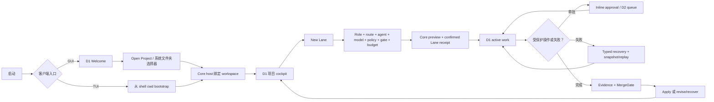

# Viden 交互闭环实施计划

英文版：[2026-07-21-interaction-closed-loop.md](2026-07-21-interaction-closed-loop.md)

> **给 agentic workers：** 执行时必须使用 `superpowers:subagent-driven-development`（推荐）或 `superpowers:executing-plans`，并逐项跟踪复选框（`- [ ]`）。

**目标：** 交付一条从启动、项目绑定、Lane 创建、内置或 ACP Agent 工作、审批、证据/门禁、恢复到继续工作的可审计交互闭环，同时保持 Core、TUI、GUI 独立版本号。

**架构：** Core 是项目、Lane、Agent session、权限、证据、恢复、持久化和有序 runtime 事实的唯一权威。GUI 与 TUI 只在入口和呈现上不同：GUI 从 D1 Welcome 打开系统文件夹选择器，TUI 从 shell 当前工作目录启动。两端都通过同一 typed contract 创建 Lane；role、route、agent、model、policy、gate 和 budget 只在 Lane 创建中选择，不放在 Welcome。

**技术栈：** Rust workspace、`viden-core`/`viden-runtime`/`viden-types`、ACP v1 adapter、JSONL + 可重建 SQLite、Ratatui/Crossterm、Tauri/TypeScript、Vitest/Playwright、Serde fixtures、中英双语 Markdown。

## 全局约束

- 本计划从已核验的组件基线开始：Core `0.3.2`（`a927e2f31d2cb9bb6015c30bc0ed0976e958c77e`）、TUI `0.3.1`、GUI `0.1.0-beta.1`。
- 目标 workspace candidate 为 `interaction-loop-rc.1`，由 Core `0.3.3`、TUI `0.3.2`、GUI `0.1.0-rc.1` 组成；三个组件仍可独立发版。
- TUI、GUI release manifest 必须固定同一个不可变 Core `0.3.3` checkpoint、schema、capabilities、fixture digest、locale revision 和 token revision。
- 产品层级固定为 `Workspace -> Project -> Lane -> Session -> Task/Subagent`。
- `Open Project` 只绑定文件夹，不选择 Agent/model、不创建 Lane，也不自动进入 D11。
- D11 是已绑定项目的显式项目配置；D4 负责 Lane role/route/agent/model/worktree/policy/gate/budget；D1 负责日常运行，D2 负责延后决策，D6 负责恢复。
- Core 发布 `RuntimeCommand -> ordered RuntimeEvent -> RuntimeViewState`；客户端不得根据按钮状态、transcript 文案、单独的进程退出码或显示字符串推断成功。
- `AgentRole` 描述工作意图；`AgentRoute` 与 adapter identity 描述执行方式。外部 ACP 不是 role。
- Codex、Claude、Kiro 统一经 ACP 接入 typed Core abstraction。Codex app-server 可保留为增强路径，但不能改变产品状态语义。
- 后台 ACP session 不得自动拒绝权限请求；权限请求进入和内置 Agent 相同的稳定 ID 审批队列。
- locale、skin、mode、density、font scale、motion、accessibility 和 TUI color depth 是 Core-owned presentation preferences；客户端只负责渲染。
- 设计审查顺序固定为 `docs/viden-design/Viden/index.html` -> 客户端设计索引 -> 组件库 -> TUI 统一原型或 GUI 桌面驾驶舱。
- 实现所有权仍是 Core `crates/**`、TUI `apps/tui/**`、GUI `apps/gui/**`，合入顺序严格为 Core -> TUI -> GUI。
- 使用隔离 worktree；保护根目录脏工作区和 GUI worktree 当前未提交改动。
- 中英文文档同步更新。没有单独明确授权时，不合并/推送/tag/发布，也不更新 Homebrew。

## 版本与门禁汇总

| 门禁 | Core | TUI | GUI | 退出条件 |
| --- | --- | --- | --- | --- |
| `C0 · Contract` | `0.3.3-alpha.1` | fixture consumer | fixture consumer | typed workspace/Lane/agent-session 生命周期与审批事件可被两端一致重放。 |
| `C1 · Operable` | `0.3.3-rc.1` | `0.3.2-rc.1` | `0.1.0-rc.1` | 两端基于同一 Core checkpoint 完成 Welcome/project -> New Lane -> run -> approval/recovery。 |
| `C2 · Closed Loop` | `0.3.3` | `0.3.2` | `0.1.0-rc.1` | 真实本地任务产生 test/review evidence、gate decision、apply/recovery、replay 与追加式 audit parity。 |

GUI 仍保持 RC，因为签名、更新器和三平台发布证据不属于本交互闭环计划。完成 C2 不会隐式把 GUI 提升为 `0.1.0` stable。

## 标准用户闭环



---

### 任务 1：冻结修正后的交互真源

**所有权：** 协调/文档；在产品分支修改相同文档前串行完成。

**文件：** 新增 `docs/user-interaction-flows.md`、`docs/user-interaction-flows.zh-CN.md`；修改 `docs/gui-version-functional-design.md`、`.zh-CN.md`、`docs/tui-interaction-flow-design.md`、`.zh-CN.md`、`docs/frontend-integration-contract.md`、`.zh-CN.md`、`docs/superpowers/specs/2026-07-19-independent-core-tui-gui-release-train-design.md` 及中文版。

**合同：** 六条标准流程为入口/绑定、Lane 创建、active turn/queue、审批、恢复/replay、偏好。把旧的“无项目 -> D11 -> starter Lane”启动规则改成“无 workspace -> D1 Welcome -> 文件夹绑定 -> D1 项目 cockpit”。

- [ ] 从 `.worktrees/v3-gui-client/docs/` 当前交互流程文件开始，完整审查 diff，只保留已经确认的产品语义。
- [ ] 增加文档 checker：活跃文档不得声称 `Open Project` 会创建 Lane、选择 model 或跳转 D11。
- [ ] 先运行 checker，确认旧 release-train 文案导致预期失败。
- [ ] 同步更新中英文，并把 D11 明确为显式项目设置。
- [ ] 运行 changed-path 双语配对/链接检查、active visual-source 检查、设计包检查与 `git diff --check`。
- [ ] 提交：`docs(interaction): freeze the cross-client user loop`。

### 任务 2：为 Core 增加 typed Agent Adapter 与 Session 合同

**所有权：** 仅 Core 分支。

**文件：** 修改 `crates/types/src/agent.rs`、`runtime.rs`、`frontend_services.rs`、`lib.rs`、`crates/plugin-api/src/lib.rs`、`crates/plugin-host/src/lib.rs`、`crates/runtime/src/runtime_contract.rs`、`runtime_supervisor.rs`、`crates/core/src/lib.rs` 以及 types/runtime focused tests。

**接口：**

```rust
pub enum AgentAdapterSource { BuiltIn, Registry, LocalCommand }
pub enum AgentAvailability { Available, NeedsInstall, NeedsAuth, Unavailable }
pub enum AgentAuthState { Unknown, Ready, LoggedOut, Error }

pub struct AgentAdapterView {
    pub agent_id: String,
    pub display_name: String,
    pub route: AgentRoute,
    pub source: AgentAdapterSource,
    pub availability: AgentAvailability,
    pub auth_state: AgentAuthState,
    pub capabilities: Vec<CapabilityId>,
    pub models: Vec<String>,
    pub diagnostics: Vec<String>,
}

pub struct AgentSessionRequest {
    pub lane_id: AgentLaneId,
    pub agent_id: String,
    pub model: Option<String>,
    pub load_session_id: Option<String>,
    pub task: String,
}

RuntimeCommand::{QueryAgentAdapters, ProbeAgentAdapter { agent_id },
    StartAgentSession { request }, CancelAgentSession { session_id }}

RuntimeEventKind::{AgentAdaptersLoaded, AgentAdapterProbed,
    AgentSessionStarted, AgentSessionUpdated, AgentSessionCompleted,
    AgentSessionFailed}
```

`RuntimeViewState` 投影 adapter 与 active/recent agent sessions，并带稳定 Lane/session owner。`AgentRole` 保持 Planner/Coder/Reviewer/Tester/DocWriter/Researcher/ReleaseOperator；route 和 adapter identity 分离。

- [ ] 先写 serialization、unknown adapter、auth unavailable、capability negotiation、stable owner、cancel idempotency、snapshot、replay 和 legacy migration 失败测试。
- [ ] 运行 `cargo test -p viden-types -p viden-plugin-api -p viden-plugin-host -p viden-runtime`，确认新测试因缺 typed lifecycle variant 失败。
- [ ] 实现最小 typed contract 与 reducer 改动，不向客户端暴露 raw ACP JSON。
- [ ] 更新 `claude-acp`、`codex-acp`、`kiro-cli` 内置 descriptor；执行时查询 Registry 当前版本、固定精确版本并记录来源/revision，不使用浮动 `latest`。
- [ ] 增加 adapter discovery、agent session lifecycle、permission bridge capability；只要 serialized envelope 不 breaking，就作为 schema v1 negotiated extension。
- [ ] 重跑 focused tests 与 `scripts/check-dependency-boundaries.sh`。
- [ ] 提交：`feat(core): type external agent session lifecycle`。

### 任务 3：将前台与后台 ACP 权限统一接入 Supervisor

**所有权：** 仅 Core 分支。

**文件：** 修改 `crates/runtime/src/agent_commands.rs`、`runtime_supervisor.rs`、`runtime_contract.rs` 及 `runtime_supervisor_tests.rs`、`runtime_contract_tests.rs`、`runtime_command_tests.rs`。

**行为：** `/agent` 保留为兼容 shell surface，typed client 使用新 command variant。前台和异步 ACP work 共用 supervisor、审批队列、过期/default-deny、audit ID、cancel、evidence projection 与 replay 路径。

- [ ] 把“background ACP jobs reject permission requests”测试改为失败预期：请求生成 `ApprovalRequested`，且只暂停所属 owner。
- [ ] 增加并发测试：一条 ACP Lane 等审批时另一条仍可 stream；approve/deny/expire/cancel 各自只解析一个 stable request ID。
- [ ] 为 Claude ACP、Codex ACP、Kiro ACP 的 permission/tool update shape 增加 adapter-specific protocol fixture。
- [ ] 实现 supervisor-owned ACP session job；typed bridge 通过后移除异步 auto-deny callback。
- [ ] 保证 plan/read-only mutation 仍在执行前拒绝，并保证 agent-native auth 数据不进入 Viden transcript/config。
- [ ] 运行 `cargo test -p viden-runtime agent_`、supervisor tests、contract tests，再跑完整 runtime crate。
- [ ] 提交：`feat(runtime): bridge ACP approvals into ordered runtime state`。

### 任务 4：冻结交互闭环 Fixture 与 Core 0.3.3 Checkpoint

**所有权：** Core 分支，然后交给 integration coordinator。

**文件：** 新增 `crates/types/tests/fixtures/frontend-contract-v1/interaction-closed-loop.json` 和 `crates/core/release-manifest.toml`；修改 fixture catalog/check scripts、`crates/core/Cargo.toml`、`docs/core-0.3-compatibility.md` 与中文版。

**Fixture 顺序：** `ProjectOpenNoLane -> StarterLanePreviewed -> StarterLaneCreated -> AgentAdaptersLoaded -> AgentSessionStarted -> tool update -> ApprovalRequested -> ApprovalResolved -> evidence -> MergeGate -> apply conflict -> recovery -> replay -> completed`。

- [ ] 使用确定 ID、cursor、owner、locale-neutral fact key 编写 fixture，并包含 built-in 与 ACP 两种变体。
- [ ] 在任务 2–3 未完成时先确认 fixture 失败。
- [ ] 增加 digest 和 normalized `RuntimeViewState` 预期，证明 gap/reconnect replay 到达相同终态。
- [ ] 运行 Core fixture、migration、types/runtime/core、dependency boundary 与 `cargo test --workspace --quiet`。
- [ ] 设置 Core 版本为 `0.3.3`，提交 checkpoint，记录完整 SHA 与 contract payload digest；没有明确授权时不创建/移动 tag。
- [ ] 提交：`test(contract): freeze the interaction loop checkpoint`。

### 任务 5：基于 Core 0.3.3 Checkpoint 交付 TUI 0.3.2

**所有权：** 仅 TUI 分支；从任务 4 不可变 SHA 创建分支或 rebase。

**文件：** 修改 `apps/tui/src/tui/app.rs`、`client.rs`、`command_palette.rs`、`modal.rs`、`projection.rs`、`screen.rs`、`side_screen.rs`、`state.rs`、`i18n.rs`、`apps/tui/release-manifest.toml`、TUI tests 与确定性 preview evidence。

**行为：** 启动时探测 Core 绑定的 shell cwd；`/lanes` 或 selector 进入 Lane 创建，并在 overlay 中配置 Agent。用户可选择 built-in/Codex/Claude/Kiro、查看可用性/auth diagnostics、启动任务、在不锁 composer 的情况下审批、按精确 owner 取消，并使用 typed recovery action 恢复。

- [ ] 增加 `ProjectOpenNoLane`、Lane 创建、Agent 选择、ACP 审批、完成与 replay 的失败 fixture-consumer tests。
- [ ] 增加 selector-first、`Esc` 分层、`Ctrl-C` 当前 owner 取消、approval focus、另一 Lane 等审批时 composer 可编辑的键盘测试。
- [ ] 只通过 `CoreClient` 实现 adapter/session projection；不得直接调用 agent command、provider registry、process、Git 或 persistence。
- [ ] 为 adapter availability、auth guidance、approval/recovery、unsupported capability 增加 `en`/`zh-CN` key；raw logs 与用户/model 内容保持原文。
- [ ] 将 `apps/tui/release-manifest.toml` 更新为 `0.3.2`，固定任务 4 SHA/digest/capabilities。
- [ ] 运行 `cargo test -p viden-tui`、`scripts/tui-turn-controller-smoke.sh`、`scripts/rc-tui-stability-smoke.sh`、`scripts/tui-regression.sh`、`scripts/tui-previews.sh`，审查窄屏/CJK/theme evidence。
- [ ] 提交：`feat(tui): close the project lane and agent loop`。

### 任务 6：让 D1 Welcome 与文件夹绑定成为 GUI 入口

**所有权：** 仅 GUI 分支；编辑前保护并协调 GUI worktree 当前未提交 diff。

**文件：** 修改 `apps/gui/src/main.ts`、`components/welcome_center.ts`/`.css`、`screens/d1_cockpit.ts`/`.css`、`src-tauri/src/adapter.rs`、`lib.rs`、Tauri capabilities、`bootstrap.spec.ts`、`standalone_bootstrap.spec.ts`、`d1_cockpit.spec.ts` 与 visual tests。

**行为：** app 独立启动时在桌面 cockpit shell 内显示 D1 Welcome。`Open Project` 只调用一次系统目录选择器，通过 host boundary 绑定文件夹，然后渲染 D1 项目 cockpit。取消保持 `NoWorkspace`；失败保留上一个已确认 binding 并进入 typed recovery。Welcome 上没有 model/Lane setup，webview 外围没有白色框。

- [ ] 增加 Welcome、picker cancel、成功绑定、绑定失败、recent project、禁止隐式跳 D11/D4 的 standalone 失败测试。
- [ ] 增加 native-window visual assertion：透明/深色 cockpit chrome，不能出现白色 webview 外框。
- [ ] 实现 host binding transition；成功后重新请求 Core projection，不乐观修改显示项目路径。
- [ ] D11 只允许从已绑定项目的显式 settings 进入。
- [ ] 运行 GUI unit、Rust adapter、standalone bootstrap、D1 visual、CJK、keyboard、accessibility 检查。
- [ ] 提交：`feat(gui): make welcome and folder binding the desktop entry`。

### 任务 7：完成 GUI D4 -> D1 -> D2/D6 Agent 运行

**所有权：** 仅 GUI 分支。

**文件：** 修改 `apps/gui/src/screens/d4_lane_create.ts`/`.css`、`d1_cockpit.ts`、`d6_recovery.ts`；新增 `d2_decisions.ts` 与 CSS；修改 `components/permission_dock.ts`、`live_work.ts`、`activity_rail.ts`、i18n catalogs、Tauri adapter commands 及对应 Vitest/Playwright/Rust tests。

**行为：** D4 选择 role、route、adapter、model、worktree、mutation policy、gate、budget。Core receipt 确认后精确选择 Lane 并回 D1。ACP update 显示在 Live Work/transcript；inline approval 可立即操作，D2 保存延后决策。D6 只显示 Core recovery actions，cursor gap 必须 snapshot/replay。

- [ ] 增加 adapter discovery/probe/auth、非法 role-route、agent unavailable、preview invalidation、receipt 精确导航、后台 approval、cancel、reconnect、replay 失败测试。
- [ ] 把 Codex/Claude/Kiro 渲染成 adapter，不是 role；使用 Core diagnostics 禁用不可用动作并保留 Lane draft。
- [ ] 增加最小 D2 queue，用稳定 approval ID 重新进入决策；不扩展到 team/fleet governance。
- [ ] 增加真实 ACP mock harness，证明 streaming -> tool -> approval -> evidence -> completion，并覆盖 deny/expire/cancel。
- [ ] 把 `apps/gui/release-manifest.toml` 更新为 `0.1.0-rc.1`，固定 Core SHA 与 interaction fixture。
- [ ] 运行 GUI Rust tests、Vitest、Playwright D1/D2/D4/D6、theme matrix、contrast、CJK IME、transcript virtualization、reconnect、architecture-boundary checks。
- [ ] 提交：`feat(gui): close lane agent approval and recovery flows`。

### 任务 8：证明闭环中的共享多语言与外观配置

**所有权：** Core contract 缺口先处理；随后 TUI、GUI 各自在独占范围实现。

**文件：** 仅在必要时修改 Core preference fixtures；TUI `i18n.rs`、`preferences.rs`、`theme.rs`；GUI `preferences.ts`、`i18n/*`、`ui/theme.ts`、settings component/screen；release manifests 与 visual evidence。

**验收矩阵：** `en`、`zh-CN`；8 个有效 skin/mode；compact/regular/comfy；system/reduced/full motion；GUI font scale/accessibility；TUI auto/truecolor/ansi256/ansi16。

- [ ] 为所有新增交互事实和可见控件增加跨端 key/argument parity tests。
- [ ] 增加 ACP session active、approval/recovery 可见时的热切换测试；stable ID、transcript 与 audit fact 不得变化。
- [ ] 验证非法外观组合产生可见 Core diagnostic 和原子安全 fallback。
- [ ] 验证所有 theme 的 visible focus、非颜色状态提示、CJK layout、reduced motion。
- [ ] 运行 locale catalog、generated-token parity、GUI visual matrix、TUI previews 与 `git diff --check`。
- [ ] 各 owner 分别提交：`test(ui): verify interaction loop preference parity`。

### 任务 9：按 Core -> TUI -> GUI 认证 `interaction-loop-rc.1`

**所有权：** 仅 integration worktree。

**文件：** 新增 `docs/integration/interaction-loop-rc.1.md`、`.zh-CN.md`、`scripts/run-interaction-closed-loop.sh`；更新 component manifests 与 compatibility matrix。

- [ ] 从同步后的 `origin/main` 创建干净 integration candidate；没有先证明 ancestry 时，不复用当前过期 integration head。
- [ ] 先集成不可变 Core 0.3.3 checkpoint，运行 migration、fixture、dependency、workspace gates。
- [ ] 再集成 TUI 0.3.2，重跑 shared parity 与全部 TUI stability/visual gates。
- [ ] 最后集成 GUI 0.1.0-rc.1，重跑 shared parity 与 GUI architecture/visual/a11y/performance gates。
- [ ] 通过 Core、TUI、GUI 跑 deterministic loop，对比 final normalized view、cursor、evidence、MergeGate、recovery、audit digest。
- [ ] 对用户已认证且可用的 Codex/Claude/Kiro adapter 各跑一次 live smoke，不持久化凭据；不可用/未登录必须记录为 skipped evidence，不能算成功。
- [ ] 中英文记录 workspace candidate、组件版本、完整 SHA、schema、capabilities、fixture/locale/token digest、精确命令、结果、skips 和残余风险。
- [ ] 提交：`docs(integration): certify interaction loop rc1`。

### 任务 10：最终审查与 Main Readiness

**所有权：** Integration coordinator；发现问题先只读审查，再分配给所属分支修复。

**文件：** 仅在 C2 通过后修改 `PLAN.md`、`docs/staged-roadmap.md`、`.zh-CN.md` 与 release status docs。

- [ ] 审查完整集成 diff，排查 frontend-private business state、直接副作用、ACP secret、推断成功、浮动包版本、复制 palette、未翻译 chrome 和缺失 protocol/safety 注释。
- [ ] 扫描 `TODO`、`FIXME`、`XXX`、mock-only success path、“not connected yet”和旧 D11 启动文案；逐项分类所有有意保留内容。
- [ ] 在干净 integration worktree 运行 format、clippy、全部 focused gates、`cargo test --workspace --quiet`、文档配对/链接、设计检查与 `git diff --check`。
- [ ] 确认 manifests 明确 Core `0.3.3`、TUI `0.3.2`、GUI `0.1.0-rc.1`、精确 Core SHA 及一致 schema/capability/digests。
- [ ] 只按已验证证据更新 roadmap；不得称为已发布，也不得在未明确授权时合并或推送 `main`。
- [ ] 提交：`docs(release): record interaction loop readiness`。

## 完成定义

当两个客户端都能进入项目、创建同一 typed Lane、选择内置或 ACP adapter、运行并排队任务、响应或延后稳定 ID 审批、取消精确 owner、产生 evidence 与 MergeGate、apply 或 recovery、通过 snapshot/replay 重连并在相同 Core 事实上继续工作时，本计划完成。最终证据必须写明三个独立组件版本与精确 Core checkpoint，并证明多语言/外观切换不会改变业务状态。
