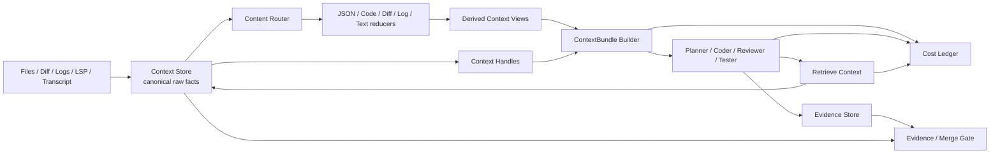
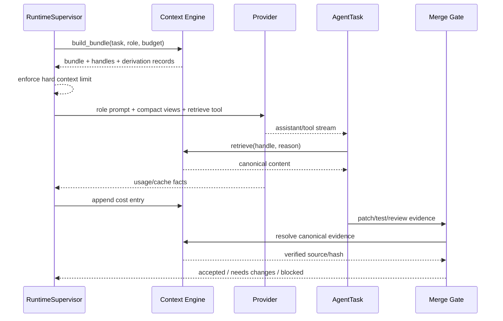

# Context, Evidence, And Cost Engine Design

Chinese version: [2026-07-18-context-evidence-cost-engine-design.zh-CN.md](2026-07-18-context-evidence-cost-engine-design.zh-CN.md)

Last updated: 2026-07-18

## Decision

Viden will implement context, evidence, and cost orchestration as Rust-native
core capabilities. Headroom is a reference implementation and may be connected
later through an optional plugin, MCP server, or benchmark adapter. It is not a
required runtime dependency and does not sit on the mandatory provider request
path.

The engine optimizes task success per unit cost. Token reduction alone is not a
success criterion.

## Product Requirements

The engine must:

- build a role-specific `ContextBundle` for every provider-backed `AgentTask`;
- store raw context and raw evidence as canonical, auditable facts;
- derive compact views for model input without replacing canonical facts;
- route code, diff, JSON, logs, diagnostics, and prose to deterministic,
  content-aware reducers;
- let agents share stable `ContextHandle` references instead of copying full
  content between prompts;
- let an agent retrieve the exact canonical source when a compact view is
  insufficient;
- attribute tokens, provider cost, cache use, retries, retrievals, and
  compaction decisions to agent, task, DAG, and workflow scopes;
- enforce context budgets before provider calls and classify overflow failures;
- require merge gates to validate canonical evidence, never only a summary;
- expose all state through `RuntimeCommand`, `RuntimeEvent`, and
  `RuntimeViewState` so TUI and GUI remain clients of the same runtime;
- support controlled with-engine/without-engine benchmark runs.

## Non-Goals

- A generic vector database in the first slice.
- Model-based summarization on the mandatory request path.
- Replacing JSONL logs as canonical history. `viden-workflows` owns
  project-level Agent DAG/task/evidence/canonicalization/MergeGate facts;
  `viden-session` owns session conversation, tool, cost, and audit facts.
- Letting UI clients edit context records or calculate authoritative cost.
- Making Headroom, Python, a local proxy, or an MCP process mandatory.
- Claiming savings from estimated counterfactual output without a labelled
  measurement method.

## Architecture

### Ownership

| Unit | Owns | Must not own |
| --- | --- | --- |
| `crates/types` | Stable records, commands, events, and view-state contracts. | Persistence, reduction algorithms, UI rendering. |
| `crates/context` | Canonical context store, content routing, deterministic reducers, retrieval, quality checks, and cost ledger math. | Provider HTTP, permissions, workflow scheduling, UI. |
| `crates/runtime` | Bundle orchestration, budget enforcement, event emission, provider integration, and recovery. | UI layout or provider-specific pricing tables. |
| `crates/provider` | Provider usage/cache facts and protocol capabilities. | Workflow budgets or context selection policy. |
| `crates/workflows` | Durable task/DAG/evidence relationships and event replay. | Reduction algorithms or provider calls. |
| `crates/plugin-api` / `plugin-host` | Optional context reducer/benchmark adapter descriptors and isolation. | Mandatory context processing. |
| `apps/tui` / `apps/gui` | Render projected facts and send runtime commands. | Canonical storage, cost authority, reduction, or merge decisions. |

Project agent facts are single-owned by `viden-workflows`. Runtime startup and
resume first replay legacy session transcript entries for compatibility, then
apply workflow projections so workflow facts win deterministically. New runtime
commands must not dual-write the same DAG/task/evidence/gate semantic fact as a
session `runtime_event`.

## Core Contracts

### ContextItem

A canonical source record contains:

- stable item id and content hash;
- task/workflow ownership and source URI/path;
- content kind and media type;
- raw byte length and token estimate;
- sensitivity and exclusion labels;
- creation time and provenance;
- canonical storage reference.

### ContextView

A derived view contains:

- source item id;
- reducer id and reducer version;
- compact content or compact storage reference;
- original and reduced token estimates;
- retained and omitted semantic markers;
- quality-check result;
- derivation timestamp.

Changing a reducer creates a new view. It never mutates the canonical item.

### ContextHandle

A handle is a stable reference agents can pass between tasks. It identifies the
canonical item, preferred view, allowed scope, expiry policy, and content hash.
The runtime resolves it; providers never receive local storage paths.

### ContextBundle

The existing `ContextBundleRecord` evolves from source summaries into a task
manifest containing handles, role policy, source ordering, exclusions, soft
budget, hard limit, estimated provider tokens, and derivation records.

### RetrievalRecord

Every raw retrieval records task, agent/role, handle, reason, returned byte/token
count, permission decision, and timestamp. Retrieval is observable and included
in cost and success analysis.

### CostLedger

The ledger stores actual provider usage when available and clearly labelled
estimates otherwise. Entries are append-only and aggregate by provider request,
agent task, DAG, workflow, and release smoke run.

## Data Flow

## Reduction Policy

The first release uses deterministic reducers:

- JSON: preserve schema keys, errors, identifiers, counts, and selected values;
- code: preserve declarations, signatures, imports, referenced symbols, and
  task-relevant slices;
- diff: preserve file operations, hunk headers, changed symbols, risky changes,
  and bounded hunks;
- logs/tests: preserve command, exit status, first failure, unique errors,
  failing locations, and bounded tail;
- prose/transcript: preserve user constraints, decisions, unresolved questions,
  and recent turns.

Reducers must emit omission metadata. A reducer that cannot prove its output
valid falls back to the original content or rejects the bundle before provider
submission.

## Evidence Invariants

- Canonical evidence is immutable and content-addressed.
- A compact view cannot satisfy a merge-gate requirement by itself.
- Evidence records link task id, bundle id, canonical item id, source hash,
  producer, permission state, and verification result.
- Hash mismatch, missing source, failed quality check, or expired authorization
  moves the gate to `blocked` or `needs_changes`.
- Secret-bearing and excluded context cannot be retrieved by an agent outside
  the originating scope.

## Runtime Events

The contract adds or enriches:

- `ContextBundleBuilt`;
- `ContextItemStored`;
- `ContextViewDerived`;
- `ContextRetrieved`;
- `ContextBudgetExceeded`;
- `ContextQualityFailed`;
- `CostUsageRecorded`;
- `ProviderCacheObserved`;
- `EvidenceCanonicalized`.

Events are replayable. `RuntimeViewState` projects summaries and counters, not
raw secret-bearing content.

## Failure Handling

| Failure | Required behavior |
| --- | --- |
| Hard token limit exceeded | Do not call provider; emit budget event with largest sources and recovery actions. |
| Reducer parse failure | Fall back to bounded raw content or omit with explicit reason. |
| Missing canonical item | Reject retrieval and block dependent evidence. |
| Hash mismatch | Mark source corrupt, block merge gate, retain audit event. |
| Workflow append failure | Reject the command and roll back live project projections before user-visible success. |
| Derived transcript audit append failure | Do not roll back an already committed workflow fact; surface health/audit degradation through the session layer. |
| Patch merge persistence/apply split | Verify the gate from canonical workflow/context facts first, stage file writes, record workflow intent/outcome, and compensate file changes if apply or later recording fails. |
| Provider 413/context error | Classify separately, rebuild with stricter policy once, then require user-visible recovery. |
| Unknown provider usage | Record unknown actual cost and a labelled estimate; never fabricate precision. |
| Optional Headroom adapter unavailable | Continue with native engine; report adapter health only. |

## Version Allocation

- `0.2.1`: native context store, typed routing, deterministic reducers,
  handles/retrieval, budget enforcement, and cost ledger.
- `0.2.3`: canonical evidence linkage and merge-gate verification.
- `0.2.4`: optional Headroom plugin/MCP/benchmark adapter behind capability
  negotiation.
- `0.2.5`: DeepSeek A/B real-development gate and release metrics.
- `0.3.x`: TUI/GUI context ledger, retrieval timeline, cost attribution, and
  evidence provenance views over shared runtime state.

## Acceptance Standard

The feature is complete only when:

1. Every provider-backed AgentTask emits a bundle id and uses role-scoped
   handles.
2. Retrieval returns bytes matching the canonical source hash.
3. Reducers are deterministic and record omissions and versioning.
4. Hard limits stop requests before provider submission.
5. Cost totals reconcile with provider-reported usage within integer rounding;
   estimates are labelled.
6. Merge gates resolve canonical evidence and reject summary-only evidence.
7. Runtime replay reconstructs bundle, retrieval, cost, and gate projections.
8. TUI/GUI need no direct dependency on context, provider, tool, or workflow
   internals.
9. Three repeated DeepSeek A/B runs show median input-token reduction of at
   least 20%, no task-success regression, no missing required evidence, and no
   new permission bypass.
10. Workspace tests, deterministic context tests, crash/replay tests, and live
    smoke gates pass with token, cost, latency, retrieval, and failure evidence.
