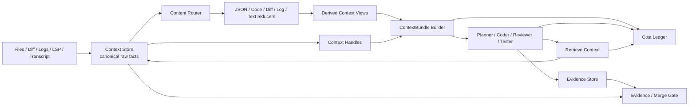
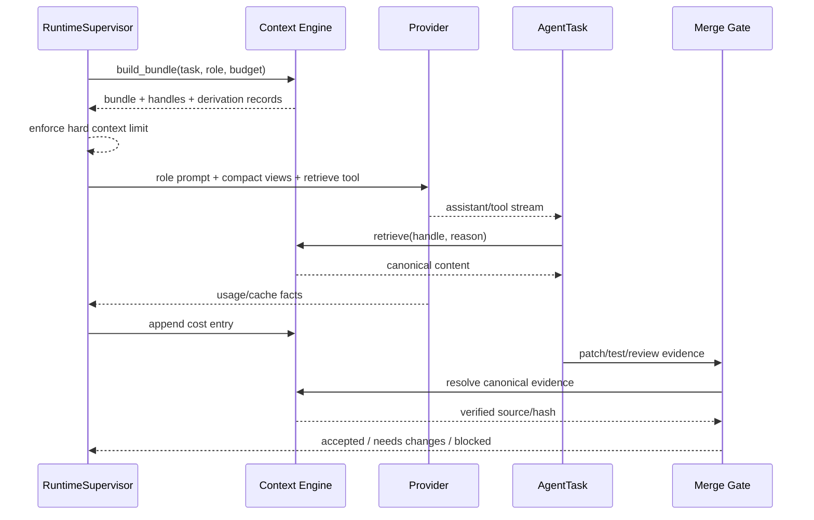

# Context、Evidence 与 Cost Engine 设计

English version: [2026-07-18-context-evidence-cost-engine-design.md](2026-07-18-context-evidence-cost-engine-design.md)

最后更新：2026-07-18

## 决策

Viden 使用 Rust 原生实现上下文、证据和成本编排。Headroom 作为参考实现，未来可通过
可选 plugin、MCP server 或 benchmark adapter 接入，但不能成为必需运行时依赖，也不能
位于 provider 请求的强制路径上。

引擎优化的目标是单位成本下的任务成功率。仅减少 token 不构成成功。

## 产品需求

引擎必须：

- 为每个 provider-backed `AgentTask` 构造按角色裁剪的 `ContextBundle`；
- 把原始上下文和原始证据保存为 canonical、可审计事实；
- 为模型输入生成紧凑派生视图，但不能替代 canonical facts；
- 将代码、Diff、JSON、日志、诊断和普通文本路由到确定性的内容感知 reducer；
- 让 Agent 共享稳定 `ContextHandle`，而不是在 prompt 间复制完整内容；
- 当紧凑视图不足时，允许 Agent 检索完全一致的 canonical source；
- 按 agent、task、DAG 和 workflow 归属 token、provider cost、cache、retry、
  retrieval 和 compaction 决策；
- 在 provider 调用前执行 context budget，分类 context overflow；
- 强制 Merge Gate 校验 canonical evidence，不能只相信摘要；
- 通过 `RuntimeCommand`、`RuntimeEvent` 和 `RuntimeViewState` 暴露状态，确保
  TUI/GUI 消费同一个 runtime；
- 支持开启/关闭 Context Engine 的受控对照测试。

## 非目标

- 第一阶段不建设通用向量数据库。
- 必经请求路径不使用模型摘要。
- 不替换作为 canonical history 的 JSONL session/workflow logs。
- UI client 不能修改 context records 或计算权威费用。
- Headroom、Python、本地 proxy 或 MCP process 均不能成为必需依赖。
- 没有明确测量方法时，不宣称反事实 output savings。

## 架构

### 所有权

| 单元 | 负责 | 禁止负责 |
| --- | --- | --- |
| `crates/types` | 稳定 records、commands、events 和 view-state contracts。 | 持久化、reducer 算法、UI 渲染。 |
| `crates/context` | Canonical context store、内容路由、确定性 reducers、retrieval、quality checks 和 cost ledger 计算。 | Provider HTTP、权限、workflow 调度、UI。 |
| `crates/runtime` | Bundle 编排、预算执行、事件发送、provider 集成和恢复。 | UI 布局或 provider-specific pricing tables。 |
| `crates/provider` | Provider usage/cache facts 和协议能力。 | Workflow budget 或 context selection policy。 |
| `crates/workflows` | 持久化 task/DAG/evidence 关系和事件 replay。 | Reducer 算法或 provider 调用。 |
| `crates/plugin-api` / `plugin-host` | 可选 context reducer/benchmark adapter 描述与隔离。 | 强制 context processing。 |
| `apps/tui` / `apps/gui` | 渲染投影事实并发送 runtime commands。 | Canonical storage、费用权威值、reduction 或 merge decisions。 |

## 核心契约

### ContextItem

Canonical source record 包含：

- 稳定 item id 和 content hash；
- task/workflow ownership 与 source URI/path；
- content kind 和 media type；
- raw byte length 和 token estimate；
- sensitivity 与 exclusion labels；
- creation time 和 provenance；
- canonical storage reference。

### ContextView

派生视图包含 source item id、reducer id/version、紧凑内容或存储引用、压缩前后
token estimate、保留/省略的语义标记、quality-check result 和 derivation timestamp。
Reducer 变化会创建新 view，不能修改 canonical item。

### ContextHandle

Handle 是 Agent 在 task 间传递的稳定引用，包含 canonical item、preferred view、允许
scope、expiry policy 和 content hash。由 runtime 解析，provider 不能看到本地存储路径。

### ContextBundle

现有 `ContextBundleRecord` 从 source summaries 升级为 task manifest，包含 handles、
role policy、source ordering、exclusions、soft budget、hard limit、provider token estimate
和 derivation records。

### RetrievalRecord

每次 raw retrieval 都记录 task、agent/role、handle、reason、返回 byte/token 数量、
permission decision 和 timestamp，并进入成本与成功率分析。

### CostLedger

Provider 提供 usage 时记录 actual usage，否则只能保存明确标记的 estimate。Ledger
append-only，并按 provider request、agent task、DAG、workflow 和 release smoke 聚合。

## 数据流

## Reduction Policy

第一版只使用确定性 reducers：

- JSON：保留 schema keys、errors、identifiers、counts 和选定值；
- code：保留 declarations、signatures、imports、referenced symbols 和任务相关切片；
- diff：保留 file operations、hunk headers、changed symbols、风险变化和受限 hunks；
- logs/tests：保留 command、exit status、first failure、unique errors、失败位置和受限 tail；
- prose/transcript：保留用户约束、决策、未决问题和近期 turns。

Reducer 必须输出 omission metadata。无法证明输出有效时，必须回退至受限原文，或在
provider 请求前拒绝 bundle。

## Evidence 不变量

- Canonical evidence 不可变且 content-addressed。
- Compact view 自身不能满足 merge-gate requirement。
- Evidence 关联 task id、bundle id、canonical item id、source hash、producer、
  permission state 和 verification result。
- Hash mismatch、source 缺失、quality check 失败或 authorization 过期，会让 gate
  进入 `blocked` 或 `needs_changes`。
- 带 secret 或被排除的 context，不能被 scope 外 Agent retrieve。

## Runtime Events

新增或完善 `ContextBundleBuilt`、`ContextItemStored`、`ContextViewDerived`、
`ContextRetrieved`、`ContextBudgetExceeded`、`ContextQualityFailed`、
`CostUsageRecorded`、`ProviderCacheObserved` 和 `EvidenceCanonicalized`。

事件必须可 replay。`RuntimeViewState` 只投影摘要和计数，不能投影带 secret 的原文。

## 失败处理

| 失败 | 必需行为 |
| --- | --- |
| 超过 hard token limit | 不调用 provider；发送 budget event，包含最大 source 和恢复动作。 |
| Reducer parse 失败 | 回退到受限原文，或以明确 reason 省略。 |
| Canonical item 缺失 | 拒绝 retrieval，并阻塞依赖 evidence。 |
| Hash mismatch | 标记 source corrupt、阻塞 Merge Gate、保留 audit event。 |
| Provider 413/context error | 单独分类，使用更严格 policy 重建一次，之后要求用户可见恢复。 |
| Provider usage 未知 | Actual cost 记录 unknown，只能保存带标签 estimate，禁止伪精度。 |
| 可选 Headroom adapter 不可用 | 继续使用 native engine，只报告 adapter health。 |

## 版本归属

- `0.2.1`：native context store、typed routing、deterministic reducers、
  handles/retrieval、budget enforcement 和 cost ledger。
- `0.2.3`：canonical evidence 关联与 Merge Gate 校验。
- `0.2.4`：通过 capability negotiation 接入可选 Headroom plugin/MCP/benchmark adapter。
- `0.2.5`：DeepSeek A/B 真实开发 gate 和 release metrics。
- `0.3.x`：TUI/GUI 通过共享 runtime state 展示 context ledger、retrieval timeline、
  cost attribution 和 evidence provenance。

## 验收标准

仅当以下条件全部满足，功能才算完成：

1. 每个 provider-backed AgentTask 都发送 bundle id，并使用 role-scoped handles。
2. Retrieval 返回的 bytes 与 canonical source hash 一致。
3. Reducer 确定性执行并记录 omissions 和 version。
4. Hard limit 在 provider submission 前阻止请求。
5. Cost total 与 provider usage 在整数舍入范围内一致；estimate 必须带标签。
6. Merge Gate 解析 canonical evidence，并拒绝 summary-only evidence。
7. Runtime replay 能重建 bundle、retrieval、cost 和 gate projections。
8. TUI/GUI 不直接依赖 context、provider、tool 或 workflow internals。
9. 三次 DeepSeek A/B 重复运行的 input-token 中位数至少下降 20%，任务成功率不下降，
   required evidence 不缺失，且没有新增 permission bypass。
10. Workspace tests、deterministic context tests、crash/replay tests 和 live smoke gate
    全部通过，并产出 token、cost、latency、retrieval 和 failure evidence。

