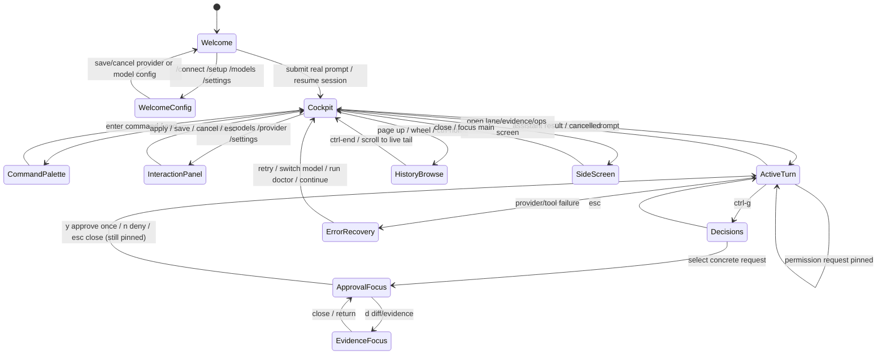
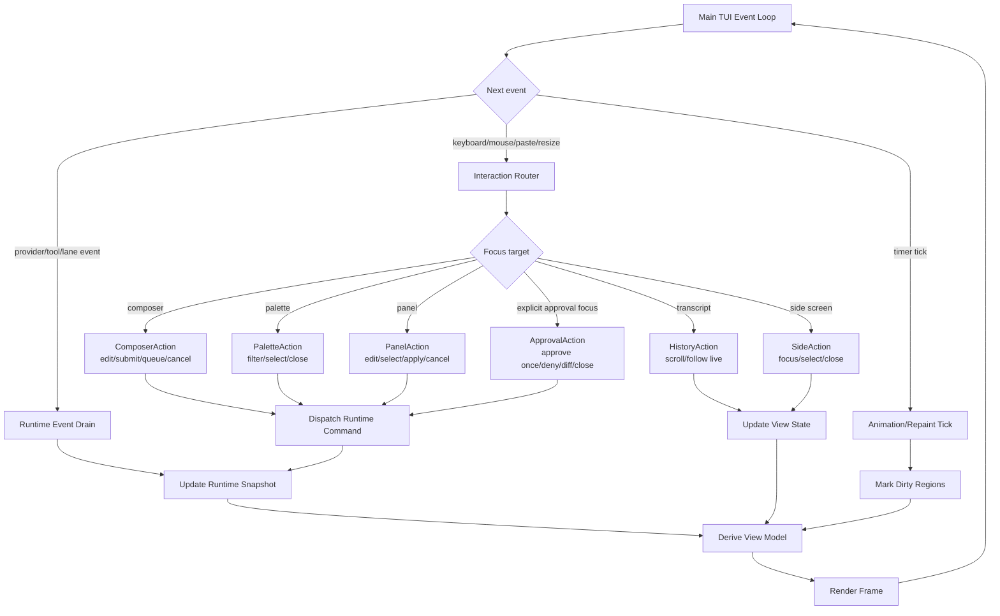
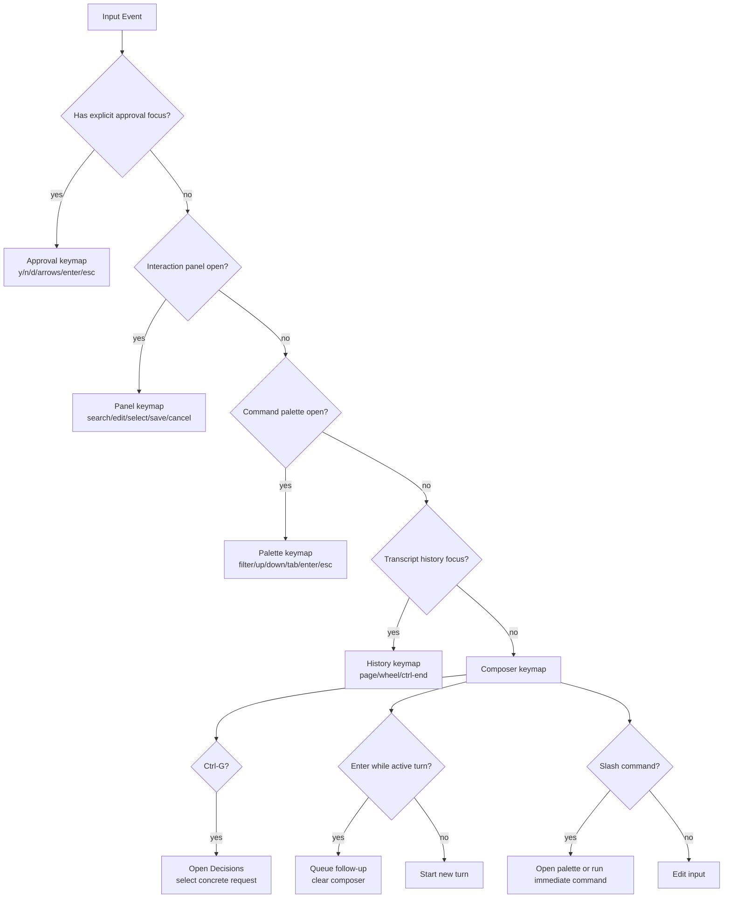
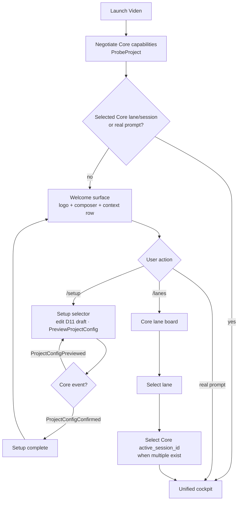
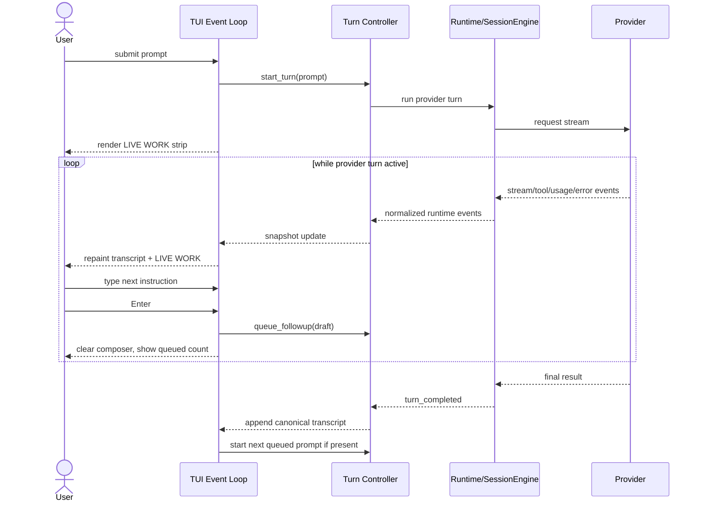
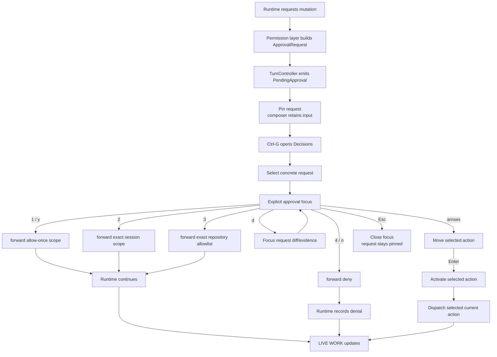
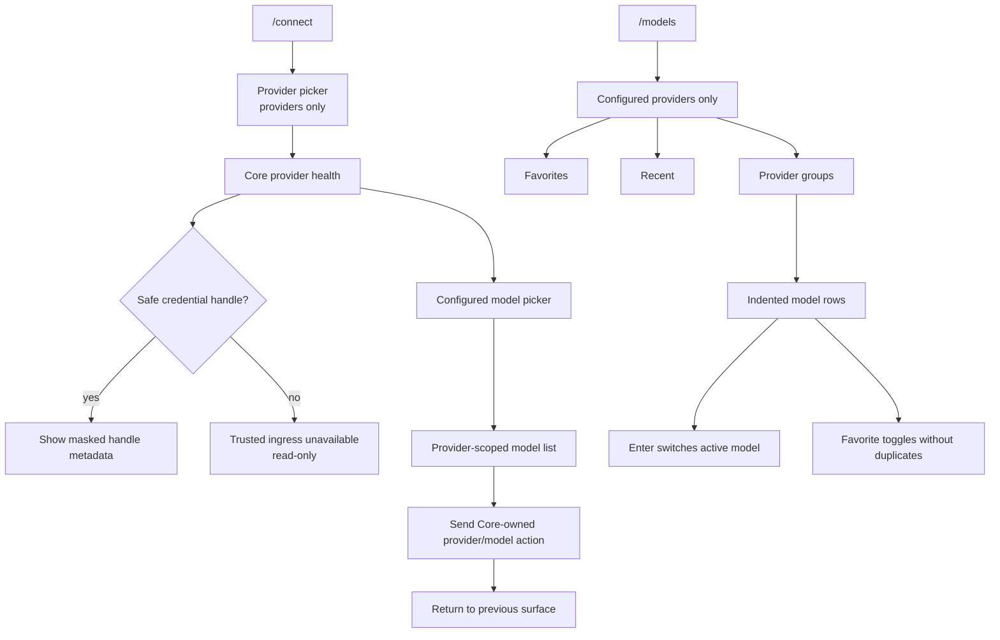
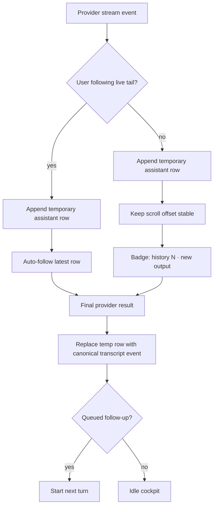
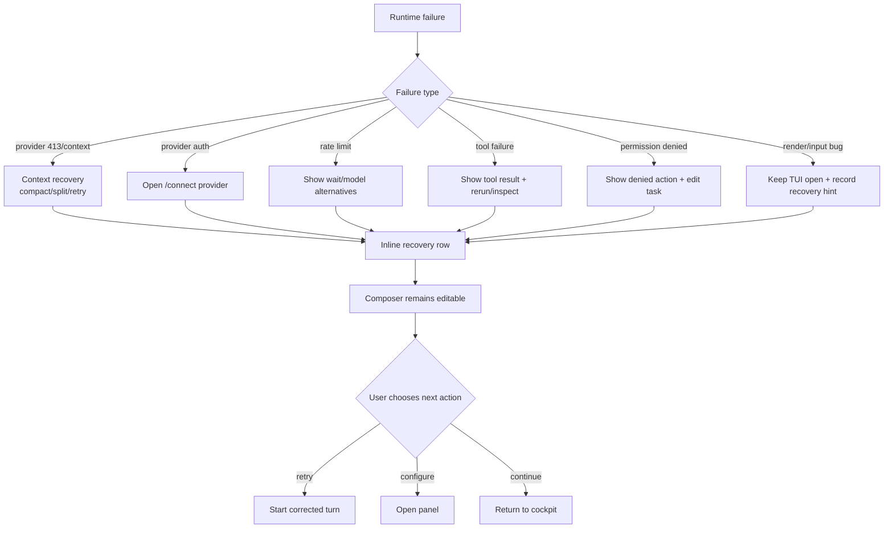
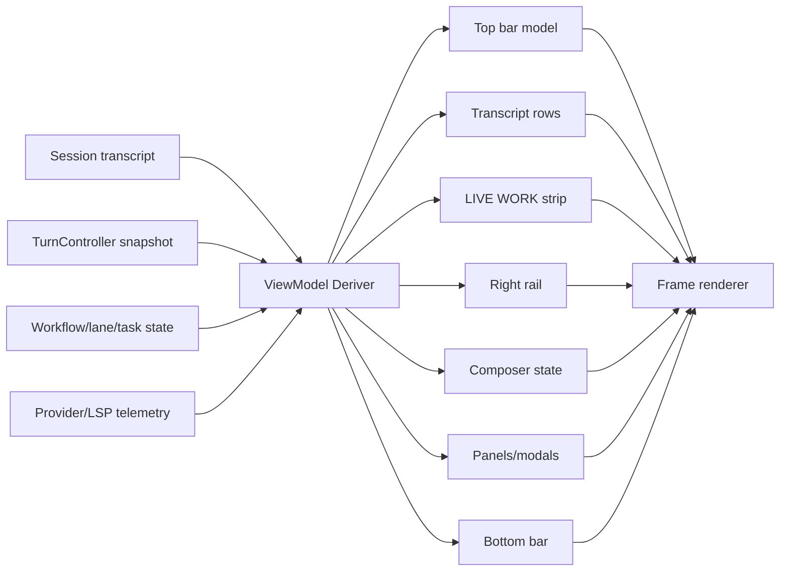

# TUI Interaction Flow Design

Chinese version: [tui-interaction-flow-design.zh-CN.md](tui-interaction-flow-design.zh-CN.md)

Last updated: 2026-07-20

## Purpose

This document defines the target TUI interaction flow for Viden's 0.1.x
stability line. The goal is a coding cockpit where users can always answer:

- Where am I?
- What is Viden doing?
- Can I still type?
- What is blocked?
- What should I do next?

The TUI must be one product surface over shared runtime state. It must not own
hidden business logic, start nested input loops, or invent status that the core
runtime cannot explain.

## Product Rules

- The composer is always recoverable. A provider turn, Plan mode, approval,
  setup panel, side screen, or error must not permanently lock input.
- Every active operation is represented as state: `pending_turn`,
  `runtime_task`, `interaction_panel`, `streaming_assistant`, `queued_input`, or
  `error_recovery`.
- Active work appears as a `LIVE WORK` strip under the latest visible
  transcript content. It shows phase, signal, and next action.
- Provider names are infrastructure details. Main status should say
  `Viden`, an internal role, or a concrete operation.
- No fake progress percentages for provider thinking. Percent is allowed only
  when backed by real lane/tool progress.
- Permission controls use the unified
  [Permission Mode Design](permission-mode-design.md). Do not label this surface
  as `Approval Mode`.
- Popups and panels are direct manipulation surfaces, not command-completion
  pages. Selecting or editing inside the panel applies the change.
- Transcript history must remain browsable while streaming continues. New output
  marks the badge; it does not yank the user back to the bottom.
- Input has three explicit modes: Normal for cockpit navigation, Insert for
  composer editing, and Overlay for selectors, panels, and approvals. `Esc`
  unwinds one layer at a time. `Ctrl-C` sends owner-scoped cancellation only
  when the exact Core owner is available; lanes that expose only an ID render
  cancellation as unavailable and request the missing Core contract.
- `Ctrl-P` opens selector-first Global Jump. It projects only typed Core lanes,
  their active session IDs, merge gates, pending approvals, and a controlled
  navigation/completion command registry. `:`, `@`, `#`, `>`, and `~` scope
  lane, session, gate/ask, command, and file results; arrows or `j`/`k` move,
  Enter selects, and Esc restores the prior overlay owner and composer context.
  Core does not yet expose a typed file inventory, so File remains visible but
  disabled with that concrete reason; the TUI never scans the filesystem or Git.

## Top-Level State Model

## Single Event Loop

All input, background work, repaint, approval, streaming, resize, and panel
actions go through one TUI event loop. Provider requests, tools, lanes, LSP, and
diagnostics are event sources. They do not own terminal input.

## Input Routing

The input router decides whether a key edits text, navigates a panel, resolves
approval, scrolls history, or controls a side screen. This prevents Plan mode
and provider turns from stealing the keyboard.

## Welcome And Configuration Flow

Welcome is not a session. TUI 0.3.0 negotiates the Core 0.3.1 onboarding
capabilities and requests `ProbeProject`, but remains on Welcome until the
operator opens Setup/Lanes or starts real work. The event cursor is not a
session id.

The TUI only projects Core onboarding facts and sends typed commands through
`CoreClient`. It does not scan the project, write or confirm configuration by
itself, or accept raw credential bytes locally. It may request confirmation by
immutable preview id/hash, but completion is derived only from
`ProjectConfigConfirmed`; a command receipt is not success.

## Provider Turn And Queued Follow-Up

During active work, the composer remains editable. Enter queues the draft rather
than blocking or starting a nested request.

## Approval Flow

Approval is a focus target in the same event loop. It must not call a separate
blocking input loop. Pending approvals are pinned but do not own input.
Composer `y`, `n`, `d`, and `Enter` remain ordinary draft/submission input until
the operator opens Decisions with `Ctrl-G` and selects a concrete request.

Session-scoped approval and repository allowlisting are request-gated Core
actions. The TUI exposes a choice only when that request's typed
`allowed_scopes` provides the exact payload, forwards it through the original
request owner, and waits for Core resolution. Expired requests remain pinned
and inert until `ApprovalResolved`; the TUI never synthesizes local denial or
success.

## Model And Provider Panels

Provider setup and model selection are direct panels. They should not be hidden
behind command-completion semantics.

## Transcript, Streaming, And Scrollback

Streaming should feel live without destroying history review.

## Error Recovery Flow

Errors should be inline, actionable, and scoped. They should not appear as
large blocking center warnings unless user action is required.

## Render View Model

Rendering consumes a derived view model. It should not query runtime services
directly or reinterpret old transcript facts as live work after completion.

## Acceptance Scenarios

- Launch with no session: welcome stays visible after `/connect`, `/models`, and
  `/setup`; it enters cockpit only after a real prompt or resume.
- Start provider turn: `LIVE WORK` appears under latest transcript content;
  composer remains editable; no fake provider percent appears.
- Type during provider turn: `Enter` queues a follow-up and clears composer.
- Plan mode turn: the provider only produces requirements, architecture,
  implementation approach, test strategy, and development plans; mutating tools
  are blocked by permission/runtime policy; composer input continues to work.
- Approval request: the request stays pinned without owning composer input;
  `Ctrl-G` opens Decisions, selecting a concrete request creates explicit focus,
  `y` approves once, `n` denies, `d` opens diff/evidence, `Enter` activates the
  selected action, and `Esc` only closes focus.
- Streaming while scrolled up: transcript badge shows new output; scrollback
  does not jump.
- Provider failure: inline recovery shows concrete next action; TUI remains
  open and composer usable.
- `/connect`: provider list shows providers only; selecting one opens editable
  key/endpoint/default-model flow.
- `/models`: shows configured providers and active/favorite model rows grouped
  by provider, with no unconfigured descriptor spam.
- Resize/focus/sleep: full redraw restores layout; no terminal protocol residue
  appears in the composer.

## Implementation Implications

- Keep one interaction router and one event loop.
- Keep pending approvals as pinned runtime facts and create non-blocking
  `OverlayKind::Approval` state only after a concrete Decisions selection.
- Centralize active turn state in a `TurnController`-style runtime boundary.
- Derive all TUI text from a stable view model.
- Make preview and regression tests cover welcome, active turn, queued input,
  approval, model/provider panels, streaming scrollback, error recovery, and
  resize.
