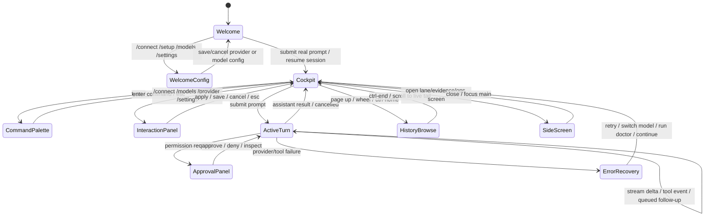
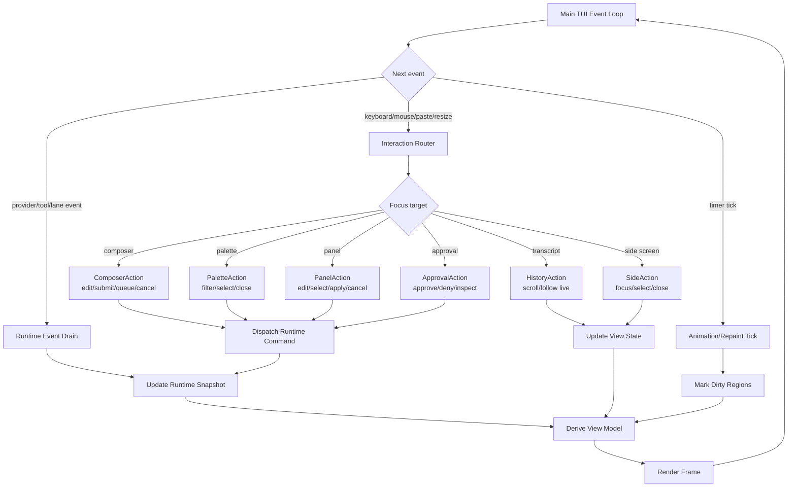
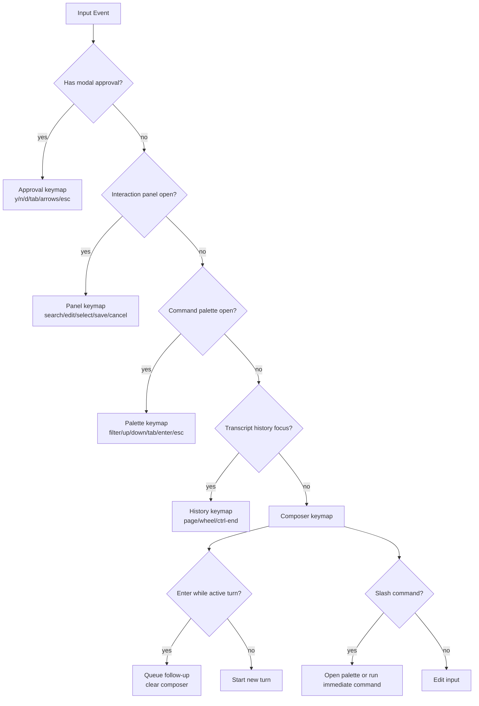
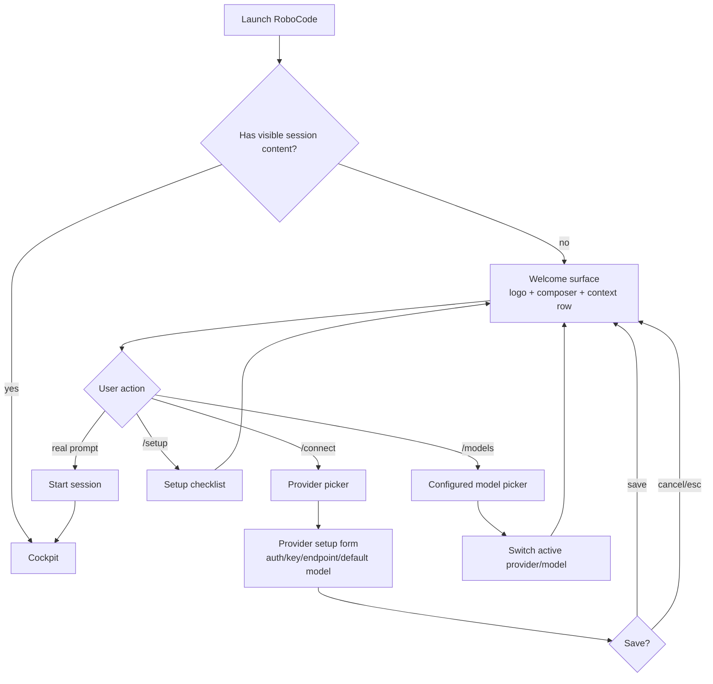
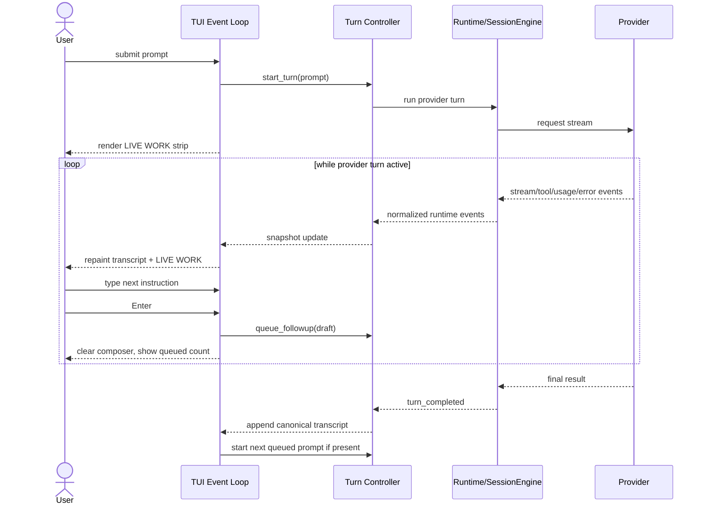
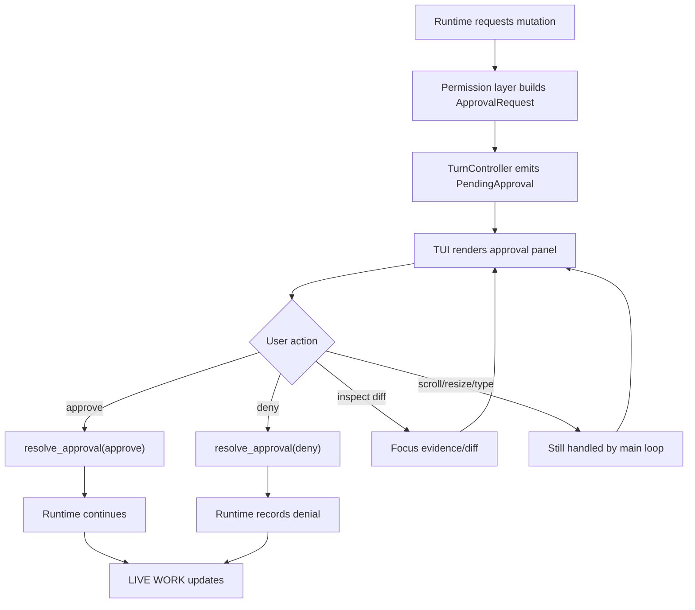
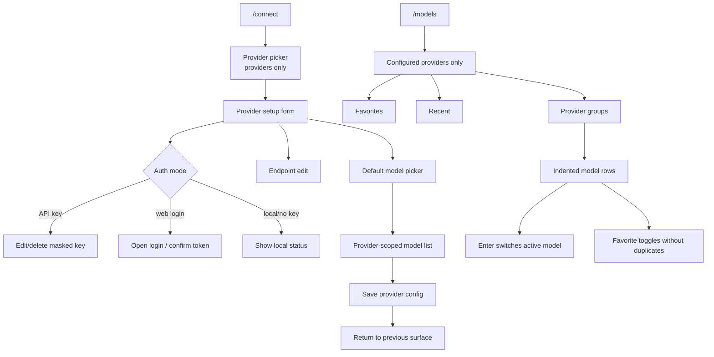
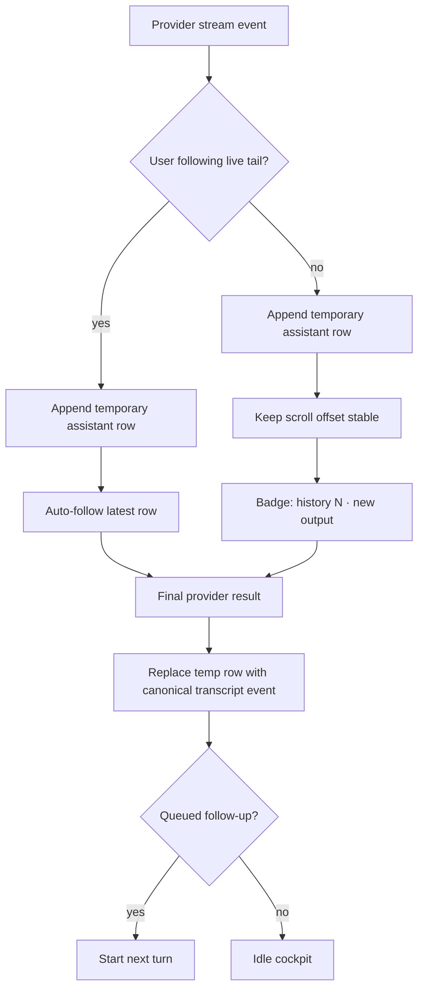
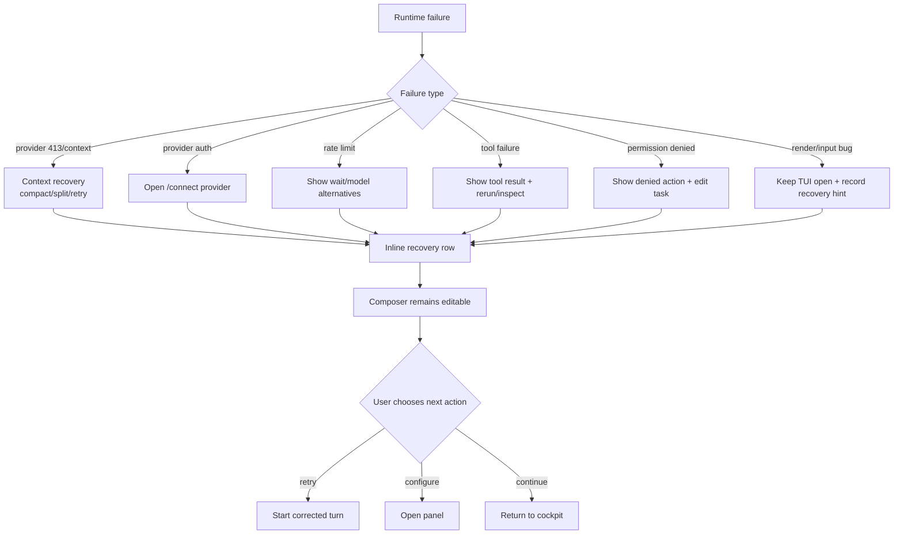
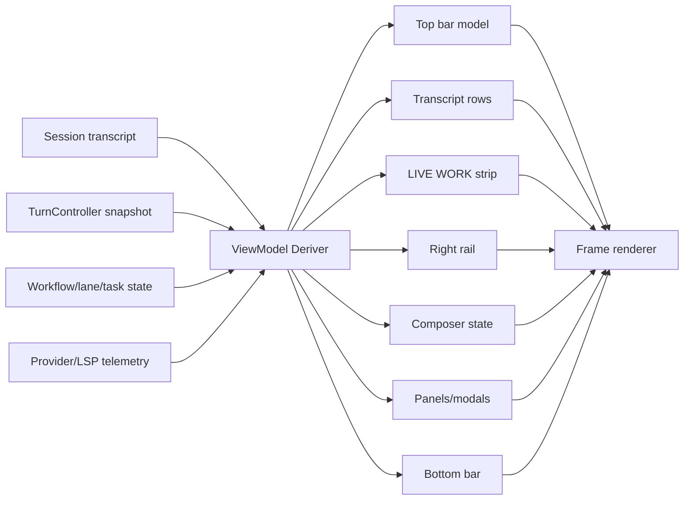

# TUI Interaction Flow Design

Chinese version: [tui-interaction-flow-design.zh-CN.md](tui-interaction-flow-design.zh-CN.md)

Last updated: 2026-06-09

## Purpose

This document defines the target TUI interaction flow for RoboCode's 0.1.x
stability line. The goal is a coding cockpit where users can always answer:

- Where am I?
- What is RoboCode doing?
- Can I still type?
- What is blocked?
- What should I do next?

The TUI must be one product surface over shared runtime state. It must not own
hidden business logic, start nested input loops, or invent status that the core
runtime cannot explain.

## Product Rules

- The composer is always recoverable. A provider turn, Plan mode, approval,
  setup panel, side screen, or error must not permanently lock input.
- Every active operation is represented as state: `pending_turn`,
  `runtime_task`, `interaction_panel`, `streaming_assistant`, `queued_input`, or
  `error_recovery`.
- Active work appears as a `LIVE WORK` strip under the latest visible
  transcript content. It shows phase, signal, and next action.
- Provider names are infrastructure details. Main status should say
  `RoboCode`, an internal role, or a concrete operation.
- No fake progress percentages for provider thinking. Percent is allowed only
  when backed by real lane/tool progress.
- Permission controls use the unified
  [Permission Mode Design](permission-mode-design.md). Do not label this surface
  as `Approval Mode`.
- Popups and panels are direct manipulation surfaces, not command-completion
  pages. Selecting or editing inside the panel applies the change.
- Transcript history must remain browsable while streaming continues. New output
  marks the badge; it does not yank the user back to the bottom.

## Top-Level State Model

## Single Event Loop

All input, background work, repaint, approval, streaming, resize, and panel
actions go through one TUI event loop. Provider requests, tools, lanes, LSP, and
diagnostics are event sources. They do not own terminal input.

## Input Routing

The input router decides whether a key edits text, navigates a panel, resolves
approval, scrolls history, or controls a side screen. This prevents Plan mode
and provider turns from stealing the keyboard.

## Welcome And Configuration Flow

Welcome is not a session. Configuration should not jump into the cockpit unless
the user starts real work or resumes history.

## Provider Turn And Queued Follow-Up

During active work, the composer remains editable. Enter queues the draft rather
than blocking or starting a nested request.

## Approval Flow

Approval is a focus target in the same event loop. It must not call a separate
blocking input loop.

## Model And Provider Panels

Provider setup and model selection are direct panels. They should not be hidden
behind command-completion semantics.

## Transcript, Streaming, And Scrollback

Streaming should feel live without destroying history review.

## Error Recovery Flow

Errors should be inline, actionable, and scoped. They should not appear as
large blocking center warnings unless user action is required.

## Render View Model

Rendering consumes a derived view model. It should not query runtime services
directly or reinterpret old transcript facts as live work after completion.

## Acceptance Scenarios

- Launch with no session: welcome stays visible after `/connect`, `/models`, and
  `/setup`; it enters cockpit only after a real prompt or resume.
- Start provider turn: `LIVE WORK` appears under latest transcript content;
  composer remains editable; no fake provider percent appears.
- Type during provider turn: `Enter` queues a follow-up and clears composer.
- Plan mode turn: the provider only produces requirements, architecture,
  implementation approach, test strategy, and development plans; mutating tools
  are blocked by permission/runtime policy; composer input continues to work.
- Approval request: approval panel handles approve/deny/inspect, while resize,
  scroll, and typed follow-up remain routed through the main loop.
- Streaming while scrolled up: transcript badge shows new output; scrollback
  does not jump.
- Provider failure: inline recovery shows concrete next action; TUI remains
  open and composer usable.
- `/connect`: provider list shows providers only; selecting one opens editable
  key/endpoint/default-model flow.
- `/models`: shows configured providers and active/favorite model rows grouped
  by provider, with no unconfigured descriptor spam.
- Resize/focus/sleep: full redraw restores layout; no terminal protocol residue
  appears in the composer.

## Implementation Implications

- Keep one interaction router and one event loop.
- Promote approval into non-blocking `InteractionPanel` state.
- Centralize active turn state in a `TurnController`-style runtime boundary.
- Derive all TUI text from a stable view model.
- Make preview and regression tests cover welcome, active turn, queued input,
  approval, model/provider panels, streaming scrollback, error recovery, and
  resize.
