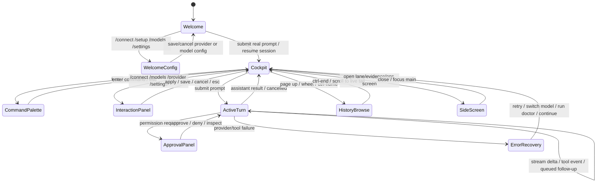
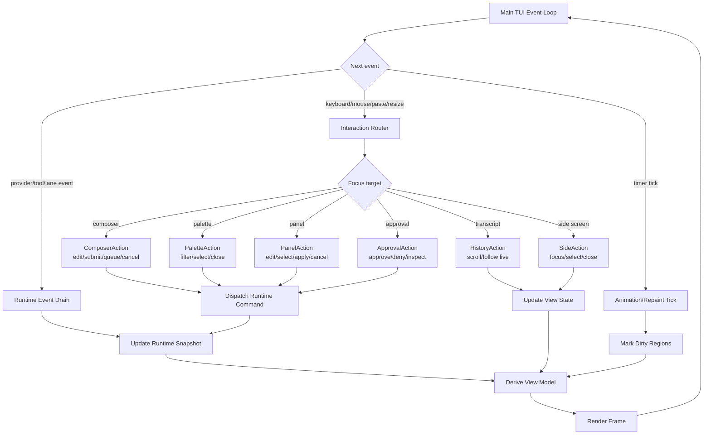
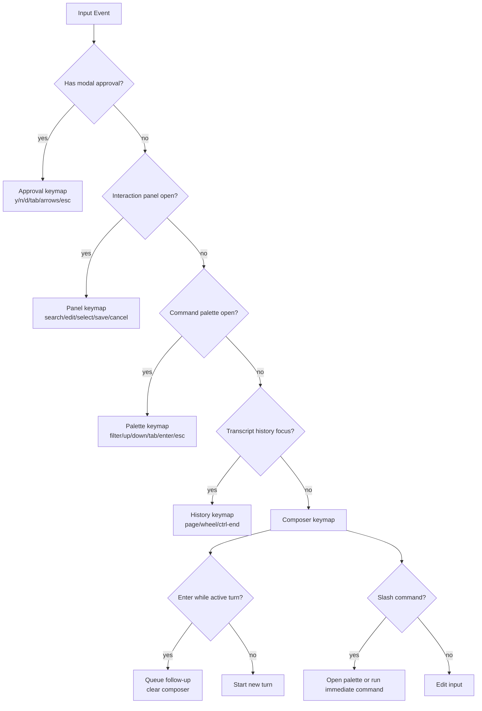
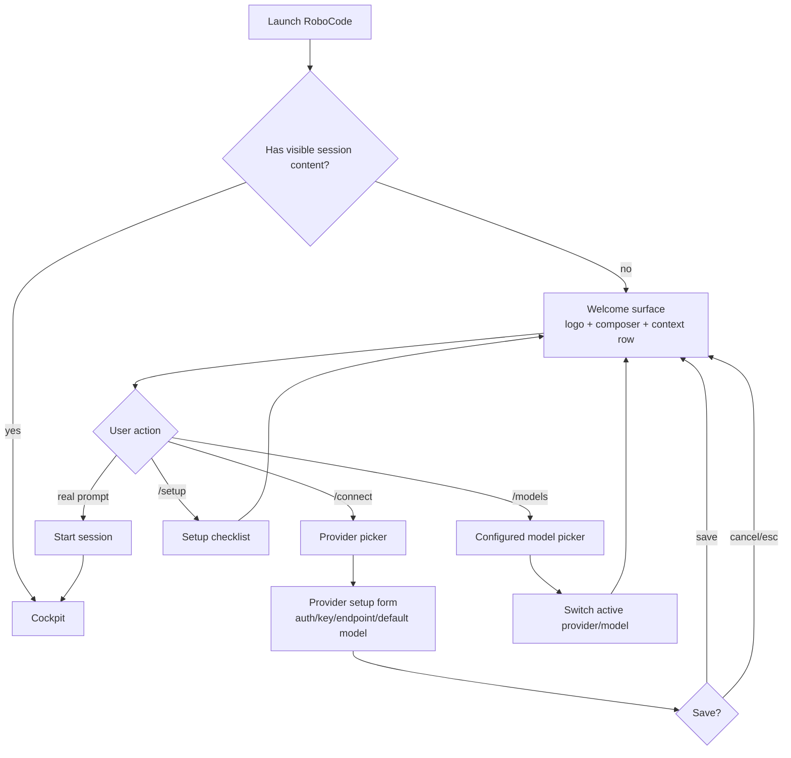
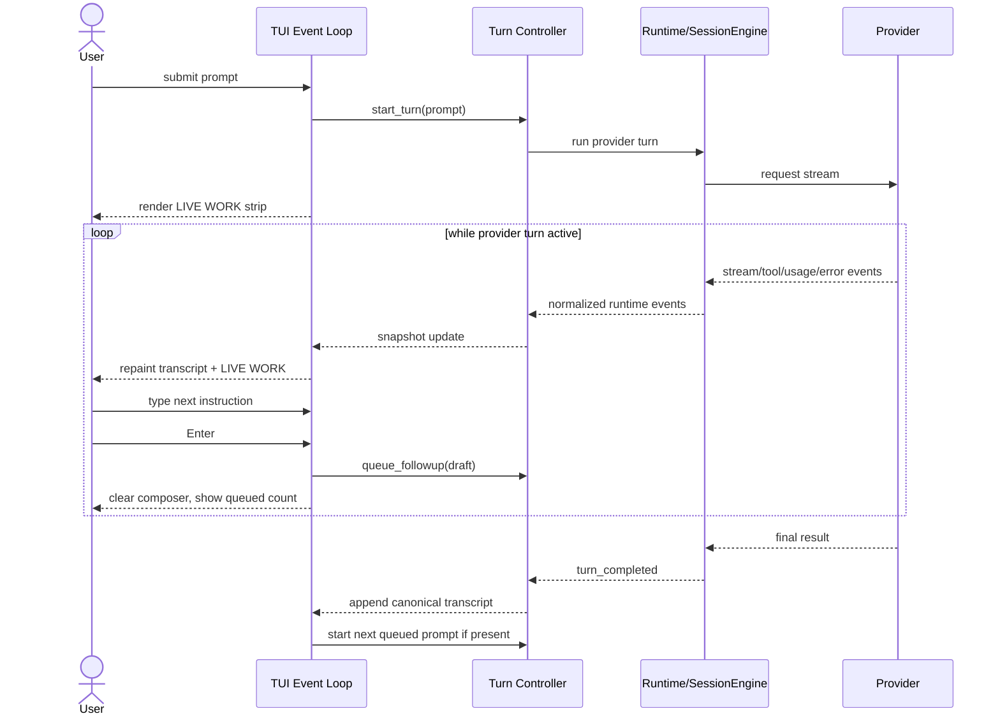
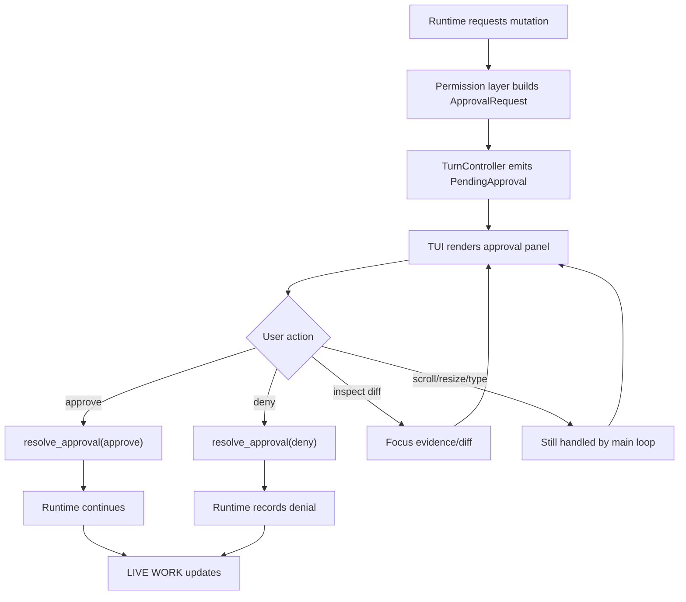
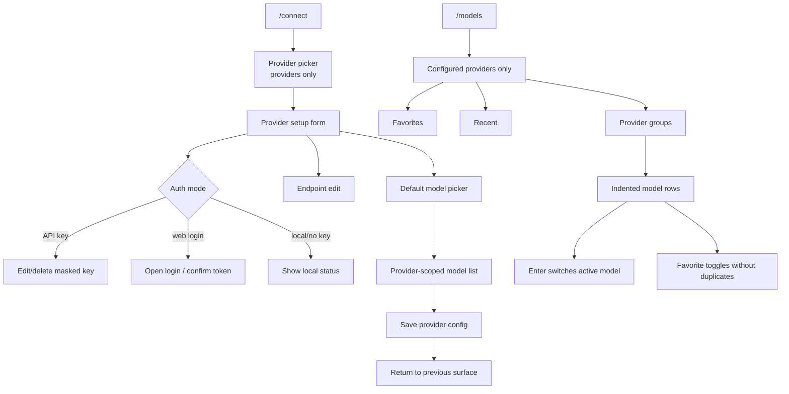
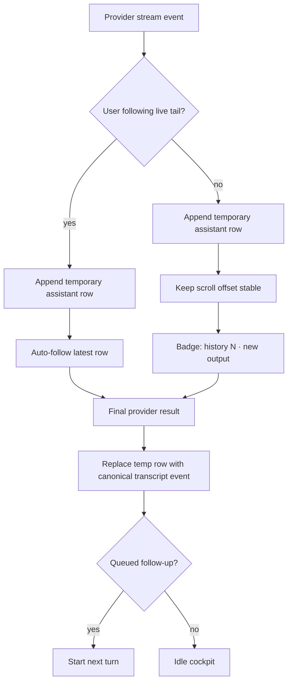
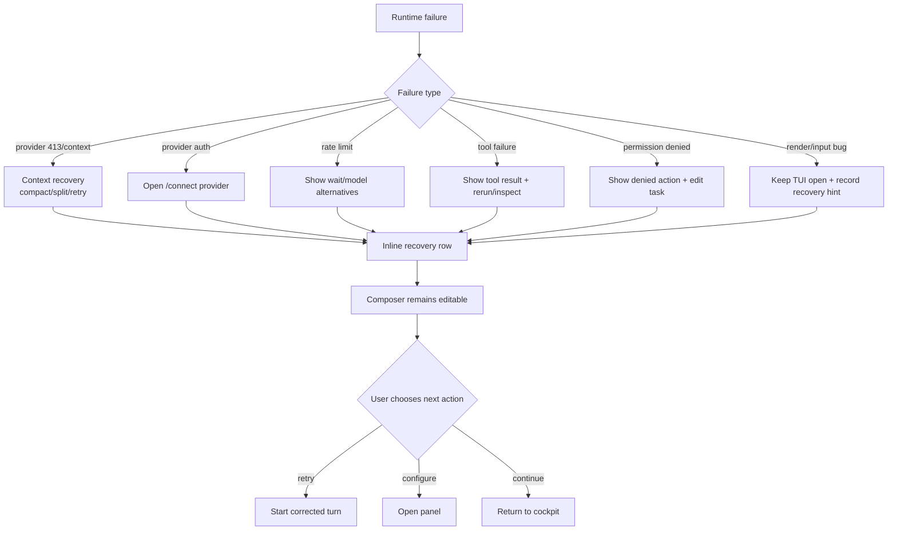
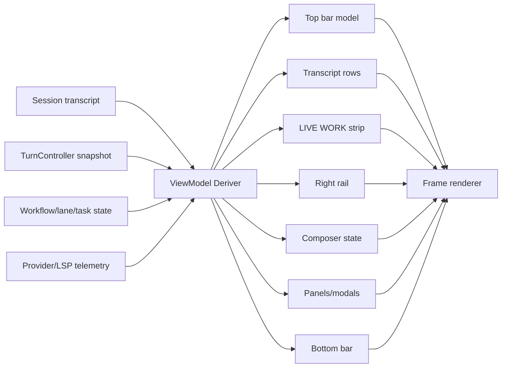

# TUI 交互流程设计

English version: [tui-interaction-flow-design.md](tui-interaction-flow-design.md)

最后更新：2026-06-09

## 目的

本文定义 RoboCode 0.1.x 稳定线的目标 TUI 交互流程。目标是做成一个 coding
cockpit，让用户随时能回答：

- 我现在在哪？
- RoboCode 正在做什么？
- 我还能不能继续输入？
- 什么事情被阻塞了？
- 下一步应该做什么？

TUI 必须是共享 runtime state 上的一层产品界面。它不能拥有隐藏业务逻辑、不能启动嵌套
input loop，也不能编造 core runtime 无法解释的状态。

## 产品规则

- Composer 必须始终可恢复。Provider turn、Plan 模式、approval、setup panel、side
  screen 或 error 都不能永久锁住输入。
- 每个 active operation 都必须表示成状态：`pending_turn`、`runtime_task`、
  `interaction_panel`、`streaming_assistant`、`queued_input` 或 `error_recovery`。
- Active work 显示为最近可见 transcript 内容下面的 `LIVE WORK` strip，包含 phase、
  signal 和 next action。
- Provider 名是基础设施细节。主状态应该说 `RoboCode`、内部角色或具体 operation。
- Provider thinking 不显示假进度百分比。只有 lane/tool 真实进度才允许显示 percent。
- Permission 控制统一遵循 [Permission Mode 设计](permission-mode-design.zh-CN.md)，
  不再把这个 surface 标为 `Approval Mode`。
- Popup 和 panel 是直接操作界面，不是 command completion 页面。用户在 panel 里选择
  或编辑后应直接生效。
- Streaming 时 transcript history 必须仍可浏览。新输出只更新 badge，不把用户强行拉回
  底部。

## 顶层状态模型

## 单事件循环

所有输入、后台工作、重绘、approval、streaming、resize 和 panel action 都走同一个 TUI
event loop。Provider request、tool、lane、LSP 和 diagnostics 都只是事件源，不能接管终端输入。

## 输入路由

Input router 决定一次按键到底是编辑文本、导航 panel、处理 approval、滚动历史，还是控制
side screen。这能避免 Plan 模式和 provider turn 抢走键盘。

## Welcome 与配置流程

Welcome 不是会话。配置 provider/model 后不应该跳到 cockpit，除非用户开始真实任务或恢复历史。

## Provider Turn 与排队 Follow-Up

Active work 期间 composer 仍可编辑。按 Enter 会把草稿排队，而不是阻塞或启动嵌套请求。

## Approval 流程

Approval 是同一个事件循环里的 focus target，不能调用第二套阻塞式 input loop。

## Model 与 Provider 面板

Provider setup 和 model selection 都是直接操作面板，不应该隐藏在 command completion 语义后面。

## Transcript、Streaming 与 Scrollback

Streaming 要有实时感，但不能破坏历史浏览。

## 错误恢复流程

错误应该 inline、可操作、范围明确。除非需要用户立即操作，否则不要弹成巨大的居中阻塞警告。

## 渲染 View Model

Renderer 消费派生出来的 view model。它不应直接查询 runtime service，也不应在任务完成后把
旧 transcript facts 重新解释成 live work。

## 验收场景

- 无 session 启动：执行 `/connect`、`/models`、`/setup` 后仍停留 welcome；只有真实
  prompt 或 resume 才进入 cockpit。
- 启动 provider turn：`LIVE WORK` 出现在 transcript 最新内容下面；composer 仍可编辑；
  不显示假的 provider percent。
- Provider turn 期间输入：`Enter` 把 follow-up 入队并清空 composer。
- Plan mode turn：provider 只产出需求、架构、实现方案、测试策略和开发计划；mutating tools
  被 permission/runtime policy 拦截；composer 不锁死。
- Approval request：approval panel 处理 approve/deny/inspect，同时 resize、scroll 和
  typed follow-up 仍走主循环。
- Scrolled-up streaming：transcript badge 显示 new output；scrollback 不跳到底部。
- Provider failure：inline recovery 显示具体下一步；TUI 保持打开，composer 可用。
- `/connect`：provider 列表只显示供应商；选择后进入可编辑 key/endpoint/default-model flow。
- `/models`：只显示配置过的 provider 和 active/favorite model rows，按 provider 分组，不展示
  未配置 descriptor 噪声。
- Resize/focus/sleep：full redraw 恢复布局；composer 不出现 terminal protocol residue。

## 实现影响

- 保持一个 interaction router 和一个 event loop。
- 把 approval 提升成非阻塞 `InteractionPanel` 状态。
- 用 `TurnController` 风格 runtime 边界集中 active turn state。
- 所有 TUI 文案从稳定 view model 派生。
- Preview 和 regression tests 覆盖 welcome、active turn、queued input、approval、
  model/provider panels、streaming scrollback、error recovery 和 resize。
