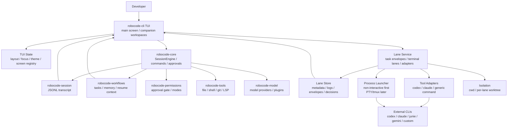

# TUI and Terminal Lane Architecture Plan

Last refreshed: 2026-05-25

## Purpose

This plan turns the approved RoboCode TUI design into an implementation path. The goal is not only a better full-screen terminal UI; the goal is a local coding-agent cockpit that can supervise side work in companion screens and external terminal tools such as `codex`, `claude`, `junie`, `gemini`, or user-defined commands.

Design sources:

- `DESIGN.md`: canonical visual/product contract.
- `docs/code-agent-benchmark.md`: competitive benchmark and capability alignment.
- `docs/previews/`: visual references and workstation previews.
- `docs/architecture.md`: current subsystem boundaries.

## Target Architecture



## Architectural Principles

- `robocode-core` remains the owner of the main RoboCode session, permission decisions, and model/tool loop.
- The TUI is a client over shared state, not a second agent runtime.
- Terminal lanes are supervised work units. They can run external tools, but RoboCode owns the envelope, lifecycle, observation, and acceptance decision.
- External coding tools are collaborators, not trusted authorities. Their output must be inspected through logs, diffs, exit codes, and verification commands.
- Mutating lanes should prefer isolated worktrees once the lane runtime supports them.
- Companion screens should be useful even without multi-agent orchestration: they can host terminal lanes, logs, diagnostics, and review panels.

## Proposed Module Shape

Start inside `robocode-cli` while the feature is still UI/runtime glue. Move durable lane primitives into `robocode-workflows` or a new crate only after the model stabilizes.

```text
robocode-cli/src/tui/
  mod.rs              entrypoints and event loop
  app.rs              TuiApp state and high-level actions
  layout.rs           rect splitting and responsive layout
  render.rs           terminal render buffer and panel drawing
  theme.rs            built-in themes and TOML-loaded tokens
  input.rs            key handling and command shortcuts
  panels.rs           transcript, right rail, modal, composer, status
  screens.rs          MAIN / AGENTS / OPS registry and views
  lanes.rs            CLI-facing lane orchestration facade

robocode-core/
  command dispatch remains the main slash-command path
  later: lane commands can be promoted into core if non-TUI REPL should use them

robocode-workflows/
  later: durable lane records and task-envelope records if they become reusable outside TUI
```

## Data Model Draft

### Screen Registry

```rust
struct ScreenRegistry {
    main: ScreenState,
    companions: Vec<CompanionScreen>,
    focused: ScreenId,
    max_companions: usize, // 2
}

enum ScreenKind {
    Main,
    Agents,
    Ops,
}
```

Rules:

- `MAIN` always exists.
- At most two companion screens can be active.
- `AGENTS` is optimized for landscape.
- `OPS` is optimized for portrait.
- External windows and embedded panes must observe the same registry state.

Current slice:

- Main-screen `/screen side-1` and `/screen side-2` launch real companion TUI
  processes through the current binary by default.
- The registry tracks at most two companion screens and exposes `/screen list`
  plus `/screen close <side-1|side-2>`.
- Registry state is persisted in `.robocode/screens.tsv`, allowing side-screen
  processes to reload sibling screen state while they poll lane artifacts.
- `ROBOCODE_SCREEN_LAUNCH_TEMPLATE` allows desktop-specific wrappers such as a
  new terminal window or monitor-routing script without baking OS automation
  into the portable core.

### Terminal Lane

```rust
struct TerminalLane {
    id: String,
    title: String,
    tool_id: String,
    cwd: PathBuf,
    worktree: Option<PathBuf>,
    command: Vec<String>,
    status: LaneStatus,
    task_envelope_path: PathBuf,
    log_path: PathBuf,
    started_at: String,
    updated_at: String,
    linked_task_id: Option<String>,
    changed_files: Vec<String>,
    verification: Option<LaneVerification>,
    decision: Option<LaneDecision>,
}
```

Statuses:

- `queued`
- `starting`
- `running`
- `needs_input`
- `completed`
- `failed`
- `reviewing`
- `accepted`
- `revising`
- `stopped`
- `archived`

### Task Envelope

Required fields:

- objective
- cwd or worktree
- allowed mutation scope
- constraints
- selected context
- expected output
- verification command
- handoff format

Default handoff format:

- summary
- files changed
- tests run
- remaining risks
- suggested next step

## External Tool Adapter Contract

Adapters are small, conservative launch descriptions:

```toml
[tools.codex]
display_name = "Codex"
command = "codex"
input_mode = "prompt-file"
supports_followup = false
default_timeout_seconds = 1800

[tools.claude]
display_name = "Claude Code"
command = "claude"
input_mode = "pty"
supports_followup = true
default_timeout_seconds = 1800
```

Input modes:

- `argv`: pass the task as command arguments.
- `stdin`: pipe the task envelope into the process.
- `prompt-file`: pass a generated envelope file path.
- `pty`: start an interactive terminal session and send the prompt.
- `manual`: prepare a terminal and let the user submit.

First implementation should support `run` and `prompt-file`/`stdin` style adapters before full interactive PTY. PTY/tmux should come after lifecycle, logging, and inspection are stable.

Template placeholders:

- `{task}` and `{task:q}` expand to the raw or shell-quoted task title.
- `{envelope}` and `{envelope:q}` expand to the raw or shell-quoted task
  envelope file path.
- Codex uses `ROBOCODE_LANE_CODEX_TEMPLATE`; Claude uses
  `ROBOCODE_LANE_CLAUDE_TEMPLATE`.

## Lifecycle

1. User enters `/lane codex "fix failing config tests"` or `/lane run cargo test -p robocode-core`.
2. RoboCode creates a `TerminalLane`.
3. RoboCode renders a task envelope and stores it durably.
4. Lane service launches the command with the selected adapter.
5. TUI shows lane state in `ACTIVE TASKS`, `AGENTS`, or `OPS`.
6. Lane runtime captures logs, exit code, and file changes.
7. RoboCode runs or records verification.
8. `/lane inspect <id>` summarizes logs, diff, tests, and risks.
9. User chooses `/lane accept`, `/lane revise`, `/lane attach`, `/lane stop`, or `/lane archive`.

Current implemented slice:

- `/lane run <command>` launches a non-interactive background shell lane.
- Codex and Claude lanes always write a task envelope. They can launch through
  `ROBOCODE_LANE_CODEX_TEMPLATE` and `ROBOCODE_LANE_CLAUDE_TEMPLATE`; without
  those templates they queue with a clear setup hint while keeping the envelope
  available for inspection.
- Lane state is stored in `.robocode/lanes.tsv`.
- Runtime artifacts live under `.robocode/lanes/` as `<lane-id>.log` and
  `<lane-id>.done`, with external-tool envelopes as `<lane-id>.envelope.md`.
- The main TUI and companion screens refresh lane artifacts while idle.
- `/lane inspect <id>` reports status, progress, log path, done path, envelope
  path, persisted exit code, a short log tail, and an envelope preview.
- `/lane stop <id>` marks the lane stopped and, on Unix platforms, sends
  `SIGTERM` to the lane process group when a pid is recorded.

## Safety Model

- External tools never get full transcript or secrets by default.
- File-mutating lanes should move toward per-lane worktrees.
- Lane stop/kill is explicit and preserves logs.
- Lane acceptance is separate from lane completion.
- Verification evidence beats model-written success claims.
- Lane-created changes are not silently merged into the main task.
- All task envelopes, launch commands, logs, diffs, verification results, and decisions remain auditable.

## Development Plan

### Phase 1: Main TUI Foundation

Deliver the approved single-screen main UI:

- top status rail;
- transcript timeline;
- right rail with workspace, active tasks, LSP diagnostics, provider health, recent files;
- centered approval modal;
- composer and bottom status bar;
- responsive render snapshots for compact, normal, and wide terminals.

Acceptance criteria:

- `--tui` still uses `SessionEngine`.
- Approvals still use the shared `PermissionPrompt` path.
- Existing fallback-provider TUI smoke still works.
- Render tests cover the primary layout sections.

### Phase 2: Theme and Layout Tokens

Add:

- built-in `aurora-cyan`, `ember-gold`, `plasma-violet`, `monochrome-ice`;
- token fallback rules;
- config selection for active theme;
- panel drawing primitives.

Acceptance criteria:

- theme selection changes rendered colors without changing layout state;
- missing custom tokens fall back safely;
- primary cyan theme matches `DESIGN.md` as the default.

### Phase 3: Screen Registry

Add:

- `MAIN`, `AGENTS`, `OPS` screen states;
- open/focus/close lifecycle;
- max two companion screens;
- read-only companion render mode that follows lane/workflow state.

Acceptance criteria:

- opening a third companion is rejected clearly;
- `AGENTS` and `OPS` render different layout priorities;
- main session continues while companions are open.

### Phase 4: Lane Runtime MVP

Add:

- lane metadata and log files;
- `/lane run <command>`;
- process spawn, status transitions, log capture, exit code capture;
- `/lane inspect <id>`;
- stop/archive.

Acceptance criteria:

- non-interactive commands can run as lanes;
- logs survive TUI exit;
- failed commands report exit code and last output;
- lane states are unit-tested.

Current status: the non-interactive command path, Codex/Claude task-envelope
artifacts, template-driven prompt-file launch, persisted logs, exit-code
capture, idle refresh, inspect evidence, and Unix process-group stop are
implemented.

### Phase 5: External Tool Adapters

Add:

- task envelope rendering;
- generic `/lane ask <tool> <task>`;
- presets for `codex` and `claude` when binaries exist;
- input modes: `stdin`, `prompt-file`, and `manual` first;
- changed-file and diff detection;
- `/lane accept`, `/lane revise`, `/lane discard`.

Acceptance criteria:

- missing external tools produce clear lane errors;
- envelope files show exactly what was sent;
- inspection shows changed files and verification evidence;
- acceptance is an explicit decision.

### Phase 6: Isolation

Add:

- optional per-lane worktree creation;
- branch naming;
- worktree cleanup/archive policy;
- apply/merge path after acceptance.

Acceptance criteria:

- file-mutating external lanes can run outside the main worktree;
- lane diff is inspectable before integration;
- discarded lanes do not delete logs or changes unless explicitly cleaned.

### Phase 7: Attachable Terminal Panes

Prototype and choose:

- OS terminal windows;
- tmux sessions;
- embedded PTY.

Acceptance criteria:

- `/lane attach <id>` enters an interactive lane;
- `/lane detach` returns to RoboCode TUI without killing the process;
- full logs remain captured;
- terminal attachment is clearly marked in the UI.

## Recommended First Implementation Slice

Start with Phase 1 and Phase 4 in separate branches, not all phases at once:

1. `codex/tui-main-screen`: visual/layout foundation using current `SessionEngine`.
2. `codex/tui-lane-runtime`: lane metadata plus `/lane run` command.

Reason:

- the main screen gives immediate product shape;
- lane runtime proves the companion-screen value;
- Codex/Claude adapters should wait until lane logs, status, and inspection are stable.

## Open Decisions

- Should lane commands exist only inside TUI first, or also in the plain REPL?
- Should durable lane records live in `robocode-cli` initially or go directly into `robocode-workflows`?
- Which external-tool input mode should be first for `codex` and `claude`: prompt file, stdin, manual, or PTY?
- Should per-lane worktrees be mandatory for `codex`/`claude`, or opt-in for the first release?
