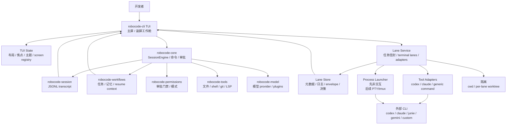

# TUI 与终端 Lane 架构开发计划

最后刷新：2026-05-25

## 目的

这份计划把已确认的 RoboCode TUI 设计落到可执行架构上。目标不只是做一个更好看的全屏终端界面，而是做一个本地优先的 coding-agent cockpit：主屏管理主会话、审批和上下文，副屏承载真实 side work，并能监督 `codex`、`claude`、`junie`、`gemini` 或用户自定义命令。

设计来源：

- `DESIGN.md`：视觉与产品契约。
- `docs/code-agent-benchmark.md`：竞品/大厂 coding agent 对标。
- `docs/previews/`：视觉参考与真实桌面预览。
- `docs/architecture.md`：当前系统边界。

## 目标架构



## 架构原则

- `robocode-core` 继续负责主会话、权限决策、模型/工具循环。
- TUI 是共享状态上的客户端，不是第二套 agent runtime。
- Terminal lane 是被监督的工作单元，可以运行外部工具，但 RoboCode 负责任务信封、生命周期、观测和验收。
- 外部 coding tool 是协作者，不是可信裁判。结果要看日志、diff、exit code 和验证命令。
- template-launched、会改文件的 Codex 和 Claude lane 会跑在隔离 worktree；
  其他 lane 类型必须明确自己的 mutation scope。
- 副屏即使没有原生多 agent，也要能承载 terminal lane、日志、诊断和 review 面板。

## 建议模块形态

早期先放在 `robocode-cli`，因为这部分还是 UI/runtime glue。等 lane 模型稳定后，再把持久化记录下沉到 `robocode-workflows` 或新 crate。

```text
robocode-cli/src/tui/
  mod.rs              入口与事件循环
  app.rs              TuiApp 状态和高层动作
  layout.rs           响应式区域切分
  render.rs           终端渲染 buffer 与 panel drawing
  theme.rs            内置主题与 TOML token
  input.rs            键盘处理与命令快捷操作
  panels.rs           transcript、右栏、modal、composer、status
  screens.rs          MAIN / AGENTS / OPS registry 与视图
  lanes.rs            CLI 层 lane 编排 facade

robocode-core/
  命令分发仍保留主 slash-command 路径
  后续：如果普通 REPL 也要用 lane 命令，再提升到 core

robocode-workflows/
  后续：当 lane/task-envelope 需要被 TUI 外复用时，承载持久化记录
```

## 数据模型草案

### Screen Registry

```rust
struct ScreenRegistry {
    main: ScreenState,
    companions: Vec<CompanionScreen>,
    focused: ScreenId,
    max_companions: usize, // 2
}

enum ScreenKind {
    Main,
    Agents,
    Ops,
}
```

规则：

- `MAIN` 永远存在。
- 最多两个副屏。
- `AGENTS` 优先横屏。
- `OPS` 优先竖屏。
- 外部窗口和内嵌 pane 必须观察同一份 registry 状态。

当前切片：

- 主屏 `/screen side-1` 和 `/screen side-2` 默认通过当前二进制启动真实副屏
  TUI 进程。
- registry 最多跟踪两个副屏，并暴露 `/screen list` 和
  `/screen close <side-1|side-2>`。
- registry 状态会持久化到 `.robocode/screens.tsv`，副屏进程轮询 lane
  artifacts 时也能重新读取 sibling screen 状态。
- `ROBOCODE_SCREEN_LAUNCH_TEMPLATE` 允许接入桌面特定 wrapper，例如新 terminal
  窗口或显示器路由脚本，而不把 OS 自动化写死到跨平台核心里。

### Terminal Lane

```rust
struct TerminalLane {
    id: String,
    title: String,
    tool_id: String,
    cwd: PathBuf,
    worktree: Option<PathBuf>,
    command: Vec<String>,
    status: LaneStatus,
    task_envelope_path: PathBuf,
    log_path: PathBuf,
    started_at: String,
    updated_at: String,
    linked_task_id: Option<String>,
    changed_files: Vec<String>,
    verification: Option<LaneVerification>,
    decision: Option<LaneDecision>,
}
```

状态：

- `queued`
- `starting`
- `running`
- `needs_input`
- `completed`
- `failed`
- `reviewing`
- `accepted`
- `revising`
- `stopped`
- `archived`

### Task Envelope

必填字段：

- objective
- cwd 或 worktree
- allowed mutation scope
- constraints
- selected context
- expected output
- verification command
- handoff format

默认 handoff 格式：

- summary
- files changed
- tests run
- remaining risks
- suggested next step

## 外部工具 Adapter 契约

Adapter 是保守的小型启动描述：

```toml
[tools.codex]
display_name = "Codex"
command = "codex"
input_mode = "prompt-file"
supports_followup = false
default_timeout_seconds = 1800

[tools.claude]
display_name = "Claude Code"
command = "claude"
input_mode = "pty"
supports_followup = true
default_timeout_seconds = 1800
```

输入模式：

- `argv`：通过命令参数传任务。
- `stdin`：把任务信封 pipe 给进程。
- `prompt-file`：生成 envelope 文件并把路径传给工具。
- `pty`：启动交互式终端会话并输入任务。
- `manual`：准备好终端上下文，由用户手动提交。

第一版建议先支持 `/lane run` 和 `prompt-file`/`stdin` 风格 adapter。完整 PTY/tmux attach 应该等生命周期、日志和 inspect 稳定后再做。

Template 占位符：

- `{task}` 和 `{task:q}` 展开为原始 task title 或 shell-quoted task title。
- `{envelope}` 和 `{envelope:q}` 展开为原始 task envelope 文件路径或
  shell-quoted envelope 路径。
- Codex 使用 `ROBOCODE_LANE_CODEX_TEMPLATE`；Claude 使用
  `ROBOCODE_LANE_CLAUDE_TEMPLATE`。

## 生命周期

1. 用户输入 `/lane codex "fix failing config tests"` 或 `/lane run cargo test -p robocode-core`。
2. RoboCode 创建 `TerminalLane`。
3. RoboCode 渲染 task envelope 并持久化。
4. Lane service 按 adapter 启动命令。
5. TUI 在 `ACTIVE TASKS`、`AGENTS` 或 `OPS` 中展示 lane 状态。
6. Lane runtime 捕获日志、exit code、文件变更。
7. RoboCode 运行或记录验证命令。
8. `/lane inspect <id>` 汇总日志、diff、测试和风险。
9. 用户选择 `/lane accept`、`/lane revise`、`/lane attach`、`/lane stop` 或 `/lane archive`。

当前已实现切片：

- `/lane run <command>` 会启动非交互后台 shell lane。
- Codex 和 Claude lane 始终会写 task envelope。它们可通过
  `ROBOCODE_LANE_CODEX_TEMPLATE` 与 `ROBOCODE_LANE_CLAUDE_TEMPLATE` 启动；
  未配置时会排队并给出清晰 setup 提示，同时 envelope 仍可 inspect。
- template-launched Codex 和 Claude lane 会在 `.robocode/worktrees/` 下创建
  隔离 Git worktree 并在其中运行，所以文件变更不会直接落进主 workspace。
- Lane 状态存储在 `.robocode/lanes.tsv`。
- Runtime artifacts 存在 `.robocode/lanes/`，文件为 `<lane-id>.log` 和
  `<lane-id>.done`；外部工具 envelope 为 `<lane-id>.envelope.md`。
- 主 TUI 和副屏 idle 时都会刷新 lane artifacts。
- `/lane inspect <id>` 展示 status、progress、log path、done path、envelope
  path、持久化 exit code、短 log tail 和 envelope preview。
- `/lane stop <id>` 会把 lane 标记为 stopped；Unix 平台上如果记录了 pid，
  会向该 lane process group 发送 `SIGTERM`。

## 安全模型

- 默认不把完整 transcript 或 secrets 发给外部工具。
- template-launched、会改文件的 Codex 和 Claude lane 使用 per-lane worktree；
  非交互 `/lane run` 仍使用当前 workspace。
- stop/kill 必须显式执行，并保留日志。
- lane 完成不等于 lane 被接受。
- 验证证据优先于模型自己的成功声明。
- lane 产生的变更不会自动合入主任务。
- task envelope、启动命令、日志、diff、验证结果和决策都要可审计。

## 开发计划

### Phase 1: 主屏 TUI Foundation

交付已确认的单主屏 UI：

- 顶部状态栏；
- transcript timeline；
- 右侧 workspace、active tasks、LSP diagnostics、provider health、recent files；
- 中央审批 modal；
- composer 和底部状态栏；
- compact、normal、wide 终端尺寸的渲染快照测试。

验收标准：

- `--tui` 仍然使用 `SessionEngine`。
- 审批仍然走共享 `PermissionPrompt`。
- fallback provider 的 TUI smoke 仍然可跑。
- render tests 覆盖主要布局区块。

### Phase 2: 主题和布局 Token

新增：

- 内置 `aurora-cyan`、`ember-gold`、`plasma-violet`、`monochrome-ice`；
- token fallback；
- active theme 配置；
- panel drawing primitives。

验收标准：

- 主题切换只影响颜色，不破坏布局状态；
- custom theme 缺 token 时安全 fallback；
- 默认 cyan 主题贴合 `DESIGN.md`。

### Phase 3: Screen Registry

新增：

- `MAIN`、`AGENTS`、`OPS` screen state；
- open/focus/close 生命周期；
- 最多两个副屏；
- 可跟随 lane/workflow 状态的只读副屏 render mode。

验收标准：

- 打开第三个副屏会清晰拒绝；
- `AGENTS` 和 `OPS` 有不同布局优先级；
- 主会话在副屏打开时继续运行。

### Phase 4: Lane Runtime MVP

新增：

- lane 元数据和日志文件；
- `/lane run <command>`；
- process spawn、状态流转、日志捕获、exit code 捕获；
- `/lane inspect <id>`；
- stop/archive。

验收标准：

- 非交互命令可以作为 lane 运行；
- TUI 退出后日志仍然存在；
- 失败命令展示 exit code 和最后输出；
- lane 状态有单元测试。

当前状态：非交互命令、Codex/Claude task-envelope artifacts、template-driven
prompt-file launch、持久化日志、exit-code 捕获、idle refresh、inspect 证据和
Unix process-group stop 已实现。主 TUI 也会读取 workflow task store，因此
`ACTIVE TASKS` 面板会把真实 `/task` 记录与审批、lane 一起展示。

### Phase 5: 外部工具 Adapter

新增：

- task envelope 渲染；
- generic `/lane ask <tool> <task>`；
- 当二进制存在时启用 `codex` 和 `claude` preset；
- 先支持 `stdin`、`prompt-file`、`manual` 输入模式；
- changed-file 和 diff 检测；
- `/lane accept`、`/lane revise`、`/lane discard`。

验收标准：

- 外部工具不存在时给出清晰 lane error；
- envelope 文件展示真实发送内容；
- inspect 展示 changed files 和 verification evidence；
- acceptance 是显式决策。

当前状态：`codex` 和 `claude` 已使用 template-launched prompt-file 风格
adapter。启动后它们会运行于 per-lane Git worktree，并收到写明 lane workspace
和 mutation scope 的 envelope。`/lane inspect <id>` 现在会展示相关 workspace
的 changed files、exit/log verification evidence 和已记录的 lane decision。
`/lane accept`、`/lane revise` 和 `/lane discard` 会持久化显式决策 artifact，
但不声称自动 apply 或 revert 变更。

### Phase 6: 隔离

新增：

- 可选 per-lane worktree；
- 分支命名；
- worktree cleanup/archive 策略；
- accept 后的 apply/merge path。

验收标准：

- 会改文件的外部 lane 可以跑在主 worktree 外；
- lane diff 在集成前可审查；
- discard 不会默认删除日志或变更，除非用户明确清理。

当前状态：Codex/Claude template lane 会使用本地分支
`codex/lane-<session>-<lane>` 创建 `.robocode/worktrees/<session>-<lane>`。
inspect 和 decision artifact 会在 lane worktree 存在时从该 worktree 读取
changed files。`/lane cleanup <id>` 会移除干净的 worktree 并写 cleanup
artifact；dirty worktree 必须显式 `--force`，所以 discard 只记录意图而不会删除
证据。apply/merge 仍是明确的后续工作。

### Phase 7: 可 Attach 的 Terminal Pane

原型并选择：

- OS terminal windows；
- tmux sessions；
- embedded PTY。

验收标准：

- `/lane attach <id>` 为 lane workspace 打开交互式 terminal；
- `/lane detach <id>` 把 RoboCode tracking 恢复为 detached 状态，且不杀外部
  terminal 进程；
- 完整日志继续捕获；
- UI 清楚标记当前正在 attach。

当前状态：`/lane attach <id>` 会通过 `ROBOCODE_LANE_ATTACH_TEMPLATE` 启动外部
terminal；macOS 默认使用 Terminal.app，并写入 `<lane-id>.attach.md`。
`/lane detach <id>` 会把 lane 标记为 detached，不会杀掉外部进程。embedded PTY
仍是后续工作。

## 推荐第一刀

先分两个 branch，不要一次做完所有阶段：

1. `codex/tui-main-screen`：基于当前 `SessionEngine` 做主屏视觉/布局 foundation。
2. `codex/tui-lane-runtime`：lane metadata 加 `/lane run`。

原因：

- 主屏先给产品形状；
- lane runtime 证明副屏的真实价值；
- Codex/Claude adapter 应等日志、状态、inspect 稳定后再接。

## 待定决策

- lane 命令第一版只在 TUI 内可用，还是普通 REPL 也可用？
- durable lane records 先放 `robocode-cli`，还是直接进 `robocode-workflows`？
- `codex` 和 `claude` 第一版优先哪种输入模式：prompt file、stdin、manual 还是 PTY？
- `codex`/`claude` 的 per-lane worktree 第一版是强制还是可选？
