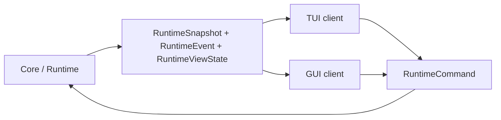

# Viden UI Collaboration Guide

Chinese version: [ui-collaboration-guide.zh-CN.md](ui-collaboration-guide.zh-CN.md)

This guide is for people and coding agents developing Viden TUI and GUI clients
in parallel. It keeps UI work fast without breaking the core/runtime boundary
or creating a second business-logic path.

## One Rule

UI renders state and sends intent. Provider loops, tool execution, permission
decisions, workflow state, context reduction, evidence verification, and Merge
Gate decisions belong to core/runtime.



## Required Reading

- [AGENTS.md](../AGENTS.md): repository rules, tests, and release/Homebrew policy.
- [Development Standards](development-standards.md): documentation, comments,
  tests, and delivery requirements.
- [Parallel Development Plan](parallel-development-plan.md): concurrent branch plan.
- [Frontend Integration Contract](frontend-integration-contract.md): runtime
  contract consumed by TUI/GUI.
- [Architecture](architecture.md): module boundaries.
- [GUI Version Functional Design](gui-version-functional-design.md): GUI product design.
- [Viden Design Reference](viden-design/Viden/docs/DESIGN-REF.md): visual source.
- [Context, Evidence, And Cost Engine
  Design](superpowers/specs/2026-07-18-context-evidence-cost-engine-design.md):
  canonical context, evidence, cost, and client projection rules.

When documentation and code disagree, current code, `frontend-integration-contract.*`,
and `AGENTS.md` have the highest implementation priority. Fix the contract or
documentation instead of bypassing the discrepancy.

## Project Boundary

| Path | Responsibility |
| --- | --- |
| `apps/cli` | Binary entrypoint, flags, and bootstrap. It may retain bootstrap dependencies. |
| `apps/tui` | Terminal rendering, input orchestration, panels, previews, and UI-only state. |
| `apps/gui` | Future desktop/web client with the same contract boundary. |
| `crates/core` | Stable runtime facade and client contract re-exports. |
| `crates/types` | Shared commands, events, snapshots, and view state. |
| `crates/runtime` | Session engine, command bus, provider/tool loop, and workflow routing. |
| `crates/context` | Canonical context storage, reduction, retrieval, quality, and cost. |
| `crates/provider` / `crates/tools` | Provider protocols and local tool implementations. |
| `crates/workflows` | Durable project tasks, memory, evidence, and workflow events. |

Frontend manifests may depend on `viden-core`, `viden-types`, configuration,
and UI-only crates. They must not depend directly on `viden-context`,
`viden-provider`, `viden-runtime`, `viden-tools`, or `viden-workflows`. Frontend
source imports the corresponding public contracts from `viden-core`.

UI work normally changes `apps/tui` or `apps/gui`. If a client needs a new
business fact, add it to the shared core contract first in a core/runtime
change, with replay fixtures and tests.

## Branch And Integration Order

Use isolated `codex/*` branches and `.worktrees/*` worktrees. Recommended owners:

| Branch | Owner | Scope |
| --- | --- | --- |
| `codex/viden-core-runtime` | Core | Runtime contract, plugins, migration, fixes. |
| `codex/viden-tui-client` | TUI | Rendering, input, panes, scrollback, status, errors. |
| `codex/viden-gui-tauri-client` | GUI | Settings, agent board, evidence, approvals, providers/models. |
| `codex/integration-v0.3.x` | Integration | Core/TUI/GUI merge, parity, and release gates. |

Merge core/runtime first, then TUI, GUI, docs/release gates, and finally main.
UI branches do not introduce private substitutes for a missing runtime fact.

## UI State Boundary

UI may own layout, focus, selection, filtering, sorting, panel expansion,
scrollback, hover/pressed state, temporary input, and visual transitions.

Core/runtime owns provider activity, tool authorization, mutation permission,
task completion, evidence and Merge Gate status, transcript persistence,
token/cost accounting, lane health, and provider/model availability.

## Runtime Contract

UI reads `RuntimeSnapshot`, ordered `RuntimeEvent` values, and
`RuntimeViewState`; replay uses `RuntimeViewState::apply_event`. UI sends
`RuntimeCommand` values, including:

- input, queue, cancellation, mode, permission, and approval commands;
- provider configuration and model selection/activation commands;
- Agent DAG/task start and cancellation commands;
- evidence, artifact review, Merge Gate, and patch merge commands;
- `RuntimeCommand::RetrieveContext { handle_id, reason }` for an explicit,
  audited canonical retrieval request.

A client never assumes success after sending a command. It waits for
`CommandAccepted` and subsequent state events, or renders `CommandRejected`
and its recovery information.

## Context, Evidence, And Cost Projection

The native engine decision and version allocation live in [Context, Evidence,
And Cost Engine
Design](superpowers/specs/2026-07-18-context-evidence-cost-engine-design.md).
Compact views are derived data; only canonical, verified evidence can satisfy a
Merge Gate.

Clients consume these replayable events:

- `ContextBundleBuilt`, `ContextItemStored`, and `ContextViewDerived`;
- `ContextReductionRecorded` and `ContextRetrieved`;
- `ContextBudgetExceeded` and `ContextQualityFailed`;
- `CostUsageRecorded` and `ProviderCacheObserved`;
- `EvidenceCanonicalized`.

`RuntimeViewState` exposes bounded client projections in `context_bundles`,
`context_handles`, `context_items`, `context_views`, `context_reductions`,
`context_retrievals`, `context_budgets`, `context_quality`, `cost_usage`,
`cost_ledger`, `provider_cache_observations`, and `canonical_evidence`.

The UI may render, filter, group, and request retrieval from these facts. It
must not read the context store, calculate authoritative cost, run reducers,
resolve storage paths, infer canonical verification, or mutate a Merge Gate.
Secret-bearing raw content must not be projected into view state.

## Evidence And Merge Gates

Evidence is append-only from the client perspective. Record evidence through
`RecordAgentEvidence`; accept/reject artifacts and Merge Gates only through
their runtime commands. The client renders `EvidenceRecorded`,
`EvidenceCanonicalized`, `MergeGateUpdated`, and task events without deriving a
gate result from identifiers, checklist state, or summary text.

## Mode, Permission, And Providers

Plan mode blocks mutating workflow, file, shell, Git, memory, and task changes.
Render mode and permission from runtime state and send their commands; never
call the permission engine from UI code.

Provider/model screens send runtime commands. Provider persistence, validation,
health, protocol behavior, and secret handling stay behind core/provider. API
keys are always masked in client-visible state.

## TUI And GUI Rules

The TUI main loop remains responsive while provider, tool, approval, context,
and lane work runs. It renders the event stream, handles long output and wide
characters, and supplies deterministic previews. Render/input code does not
run providers, tools, network work, or workflow reducers.

The GUI consumes the same `RuntimeViewState` through core/runtime or a future
IPC bridge. It replays the same fixtures as TUI and does not read workflow or
session databases, call providers/tools directly, or document mock state as a
landed feature.

## Verification

For shared contract or TUI work, run the relevant focused tests and:

```bash
scripts/check-task10-guards-test.sh
scripts/check-dependency-boundaries.sh
cargo fmt --all -- --check
git diff --check
cargo test --workspace --quiet
```

For edited long-lived documentation, also run `scripts/check-doc-pairs.sh` and
`scripts/check-doc-links.sh` with the edited Markdown paths. Visual behavior
changes require deterministic screenshots or previews. Release completion also
requires the repository's live DeepSeek, GitHub Release, and Homebrew gates.

## Documentation And Handoff

Update English and Chinese docs together when UI behavior, commands, events,
view state, provider/model/permission semantics, testing, release flow, or the
design source changes.

Every UI handoff records scope, commands used, events consumed, fixture changes,
UI-only state, core-owned state rendered, dependency-boundary confirmation,
visual evidence, tests, and bilingual documentation status.
