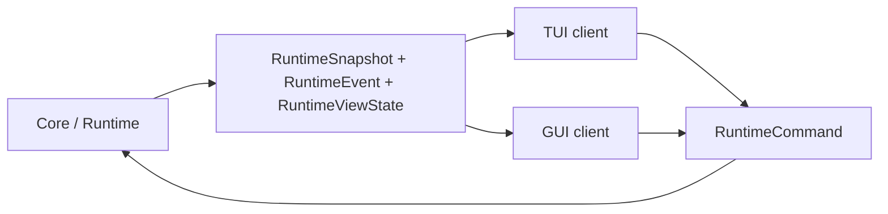

# Viden UI 协同开发指南

本文面向参与 Viden TUI/GUI 并行开发的人，以及他使用的 Codex agent。目标是让 UI
开发可以快速开始，同时不破坏 core/runtime 边界，不制造第二套业务逻辑。

## 一句话原则

UI 只负责渲染状态和发送意图。业务事实、provider loop、tool execution、permission
decision、workflow state、evidence reducer 和 merge gate 都必须属于 core/runtime。



## 必读文件

协作者和 Codex agent 开工前必须先读这些文件：

- [AGENTS.md](../AGENTS.md)：仓库级工作规则、测试要求、release/Homebrew 规则。
- [development-standards.zh-CN.md](development-standards.zh-CN.md)：文档、注释、测试和交付标准。
- [parallel-development-plan.zh-CN.md](parallel-development-plan.zh-CN.md)：多分支并发开发计划。
- [frontend-integration-contract.zh-CN.md](frontend-integration-contract.zh-CN.md)：TUI/GUI 必须消费的 runtime contract。
- [architecture.zh-CN.md](architecture.zh-CN.md)：模块边界和核心架构。
- [gui-version-functional-design.zh-CN.md](gui-version-functional-design.zh-CN.md)：GUI 功能设计。
- [Viden 设计接入](viden-design-adoption.zh-CN.md)：视觉真源优先级与 TUI/GUI 目标映射。
- [DESIGN-REF](viden-design/Viden/docs/DESIGN-REF.md)：token 与组件注册表。
- [Context、Evidence 与 Cost Engine 设计](superpowers/specs/2026-07-18-context-evidence-cost-engine-design.zh-CN.md)：
  canonical context、evidence、cost 与 client projection 规则。

如果这些文档和代码冲突，以当前代码、`frontend-integration-contract.*`、`AGENTS.md`
为优先级最高的开发依据。发现冲突时，不要绕过，先提交文档或 contract 修正。

## 当前项目状态

当前产品名是 Viden。Viden 只作为历史兼容名称存在。新 UI、新文档、新命令说明和新架构讨论都使用 Viden。

当前代码结构：

| 路径 | 责任 |
| --- | --- |
| `apps/cli` | 终端二进制入口、flags、bootstrap |
| `apps/tui` | 终端 UI 渲染、输入编排、面板、预览和 TUI-only state |
| `crates/core` | 稳定 runtime facade 和共享 contract re-export |
| `crates/runtime` | session engine、command bus、provider/tool loop、workflow routing |
| `crates/context` | canonical context storage、reduction、retrieval、quality 和 cost |
| `crates/types` | `RuntimeCommand`、`RuntimeEvent`、`RuntimeSnapshot`、`RuntimeViewState` 等共享类型 |
| `crates/provider` | provider abstraction、registry、protocol adapters |
| `crates/tools` | shell/file/search/web/Git 工具实现 |
| `crates/permissions` | permission mode、scope check、allow/ask/deny |
| `crates/session` | JSONL transcript 和可重建 SQLite index |
| `crates/workflows` | project task、memory、workflow event store |
| `crates/plugin-api` / `crates/plugin-host` | 插件 manifest、capability、permission、provider descriptor 边界 |

UI 开发默认只改 `apps/tui` 或未来 `apps/gui`，必要时改 `crates/types` 的 UI contract。
如果要改 `crates/runtime`、`crates/provider`、`crates/tools`、`crates/permissions`、
`crates/session` 或 `crates/workflows`，必须明确说明原因，并优先放在 core/runtime 分支完成。

Frontend manifest 只允许直接依赖 `viden-core`、`viden-types`、configuration 和
UI-only crates；不得直接依赖 `viden-context`、`viden-provider`、`viden-runtime`、
`viden-tools` 或 `viden-workflows`。Frontend source 从 `viden-core` 导入对应 public
contracts。`apps/cli` 可以保留 bootstrap 所需的直接依赖。

## 分支策略

`main` 是稳定集成线，只放已验证、可继续开发的结果。不要在 `main` 直接开发功能。

推荐长期并发分支：

| 分支 | Owner | 范围 |
| --- | --- | --- |
| `codex/v3-core-runtime` | core owner | runtime contract、plugin protocol、migration、bugfix |
| `codex/v3-tui-client` | TUI owner | terminal rendering、keyboard/input、panes、scrollback、status、errors |
| `codex/v3-gui-client` | GUI owner | framework-neutral cockpit、settings、decision、evidence、provider/model |
| `codex/integration-v0.3.x` | integration owner | 合并 core/TUI/GUI，跑 parity 和 release gates |

短期功能分支命名：

- core/runtime: `codex/v0.2.x-<topic>`
- TUI: `codex/tui-<topic>`
- GUI: `codex/gui-<topic>`
- contract/fixture: `codex/contract-<topic>`
- integration: `codex/integration-v<version>`

每个功能用独立 worktree：

```bash
git fetch origin
git switch main
git pull --ff-only origin main
git worktree add .worktrees/codex-tui-client -b codex/tui-client main
```

分支合并顺序固定为：

1. core/runtime
2. TUI client
3. GUI client
4. docs/release gate
5. main

GUI 不能先合入 main 再倒逼 core contract。TUI/GUI 如果需要新 runtime 能力，先让 core 分支加
`RuntimeCommand` / `RuntimeEvent` / fixture / tests。

## UI 与 Core 的边界

UI 允许拥有的状态：

- 布局、选中项、焦点、过滤、排序；
- 本地面板展开/折叠；
- scrollback 位置；
- hover/active/pressed 等纯交互态；
- 本地临时输入内容；
- 动画 frame 或视觉过渡状态。

UI 不允许拥有的状态：

- provider 正在做什么；
- tool 是否可以执行；
- permission 是否允许 mutation；
- workflow task 是否完成；
- evidence 是否满足 merge gate；
- transcript/session 是否持久化；
- token/cost 是否计入；
- lane/backend 是否健康；
- model/provider 是否真实可用。

这些事实必须来自 core/runtime event stream。

## Runtime Contract 使用方式

UI 读取：

- `RuntimeSnapshot`
- `RuntimeEvent`
- `RuntimeViewState`
- `RuntimeViewState::apply_event`

UI 发送：

- `RuntimeCommand::SubmitUserInput`
- `RuntimeCommand::QueueFollowUp`
- `RuntimeCommand::CancelActiveTurn`
- `RuntimeCommand::SetWorkMode`
- `RuntimeCommand::SetPermissionLevel`
- `RuntimeCommand::RespondToApproval`
- `RuntimeCommand::ConfigureProvider`
- `RuntimeCommand::SelectModel`
- `RuntimeCommand::ActivateModel`
- `RuntimeCommand::DeactivateModel`
- `RuntimeCommand::StartAgentDag`
- `RuntimeCommand::StartAgentTask`
- `RuntimeCommand::CancelAgentTask`
- `RuntimeCommand::RecordAgentEvidence`
- `RuntimeCommand::AcceptMergeGate`
- `RuntimeCommand::RejectMergeGate`
- `RuntimeCommand::AcceptAgentArtifact`
- `RuntimeCommand::RejectAgentArtifact`
- `RuntimeCommand::MergeAgentPatch`
- `RuntimeCommand::RetrieveContext { handle_id, reason }`

UI 不能在发送 command 后自行假设成功。必须等待：

1. `CommandAccepted`
2. 后续 `SnapshotUpdated` / `TaskUpdated` / `EvidenceRecorded` / `MergeGateUpdated` 等状态事件

如果收到 `CommandRejected`，UI 只展示 `reason` 和可恢复动作，不要本地回滚业务状态。

## Context、Evidence 与 Cost Projection

原生引擎决策和版本归属见 [Context、Evidence 与 Cost Engine
设计](superpowers/specs/2026-07-18-context-evidence-cost-engine-design.zh-CN.md)。Compact
view 是 derived data；只有经过 canonical verification 的 evidence 才能满足 Merge Gate。

UI 消费以下可 replay events：

- `ContextBundleBuilt`、`ContextItemStored`、`ContextViewDerived`；
- `ContextReductionRecorded`、`ContextRetrieved`；
- `ContextBudgetExceeded`、`ContextQualityFailed`；
- `CostUsageRecorded`、`ProviderCacheObserved`；
- `EvidenceCanonicalized`。

`RuntimeViewState` 提供有界 client projections：`context_bundles`、
`context_handles`、`context_items`、`context_views`、`context_reductions`、
`context_retrievals`、`context_budgets`、`context_quality`、`cost_usage`、
`cost_ledger`、`provider_cache_observations` 和 `canonical_evidence`。

UI 可以渲染、过滤、分组这些事实并发送 retrieval command，但不能直接读取 context
store、计算 authoritative cost、运行 reducer、解析 storage path、推断 canonical
verification 或修改 Merge Gate。Secret-bearing raw content 不得投影到 view state。

## Evidence / Merge Gate 规则

Evidence 是 append-only 的前端事实。UI 可以展示、过滤、分组，但不能绕过 core 修改 gate。

当前核心 evidence kind：

- `patch`
- `test_result`
- `review`
- `doc_update`
- `release_artifact`

记录外部证据必须发送 `RecordAgentEvidence`。Core 会发：

- `EvidenceRecorded`
- `MergeGateUpdated`
- `TaskUpdated`
- workflow event: `agent_evidence_recorded`

`MergeGateRecord.status` 由 core 根据已记录 evidence kind 自动归约：

- 缺证据：`collecting_evidence`
- 证据齐全：`accepted`
- 证据被拒：`needs_changes`
- patch 应用成功：`merged`

UI 不得通过 evidence id 后缀、前端 checklist 或按钮状态推断 gate 结果。

## Mode / Permission 规则

Mode 和 permission 是 product contract，不是 UI 装饰。

Plan mode 必须理解为：规划产品需求、架构、实现方案、写计划，不写代码。Plan mode 下不允许 mutating workflow、file、shell、Git、memory/task changes。

UI 必须从 `RuntimeSnapshot.work_mode` 和 `RuntimeSnapshot.permission_level` 渲染状态，切换时发送：

- `SetWorkMode`
- `SetPermissionLevel`

UI 不得直接调用 permission engine，也不得本地决定 tool 是否允许执行。

## Provider / Model 设置规则

Provider/model 交互应是可操作面板，不是信息页。

要求：

- `/connect` 面向 provider 连接和配置；
- `/provider` 面向 provider 查看、配置、诊断；
- `/models` / `/model` 面向已配置 provider 下的模型选择；
- provider 列表只显示供应商，不把 endpoint/key 状态塞在列表行里；
- provider detail 中可以设置或删除 API key、endpoint、默认模型；
- key 只显示脱敏形式，不能保存明文 key；
- OpenAI 等支持网页登录的 provider，要预留 login flow；API key provider 走 key 输入；
- 模型选择按 provider 分组，只显示已配置 provider 的模型；
- favorite/recent/current 不能重复显示。

UI 只发送 provider/model `RuntimeCommand`，实际保存、校验、doctor 和 health 都由 core/provider 层处理。

## TUI 开发规则

TUI 是 terminal client，不是 runtime owner。

TUI 必须：

- 主循环不阻塞；
- provider/tool/approval 运行期间 composer 仍可输入、排队、取消、滚动历史；
- 处理 event stream 后渲染；
- 对长输出和宽字符做稳定布局；
- 提供 deterministic preview/screenshot；
- 使用 Viden design source，不再延续 Viden 旧视觉方向。

TUI 不能：

- 在 render 层直接跑 provider；
- 在 input handler 里同步等待工具或网络；
- 维护自己的业务 task/evidence/merge gate 状态；
- 为了视觉推进绕开 runtime contract；
- 把 command completion 做成命令行补齐替代面板交互。

## GUI 开发规则

GUI 是 framework-neutral desktop client。GUI 不能复制 runtime。

GUI 必须：

- 通过 core/runtime API 或后续 IPC bridge 消费同一套 `RuntimeViewState`；
- 使用和 TUI 等价的 replay fixture 做 parity；
- 把 cockpit、settings、agent board、evidence center、approval、provider/model 都建在 contract 上；
- 使用 Viden GUI design source；
- 对截图和视觉 fidelity 做可重复验证。

GUI 不能：

- 直接读写 workflow/session 数据库；
- 直接调用 provider 或 tool；
- 自建和 runtime 不一致的 task/evidence 状态机；
- 把 mock 数据当成已实现功能写入用户文档。

## 设计源和视觉要求

当前有效设计源：

- `docs/viden-design/Viden/docs/SPEC.md`
- `docs/viden-design/Viden/docs/DESIGN-REF.md`
- `docs/viden-design/Viden/docs/screens-status.js`
- `docs/viden-design/Viden/tokens.css`
- TUI 统一原型、组件库与 T4 交互规则；
- GUI D1、组件库以及 D2/D4/D10/D11/D12/D13/D14；
- `docs/viden-design/reference-shots/` 只作为活体源的评审快照。

无效方向：

- 旧 Viden 视觉方案；
- 旧 `docs/design` / `design-system` 方案；
- 未经确认的临时 mock。

UI 开发应先对齐目标图，再实现。避免效果图和最终 UI 不一致的基本办法：

- 先拆 tokens、spacing、layout constraints；
- 组件命名和设计源一致；
- 每个关键屏有 fixture 和 screenshot；
- PR 里附 before/after 截图；
- 不允许“差不多”的静态信息页替代可操作面板。

## 测试要求

改 shared contract：

```bash
cargo fmt --all --check
cargo test -p viden-types
cargo test -p viden-runtime
```

改 TUI：

```bash
cargo fmt --all --check
cargo test -p viden-tui
```

同时补 deterministic preview/screenshot。生成物只属于实现回归证据，输出到测试 artifact
目录；当前视觉目标始终回链到 [Viden 设计接入](viden-design-adoption.zh-CN.md)。

改 GUI：

- 跑 GUI unit/component tests；
- 跑 runtime fixture replay；
- 产出截图；
- 对照 Viden GUI design source。

合入 main 前：

```bash
cargo fmt --all --check
git diff --check
cargo test --workspace --quiet
```

同时运行：

```bash
scripts/check-task10-guards-test.sh
scripts/check-dependency-boundaries.sh
```

长期文档有改动时，还要用编辑过的 Markdown 路径运行 `scripts/check-doc-pairs.sh` 和
`scripts/check-doc-links.sh`。

发布前还必须跑真实 DeepSeek development smoke，并记录 token、费用、耗时、失败分类。GitHub Release 和 Homebrew tap 必须作为同一个发版单元验证。

## 文档要求

以下情况必须同步更新 docs：

- 改 UI 行为、快捷键、命令、面板或 workflow；
- 改 runtime command/event/snapshot；
- 改 provider/model/permission/mode 语义；
- 改 testing/release/install 流程；
- 改设计源或视觉目标。

面向用户或长期维护的文档要同步英文和中文。如果只先写中文，PR 说明里必须标出英文缺口。

## 给协作者 Codex Agent 的启动提示

可以把下面这段作为协作者的 Codex agent 开工提示：

```text
你正在开发 Viden UI。先阅读 AGENTS.md、docs/ui-collaboration-guide.zh-CN.md、
docs/frontend-integration-contract.zh-CN.md、docs/parallel-development-plan.zh-CN.md、
docs/development-standards.zh-CN.md，以及 docs/viden-design/Viden/docs/DESIGN-REF.md。

只在独立 codex/* 分支和 .worktrees/* worktree 中开发。不要在 main 直接改。
TUI/GUI 只消费 RuntimeSnapshot、RuntimeEvent、RuntimeViewState，并发送 RuntimeCommand。
不要直接调用 provider/tool/permission/workflow/session internals。
如果 UI 需要新业务事实，先提出 core contract 变更，不要在 UI 分支自建私有状态。
改行为必须补测试和 docs，用户文档中英文同步。完成前跑 cargo fmt、focused tests、
git diff --check；共享 runtime 改动要跑 cargo test --workspace --quiet。
```

## PR / Handoff 模板

每个 UI 分支交付时用这个模板：

```markdown
## Scope
- TUI / GUI / core contract:
- User-visible behavior:

## Runtime Contract
- Commands used:
- Events consumed:
- New contract changes:
- Fixture updated:

## UI State Boundary
- UI-only state added:
- Core-owned state rendered:
- Confirmed no direct provider/tool/permission/workflow/session internals:

## Visual Evidence
- Design source:
- Screenshots/previews:
- Known fidelity gaps:

## Tests
- [ ] cargo fmt --all --check
- [ ] git diff --check
- [ ] focused tests
- [ ] workspace tests if shared runtime changed
- [ ] screenshot/preview gate if visual behavior changed

## Docs
- Updated:
- English/Chinese parity:
```

## 需要立即升级的协同规范

后续建议把这些规则固化为自动检查：

- UI app dependency guard：`apps/tui` 和未来 `apps/gui` 不允许直接依赖 runtime/provider/tool/workflow internals。
- Runtime fixture parity：同一 fixture 下 TUI/GUI 展示相同事实。
- Contract change gate：`RuntimeCommand` / `RuntimeEvent` 变更必须更新 `frontend-integration-contract.*`。
- Screenshot gate：TUI/GUI 视觉改动必须提交可复现截图。
- Release gate：GitHub Release 和 Homebrew tap 必须同步完成。
