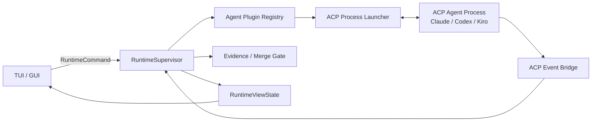

# Zed ACP Integration Research

Chinese version: [zed-acp-integration-research.zh-CN.md](zed-acp-integration-research.zh-CN.md)

Status: design research, current as of 2026-07-07.

## Purpose

This note clarifies how Zed currently integrates external agents through ACP,
where the ACP ecosystem is heading, and how Viden should design its first usable
Claude, Codex, and Kiro CLI adapters without coupling the feature to TUI or GUI
implementation details.

## Primary Sources

- Zed External Agents documentation:
  <https://zed.dev/docs/ai/external-agents>
- ACP architecture and protocol v1:
  <https://raw.githubusercontent.com/agentclientprotocol/agent-client-protocol/main/docs/get-started/architecture.mdx>
  and
  <https://raw.githubusercontent.com/agentclientprotocol/agent-client-protocol/main/docs/protocol/v1/overview.mdx>
- ACP registry documentation and current registry data:
  <https://raw.githubusercontent.com/agentclientprotocol/agent-client-protocol/main/docs/get-started/registry.mdx>
  and <https://cdn.agentclientprotocol.com/registry/v1/latest/registry.json>
- ACP v2 RFD:
  <https://raw.githubusercontent.com/agentclientprotocol/agent-client-protocol/main/docs/rfds/v2/overview.mdx>
- ACP proxy-chain RFD:
  <https://raw.githubusercontent.com/agentclientprotocol/agent-client-protocol/main/docs/rfds/proxy-chains.mdx>
- Zed source paths inspected:
  `crates/agent_servers/src/agent_servers.rs`,
  `crates/agent_servers/src/acp.rs`,
  `crates/agent_servers/src/custom.rs`,
  `crates/acp_thread/src/connection.rs`,
  `crates/acp_thread/src/acp_thread.rs`,
  `crates/project/src/agent_server_store.rs`,
  `crates/project/src/agent_registry_store.rs`, and
  `crates/settings_ui/src/pages/external_agents_page.rs`.
- Kiro CLI official ACP documentation:
  <https://kiro.dev/docs/cli/acp/>.

## Zed Current Path

Zed treats ACP agents as external processes. Zed hosts the thread UI and thread
history, while the external agent usually owns its own runtime, authentication,
model selection, provider billing, tools, and native configuration.

The current Zed product path is:

1. Install common agents from the ACP Registry.
2. Add custom ACP agents through `agent_servers` settings when an agent is not
   in the registry.
3. Start an external-agent thread from the Agent Panel or Threads Sidebar.
4. Connect to the agent as a subprocess over stdin/stdout JSON-RPC.
5. Forward session prompts and receive live `session/update` notifications.
6. Let the agent request editor-side permissions, file access, terminal actions,
   and other client capabilities through ACP.
7. Debug the wire protocol through ACP logs.

Important product boundary: Zed explicitly says extension-provided agents are
deprecated. The ACP Registry is now the primary installation path, and older
extension agents are migrated to registry equivalents where possible.

## Zed Code Shape

Zed's implementation has a clean three-layer split that Viden should preserve
conceptually without copying GPUI internals:

| Zed area | Responsibility | Viden analogue |
| --- | --- | --- |
| `agent_servers` | Register external agents, resolve registry/custom command specs, inject environment, connect subprocesses. | `plugin-host` plus an external-agent registry and process launcher. |
| `acp_thread` | Define `AgentConnection`, session lifecycle, auth, prompt/cancel, model selector, session config, elicitations, tool calls, diffs, terminals, and debug events. | A new runtime-owned external-agent connection layer that emits `RuntimeEvent` and accepts `RuntimeCommand`. |
| `agent_ui` / settings UI | Render external agents, configuration, registry install, model/config selectors, thread views, and ACP logs. | TUI/GUI subscribe to `RuntimeViewState`; they do not talk to ACP subprocesses directly. |
| `AgentRegistryStore` | Fetch registry data, normalize binary/NPX distributions, cache metadata, icons, and versions. | A Viden registry reader that produces plugin manifests and install/update status. |
| `AgentServerStore` | Own installed external-agent entries, custom-vs-registry source, migration from legacy extension agents, and command resolution. | A Viden agent plugin registry with custom/local/registry sources. |

Key Zed trait boundaries:

- `AgentServer` connects an installed agent into an `AgentConnection`.
- `ExternalAgentServer` resolves an executable command plus args/env.
- `AgentConnection` owns `new_session`, `load_session`, `resume_session`,
  `close_session`, `auth_methods`, `authenticate`, `logout`, `prompt`,
  `cancel`, `model_selector`, `session_modes`, `session_config_options`, and
  `session_list`.

Viden should mirror the capability boundaries, not the exact trait names or GPUI
entity model.

## ACP v1 Contract To Support First

ACP v1 uses JSON-RPC 2.0 over a subprocess transport. Baseline agent methods are:

- `initialize`
- `authenticate`
- `session/new`
- `session/prompt`

Common optional methods include:

- `session/load`
- `logout`
- `session/set_mode`
- `session/set_model` where an agent exposes model switching
- `session/cancel`

Client-side methods and notifications include:

- `session/request_permission`
- `fs/read_text_file`
- `fs/write_text_file`
- `terminal/create`
- `terminal/output`
- `terminal/release`
- `terminal/wait_for_exit`
- `terminal/kill`
- `session/update`

`session/update` is the main stream for UI and runtime facts. It can carry
message chunks, tool calls, plans, advertised commands, and mode changes. ACP
paths are absolute and line numbers are 1-based.

## ACP Future Path

ACP v2 is active and intentionally breaking. Viden should design the adapter so
v1 and v2 can coexist behind a versioned protocol layer.

Changes that matter for Viden:

- Dedicated session modes are removed in favor of session config options.
- Model-like state should also be exposed through session config options.
- v2 removes the v1 client filesystem and terminal execution surface from the
  core protocol; terminal authentication remains separate.
- Tool calls become upsert-style updates keyed by tool-call id.
- Tool-call content can stream as chunks.
- Diffs move toward renderable git patches plus structured file operations.
- Permission requests get a required title and optional structured subject.
- Message chunks require message ids, and whole-message updates become upserts.
- Baseline session support requires `session/new`, `session/list`,
  `session/resume`, `session/close`, `session/prompt`, `session/cancel`, and
  `session/update` when the session capability is present.
- Initialization capability fields are cleaned up under a unified
  `capabilities` shape.

The proxy-chain RFD is also important for Viden's later plugin architecture.
It proposes a conductor that sits between client, proxies, and the final agent.
This maps well to Viden's long-term goal of context injection, tool policy,
response filtering, and multi-agent coordination as reusable extensions.

## First Agent Targets

| Agent | Current best path | Notes |
| --- | --- | --- |
| Claude | ACP Registry package `@agentclientprotocol/claude-agent-acp@0.56.0` from current registry data. | Agent owns auth/billing/model behavior. Viden should not assume Viden's Anthropic provider key config applies. |
| Codex | ACP Registry package `@agentclientprotocol/codex-acp@1.1.0` from current registry data. | Agent owns Codex/OpenAI auth and native config. Viden should still pass safe proxy/env and route permissions through runtime. |
| Kiro CLI | Official local ACP command `kiro-cli acp`; also support `kiro-cli acp --agent <name>` for selected agent configuration. | Kiro officially supports ACP over stdio JSON-RPC and documents Zed custom-agent setup. Current ACP Registry data did not include a Kiro entry, so Viden should ship it as a local-command agent source first, while keeping the registry source pluggable if metadata appears later. |

## Kiro-Specific Adapter Requirements

Kiro CLI is not an uncertain generic CLI path. Its official documentation says
it implements ACP and can be spawned as:

```bash
kiro-cli acp
kiro-cli acp --agent my-agent
kiro-cli acp --model <model-id>
kiro-cli acp --effort high
kiro-cli acp --trust-tools fs/read_text_file,terminal/create
kiro-cli acp --trust-all-tools
kiro-cli acp --agent-engine v3
```

The Kiro process communicates over stdin/stdout with JSON-RPC 2.0. Its documented
core methods include:

- `initialize`;
- `session/new`;
- `session/load`;
- `session/prompt`;
- `session/cancel`;
- `session/set_mode`;
- `session/set_model`.

Kiro advertises `loadSession: true` and image prompt capability during
initialization. It streams `AgentMessageChunk`, `ToolCall`, `ToolCallUpdate`,
and `TurnEnd` session updates.

Kiro's public documentation shows a `session/prompt` request with a `content`
array, but Kiro CLI 2.10.0 currently rejects that shape with
`missing field prompt`. Viden therefore follows the live wire behavior and sends
`prompt` arrays for Kiro, Codex, and Claude unless a future descriptor declares a
separate content-array compatibility capability.

Kiro also exposes experimental `_kiro.dev/*` extensions. Viden should treat
these as optional capabilities behind adapter feature flags, not as baseline ACP
requirements:

- `_kiro.dev/commands/available`, `_kiro.dev/commands/options`, and
  `_kiro.dev/commands/execute` for slash-command discovery, completion, and
  execution;
- `_kiro.dev/mcp/oauth_request` and `_kiro.dev/mcp/server_initialized` for MCP
  server events;
- `_kiro.dev/compaction/status`, `_kiro.dev/clear/status`, and
  `_session/terminate` for session lifecycle and subagent signals.

Viden implications:

- `session/set_model` must be modeled as an agent-session config operation, not
  as a Viden provider/model switch.
- `VIDEN_KIRO_AGENT=<name>` selects the official `kiro-cli acp --agent <name>`
  path for local smoke and operator-specific Kiro configurations.
- `VIDEN_KIRO_MODEL`, `VIDEN_KIRO_EFFORT`, `VIDEN_KIRO_TRUST_TOOLS`,
  `VIDEN_KIRO_TRUST_ALL_TOOLS`, and `VIDEN_KIRO_AGENT_ENGINE` map to Kiro's
  documented ACP launch flags. `VIDEN_KIRO_TRUST_ALL_TOOLS=true` takes
  precedence over `VIDEN_KIRO_TRUST_TOOLS` so Viden never sends two trust
  strategies at once.
- `/agent auth acp kiro-cli` should be a native-login guide, not an ACP
  `authenticate` call, because Kiro owns credentials and login state outside
  Viden. The expected operator path is `kiro-cli login --use-device-flow`,
  `kiro-cli doctor`, then `/agent smoke acp --live`.
- Kiro slash-command support should enter through an ACP extension capability
  and still emit normal `RuntimeEvent` and evidence records.
- Kiro MCP events should be visible in runtime logs and UI state, but MCP
  credentials and OAuth prompts must still route through Viden permission/auth
  boundaries.
- Kiro session files live under Kiro's own session storage. Viden should record
  the ACP session id and log references in Viden transcripts, but should not
  claim Kiro's native history as Viden-owned durable history.

## Viden Design Decision

Viden should implement external agents as plugins/extensions, but the actual
runtime path must be core-owned:



Core rules:

- UI apps never spawn or parse ACP agents directly.
- Agent plugins declare capabilities, auth modes, command source, permissions,
  supported protocol versions, and evidence behavior.
- The runtime owns `session/new`, `session/prompt`, cancellation, permission
  requests, evidence conversion, transcript entries, and merge-gate updates.
- External agents cannot mutate files through a side channel. ACP file, terminal,
  tool, and permission requests must be converted to Viden runtime tool requests
  or rejected by policy.
- Claude/Codex/Kiro config must stay agent-native where the agent owns auth and
  provider routing. Viden only stores launch configuration, defaults, and safe
  environment references.
- ACP logs are first-class debug evidence and should be available from TUI/GUI.

## Implementation Plan

### Current Foundation Landing

The first core slice is implemented as shared runtime infrastructure, not as
TUI command glue:

- `plugin-api` defines `AgentPluginDescriptor`, source, transport, auth,
  capability, protocol-version, command, and permission-profile contracts.
- `plugin-host` ships built-in ACP descriptors for `claude-acp`, `codex-acp`,
  and `kiro-cli`.
- `VIDEN_AGENT_ACP_COMMAND` is promoted into a runnable `custom-acp` local
  descriptor so custom/plugin ACP agents can use the same runtime path.
- `runtime` exposes these descriptors through `/agent list` and
  `/agent doctor <id>`.
- `runtime` can run an ACP `initialize` probe from a descriptor-backed command
  through `/agent probe acp <agent-id>`, and writes JSONL wire evidence.
- `runtime` can run a minimal descriptor-backed ACP session with
  `/agent run acp <agent-id> <task>`, using `session/new`, `session/prompt`,
  streamed `session/update`, and TurnEnd collection.
- `runtime` can run descriptor-backed ACP sessions against existing agent
  sessions with `/agent run acp --load-session <session-id> <agent-id> <task>`.
  The same path can apply `--mode <mode-id>` through `session/set_mode` and
  `--model <model-id>` through the ACP `session/set_config_option` model config,
  with legacy `session/set_model` available as a compatibility request builder.
- `runtime` can start a background descriptor-backed ACP session with
  `/agent run acp --async <agent-id> <task>`, record it as a tracked agent job,
  write JSONL/result artifacts, persist projected runtime events, and stop it
  through `/agent cancel <id>`.
- ACP background cancellation now requests protocol-level `session/cancel`
  first when the live ACP session is available, records that request in the wire
  log, and then uses bounded process termination as a fallback if the external
  agent does not stop promptly.
- `runtime` converts ACP `session/request_permission` into Viden
  `PermissionPrompt` approvals and responds with the selected allow/reject ACP
  option.
- `runtime` projects tracked ACP session jobs into `RuntimeViewState` as
  `AgentTask` records, so TUI and GUI clients can consume them through the same
  state stream as first-party runtime tasks.
- `runtime` projects ACP `session/update` / `session/notification` payloads into
  reusable `RuntimeEvent` records for assistant deltas, tool call start/finish,
  and turn-end evidence.
- background ACP session jobs append projected events to `runtime-events.jsonl`
  as updates arrive, and `RuntimeViewState` replays those events so TUI/GUI
  clients can show ACP assistant output, tool evidence, and turn-end evidence
  through the same runtime-state path as synchronous work.
- background ACP session jobs also push projected events through the live
  `RuntimeSupervisor` event stream as updates arrive, so TUI/GUI clients can
  render assistant deltas before the result artifact is complete.
- `runtime` bridges ACP `fs/read_text_file` and `fs/write_text_file` through
  Viden permission checks.
- `runtime` bridges ACP `terminal/create`, `terminal/input`,
  `terminal/write`, `terminal/output`, `terminal/wait_for_exit`,
  `terminal/release`, and `terminal/kill` through Viden permission checks.
  `terminal/create` starts a tracked process without waiting for exit,
  `terminal/input` / `terminal/write` write to that process stdin,
  `terminal/output` polls buffered stdout/stderr, and `terminal/wait_for_exit`
  / `terminal/kill` update process status for long-running commands.
  Unsupported filesystem or terminal methods still receive explicit JSON-RPC
  errors and wire-log evidence.
- descriptor-backed ACP handshakes use longer startup timeouts for registry
  packages than local commands because `npx` cold-start installation can be a
  real part of readiness.
- `/agent doctor kiro-cli` reports Kiro as `installed; auth unknown` and points
  the operator to `kiro-cli login` / `kiro-cli doctor`; binary presence alone is
  not treated as proof that ACP sessions can run.
- TUI agent-task projection now distinguishes `acp-session` jobs from Codex
  jobs, so ACP jobs render as ACP transport instead of Codex app-server work.
- ACP session output is mapped into merge-gate records. Each ACP session
  proposes a session merge gate, completed tool updates become `tool_log`
  evidence, `TurnEnd` becomes `acp_turn_end` evidence, and the gate becomes
  `Accepted` once turn-end evidence is present.
- ACP patch/diff updates now become `patch` evidence when an update carries a
  unified diff through `diff`, `patch`, `unifiedDiff`, or nested file-change
  payload fields. Patch-producing ACP sessions require both `patch` and
  `acp_turn_end` evidence before the session gate is accepted. Patch evidence
  also carries `acp.patch.v1` metadata with file stats, hunk count, changed
  paths, origin tool-call id, and the source unified diff, so TUI/GUI and merge
  gates do not need to parse human summary text.

This is still a foundation slice. The next delivery step is expanding terminal
bridging toward PTY-level interactive sessions where required. Authenticated
Claude, Codex, and Kiro ACP live smoke now passes in the current operator
environment.

### Current Local Smoke Evidence

The current local environment proves first-batch ACP adapters are usable through
initialize and session-level live smoke:

- `viden-cli --no-tui` can list built-in ACP descriptors for `claude-acp`,
  `codex-acp`, and `kiro-cli`.
- `/agent smoke acp --live` passes for `claude-acp`, `codex-acp`, and
  `kiro-cli` in this environment. Claude and Codex report usage; Kiro returns
  `end_turn` with usage unavailable.
- `codex-acp` initialize and session-level smoke now succeed locally against
  `@agentclientprotocol/codex-acp@1.1.0`. The real session smoke completed
  `session/new -> session/prompt -> session/update -> id:2 final response`,
  returned `end_turn`, and reported usage.
- `claude-acp` initialize and session-level smoke now succeed locally against
  `@agentclientprotocol/claude-agent-acp@0.56.0`.
- `kiro-cli` session-level smoke now succeeds against the installed local Kiro
  CLI. The installed Kiro CLI 2.10.0 rejects the documentation-shaped
  `content` parameter with `missing field prompt`, so Viden sends a `prompt`
  array for Kiro until a future descriptor capability proves a different wire
  shape.
- `kiro-cli doctor` can still report shell integration warnings such as missing
  terminal integration hooks. Those warnings are tracked as environment
  diagnostics, not as ACP live-smoke blockers while `kiro-cli acp` sessions pass.
- Registry-backed startup uses a project-scoped npm cache under
  `.viden/cache/npm` so a broken global `~/.npm/_npx` cache does not make
  ACP readiness fail before the package runs.
- Protocol compatibility fixes verified against real Codex ACP: `mcpServers`
  must be an array, `session/prompt` uses a `prompt` array, and Codex can finish
  turns through `sessionUpdate: agent_message_chunk` plus the `id:2` response
  instead of a `TurnEnd` update.
- Kiro compatibility fixes covered by fake server tests: `kiro-cli` sends
  `session/prompt` with `prompt`, accepts Kiro-style `session/notification`,
  collects both `ToolCall` and `ToolCallUpdate`, and supports
  `VIDEN_KIRO_AGENT` for `kiro-cli acp --agent <name>`.
- Kiro official launch options are descriptor-backed and covered by fake tests:
  `VIDEN_KIRO_MODEL`, `VIDEN_KIRO_EFFORT`, `VIDEN_KIRO_TRUST_TOOLS`,
  `VIDEN_KIRO_TRUST_ALL_TOOLS`, and `VIDEN_KIRO_AGENT_ENGINE` map to the
  corresponding `kiro-cli acp` flags.
- ACP async job cancellation now sends `session/cancel` before falling back to
  process termination, and the wire log preserves the cancellation request.
- ACP session restore/configuration is covered by fake server tests:
  `--load-session` sends `session/load` with `cwd`, `mcpServers`, and
  `sessionId`; `--mode` sends `session/set_mode`; and `--model` sends
  `session/set_config_option` for `configId: model`.
- Custom/local ACP command support is covered by fake server tests:
  `VIDEN_AGENT_ACP_COMMAND` becomes `custom-acp` and can run through
  `/agent run acp custom-acp <task>`.
- ACP runtime event projection is covered by fake server tests: Kiro-style
  notifications produce assistant delta, tool start/finish, and turn-end
  evidence events.
- ACP patch evidence projection is covered by fake server tests: diff-bearing
  updates produce `patch` evidence and patch-producing session gates require
  both `patch` and `acp_turn_end`.
- ACP background runtime-event replay is covered by fake server tests: async
  ACP jobs persist assistant events to `runtime-events.jsonl` while the job is
  still running, and `RuntimeViewState` replays assistant output plus turn-end
  evidence from that artifact.
- `/agent auth acp kiro-cli` now returns native login instructions instead of
  attempting ACP `authenticate`, avoiding a misleading initialize timeout for
  unauthenticated local Kiro installations.
- `/agent smoke acp` and `/agent smoke acp --live` now provide repeatable gate
  commands. The live gate passes Claude, Codex, and Kiro in the current
  environment; unauthenticated Kiro installations still return a non-zero
  blocked-auth result with native login guidance.
- Full release completion can now require the first-batch ACP live gate plus
  provider-native doctor diagnostics instead of treating Kiro as unverified.

### 0.2.4: ACP Foundation

- Add an `acp-client` or equivalent runtime submodule for JSON-RPC line
  transport, version negotiation, debug log capture, stderr tail, timeout, and
  cancellation.
- Extend `plugin-api` with agent plugin descriptors:
  `agent_id`, `display_name`, `source`, `transport`, `command`, `args`, `env`,
  `protocol_versions`, `auth_modes`, `capabilities`, and `permission_profile`.
- Extend `plugin-host` with registry/custom/local agent sources.
- Add deterministic fake ACP server tests for initialize, session/new,
  session/prompt streaming, Codex-style final responses, permission request,
  cancellation, stderr failure, and malformed JSON.
- Keep tracked ACP session jobs behind runtime view-state projection so TUI/GUI
  do not need to read job artifacts directly.
- Treat registry package cold-start and agent-native authentication as release
  smoke requirements, not just documentation assumptions.

### 0.2.5: First Usable Agents

- Add registry-backed Claude and Codex adapters.
- Add official local-command Kiro CLI ACP adapter with `kiro-cli acp`, optional
  `--agent`, `--model`, `--effort`, `--trust-*`, `--agent-engine`,
  `session/set_mode`, `session/set_config_option` model config, session load,
  and `_kiro.dev/*` capability discovery.
- Add `/agent doctor` and runtime view-state entries for installed, missing,
  authenticated, unauthenticated, version, command, and protocol status.
- Support new session, prompt, streamed updates, explicit ACP `session/cancel`,
  `session/load`, `session/set_mode`, session model config, auth-required
  errors, and wire logs.
- Keep `/agent smoke acp --live` as the release gate for `claude-acp`,
  `codex-acp`, and `kiro-cli`; blocked-auth must fail the gate until the
  operator completes the provider-native login flow.

### 0.2.6: Permission, Evidence, Merge Gate

- Map ACP tool calls, plan updates, structured patch artifacts, and
  terminal/file requests into
  `AgentTask`, `Evidence`, `PermissionPrompt`, and `MergeGate`.
- Deny mutating requests in plan mode.
- Require explicit approval for external-agent file writes, shell execution,
  Git mutation, and memory/workflow changes.
- Record token/cost when the ACP agent reports usage; otherwise mark usage as
  unavailable rather than inventing values.

### 0.2.7: v2 Compatibility And Proxy Preparation

- Introduce protocol-version adapters so v1/v2 conversion is isolated.
- Prefer session config options for mode/model where supported.
- Reserve a conductor/proxy boundary for later context injection, tool policy,
  and response filtering.

## What Not To Copy From Zed

- Do not copy GPUI entity/task architecture into Viden.
- Do not make TUI/GUI the owner of external-agent lifecycle.
- Do not rely on registry-only installation; Kiro has official local ACP
  command support and internal agents also need custom/local command sources.
- Do not assume an external agent's provider config equals Viden's provider
  config.
- Do not expose ACP file/terminal capabilities before Viden permission and
  evidence gates can control them.

## Open Questions

- Whether Viden should vendor the ACP Rust schema crate or generate local types
  from schema snapshots.
- Whether registry installation should download/run NPX packages automatically
  or ask the user to confirm install commands first.
- How much of ACP terminal/file surface should be enabled before the
  permission/evidence bridge is mature.
- Whether Kiro's experimental `_kiro.dev/*` extensions should ship in the first
  Kiro adapter slice or behind a second capability flag after baseline ACP is
  stable.
